# 047：Constexpr

## 概述

在本节课中，我们将要学习C++中的编译时编程，特别是如何使用`constexpr`说明符。我们将探讨如何将计算从运行时移动到编译时，以提升程序的运行效率。

## 编译时编程与Constexpr简介

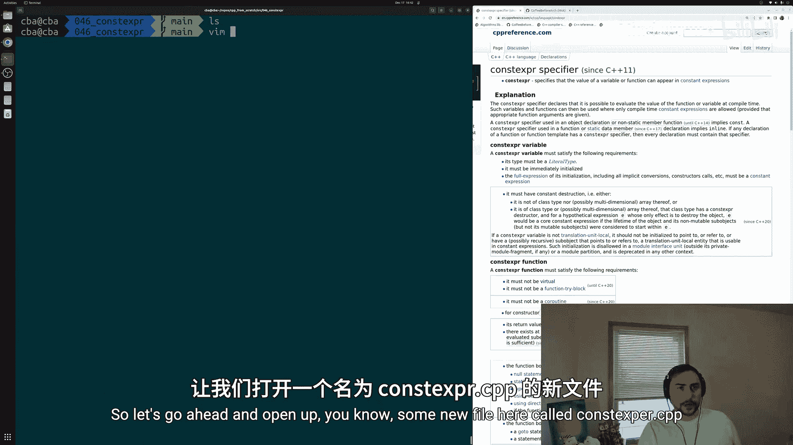

我们通常关心程序的运行时性能。提升性能的工具之一，是将运行时计算转移到编译时完成。其核心思想是：程序通常编译一次，但会运行多次。因此，我们宁愿在编译时支付一次计算成本，而不是在每次运行程序时都重复支付。

在C++中，实现这一目标的方法之一就是使用`constexpr`说明符。根据CPP参考页面的定义，`constexpr`说明符声明可以在编译时求值函数或变量的值。这正是在进行一种权衡：将开销从运行时转移到编译时。

## 一个简单的Constexpr示例

上一节我们介绍了`constexpr`的基本概念，本节中我们来看看一个具体的例子。

我们将创建一个计算整数`n`的阶乘的函数。阶乘是所有从`n`到`1`的正整数的乘积。例如，5的阶乘是 `5 * 4 * 3 * 2 * 1 = 120`。

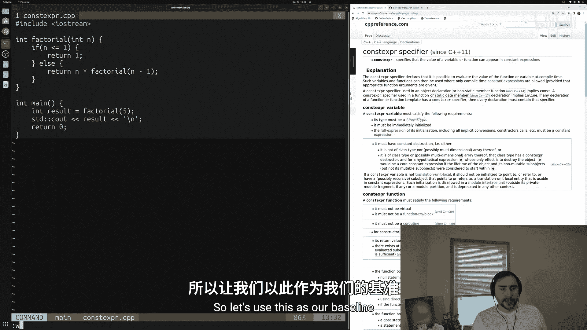

以下是实现递归阶乘函数的代码：

```cpp
#include <iostream>

int factorial(int n) {
    if (n <= 1) {
        return 1;
    } else {
        return n * factorial(n - 1);
    }
}

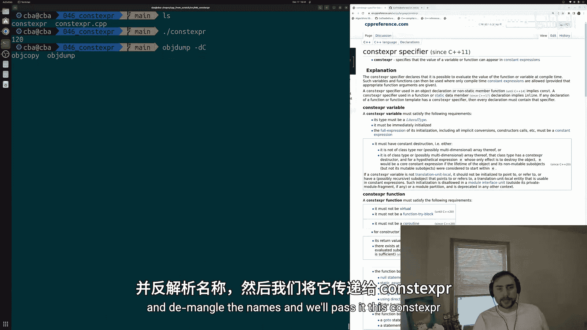

int main() {
    int result = factorial(5);
    std::cout << result << std::endl;
    return 0;
}
```

编译并运行此代码，会得到正确的结果`120`。这是标准的C++代码，使用了函数、变量和`std::cout`进行打印。

## 查看运行时行为

由于我们的目标是将计算从运行时转移到编译时，这种变化在高层次上不易察觉，但可以通过测量时间或查看底层汇编代码来观察。我们真正改变的是运行时执行的操作。

我们可以使用`objdump`工具来查看程序生成的汇编代码，了解程序在底层做了什么。在汇编代码的`main`函数中，我们可以看到对`factorial`函数的调用。这意味着每次运行程序，都会在运行时调用这个函数。

## 应用Constexpr

现在，我们希望将这个计算从运行时转移到编译时。我们不希望在运行时看到对`factorial`的调用，而只希望得到结果。

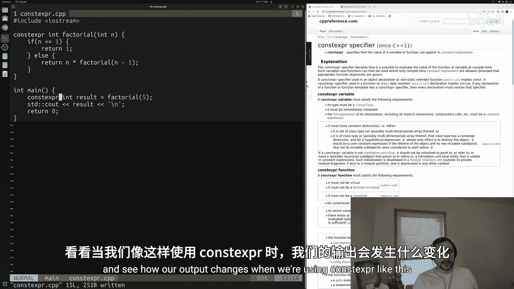

以下是修改后的代码，将函数和变量标记为`constexpr`：

```cpp
#include <iostream>

constexpr int factorial(int n) {
    if (n <= 1) {
        return 1;
    } else {
        return n * factorial(n - 1);
    }
}

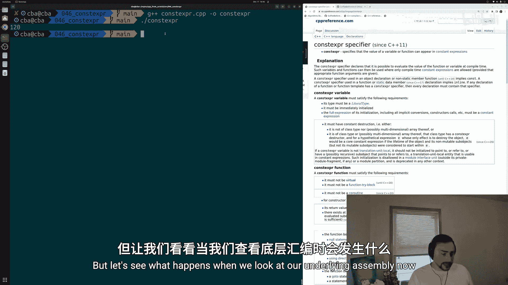

int main() {
    constexpr int result = factorial(5);
    std::cout << result << std::endl;
    return 0;
}
```

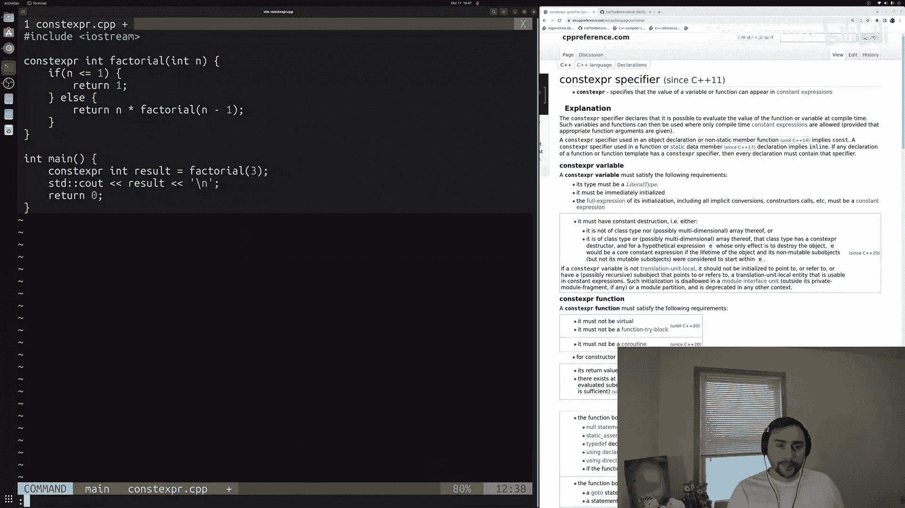

`constexpr`标记告诉编译器，可以在编译时求值这个函数或变量的值。我们允许编译器在编译时计算出`result`的值，而不是等到运行时再调用`factorial`函数。

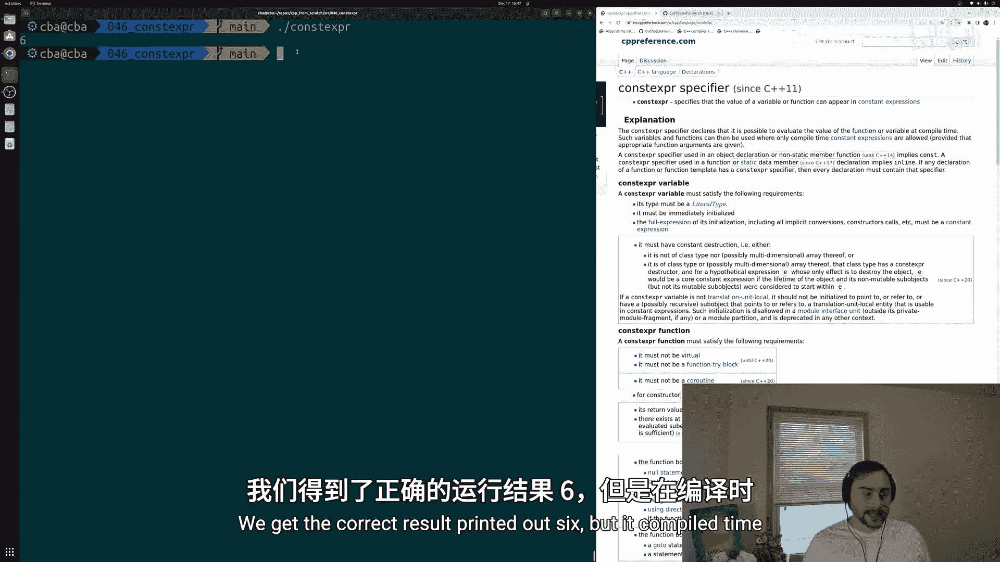

重新编译并运行代码，我们仍然得到相同的结果`120`。然而，查看新的汇编代码会发现显著不同：`main`函数中不再有对`factorial`的调用。相反，我们看到代码中直接使用了值`0x78`（即十进制的`120`）。这意味着编译器在编译时已经计算出了正确答案，并将其硬编码到最终的可执行文件中。

例如，如果将`factorial(5)`改为`factorial(3)`，重新编译后，汇编代码中会直接出现值`6`。这证明了原本在运行时进行的计算（调用阶乘函数）现在转移到了编译时。

## Constexpr的灵活性

如前所述，`constexpr`声明的是**可能**在编译时求值，但并非强制。对于`constexpr`函数，我们仍然可以在运行时使用它。因为我们不可能总是预先知道所有传递给函数的参数值，所以仍然需要能够处理运行时数据。

以下是一个同时使用编译时和运行时计算的例子：

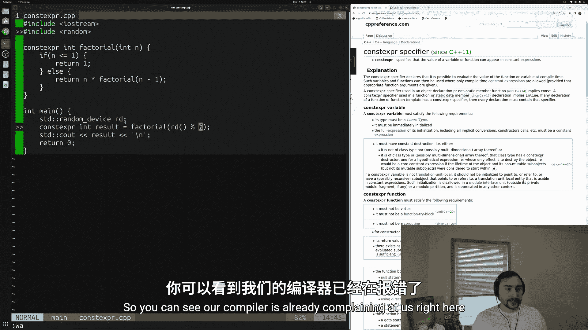

```cpp
#include <iostream>
#include <random>

constexpr int factorial(int n) {
    if (n <= 1) {
        return 1;
    } else {
        return n * factorial(n - 1);
    }
}

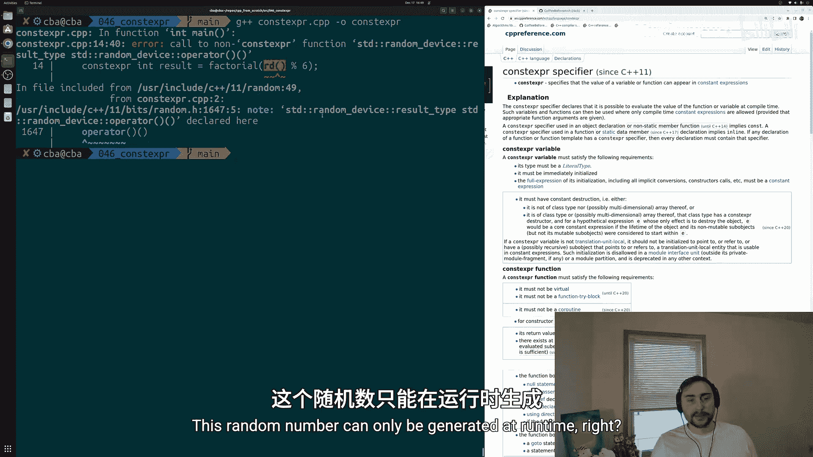

int main() {
    // 编译时计算
    constexpr int compile_time_result = factorial(5);
    std::cout << "Compile-time result: " << compile_time_result << std::endl;

    // 运行时计算
    std::random_device rd;
    int random_number = rd() % 6; // 生成一个0到5的随机数
    int runtime_result = factorial(random_number);
    std::cout << "Runtime result for " << random_number << "!: " << runtime_result << std::endl;

    return 0;
}
```

在这个例子中，`compile_time_result`是编译时常量。而`runtime_result`则依赖于运行时生成的随机数，因此它本身不能是`constexpr`变量，但`factorial`函数仍然可以被调用。`constexpr`函数是通用的，既可用于编译时上下文，也可用于运行时上下文。

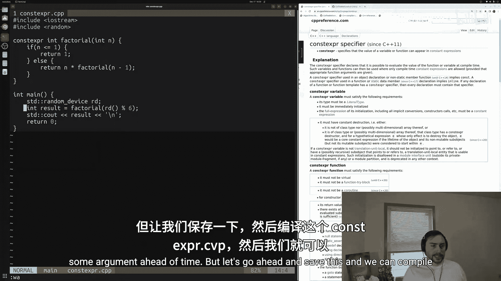

## 总结

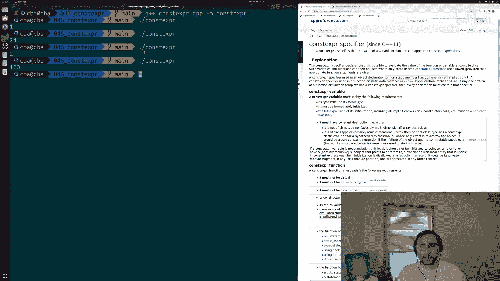

本节课中我们一起学习了C++中的编译时编程，重点掌握了`constexpr`说明符的用法。

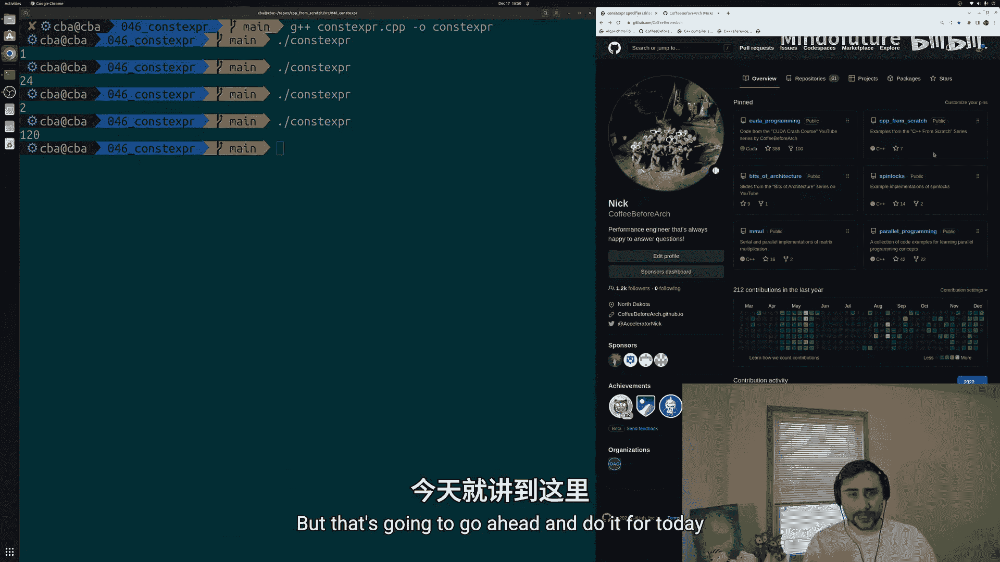

*   **核心概念**：`constexpr`用于声明可以在编译时求值的函数或变量，旨在将计算开销从运行时转移到编译时，从而提升程序运行效率。
*   **关键特性**：
    *   `constexpr`函数和变量为编译器提供了在编译期进行求值的可能性。
    *   `constexpr`函数具有灵活性，既可以在编译时使用（当参数是常量表达式时），也可以在运行时使用（当参数是运行时值）。
    *   通过查看汇编代码，可以直观验证计算是否被移到了编译时。
*   **应用价值**：对于一次编译、多次运行的程序，使用`constexpr`进行编译时计算是优化性能的有效工具之一。