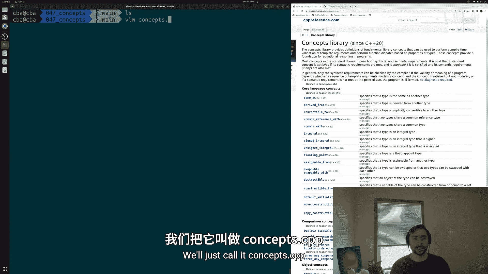
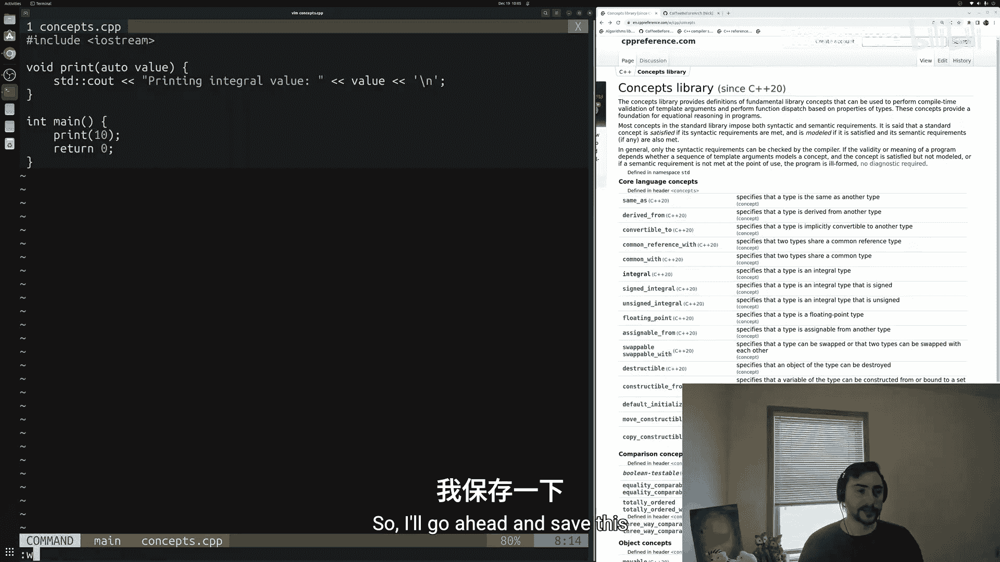
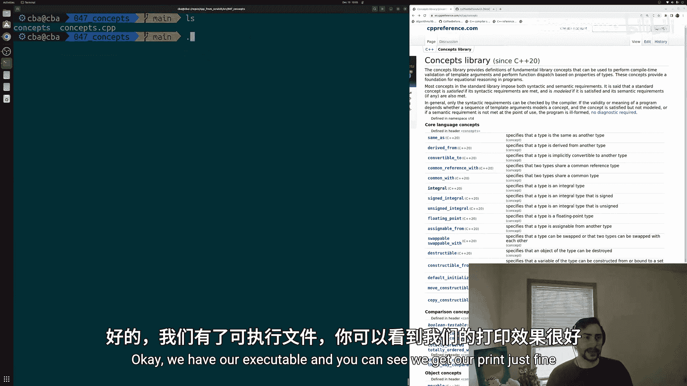
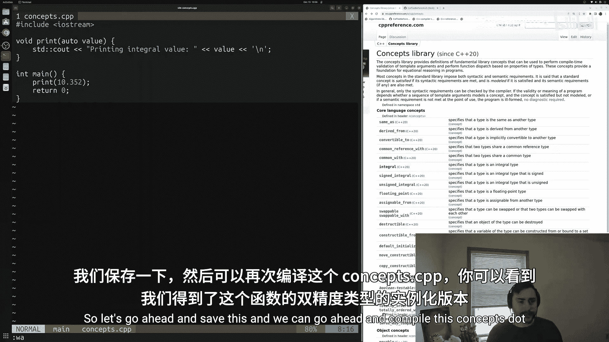
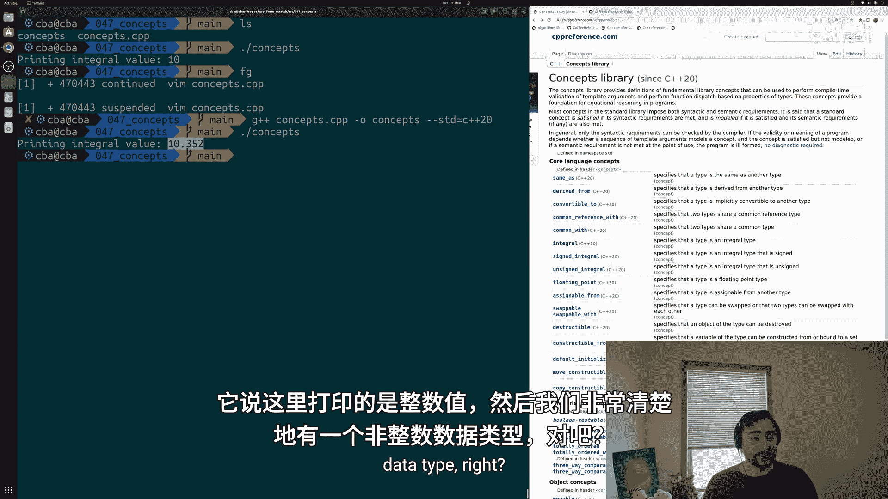
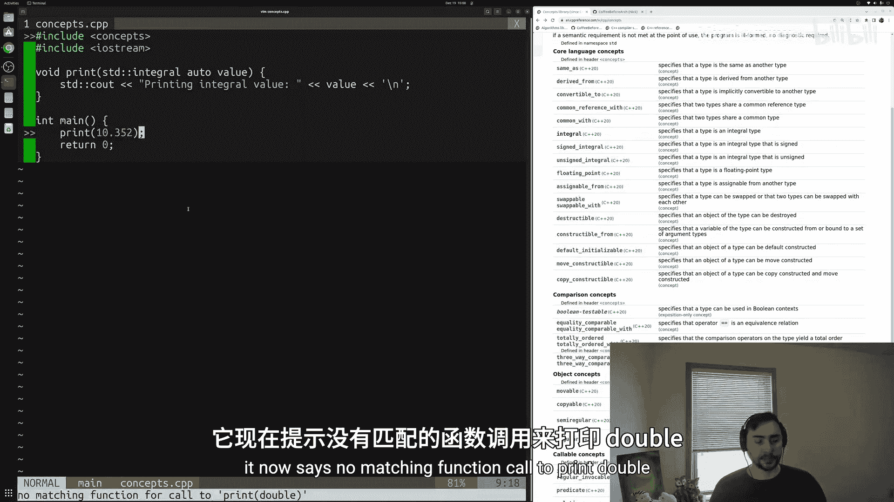
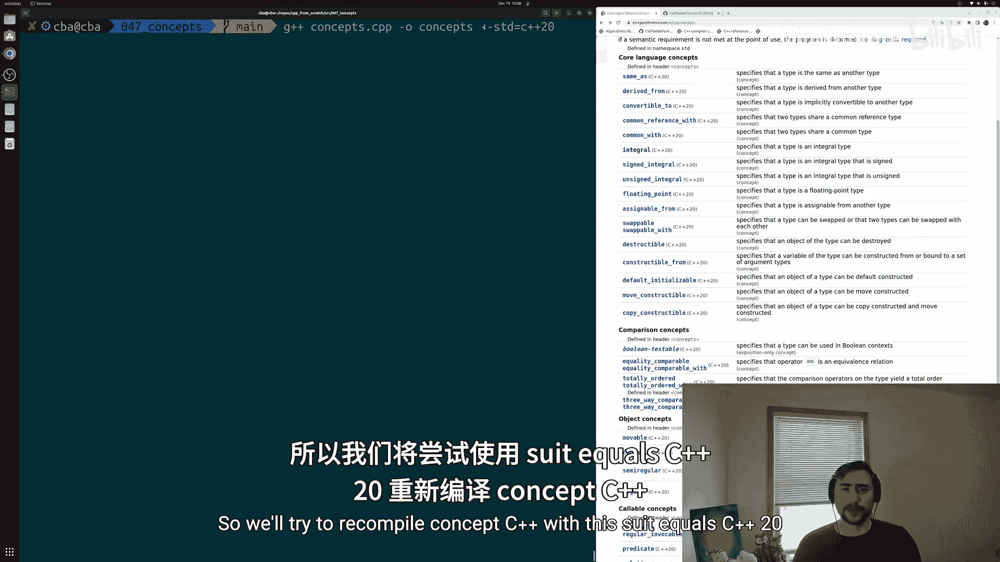
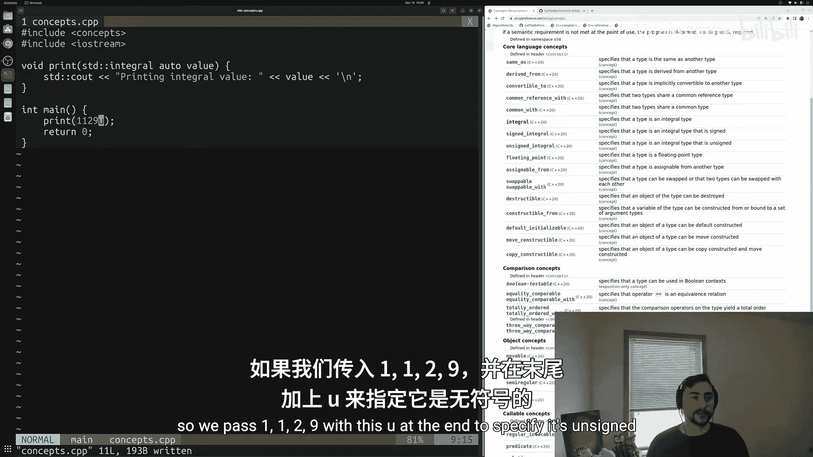
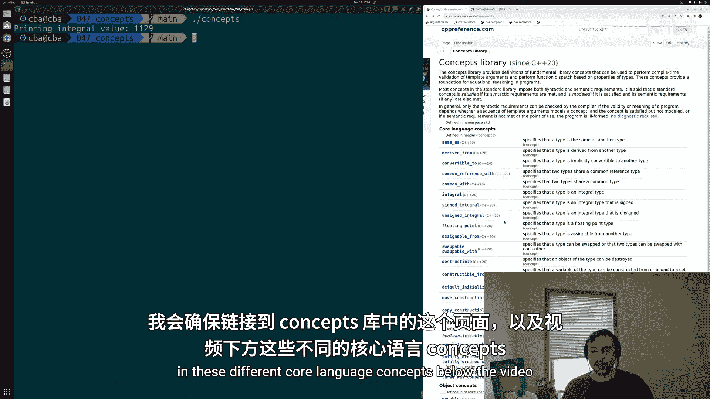
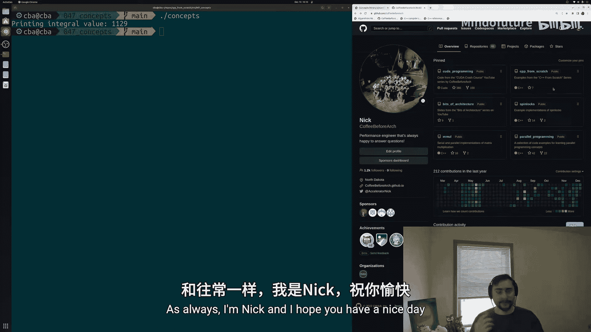

# 048：概念（Concepts）🚀

在本节课中，我们将要学习C++20中引入的“概念（Concepts）”功能。概念是一种强大的工具，用于在编译时对模板参数进行约束和验证，确保模板只被用于设计者预期的类型，从而避免误用并产生更清晰的错误信息。

## 概述

上一节我们介绍了模板的基础知识。本节中我们来看看如何为模板添加约束。当我们定义一个函数模板时，通常并不希望它能用于所有可能的数据类型。例如，我们可能只设计一个模板来处理各种整数类型，而不希望它被用于浮点数或自定义结构体。概念提供了一种表达这种约束的方式。



## 一个未受约束的模板示例

首先，让我们创建一个简单的函数模板，它本意是用于打印整数值。

```cpp
#include <iostream>





// 一个简单的函数模板，用于打印值
void print(auto value) {
    std::cout << "打印整数值: " << value << '\n';
}

int main() {
    print(42); // 正确使用：整数
    print(10.352); // 意外使用：双精度浮点数
    return 0;
}
```

编译并运行上述代码（使用 `g++ -std=c++20 concepts.cpp -o concepts`），你会发现即使我们只打算处理整数，模板也能为 `double` 类型实例化并工作。这可能导致运行时出现意外行为，或者产生难以理解的编译错误。

## 使用概念约束模板





为了避免上述问题，我们可以使用C++标准库中预定义的概念来约束模板参数。以下是使用 `std::integral` 概念来约束 `print` 函数的方法。

```cpp
#include <iostream>
#include <concepts> // 引入概念库

// 使用概念约束模板参数：value必须是整数类型
void print(std::integral auto value) {
    std::cout << "打印整数值: " << value << '\n';
}

int main() {
    print(42); // 正确：42是整数类型
    print(10u); // 正确：10u是无符号整数类型
    // print(10.352); // 错误：double类型不满足std::integral概念
    return 0;
}
```





当我们尝试用 `double` 类型调用 `print` 函数时，编译器会给出明确的错误信息，指出 `double` 类型不满足 `std::integral` 概念的要求，从而阻止了模板的误用。

## 核心概念库简介

C++标准库的 `<concepts>` 头文件定义了许多核心语言概念，用于常见的类型约束。以下是一些常用的概念：

*   **`std::integral`**：要求类型是整数类型（如 `int`, `char`, `unsigned long`）。
*   **`std::floating_point`**：要求类型是浮点类型（如 `float`, `double`）。
*   **`std::same_as`**：要求类型与指定类型完全相同。
*   **`std::derived_from`**：要求类型派生自指定基类。
*   **`std::convertible_to`**：要求类型可以转换为指定类型。



## 总结

本节课中我们一起学习了C++20的概念（Concepts）。我们了解到，概念是一种为模板参数添加编译时约束的机制，它能确保模板只被用于设计者预期的类型，从而提升代码的安全性和可读性，并产生更清晰的编译器错误信息。我们通过一个示例演示了如何使用 `std::integral` 概念来约束一个函数模板，使其仅接受整数类型参数。

---





**附注与资源**
*   本系列教程的所有代码示例可在 GitHub 仓库 `coffeebeforearch/cpp-from-scratch` 中找到。
*   关于概念的更多详细信息，请参阅 [C++参考 - 概念库](https://en.cppreference.com/w/cpp/concepts)。
*   这是本入门系列的最后一课。后续将开启关于更高级的C++用法、调试、编译器、构建系统以及并行编程的新系列教程。