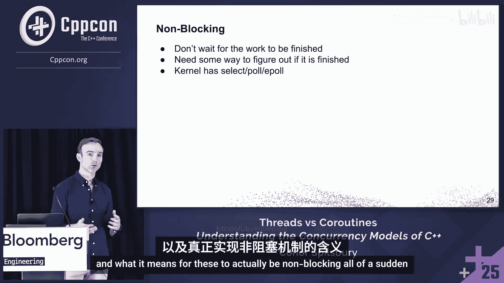

# 001：线程与协程——为何C++拥有两种并发模型


在本节课中，我们将要学习C++中两种主要的并发模型：线程与协程。我们将探讨它们各自的行为、适用场景以及如何根据应用程序的工作负载类型来选择合适的模型。通过理解其底层原理，你将能够更好地设计高并发、高性能的应用程序。

---

## 概述：并发设计的挑战

在设计高吞吐量、客户端驱动的应用程序时，如何有效地处理大量工作负载常常成为一个难题。理解并发设计的基础，能让我们更好地利用这些工具。

我们将以在白板前讨论的方式展开，侧重于图解和概念，而非大量代码。虽然这不是一份完整的参考指南，但会聚焦于线程和协程的行为，为你提供在实际中遇到这些问题时深入挖掘的起点。

---

## 线程：最初的尝试与局限

当我们知道需要处理大量工作时，首先想到的通常是使用线程。这是最熟悉的方法。

我们可以为每个消息创建一个线程。随着线程数量的增加，吞吐量会随之提升。这看起来很简单，任务完成，皆大欢喜。

但作为工程师，我们需要考虑扩展性。我们需要进行压力测试，看看极限在哪里。因此，我们继续增加线程数量，观察会发生什么。

---

### 线程的瓶颈：过载与上下文切换

当线程数量持续增加时，吞吐量会达到一个拐点。超过这个点后，性能不仅停滞，反而会下降。即使增加数千个线程，性能也可能与只使用少量线程时相差无几。

我们需要思考为什么会这样。让我们从应用程序的运行环境开始。

我们的应用程序运行在用户空间。这是一个沙盒环境，与直接硬件访问隔离，我们的代码可以在这里执行，但不能直接访问文件、套接字或物理内存。当代码需要访问这些资源时，必须通过内核。

当我们创建线程时，实际上是在向操作系统发出请求。操作系统会为我们创建一个由内核管理的OS线程。这些线程需要在硬件（如CPU）上运行。实际上，我们拥有的线程数总是会超过可用的硬件CPU或硬件线程数量。这就是为什么内核需要一个调度器。调度器负责将这些线程调度到实际的硬件上运行。

调度器使得看起来很多任务可以同时运行。然而，当工作量非常大时，这种机制就会失效。我们将调度的责任交给了调度器，但我们也需要知道何时应该自己承担起这份责任。

---

### 线程的状态与上下文切换

在任何时间点，线程可能处于以下几种状态：
*   **运行中**：正在CPU上执行。
*   **可运行**：在CPU的队列中等待被调度执行。
*   **阻塞**：在某个等待队列中，等待资源可用。

调度器负责在线程的这些状态之间移动，决定谁在何时运行以及运行多久。

一个经典的例子是，我们在应用程序中先后创建两个线程A和B。从我们的角度看，创建是顺序的。但一旦创建，调度责任就交给了内核调度器，由它决定哪个线程先运行，以及执行是否应该交错进行。

这种执行的交错被称为**上下文切换**。它有两种形式：
1.  **抢占式**：由内核基于时间片等策略为我们做出决策。
2.  **自愿式**：由我们的应用程序决定阻塞某个资源而驱动。

---

#### 抢占式上下文切换

像Linux的CFS（完全公平调度器）这样的调度器，旨在保证基本的公平性，意味着每个线程都会在CPU上获得一定的运行时间。当一个线程的时间片用完，调度器会执行上下文切换，保存当前线程的状态（如寄存器），并加载下一个线程的状态。

这就是并发——工作的交错执行。我们启动一个线程，在它完成之前切换到另一个线程，反之亦然。线程被不断地换入换出。

当线程数量激增时，如果每个线程都需要在CPU上运行一段时间，并且为了保证公平性，每个线程都要获得一点时间，那么线程越多，上下文切换就越频繁。每个线程都试图获得自己的CPU时间片。

---

#### 阻塞式I/O与上下文切换

想象我们有一个`read`函数，它从文件描述符读取数据。当一个线程调用这样的函数时，它会阻塞，直到数据可用。

调度器会将该线程标记为**阻塞**。它会被移出CPU，放入该资源的专用等待队列。与此同时，CPU上可以运行其他完全不同的任务。最终，当数据准备就绪时，内核会唤醒该线程，将其标记为**可运行**，并添加回队列，等待某个CPU再次调度它。

如果数据在第一次尝试时就立即可用，那么线程会立即返回，不会阻塞。

---

### 问题的核心：过载

操作系统只能处理有限数量的线程，超过这个限制，上下文切换的开销就会开始占主导地位。为短暂的工作创建和销毁线程会浪费大量时间在上下文切换上，而不是实际工作。

这就是**过载**。我们试图用太少的资源做太多的事情。

---

## 线程池：限制并发以控制过载

为了防止过载，我们可以限制创建的线程数量，使其不超过性能拐点。这就是线程池的作用。

当许多线程同时变为可运行状态，内核需要决定谁在何处运行时，线程会开始竞争CPU时间。我们可以通过限制任何时间点的线程数量来缓解这个问题。通常线程池大小设置为逻辑CPU核心数，但也可以更多。

我们将工作项推入队列，线程池中的工作线程会从队列中取出工作并在核心上执行。这样，我们可以将应用程序中想要做的所有工作（或许多任务）复用到数量更少的OS线程上。

这样做意味着我们限制了任何时间点可运行线程的数量，从而可以防止过载。我们从数百个线程竞争，变成了只有N个线程忙碌，后面跟着一个任务队列。

---

### 线程池的代价：并发性受限

当然，我们仍然有相同数量的工作需要完成，但现在只有少数线程来处理。因此，我们无法达到之前使用大量线程时的吞吐量水平。我们通过复用线程分摊了线程创建的成本，并限制了线程数量以控制资源使用，但这也意味着在任何时间点只能有固定数量（N）的任务在进行中。

我们不仅限制了运行在固定核心上的固定线程集，而且不再获得相同程度的并发性。我们在这里限制了并发性。

之前，我们有大量的执行交错，调度器负责确保每个任务获得公平的运行时间。线程非常适合提供**并行性**（最多到核心数），并且由于调度器会抢占式地在硬件线程上切换任务，我们还能获得一些**并发性**。

问题在于调度本身会拖慢速度，而线程池帮助我们保持在临界点以下。但最好的情况是，根据我们设置的线程池大小，我们只能达到吞吐量峰值并防止过载；最坏的情况是，我们限制了实际可以完成的工作量和并发性。

如果我们的问题从根本上需要扩展到超过线程池大小的拐点，我们就失去了内核调度器通过抢占为我们带来的优势——那种让我们可以同时处理更多任务的能力。在线程池中，我们只有少数任务在进行，其他所有任务都在后面的队列中等待。

---

### 并行与并发的定义

让我们明确一下定义：
*   **并行**：多个任务在**同一时刻**同时运行。这通常与硬件相关，例如在不同核心上同时运行。
*   **并发**：多个任务在**同一时间段内**都在进展中，但不一定在同一瞬间运行。这是通过交错执行（时间片）实现的。

我们通过线程池解决了过载问题，但现在我们面临一个**并发性问题**。

---

## 事件循环：将调度责任移回用户空间

到目前为止，我们一直将调度责任委托给内核调度器，这通常足够好，能让我们走得很远。但如果想要处理更复杂的用例和更大的吞吐量，我们需要看看如何收回更多的责任，将其引入我们的应用程序，让应用程序根据需求进行调度。

在线程池中，我们不知道任务何时准备就绪，必须等待任务完成才能处理下一条消息。那么，我们还能尝试什么方法来解决这个问题呢？

事件循环是一个很好的起点。这是尝试将调度从内核提升到用户空间、引入我们应用程序的开始。

与操作系统管理数千个阻塞线程或使用线程池不同，我们可以在应用程序中，在单个线程上运行一个循环，来多任务处理许多任务。你可能在需要廉价处理大量连接的地方见过这种模式，比如Node.js、Nginx等。

事件循环就是一个不断等待事件发生，然后将事件分派给相应处理器的单一循环。处理完成后，它又返回等待状态。其目标是在没有线程为我们进行调度的情况下做更多工作。我们希望自己承担更多责任，因为如果我们自己做可能更廉价，而不是依赖调度器。

---

### 事件循环的工作原理

我们最终在事件循环中有一个就绪任务队列。一段简化的伪代码如下：

```cpp
while (true) {
    // 等待事件（例如，通过 epoll, kqueue 等系统调用）
    auto events = wait_for_events();
    for (auto& event : events) {
        // 分派事件到对应的处理器（回调函数）
        dispatch_event_handler(event);
    }
}
```

我们有一个队列，一个线程上的函数只是从队列前端弹出任务并执行。这些都是小的、非阻塞的工作，没有等待。

使用事件循环，我们试图建立一种反馈机制。在线程池中，我们开始失去并发性，无法让更多任务同时进行。我们不想把任务放到线程上，除非它确实准备好做一些工作。我们需要某种方式向事件循环表明我们的任务已就绪，可以立即继续运行，有实际工作要做。

因此，我们不再阻塞，而是可以请求操作系统：“请告诉我这个资源何时可以使用。”**就绪**意味着操作系统保证，如果我们尝试从套接字读取等操作，它不会阻塞，数据已经在等待了。

事件循环就是一个不断询问操作系统“现在什么就绪了？”的线程，然后分派相应的回调函数给处理器，接着又回去等待下一个事件。

---

### 事件循环的权衡

非阻塞I/O避免了空闲阻塞，但我们现在被迫用回调和处理器来表达我们的程序。我们不再编写直线逻辑的代码了。我们有了回调，这些是事件循环稍后会调用的东西。

这就是我们承担调度责任所带来的权衡。过去我们依赖内核足够智能来识别我们在做什么并让出线程，但现在这必须由我们自己来完成。这就是为什么确保我们调用的是非阻塞操作如此重要。

这正是我们在线程池中遇到的问题：它移除了智能调度，我们不再有抢占。因此，我们仍然需要某种方式向事件循环发信号，表明任务已就绪，可以调度，因为有实际工作可做。

这就是协程的用武之地。

---

## 协程：编写看似阻塞的非阻塞代码

协程让我们能够编写看起来像阻塞的代码，而底层实际上是非阻塞的。

那么，协程究竟是什么？典型的定义是：一个可以**挂起**自身，并在之后**恢复**执行的函数。

在C++中，我们可以通过`co_await`某个东西来实现这一点。例如，`co_await read()`会挂起，直到底层的`read`操作准备好数据。当它准备好时，我们可以恢复并从中断处继续执行。

---

### 协程的底层机制：栈与帧

让我们回顾一下应用程序的运行环境图。我们已经看到抢占如何降低性能，并且任何时候从应用程序跨越边界进入内核，都是一次昂贵的系统调用。因此，系统调用越少越好。我们希望尽可能在用户空间表达一切。

协程看起来有点像函数，让我们从如何调用常规函数开始。当我们调用一个函数时，会获得一个栈帧，其中包含该函数的参数、局部变量、寄存器快照和一个返回地址指针。其生命周期与栈帧本身绑定。一旦函数返回，帧就被弹出栈。

但C++20协程是**无栈的**。没有像普通函数那样的独立专用栈。这意味着在第一次调用时，我们会获得一个**协程帧**。这是一个堆分配的对象，用于保存局部变量、参数，最重要的是，保存我们挂起时将要恢复执行的**挂起点**。

相应地，在调用处我们会得到一个**协程句柄**，它只是一个指向该协程帧的指针。一旦我们挂起，协程帧会继续存在，即使协程处于挂起状态。这就是任务、承诺类型、可等待对象等概念发挥作用的地方。

协程帧本身主要保存一个值，这个值告诉我们恢复协程时应该从哪里继续执行。这意味着，当我们挂起、从一个协程切换到另一个或别处时，我们不需要保存CPU寄存器、内核栈或处理像之前那样的线程切换。我们只是存储当前的指令位置，将控制权返回给调用者。

恢复同样廉价，我们只是跳回帧中，其开销与调用函数相当，远比处理线程和上下文切换要便宜得多。而且何时运行我们的协程也完全由我们决定，不需要等待调度器来决定。


---

### 协程与事件循环的集成

为了与我们之前的内容进行类比，内核中的调度器负责将我们的线程在运行、阻塞、可运行等状态间移动。对于协程，我们在自己的应用程序中做类似的事情：从运行协程到挂起它，然后将其标记为可运行，在某个时刻将其添加回队列。

回到我们的事件循环示例，在实际调用代码中，它可能看起来像这样。事件循环在`main`中运行，我们发布一些工作，最终进入其内部的队列。我们也可以简单地调度协程。

如果我们从`main`开始，现在有东西在调用我们的协程函数，并且它持有对循环的引用。在我们的协程函数内部，我们将`co_await`某个东西，它是一个可等待对象。这会挂起当前协程。

与此同时，事件循环会继续运行。我们有一个可等待对象，它会告诉我们当协程准备恢复时该做什么。在这个例子中，因为它持有对循环的引用，这表明当它准备恢复时，会被放回事件循环的队列中。


并非所有协程都需要以这种方式表达，这只是调度机制的一个示例。在实践中，像cppcoro、folly、asio这样的库正在为我们做这些事情，它们有自己的可等待类型和调度器。它们只是将调度从内核提升到我们应用程序的示例。


---

### 协程的适用场景：I/O密集型与CPU密集型工作

我们已经看到，为了让事件循环成功运行，我们需要非阻塞的API调用，我们分派一些工作并最终获得结果。这正是我们在协程中需要的相同执行模型。

从调度器转移到我们应用程序的过程中，我们失去的一个方面是**公平性**。以前，调度器会通过上下文切换将作业换出CPU，以确保每个线程都有运行时间。现在我们在自己的应用程序中进行调度，没有任何东西为我们做这件事。我们必须确保所有参与者或任务都表现良好，不会阻塞事件循环。没有抢占，没有什么能阻止它们持续运行。

因此，我们试图执行的工作类型变得至关重要。如果某个任务执行时间很长且不主动让出，它就会阻塞所有其他工作。那个阻塞我们协程的调用，如果是CPU密集型的且运行时间很长，就会阻塞任务。

我们通常可以将工作类型分为两类：**I/O密集型**和**CPU密集型**。

---

#### I/O密集型工作

对于I/O密集型工作，瓶颈在于等待CPU外部的数据。如果应用程序串行执行所有操作，那么累积的等待时间会很长。在处理一条消息时，应用程序只是空闲等待，而其他消息则卡在队列中等待运行。

使用非阻塞I/O，我们思考如何更好地利用等待时间，这正是协程和非阻塞操作的完美结合。CPU本身并没有做太多工作，它只是停滞。例如，从套接字读取、等待数据库查询完成或通过网络调用远程API——任何涉及大量等待的场景。

协程在这里表现出色，因为它们可以`co_await` I/O操作，并立即、廉价地挂起，直到数据就绪，而不会浪费CPU周期。

---

#### 性能对比：线程 vs. 协程

我们可以回到之前的图表进行比较。X轴是逻辑并发量，Y轴本质上是吞吐量。

线程有拐点，并且性能相对较早开始下降。而协程的性能则远超线程。但这里有一个非常有趣的注意事项：我们提到线程在某个点之前工作良好，之后开销变得过大，导致CPU过载。

观察逻辑任务数量足够少的情况，线程和协程之间的性能实际上非常相似，吞吐量以相同的速率增加。X轴上没有具体数值，因为拐点值取决于你的机器和同时运行的其他任务，通常会在数百甚至数千的范围内。在某个时刻，会有一个从线程最佳到协程最佳的切换点。

这是因为我们将内核所做的所有昂贵操作，现在都由我们自己来做了。这意味着协程在某个时刻也会有一个拐点，只是这个拐点非常遥远，因为在协程中进行上下文切换的成本非常低。

需要指出的是，这个图表中的协程只是单线程事件循环。只有一个线程。但如果我们尝试在没有协程的情况下进行CPU密集型工作，线程和协程之间没有太大区别，我们不会获得太多性能提升，在某些情况下，性能实际上可能更差。

---

#### CPU密集型工作

对于CPU密集型工作，我们仍然需要线程。线程池的瓶颈将涉及计算，我们需要线程在CPU上获得专用时间来持续处理数据和运行。例如，处理大型内存数据集或压缩大文件。

在实践中，应用程序可能两者兼有。我们可能有协程执行一些I/O操作，然后在某个时刻将结果交给线程池处理。因此，我们最终可能得到这样的模式：在I/O上`co_await`，然后获取结果并将其调度到CPU上执行。当从CPU获得结果后，我们可以再次回到I/O操作，以这种方式将任务链接起来。


这也是为什么我想提一下C++26的`std::execution`。它允许我们在一个管道中组合I/O密集型工作和CPU密集型步骤，明确指定每部分工作应该在哪里执行。因为协程本身不知道在哪里恢复，`std::execution`让我们能够指定：“当我准备好时，请在正确的资源上恢复我。”这样我们就可以避免意外地在事件循环线程上执行CPU工作，或者仅仅为了等待而创建线程。

---

## 总结

本节课中我们一起学习了C++中线程与协程两种并发模型的核心区别与适用场景。

*   **线程**：
    *   **适用场景**：非常适合CPU密集型工作。操作系统决定哪个线程在哪个CPU上运行。
    *   **优势**：是实现并行性的必要条件，我们可以获得最多到核心数的并行性，之后调度器通过上下文切换引入一些并发性。
    *   **劣势**：扩展性有限，开销昂贵。当线程数量过多时，上下文切换的开销会主导性能，导致过载。

*   **协程**：
    *   **核心机制**：通过将调度责任带回用户空间，避免了昂贵的系统调用和线程上下文切换。协程帧在堆上分配，挂起和恢复的成本极低，类似于函数调用。
    *   **优势**：为I/O密集型工作提供了极高的并发性和可扩展性。允许编写看似顺序阻塞、实则非阻塞的代码，保持了代码的直叙可读性。
    *   **关键要求**：所有操作都必须是**协作式**的。我们必须确保任务主动让出（yield），不能长时间阻塞执行线程，因为没有了内核的抢占式调度。这要求开发者有良好的设计纪律。
    *   **结合使用**：现代应用程序通常是混合型的。可以使用协程处理高并发的I/O，然后将计算密集型部分交给线程池处理。C++26的`std::execution`等设施有助于更优雅地组合这两种模型。




最终，选择线程还是协程，取决于应用程序工作负载的**形态**：是I/O密集型还是CPU密集型，以及对并发规模和性能的具体要求。理解这些基础原理，将帮助你为手头的问题选择最合适的并发工具。