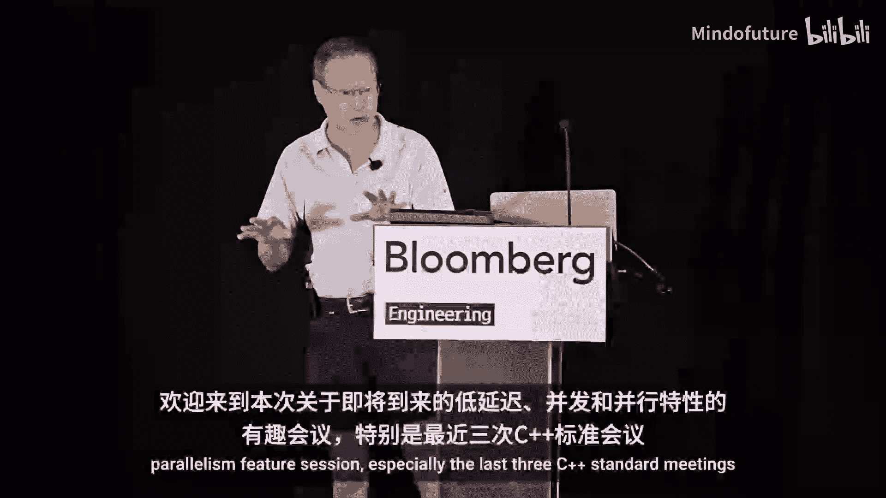

# 002：即将到来的低延迟、并发与并行功能




在本节课中，我们将要学习 C++ 标准中即将到来的三个重要特性：标准 SIMD 库、并发队列以及指针生命周期端点。这些特性旨在提升 C++ 在低延迟、高并发和高性能计算场景下的能力。

## SIMD：P02.1：释放 CPU 的并行潜力

上一节我们介绍了本课程的整体内容，本节中我们来看看第一个特性：标准 SIMD 库。

多年来，CPU 一直拥有强大的并行处理能力，但以标准、可移植的方式访问这些能力一直很困难。随着 C++26 的到来，这种情况即将改变。今天，我们将探讨 C++26 的 `std::simd` 如何让我们摆脱平台相关的 `#ifdef` 游戏。

SIMD 的核心概念很简单，就是元素级操作。你创建一个 `simd` 对象，它保存多个值。当你应用一个操作符（如 `+` 或 `*`）时，该操作会并行地作用于每个对应的元素。

以下是核心类型：
*   `std::simd<T>`：一个包含 `T` 类型 `N` 个元素的向量。
*   `std::simd_mask<T>`：一个包含 `N` 个布尔值的向量，通常来自比较操作。

例如，以下代码将四个价格同时乘以税率：
```cpp
std::simd<float> prices = {10.0f, 20.0f, 30.0f, 40.0f};
float tax_rate = 1.08f;
std::simd<float> taxed_prices = prices * tax_rate; // 所有元素同时计算
```

比较操作也是元素级的，它们不返回单个布尔值，而是返回一个 `simd_mask`，用于条件逻辑。

### 处理不同数据类型

处理不同数据类型很常见，最重要的规则是保持向量宽度（通道数）一致。实现这一点的关键工具是 `rebind_simd`。它允许你创建一个与现有向量具有相同通道数但元素类型不同的新向量类型。

以下是创建 SIMD 类型的几种方式：
*   `native_simd<T>`：使用编译器为类型 `T` 推荐的本地宽度。
*   `simd<T, N>`：指定固定宽度 `N`。
*   `rebind_simd<U, V>`：将向量 `V` 的元素类型改为 `U`，但保持相同的宽度。

### 无分支控制流

在 SIMD 代码中，传统的 `if` 语句会强制所有并行通道走单一路径，破坏并行性。解决方案是使用掩码进行无分支计算。

模式如下：
1.  通过比较创建掩码。
2.  使用 `simd_select` 函数。它是 SIMD 中等价于三元运算符 `? :` 的函数。它接收掩码和两个值，对于每个通道，如果掩码为真，则从第一个值中选择，否则从第二个值中选择。整个过程没有任何代码分支。

```cpp
auto mask = (prices > 25.0f);
auto discounted_prices = std::simd_select(mask, prices * 0.9f, prices);
```

### 归约操作

在并行工作完成后，通常需要将结果聚合成单个标量值，这称为归约或水平操作。`std::reduce` 是进行归约的主要工具。

一个经典例子是点积计算：首先对两个向量进行元素级乘法（垂直操作），然后对结果调用 `reduce` 将所有乘积求和为一个标量（水平操作）。

库还提供了其他常见的归约操作，如 `reduce_min`、`reduce_max`，以及用于分析掩码的辅助函数，如 `any_of`。

### 内存加载与存储

数据通常始于标准容器（如 `vector` 或 `span`）。典型的 SIMD 工作流是以等于 SIMD 宽度的块来循环处理数据。库提供了 `load` 和 `store` 函数在内存和 `simd` 对象之间移动数据。

部分加载（`partial_load`）很重要，因为它能安全处理数组末尾数据不足一个完整向量宽度的情况。

### 数学函数重载

`std::simd` 的一个杀手级特性是，你不需要特殊的 SIMD 版本数学函数。整个 C 数学库（如 `cos`、`sqrt`）都已重载，可以直接用于 `simd` 类型。这意味着你可以直接将复杂的数学公式转化为可读的高性能 C++ 代码。


### 性能与注意事项

基准测试表明，使用相同的代码，在不同领域和硬件平台上都能获得显著且一致的加速。例如，图像模糊加速 5 倍，矩阵乘法加速 5 倍，光线追踪加速 6 倍，音频处理加速 4 倍。

但有一个重要警告：强大的 SIMD 单元（尤其是像 AVX-512 这样的宽向量单元）功耗很高。持续满负荷运行可能导致 CPU 过热并自动降频（热节流）。你可以通过请求较小的向量宽度来控制这一点，这有时能在峰值指令吞吐量和持续时钟频率之间取得更好的平衡。

### SIMD 与 GPU 计算

`std::simd` 是 CPU 技术。虽然 GPU 硬件也使用 SIMD 原则，但其软件编程模型称为 SIMT（单指令多线程），两者有根本不同。CPU 使用少量智能核心来降低延迟，而 GPU 使用大量简单核心来最大化吞吐量。它们是互补的工具，旨在解决不同类型的计算问题。

### 最佳实践

以下是使用 `std::simd` 的一些最佳实践：
*   将主循环结构化为按向量宽度块进行迭代。
*   使用 `rebind_simd` 创建能无缝协作的类型集。
*   始终优先使用 `simd_select` 而非分支。
*   注意不要混合不兼容的宽度，编译器会阻止你。
*   注意某些函数（如 `reduce_min_index`）的前置条件。

### 完整示例：图像伽马校正

以下函数展示了如何将伽马校正应用于图像，它遵循经典模式：
1.  以 SIMD 大小的块循环遍历数据。
2.  使用 `simd_partial_load` 安全地获取数据（即使在 `span` 的末尾）。
3.  使用重载的 `pow` 函数将公式一次性应用于块中的所有像素。
4.  使用 `simd_partial_store` 将结果写回。

```cpp
void gamma_correct(std::span<float> pixels, float gamma) {
    using float_v = std::simd<float>; // 编译器决定的高效向量类型
    const float_v v_gamma = gamma;    // 将标量伽马值广播到整个向量

    for (std::size_t i = 0; i < pixels.size(); i += float_v::size) {
        auto subspan = pixels.subspan(i);
        auto pixel_chunk = std::simd_partial_load<float_v>(subspan); // 安全加载
        auto corrected_chunk = std::pow(pixel_chunk, v_gamma);       // 并行计算
        std::simd_partial_store(corrected_chunk, subspan);           // 安全存储
    }
}
```

**总结**：`std::simd` 是性能关键型 C++ 低延迟代码的游戏规则改变者。它让你能够以一种可移植、类型安全且可读的方式，最终掌控 CPU 的硬件并行能力。

## 并发队列：P02.2：标准化的并发通信

上一节我们介绍了 SIMD 如何利用 CPU 的硬件并行性，本节中我们来看看软件层面的并发通信工具：标准并发队列。

并发队列的提案始于大约十年前，经历了许多波折。但在过去一年中取得了巨大进展，进行了 109 次修订，并已进入并发研究组和库演化工作组进行接口审查，下一步将是措辞审查。

### 基本概念与操作

基本并发队列概念的操作是你所期望的：
*   **推送操作**（`push`）：有拷贝、移动和原位构造等多种形式。如果成功则返回 `true`，如果队列已关闭则返回 `false`。如果队列已满，这些操作会阻塞。
*   **弹出操作**（`pop`）：返回一个 `std::optional<T>`。如果返回 `std::nullopt`，表示队列已关闭且为空；如果返回类型为 `T` 的元素，则表示弹出成功。

### 队列状态

该提案的一个重要部分是提供队列状态。状态包括：
*   `success`：操作成功。
*   `empty`：队列为空。
*   `full`：队列已满。
*   `closed`：队列已关闭。
*   `busy`：由于内部同步，非等待操作无法立即完成。
*   `busy_async`：与非等待操作解除异步操作阻塞相关，未来可能会被移除。

### 非等待接口

第二个概念是并发队列概念，它增加了非等待接口：
*   **尝试推送**（`try_push`）：返回一个状态（`success`、`full`、`busy` 等）。
*   **尝试弹出**（`try_pop`）：返回 `std::expected<T, queue_status>`。成功时包含元素，否则包含错误状态（`empty`、`closed`、`busy` 等）。

### 异步接口

第三个是异步接口，包括 `async_push` 和 `async_pop` 等操作。它们都返回发送器（senders），最终会调用完成回调。如果成功，`push` 调用 `set_value(void)`，`pop` 调用 `set_value(T)`。如果队列关闭，则调用 `set_error`。该接口也支持取消操作（`set_stopped`）。

### 关闭队列

`close()` 函数用于关闭队列。一旦关闭，队列就不能重新打开。关闭后，不能再向其中推送元素，但如果队列非空，仍然可以从中弹出元素。所有在空队列或满队列上阻塞的等待操作会立即被解除阻塞。对于推送操作，返回 `false`；对于弹出操作，返回 `std::nullopt`。

### 错误与异常处理

该提案采取的方法是，队列关闭等状态不被视为“错误”。异常可能由元素类型 `T` 的拷贝/移动构造函数抛出，也可能在构造时因内存分配失败而抛出。同步原语（如互斥锁）也可能抛出与死锁检测相关的异常。

### 具体实现与内存顺序

目前，提案中只有一个具体的队列模板：`bounded_queue`。它在构造时接受一个最大元素数量，并可能在此刻分配内存。队列本身不可移动或拷贝。

关于内存顺序，委员会决定，对于第一个支持的并发队列，直观性比高性能更重要。因此，操作将支持顺序一致性，但这并未对未来的高性能实现关闭大门。

### 被放弃的特性

在提案演进过程中，许多可能使实现复杂化或阻碍高性能的特性被放弃，例如：允许向前推送、重新打开已关闭队列、流式迭代器、为队列命名等。

**总结**：提案 P0260 在过去一年取得了巨大进展。如果被采纳，它将引入队列状态枚举，定义三个（仅用于说明的）概念，并提供一个满足所有三个概念要求的具体并发队列。它支持顺序一致性，并为未来的高性能实现留下了空间。

## 指针生命周期端点：P02.3：解决指针无效化难题


上一节我们讨论了用于线程间通信的并发队列，本节中我们来看一个更底层、影响并发算法正确性的问题：指针生命周期端点（或称无效指针）。

指针不仅仅包含内存中的比特位，编译器还会在内部跟踪其“来源”（provenance）。当通过 `delete` 释放一个对象时，指向它的所有指针会立即变为无效。对无效指针的任何操作（包括比较、加载、存储）的结果至少是实现定义的，甚至可能是未定义行为。这虽然启用了一些优化（如别名分析），但也使得一些正确的并发算法（如无锁栈的“生命期推送”算法）在 C++ 中无法安全表达。

### 问题示例：无锁栈的 ABA 问题

考虑一个经典的无锁栈推送操作：
1.  线程 A 读取栈顶指针 `old_head`。
2.  线程 A 准备新节点 `C`，令 `C->next = old_head`。
3.  在线程 A 执行 `compare_exchange_weak` 之前，线程 B 执行了 `pop_all`，获取了整个链表并释放了节点 `A` 和 `B`。
4.  线程 B 随后分配新节点 `D`，恰巧重用了节点 `A` 的内存地址。
5.  此时，线程 A 的 `C->next` 仍然指向原 `A` 的地址（现为 `D`），但这是一个“僵尸指针”。
6.  线程 A 执行 `compare_exchange_weak`，由于只比较比特位，可能成功，导致 `C->next` 这个无效指针被链入栈中，后续操作引用它会导致未定义行为。

### 解决方案提案

目前有几份提案旨在解决这个问题：

1.  **P2414（Davis Herring 的提案）**：扩展 `reinterpret_cast` 从整型到指针的规则，允许编译器考虑与转换操作“并发创建”的对象。这解决了 `compare_exchange_weak` 中旧值指针的来源问题。
2.  **“收紧无效指针行为”提案**：提议将无效指针的某些操作（非比较、非算术、非解引用）定义为具有明确定义的行为（即保留比特位）。这样，加载和存储无效指针就是安全的，可以将其传递给像原子加载/存储这样的函数。
3.  **“原子与 volatile”提案**：提议原子和 volatile 操作应像整型转换一样，忽略来源信息。

如果这三份提案获得通过，那么“生命期推送”算法以其自然编写的方式将成为定义良好的 C++ 代码。

此外，还有一份关于 **`launder_bits` 和 `biterpret_bits`** 的提案，用于非并发场景（如调试）。它们提供模板类，用于存储指针的比特位而忽略其来源信息，便于在哈希映射等结构中将其用作键值。

**总结**：指针无效化规则是 C++ 从 C 继承的遗产，在引入并发后带来了挑战。目前的提案旨在通过修改标准，使像“生命期推送”这样广泛使用且正确的并发算法能够被安全表达，同时为调试用例提供标准工具。这项工作始于 2019 年，目标是在 C++29 或之后的标准中引入。

---


**本节课总结**：在本节课中，我们一起学习了 C++ 标准中三个即将到来的重要特性。`std::simd`（C++26）提供了可移植的 CPU 数据并行编程接口。并发队列提案为标准化的线程间通信机制铺平了道路。指针生命周期端点提案则致力于解决底层内存模型问题，使经典的无锁算法能在 C++ 中安全实现。这些特性共同增强了 C++ 在低延迟和高并发领域的表达能力与安全性。