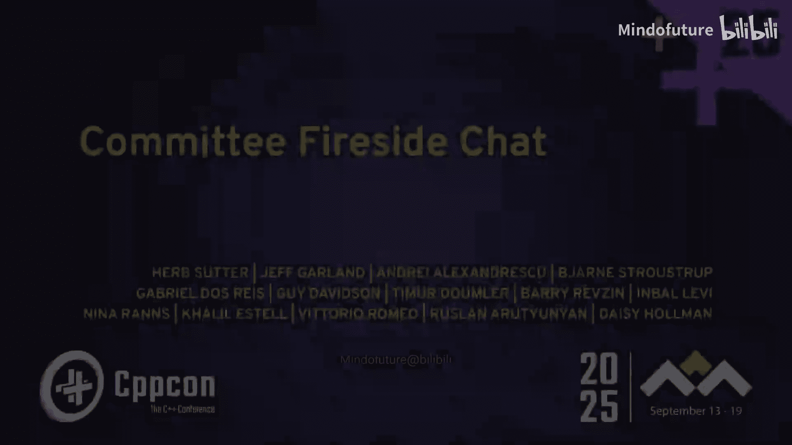
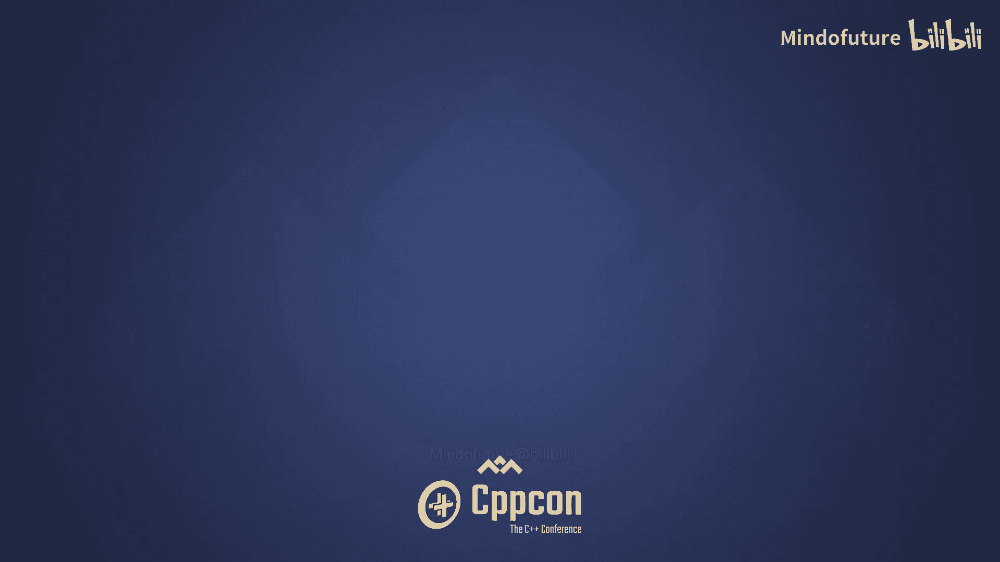

# 003：C++26及未来展望

## 概述

在本教程中，我们将整理并翻译CppCon 2025会议上关于ISO C++标准委员会的小组讨论内容。本次讨论由Herb Sutter主持，多位活跃于标准委员会的专家参与，重点探讨了即将发布的C++26标准中的关键特性、存在的争议以及对未来C++发展的展望。我们将遵循特定格式要求，确保内容清晰、结构完整，适合初学者理解。

## 会议开场与介绍

欢迎各位参加今晚的首场小组讨论。

大家享受CppCon第一天的会议了吗。希望你们过得愉快。我们很高兴听到大家反响积极。

我们知道你们非常投入。在晚上8:30开始的讨论中，我们欣赏各位的坚持。我们认为这将是一场非常有趣的讨论。

这不是我们举办过规模最大的小组讨论。实际上，它与2014年首届CppCon上的“拷问委员会”小组规模相同。

很高兴能邀请到多位专家组成员，他们都活跃于标准委员会。其中一些人已经活跃了很长时间。例如，从左数第二位是Bjarne Stroustrup。还有像André这样的专家，他使用C++很长时间，但最近几年才开始定期参与标准委员会会议。

我们这里有小组主席、名誉主席，也有从未担任过主席但通过提案产生重大影响的成员。例如，Barry，我想你从未担任过小组主席或助理主席。抱歉，但这并不影响你在反射和语言演进特性方面撰写了许多优秀论文的事实。

我们拥有多元化的专家阵容。我会保留这张幻灯片，上面列出了每个人的信息。

## 讨论形式

我们采用以下形式。过去几年，我们大约80%的问题来自观众，因为我们希望观众参与。我们仍然会这样做，但我们将从大约一半的时间开始。原因是每年有些问题都相同。然后我们收到反馈说，问题和去年一样。

因此，我们打算先由我提出一些问题，深入探讨C++26的内容以及其他及时话题，但不包括AI，因为AI明天有专门的讨论。我们尽量将大多数关于AI的话题推迟到那时。我们可能仍会提及，但这就是为什么该话题明天有专门的小组讨论。

这将让我们了解这些专家是谁。然后我们邀请你们提问。我会给出信号。麦克风将放在这里供大家排队提问。

## 专家自我介绍与C++26亮点

首先，我想请每位专家简单介绍一下自己。也许我们可以从Barry开始，按顺序进行。请简单说几句关于你是谁。但我想问你们每个人的问题是：我们现在正处于C++26即将批准发布的阶段，其中包含反射、发送器/接收器执行等主要特性。你们各自认为，对于开发者听众来说，标准中最具变革性、最应该了解的是什么？Barry，也许你可以先开始。

我认为这有点像...是的。我们都喜欢红色。谢谢，Ruland，请介绍一下自己。

我叫Ruth Lai。我是并行算法库的负责人，也是HG1（并发与并行）小组的联合主席。从突破性的特性来看，尽管我是并发小组的联合主席，但我个人认为确实是反射。因为你们基本上是在语言内部构建语言。这是一个我们需要学习、思考并改变我们做事方式的全新世界。我知道它已经非常强大，并且希望在C++29中变得更强大，这样我们甚至可以在没有额外工具的情况下进行代码生成。它提供了在编译时做事的无限能力。这很棒。谢谢。

接下来是Gabby Dusres，他是SG12的前任主席，也是模块等特性的设计者。是的，目前在微软，我主要从事安全方面的工作。C++26在我看来像一棵圣诞树，每个人都往上面挂了东西。我最期待的是发送器/接收器执行库框架。我编写了很多相关程序，也询问过同事和朋友，他们都在称赞库的统一框架在实践中的应用，并且不用担心竞争等问题。我非常期待它，以便我能在公司和社区中推广。

谢谢。接下来是Guy Davidson。在你发言之前，让我宣布一个最新消息。今天是周二，六天前，也就是上周二，我们的上级委员会SC22（负责所有编程语言）正在选择我的继任者，因为我担任召集人已经22年了。问题不是我为什么要卸任，而是为什么我待了这么久。我仍将非常活跃于委员会，但我想做更多的技术工作，让别人来领导。因此决定，Guy将从一月份开始成为C++委员会的下任召集人或主席，但我们将在六周后的科阿会议上就让他开始工作，因为我想减轻负担。所以，谢谢即将上任的召集人WT21。

谢谢。哦，在我忘记之前，我们有好几位合格的候选人，包括John Spicer和Jeff Garland。Jeff Garland也欣然自愿，并且希望除了他在库工作组的工作外，还能继续担任角色。这总是件好事，当你有多个合格的志愿者时，这表明团队是健康的。抱歉打断你，Guy。

没关系。我情绪上...未来几年我会收到很多数据。不，抱歉。我知道我报名了。实际上是我的国家机构为我报名的。大家好，我叫Guy Davidson。我在一家叫“早餐前六件不可能的事”的公司工作。我是一名游戏开发者。我工作的公司正在开发一个游戏引擎。我们处于秘密模式，这就是为什么你们从未听说过我们做的任何事情，但请关注我们。C++26有很多内容。所以我对“最具变革性”这个问题会给出一个稍微不同的回答。我认为你们应该把阅读C++标准的前几章作为新年决心。这些章节非常易懂，能解释很多事情。你们不必阅读整个标准。没有人这样做过。甚至编辑也没有。我猜Richard Smith和Tim可能读过。我想我收回之前的评论，但我仍然说你们应该尝试阅读标准的前几章。它会教给你们很多东西。你们不需要成为法律专业人士。这真的很值得一读。这就是你们应该做的。我同意。

Daisy，你是我们的范围库主席，也帮助过其他小组。你现在在做很多AI相关的工作。告诉我们你对C++26的期待。

是的，大家好，我是Daisy Holman，在Anthropic工作，过去六个月从事云端代码工作。是的，我之前是范围库主席，也参与了许多其他工作。我的回答听起来可能像老生常谈，但绝对是反射，尽管如果你们回去看录像，我相信我在过去三年的这个小组讨论中都说过这个。所以我在它流行之前就说了。我只是想声明这一点，但我真的认为反射可以改变语言，我认为我们会看到它的广泛应用。我们将看到更多DRY（不重复自己）的C++，更少冗长的C++，这对社区非常有益。谢谢。

Khalil，请介绍一下自己。测试1，2，3。哦，好的。大家好，我是Khalil。我在嵌入式系统上研究异常处理。我做固件和系统开发之类的工作，也做定制电子设备。如果必须说显而易见的答案，我认为显然是反射。但还有一件事浮现在我脑海中，那就是我和学生、非委员会成员、非标准化人员交谈，他们只是试图用C++工作的普通人。他们真正想要的是能够使用协程，我等待标准任务和标准生成器已经很久了。现在我有了它们。所以我对此非常兴奋。所以我认为这是第二好的事情。

还有Kelly，你旁边这位是谁。好吧，大家好，我是André。我已经清醒了...好吧，你们应该知道，由于我相对于扬声器的位置，到目前为止我能听到的就像...所以我不太确定。那么C++即将到来的最好特性是什么？我当然会说反射。好吧。

我们继续Jeff。是的，我是Jeff Garland。我是库工作组的联合主席。也是Boost项目的负责人，以及即将更名为C++ Collective的Boost基金会执行董事。我们正在重命名这个集体。是的，你知道你会听到的笑话。我不确定我知道。说吧。哦，真的吗？我不知道那个笑话。好吧，抱歉，我很天真，所以请继续。但正如你们许多人可能知道的，Boost社区决定采用不同的资助机制，所以这个集体将继续资助C++会议和许多其他事情，而Boost项目已成为我们在特性进入标准之前或期间，让大家获得更好库、访问库的主要举措。所以，我将采取与其他专家完全不同的思路。反射和所有这些都很棒。但在幕后，你们看不到的是，库和语言中已经进行了数百个错误修复，这意味着当你们将代码从一个编译器移植到另一个时，遇到的极端情况会更少。顺便说一下，我要提一下，因为1998年有C++98，2003年有C++03。2003年，我不知道，Bjarne可能会告诉我，有25个错误修复。那是一个小版本。许多人非常欣赏那个版本，因为它只是修复了真正的问题。但是，许多人不知道标准委员会一直在这样做。我们不断在每周基础上尝试解决将成为你们代码中极端情况和问题的错误。所以，还有许多小特性提高了库的一致性。这些意味着你们将调用...例如，可以从字符串流中获取字符串视图。诸如此类的小特性，意味着对于只是做事的普通程序员来说，人体工程学实际上更好。显然是的。所以我要指出这一点。有几十个这样的特性。如果你们想了解更多，可以之后和我谈谈。很好，我们投票支持将错误修复作为一个特性。嘿。总是绝对支持。总是。

Timor。嗨，我叫Timor Duler。我是SG21（合约研究小组）的联合主席。我相信最具变革性的特性将是反射。但其他人可以谈论这个。我想谈谈我认为第二具变革性的特性，那就是合约。合约首次在标准中允许你们告诉编译器，你们认为程序何时是正确的。你们还可以告诉编译器，当程序不正确时应该做什么。这将帮助你们发现程序中的错误。事实证明，以一种可移植、可扩展且高度可配置的方式做到这一点，是一种非常非常强大的技术，可以使代码更好、更安全、更正确。我认为这将是非常变革性的，因为对于反射，不是每个人都可能直接使用它。人们可能会使用我们用它构建的库，这些库会很棒。但并非每个人都会直接在代码中使用反射，而我认为断言、合约断言是每个人都希望直接写在代码中的东西。我认为这将改变很多事情。谢谢。

Inbal，请。顺便说一下，我仍然无法释怀我忘了你是SG10的主席。非常抱歉，Barry，我欠你一杯啤酒。Inbal，请。

好的，大家好，很高兴见到你们所有人。再次来到这里我很兴奋。过去一两年我没来。所以我很高兴回来。我是库演进小组的主席。这个小组负责标准库特性，正如你们所知，Jeff也提到过，我们合作将这些特性的措辞纳入标准。我非常感谢我们的合作。我不知道你们是否意识到为C++26交付许多主要特性所做的艰苦工作，包括反射，但还有其他特性。所以首先，我想感谢这种合作。是的，我也想沿着已经提到的反射路线说。伴随反射而来的是许多以前没有的常量表达式编程。例如，我们现在有了常量表达式异常。这起初听起来可能有点革命性。但仔细想想，这实际上是一个让我们从编译器获得更好错误信息的机制。这些异常的想法是它们不链接到运行时。这实际上是Hannah的提案，让我们为她鼓掌。她做了很多工作。她一直在为许多事情做贡献，包括标准库的许多部分。我几乎...是的，这太棒了。我真的只是想向这种努力致敬，因为我认为人们不理解合约和编译时编程的力量，这是C++的优势之一。这是我们在这个版本中高度重视并投入大量精力的方面，包括合约就是你们可以实际实现的一个例子。但反射和常量表达式编程非常棒。还想强调一件之前没提到的事情：SIMD，它也很棒。Ruland是贡献者之一，还有Mathias，所以你也可以谈谈这个。是的，抱歉，Mathias。但SIMD也很棒，因为现在你们可以编写相对常规的代码，但获得更好的性能。所以，是的。我想就是这些。谢谢。我甚至还没提到发送器/接收器执行，但我只是...

Nina。我是Nina Rz。我是委员会秘书。我也是负责C和C++委员会之间沟通联络的小组主席。我还在GCC中实现合约。所以我想你们知道我的答案会是什么。反射几乎肯定是一个游戏规则改变者。就像Barry说的，这是无可否认的最大游戏规则改变者。但我也对合约非常兴奋。我们研究合约已经很长时间了。我想从我们开始讨论合约到现在，可能已经有十年了。这是我们第一次在标准中真正有了东西。故事还没有结束。我们还有很多工作要做，很多讨论要进行，解决方案要找到。但至少我们有了东西，我们现在可以开始尝试，积累经验，并在未来做出更明智的决定。让我提一下，既然我们谈到你，Bjarne，感谢Bjarne和Gabby以及许多其他帮助常量表达式的人，包括最近的Hana，但你们俩开始了这个。你们俩开始了常量表达式论文。我们现在可以理所当然地认为我们可以在编译时运行大部分C++。这在15年前并不是理所当然的。问题是，我们显然想在C++中做更多编译时编程。看，我们正在滥用模板来做这件事。我们非常需要这个。哦，天哪。我们需要一种语言来做这个。C++的编译时语言应该是什么？答案并不明显是C++本身。它可能是某种脚本语言，某种一次性的事物，做一些事情，又是另一件需要学习的东西。值得注意的是，我们已经使C++成为自己的编译时语言，并且现在基本上在每个C++编译器中都内置了一个C++解释器。所以谢谢。但回到问题，对于20，你认为最具变革性、人们应该知道的是什么？对于那些在常量表达式出现时不在场的人评论一下。它不容易被纳入。它不容易被纳入。标准委员会中有小组大声宣称它不仅不可能实现，而且毫无用处。从那以后我们已经走了很长的路。我想...

我必须对C++26表示一定程度的担忧。我并不非常兴奋。我担心委员会。我看到对语言不同部分协同工作的连贯性关注太少。我们仍然没有完全集成协程。如果没有协程，我们今天就不会在这里，因为它们是我过去十年的面包和黄油。所以我担心事物如何协同工作。我们不是由委员会设计的。我们是由委员会联盟设计的。我们现在拥有的委员会和委员会主席数量，和我们刚开始时的成员数量一样多。这让我担心。很多人并不真正理解或关心整个语言，我担心这一点，我认为我们应该致力于连贯性和方向，并关注最终用户，而不是专家委员会成员的乐趣。

好吧，我要评论特性。我想我今天早上用行动投了票，展示了静态反射的使用。但即使在那里，我也担心静态反射变得太复杂、太深入。我担心它是否会为安全和安保问题打开更多可能性。它解决了很多我几年前想要的东西。我写了一篇论文，列出了六个我希望涵盖的用例。如果我当时得到了那些，然后等待看看之后发生了什么，我今天可能会更高兴。接下来，我们有了执行器模型。我最近没能跟进所有细节，因为委员会有大量内容涌现，我们很难把细节做对，很难获得足够的经验，很难获得不同特性之间的互动。我接下来期待看到协程如何在这个框架中工作。最后，我认为合约不应该在C++26中。它为ODR（单一定义规则）违规打开了可能性。它有很多实现定义的东西。不清楚它如何与模块协同工作。不清楚它是否在足够广泛的应用中尝试过。它不完整，协程、函数指针、类层次结构，以及承诺在未来修复。我不确定。我看到事情做得不对。我看到三种使用合约的语言的经验没有被学习或依赖。Python、Eiffel和Ada。所以我很担心。我认为为时过早。经验不足，抱歉。

Viorio，最后但同样重要。哦，不知怎么我们移动了。好了。测试。嗨，我叫Victoria。如今，我是一名独立的培训师和顾问。你知道，Bjarne的话非常有影响力。我有很多担忧，尤其是关于反射。我喜欢你们能用反射做什么，但仅仅通过改变变量名就能彻底改变代码含义的想法，是我们必须习惯的，并且像拥有一个可能改变其他地方代码含义的注解，在很多方面让我兴奋，但也让我害怕。我也想提请大家注意那些使反射更易用的一些实用工具。我指的是像包操作这样的一些好用的工具。我们现在可以用方括号索引一个包，就像任何其他序列一样，这真的很方便。我们现在可以用结构化绑定解构包，或者我们可以用展开语句进行编译时循环。所以所有这些都让元编程更简单，我认为在我的书中是一个胜利。

## 关于合约的深入讨论

你们已经开始了我后面的一些后续问题。所以让我直接跳到合约，既然我们已经讨论了很多。你们已经回答了。能把监听器音量调大吗？如果后面听不清，我们有什么办法能让大家更容易听到彼此吗？监听器可能无法移动，但如果能调整一下，声音有点小。非常感谢，抱歉。

关于合约，一个后续问题是：合约在标准中了。不是每个人都满意。对于观众，是什么具体的东西让合约值得今天发布？或者如果延迟，到底缺少什么？Bjarne已经回答了后一部分。关于前一部分，是什么让合约值得今天发布？

我毫不意外看到Timor举手。我认为有很多东西。但如果我必须指出一个特性，那就是与像`assert`这样的东西不同，`assert`是我们今天拥有的合约设施，你们可以把前置和后置条件放在函数的声明上。这意味着它不再在函数体内。它在声明上。它在头文件中。这意味着人类可以看到它。IDE可以看到它。它可以显示漂亮的气泡。你们知道，这是你们正在使用的函数的前置和后置条件。静态分析工具可以更容易地看到它。如果你们出错，它会给出更有意义的错误。编译器可以看到它。所以这使它比我们今天拥有的断言方式更强大、更可扩展。

Gabby，你也举手了。是的，然后Daisy在你之后。

就像我之前说的，C++26看起来像一棵圣诞树。让我担心的部分是我完全不知道它作为一个整体是否连贯。早期迹象表明很可能不连贯。其中一个令人失望的地方是包含了合约。但我想这里的大多数人或社区已经知道，我广泛地写过这个话题，以及为什么我们都应该对合约的现状感到担忧和担心。要非常清楚，消除任何歧义，我非常支持合约的概念。事实上，我至少在2014或15年就在委员会中研究它，有很多论文可以证明。所以我并不反对合约的概念。让我担心的是当前的规范。我知道很多人有丰富的使用、实现合约的经验，实现静态分析工具，比如John Spicer，他是制定合约规范的研究小组主席，或者像David V De Woods这样的长期贡献者，他为静态反射做出了很多贡献，还有其他以静态分析为生的人，都对合约目前的规范方式表示了严重关切。甚至在亨根堡，那个试图演示、让我们对它感到兴奋的人，实际上不得不向Clang添加扩展才能使其可用。他明确表示，没有这些扩展，我无法使用它。他展示了如何将合约添加到标准库中。如果你们记得，我在东京的一个担忧是，嘿，我们可能应该先在标准库上试试这个东西，看看它如何工作。我担心这些都没有被解决。

Daisy，然后Bjarne。

任何在委员会待得足够久的人都知道，有些特性你们必须相信委员会成员，而合约很久以前就是这样一个我决定只相信我的委员会同事的特性。我不会参与，我不会选边站。这一切在大约六个月前我开始接触AI和编码辅助时改变了。我认为这是该领域最重要的特性。我知道今晚不应该谈论这个。我们明晚会更多地讨论。但我会说，过去六个月我真正专注于研究为AI助手和智能体演进编程语言是什么样子，我认为整个行业的共识是，在所有语言中，合约是最重要的特性。它是一种非常紧凑的意图表达。它出现在声明中，而不是定义中。因此，你们可以获取大量信息，而无需获取实现细节。你们可以假设那些将是稳定的东西，因为它们在声明位置，而不是定义位置。这些对于智能体目前的工作方式都非常重要。我们不知道一年后它们会如何工作。但这都非常重要。这是公开知识，所以我可以这么说。这对我们如此重要，以至于我们实际上雇佣了负责Rust合约的人。这对于智能体环境来说是非常非常重要的事情。我们需要推出一些东西。它不一定需要工作得很好，因为我们可以训练它。它不一定需要工作得很好，但它需要在29之前推出。

澄清一下，听起来你描述的是它们位于声明上以便AI可以看到，这比实际的执行细节和它们表达的实际意图更重要？哦，以及它们表达的、不一定依赖于实现的约束。

Bjarne，Nina，然后我们将转向另一个话题，因为我们还有其他话题，但我很高兴我们讨论合约，因为这是一个持续的讨论点。

Daisy说的关于合约的好处完全正确。我提议将其纳入C++20。但由于某些原因被否决了，我并不欣赏。我遇到的问题是我们对当前设计没有足够的经验。它不完整，直到上周邮件列表发布，还有一篇论文说它是一个安全隐患。我担心我不理解包含合约的代码。如果标准库是用合约实现的，我该如何使用它？我非常非常担心。它还不成熟。我担心我提出的许多关切都被声称解决了。但却是通过补丁摞补丁的方式，而不是连贯的设计。

Nina，请。

我将从稍微不同的角度来看待这一切。我认为合约和我们在这里进行的讨论，很好地展示了委员会是如何工作的。当人们问为什么东西不在C++中时，是因为事情很难。我想我们都同意合约需要进入语言。我们并不都同意这些合约应该是什么样子。我们并不都同意这些默认值是什么。我们并不都同意合约应该何时进入语言。但这正是委员会的工作方式。我们有不同意某些事情的人，他们提出关切，让我们保持警惕，并不断把对话拉回来。这样我们就不会犯严重的错误。确实，我们对合约没有足够的经验。我们在C++20中有合约，但被撤回了。我们甚至在GCC中有一个实现，它仍然存在。没有人使用它。直到它进入标准，编译器才会提供它。直到编译器提供它，我们才能获得任何经验。它不完整。我们还有很多工作要做。我认为，尽管它不完整、不完美，但以我个人观点，我感谢...我们会不同意。我们还没有做出任何我们未来无法撤销、无法修复和变得更好的东西。这就是重点。这就是现在推出它的意义。这样我们可以积累经验并使其变得更好。

## 用户需求与委员会提案的差距

谢谢各位的广泛视角。我想跳到一个问题。我觉得有些手举得不多。也许Barry、Khalil和André，例如，可以发表意见。请随意举手。我邀请你们。如果你们举手，我会先叫你们。你们从现实世界用户那里听到哪些请求，目前没有在标准委员会的提案中得到强烈体现？你们的名字不是以André或Barry开头，所以Barry，请先。

是的，我想我会跟进。就像在委员会里，当我试图不关注合约或任何相关讨论时，我在这里也这样做。所以我在这方面保持一致。不是每个人都能跟上所有事情。所以，我看到人们经常抱怨的一件事是我们的人体工程学，尤其是标准库的人体工程学，对吧。当人们开始使用Rust时，他们注意到的一件事是与Rust相比，标准库有多好。感觉它更像内置电池，而Rust中我们有所有这些好的泛型编程设施，但直到C++20我们才为字符串添加`starts_with`和`ends_with`，`contains`直到23年才添加，我想。我们仍然没有像字符串上的`.split`或`.join`这样的东西。程序员使用字符串吗？显然，我被告知是的。所以，我特别对反射感到兴奋的原因之一是，虽然有人提到不是每个人都会编写反射代码，这当然是真的。但我认为最终可能成为现实的是，每个人都会使用反射库。就像在Rust中，你们可以看到有多少人编写过程宏？那将是非常小的比例。有多少人使用clap作为命令行参数解析器？有多少人使用serde进行序列化？就像每个人都在做这些事。所以，开始编写更符合人体工程学的库的能力，以前是件难事，对吧，每两个月就有人发布一个新的C++命令行参数解析器。事实证明，你们无法编写一个非常好、符合人体工程学的命令行解析器，因为大多数人大多数时候想做的是：我有一个包含五个东西的结构体，我想要一个命令行参数。或者从中输出。就像为我做这件事。现在很难做到符合人体工程学。而将来会变得极其容易。所以我认为至少在这方面，我们至少会开始移动指针。

André，Khalil，你们从人们那里听到哪些事情，是你们在委员会中没有看到很好体现的？人们希望我们做的。不是要把你们置于聚光灯下。哦不，更像是Barry很好地解释了人体工程学问题。我想如果我要再补充一件事，那就是很多人觉得很多时候有点痛苦。实际上，我有很多学生说，哦，C++很棒，很好，我做得很好，直到他们遇到一个非常晦涩的错误。他们来找我，说，嘿，我花了三个小时试图修复这个错误。我说，好的，让我看看。然后我花了15分钟试图弄清楚如何修复这个错误。哦，这里的这个实际上是一个拷贝。你不想要那个。你想要移动到这里。他们说，哦，我明白了。所以实际上，我们最近遇到的一件事。我做了这个东西作为跨度的跨度。我们稍后可以谈谈那个。但大多数情况下，出现了很多内存问题。所以我想说，如果有任何其他事情，那就是安全性。这是一个大问题。安全性的易用性，以及从像“这显然来自单个翻译单元，你可以看出这不是有效代码”中获得良好结果。在Nvidia，对代码生成有大量需求。在源代码生成方面。我们有文件，AI字面意义上扛在肩上，长达30000行。它们由重复的代码组成。字面意思重复数百次。相同的代码。只有一个小细节，一个小的、不同的字符，对于各种类型、大小、尺寸组合、数据形状等重复。确保这些代码可维护对任何人来说都是绝对的苦差事。所以如果你们感兴趣，看看cutlass库，如果你们按行数降序排序，你们的头发会立刻竖起来。即使是你们的。所以，使这些代码易于处理的代码生成设施，在Nvidia我们绝对需要。其次，AI中的一切都是关于张量。是关于编译时张量。我们通过元组操作张量。但不久之后，张量是具有有趣深层结构的多维元组。而元组目前的工作方式，当它们建模张量时，使操作变得非常困难。所以对包、元组和这类东西的更好支持，我们也非常需要。我还要提一下，编译速度。每个人似乎都认为，我们永远不会获得编译速度。我们永远不会获得可用的模块。我们的编译时间已经失控。没有人关心它们。所以我不确定会发生什么。我不太乐观。谢谢。

顺便说一下，我们接下来有Guy，然后是Bjarne。你提到生成的代码，这非常重要，随着我们在26之后添加更多东西，我们将用反射做更多。但它让我想起了现在常量表达式代码的可调试性。因为我碰巧看到，我没有读整篇文章，我今天看到一篇关于JetBrains发布常量表达式调试器的公告。所以，耶，更多这样的东西。我十年来一直在宣扬我们将对这类东西有越来越多的需求。我们将需要对生成的代码进行调试，因为我们必须看到它才能调试。我们必须单步进入它。我们甚至必须在生成过程中查看以确保正确。这些都与你说的话有关，但让我先问Guy，然后问Bjarne。

回顾Barry和Khalil所说的，我听到最多的是，你们不能让它更容易些吗？你们知道，这是一个如此庞大的语言。有太多东西。我们正在让它更容易。我认为我们正在增加其易用性价值。但我今天听到一个关于将代码库从C++14升级到C++20的演讲。他们犯的错误，请原谅我这么说，是他们使用了微软编译器上的宽松命令行选项。所以他们编写了不符合规范的代码，给自己带来了巨大的痛苦。我也有一个类似的故事，我必须升级一个用Visual Studio 2005编写的游戏，所以是在C++03上。我必须将其升级到C++17。但我一直编写符合规范的代码，因为我很注重这一点。这是一项容易得多的工作。而且，仅仅通过使用新编译器，游戏的帧率就翻倍了。我认为这表明...我可能没听清，你能再说一遍吗？仅仅通过使用更新的编译器，帧率就翻倍了。我们可以回去，大刀阔斧地修改，失去向后兼容性。但我认为这真的很重要。它确实使学习C++变得更难，因为你们必须说，嗯，我们过去有这个叫做哈希包含的东西，现在，你们知道，现在我们用模块。我认为教学总体上仍然是个问题。很高兴看到提案中包含“我们将如何教授这个提案？我们将如何教授这个特性？”我认为教学材料，我们可以做得更好。

## 模块的进展

Bjarne还在排队。然后我们想开始。所以如果你们想开始排队提问，让我在叫到你之前插入一个问题，因为现在有两位专家提到了模块。今天Reddit上又有一个帖子，而且经常有。模块进展如何？这直接关系到编译速度，因为这是我们希望的事情之一。人们经常问，所以关于模块（C++20特性，人们真的很想使用）的进展，我们能告诉他们什么？我确实有关于这个的看法，我将在周三上午8点的公开会议上多谈一些。但Boost项目肯定有兴趣成为模块优先的。我们想达到那个目标。我们一直在研究这个，有一些经验可以分享。有很多细节。我的感觉是，我现在录下来这么说，所以如果没实现，我会被记住。我认为在未来一年，你们会看到模块的突破，因为我认为随着GCC 15实际加入模块，现在正在发生。谢谢Gabby，你是模块先生。所以如果你想回答，我会给你优先权。然后我们还有Inbal。但然后我想叫Bjarne。好的，是的，当然。当我们采用模块时，我们知道这极大地改变了我们组织源代码的方式，依赖关系变得更加明确，由此产生许多好处，我们一直在看到它们。我们一直在处理一个发展了40年的生态系统。所以出于某种原因，MSVC率先以用户形式推出了模块，随后是Clang。今年春天，GCC 15推出了一个版本，例如，你们可以说`import std;`。工具生态系统一直在缓慢改进，允许人们承担更多依赖。我非常期待Boost项目正在进行的工作，因为我认为考虑到你们库的影响力，这将渗透得更广，因为现在人们将承担更多大胆的依赖。然后我们能看到一些好处。我想举几个例子。第一件事是，有更好的代码组织。我知道我们还推动今晚谈论AI，但有一件事不能提，因为有一个专门的小组讨论。所以是的，好吧，我不说了。我那时承诺的一件事，并且我们仍在实现的是，如果你们改进代码组织，你们可以改进工具。现在每个人都在竞赛，看谁先到那里。如果你们在C++上训练模型，而你们的基础模型是基于包含文件的包含模型，你们会非常快地耗尽令牌窗口，因为东西被粘贴。所以现在你们又回到了这种变通方法，告诉系统，哦，这个东西看起来就像那个其他东西。今天，你们有模型，当你们看到一段代码时，它们会最小化它。但如果你们使用模块，你们认为那是明确不同的代码，比如`import`，那是已知的，具有明确定义的语义。这就是为什么，例如，如果你们看Python或C#的模型，它们比C++的模型表现稍好。另一件事是，模型非常擅长做模式匹配，但在做算术和逻辑之后就很吃力了。如果你们有一种像C++这样有趣的语言，仅仅为了调用一个函数，你们必须做很多计算，或者做很多计算，那么对模型来说就变得更具挑战性。它们想要成为最先进的模型。我一直在玩它们，因为它们必须做计算和逻辑。所以，为了让这些模型表现更好，你们想要用语义描述来增强字符序列。之前有人提到合约。哦，是的，我们可以总结声明。但你们真正想要的是语义描述。例如，当你们实现模块时，你们就有了接口的语义表示。这是工具的另一个优势。所以我们在曲线前面领先了，比如说，10年。也许吧。当你说那些关于AI的事情时，我看到你右边那位对AI很了解的人，我注意到有一个...我想你应该期待一个反驳，有人不同意你所说的。我们明天会知道。毫无疑问。Bjarne，然后我想回到Barry之前的问题，也就是你们从用户那里听到哪些事情，在标准委员会的论文中还没有得到很好体现？实际上，你提出来很好，我想谈谈模块，但我也想谈谈之前的问题。我想给你们更广泛的视角，了解正在发生的事情。首先，关于模块。我现在不是指实现，但我认为我们确实进行了讨论，并努力通过标准委员会标准化更多工具方面，我们实际上考虑过制定一个额外的标准来解决工具问题。我认为模块，如果我们正确使用它，并且我们也鼓励我们的用户，鼓励现代技术，如包管理等，我们实际上可以解决这里提出的许多问题，包括编译时间，包括其他事情。我们可以交付，或者我们也可以标准化或考虑标准化关于模块的信息，包括ABI版本等，这些事情实际上可以解决委员会长期以来提出的许多问题。所以我认为我们实际上正在迈向更美好的未来。我想给你们这个更广阔的视角，因为我们听到了很多问题，但我也认为有很多解决方案正在进行中。另一件我想解决的事情是，Bjarne担心连贯性。我也同意这一点。我们是一个庞大的委员会，我们也正在努力为我们的用户做这件事。我们想给你们更多特性。但对于连贯性方面，我实际上一直在研究这个政策框架，我们试图在委员会内部就什么对我们重要达成某种共识。顺便说一下，易用性就是其中之一。所以最后我想说的是，实际上解决Herb提到的用户想要更多什么。我认为好的文档，我们正在做这个，这对我们很重要，我认为也许最近几年比以往更重视，我没有在委员会存在的所有时间都在，但我个人至少看到了很多价值，这包括像你们在这些会议上看到的演讲，包括cppreference随着最新特性的交付而更新，这是我们强调并努力的事情，这不是孤立的，是我们实际投入精力的事情，还有人体工程学，正如提到的，我之前提到的上下文也是其中的一部分。所以我想给你们这个更广阔的视角，表明我们正在这些方面努力，但在不同的方面。现在，最后，我们终于要叫Bjarne了。但记住，我们希望你们提问。所以麦克风就在这里，如果你们有问题要问我们的专家，请开始排队。

## Bjarne的总结与用户反馈

我只想说，模块之所以伟大，是因为它们更直接地表达了我们想要表达的东西。包含文件，天哪，那是一个黑客手段，因为1974年他们无法做得更好。他们知道那是黑客手段。我们知道那是黑客手段。这里人们说的所有事情都源于这样一个事实：我们现在说的是我们想说的意思，而不是使用变通方法。其次，你提到使用新编译器时的速度提升。我在金融软件中也看到了完全相同的情况，使用更新的编译器意味着你们能更好地利用硬件。我听到最多的是对C++复杂性的抱怨。每当我们添加一个新特性，人们抱怨得更厉害，因为新的东西被认为是复杂的，可能是错误的，可能是慢的。这些往往都是错误的。但人们就是这样看的，他们继续使用旧的东西，他们继续用1978年左右写C代码的方式写代码，这拖累了性能，创造了错误机会等等。我们一直在研究核心指南，指南很好，但不够好，你们需要强制执行的指南，这就是我们所说的配置文件。我们未能在C++26中纳入它们，如果它们进来了，我会说它们是最重要的，因为它们允许我们拯救人们，避免他们陷入黑暗角落，专注于更好的代码。人们认为这只是与安全或安保有关的事情。获得良好安全性的最佳方法是获得更好的类型安全。这也是更好地使用语言、简化人们编写的代码的方法。我们不能简化语言，我们不断扩展语言，不断扩展库。我们能做的是提供更简单的语言子集供人们使用。配置文件哲学是：首先用更理想的设施扩展语言，然后对结果进行子集化。这是解决我听到最多问题的方法，无论是来自用户、专家用户、新手用户、学生还是教师，这是一个非常广泛的层面的事情。

## 观众提问与讨论

谢谢。看起来我们有一位勇敢的志愿者。请告诉我们你的问题。希望看到更多人排队。我想回到讨论的早期，你们中有几个人表达了对C++26状态的一些不安。特别是Bjarne，我想，提到了几个他认为实现不佳的特性，以及其他一些不完整的特性。我只想指出，早期的C++标准引入了容易被误用的特性，比如`auto_ptr`就是一个很好的例子。还有其他一些特性，在我看来，发布时不完整，比如参数包在C++11中出现，直到C++17我们有了折叠表达式等，使用起来才不那么烦人。所以我的问题是，对于那些对C++26有担忧的人，你们的担忧是否比那类事情更高层次？你们对早期的C++标准是否曾感到同样程度的不安？我可以插一句，开源并不总是早期标准的情况，也有特性是在闭源中实现的，因为开源并不总是存在。所以这也是我们需要记住的。Ruland，你举手了。还有其他吗？请举手，我有Bjarne，Gabby，那边还有其他吗？是的，我认为C++26，我们有很多复杂的特性要发布，就像C++20一样。我想那时我们有四大特性：范围、协程、概念。我忘了第一个是什么，模块。是的，我们正在谈论那个。我怎么能忘记。是的，我们仍然有问题，比如模块问题更多，范围有些问题，那些都存在，有一个库存在了将近十年，我想，但我们仍然修复了那些东西。我的意思是，我认为我们成功地做到了。现在很多人使用范围。你们知道，没有...有一些改进即将到来，但这是一个迭代过程。尽管我们对这个或那个有多少经验，可能仍然有一些担忧或疏忽，因为我们无法考虑所有事情。同样，C++26将交付像发送器/接收器执行、反射和合约这样非常复杂的特性，也许因为人们仍然对这些有担忧。我不那么害怕，例如，并行算法，它们应该或多或少相当直接，但仍然，你们知道，是的，有一些问题。我认为我们仍然可以发布它们，让人们开始使用。当我们有一些担忧时，我们会思考如何解决。而且，如果我们认为某些东西不完整，我的意思是，如果我们已经识别出一些问题，我们可能会限制这个或那个特性的范围，我们还有时间框架，以后交付一些东西，如果我们认为现在它是坏的。但如果我们认为它处于可工作状态，让我们发布，让我们看看反馈如何。我看到远侧有手吗？我不确定这个，如果有的话。我想那是近侧，但我想确认，是的，你也在排队。好的，我没看到。所以Gabby，我想然后Bjarne。Jennifer，你们可以自己排队了。我们知道，没有反馈，我们无法做出完美的大型特性，看看它如何适应语言的其他部分，看看人们如何使用它。这就是为什么当我们开始三年发布周期时，我们认为会有一个主要特性进来。然后下一个版本会使使用更容易，修复任何不完整性，修复我们未预料到的与语言其他部分的互动。另一方面，我看到人们想到的像常量表达式和模块。有一个清晰的模型，语义模型，关于将要发生的事情，我们或多或少遵循了，唯一我看到我们放入了某些东西而我们根本错误的地方，是叫做外部模板的东西，那是早期尝试做类似模块的事情，但没有好的连贯设计。对于合约，我未能看到总体计划、总体连贯模型，感觉像是拼凑起来的，这让我担心。Gabby，然后我们有另一个问题。我错过了谁吗？好的，Gabby，然后我们有另一个问题。我认为这是一个很好的问题。所以要清楚，我担心不是因为我认为这不完美