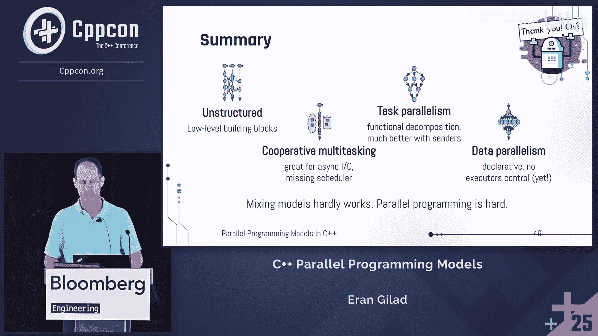

# 004：选择正确的C++并行化工具——底层与异步与协程与数据并行


在本节课中，我们将学习C++中四种主要的并行编程模型。我们将探讨每种模型的核心概念、适用场景以及优缺点，帮助你理解如何根据具体需求选择合适的工具。课程内容涵盖从底层的无结构并行到高级的数据并行，旨在为初学者提供一个清晰的并行编程概览。

## 无结构并行模型

上一节我们概述了课程内容，本节中我们来看看第一种模型：无结构并行。这种模型基于C++11引入的最基础构件，如线程和原子操作，提供了最大程度的控制，但也带来了最高的复杂性。

无结构并行模型直接使用操作系统线程和底层同步原语。其核心组件包括：
*   **内存模型与原子操作**：如 `std::atomic`，用于实现无锁编程和细粒度同步。
*   **线程**：`std::thread`，代表一个独立的执行流。
*   **同步原语**：如互斥锁 (`std::mutex`)、条件变量 (`std::condition_variable`) 以及C++20引入的信号量 (`std::semaphore`) 和闩 (`std::latch`)。
*   **便利工具**：如RAII锁包装器 (`std::lock_guard`)、`std::jthread`等。

以下是该模型的主要使用场景：
*   **构建高级并行设施**：例如，实现自定义的线程池或自旋锁。
*   **实现并发数据结构**：设计允许细粒度访问或完全无锁的数据结构，以提升并发性。
*   **运行长期后台服务**。

该模型的优点在于控制力强，性能潜力高。缺点则是内存模型复杂，极易引发数据竞争和死锁，对开发者要求极高。线程本身只是一个执行载体，不包含任务语义，因此任务逻辑中必须交织同步代码，这增加了复杂度和出错风险。

## 任务并行模型

上一节我们介绍了需要手动管理一切的无结构模型，本节中我们来看看更高级的任务并行模型。它将计算单元抽象为独立的“任务”，从而将功能逻辑与执行调度解耦。

在任务并行模型中，一个任务代表一段相对独立、无副作用的计算。任务可以是函数、Lambda表达式或循环迭代。关键优势在于，运行时环境（如线程池）负责调度任务，任务本身无需关心在哪个线程上执行或如何访问共享数据。

在C++26之前，任务主要通过 `std::async` 实现。它启动一个异步任务并返回一个 `std::future` 对象，调用者可以在未来通过 `future.get()` 获取结果。其启动策略 (`std::launch`) 决定了任务是立即在新线程执行、延迟执行还是由运行时决定。

`std::async` 的局限性在于任务无法组合、执行上下文难以配置、缺乏调度控制。C++26引入的 **发送器/接收器 (Senders/Receivers)** 模型极大地改善了这一点。发送器是惰性的、可组合的异步操作描述符。以下是一个简单的发送器使用示例：

```cpp
// 创建任务链，此时并未执行
auto task_graph = just("Hello")
                | then([](std::string s) { return s + " World"; })
                | then([](std::string s) { std::cout << s; return; });
// 同步等待并执行整个任务图
sync_wait(task_graph);
```

发送器支持任务链式组合、灵活的调度器配置（线程池、协程、GPU等）、内置停止和错误处理机制，代表了C++异步编程的未来。

## 协作式多任务（协程）模型

上一节我们讨论了基于任务的异步模型，本节我们探讨一种特殊的任务模型：协作式多任务，其核心是C++20引入的协程。这种模型特别适合处理大量可能阻塞的任务，例如I/O操作。

协程是可以在函数内部显式挂起和恢复的函数。当协程遇到 `co_await` 表达式时，它会挂起自身并将控制权返还给调用者或调度器，而不会阻塞底层线程。这使得单个线程可以在多个任务间高效切换，充分利用CPU资源。

一个简单的协程示例如下：
```cpp
coro_task my_coroutine() {
    std::cout << "Before wait\n";
    co_await some_awaitable; // 挂起点
    std::cout << "After wait\n";
}
```
`co_await` 等待一个“可等待体”，该对象通过 `await_ready`, `await_suspend`, `await_resume` 三个方法控制协程的挂起与恢复逻辑，这构成了调度点。

要使协程用于有效的并行任务处理，需要：
1.  **并行性**：需要多核CPU或异步I/O设备来真正实现并发。
2.  **调度器**：需要一个用户态的调度器来跟踪大量被挂起的协程，在I/O完成等事件发生时恢复其执行。

在协程模型中，通常采用单线程-per-core的调度器。需要注意的是，协程在挂起后可能在不同线程上恢复，因此应避免使用线程本地存储和原生的阻塞式同步原语（如 `std::mutex`），而应使用协程感知的、非阻塞的同步机制。

与协程相关的还有**纤程**，即用户态线程。纤程是栈式协程，可以在任意嵌套函数调用中挂起，更像一个通用的执行上下文。但C++标准目前尚未支持纤程。

## 数据并行模型

上一节我们介绍了基于控制流的并行模型，本节我们转向另一种思路：数据并行模型。该模型关注于对大规模数据集进行统一操作，通过并行处理数据本身来获得加速。

C++17引入的并行算法是此模型的代表。其通用形式为：
```cpp
std::reduce(std::execution::par, data.begin(), data.end());
```
调用是顺序的，但通过**执行策略**参数，我们声明了允许的并行方式，运行时则负责具体的并行化实现。这是一种高级的、声明式的API。

C++标准定义了四种执行策略：
*   `std::execution::seq`：顺序执行。
*   `std::execution::par`：允许并行，但单线程内操作不交错。
*   `std::execution::par_unseq`：允许并行和向量化（单线程内操作可交错）。
*   `std::execution::unseq`：仅允许向量化（单线程内）。

该模型的优点是安全（无数据竞争、死锁）、高效（可利用多核甚至GPU），且代码简洁。缺点是我们对底层资源（如使用哪个线程池）控制力较弱。需要注意的是，并行算法作用于容器数据，但容器本身并非线程安全的，若其他线程同时修改容器结构，仍会导致数据竞争。

## 混合使用模型

在分别了解了四种模型后，一个自然的问题是：能否混合使用它们？答案是：可以，但需格外谨慎，因为并行编程本身就很复杂。

混合模型时，核心考量是**CPU资源的利用率**和**同步机制的兼容性**。以下是几个基本原则：

1.  **当程序主要使用无结构并行（如自定义线程池）并已占满核心时**：几乎没有剩余计算资源给其他模型。可考虑用协程处理异步I/O，但不宜再引入并行算法或更多线程。
2.  **当程序主要使用任务并行（如发送器）且核心空闲时**：可以从任务内部调用并行算法来加速计算。但要避免在任务中使用阻塞式同步原语。
3.  **当程序主要使用协程调度器时**：如果调度器已充分利用多核，则无需再混用其他模型。如果仅用于少量I/O，在协程中调用并行算法会阻塞该协程，通常不是好选择。
4.  **当程序主要使用并行算法时**：在算法执行的Lambda中混用其他模型（如启动新异步任务）通常很别扭，且应绝对避免使用阻塞式同步，否则会破坏并行性。

总之，混合模型通常效果不佳，因为不同模型的运行时可能彼此不知晓，容易导致资源过度订阅或同步问题。最佳实践是尽可能在单一模型内解决问题。

## 总结与问答

本节课中我们一起学习了C++中四种主要的并行编程模型：
1.  **无结构并行**：基于C++11底层构件，控制力强但复杂高危。
2.  **任务并行**：基于 `std::async` 和未来的发送器，将计算抽象为可组合的异步任务。
3.  **协作式多任务**：基于协程，适合处理大量I/O密集型任务，需要自定义调度器。
4.  **数据并行**：基于并行算法，声明式处理大数据集，安全高效但控制力弱。

混合这些模型通常很困难，需要仔细权衡资源与同步问题。

---

**观众问答精选**



*   **问**：我的项目用大量进程而非线程做并行。如何说服团队转向线程？
    *   **答**：25年前C++对线程支持不足，进程是合理选择。如今，线程拥有标准化的通信和同步机制，内存共享也更高效。转向现代C++线程模型能简化代码、提升性能，尽管需要一定的迁移投入。

*   **问**：我的应用有一个阻塞式I/O线程，如何在此场景下实现并行？
    *   **答**：如果I/O是阻塞的，那么使用基于线程的并行是合适的。操作系统能感知线程阻塞并调度其他线程。更好的长期方案是尽可能将I/O改为异步API，然后就可以采用任务并行或协程模型。


*   **问**：使用 `std::async` 时，能否通过传递和等待 `future` 来组合任务？
    *   **答**：可以手动编码实现，例如在一个任务完成后启动下一个。但这需要调用者反复介入，效率较低且繁琐。而像发送器这样的模型提供了内建的任务图组合功能，更优雅和高效。