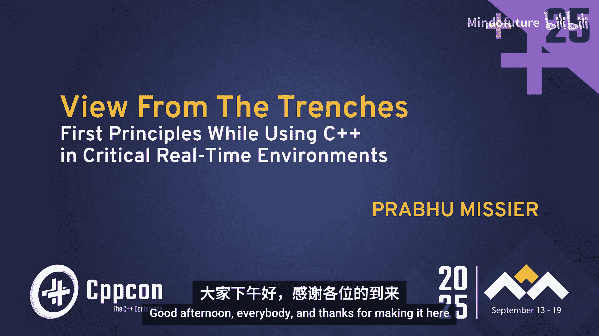
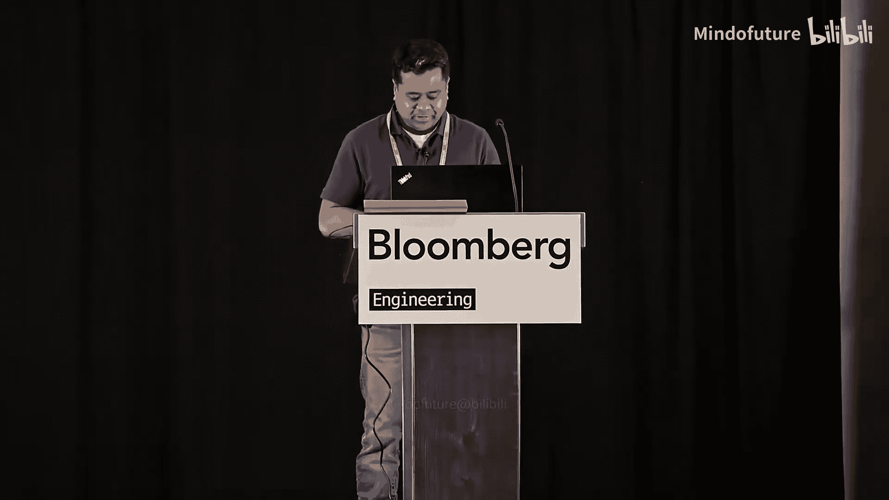
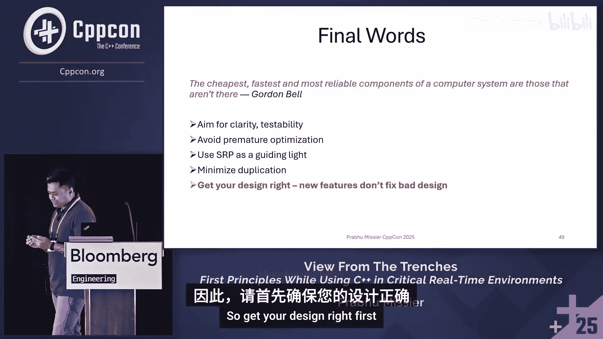

# 006：设计模式与最佳实践 🧠






在本节课中，我们将学习C++应用程序设计中的核心第一性原理，重点探讨关键的设计模式、类设计原则以及性能优化技巧。这些原则对于构建可靠、可维护且高效的软件至关重要，尤其是在安全关键领域。

## 设计模式 🧩

设计模式是解决常见软件设计问题的可复用方案。上一节我们介绍了课程概述，本节中我们来看看几个关键的设计模式及其应用。

### 访问者模式

当需要为对象结构添加新的操作，而不想修改这些对象的类时，访问者模式非常有用。它通过将操作与对象结构分离来实现。

以下是访问者模式的经典实现方式，它使用了运行时多态（虚函数）和双重分派：

```cpp
class ShapeVisitor; // 前向声明
class Shape {
public:
    virtual void accept(ShapeVisitor& visitor) = 0;
    // ... 其他成员
};

class Rotate : public ShapeVisitor {
public:
    void visit(Shape& s) override {
        // 实现旋转逻辑
    }
};
```

现代C++（C++17及以上）提供了更优雅的实现方式，使用 `std::variant` 和 `std::visit`，这通常比经典实现性能更高，耦合度更低。

```cpp
using ShapeVariant = std::variant<Circle, Square>;
ShapeVariant shape = Circle{};

std::visit([](auto& s) {
    // 对形状s进行操作
}, shape);
```

### 策略模式

策略模式定义了一系列算法，并将每个算法封装起来，使它们可以相互替换。它让算法的变化独立于使用算法的客户。

考虑一个计算飞机起飞重量的场景。不同的飞机类型（如支线客机、长途客机）有不同的计算策略。错误的设计是将计算逻辑与飞机类紧密耦合。

```cpp
// 错误示例：计算逻辑与类深度耦合
class Aircraft {
public:
    virtual double calculateTakeoffWeight() = 0; // 纯虚函数却有实现
};
class RegionalJet : public Aircraft {
    double calculateTakeoffWeight() override {
        // 调用基类实现？逻辑混乱
        return Aircraft::calculateTakeoffWeight();
    }
};
```

正确的做法是使用策略模式，将计算算法提取到独立的类层次结构中。

```cpp
class TakeoffWeightStrategy {
public:
    virtual double calculate() = 0;
};
class RegionalWeightStrategy : public TakeoffWeightStrategy {
    double calculate() override { /* 支线客机策略 */ }
};

class RegionalJet {
    std::unique_ptr<TakeoffWeightStrategy> strategy;
public:
    double getTakeoffWeight() { return strategy->calculate(); }
};
```

关键原则是：**优先使用组合而非继承**。不要为了代码复用而盲目使用继承。

### 命令模式

命令模式将请求封装为一个对象，从而使你可以用不同的请求对客户进行参数化，支持请求的排队、记录日志以及撤销操作。

考虑一个多视图显示的医疗成像系统。每个视图（如后视图、侧视图）需要在单独的线程中渲染。错误的设计是将线程管理逻辑和显示逻辑混合在一起。

```cpp
// 错误示例：违反单一职责原则
class PosteriorDisplay {
    void display() {
        std::thread t([this](){ /* 显示逻辑 */ }); // 线程管理与业务逻辑耦合
        t.join();
    }
};
```

命令模式通过分离“执行什么”和“如何执行”来解决这个问题。线程作为工作者，只负责执行命令，而不需要知道命令的具体细节。

```cpp
class Command {
public:
    virtual void execute() = 0;
};
class PosteriorDisplayCommand : public Command {
    void execute() override { /* 纯显示逻辑 */ }
};

// 线程管理部分
std::unique_ptr<Command> cmd = std::make_unique<PosteriorDisplayCommand>();
workerThread.schedule(std::move(cmd));
```

当对象不需要为了存在而了解其将要执行的操作细节时，考虑使用命令模式。

### 适配器模式

适配器模式用于连接两个不兼容的接口，使其能够协同工作。它是一种结构型设计模式。

例如，在医疗成像系统中，可能需要将第三方图像格式的接口适配到标准的DICOM图像接口。

```cpp
class DICOMImage {
public:
    virtual void storeImage() = 0;
};
class ThirdPartyImage {
public:
    void writeToDisk(); // 不兼容的接口
};

// 适配器类
class ProprietaryDICOMAdapter : public DICOMImage {
    ThirdPartyImage tpImage;
public:
    void storeImage() override {
        tpImage.writeToDisk(); // 调用第三方实现
    }
};
```

优先使用对象适配器（基于组合），而非类适配器（基于继承），以获得更大的灵活性。

### 观察者模式

观察者模式定义了一种一对多的依赖关系，当一个对象的状态发生改变时，所有依赖于它的对象都会得到通知并自动更新。

在端点管理系统中，端点管理器需要观察众多设备（端点）的状态。有两种主要类型：
*   **推模式观察者**：被观察者主动将事件推送给观察者。耦合度低，但观察者需要过滤大量事件。
*   **拉模式观察者**：观察者主动从被观察者拉取特定状态信息。耦合度较高，但能获取精确信息。

现代C++可以使用 `std::function`、`std::shared_ptr` 和 `std::weak_ptr` 来实现回调机制，协程也可用于管理异步事件。

### 桥接模式

桥接模式将抽象部分与它的实现部分分离，使它们都可以独立地变化。它是比Pimpl惯用法更一般化的形式。

考虑飞机速度计算器的问题。不同的航空管理机构（如FAA， JAA）有不同的计算规则。错误的设计是在飞机类中直接包含具体计算器的物理依赖。

```cpp
// 错误示例：头文件暴露了具体实现依赖
// Aircraft.h
#include “FAASpeedCalculator.h” // 物理依赖！
class Aircraft {
    FAASpeedCalculator calc; // 具体实现
};
```

桥接模式通过一个指向实现的指针来隐藏这些细节。

```cpp
// Aircraft.h
class SpeedCalculator; // 前向声明，不暴露细节
class Aircraft {
    std::unique_ptr<SpeedCalculator> speedCalc; // 桥接
public:
    double getSpeed();
};

// Aircraft.cpp
#include “FAASpeedCalculator.h” // 实现细节隐藏在.cpp文件中
Aircraft::Aircraft() : speedCalc(std::make_unique<FAASpeedCalculator>()) {}
```

这消除了物理依赖，缩短了编译时间，并允许抽象和实现独立演化。当你需要将抽象与实现解耦时，考虑使用桥接模式。

## 其他模式与高级主题 ⚙️

上一节我们探讨了几个核心设计模式，本节中我们来看看一些高级主题和替代方案。

### CRTP与概念

虚函数会带来运行时开销。奇异递归模板模式（CRTP）使用编译时多态来替代运行时多态。

```cpp
template <typename Derived>
class Base {
public:
    void interface() {
        static_cast<Derived*>(this)->implementation(); // 编译时分派
    }
};
class Derived : public Base<Derived> {
    void implementation() { /* ... */ }
};
```

C++20的概念（Concepts）可以定义一组类型的需求，有可能在某些场景下替代CRTP。

### 关于继承的思考

继承是C++中最紧密的耦合关系之一（仅次于友元）。著名演讲者Sean Parent曾说过：“继承是万恶之源”。在决定使用继承前，请三思是否真的需要“是一个（is-a）”的关系，还是“有一个（has-a）”的关系（组合）更合适。类型擦除模式是另一种强大的替代方案。

## 类设计的一般技巧 🛠️

良好的类设计是稳健软件的基石。本节我们来看看一些通用的类设计原则。

### 非虚接口（NVI）惯用法

公共接口应该稳定，而实现细节可以变化。非虚接口惯用法建议将公共函数设为非虚的，并让它调用一个私有的或受保护的虚函数来完成实际工作。

```cpp
class Aircraft {
public:
    // 稳定的、非虚的公共接口
    double getTakeoffWeight() {
        return doGetTakeoffWeight(); // 调用私有虚函数
    }
private:
    // 可定制的实现细节
    virtual double doGetTakeoffWeight() = 0;
};
```

这分离了公共接口和定制接口，两者可以独立演化而不破坏客户端代码。

### Pimpl惯用法

Pimpl（Pointer to Implementation）是桥接模式的一个特例，用于隐藏类的实现细节，减少编译依赖。

```cpp
// Widget.h
class Widget {
    struct Impl; // 前向声明实现类
    std::unique_ptr<Impl> pImpl;
public:
    Widget();
    ~Widget(); // 需要显式定义析构函数
    void publicMethod();
};
```

这能显著缩短编译时间，并避免名称污染。

### 非成员非友元函数

尽可能使用非成员非友元函数。这能促进更好的封装，因为它无法访问类的私有成员，迫使你编写更通用的、基于公共接口的代码，同时有助于避免产生庞大的“上帝类”。

### 单一职责与最小化接口

一个类应该只有一个引起变化的原因。`std::string` 是一个反例，它拥有超过100个成员函数，复制了许多标准算法，提供了多种访问方式（下标和迭代器），导致接口臃肿。**最小化的类**更易于理解、编译、维护和部署。

### 避免向下转型

使用 `dynamic_cast` 进行向下转型通常意味着基类抽象不完整，设计存在缺陷。这会使代码变得脆弱。应该更多地依赖编译时类型系统和多态，与编译器协同工作。

```cpp
// 不佳的设计
Base* ptr = getObject();
if (auto* derived = dynamic_cast<Derived*>(ptr)) {
    derived->specialFunction(); // 基类没有此接口
}
```

## 性能与资源管理 ⚡

在保证了设计的正确性之后，我们还需要关注性能和资源的正确管理。

### 算法复杂度

避免使用O(n²)或指数级的算法。了解并选择合适复杂度的数据结构：
*   **O(log n)**：`std::set`, `std::map` 的查找操作。
*   **O(n)**：`std::vector` 的线性查找，`std::for_each`。
*   **O(1)**：`std::unordered_map` 的平均情况查找，`std::vector::push_back`（摊还）。

### 使用重载避免隐式转换

隐式转换会创建临时对象。提供必要的重载以避免之。

```cpp
void process(const std::string& s);
void process(const char* s); // 提供重载，避免从 `const char*` 到 `std::string` 的隐式转换
process(“hello”); // 现在直接调用第二个重载
```

### 首选 `std::vector`

对于序列容器，`std::vector` 在大多数情况下都是最佳选择，因为它具有最低的空间开销、最快的遍历速度以及几乎最快的迭代器。

### 范围操作优于循环内单次操作

对于插入等操作，使用范围版本（如 `insert(end(), beginOther, endOther)`）通常比在循环中单次插入更高效，因为前者允许编译器进行更好的优化。

### 资源获取即初始化（RAII）

利用RAII管理资源生命周期：在构造函数中获取资源，在析构函数中释放。使用智能指针（`std::unique_ptr`, `std::shared_ptr`）、锁守卫（`std::lock_guard`）等。

注意构造函数的初始化顺序。在一条语句中初始化多个成员时，如果某个构造函数抛出异常，可能导致资源泄漏。最好将每个资源的初始化放在独立的语句中，并立即交给其所有者（如智能指针）。

```cpp
// 可能有问题
auto p1 = std::make_shared<Port>(“A”);
auto p2 = std::make_shared<Port>(“B”); // 如果“B”构造失败，p1已创建，但整体对象可能未完全构造
// 更安全：分别初始化
```

始终使用智能指针。绝不混用 `malloc/free` 和 `new/delete`。

## 关于全局对象与静态对象的忠告 ⚠️

全局和静态对象会增加耦合度，并可能引发“静态初始化顺序灾难”（Static Initialization Order Fiasco）。

```cpp
// Logger.h
extern Logger globalLogger; // 在某个翻译单元定义

// Network.cpp
void initNetwork() {
    globalLogger.log(“Initializing”); // 如果globalLogger尚未初始化，则崩溃
}
```

解决方案包括使用“首次使用惯用法”（在函数内返回局部静态对象的引用）或迁移到C++20模块（模块初始化顺序有明确规定）。如果必须使用，请小心初始化，并在多线程环境下使用适当的同步原语避免数据竞争。

## 其他重要提示 💡

### 不要重载逻辑运算符

重载 `&&` 和 `||` 会失去短路求值特性，并且函数参数的求值顺序是未指定的，可能导致非预期行为。

```cpp
bool operator&&(const A& a, const B& b);
if (a.isValid() && b.isReady()) { // 重载后，a.isValid()和b.isReady()的求值顺序不确定
    // ...
}
```

### 函数参数求值顺序

即使C++17规定了函数实参的求值顺序，但为了代码清晰和可移植性，不要编写依赖于特定求值顺序的代码。

```cpp
int i = 0;
foo(i++, i++); // i的值？结果是未指定的行为
```

### 避免对非平凡数据类型使用 `memcpy`

`memcpy` 不调用构造函数、析构函数，也不处理虚函数表。对非平凡数据类型（如含有虚函数或复杂成员的对象）使用 `memcpy` 会导致未定义行为。

### 使用最高警告级别编译

将编译器警告视为错误。如果必须禁用第三方库的警告，请使用 `#pragma` 指令局部禁用，并确保你理解被禁用警告的含义。

## 总结 📝

本节课中我们一起学习了C++应用程序设计的核心第一性原理。

我们探讨了多个关键设计模式：
*   **访问者模式**：用于添加新操作。
*   **策略模式**：用于封装可互换的算法。
*   **命令模式**：用于将请求封装为对象。
*   **适配器模式**：用于连接不兼容的接口。
*   **观察者模式**：用于一对多的依赖通知。
*   **桥接模式**：用于分离抽象与实现。

我们还回顾了重要的类设计原则，如非虚接口（NVI）、Pimpl惯用法、优先使用非成员非友元函数、坚持单一职责原则以及设计最小化接口。

在性能方面，我们强调了选择正确算法复杂度、使用 `std::vector`、利用RAII进行资源管理以及避免隐式转换的重要性。

最后，我们讨论了关于全局对象、运算符重载、求值顺序和编译器警告的实用建议。




记住Gordon Bell的格言：“计算机系统中最便宜、最快、最可靠的组件是那些根本不存在的组件。” 这意味着：只编写必要的代码。始终将**清晰性**、**可测试性**和**单一职责原则**作为指导方针，避免过早优化，并最大限度地减少重复。在拥抱C++最新特性的同时，请记住，**良好的设计是优秀软件的根基**，新特性无法修复糟糕的设计。首先把设计做对。