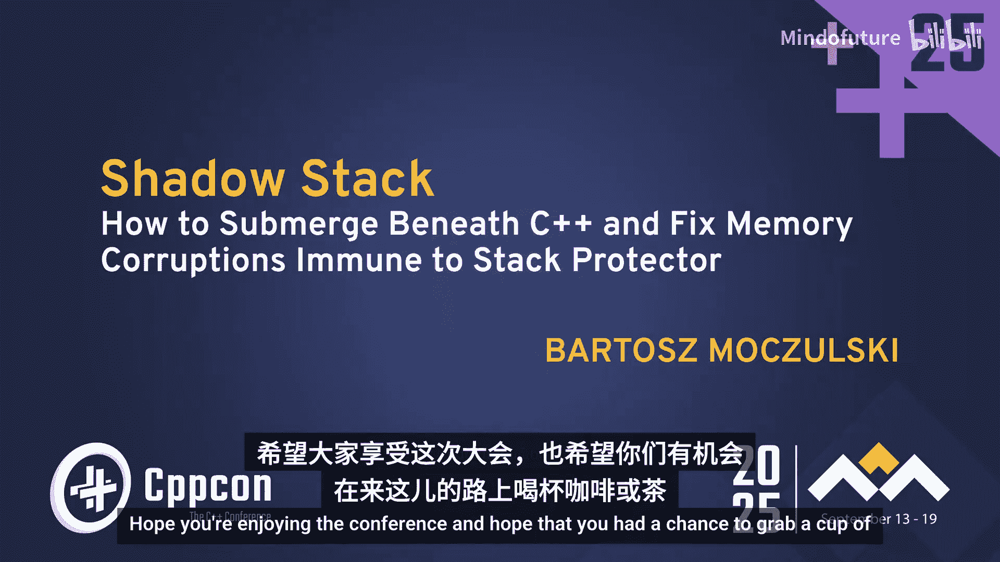
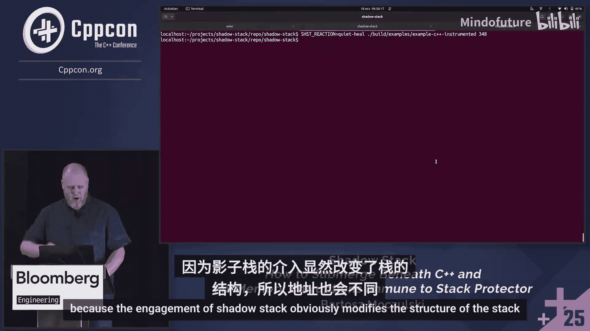
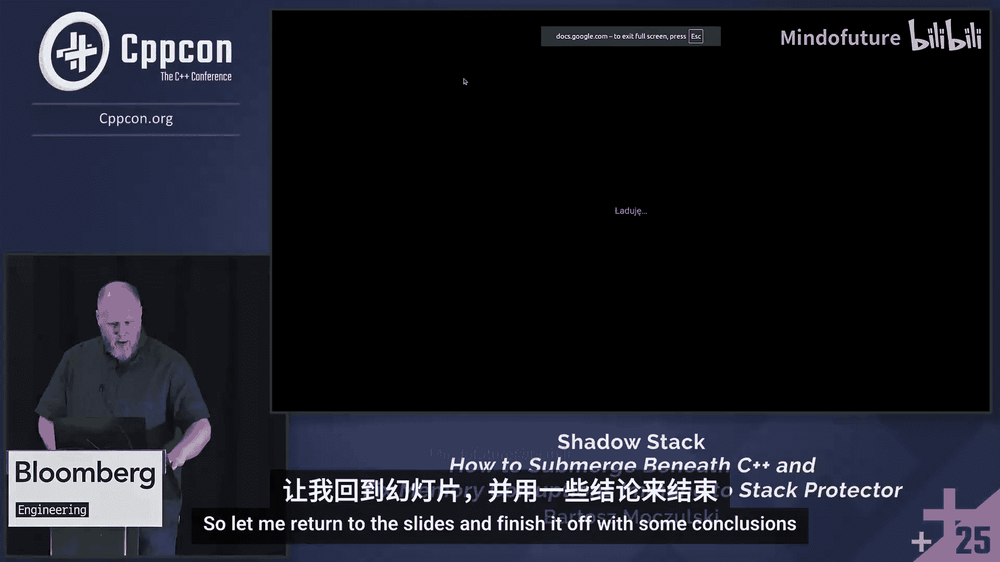
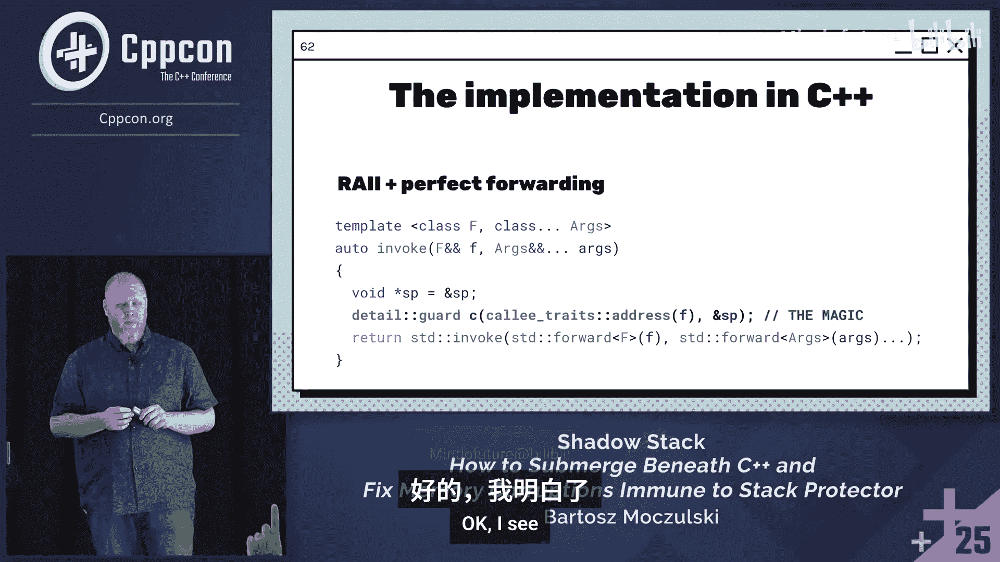

# 007：实战案例与解决方案

## 概述

在本节课中，我们将学习如何诊断和修复一个由栈内存损坏引发的C++程序崩溃问题。我们将跟随一个真实案例，了解栈损坏的隐蔽性，并学习一种名为“影子栈”的实用技术来定位和解决此类问题。

---

## 章节 1：问题初现

亲临现场参加会议的好处之一是，公司会在这里寻找世界上最优秀的人才。无论是职业发展、建立人脉还是提升技术技能，这些都无法仅通过视频获得。

大家早上好。希望你们享受这次会议，希望你们有机会在来的路上喝杯咖啡、茶或其他喜欢的饮料。

我的名字是Bartosz Moczulski。我来这里是为了谈论影子栈。但你们可能从我的名字和姓氏推断出，我来自波兰。在几次场合中，我注意到我的名字可能会让世界各地的英语使用者感到困惑。所以我将快速为你们分解一下。

想象一下我的名字末尾是H而不是Z，因为我们在波兰语中就是这样做的。我们用S加Z在英语中相当于S加H，但发音完全相同。所以我的名字是Bartosh。如果你们的一些祖先是海盗或维京人，你们甚至更有机会将R的发音更接近波兰语的发音。但没关系，我认为这样就可以了。如果你们想向我提问，以后可能会用到。

如果我们继续并应用同样的技巧到我的姓氏上。再加一个。为什么它不继续？好了。同样，我们用H替换Z，用双O替换U，因为波兰语从未经历过元音大推移。姓氏听起来像Moczulski。这就是我。这是波兰语音学101。谢谢参加。是的，所以解散了。当然，你们是来听影子栈的，你们会听到的。在我开始之前，我需要问你们一个问题。你们中有多少人家里有电视机？好的，几乎所有人。这正是我期望的。那么，你们有时会用它来看流媒体服务吗，比如Netflix或Hulu之类的？仍然，几乎所有人，很好。

我很高兴听到这个，因为我就是那个在幕后不知疲倦地工作，让你们的电视播放正常工作的人，这样你们就可以在舒适的沙发上享受电视了。这就是我的工作。在过去的20年左右，我一直参与数字电视行业，主要专注于为机顶盒制作固件，这些是连接到电视的小设备。它们必须接收来自地面、卫星或运营商的信号。

如果我对视频播放有一件事了解，那就是机顶盒和其他嵌入式设备。那就是，啊，很困惑。为什么它就这样工作了。啊啊。真可惜。是的，它会无缘无故地崩溃，就像我现在的演示一样。谁知道呢？好了，是的。就像这样崩溃。所以我的演讲实际上是关于我遇到并必须分析和修复的这样一个案例。我现在就要告诉你们所有关于它的事情。是的，所以修复错误。修复错误很容易，对吧，我们有一个通用的方法。首先你需要遇到一个错误，然后你接受它，最后，你希望可以消除它。啊。因为在你发现问题发生之前，在它表现出来并被你观察和记录之前，它并没有坏。只是不要碰它。

在你真正注意到有问题之后，你开始分析，开始收集证据，并开始思考发生了什么以及如何发生的。当你完成分析时，你很有可能相当快地修复那个错误，大多数时候是这样。然而，并非总是如此，因为内存损坏。我想知道你们中有多少人在职业生涯中不得不与内存损坏作斗争。几乎所有人。当然，否则你们就不会在这里了。是的，它是否恰好是栈损坏？如果，最后几只举手了，是的，因为堆损坏比栈损坏更常见。是的，我也是，事实上，在我的职业生涯中，我处理过各种各样的错误，不仅是内存损坏，还有多线程问题、逻辑错误、资源泄漏，应有尽有。集成等等，因为坦率地说，每个软件在编写时都有错误。在IT和软件开发的历史上，将只有两个软件是无错误的。那就是TeX和Metafont。如果你们知道为什么。我想我们都希望它们保持无错误的时间尽可能长。啊。是的。

所以在实践中，我经常扮演Linux侦探的角色。这有两个原因。第一个是Linux是嵌入式设备（如机顶盒）的主要开发环境。第二个是，虽然我有时有机会编写一些代码，有时是新代码，有时是扩展现有功能。但更多时候，我需要调查问题并修复它们。而且我经常成功。这就是为什么我自称为侦探。

在我们深入之前，我想强调一下你们从这次演讲中的收获。我将它们分为三类。第一类只是娱乐。所以也许，只是也许你认为内存损坏与你无关。你已经将所有原始数组替换为STL数组，并且到处使用`std::span`，问题就解决了。公平合理。我会接受。坐下来，带上你的爆米花，享受这个演讲。看着我们其他人受折磨总是很有趣，只要不是你自己。是的，但现实地讲，我们需要意识到这些问题，因为它们不会消失。这些就像是计算机科学的基石。所以如果，如果你们今天在演讲结束时还不知道我将要描述的机制，那么你们就会知道了，这是我的成功，也是你们的巨大成功。所以意识已经是向前迈出的一大步。

但显然，你们不会止步于此，对吧？所以你们来这里是为了学习这些事情为什么会发生，如何发生，以及显然，如何预防和修复它们。这就是我希望帮助你们的地方。一个澄清，我谈论的是栈。显然，不是那个栈。虽然不是那个栈，尽管这是一个很棒的库，非常有用。然而，这不是演讲的主题。我将谈论CPU栈，当然。这是你的局部变量存放的地方，也是CPU用来调用子程序的地方。

---

## 章节 2：栈损坏的挑战

他们说，遇到问题是处理错误的第一步。确实，事情就这样发生了。有一天，我在Slack上收到同事的消息，他是一位经验丰富的高级工程师。他说了类似这样的话。看，Bartosz，关于你们团队一直在开发的那个新的流媒体应用程序，我们即将推出。我说，是的，怎么了？你知道。它崩溃了。我说，不可能，我们过去几周一直在彻底测试它。我的意思是，我们没有注意到任何问题。他继续说，是的，但只有当你观看直播频道时它才会崩溃。我的意思是，公平合理，但是，是的，这已经测试过了，没有人报告任何问题。但他坚持。他说，你知道，但它只是偶尔为我崩溃，比如一天最多一次，最多两次，不会更多。好的。这变得有趣了。显然，我们已经测试过了。是的，我们进行了严格的测试，比如持续很多小时。所以我想我们应该注意到了。但他过来说它崩溃了。他继续并给了我最后一点细节。它只在体育频道、直播体育频道上崩溃。所以你可以想象，如果你喜欢体育，想象一下，例如，观看足球。也许是FIFA世界杯决赛。你的应用程序在比赛中间崩溃了。哦，是的，你可以，你可以导航到主菜单并重新启动它，再次找到这个传输并开始播放。它甚至继续播放。足够好了。但你失去了比赛宝贵的一分钟。所以对于那些对此没有共鸣的人，也许你们，你们关注另一种足球，那种用手玩的，因为显然，是的，你是超级碗。在中间，它崩溃了。你们明白了吧，对吧？在直播体育赛事中间崩溃的流媒体应用程序，会导致很多愤怒的客户。这是一个很大的禁忌。所以在那一刻，我已经知道我将不得不调查它。

好了，所以接受它。系好安全带，我的那位同事，作为高级工程师并在家里使用我们的产品，他有一个机顶盒的开发版本。所以他是唯一遇到这个问题的人。幸运的是，他能够为我抓取一个核心转储，或者可能两个。实际上，三个，一个没用，另外两个有用。

所以我像每个人一样在GDB中打开了核心转储。我能看到什么？它在`pthread_mutex_unlock`中崩溃。现在，我足够聪明，你们肯定也足够聪明，知道`pthread_mutex_unlock`是坚如磐石的。它不可能坏，因为如果它坏了，我们甚至无法启动应用程序。它在那之前会被调用数百万次，任何问题都会更早出现。所以不是`pthread_mutex_unlock`的问题。可能是调用它的函数，对吧，`do_stuff`。为了这次演讲，我这样称呼它。

你们能在这张幻灯片上注意到任何可疑之处吗？是的。这个演讲的对象。0，是的，所以另一个0，0和0，3。好的，有什么问题？它们靠得很近。正确。Lyman女士，我听到Lyman先生，是的，正确。它们没有对齐。好的，已经可疑了，是的。零，零通常是。它可能是一个栈地址。是的，所以评论是，以0，0开头的东西很可能不是栈地址，而FFF应该是。是的，这也是正确的。

所以我们清楚地看到传递给`pthread_mutex_unlock`的地址是不正确的。好的，我的意思是，这会发生。我们有时会犯错误。所以我导航到`do_stuff`函数。

这是我看到的。它就像一个调用其他函数的函数。这是一个陈词滥调。你看，你收到一个指向某个结构的指针。在其中，有一个互斥锁，你锁定它，在临界区内做其他事情，然后解锁它。这里没有问题。是的，显然，互斥锁在某个偏移量处。我把它放在一个字的偏移量处。所以根据架构是4或8字节。好的。我的意思是，这里没有问题。那么，什么可能或应该出错了？`do_stuff_locked`函数，这里的第一个，它工作了，因为我们最终崩溃了。抱歉，我们最终崩溃了。在底部这里，不是在顶部。所以第一行的偏移量计算正确。第二行则没有。如何以及为什么？也许，也许编译器犯了一个错误。公平合理。让我们看看。我真的很抱歉用这个反汇编折磨你们。我希望它不会让你们得红眼病。请不要从头到尾阅读它，我们稍后会逐行讲解。但你们至少能认出这里的架构吗？Arm，我能听到arm。是的，它是arm，具体是arm 64位。由此我们可以推断，传递给P函数的这个指针应该偏移8，而不是4。但它偏移了3。这很奇怪。所以arm，arm很重要。我本可以在Intel x86上展示，对吧，但arm确实重要。为了向你们证明，我将使用这个小工具。你们今天有多少人带了手机？每个人，对吧？相比之下，你们有多少人有笔记本电脑，但特别是带有Intel x86的？可能一半一半，好的。据我所知，世界上arm比x86多得多。这就是我在这个汇编中展示的。这就是为什么我要谈论arm架构，对吧，我们已经讲过了。所以arm，如果你们不知道，或者只是作为回顾，arm上的调用约定。在arm上有32个寄存器，或多或少，加上一些其他特殊的，但核心的是32个，它们都是可互换的。你可以使用其中任何一个，除了你不能，因为你知道，所有寄存器都是平等的，但有些寄存器比其他寄存器更平等。所以寄存器编号31，你永远不会在汇编中看到31。你总是会看到SP，代表栈指针。对于栈损坏非常有用。另外两个，30和29用于调用子程序。所以如果你的函数调用了另一个函数，这些寄存器需要被使用。这，这不像非常重要，但它是一个经典的函数调用帧。所以在顶部，栈帧被设置。这些特殊的寄存器29和30最终被放在栈上。在Intel上，它看起来像push和pop。实际上在arm这里，它是等效的。

继续看更有趣的寄存器。19到28。这些有一个特殊的属性，必须被保存。所以被调用的函数不能改变这些寄存器的值。我的意思是，它可以在内部使用它们，但必须在返回前恢复传入的值。这很重要。这正是我们在这里看到的。这两个寄存器，其中两个，因为这个函数将只使用其中两个，19和20。它们被推送到这个栈上。这个指令，它叫做存储对。所以存储两个寄存器。它们最终在哪里？在栈指针加16的地址处。在底部，它们被弹出。所以函数做了它应该做的事情。它想使用这些寄存器，公平合理，它可以。所以它暂时将传入的值推入栈，并在返回前弹出。

这给我们带来了对本次演讲重要的最后一组寄存器。X0到X7是输入参数。它们也用作返回值，因为在某些语言中，你可以返回多个值，所以。它会进入X1，抱歉，X0，X1，X2等等。在C++中，我们只返回一个值或不返回任何值。好的，所以作为回顾，这就是我们的函数的样子。它接收一个参数，这是一个指针，并调用`do_stuff_locked`函数。它做的第一件事是，它将传入的X0，传入的指针存储在X19中。因为它需要在中间修改X0的值。然后它计算互斥锁的偏移量。所以它指向互斥锁。X0加8。并将其存储在X20中。到目前为止，一切顺利。然后它使用计算出的互斥锁地址调用`pthread_mutex_lock`，将X0作为第一个参数传递给`pthread_mutex_lock`。好的，它返回。所以它继续。它已经计算了，或者甚至没有计算，将传入的指针存储在X19中。它仍然在那里。所以它可以用来调用`do_stuff_locked`，即临界区。一旦它返回，哦，互斥锁的地址仍然在X20中，因为必须保存，回想一下。所以它可以再次复制到X0，并用作`pthread_mutex_unlock`的第一个也是唯一的参数。正如我们已经看到的。它崩溃了，并且它在中间改变了值。看，幻灯片上这里没有对X20的修改。所以一定有什么东西在第一个和第二个高亮行之间改变了X20。所以一定是这个函数。不是我们在后台看到的那个。是另一个，那个。我们的函数调用的那个。所以如果我们深入到子函数，我们已经可以看到那里熟悉的模式。这个子函数。再次，它将分配它的栈帧，并将X19和X20推入栈，在最后弹出并返回。猜猜怎么着？它弹出了正确的值。抱歉，它推入了正确的值，但在最后，它弹出了一个不正确的值。怎么会这样？这是答案。

我们在`pthread_mutex_unlock`上发生了崩溃。我们足够聪明，知道那不是根本原因。所以也许`do_stuff_locked`不是。它可能在`do_stuff_locked`下面，或者在函数本身内部。但它也可能在`do_stuff_locked`的整个调用图中的任何地方。所以这是大海捞针。我们需要找到它。这不会容易。

这是它在实践中如何工作的图示。所以这不是宇宙射线，没有魔法，什么都没有。可能只是某个数组的越界修改。我们从`do_stuff`开始。它在栈上有一些帧，然后它调用`do_stuff_locked`。显然它分配了自己的帧，我们继续到某个其他有错误的函数。这个有错误的函数做了什么，你们可能已经猜到了。它修改了父帧之一，不是它自己的，不是堆上的东西，而是栈上更高的东西。在这一点上，你们可能会问，嘿，Bartosz，但我们有栈保护器，对吧？它应该拯救我们。不是吗？我很高兴你们问。是的，评论。更多写入。怎么样？我猜我，我能理解你们的意思。是的，它不会拯救我们，不是在这种情况下。因为栈保护器实际上是这样做的。在调用任何函数之前，它将一个额外的值推入栈。它叫做金丝雀。它叫做金丝雀。我的意思是这个名字，可能你们很多人会知道它来自旧日的采矿业，在地下室中，甲烷或其他致命气体会积聚。所以矿工们不想冒生命危险。相反，他们把一只小鸟放在笼子里放进那些房间。如果鸟活下来了，这个地方工作就是安全的，矿工们可以进入。如果鸟死了，抱歉，这是他们愿意做出的牺牲。为了保护他们自己的生命。所以我们有了金丝雀，这个栈上的第一个金丝雀。然后只是调用我们的常规函数。也许它进入另一个函数。所以我们做什么？我们推入另一个金丝雀。另一个栈帧，容易，对吧？第三个金丝雀。我们最终进入一个有错误的函数，这个有错误的函数。是的，如果它只是覆盖了自己的金丝雀。那么就会很容易。它会在从有错误的函数返回时立即被检测到。好的，这显然没有发生。那么如果有错误的函数修改了另一个金丝雀呢？好的，它不会立即被检测到。它只会在从`do_stuff_locked`返回后被检测到。所以稍晚一点，但仍然会被检测到。最坏的情况发生在有错误的函数修改了中间的东西时。因为栈保护器完全无法检测到这种损坏。这不是因为栈保护器有任何问题，哦不。是因为它被设计来处理这种情况，连续的栈修改。如果你的数组越界很多字节，也许你错误计算了参数，你的`memcpy`或`strcpy`或任何东西。许多连续的字节。是的，它们会被检测到。单个字节。现在不会。那么。我们做什么？你们碰巧不知道吗？是的，已经有问题了。你能增加金丝雀的大小吗？增加捕获这种错误的几率，而不是一个字节。你放一个大猫。是的，但仍然，我的意思是，那可能有用。重复问题。哦，抱歉，抱歉。所以问题是，你能扩大金丝雀并使其更大，比如超过1字节吗？是的，你可以，但我认为它不会改变，因为你仍然可以损坏不是金丝雀的东西。我们最终还是一样。其他问题，是的。这是一个硬件断点。保存的地址。但或者。函数。所以让我重复这个问题，如果我理解正确，你可以为该特定地址在栈上的修改设置硬件断点。是的，你可以。假设你知道它发生时的确切地址。让我提醒你，它每隔几小时发生一次，也许一天一次。你不一定知道哪个地址会被损坏。你也可以设置条件断点。是的，所以评论是你可以设置条件断点，是的，你当然可以。但仍然，你需要提前知道损坏的地址将是什么。在我的情况下，它总是那个。你的意思是像为修改栈上任何旧地址设置条件断点吗？条件断点。什么是栈？函数本身。那个下一个学生的地址是什么？好的，所以像条件断点，你说基于当前栈指针的条件断点。也许夏天。是的，也许仍然，你需要知道从当前栈指针到实际被损坏地址的偏移量是多少。我没有那个信息。幸运的是，它，它会工作，是的。但你们知道还有其他工具可以帮助我们吗，我看到你的右手。是的，我认为它不工作。绝对是，Valgrind。我甚至查了他们的网页，看他们怎么发音，我，据说它是Valgrind，像北欧的发音。是的，不幸的是，不行，有两个原因。第一个是，对于我们的情况来说太慢了，因为我们是在嵌入式设备上运行一个完整的网络浏览器，一个相当受限的环境。所以运行Valgrind的开销是不可接受的。第二个原因。它更像是一个根本原因。修改栈不是一个非法操作。你完全可以将指向栈上对象的指针传递给函数，期望它进行修改。这是一个合法的情况。所以Valgrind将无法标记它，因为，嘿，有人在修改栈。这随时都在发生。所以由于这两个原因，不幸的是不行。所以我正在聊天。是的，也许避免使用。栈缓冲区。也许避免使用栈缓冲区，你具体是什么意思？所以为了保护我们免受栈损坏，避免使用栈缓冲区是一个好指南。好的，所以，所以想法是，不要在栈上使用变量。将它们移到堆上，对吧。好的，然后，然后也许你会更安全。好的，也许你的对象会更安全，但栈仍然可能被损坏。可能，对吧，另一个。我们想。我们可以使用MPU，对吧，好的，内存管理单元，对吧？是的，内存。所以这是一个小的升级。所以我们只是说你不允许。当。James Fritz。是的，所以好的，所以保护评论是我们可以使用MPU来保护我们栈的片段，并允许其他线程修改它。猜猜怎么着。它来自同一个线程。那不会得到它。但我没有。好的，所以是的，所以好的，不。我的意思是限制栈变量的使用，支持堆。是的，那可能有时有效。这是一个我确实考虑过的想法。实际上，我甚至想到，嘿，Linux有这个内存保护API，所以我也许可以锁定我不允许修改的栈部分，但这会以4或64KB的块为单位。不幸的是，你不能保护单个字节。所以我必须用别的东西。我得到了。这个空间，你实际上可以使用一些更新的功能，叫做用户fault fd，它可以让你。我们处理页面错误。所以也许你可以设置一个。每当有东西访问。那个你。好的，所以评论是，在新的Linux中，有你怎么称呼它用户错误，对吧？它叫做用户fault fd或类似的东西。我必须查一下，因为我不知道那个特定的功能。听起来很有用。我们不知道。所以，所以我们需要考虑其他东西。我最终和我的一个朋友聊了几天。经过一番折腾，我们最终想到了这个主意。嘿，如果我们创建并维护栈的第二个副本，并且总是知道那里有什么呢？如果我们检测到并且当我们检测到某些东西被损坏时，那么我们至少可以做出反应。你有评论。还有其他东西，我的意思是地址清理器。它可能可用。然而，它是否适用于栈到那种程度？由于与Valgrind相同的原因，它不会工作。啊，那个。亚瑟所以。是的，是的，所以另一个。是的。所以共识是，由于与Valgrind相同的原因，它不一定有效。是的，不，它有一个更大的保护区域，所以可能由于随机运气而有效。一般来说，现在，是的，一般来说现在。所以也许如果我们幸运的话，可能，但一般来说，不是真的。所以，所以，你知道，我们，我和我的朋友一起头脑风暴。我们最终想到了这个主意。嘿，让我们创建一个栈的副本。让我们一直进行内存复制。这就是影子栈的诞生。在名字上，我的意思是，我从一个概念中汲取了一些灵感，这个概念在英国政治中尤其知名，也许在美国不那么知名。但有一个影子内阁的概念。所以想象有一个虚构的国家。让我们称之为计算机之地。他们有两个政党，大印第安人和小印第安人。也许他们刚刚举行了选举。碰巧大印第安人赢了。所以显然，他们任命首相和政府等等。你们知道它是如何运作的，对吧？那么反对党做什么，刚刚失败的小印第安人？他们将任命自己的首相和自己的政府。他们称之为影子内阁。如果我们这些人，他们不被允许统治。但他们待命，就像监视实际政府做什么并批评他们。如果碰巧一些小印第安人说服了一些大印第安人改变立场。他们获得了多数席位，他们得以统治，并且他们有人准备好从第一天开始统治。在网络安全中，我们将称之为从零日即时开始。所以是的，影子。影子栈，我猜，是受到同一概念的启发。这就是我们最终编写的。这就是我们设计它的使用方式。所以假设你有一个函数。你怀疑它有问题。你用`shadow_stack_invoke`包装它，就像你会用`std::invoke`一样。事实上，它在内部使用了`std::invoke`。也许你有时有一个方法代码，因为，是的，它们在我们的代码中到处散布。所以你，你只需以同样的方式使用这个。影子栈调用你的方法，你就没问题了。它在幕后施展魔法，对吧？这是实际的实现。我不是在开玩笑，这是源代码的副本，没有烟雾和镜子。所以我们获取栈的地址，就像它现在这样，我们施展魔法，我将在下一张幻灯片上解释。然后我们将所有东西转发给普通的、常规的`std::invoke`。它们非常适合转发。没什么特别的。那么这个魔法做什么？首先，在深入到底层代码之前。它显然会计算当前的栈地址。并将缺失的位追加到影子区域，到副本中。在返回前不久以及调用返回后。它将。丢弃任何需要的东西。在中间，就在深入之前和返回之后，在丢弃额外位之前。它将进行内存复制。并且会立即检测到，嘿，一切仍然正确还是我的字节已经损坏了？如果它检测到东西被损坏了，那么它将相应地做出反应。它可能会打印回溯。它可能会做其他事情，我相信你们的想象力会建议可以做什么。就像，我们非常幸运，我们正在与一个C库接口。在C中，你没有完美的转发或任何东西。或者也许你有。但这几乎是完美的转发。你需要使用一些编译器内部函数和一些宏来实现它，我们都非常喜欢。在C中这是不可避免的，但，但可以做到。也许你不想修改你的代码，对吧，因为那有失身份。所以也许你更喜欢使用`LD_PRELOAD`。这很公平。我们为你提供了支持。这里，我有一个如何使用`LD_PRELOAD`技术包装函数的例子。这里`dlsym`获取实际函数的地址，我们将所有东西转发给实际函数。请注意。这里有一个无耻的ABI滥用。我只是想通了。让我们假装这些函数。它们总是接受8个参数，对吧。我只是将它们向下传递。如果它们碰巧是指针或整数，从处理器的角度来看，这并不重要。我的意思是，不要尝试这段代码，对吧，不要在家里尝试，但它确实有效。至少如果参数碰巧是基本类型或指针，并且在arm上，在x86上也可以。所以是的。请持保留态度。显然，你也可以包装C++函数。这没有问题。它是如何工作的？我们在`do_stuff`函数中。也许它想调用一些东西。一些受影子栈保护的东西。所以影子栈启动。它做的第一件事是，将影子区域中缺失的任何内容复制到影子区域。没有别的了。然后进行内存比较。现在，这没有太大意义，但稍后会有。让它继续。是的，它让函数被调用和执行。显然，这个函数分配自己的栈帧并将变量存储在那里。也许那个函数调用其他东西。是的，它想调用另一个函数。所以再次，影子栈启动，将剩余的位复制到影子区域。比较，到目前为止一切顺利，没有损坏。所以它允许函数继续。我们有一些函数。而且，你们已经在之前的幻灯片上看到了。它想调用其他东西，所以复制，然后比较，没有差异。我们最终进入有错误的函数。这个有错误的函数，也许它想调用其他东西，也许它只是想返回。在这里，它损坏了父帧之一。并且。它想返回，并且它确实返回了。所以在返回路径上，返回之后，影子栈再次启动。然后比较。它检测到某些东西被破坏了。所以我的问题是，你们认为现在应该发生什么？有什么想法吗，是的，核心转储。是的，这是一个合理的。异常是另一个可能。请注意，我们处于异构环境中。所以C和C++，实际上在这个特定的进程中，异常被禁用了，但据我所知。但是的，这是个好主意。可能是，也可能是异常。是的，差异。看起来差异。是的，从影子中恢复。我，我有各种各样的好主意。是的，都是关于它的。所以它可以修复，对吧，因为它知道最初应该有什么。所以它可以说，好的，我知道你损坏了某些东西。让我帮你修复它。是的。错过了一些东西，你怎么知道栈帧大小的，因为你检查的不仅仅是你自己的栈帧，而是像你的父函数，你检查所有父函数一直到main吗？或者你怎么知道要检查多少？是的，答案，好的，所以问题是我怎么知道要检查多少大小？差不多。所以我跟踪那个，就像我们从初始函数下降时，影子栈跟踪它被调用的时间。所以。在这里，也许在之前的幻灯片上会更清楚。就像。就在这里。它获取地址，当前栈上当前位置的地址，当我们每次下降时，它将是栈上的不同地址，它跟踪这些，直到它返回、返回、返回、返回。所以它知道整个历史，并知道它保护了多少区域。这回答了你的问题吗？有点，它不保护最后一个函数，因为好的，你没有那个。是的，它不保护最后一个函数。是也不是。这取决于实现，因为可以使用，例如，Pthread API来找出栈的原始地址以及它有多大。所以我的意思是，这是可以寻址的。但确实，我们对此视而不见。我们说，好的，我们不保护第一个。所以如你所说，你可以修改栈变量。这无法区分，所以它总是会触发。哦，好的。这是一个好问题。我的意思是，我有点期待有人评论这个。评论是，修改栈变量是合法的。我们有点忽略了这一点。是的，这是，这是真的。这是真的两次。首先，修改是合法的，这是真的。其次，是的，它会立即触发通知或反应。我对此的评论是，我们意识到这种情况，并且有一个想法如何通过委员会异常、异常的异常来解决它。不，不，不，现在甚至更容易了。但这需要用户，代码的作者，注释被传递指针的区域或变量，比如标记它们，好的，从这个地址开始，接下来的四个字节可以被修改。所以这将需要一个扩展。目前，它不在我们的库中，但可以很容易地添加。对吗？我会在这个问题上妥协，公平合理，对吧？所以这就像，所以即使比较它，不管结果如何，你总是在比较它，对吧，影子栈和真实的。损坏也可能发生在影子栈中，对吧？那么你怎么知道是哪一个？好的，评论是我在比较实际栈和影子栈，可能影子栈被损坏了，而不是实际栈。是的，这是可能的。然而，你试图发现和定位的问题是实际栈的损坏，而不仅仅是随机内存。所以我们知道它是当前栈指针的某个偏移量，像向前，不会在堆上，因为影子区域将在堆上分配，并且完全在其他地方。所以我仍然坚持那个地方。我只是建议。所以是的，评论是在堆上分配。各位，我，我在看这里的计时器。我很乐意继续回答问题，但让我稍微快进一点，也许我们稍后再保留这些问题。是的，所以你们所有的评论和我们的观察都非常有效。我们在哪里？好的，我们可以修复，因为我们知道最初应该有什么，所以我们可以应用补丁并让应用程序继续，为什么不呢？因为健壮性和高可用性，有许多原则适用于这里。有人已经建议，现在我们将不允许你通过。我们在此类情况下立即终止进程。这实际上与你们中一些人可能在本周会议上听到的合同概念完全匹配。所以这就像策略等于强制执行。在合同中强制执行。所以转储报告并终止。现在，请。为我祈祷，因为我在早上向演示之神献祭了。

希望他们接受了我的献祭。我将向你们展示它在实践中如何工作。所以，我有一个。一个应用程序。它与我在幻灯片上展示的一模一样。所以有`do_stuff`，它锁定互斥锁，然后调用`do_stuff_locked`，以及所有其他函数，就像它们在幻灯片上被调用的一样。我正在复制那个。这一行和。我在这里的QEMU机器中。顺便说一下，如果有人知道QEMU应该如何发音，请之后告诉我，因为我找不到那个信息。所以好的，我运行它，什么都没发生。它似乎正常工作。然而，其中有一个功能。抱歉，没有粘贴。其中有一个功能，我可以强制它修改。某个偏移量的地址。我仔细计算了那个偏移量，它恰好是140字节。我得到了一个段错误，对吧？所以也许让我们在GDB中看看它。好了。在GDB中运行。段错误，对吧？只是，只是为了向你们证明我不是在开玩笑，没有烟雾和镜子。是的，它`do_stuff_locked`，我们最终在`pthread_mutex_unlock`中出现段错误，就像我在幻灯片上展示的那样。这里是3的修改。那看起来不像一个有效的指针。他是有效的，加8本来是一个有效的。但中间有这个03。所以让我们退出。退出GDB。让我们运行相同的应用程序，但在中间使用影子栈插桩，让我展示一下差异，那是差异，所以你需要将这些修改应用到源代码，预编译并再次运行。那可能是它调用的库。再次，像小的一行。所以我正在运行，我知道，等等。我还没有复制它，是吗？这一行在哪里？所以，我复制这个。它有影子栈编译进去。好了。如果我向上滚动到那里，它显示我，哦，这里有一个3。它不应该在那里。应该是双A。它还显示了可能不一定是确切的栈帧的历史，而是影子栈帧。所以影子栈被调用的点。它不一定需要在你的调用栈上的每个函数处被调用。它可能为了简洁而跳过一些位。在这里，是的，我们得到了完整的调用栈，就像，嘿，这就是它发生的地方。就像，在`other`函数中。在返回时或在守卫销毁时，守卫就像我们影子栈库中的一个对象。当我们销毁它时，意味着当我们从影子栈保护的函数返回时，在`other`函数中的某个地方，我们检测到有问题。所以问题一定是在被调用的函数内部，在`other`中。它在哪里，像这里。`other`，`other` O。而`other`恰好调用了有错误的函数。所以确实，我们设法确定了问题，不一定完全识别，但缩小到有错误的函数。所以这已经是一个很好的进展。显然，是的，你可以在GDB中运行它，你几乎有相同的结果。你可以应用不同的策略，正如我们简要讨论过的。所以你可以，例如，只是报告，让我复制那个。复制，你可以只是报告。好的，它又在GDB中了。所以运行那个。正如你们看到的许多报告，对吧？因为当我们从许多嵌套函数返回时，我们有机会在返回途中多次检测损坏。所以我们得到了所有这些损坏。但影子栈不启动，不做任何事情，不终止，不修复。它只是报告。所以相当于合同中的观察。好的，当然，我们可以修复。让我向你们证明。我只是关闭，关闭GDB。是的，是的，不是那个字母。我们有了。我们有了报告，但请注意。Echo美元符号问号。它，是的，它没有崩溃。它返回了，好的。你也可以应用所谓的静默修复。所以请修复，不要用报告打扰我。好了。它现在工作了。不，我必须为每个函数调用仔细计算所有这些偏移量，因为影子栈的调用显然修改了栈的结构，所以地址会不同。但检测仍然会发生。

是的，所以我在这里向你们展示。替代方案，如何格式化你的报告。所以也许你只想要报告的左边部分，而不是右边部分，也许你只希望你的行是8字节长，而不是默认的16字节，你也可以隐藏相等的行，如果你不想被它们打扰的话。

是的，就是这样。最后但并非最不重要的是，有一个`LD_PRELOAD`。而且。是的，它显然要求你使用动态加载器，并且只适用于实际从你的库中导出的点。所以它稍微限制了你的灵活性。但也许你不想重新编译原始代码，因为这对你来说足够了。我实际上在我的实际库中实现了这一点。所以它显示，好的，我们正在下降下降下降返回。然后哦，突然之间有一个问题。它在某个地方。是的，再次，再次，我们在从`other`调用的有错误的函数中。影子栈启动并检测到问题。也就是说，我有很多时间。所以让我回到幻灯片。

并用一些结论来结束。首先，我们成功了吗？是的，我们成功了。否则，我就不会站在这里了，对吧？它发生在我们使用的一个库中的一个问题。它叫做GStreamer，一个非常流行的视频和音频处理库。顺便说一下，一个非常好的库。然而，我们都是人类。我们会犯错误。这正是我在上一张幻灯片上展示的。这是一个数组越界修改的情况。他们有一个大小为6的数组，他们在250左右的偏移量处写入，因为他们忘记验证输入数据。在我们调查的时候，这个错误已经在上游修复了。所以就是，好的，我们知道问题在哪里。让我们检查一下上游的人是否已经处理了它。他们已经处理了。就这么简单。挑选，发布。关于影子栈成熟度的一些评论。所以它不是一条鱼。它不是我们免费赠送的鱼。它也不是我们赠送的鱼竿。它更像是一个你必须自己组装的鱼竿蓝图，如果你愿意的话。但它是可行的，正如你们所见，是的，并且它缺少这个功能，你可以注释某些区域为可修改的。所以必须进行改造。但除此之外，它有点工作。有一个GitHub仓库，我将在最后一张幻灯片上提供一个链接。所以你们可以稍后查看。所以我们的教训，也许也是你们的教训。了解你的金丝雀。因为你应该有意识地使用它们，你应该知道它们保护你免受什么，特别是它们不保护你免受什么。第二个，显然，更新你的依赖项，或者至少跟踪你的依赖项，因为那里可能有真正的改进，它可以为你节省大量时间。第三个也是最后一个要点是，顺序很重要，因为。想象一下。想象我们有一个向不同方向增长的栈，因为为什么不呢？因为这是完全可行的。它从高地址向低地址增长，还是反过来，并不重要。如果确实是它从低内存地址向高地址增长的情况。猜猜怎么着。我们最终在。其他有错误的函数中。它做什么？它损坏。栈的某个地方仍然损坏。这仍然是一个真正的错误。但它损坏了空闲内存中的东西。所以这是一个错误。不要误解我的意思。它应该被修复。但后果要轻得多。据我了解，数组越界访问更常见的是在数组之后，而不是在数组之前。所以，我们能切换这个栈的顺序吗？我将把这个问题留给你们。问题，开放。思考一下。现在，我很乐意回答你们的一些问题。如果你们关心给我一些反馈，可以通过扫描这个二维码来完成。

我担心你进行的所有栈块内存复制的开销，并导致很多海森堡问题。你有没有考虑过可能只做一个校验和并存储一个校验和，这也会减少你的影子栈的堆开销？所以校验和。是的，那将是一个好主意。它不会允许我，或者如果我使用一些错误纠正，也许它会允许我，它会吗？不，它不会。或者也许取决于错误纠正，它可能允许我找出先前的值，但。我们并不那么担心。我的意思是，我们需要一个锤子来快速处理问题。但是的，这是一个想法，与校验和的想法类似。除了能够在函数的入口和出口检查它之外，还能够在整个过程中随机抽查一些点