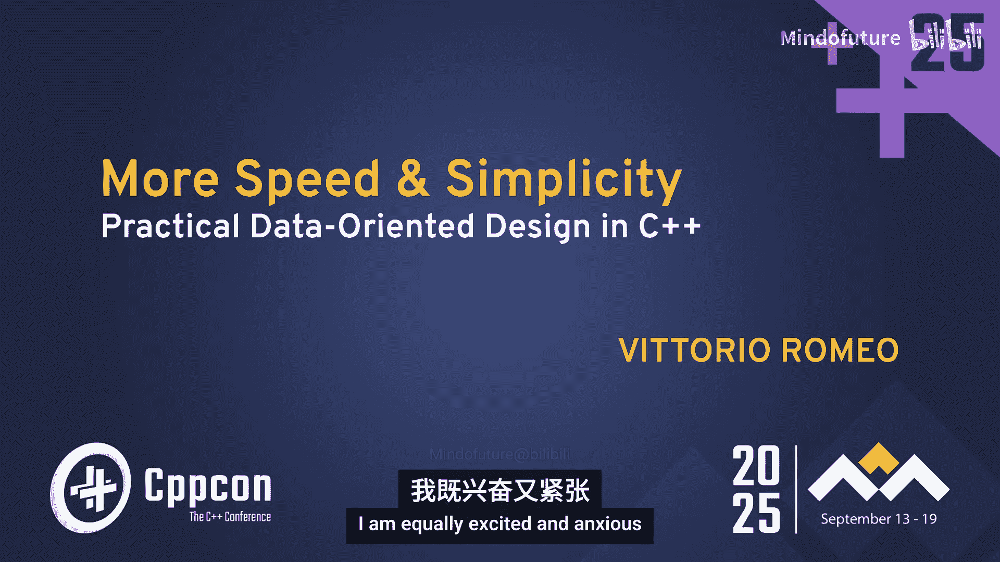
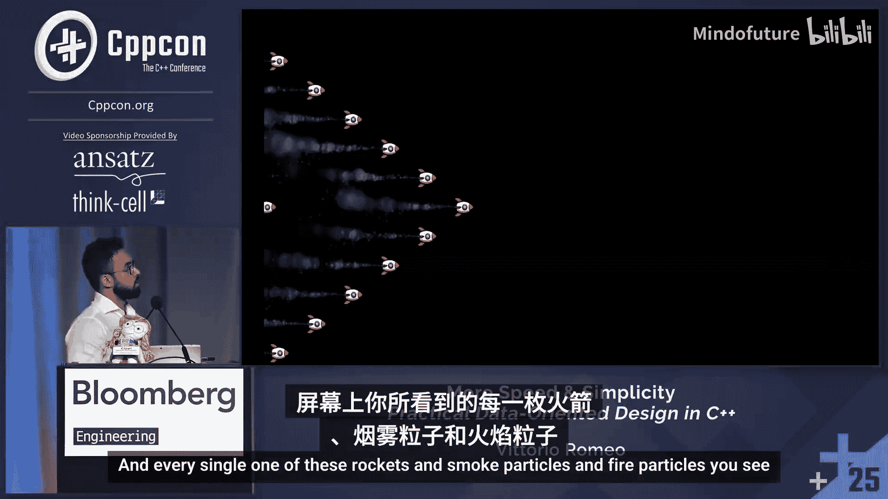

# 009：更高速度与更简实践

在本节课中，我们将要学习数据导向设计（Data-Oriented Design, DOD）的核心思想，并通过一个火箭粒子系统的实例，对比面向对象设计（OOP）与数据导向设计在性能、代码简洁性和可维护性上的差异。我们将从硬件缓存的工作原理出发，理解为何数据布局如此重要，并逐步重构代码，最终实现显著的性能提升。

## 1：引言与目标设定

我们将讨论数据导向设计，特别是其实践应用。我想从一张照片开始。这是我的朋友Mike Acton在2014年做主题演讲时的照片。那是我第一次参加技术会议。当时，Mike在Insomniac Games工作，他上台挑战了一些C++开发者的核心信念。这对我个人而言，是我数据导向设计旅程的起点。

我不知道你是否认出了这个人。那是我，很久以前的我。我现在看起来不一样了。我在这里向Mike提问。对我来说，那是一个改变职业生涯的时刻，因为我当时没有意识到，除了OOP之外，还有另一种完全不同的思考代码和软件的方式。即使现在，我不同意那次演讲中的某些结论，我仍然要感谢Mike为我打开了新世界的大门。我仍然推荐你去看看那次演讲，它非常精彩。

在开始之前，简单介绍一下我自己。目前，我是一名独立的C++顾问、培训师和导师。我的业务专注于提供C++培训和一对一指导。我提供技术培训和会议演讲。如果你有兴趣，欢迎会后联系我或访问我的网站。

我在Bloomberg工作了十年。主要从事高性能C++后端开发。我在微服务基础设施团队和自有市场分析团队工作过，也为Bloomberg工程师提供过现代C++、元编程和多线程等技术培训。

我参与了C++标准化工作。如果你听说过`function_ref`，我对此负有一部分责任。它将在C++26中引入。你可能也听说过我的`epos`提案，它现在部分体现在`profiles`中。

我对游戏开发、开源充满热情。我是SFML团队的成员，领导了该库现代化以支持C++17的工作。我强烈建议你了解一下。我们今天将在演示中使用它。我还为其他库（包括SL）做出过贡献，并在Steam上发布了两款商业游戏，它们也是开源的。此外，我喜欢虚拟现实，为《半条命2》和《雷神之锤》等游戏的模组做出过贡献。

最后，我是《Embracing Modern C++ Safely》一书的合著者。我与朋友兼同事John Lakos、Russel Lapenna和Ali Meredith共同撰写了这本书。它是一本关于所有现代C++特性的参考书，详细介绍了优缺点。如果你对此感兴趣，欢迎会后向我咨询。

但今天的主角不是我，让我们看看今天的目标。

今天的目标是，我希望你能发现一种新的思维方式。我不知道在座有多少人熟悉数据导向设计或实体组件系统。请举手示意。看来有不少人熟悉，也有不少人不太熟悉，这很好。所以，如果这对你来说是新的，你将学习到以数据优先的方式思考如何改变你设计系统的方式。

同时，我们将重温硬件的工作原理，特别是内存以及它如何与CPU通信，以及为什么这对软件设计很重要。

我们将以互动的方式进行。我们将一起构建这个小演示。我会先展示演示，然后逐步构建它。我们将看到，在不改变对数据执行的操作的情况下，仅改变数据的布局方式，就能对性能产生巨大影响。

同时，我不想只关注DOD的性能方面，我还想说明，它可以使你的代码比OOP更简单、更易于维护，这听起来可能有些反直觉。但我将展示一些我认为确实如此的例子。

此外，这可能是我与游戏开发界的其他人士看法略有不同的地方。我认为在某些地方，OOP仍然有意义。我们稍后会讨论这一点。我认为，明智地使用高级C++抽象实际上可以帮助你实现目标，并且在某些情况下，可以帮助你获得更好的性能和更高的代码可维护性。

## 2：演示与需求分析

现在，我将直接进入演示。我将展示我们要实现的东西，并让你了解我们要做什么。

对于这次演讲，我选择了一个相当简单且视觉效果有趣的东西。我们将制作一个演示，其中有火箭飞来飞去。让我放大一下。屏幕上的每一个火箭、烟雾粒子和火焰粒子都是一个独立的实体，被模拟。每个实体都有自己的物理量，你可以通过某种标识来引用屏幕上看到的每一个特定事物。

为了使需求更明确，我们希望一切都遵循物理定律。因此，我们有一个包含位置、速度和加速度的基本运动模型。

我们应该能够定制这些效果、粒子和发射器，使其具有随时间变化的不同不透明度、缩放和旋转。

一切都是一个“演员”。所以，如果我关心某个特定的火箭或粒子，我应该能够获得它的句柄并对其进行操作。例如，每个火箭实体都有一些附加的发射器，这些发射器保持同步并生成粒子。

最后，我希望以可扩展的方式设计这个系统。应该很容易添加新效果、新演员、新粒子类型等。所以，这有点像是一个玩具程序，但我通过要求能够将实体附加到其他实体上来使其更真实。我觉得它很好地隔离了性能原则。你从这个玩具程序中学到的经验教训也适用于现实世界的代码。

现在，如果我打开这个菜单，你会看到一些关于更新和绘制性能的指标。如果我开始生成一些新的火箭，由于某种原因，渲染不同步了。你会看到，随着火箭的生成，帧率会急剧下降，变得不再可玩。我也可以缩小，显示我们有很多火箭。在这里，你可以选择我们将要使用的数据布局。这是OOP实现。但如果我们切换到像AOS这样的布局，你会看到帧率显著提高，变得非常流畅。你可以尝试其他内存布局等。但重点是，我们有了这个演示，可以操作它，我们执行的操作是相同的。改变的只是我们使用的内存布局，正如你所见，这带来了巨大的差异。现在，我们将看看这是如何实现的。

## 3：面向对象设计实现

那么，让我们开始工作，实现这个系统。

我们将从根据OOP原则开始设计。我们有一个对问题的现实世界模型解释，并尝试将其转化为代码。

我们知道将会有多个实体，所以可以从一个实体基类开始。我们将有一个发射器类来生成粒子，一个火箭类飞来飞去并有关联的发射器，以及一个粒子类。

发射器可以是烟雾发射器或火焰发射器。同样，粒子可以是烟雾粒子或火焰粒子。浅蓝色表示基类，深蓝色表示具体类。我喜欢这个设计，它简洁明了。如果我想添加新东西，只需从实体派生。如果想添加新类型的发射器或粒子，只需从这些类派生。它满足了所有需求，似乎很容易扩展。所以，我看不出有什么特别的问题。让我们尝试实现它，看看代码实际上是什么样子的。

我们将在这里有一个`struct entity`。为了保持幻灯片简洁，我将使用`struct`。但在现实中，你会使用`class`以及`private`和`public`等。此时，我只想关注性能和内存布局方面。

因为这将是一个多态基类，我们将有一个虚析构函数。这里我们可以使用默认实现。然后，我们将有一个虚`update`成员函数，它接受增量时间（即帧之间经过的时间量），并使用它来推进实体的状态。我们还将有一个虚`draw`成员函数，它接受一个来自SFML库的`render target`。这只是一个抽象，允许你在纹理或窗口上绘制东西。在我们的例子中，它将是应用程序的窗口，所以在这里不太重要。

因为一切都需要遵循物理定律，我们将有一堆`Vector2f`，它们只是用于位置、速度、加速度的二维浮点向量。如果你想看看它实际上是什么样子，这只是两个浮点数X和Y，带有一些很好的运算符重载，允许你进行乘法、加法等操作。同样，这来自SFML，它是一个对二维向量非常方便和简洁的抽象。

差不多就是这样。如果我们想实现实体的`update`部分，我们可以通过速度乘以增量时间来移动位置，并通过加速度乘以增量时间来移动速度。这是非常简单的物理积分，不是最准确的，但我们主要关注内存布局，而不是模拟的准确性。

但我们有一个问题，实体可能需要知道其他实体的状态，可能需要按需创建其他实体。所以我们需要某种方式来实现这一点。

我想到的一个方法，并且在许多其他地方见过，是这样的：实体知道它所属的世界。通过那个世界引用，它可以查询任何其他实体的状态，或者可以创建新实体，可以与世界的状态交互。所以我们将为我们的程序做类似的事情。我们还将有一个名为`alive`的小布尔值，它将负责告诉世界：“嘿，这个实体完成了，请处理掉它，回收内存并将其用于其他事情。”它将被用来与已经可以清理实体的世界进行通信。我们使用布尔值的原因是，我们希望能够通过`update`成员函数来传达这一点。`update`中可能有一些条件使实体有资格被清理。

这就是实体。为了向你展示更多代码，我们有粒子。它将有自己的缩放、不透明度和旋转。它们可以随时间变化，所以我们也有变化率作为数据成员。

我们可以重写`update`成员函数，使用我们在实体中编写的代码，遵循DRY原则（不要重复自己）。然后对缩放、不透明度和旋转进行类似的物理积分。

这里有趣的是，我们只在透明度大于0时才将布尔值`alive`设置为`true`，这基本上意味着我们清理粒子的条件是当它们淡出时，因为在我们演示中，每个粒子最终都会淡出。这对于在完成后清理它们来说已经足够了。

为了展示烟雾粒子的样子，它只是从粒子派生而来。我们基本上免费获得了一切，这很好。我们唯一需要改变的是，我们想重写`draw`成员函数，并指定我们想使用该数据来绘制带有烟雾纹理的东西。你可以想象，这也可以用于火焰粒子以及未来你想添加的任何其他粒子。

世界可能是最有趣的部分。屏幕上已经有三种实体。我们希望以一种方便我们使用的方式存储它们。

我们将这样做：我们将有一个`std::vector<std::unique_ptr<Entity>>`，包含所有实体。

在座那些对数据导向设计有些熟悉的人可能已经在想：“嘿，没人会这样写代码。每个实体都会有一个堆分配，这不会很缓存友好。”但相信我，我在生产环境中见过很多次这样的代码。如果你在GitHub上搜索，有时甚至使用`shared_ptr`而不是`unique_ptr`，你会找到成百上千的例子。你可以读到关于这在AAA工作室发生的故事。人们已经成功地用这种设计发布了非常成功的好软件。我并不是说你不能这样做，也不能成功。但如果你知道这种设计的缺点，你也应该知道这实际上在实践中已经做过。我想知道在座有多少人写过或见过这样的代码。

好的，看来几乎所有人都有过。你知道，这不是玩具代码。这实际上会发生。我还想说，非常流行的库和引擎也做类似的事情，包括SFML库。所以这是一种到处都在使用的东西。

`update`和`draw`成员函数非常简单直接。我们只是遍历所有实体，并调用`update`和`draw`。你可能会看到这样做的好处：我们不关心`update`做什么，也不关心`draw`做什么，我们只是委托给实体。这很好。最后，我们会在最后做一些清理工作。我们调用`std::erase_if`，这是C++标准中一个相当新的函数。它接受一个容器和一个谓词，并有效地重新排列容器中的项目，以便可以在常数时间内移除它们。

发射器，我们将做类似的事情。我们将有一个计时器来跟踪我们想要生成粒子的频率。我们希望有不同的生成速率。然后我们想做些有趣的事情：我们将定义一个名为`spawn_particle`的纯虚函数，它将被实际的发射器类型重写。

发射器基类的`update`函数将定期调用`spawn_particle`，但实际派生发射器将重写该函数并决定生成粒子的具体含义。烟雾发射器将在内部使用`make_unique`分配一个新的烟雾粒子，然后将其推入世界。你还可以在这里看到，我们如何从实体的`update`内部引用世界，以影响状态并动态创建新事物。

最后我想展示的是，我提到火箭需要有一些关联的发射器。所以我们将在这里使用原始指针。我们会说：“好吧，我是火箭，我需要知道什么烟雾发射器与我关联，什么火焰发射器与我关联。”由于我们隐含地知道世界是实体的所有者，并且只要火箭还活着，那些发射器就会活着，使用原始指针在这里是可以的。我们考虑过生命周期，所以这在我们的模型中有效。

这也是你经常看到的，即使是在大型程序中。在同一程序的不同组件之间引用时，通常使用指针。你依赖于这些对象的地址稳定性。在这种情况下，你可以这样做是因为我们在堆上分配它们。所以，即使包含所有实体的向量被重新分配，即使我们在世界中移动，发射器的地址也将是稳定的。

当我们创建火箭时，我们创建发射器并将它们连接起来。当我们更新火箭时，我们将与火箭一起移动它们。这非常简单。这基本上就是我们演示所需的所有代码。

## 4：性能基准测试与硬件原理

那么，让我们看看这有多快。我们来做个简单的基准测试。

我使用的机器不是我现在演示用的平板电脑。这是我的台式机，配置相当不错。它有一个几年前顶级的Intel Core i9处理器，速度很快。有DDR5内存。我使用Clang++编译，启用了`-O3`优化。为了这些指标，我禁用了渲染。但我也将讨论渲染，因为改变数据布局不仅对更新有益，对渲染也有益。

在20万个实体时，我们得到2.3毫秒；40万个实体，6.6毫秒；60万个实体，12毫秒；80万个实体，16.6毫秒；100万个实体，21.6毫秒。

现在，你可能会想，这只是毫秒，这很快，谁在乎呢？但如果你考虑针对实时应用，要达到60 FPS（这是良好交互体验的最低要求），单帧的预算大约是16.67毫秒。你可以看到，在60万个实体时，我们已经用掉了大部分预算。如果你想想还要加上渲染，加上更复杂的逻辑算法，你就没有太多操作空间了。

同时，请记住，这是相当好的硬件。在移动设备上，这可能完全无法接受。同时，我觉得在2025年，60 FPS已经相当低了。即使是现在的手机，也有120 Hz刷新率的显示屏。所以，我认为要获得非常流畅的交互体验，最低应该是120-144 FPS。如果你想达到那个帧率，单帧的预算将少于7毫秒。所以我们在这里非常有限，几乎没有预算剩余，只有40万个粒子。我们谈论的是C++，是快速的硬件。我们应该能做得比这更好。

我们在演示中看到，改变事物的内存布局可以显著加快速度。所以问题不在于算法，不在于我们执行的操作，而在于数据在内存中的布局方式。

CPU在这里实际上大部分时间处于空闲状态，它没有做任何工作，只是在等待数据到达并浪费时间等待，如果我们关心性能，这同样是不可接受的。

所以让我们绕个弯，我将给你稍微复习一下内存，告诉你为什么理解它的内部工作原理对于设计高效软件、充分利用CPU很重要。

在非常高的抽象层次上，你可以把CPU和RAM想象成通过某种总线连接，它们进行通信，一切都很顺利。

如果我们剥开一层洋葱，再降低一个层次，同样在较高的抽象层次上，你可以把CPU想象成这样：我们有一个核心，实际操作在那里进行。有一些缓存，这是一些非常小但非常快的临时内存。然后通信必须经过一个层次结构。RAM中的数据首先必须经过缓存，然后从缓存到核心，反之亦然。所以你需要的每一个操作都必须遵循这条通过内存的路径。实际上，我们稍后会看到，我们有多个缓存层，多个核心，所以比这更复杂，但主要原则仍然适用。内存必须遵循这个层次结构并向前移动。

缓存，你可以把它想象成这是一个非常小但快速的行的集合。这些行被称为缓存行。这是一个非常重要的概念。缓存行是最小的可传输内存单元。所以即使你只关心一个字节，你仍然必须将整个缓存行从RAM传输到CPU，即使你只获取那个字节。

同时，你可以想象RAM是一个巨大的缓存行集合，非常大，但速度慢。例如，如果你想读取地址18处的数据。它不在缓存中，或者缓存是空的，所以我们可以在RAM中识别数据在那里。即使我们只关心地址18处的数据，我们仍然必须从RAM中取出整个缓存行，这是一个缓存未命中，这意味着我们取走整行并将其复制到缓存中。如果你想象我们不关心这个数据相邻的内容，不关心D旁边是什么，那么我们浪费了很多时间移动我们不关心的数据，这很不幸，并且我们低效地使用了缓存。

我们可以继续这样做。也许你想读取地址26处的一些数据。它不在缓存中。同样，我们在RAM中识别它在那里，我们必须取走整个缓存行并将其移入缓存，这又是一个缓存未命中，非常不幸。

在最好的情况下，例如，如果你想读取地址19处的数据。我们识别出它已经在缓存中，你可以在这里看到它。那么在这种情况下，我们谈论的是缓存命中。我们不需要往返于RAM，因此我们将能够更有效地读取这些数据。

现在我为什么要告诉你这些？影响是什么？如果我们必须去RAM，或者我们可以留在缓存中，这有多大关系？

我喜欢直观地解释事情。所以我做了一个小动画，展示了L1缓存（CPU中最快但最小的缓存）和核心之间的竞赛。在底部，我们有RAM和CPU。在顶部，我们将看到数据已经在缓存中的最佳情况。在底部，我们将看到每次需要数据时都必须返回RAM的最坏情况。

现在，这张幻灯片将显著放慢速度，因为我们谈论的是纳秒级的操作，但它是按比例缩放的。请记住这一点。3，2，1，开始。

当缓存中的数据完成多次往返时，你可以看到RAM仍然，你知道，几乎才到一半。我们已经做了很多操作。

所以这实际上，正如我提到的，是按比例缩放的。这实际上就是你的程序中正在发生的事情。所以，如果你的所有数据都来自RAM，你只是在获取数据上浪费了大量时间。

在最坏的情况下，它可能慢100倍。因此，与L1缓存相比，往返RAM可能比L1缓存慢100倍。给你一些数字，人类平均眨眼的时间是100毫秒。一次L1缓存引用所需的时间是0.5纳秒。在你眨眼的时间里，你可以进行2亿次L1缓存引用。而RAM将比这慢100倍。所以影响相当大。大到有时数据所在位置的选择比你使用的算法或数据结构重要得多，这可能相当令人惊讶，特别是如果你深入理论计算机科学，有时复杂度更差的算法在实际硬件上可能表现更好。

## 5：数据导向设计思维转变

那么，我们学到了什么？非常重要的一点是，最小的通用可传输内存单元是缓存行。所以无论你想要多少字节，你都必须获取整个缓存行。在现代桌面CPU上，这通常是64字节。幸运的是，在C++中，我们有一个非常直观的方式来查询缓存行大小，即`std::hardware_destructive_interference_size`。所以，你可以记住这个。但你可以认为是64字节。

所有数据都必须始终遍历内存层次结构。所以，如果你需要RAM中的某些东西，它必须经过所有缓存层，然后返回，如果需要刷新回RAM。这意味着数据的空间局部性（即数据在内存中的实际布局方式）极大地影响性能。正如我提到的，有时甚至比算法或数据结构的选择更重要。

因此，我们可以真正开始思考一些技巧。

如果我有关联的数据，并且我想在相对接近的时间内访问它们（例如，访问第一个之后，我想访问第二个、第三个等等），那么最好将它们一起存储在内存中，物理上彼此靠近。因此，优先选择平坦且连续的存储可以更好地利用缓存，并最大化你在获取这些缓存行时，你想要的数据已经在那里的机会。

同时，还有一些我没有提到的东西，即预取。CPU有这种推测机制，基本上可以找出你访问内存的模式，例如，如果你在一个循环中向前或向后移动，或者每隔n个元素跳转，或者进行跨步访问，CPU可以识别出来，并且在你请求之前就开始给你提供未来可能需要的缓存行。因此，进行非常可预测的操作也可以极大地提高程序的性能。

正如我之前提到的，我骗了你，实际情况更复杂。所以，如果你想更现实一点，在更多核心的CPU上，情况看起来更像这样：你可能有一个在多个核心之间共享的L3缓存，它更大，但更慢。每个核心可能有一个L2缓存，比L1大一点，但慢一点。然后你可能有一个用于数据的L1缓存和一个用于指令的L1缓存。现在，我觉得这很有趣，因为，你知道，代码也是数据。当你将程序编译成二进制文件时，生成的代码必须加载到内存中。所以有时，如果你为大小而不是速度优化代码，它实际上可能更快。原因是它可能更好地使用指令缓存，你的热点循环可能更多地放入代码缓存本身。所以我们不会在这次演讲中讨论这个，但如果你深入研究这个主题，有时代码的对齐方式对你的性能也很重要。

关于硬件、CPU、内存等，我就讲这么多。我想向你推荐Scott Meyers在2014年的一次精彩演讲，但今天仍然非常相关：《CPU Caches and Why You Care》，它深入探讨了细节。此外，Jonatan Müller在CppCon上做了一次名为《Cache Friendly C++》的演讲，也涵盖了相同的主题并相当深入。所以我认为，如果你看了这两个演讲，你会对现代硬件有一个很好的理解和认识，并且能够对什么可能快或慢有一个很好的直觉。我强烈推荐观看这两个演讲。

休息一下。哦。那么，考虑到这些，为什么我们的实现很慢？我们实际上可以通过查看世界实现来很容易地弄清楚。

我们有这个`entity_vector`，它是一个`vector<unique_ptr<Entity>>`，这意味着每个实体都将在内存中的某个地方分配，很可能不靠近其他实体，会分散在各处。这意味着如果我们在`update`中迭代，在`draw`中迭代，在最坏的情况下，在`erase_if`中迭代，每次迭代都可能是一个缓存未命中。我们已经看到这有多慢，可能比L1引用慢100倍。所以这对CPU来说可能是最坏的情况。它将待在那里等待数据到达。

同时，我们还有其他开销来源。我们使用虚函数分派，使用虚函数表和运行时多态。所以每当你访问`update`或`draw`成员函数时，都会有一个虚函数表查找，这有一些开销，可能不如缓存未命中重要，但这是我们需要注意的另一件事。

最后，如果你还记得我们生成粒子的方式，我们实际上在这里调用了`make_unique`，而`erase_if`实际上会销毁那些`unique_ptr`。所以我们有频繁的动态分配和释放。所以你已经可以想到这不会很高效。我们做了很多额外的工作，很多内存等待，以及由于虚函数和分配带来的很多开销。

那么我的问题是，为什么我们这样写代码？为什么我们直接跳到了OOP层次结构和虚接口等等？

我认为这与面向对象的思维定势有关。

大多数人的编程入门实际上是OOP。大学教材，无论你学什么关于类的知识，你都会学到继承，学到通常的形状基类，可以是圆形、矩形，或者动物基类等等。而且，这也是一个自然的选择。对人类来说，它与我们对世界的看法非常吻合。我们以个体对象、个体事物的方式思考。我们头脑中有这种“是一个”的关系。它很有效。

所以这种思维定势大致是这样运作的，我认为有四点很重要。

我们试图模拟一个自主对象的世界。我们思考具有自己身份和责任的独立代理。我们有一个粒子。粒子有自己的数据。它知道如何更新自己，知道如何绘制自己。

这些实体通过消息与程序的其他部分相互通信。主循环，世界不知道粒子实际上在做什么，它只是请求：“请更新你自己”，“请绘制你自己”。我们不关心内部细节，我们只是要求执行这些操作。

数据是隐藏的，所以我们不关心。我们不暴露这些类的内部细节，我们隐藏它们，封装它们，但我们暴露行为。我们不关心粒子如何被更新。这有时可能很好，因为它允许我们改变内部表示而不改变行为。但我们失去了关于粒子数据布局的一些非常重要的信息。

而且，我觉得OOP倾向于鼓励人们为未知做计划。所以你会尝试找出某种抽象或接口，它不仅适用于今天的问题，也适用于未来可能遇到的任何问题。我在这里非常小心地选择了“赌”这个词，因为在我看来，这确实是一种赌博。预测未来会有什么样的需求真的很难。如果你的预测错了，摆脱错误的抽象有时比一开始就没有做更昂贵。所以如果你幸运，你可能会节省一些时间，但更多时候，预测未来可能需要什么是非常困难的。

与此相反，如果我们把这个放在一边，让我们看看数据导向思维如何看待相同的问题。

我们不想模拟一个自主对象的世界。我们想模拟一个数据转换的世界。我们将代码视为将数据从一种状态转换到另一种状态的管道。我们并不真正关心对象、身份、封装的概念，它只是数据。

我们没有消息，我们直接对数据批次进行操作。所以实体本身不再处于控制之中。个体不再重要。我们从父对象对数据进行批量操作。世界将负责所有实体的更新和绘制。它处于控制之中。我在这里说“批量”，因为对于这类应用程序，最常见的情况不是添加单个粒子或单个实体，拥有许多实体才是常见情况。那么，为什么我们要以个体为核心进行设计，而实际的常见情况是批量处理呢？

同时，我们不想隐藏数据。数据是最重要的东西。我们希望使其透明。我们希望为了高效处理而布局它，并且我们希望行为集中在更高的层次上，该层次可以看到所有数据，并能够找出处理我所拥有数据的最佳方式。

这也是我觉得更主观的一点，但我感觉这种思维定势倾向于鼓励开发者为今天做计划。你想为手头的问题设计。你想优先考虑性能和简洁性来解决那个问题，你不想解决你没有或未来可能有的任何问题。有时这实际上可能会带来回报。有时，如果你一开始没有错误的抽象，改变代码以适应新问题可能会更容易。

## 6：首次优化：扁平化数据

那么，我们如何转变思维定势？我认为你必须内化这一点：无论怎样，代码的唯一目的是转换数据。重点不应该是模拟我们头脑中合理的抽象对象世界，而应该关注数据的旅程。所以我们想从A点到达B点。我们如何高效且以最简单的方式做到这一点？数据是核心，它不是我们想要隐藏的东西。为什么要隐藏程序中实际使其高效工作的最重要部分？我们实际上希望使其可见，理解其形状、大小和访问模式。而这些将驱动应用程序的设计，以及我们对数据执行的操作。

现代计算机，即使是你拥有的最好的超级计算机，都擅长简单且可预测的工作。所以，只要你设计你的问题，为计算机提供长而连续的连续数据流，你很可能会获得良好的性能。

最后，这更像是一个哲学问题。你想为你拥有的机器设计。你想熟悉你目标平台的硬件能力，因为有效的解决方案与你头脑中试图解决的问题的隐喻以及硬件的物理现实相一致。所以，如果你想从OOP转向数据导向设计，这就是你需要转变的思维定势。

那么，我们如何开始优化我们的代码，朝着这种思维定势迈进，也许不是完全，但朝着这个想法迈进？

对于我们的第一个优化路径，我们将做几件事。首先，我们将摆脱单独的堆分配，我认为这是我们程序的主要瓶颈。我们将摆脱继承，这将扁平化我们的层次结构。并且我们将解耦数据与逻辑。实体类现在将只是数据，逻辑将上移一层。世界将是处理所有行为的地方，这样我们可以看到完整的图景，并批量操作数据。

同时，我们有一个问题，之前我们有一个很好的实体向量，可以同质地存储东西。但现在我们要做的是，我们将为要存储的每种实体类型设置多个容器。这可能看起来更繁琐，但当我们想以不同方式处理这些东西时，你会看到这实际上是有意义的。它们具有不同的属性和行为。

所以我们将有我们的发射器`struct`，粒子`struct`和火箭`struct`。

它们都将有自己的物理量。所以我们有一点重复，但这是最小的，谁在乎呢。发射器将有自己的浮点计时器和生成速率。粒子将具有与以前相同的量。但现在我们有一个问题，之前我们可以区分火焰和烟雾粒子，因为我们有一个很好的层次结构。那么我们现在该怎么办？

目前，我将采用简单的方法。我会这样做：我们将有一个名为`ParticleType`的枚举类。它要么是烟雾，要么是火焰。我将在发射器和粒子中都存储这个信息。根据这个信息，我们将做不同的事情。这不理想。我们稍后会看到如何改变这一点。但到目前为止，这没问题。

我们遇到的另一个问题是，在火箭中，我们需要引用两个发射器。我们希望它们链接在一起。之前我们有一个很好的特性，可以使用发射器的地址，它是稳定的，我们可以用它来在这些东西之间通信。但现在，如果我们移除堆分配，就不能保证发射器的地址是稳定的。向量可能会重新分配，我们可能会在内存中移动东西。那么我们该怎么办？通常有很多解决方案。但解决这个问题的常见方法是使用索引。所以你将不再依赖实际对象内存的地址稳定性，而是依赖对象在其所属向量中位置的索引稳定性。你可能需要稍微改变一下向量。我们将看到这是处理这个问题的常见方式。其他方法可能是使用某种哈希表来存储键，然后查找对象；或者使用专门设计的数据结构来帮助你实现这一点。但一般来说，我想在这里说明的是，现在关系就是数据，只是一个数字。所以它不再是特定于硬件的东西，而只是一个索引。

那么，我们如何改变我们的世界以适应这个新设计？我们将有一个粒子向量，一个火箭向量，以及一个关联的`add_rocket`函数，该函数最终会完成与发射器的任何必要连接。

然后我们将这样做，我认为这很有趣：我们将有一个`std::vector<std::optional<Emitter>>`。我在这里使用`optional`的原因是为了保证索引的稳定性。所以你可以把它想象成是发射器可能在其中也可能不在其中的槽位。通过查看索引，我们可以保证索引4处的发射器始终是同一个发射器。如果你想移除一个发射器并销毁它，我们只需使该槽位为空。但我们不必在内存中移动任何东西，因此索引稳定性得以保留。同样，还有其他方法可以处理这个问题。但这是一个适用于我们用例的非常简单的解决方案。

为了配合这个设计，我们还将有一个`add_emitter`函数，给定一个发射器，会将其放入第一个可用的空闲槽位，然后返回该槽位的索引。所有这些结合起来，它们共同工作，将基于地址稳定性的关系替换为数据驱动的关系。我们只处理数字、索引，并且我们获得了与以前相同的关系行为。

我们将有通常的更新、绘制、清理。所以我们将看看它们如何变化。

`update`函数在我看来会很有趣，因为现在我们可以批量处理所有粒子。我们不是告诉每个粒子“请更新你自己”。我们拥有粒子的完整视图，我们只是遍历它们并执行操作。你已经可以开始看到编译器在这里有更多信息来优化、向量化和用汇编代码做很酷的事情。

对于发射器，我们将遍历所有`optional`。我们将跳过那些里面什么都没有的槽位。我们将进行更新，然后创建新粒子。现在，这里我们将根据发射器的类型进行分支。根据它是烟雾还是火焰，我们将向向量中推入不同的东西。同样，我们稍后会对此进行改进。但到目前为止，这没问题。

最后，对于我们的火箭，我们移动它们。这没问题。有趣的是这一点：当我们想获取关联的发射器时，我们只需使用存储在火箭中的索引来查找发射器向量。我们检查那个`optional`是否有效。我认为它应该总是有效的，所以也许这应该是一个断言。但你知道，我在这里用了`if`。然后我们将发射器的位置设置为与火箭相同的位置，并加上一些偏移量，使其看起来更好一点，这样粒子实际上是从火箭尾部生成的。

我们对火焰发射器也做同样的事情。我想展示的最后一部分是`add_emitter`，它是负责创建新发射器的函数。我们做的是遍历所有槽位。如果我们找到一个可能曾经用于发射器但现在为空的空槽，我们可以直接在那里放置我们的发射器并返回该索引。所以我们重用了一个现有的槽位。如果向量完全满了，那么我们就`emplace_back`。我们有一个新的可用槽位。这可能会在底层导致内存重新分配，但我们不在乎，因为我们不依赖于此。我们依赖的是索引。现在，这个算法是线性的，但你可以想象，如果你想优化它，你可以有一个空闲索引列表，在创建和移除发射器时跟踪它。所以当你想要创建一个时，只需弹出一个索引并使用它，当你完成时再将其推回。所以你可以很容易地使其成为常数时间。我只是想保持简单，因为在这个程序中，与粒子相比，发射器的数量非常少，我们在这里使用O(n)算法并不重要。

最后一部分是清理。我们将对粒子使用`erase_if`，做同样的事情，如果它们淡出就移除它们。我们将对火箭使用`erase_if`，如果它们到达屏幕右侧就移除火箭。同时，在谓词内部，我们将利用这个机会也销毁关联的发射器。所以如果我们知道到达了屏幕末端，我们还将重置发射器向量中的那些`optional`，以便这些槽位可以被重用。然后我们将向算法返回`true`。是的，随意处理这些东西。

那么，这如何改变我们的性能？让我们再做一轮基准测试，同样的硬件，同样的程序，同样的条件。对于20万个实体，我们有非常显著的改进，对于40万个实体甚至更多。正如你所见，这种趋势持续下去。平均而言，仅通过改变我们存储数据的方式，更新时间就减少了70%。我们没有改变任何操作，我们对数据执行完全相同的计算，只是改变了我们存储和处理数据的方式。

我在这里没有展示，但渲染性能也提高了8倍，因为现在数据是按组分组的，我可以轻松地将所有粒子作为一批发送到GPU，轻松地将所有火箭一次发送出去。所以随着时间的推移，如果你这样做，特别是在图形开发中，你会发现数据导向布局实际上对GPU非常友好。所以你做得越多，你就越能有效地将数据发送到GPU，这是一个附带的好处。

## 7：数据导向设计的简洁性优势

好的，我不知道这对任何人来说是否令人惊讶。但你知道，你可能预料到了这一点。但在演讲开始时，我也提到，我不想只关注性能，还想关注简洁性。那么让我们看看这是否真的有效。让我们看看它是否真的使事情更简单。

现在，我想向你展示的第一件事是，假设我们有一个新需求。例如，我们想跟踪火箭的数量。这实际上是我为演示尝试做的事情。我想有一个实体总数的计数器，但我也想知道其中有多少是火箭。我尝试了，但我做不到，因为在OOP方法中，高效地做到这一点出人意料地困难。

我在OOP方法中尝试的第一件事是这样的：我将遍历所有实体。我将使用`dynamic_cast`。如果它是火箭，我将增加火箭数量。现在，我不喜欢`dynamic_cast`，我和其他人一样讨厌它。但这似乎是一个很好的用例。这是一个统计指标，我只是想把它作为一个附带的东西，这是一个边缘情况，我只想知道我有多少火箭。这确实有效，但它实际上出现在我的性能分析器中，我因为`dynamic_cast`而损失了毫秒级的时间。所以这是不可接受的，我本会使这个OOP解决方案变得更慢，只是为了计算火箭的数量，这让我很惊讶。我以为它会有一些开销，但不会非常显著。

然后我意识到，好吧，也许我可以做这样的事情。我可以让我的实体有一个`get_type`虚成员函数，返回一个实体类型。然后我将避免从`dynamic_cast`获得的开销。但这就是目的，对吧？我不想让实体通过枚举告诉我它是什么类型的实体。OOP的重点是，我想以抽象的方式思考实体，我不希望实体告诉我它是什么类型。否则，我为什么要首先使用OOP呢？这样做似乎不对。

也许我想，火箭本身在构造时可以通知世界：“嘿，城里来了一个新火箭。”然后在析构时，你可以告诉世界它要离开了。但这感觉也不对。你在类的内部隐藏了更多关于到达和离开的状态变化，所以更难看到代码的流程。而且，我觉得这违反了单一职责原则。为什么火箭要负责指标？这似乎不对。

那么世界也许可以这样做。也许我可以有一个`add_rocket`函数，我只能通过函数调用创建火箭，并跟踪火箭数量。在清理时，我会做一些簿记来递减计数。但现在我为火箭添加了一个专门的函数。同样，我想以实体的方式思考。我想给世界一个实体，而不是火箭，这违背了目的，对吧？所以我不喜欢这个。而且由于簿记，还有更多的复杂性。我不是说这不可能，你可以让它工作，只是对于我想做的事情来说过于困难了。所以我最终放弃了。你在演示中看到，我只有实体数量，你知道，这是我所能做的最好的。

那么数据导向方法呢？就这样。我知道我有多少火箭，因为我将火箭分开存储。所以我只需调用向量大小的函数，就可以免费获得它们。所以我觉得很多事情都是这样。这只是一个例子，对吧？你可能会觉得这是人为的。但随着时间的推移，随着我转向数据导向设计，我不是说我每次都会完全采用数据导向，但我感觉我越来越频繁地获得这些小胜利。所以它确实使事情变得简单。

另一个我想给你的例子是，想象你是一个团队的新成员，必须在这个演示上工作。你必须扩展代码，理解它。所以你会去代码库，开始做一些代码审查，尝试理解所有移动部件如何交互，如何工作，以及你需要做什么来改变它。

所以你在这里看到实体，你会想：“好吧，这看起来简单。”然后你看到：“哦，但我们有一个对世界的引用，还有这个额外的`alive`布尔状态。”然后你开始想，现在，每个实体最终都可能做一些改变其他实体状态的事情，要知道这一点，我必须交叉引用代码库中的所有文件，看看发生了什么。你必须在源代码中跳来跳去才能获得完整的图景。同时，这对我来说真的不对，这真的很烦人，因为我们把`draw`成员函数放在了虚函数层次结构、继承API中，与渲染系统紧密耦合。所以如果我们想从SFML切换到SDL或其他库，我们不会这样做，因为我们必须更改20个类，它们紧密耦合在一起，这很不幸。同时，你知道，如果你看世界，你记得，是的，表面上看起来简单，但实际上它隐藏了一切。这个`update`可能最终会销毁实体，可能最终会创建新实体。那么我怎么知道发生了什么？我必须查看每个实体。所以我认为，在实践中，这使得很难理解系统的全貌，你需要在头脑中记住所有可能存在的副作用，以及它们在任何时间点可以做什么。

是的，如果你还记得，这最终会影响外部世界。所以，我想你明白我的意思了。

对于数据导向设计，我发现很好的一点是，实体本身只是数据。逻辑和数据之间有明确的分离，那里没有任何隐藏的东西。它是完全解耦的。你看到的就是你得到的。就像任何成员或任何东西的构造函数中都没有特殊的副作用，它只是普通的数据，这很简单。

同时，如果我看看世界，我可以立即看到世界中有哪些东西。我知道我将有发射器、粒子和火箭，没有其他东西。在运行时，不能从某个地方添加其他东西，不能从某个派生类添加其他东西。你可以很容易地看到所有类型。

所以数据没有被隐藏。同时，在单个`update`函数中，我确切地知道每一个变化，每一个正在发生的操作。我可以看到这种基于阶段