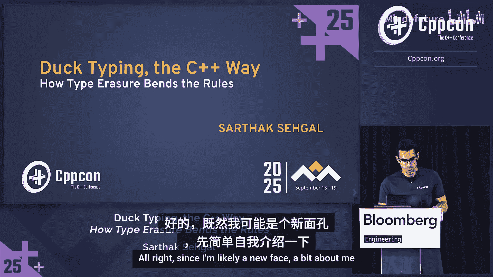
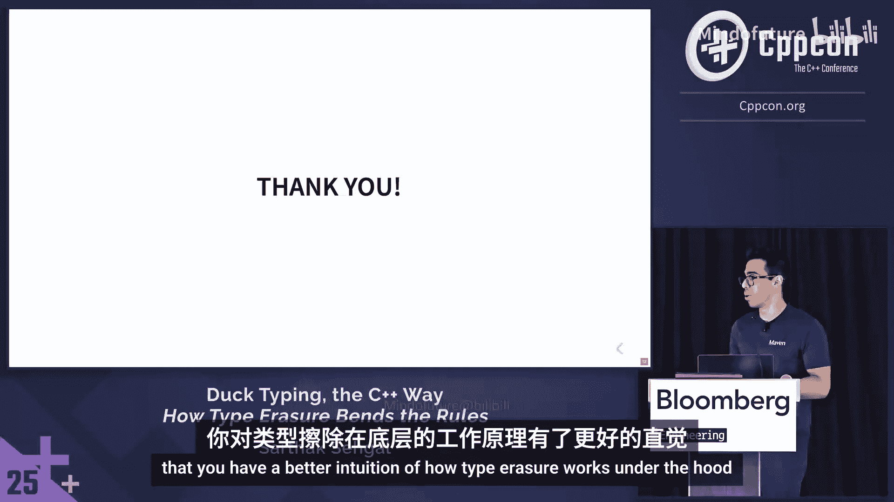

# 010：C++方式的鸭子类型与类型擦除如何改变规则




在本教程中，我们将学习C++中的类型擦除技术。这是一种强大的编程范式，允许我们将具有相同接口但类型完全无关的对象，存储到一个统一的类型中，从而实现运行时多态，而无需依赖继承。我们将从基础概念开始，逐步深入到`std::function`和`std::any`的内部实现，并探讨其性能开销与优化方法。

---

## 概述：什么是类型擦除？

类型擦除是一种技术，它通过一个统一的接口来隐藏对象的具体类型。这使得我们可以将行为相似但类型无关的对象（例如，不同的可调用对象）视为同一类型进行处理。这与“鸭子类型”的概念相似：如果一个对象能像鸭子一样“叫”和“走”，那么我们就可以把它当作鸭子来用，而无需关心它是否继承自某个“鸭子”基类。

在C++标准库中，`std::function`和`std::any`是类型擦除的典型代表。理解它们的工作原理，有助于我们设计更灵活、解耦的代码。

---

## 一个具体问题：灵活的回调函数

假设我们正在构建一个交易系统。系统有一个`MarketDataSubscriber`类，它需要接收一个回调函数来过滤交易品种。这个回调函数的签名是固定的：`bool (const InstrumentDefinition&)`。我们希望客户端能够传入任何符合此签名的可调用对象，例如自由函数、lambda表达式或函数对象。

我们的目标是让`MarketDataSubscriber`成为一个**具体的、非模板化的类**，同时又能灵活地接受任何可调用对象。

### 方案一：函数指针

最简单的想法是使用函数指针。

```cpp
class MarketDataSubscriber {
    using FilterFunc = bool (*)(const InstrumentDefinition&);
    FilterFunc filter_;
public:
    MarketDataSubscriber(FilterFunc f) : filter_(f) {}
    void onInstrument(const InstrumentDefinition& inst) {
        if (filter_(inst)) {
            // 传递给交易逻辑
        }
    }
};
```

**优点**：
*   可以接受自由函数、无状态的lambda或静态成员函数。
*   C++26引入了`std::function_ref`，可以更好地处理有状态的lambda。

**缺点**：
*   可调用对象必须是**无状态**的（不能捕获变量）。
*   缺乏值语义，需要处理空指针检查。

### 方案二：继承与虚函数

另一种常见思路是使用继承实现运行时多态。

```cpp
class InstrumentFilterConcept {
public:
    virtual bool operator()(const InstrumentDefinition&) const = 0;
    virtual ~InstrumentFilterConcept() = default;
};

class EquityFilter : public InstrumentFilterConcept {
public:
    bool operator()(const InstrumentDefinition& inst) const override {
        return inst.type() == InstrumentType::Equity;
    }
};

class MarketDataSubscriber {
    std::unique_ptr<InstrumentFilterConcept> filter_;
public:
    MarketDataSubscriber(std::unique_ptr<InstrumentFilterConcept> f) : filter_(std::move(f)) {}
    // ... 使用 filter_->operator()(inst)
};
```

**优点**：
*   单一的具体类型，可以存储在不同的容器中。
*   实现了运行时多态。
*   可以在运行时重新赋值。

**缺点**：
*   所有可调用对象**必须继承**自同一个接口基类。
*   存在虚函数调用的运行时开销。
*   无法直接使用第三方库定义的函数（除非为其创建包装类）。
*   客户端需要管理对象的生命周期（使用指针）。

### 方案三：模板

我们可以将整个类模板化，以接受任何类型。

```cpp
template <typename Callable>
class MarketDataSubscriber {
    Callable filter_;
public:
    MarketDataSubscriber(Callable f) : filter_(std::move(f)) {}
    void onInstrument(const InstrumentDefinition& inst) {
        if (filter_(inst)) { /* ... */ }
    }
};
```

**优点**：
*   接受任何合适的可调用对象。
*   零运行时开销（编译期实例化）。

**缺点**：
*   为不同的`Callable`类型会生成**不同的类类型**。`MarketDataSubscriber<EquityFilter>`和`MarketDataSubscriber<BondFilter>`是两个完全不同的类型，难以放入同一个`std::vector`中存储和管理。

---

## 引入 `std::function`：类型擦除的解决方案

`std::function`完美地解决了上述问题。它是一个**具体的、非模板化的类型**，却能存储任何符合签名的可调用对象。

```cpp
class MarketDataSubscriber {
    std::function<bool(const InstrumentDefinition&)> filter_;
public:
    MarketDataSubscriber(std::function<bool(const InstrumentDefinition&)> f) : filter_(std::move(f)) {}
    // ... 使用 filter_(inst)
};

// 客户端可以传入各种类型
MarketDataSubscriber sub1(FreeFunction); // 自由函数
MarketDataSubscriber sub2([](const auto& inst){ return inst.isEquity(); }); // Lambda
MarketDataSubscriber sub3(EquityFilter{}); // 函数对象
```

关键点在于：`FreeFunction`、lambda表达式和`EquityFilter`是**完全无关的类型**，但它们都被赋值给了同一个具体类型——`std::function`。这正是类型擦除的核心：**隐藏对象的具体类型，仅通过一个统一的接口来操作它**。

---

## 类型擦除的实现原理：概念-模型模式

`std::function`是如何实现这一魔法的呢？其核心是**概念-模型**设计模式，它巧妙地结合了继承和模板。

### 第一步：解决第三方函数问题

回到继承方案，其问题之一是难以使用第三方函数。解决方案是为每个第三方函数创建一个包装类。

```cpp
// 第三方库函数
bool isMillionDollarStock(const InstrumentDefinition&);

// 包装类
struct IsMillionDollarFilter : public InstrumentFilterConcept {
    bool operator()(const InstrumentDefinition& inst) const override {
        return isMillionDollarStock(inst); // 委托调用
    }
};
```
这很繁琐，我们需要为每个第三方函数都写一个包装类。

### 第二步：通用包装器（模型）

我们发现，所有包装类模式相同：继承基类，存储一个可调用对象，调用时委托给它。我们可以用模板创建一个**通用模型**。

```cpp
template <typename FunType>
class InstrumentFilterModel : public InstrumentFilterConcept {
    FunType fun_; // 存储具体的可调用对象
public:
    InstrumentFilterModel(FunType f) : fun_(std::move(f)) {}
    bool operator()(const InstrumentDefinition& inst) const override {
        return fun_(inst); // 委托调用
    }
};
```
现在，无论是自定义函数对象还是第三方函数，都可以用`InstrumentFilterModel`包装起来。

### 第三步：构建类型擦除类

我们将基类（概念）和模型类作为内部类，构建一个最终的类型擦除包装器。

```cpp
class Function {
    // 概念：统一接口
    struct Concept {
        virtual ~Concept() = default;
        virtual bool invoke(const InstrumentDefinition&) const = 0;
        virtual std::unique_ptr<Concept> clone() const = 0; // 为拷贝支持
    };

    // 模型：持有具体类型
    template <typename FunType>
    struct Model final : public Concept {
        FunType fun_;
        Model(FunType f) : fun_(std::move(f)) {}
        bool invoke(const InstrumentDefinition& inst) const override {
            return fun_(inst);
        }
        std::unique_ptr<Concept> clone() const override {
            return std::make_unique<Model>(*this); // 拷贝内部对象
        }
    };

    std::unique_ptr<Concept> object_; // 多态指针，指向具体模型

public:
    // 关键：模板化构造函数，接受任何类型
    template <typename FunType>
    Function(FunType f) : object_(std::make_unique<Model<FunType>>(std::move(f))) {}

    // 拷贝构造（支持值语义）
    Function(const Function& other) : object_(other.object_->clone()) {}

    // 统一调用接口
    bool operator()(const InstrumentDefinition& inst) const {
        return object_->invoke(inst);
    }
};
```

**工作原理**：
1.  `Function`类有一个模板构造函数，在构造时它知道具体类型`FunType`。
2.  它用这个具体类型实例化一个`Model<FunType>`，并将其地址赋给基类指针`Concept*`。
3.  从此，`Function`对象内部只看到一个`Concept*`，具体类型`FunType`被“擦除”了。
4.  当通过`operator()`调用时，通过虚函数`invoke`分发到具体的`Model`中存储的`fun_`上。

这样，我们就实现了一个简易版的、支持值语义的`std::function`。它可以存储任何可调用对象，而它们之间无需有任何继承关系。

---

## 性能考量与小缓冲区优化

上一节我们实现的简易`Function`有两个主要性能开销：
1.  **堆内存分配**：每次构造都需要`std::make_unique`。
2.  **虚函数调用**：每次调用都有一次虚表查找。

标准库的实现通过**小缓冲区优化**来减少堆分配。其思想是：在对象内部预留一小块栈内存（例如16字节）。如果存储的可调用对象尺寸小于这个阈值，就将其直接构造在这块栈内存上；否则，才在堆上分配。

```cpp
class FunctionWithSBO {
    static constexpr size_t BufferSize = 16;
    alignas(8) std::byte buffer_[BufferSize]; // 对齐的栈缓冲区
    Concept* object_; // 指向缓冲区或堆内存

    template <typename FunType>
    void construct(FunType&& f) {
        if (sizeof(Model<FunType>) <= BufferSize) {
            // 在栈缓冲区上就地构造
            object_ = new (buffer_) Model<FunType>(std::forward<FunType>(f));
        } else {
            // 在堆上分配
            object_ = new Model<FunType>(std::forward<FunType>(f));
        }
    }
    // ... 析构和拷贝需要根据object_的位置进行特殊处理
};
```
这种优化对于像小型lambda这样的对象非常有效，能显著提升性能。

---

## `std::any`：另一种类型擦除

`std::any`是更通用的类型擦除容器，可以存储**任何可拷贝构造的类型**，而不仅仅是可调用对象。

```cpp
std::any a = 42;
std::cout << a.type().name() << std::endl; // 打印类型信息
int i = std::any_cast<int>(a); // 安全转换
// std::any_cast<double>(a); // 抛出 std::bad_any_cast 异常
a = 3.14; // 可以重新赋值
```
`std::any`的核心挑战是：存储为`void*`后，如何在析构时安全地删除对象？它同样使用概念-模型模式，模型负责存储类型信息和正确的析构操作。

---

## 无虚函数调用的类型擦除实现

我们也可以实现一种不依赖虚函数的类型擦除，`std::any`的某些实现采用了类似思路。关键在于在构造时，将类型相关的操作（如析构、拷贝）保存为函数指针。

```cpp
class AnyNoVTable {
    void* data_ = nullptr;
    void (*deleter_)(void*) = nullptr; // 类型擦除的析构器
    std::type_index typeIndex_;

    template<typename T>
    static void deleteImpl(void* ptr) {
        delete static_cast<T*>(ptr); // 静态分发，无虚函数调用
    }

public:
    template<typename T>
    AnyNoVTable(T value) 
        : data_(new T(std::move(value)))
        , deleter_(&deleteImpl<T>) // 保存具体类型的析构函数
        , typeIndex_(typeid(T)) 
    {}

    ~AnyNoVTable() {
        if (deleter_) deleter_(data_);
    }
    // ... 需要类似地处理拷贝和类型转换
};
```
这种方法用函数指针代替了虚函数表，在某些场景下可能有一定优势，但通常虚函数调用已是高度优化的操作。

---

## 类型擦除实战：`std::shared_ptr` 的删除器

`std::shared_ptr`也巧妙地运用了类型擦除来管理删除器。这使得`shared_ptr`能够正确析构其指向的对象，即使其静态类型是`void*`。

```cpp
// 正确工作：shared_ptr 记得它指向的是 NoisyFoo
std::shared_ptr<void> p = std::make_shared<NoisyFoo>();
p.reset(new NoisyBar()); // 正确析构 NoisyFoo，然后指向 NoisyBar
```
相比之下，`std::unique_ptr`的删除器是类型的一部分，因此`std::unique_ptr<void>`无法直接工作。

`shared_ptr`的实现中，控制块（存储引用计数和删除器）就是一个类型擦除的对象。构造时，它会创建一个知道具体类型`Y`和删除器`D`的控制块模型。析构时，通过这个控制块来调用正确的删除器，从而保证了类型安全。

---

## 总结

本节课我们一起深入探讨了C++中的类型擦除技术：

1.  **核心概念**：类型擦除通过一个统一接口（如`std::function`）隐藏具体类型，允许无关类型以“鸭子类型”的方式被使用。其通用实现模式是**概念-模型**架构。
    *   **概念类**：定义纯虚函数接口。
    *   **模型类**：模板类，继承自概念类，存储具体类型的对象并实现接口。
    *   **包装类**：持有概念类指针，提供类型安全的构造、拷贝和调用。

2.  **标准库组件**：我们分析了`std::function`和`std::any`是如何应用类型擦除的，并了解了其**小缓冲区优化**等性能改进技术。

3.  **优势与代价**：类型擦除提供了比继承更灵活的运行时多态，减少了类型间的耦合。其代价通常是**一次堆分配**和**间接调用（虚函数或函数指针）**的开销。

4.  **广泛应用**：该模式不仅用于标准库，也是我们设计灵活、解耦API的强大工具。`std::shared_ptr`的删除器管理是其另一个精彩的应用实例。




掌握类型擦除，能让你在需要接口统一性与实现多样性之间找到优雅的平衡点，写出更通用、更健壮的C++代码。