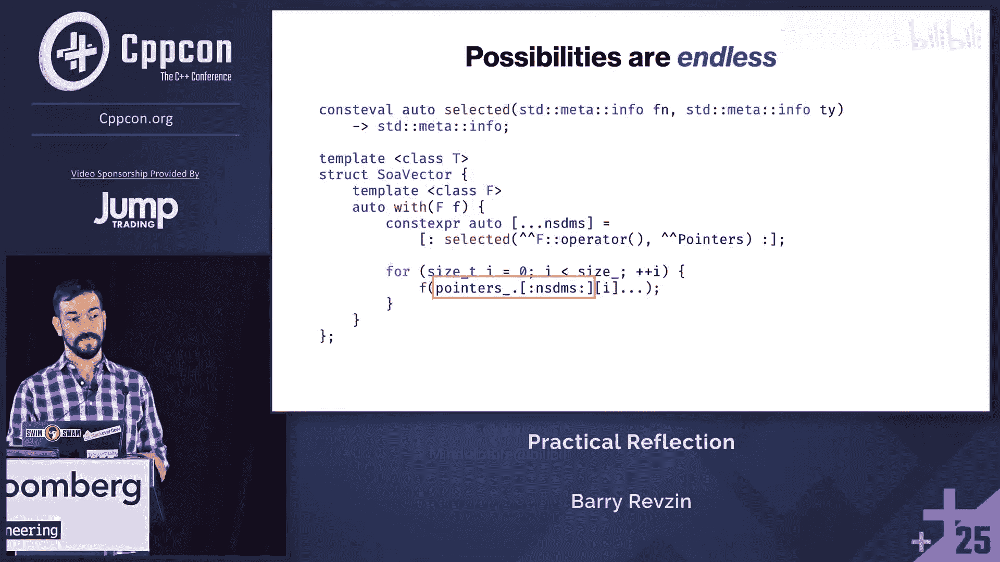
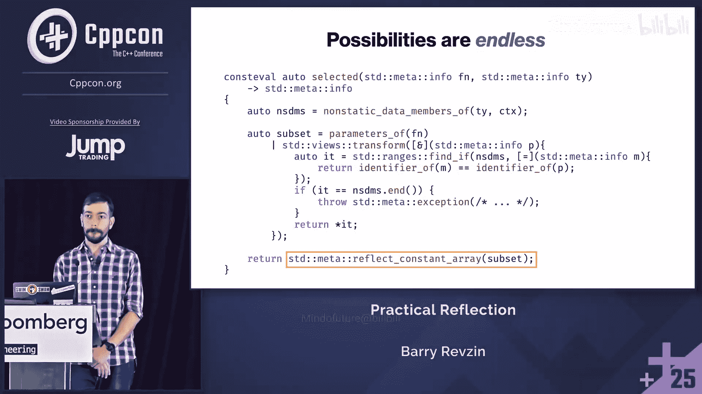

# 011：使用 C++26 实现结构体数组 (SoA) 容器


## 概述

在本节课中，我们将学习如何使用 C++26 的新反射功能，通过一个具体的例子——实现一个结构体数组 (SoA) 容器，来掌握反射的核心概念和编程模式。我们将从定义存储结构开始，逐步实现添加元素、访问元素、格式化输出等核心功能，并在此过程中深入理解 `constexpr` 块、`define_aggregate`、反射算法、注解等新特性。

---

## 第 1 节：目标与动机 🎯

上一节我们概述了课程内容，本节中我们来看看我们想要实现的具体目标。

我的一个同事推荐我观看 Andrew Kelly 关于数据导向设计的演讲。其中有一个幻灯片展示了如何通过一行代码的改动，将“结构体数组” (AoS) 转换为“数组结构体” (SoA)，以高效利用内存。这个转换在 Zig 语言中非常简洁，库本身就知道如何处理 SoA，用户无需额外工作。

这让我非常兴奋，我认为这正是反射应该实现的目标：能够编写出如此易用的库，用户甚至无需思考。因此，我决定在标准 C++26 中实现一个 `soa_vector`。

但本课程的主要目标不仅仅是展示这个例子，更是以 `soa_vector` 为载体，向大家传授关于反射的知识。反射是一个将改变我们解决问题方式的强大新特性。我希望通过今天的课程，让大家开始接触这些新技术，培养直觉，以便未来能够构建出我目前甚至无法想象的酷炫库。

我们不会深入讨论数据导向设计或 SoA 的具体应用场景。如果你想了解更多，可以关注本周晚些时候 Victoria 的 keynote 演讲。

---

## 第 2 节：设计存储结构 💾

上一节我们明确了目标，本节中我们来看看如何设计容器的存储结构。

整个 SoA 的核心在于如何存储数据。我们将围绕一个简单的类型 `Square` 展开讲解：
```cpp
struct Square {
    char x;
    long y; // 注意：这个类型内部可能有大量填充
};
```
如果我们有一个普通的 `vector<Square>`，其存储看起来像这样：一个指向 `Square` 的指针，所有 `Square` 对象在内存中连续存储，外加 `size` 和 `capacity`。

但我们不想要这样。我们想要 SoA。一种实现方式是将 `Square` 的每个成员都变成一个该类型的向量：
```cpp
struct soa_storage_square {
    std::vector<char> x;
    std::vector<long> y;
    // size 和 capacity 呢？每个 vector 都有自己的，这很浪费。
};
```
这个转换很简单：`T` -> `vector<T>` 的每个成员，并保留所有名称。实现 `push_back` 等操作也很直观：分别对 `x` 向量和 `y` 向量调用 `push_back`。

但我不太喜欢这个方案。这两个向量并不是独立的，它们总是有相同的 `size` 和 `capacity`。至少，我们重复存储了 `size` 和 `capacity`，这是浪费的。此外，每次 `push_back` 都要为每个成员检查是否需要分配内存，即使我们知道它们应该同步。

所以，我们不采用这种方式，而是自己管理所有内存。转换变得更简单：对于类型 `T`，我们为每个成员存储一个 `T*`，并单独维护 `size` 和 `capacity`。
```cpp
struct soa_storage_square {
    char* x;
    long* y;
    size_t size;
    size_t capacity;
};
```
这看起来更接近我们实际想要编写的解决方案。

---

## 第 3 节：使用 define_aggregate 生成存储类型 🛠️

上一节我们设计了存储结构，本节中我们来看看如何为任意类型 `T` 动态生成这种结构。

C++26 引入了一种代码生成机制，虽然功能还很有限：给定一个不完整类型，我们可以用一组特定的非静态数据成员来填充它。仅凭这一点，就足以解决大量问题。

具体工作方式是：我们声明一个不完整类型，然后使用一个新的 C++26 特性——`constexpr` 块。`constexpr` 块允许我们在声明上下文中运行任意代码。最终，我们调用 `define_aggregate` 函数，传入一个代表该不完整类型的反射，这个过程将用我们提供的数据成员来完成这个类型。

以下是生成存储类型的代码模式：
```cpp
struct soa_storage; // 不完整类型声明

constexpr {
    // 获取类型 T 的反射
    constexpr auto t_info = reflexpr(T);
    // 准备数据成员描述列表
    std::vector<std::meta::data_member_spec> members;

    // 遍历 T 的所有非静态数据成员
    for (auto mem : nonstatic_data_members_of(t_info, context)) {
        // 对每个成员，生成一个指针成员，保持原名
        members.push_back({
            .type = std::meta::add_pointer(type_of(mem)),
            .name = name_of(mem)
        });
    }

    // 添加 size 和 capacity 成员
    members.push_back({.type = reflexpr(size_t), .name = "size_"});
    members.push_back({.type = reflexpr(size_t), .name = "capacity_"});

    // 完成类型定义
    define_aggregate(reflexpr(soa_storage), members);
}
// 现在 soa_storage 是一个完整类型，可以直接使用
```
需要注意几点：
1.  我限定了 `std::vector` 和 `std::meta::info`，但没有限定 `define_aggregate`。这个函数实际上是 `std::meta::define_aggregate`，但反射以 `std::meta` 作为其关联命名空间，因此参数依赖查找 (ADL) 会生效，代码可以正常工作。
2.  `nonstatic_data_members_of` 需要两个参数：类型的反射和一个很长的“访问上下文”参数。访问上下文决定了你能看到哪些成员（例如，私有成员）。我们可以使用 `unchecked` 来获取所有成员，或使用 `unprivileged` 来获取当前代码位置有访问权限的成员。为了简化，我们假设有一个全局变量 `context` 始终是 `unchecked`。
3.  `std::meta::add_pointer` 是一个类型特征 (type trait) 的 `constexpr` 函数版本，它接受一个 `info` 并返回应用了指针转换的 `info`。

这就是基本模式：声明不完整类型 -> 在 `constexpr` 块中工作 -> 调用 `define_aggregate` 完成类型 -> 像手写一样使用它。

然而，这个方案有个问题：如果用户类型 `T` 本身就有名为 `size_` 或 `capacity_` 的成员，那么我们在循环中添加同名成员时就会冲突，导致编译失败。

作为库作者，我们可以禁止用户使用这些保留名，但这很不友好。更好的方法是：不通过 `define_aggregate` 生成 `size_` 和 `capacity_`，而是像普通成员一样在外部声明它们。这样就没有额外的限制了。

此外，由于所有生成的成员都是指针，我们可以给这个类型起一个更有意义的名字，比如 `pointers`。我们还可以更清晰地表达计算指针的过程只是一个简单的数据转换。

我们可以提前泛化一下这个转换过程，也许预示着未来会再次用到这个函数：
```cpp
constexpr auto trans = std::meta::add_pointer;
auto members_view = nonstatic_data_members_of(t_info, context)
                    | std::views::transform([&](auto mem) {
                        return std::meta::data_member_spec{
                            .type = trans(type_of(mem)),
                            .name = name_of(mem)
                        };
                    });
// members_view 是一个转换后的范围，可以直接用于 define_aggregate
```
另一种写法是利用反射是单类型设计这一事实：`std::meta::info` 可以代表任何东西。我们可以直接原地修改 `vector` 并返回：
```cpp
std::vector<std::meta::info> members = ...; // 获取原始成员反射
for (auto& mem : members) {
    mem = data_member_spec_of(mem, trans(type_of(mem)), name_of(mem));
}
// 现在 members 包含了转换后的描述
```
对于熟悉 range-v3 的人来说，这类似于 `actions::transform` 与 `views::transform` 的区别。我怀疑反射可能会更多地推动 `actions` 的使用，因为它是解决许多反射问题的好方法。

---

## 第 4 节：施加约束 ⚙️

上一节我们生成了存储类型，本节中我们来看看需要对类型 `T` 施加哪些约束。

事实证明，我们不能对任意类型 `T` 都进行 SoA 向量化。实现需要满足一些基本要求：
1.  **需要能够解构值**：因为我需要分开存储所有成员，所以每个成员必须能独立析构。
2.  **需要能够重构值**：因为最终你需要从 `soa_vector` 中获取值，所以我需要能够将它们重新组合起来。
3.  **需要能将成员映射到存储**：重构值的唯一方法基本上是使用列表初始化，所以这必须有效。

这些约束基本上要求 `T` 是一个聚合体 (aggregate)，并且没有基类（或者至少，实现有基类的情况需要更多工作，本次课程暂不考虑）。

那么如何编写这些约束呢？它们直接映射到谓词上：
```cpp
// 传统类型特征写法 (模板)
template<typename T>
inline constexpr bool is_aggregate_v = __is_aggregate(T);

template<typename T>
inline constexpr bool has_no_bases_v = bases_of(reflexpr(T)).empty();

// C++26 反射下的函数写法
constexpr bool is_aggregate_type(std::meta::info type) {
    return std::meta::is_aggregate_type(type);
}

constexpr bool has_no_bases(std::meta::info type) {
    return std::meta::bases_of(type, context).empty();
}
```
在反射的世界里，我们不再需要将所有东西都写成模板。很多这类检查都可以写成常规函数。标准库为原有的类型特征提供了对应的函数版本，命名规则是：原来以 `is` 开头的，函数版本以 `is_*_type` 结尾，例如 `is_function_type`, `is_aggregate_type`, `is_union_type` 等。

但如果你有自己的类型特征变量模板，标准库不会为你提供函数版本。你可能会想直接实例化变量模板然后拼接 (splice) 出值，但这行不通，因为函数参数不是常量表达式，而拼接要求操作数是常量表达式。

别担心，我们有解决方案。反射库中有一个名为 `substitute` 的函数，它可能是整个库中最有用的函数之一。它允许你获取一个模板（任何类型的模板：函数模板、变量模板、类模板）的反射和一堆反射参数，然后为你执行替换。
```cpp
template<typename T>
inline constexpr bool my_trait_v = ...;

constexpr bool my_trait_type(std::meta::info type) {
    // 获取变量模板的反射
    constexpr auto trait_template = reflexpr(my_trait_v);
    // 准备模板参数：类型 T
    std::vector<std::meta::info> args = {type};
    // 执行替换
    auto r = substitute(trait_template, args);
    // r 现在是一个反射，代表 my_trait_v<T> 这个变量
    // 我们知道它代表一个 bool 类型的常量，提取出来
    return extract<bool>(r);
}
```
`extract` 函数有点像 `any_cast`。反射类似于 `any`，可以代表任何东西。如果你知道它代表什么，就可以把它提取出来。如果弄错了，就会出错（抛出异常）。在这里，我们知道 `r` 代表一个 `bool` 变量，所以可以安全提取。

我们可以泛化这个模式，包装成一个名为 `pred` 的算法，它接受一个代表任何模板的反射，并返回一个 lambda。这个 lambda 会执行 `substitute` 和 `extract` 操作，从而将任何模板转换成一个一元或二元函数。
```cpp
constexpr auto pred(std::meta::info template_info) {
    return [=](auto... args) {
        auto r = substitute(template_info, {args...});
        return extract<bool>(r);
    };
}

// 使用 pred 实现 is_aggregate_type
constexpr auto is_aggregate_type = pred(reflexpr(std::is_aggregate_v));
```
这个 `substitute` + `extract` 的模式非常常见，我们后面还会看到。

---

## 第 5 节：实现 push_back：添加元素 ➕

上一节我们定义了约束，本节中我们来看看如何向容器中添加元素。

回到 `Square` 的例子，如果我们有针对 `Square` 的具体实例化，如何实现 `push_back`？
1.  首先检查是否需要重新分配内存（如果 `size == capacity`，则增长到新的容量）。
2.  然后在 `x` 指针的新位置对 `value.x` 进行放置 `new` (placement new)，在 `y` 指针的新位置对 `value.y` 进行放置 `new`。
3.  最后增加 `size`。

这里的关键是，我们在并行地迭代 `pointers` 的成员和 `Square` 的成员。我们可以使用放置 `new`，但标准库提供了一个更专用的设施 `std::construct_at`，它可以为我们推导类型，这样我们就不需要重复类型信息了。

那么，对于泛型类型 `T`，我们如何实现呢？前奏（检查容量和增长）和尾声（增加大小）是一样的。问题在于中间部分：如何将 `value` 的每个成员复制到它自己的存储槽中？

我想到了多种实现方式，下面逐一介绍，你可以选择自己喜欢的方式，不同的方式可能适用于不同的问题。

**选项 1：解构到包中，然后折叠逗号表达式**
```cpp
auto push_back(const T& value) {
    // ... 检查容量，必要时增长 ...
    // 将 pointers 和 value 解构到包中
    auto [... ptrs] = pointers; // pointers 是包含所有成员指针的结构体
    auto [... mems] = value;    // value 是 T 类型的对象
    // 对每一对 (ptr, mem) 调用 construct_at，然后折叠逗号表达式
    (std::construct_at(ptrs + size, mems), ...);
    // ... 增加 size ...
}
```
对于过去几年做过很多元编程的人来说，这可能很熟悉，因为在 C++ 中迭代的方式就是折叠逗号表达式。但对其他人来说，用逗号写循环可能很奇怪。

**选项 2：使用扩展语句 (expansion statement)**
C++26 引入了一种新的循环：扩展语句。这种循环完全在编译时进行。扩展语句的一个很酷的特性是循环变量可以是 `constexpr`（普通的 `for` 或 `while` 循环不行）。这里需要 `constexpr`，因为我用它来索引到包中（索引包也是 C++26 的新特性）。
```cpp
auto push_back(const T& value) {
    // ... 检查容量，必要时增长 ...
    auto [... ptrs] = pointers;
    auto [... mems] = value;
    constexpr size_t N = sizeof...(ptrs); // 成员数量
    // 扩展语句：遍历索引
    for constexpr (size_t i : std::views::indices(N)) {
        std::construct_at(ptrs[i] + size, mems[i]);
    }
    // ... 增加 size ...
}
```
`std::views::indices(N)` 类似于 Python 的 `range(N)`，它生成从 `0` 到 `N-1` 的索引，避免了手动写 `0` 和类型问题。

**选项 3：使用元组 zip**
有些人可能会想，我在并行迭代两个东西，有个算法叫 `zip`。不过这里不是范围 zip，而是对元组进行 zip。
```cpp
template<typename... Ts>
auto tuple_zip(Ts&&... tuples) {
    // 简化实现：返回一个元组，其元素是各个输入元组对应元素的引用元组
    return std::make_tuple(std::forward_as_tuple(std::get<Is>(tuples)...));
    // 实际实现需要更复杂以处理任意数量和完美转发
}

auto push_back(const T& value) {
    // ... 检查容量，必要时增长 ...
    auto zip_view = tuple_zip(pointers, value); // 假设 pointers 和 value 可视为元组
    for constexpr (auto&& [ptr, mem] : zip_view) {
        std::construct_at(ptr + size, mem);
    }
    // ... 增加 size ...
}
```

**选项 4：基于范围的 zip，遍历成员反射**
我们可以 zip 两个类型的非静态数据成员反射。
```cpp
auto push_back(const T& value) {
    // ... 检查容量，必要时增长 ...
    // 获取 T 和 pointers 类型的成员反射列表
    auto t_mems = nonstatic_data_members_of(reflexpr(T), context);
    auto p_mems = nonstatic_data_members_of(reflexpr(decltype(pointers)), context);
    // 将两个反射列表 zip 起来
    auto zipped = std::views::zip(t_mems, p_mems);
    // 遍历 zipped 对
    for constexpr (auto [t_mem, p_mem] : zipped) {
        // 通过成员反射访问实际子对象
        auto& ptr = pointers.[:p_mem:]; // C++26 成员反射访问语法
        auto& mem = value.[:t_mem:];
        std::construct_at(ptr + size, mem);
    }
    // ... 增加 size ...
}
```
这段代码需要一个尚未实现的功能：非临时 `constexpr` 分配。`nonstatic_data_members_of` 返回的 `vector` 会分配内存，`zip` 会持有这些 `vector`，而在扩展语句内部尝试用这个结果创建 `constexpr` 变量是行不通的。

不过我们有解决办法：`define_static_array`。这是标准库中加入的一组非常有趣的函数之一。`define_static_array` 接受一个任意范围（有一些要求），并将该范围提升到静态存储，就像你用那些内容创建了一个静态 `constexpr` 数组一样，然后返回一个指向该数组的 `span`。
```cpp
auto push_back(const T& value) {
    // ... 检查容量，必要时增长 ...
    // 使用 define_static_array 避免分配
    auto t_mems = std::meta::define_static_array(
        nonstatic_data_members_of(reflexpr(T), context)
    );
    auto p_mems = std::meta::define_static_array(
        nonstatic_data_members_of(reflexpr(decltype(pointers)), context)
    );
    // 现在 t_mems 和 p_mems 是 span，指向静态数组
    for constexpr (size_t i : std::views::indices(t_mems.size())) {
        auto& ptr = pointers.[:p_mems[i]:];
        auto& mem = value.[:t_mems[i]:];
        std::construct_at(ptr + size, mem);
    }
    // ... 增加 size ...
}
```
由于我们可能多次重用这些成员反射，我们可以将它们作为静态 `constexpr` 成员存储在 `soa_vector` 类中。`define_static_array` + 非静态数据成员的模式很常见，我们可以将其包装成一个更友好的函数，比如 `nsdms_of` 或 `fields_of`。

**选项 5：直接循环索引**
我们也可以直接遍历从成员数量得到的索引，然后通过类成员访问语法索引到两个 `span` 中。
```cpp
auto push_back(const T& value) {
    // ... 检查容量，必要时增长 ...
    constexpr size_t N = /* 成员数量 */;
    for constexpr (size_t i : std::views::indices(N)) {
        // 假设我们有 members_span 存储了成员反射
        auto& ptr = pointers.[:members_span[i]:];
        auto& mem = value.[:members_span[i]:];
        std::construct_at(ptr + size, mem);
    }
    // ... 增加 size ...
}
```

---

## 第 6 节：实现 grow：扩容 📈

上一节我们实现了添加元素，本节中我们来看看如何实现容器的扩容。

扩容实际上相当简单。我们遍历所有的指针成员，对每个指针独立进行扩容操作。
```cpp
void grow(size_t new_capacity) {
    // 遍历所有指针成员
    for constexpr (auto& ptr : pointers_members_span) { // 假设有这样一个 span
        auto& member_ptr = pointers.[:ptr:]; // 获取当前指针成员的引用
        // 分配新内存
        auto new_mem = std::allocator<std::remove_pointer_t<decltype(member_ptr)>>().allocate(new_capacity);
        // 将旧数据复制或移动到新内存
        std::uninitialized_copy_or_move_n(member_ptr, size, new_mem);
        // 销毁旧数据并释放内存
        std::destroy_n(member_ptr, size);
        std::allocator<std::remove_pointer_t<decltype(member_ptr)>>().deallocate(member_ptr, capacity);
        // 更新指针
        member_ptr = new_mem;
    }
    capacity = new_capacity;
}
```
扩展语句的循环体对于每个成员来说可能是不同的模板实例化（如果需要的话）。这是基本的分配代码。当然，我们可能不想复制，而是想移动。在 C++26 中，如果 `relocate` 特性存在，我们可以使用它。

现在，我们有了一个完整的添加元素的解决方案。

---

## 第 7 节：实现 spans：提供成员视图 👁️

上一节我们实现了扩容，本节中我们来看看如何提供一种查看容器内数据的方式。

向容器添加元素很酷，但最终你可能会想查看它们，比如打印出来。最简单的事情就是打印元素。

回到我们对 `soa_vector` 的装饰（decoration），我们声明了 `pointers` 类型。现在我们要添加一个新类型，叫 `spans`。就像 `pointers` 是所有成员类型的指针类型一样，`spans` 可以是所有成员的 `span` 类型。我将使其成为每个成员类型的 `const span`。
```cpp
// 对于 Square，spans 类型看起来像这样：
struct spans_square {
    std::span<const char> x;
    std::span<const long> y;
};
```
使用方式可能是这样的：
```cpp
soa_vector<Square> v;
v.push_back({'e', 4});
v.push_back({'c', 6});
auto sp = v.spans(); // 获取 spans 对象
// 打印 x spans 和 y spans
for (char cx : sp.x) std::cout << cx << ' '; // 输出: e c
for (long ly : sp.y) std::cout << ly << ' '; // 输出: 4 6
```
实现 `spans` 用到了之前展示过的技术：解构 `pointers` 得到所有指针成员，然后为每个指针生成一个适当大小的 `span`，最后将它们组合到 `spans` 结构体中。这并不复杂。

---

## 第 8 节：实现格式化打印：使用注解驱动 🖨️

上一节我们实现了成员视图，本节中我们来看看如何格式化打印整个元素。

你可能还想打印单个元素，比如第一个元素。为了实现这个，我们可以添加一个 `operator[]`。它的实现看起来和 `spans` 很像，但这次它返回一个 `Square`。我的 `Square` 类型默认不可打印。

我可以为 `Square` 特化一个 `std::formatter`，添加一个 `parse` 和一个 `format` 函数，遍历所有成员并打印。为了美观地打印，我可能想给 `char` 加上引号（使用 `?` 格式说明符），但 `long` 不支持 `?` 说明符。这意味着我需要写一些逻辑来检查格式说明符是否被支持。

我很懒，不喜欢写这些东西。我想要的是，我只需在类型前加上 `debug`，它就能正常工作。但我不能直接写 `#define debug` 这样的预处理指令。

不过，我可以做一件非常接近的事：使用注解 (annotations)。这是 C++26 的另一个新特性。我将把它拼写为 `derive(debug)`，没什么特别原因。
```cpp
struct Square {
    char x;
    long y;
};
// 使用注解
[:derive(debug):] // 这是一个注解
struct Square {
    char x;
    long y;
};
```
我希望格式化器能自动识别任何带有此注解的类型，并为其提供正确的格式化行为。接下来我们就来实现这个。

标准库里没有 `derive(debug)` 这样的注解，`annotation` 也不是标准库函数，但我们可以自己写。

首先，实现 `annotation` 函数。它接受一个代表任何东西的反射（可以是非静态数据成员、函数、命名空间等），和一个类型 `T` 及值 `value`，检查该反射是否有类型为 `T`、值等于 `value` 的注解。
```cpp
template<typename T>
constexpr bool annotation(std::meta::info thing, const T& value) {
    for (auto ann : std::meta::annotations_of(thing)) {
        if (type_of(ann) == reflexpr(T)) {
            if (extract<T>(ann) == value) {
                return true;
            }
        }
    }
    return false;
}
```
我们预见到这种查找特定类型特定值注解的模式会很常见，所以标准库提供了一个专用函数 `annotations_of_with_type`，它只返回特定类型的注解。
```cpp
template<typename T>
constexpr bool annotation(std::meta::info thing, const T& value) {
    auto anns = std::meta::annotations_of_with_type(thing, reflexpr(T));
    // 现在 anns 只包含类型为 T 的注解
    for (auto ann : anns) {
        if (extract<T>(ann) == value) return true;
    }
    return false;
}
```
但这里有个问题：我需要为 `T` 类型定义 `operator==`，而上面的例子中我并没有为 `debug` 标签类型写比较操作符。我们可以不要求用户定义比较操作符，而是将值作为反射来比较。

两个反射如果都代表值且代表相同的值，或者都代表对象且代表相同的对象，那么它们相等。任何放入 `info` 的值都必须能用作非类型模板参数或常量模板参数，语言已经有规则来比较它们是否相等。`debug` 标签类型是结构化的（没有成员），所以比较可以直接进行。
```cpp
template<typename T>
constexpr bool annotation(std::meta::info thing, const T& value) {
    auto anns = std::meta::annotations_of_with_type(thing, reflexpr(T));
    auto value_reflection = std::meta::reflect_constant(value);
    for (auto ann : anns) {
        // 提取注解中的常量值（作为反射）
        auto ann_const = std::meta::constant_of(ann);
        if (ann_const == value_reflection) return true;
    }
    return false;
}
```
这代码看起来像在写循环算法，我们可以用 `std::ranges::any_of` 来写得更优雅，甚至用 `contains`。
```cpp
template<typename T>
constexpr bool annotation(std::meta::info thing, const T& value) {
    auto anns = std::meta::annotations_of_with_type(thing, reflexpr(T));
    auto value_reflection = std::meta::reflect_constant(value);
    return std::ranges::contains(anns, value_reflection,
                                 [](auto ann) { return std::meta::constant_of(ann); });
}
```
现在来实现我们的格式化器。我们将约束格式化器只匹配那些通过注解选择了默认行为的类型。
```cpp
template<typename T>
    requires (annotation(reflexpr(T), debug{})) // 检查是否有 derive(debug) 注解
struct std::formatter<T> {
    // 格式化器实现...
};
```
格式化器的实现：首先打印类型名和花括号，然后遍历所有基类（递归打印），最后遍历所有非静态数据成员，打印它们的名字和值。我们需要在多个基类或成员之间添加逗号和空格作为分隔符。

我们可以使用之前见过的 `nsdms_of` 函数来获取成员反射。但打印格式可能不是我们想要的：基类没有名字，但成员有名字。我们可以加上成员名。



这里我用了 `identifier_of` 来获取成员标识符，而上面用的是 `display_string_of`，为什么不同？因为名字很复杂。类型名可能非常复杂（比如类模板特化），`display_string_of` 只是让编译器给出一些有用的字符串表示。但对于非静态数据成员，我们知道它的名字是一个标识符，所以 `identifier_of` 肯定能给出这个标识符。如果某个东西没有特定的标识符，`identifier_of` 会失败。

然而，这还不是我想要的格式：我希望 `char` 被引号括起来，但这里没有。我可以尝试加上 `?` 格式说明符，这对 `char` 有效，但对 `long` 无效。为了正确处理，我需要写一个包装器，检查某个格式化器是否支持 `?` 说明符，如果不支持就跳过它。这不太有趣，但很重要。

有了这些，我就有了一个完整的格式化器实现。看看这段代码，里面有很多新东西：新循环、新算法、反射、显示字符串……但这里没有什么奇技淫巧。我想格式化，想打印名字，想打印所有基类，就循环基类；想打印所有成员，就循环成员。我直接写下了我想写的东西，这很棒。

现在，这一切都工作了。我只需在 `Square` 上加上 `derive(debug)` 注解，就能向其中添加元素，取出元素，并打印它们。这很酷。

---

## 第 9 节：实现可变代理：支持修改 ✏️

上一节我们实现了只读访问和打印，本节中我们来看看如何支持修改容器内的元素。

更复杂的操作是修改。我希望能够写入 `v[0]`。如果能有像 Swift 那样的可变属性 (mutating properties) 就好了：我可以解构所有指针，用它们产生一个新的 `T`，将其交给调用者，然后无论调用者做什么，我都可以将结果解构回元素并写回指针。但这不是 C++ 的语言特性，可能永远也不会有。

我们能做的是返回一个代理 (proxy) 对象。当你只有 `define_aggregate` 这把锤子时，所有解决方案都会被扭曲成看起来像 `define_aggregate` 形状的钉子。

我们将创建一个新类型 `proxy`，它包含对所有成员的左值引用。
```cpp
// 对于 Square，proxy 类型类似：
struct proxy_square {
    char& x;
    long& y;
};
```
但这还不足以让 `proxy = square` 这样的赋值工作。我们需要在 `proxy` 内部添加赋值运算符和转换函数。然而，`define_aggregate` 只接受非静态数据成员，不能添加成员函数。

没关系，我们不必把所有东西都塞进 `define_aggregate`。我们可以清理一下：让 `proxy` 继承自一个包含所有数据成员的 `proxy_base`，然后单独为 `proxy` 添加成员函数。
```cpp
struct proxy_base {
    char& x;
    long& y;
};
struct proxy : proxy_base {
    proxy& operator=(const Square& value) {
        // 解构 proxy_base 的成员和 value 的成员，然后赋值
        auto& [... refs] = static_cast<proxy_base&>(*this);
        auto [... mems] = value;
        ((refs = mems), ...); // 折叠逗号表达式赋值
        return *this;
    }
    operator Square() const {
        auto& [... refs] = static_cast<const proxy_base&>(*this);
        return Square{refs...}; // 使用列表初始化重构 Square
    }
};
```
结构绑定的规定是：如果所有成员都来自同一个基类，那么你可以直接解构到那些成员。所以 `auto& [... refs] = static_cast<proxy_base&>(*this);` 这行代码是有效的。


但这仍然不完全正确：现在我的可变 `operator[]` 返回的是 `proxy`，而不是 `Square`。当我打印它时，打印的是 `proxy` 类型的信息，而不是 `Square` 的信息，这是用户不想看到的实现细节。

如何修复呢？同样，当你只有注解时，解决方案就是添加更多注解。我们可以添加另一个叫做 `format_as` 的注解，它是一个简单的类型，带有一个 `info` 参数。我想让 `proxy` 被格式化的方式是先转换为 `T`。
```cpp
struct format_as {
    std::meta::info type;
};
// 在 proxy 类型上添加注解
[:annotation(format_as{reflexpr(Square)}):]
struct proxy : proxy_base { ... };
```
然后我们回到格式化器代码。我们将之前的所有代码变成一个名为 `derived_formatter` 的新类模板，然后让 `formatter<T>` 继承自它。但我们会检查 `format_as` 注解：如果类型有 `format_as` 注解，我们就提取用户指定的类型；如果没有，就按实际类型格式化。然后我们可以改变 `formatter<T>` 的实现，让它继承自用户想要的格式化器（即 `formatter<format_as_type>`）。

这意味着，为 `Square` 生成的格式化器继承自 `derived_formatter<Square>`，而为 `proxy` 生成的格式化器也继承自 `derived_formatter<Square>`。因此，当格式化一个 `proxy` 时，在进入格式化函数之前会先转换为 `Square`，然后这个函数就像之前一样格式化 `Square`。

这样，我们打印出来的就是想要的内容，而不是没人想看的无意义信息。

现在我们完成了。我认为这很酷。

---

## 第 10 节：总结与展望 🚀

回顾一下，我们使用 C++26 的反射功能实现了一个 `soa_vector`。我们走过了使用 `constexpr` 块和 `define_aggregate` 模式生成代码的整个过程，学习了如何格式化任意类型，展示了 `substitute` + `extract` 这个非常有用的模式，讨论了如何实现自定义类型特征，甚至演示了如何实现 `define_static_array`。在此过程中，我们还接触了许多其他 C++26 新特性。

现在，摆在你面前的可能性几乎是无限的。很多问题从“这在今天的 C++ 中不可能实现”变成了“也许以后可以”。也许你们中的一位会在课后做出一些我现在认为不可能的事情。这才是最酷的地方。

由于我讲得很快，我们还剩一些时间，这里有一些额外内容。几周前，Victoria 在推特上向我提到了一个他想用于结构体数组实现的 API，叫做 `with`。
```cpp
// 使用示例
v.with([](char& x) { ++x; }); // 递增所有 x 成员
v.with([](long& y) { ++y; }); // 递增所有 y 成员
```
`with` 会查看 lambda 参数的名称，然后迭代所有元素，给你所有名为 `x` 或 `y` 的成员。我们可以实现这个。

我们首先写一个 `selected` 函数，它接受一个函数反射和一个类型反射，返回一个数组反射，包含所有关联的非静态数据成员（即，为函数的每个参数，查找该类型中同名的非静态数据成员）。如果找不到，就抛出异常。

然后，在 `with` 的实现中，我们调用这个 `selected` 函数，传入 lambda 的调用操作符反射和 `pointers` 类型的反射，然后立即拼接 (splice) 结果。这会给我们一个数组，数组可以通过结构化绑定解构。我们声明一个 `constexpr auto` 包来接收这些非静态数据成员反射。最后，我们循环从 `0` 到 `size`，用按请求顺序排列的成员子集来调用用户函数。

这并不复杂，一旦你弄清楚如何正确塑造它。这一切在以前是不可能的，而现在成为了可能。这是一个非常优雅的 API，没有额外的工具，没有宏，一切就这么工作了。



我希望大家觉得这些内容有趣，并和我一样对反射感到兴奋。我认为它将真正改变我们未来思考 C++ 的方式。

---

## 总结


在本节课中，我们一起学习了如何使用 C++26 的反射功能，通过实现一个结构体数组 (SoA) 容器，深入理解了反射的核心概念和编程模式。我们从存储设计开始，逐步实现了类型生成、约束检查、元素添加、扩容、成员视图、格式化打印、可变代理以及高级 API (`with`)。我们看到了 `constexpr` 块、`define_aggregate`、反射算法、注解等新特性如何协同工作，让代码生成和元编程变得更加直观和强大。反射为 C++ 打开了新的大门，使得许多以前不可能或极其复杂的任务变得简单可行。