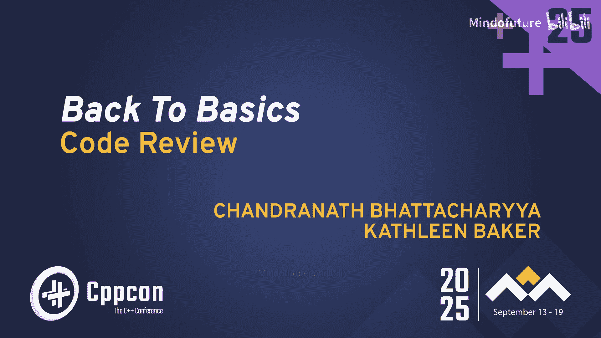
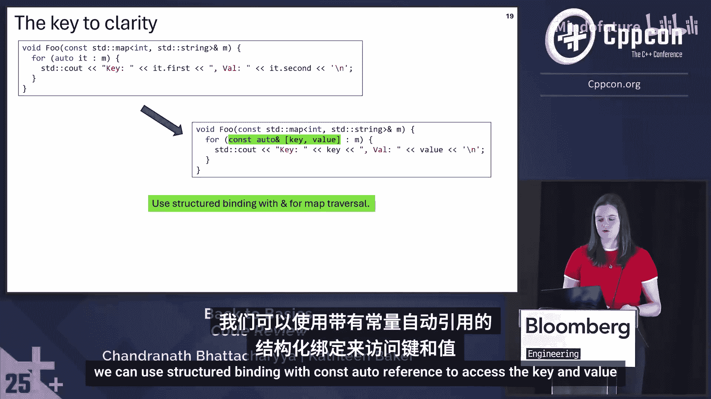
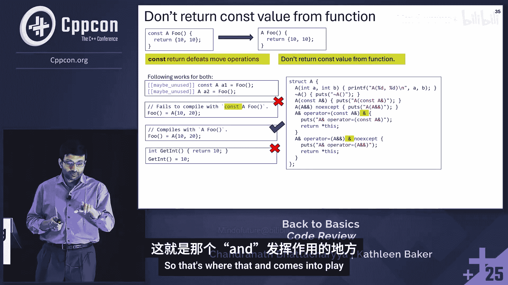
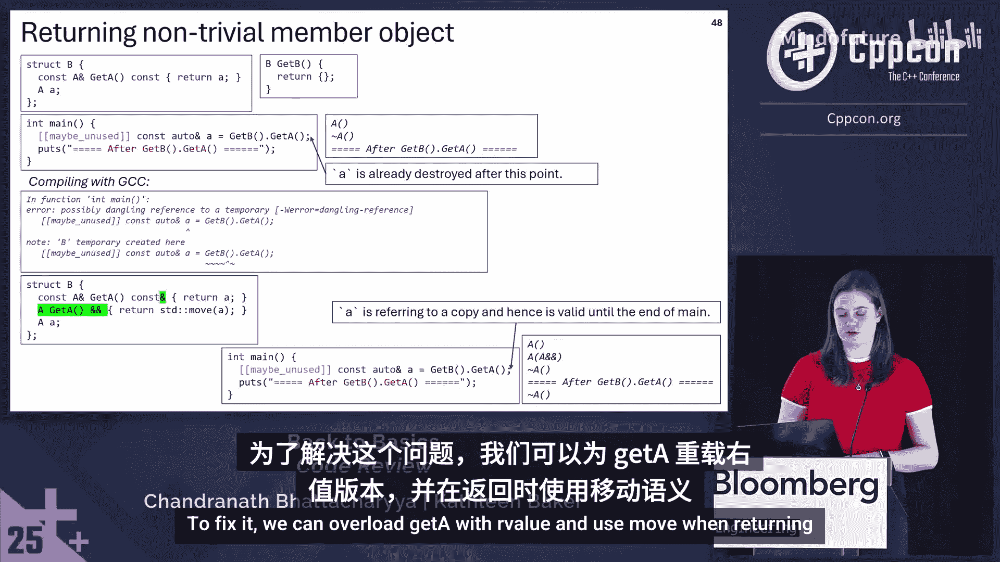
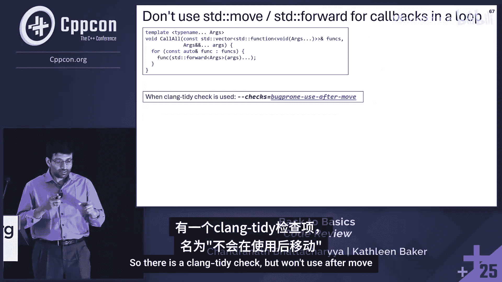
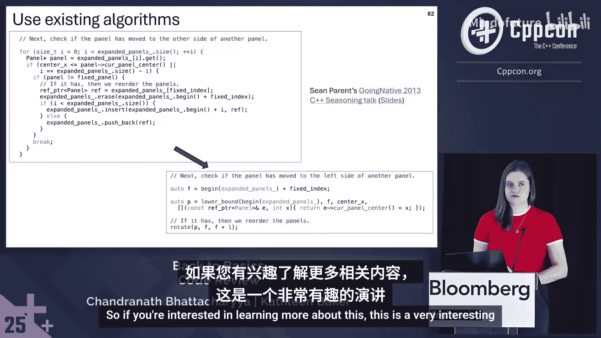
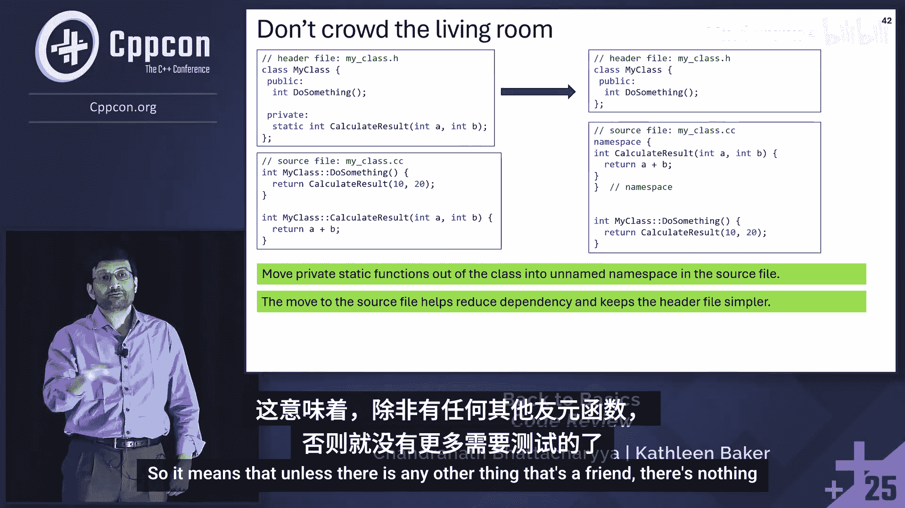
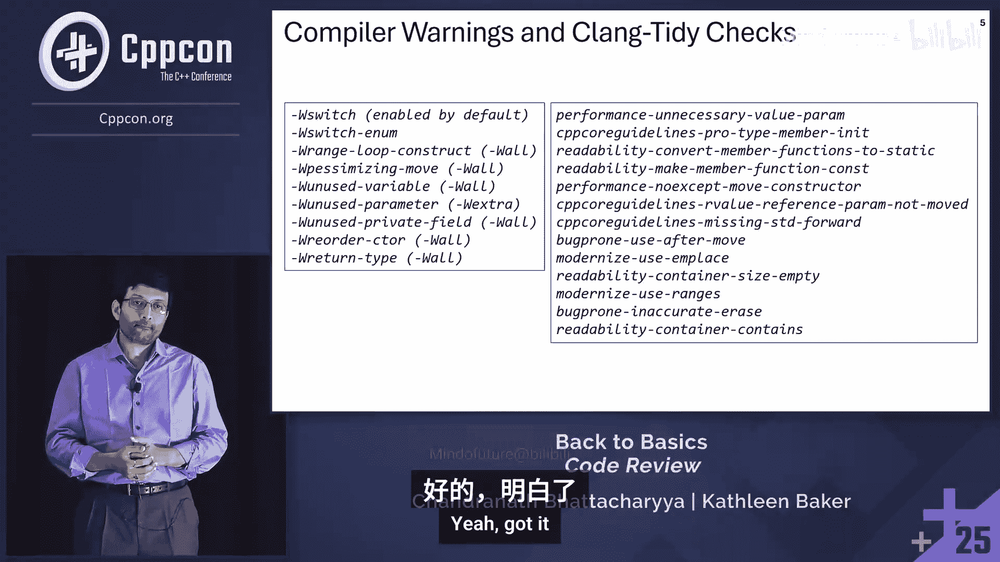

# 012：回归基础




在本教程中，我们将学习如何改进C++代码审查。内容基于微软Edge浏览器团队在代码审查中发现的常见问题，并整理成一系列实用的编码准则。这些准则旨在提升代码的可读性、安全性和性能，适用于大多数C++项目。

## 1：变量作用域

上一节我们介绍了教程的概述，本节中我们来看看如何通过限制变量作用域来提升代码清晰度。

### 变量作用域限制


我们有一个`SomeClass`类，它有两个成员函数，以及一个返回`SomeClass`的函数`foo`。
在`if`语句之前，我们创建了一个`SomeClass`的实例`s`，但`s`在`if`语句之外并未使用。

```cpp
// 欠佳代码
SomeClass s = foo();
if (s.IsValid()) {
    // 使用 s
}
// s 在此处不再使用
```

因此，我们可以将变量`s`的作用域限制在`if`语句内部。

```cpp
// 改进代码
if (SomeClass s = foo(); s.IsValid()) {
    // 使用 s
}
```

限制变量作用域可以减少因意外修改而引发错误的风险，并提高可读性。它还允许在`if`块之后使用相同的变量名。

本节的标题是“变量作用域限制”，其准则就是：**限制变量作用域**。

以下是其他限制作用域的例子：

*   **在`switch`语句中初始化**：将变量初始化放在`switch`语句内部，而不是之前。
*   **在`for`循环中声明迭代器**：在`for`循环的初始化部分声明迭代变量，而不是在循环外部。

## 2：枚举（Enum）的使用

上一节我们讨论了变量作用域，本节中我们来看看如何安全地使用枚举。

### 处理所有枚举值

我们有一个枚举类`Result`，它有三个值。我们在一个带有`default`分支的`switch`语句中使用这个枚举。

```cpp
// 欠佳代码
enum class Result { kSuccess, kFailure1, kFailure2 };

Result Process(Result r) {
    switch (r) {
        case Result::kSuccess: return Result::kSuccess;
        case Result::kFailure1: return Result::kFailure1;
        default: return Result::kFailure2; // 处理 kFailure2
    }
}
```

如果我们传入`kFailure2`，它会进入`default`分支并返回`kFailure2`，这没问题。然而，如果我们添加一个新值`kFailure3`，`switch`语句现在会为`kFailure3`返回错误的值（`kFailure2`）。

我们可以移除`default`分支，并为枚举中的每个值添加一个`case`来处理。

```cpp
// 改进代码
Result Process(Result r) {
    switch (r) {
        case Result::kSuccess: return Result::kSuccess;
        case Result::kFailure1: return Result::kFailure1;
        case Result::kFailure2: return Result::kFailure2;
    }
    // 使用宏标记不可达代码，如果执行到此处会引发崩溃
    NOTREACHED();
}
```

这样我们就用到了`switch`中的所有情况。末尾的宏用于确保所有枚举值都被使用，如果执行到此处，会引发不可恢复的崩溃并生成崩溃转储。

需要注意的是，如果你的`switch`语句中没有`default`分支，编译器（如`-Wswitch`）可以检测到你是否遗漏了枚举值。如果你确实需要`default`分支，可以使用`-Wswitch-enum`来检测。

### 使用枚举类（Enum Class）

我们定义一个C风格的枚举`FileStatus`，它有两个值`kOpen`和`kClosed`。我们初始化一个`FileStatus`实例，并隐式地将其转换为`int`。

```cpp
// 欠佳代码
enum FileStatus { kOpen, kClosed };
FileStatus status = kOpen;
int status_code = status; // 隐式转换
```

这不好，因为它可能导致意外的行为，并且没有类型安全。如果我们定义另一个具有相同值的枚举，或者尝试前向声明`FileStatus`，都会导致编译问题。

为了解决所有这些问题，应该将`FileStatus`定义为`enum class`。

```cpp
// 改进代码
enum class FileStatus { kOpen, kClosed };
FileStatus status = FileStatus::kOpen;
// int status_code = status; // 错误：无法隐式转换
```

`enum class`提供了更好的类型安全性，防止名称冲突，并允许前向声明。此外，从C++20开始，比较两个C风格枚举会收到弃用警告，而使用`enum class`则不会编译。

### 使用 using 声明简化枚举名

我们有一个带有长名称的枚举类，并且位于命名空间中。在`switch`语句中使用时，代码难以阅读。

```cpp
// 欠佳代码
namespace my_namespace {
enum class VeryLongEnumName { kValue1, kValue2 };
}

void Process(my_namespace::VeryLongEnumName value) {
    switch (value) {
        case my_namespace::VeryLongEnumName::kValue1: break;
        case my_namespace::VeryLongEnumName::kValue2: break;
    }
}
```

可以在`switch`语句之前使用`using enum`声明。




```cpp
// 改进代码
void Process(my_namespace::VeryLongEnumName value) {
    using enum my_namespace::VeryLongEnumName;
    switch (value) {
        case kValue1: break;
        case kValue2: break;
    }
}
```

这使代码更简洁、更易读。

## 3：迭代

上一节我们介绍了枚举的最佳实践，本节中我们来看看如何更优雅地进行迭代。

### 使用基于范围的 for 循环

我们正在使用带有下标运算符的`for`循环迭代一个`int`向量。对于列表，我们也使用迭代器进行迭代。

```cpp
// 欠佳代码
std::vector<int> vec = {1, 2, 3};
for (size_t i = 0; i < vec.size(); ++i) {
    std::cout << vec[i];
}

std::list<int> lst = {1, 2, 3};
for (auto it = lst.begin(); it != lst.end(); ++it) {
    std::cout << *it;
}
```

相反，我们可以使用基于范围的`for`循环，这使代码更易于阅读和使用。

```cpp
// 改进代码
for (int val : vec) {
    std::cout << val;
}
```

另一种方式是使用`ranges::for_each`，如果你希望对每个项应用函数（例如打印每个项），这会更方便。

```cpp
// 改进代码
std::ranges::for_each(vec, [](int val) { std::cout << val; });
```

### 避免不必要的拷贝

我们正在迭代一个字符串向量，并在`for`循环中创建每个字符串的不必要拷贝。

```cpp
// 欠佳代码
std::vector<std::string> strings = {"a", "b", "c"};
for (std::string s : strings) { // 拷贝！
    std::cout << s;
}
```

相反，对于非平凡对象，应使用`const`引用或转发引用。

```cpp
// 改进代码
for (const std::string& s : strings) { // 无拷贝
    std::cout << s;
}
// 或使用转发引用（C++20起）
for (auto&& s : strings) {
    std::cout << s;
}
```

可以使用警告`-Wrange-loop-construct`来识别此类问题。

### 使用结构化绑定提高清晰度

我们使用迭代器通过`first`和`second`来访问`map`中的键和值。

```cpp
// 欠佳代码
std::map<int, std::string> my_map;
for (const auto& pair : my_map) {
    std::cout << pair.first << ": " << pair.second;
}
```

为了提高可读性，我们可以使用结构化绑定配合`const`引用来访问键和值。

```cpp
// 改进代码
for (const auto& [key, value] : my_map) {
    std::cout << key << ": " << value;
}
```

## 4：参数传递

上一节我们讨论了迭代的优化，本节中我们来看看函数参数传递的最佳实践。

### 传递非平凡只读对象

我们有一个函数`Print`，它按值接受一个`string`参数。在函数体内，我们只是读取这个字符串，没有进行拷贝或修改。

```cpp
// 欠佳代码
void Print(std::string s) {
    std::cout << s;
}
```

由于我们按值传递，可能会调用拷贝构造函数并进行内存分配。`std::string`不是廉价拷贝的类型。更好的替代方案是按`const`引用传递。

```cpp
// 改进代码
void Print(const std::string& s) {
    std::cout << s;
}
```

**准则**：传递非平凡只读对象时使用`const`引用，以避免不必要的拷贝。

可以使用Clang-Tidy检查`performance-unnecessary-value-param`来标记此类问题。注意，字符串比较特殊，我们将在后面的幻灯片中看到处理字符串参数的其他策略。

### 值参数上的 const 是多余的

我们有一个最简单的结构体`Point`和一个函数`PrintPoint`，它接受一个`const Point`。

```cpp
// 欠佳代码
struct Point { int x; int y; };
void PrintPoint(const Point p);
```

这里的`const`不是函数签名的一部分，因此`void PrintPoint(const Point p);`和`void PrintPoint(Point p);`是完全相同的声明。如果添加指针或引用，`const`就会成为签名的一部分。

**准则**：函数声明中值参数上的`const`是不需要的。

### 传递廉价拷贝的类型

我们有一个函数`PrintInt`，它通过`const`引用接受一个`int`。`int`是轻量级、廉价拷贝的类型，因此没有必要通过`const`引用传递。

```cpp
// 欠佳代码
void PrintInt(const int& i) { std::cout << i; }
void PrintPoint(const Point& p) { std::cout << p.x << ", " << p.y; }
```

只需按值传递即可。

```cpp
// 改进代码
void PrintInt(int i) { std::cout << i; }
void PrintPoint(Point p) { std::cout << p.x << ", " << p.y; }
```

**准则**：优先按值传递廉价拷贝的类型，因为按引用传递可能会阻止某些优化（例如，编译器可以将值保存在寄存器中）。

### 对于要移动的参数

我们有一个结构体`MyStruct`，它有一个`std::string`类型的成员变量。构造函数接受一个`const std::string&`并赋值给成员变量。还有一个`SetString`函数，也接受`const std::string&`并赋值。

```cpp
// 欠佳代码
struct MyStruct {
    std::string str;
    MyStruct(const std::string& s) : str(s) {}
    void SetString(const std::string& s) { str = s; }
};
```

我们可以将其转换为右值引用。

```cpp
// 改进代码
struct MyStruct {
    std::string str;
    MyStruct(std::string&& s) : str(std::move(s)) {}
    void SetString(std::string&& s) { str = std::move(s); }
};
```

**准则**：对于要从参数中移动所有权的参数，按右值引用传递，并在函数体内使用`std::move`。

### 字符串参数与 string_view

我们有一个函数`Print`，它接受一个`const std::string&`。虽然这是正确的做法，但还有更好的方式。

```cpp
// 可改进代码
void Print(const std::string& s) { std::cout << s; }
```

更好的方法是尝试将其转换为`std::string_view`。

```cpp
// 改进代码
void Print(std::string_view sv) { std::cout << sv; }
```

**原因**：`string_view`可以处理更多情况（`std::string`、`const char*`、带长度的`const char*`），无需为每种情况创建不同的函数，并且不会进行任何堆内存分配。

### 使用 span 代替容器

我们有一个函数`Foo`，它接受一个`const std::vector<A>&`。如果我们将其转换为`std::span<const A>`会有什么不同？

```cpp
// 欠佳代码
void Foo(const std::vector<A>& vec) {
    for (const A& a : vec) { std::cout << a; }
}
```

```cpp
// 改进代码
void FooBetter(std::span<const A> span) {
    for (const A& a : span) { std::cout << a; }
}
```

当我们调用`Foo`时，必须创建一个`vector`，这意味着我们会进行拷贝构造和销毁。而`FooBetter`不会创建临时对象。

**准则**：在不需要获取容器所有权的情况下，使用`span`代替`vector`或数组，以防止不必要的`vector`创建。

`span`可以用于多种情况：C数组、`vector`、双向迭代器以及`initializer_list`。

## 5：函数返回

上一节我们探讨了参数传递，本节中我们来看看如何设计函数的返回值。

### 使用 std::optional 表示可能失败的操作



我们有一个函数`GetNameById`，成功时返回`true`，失败时返回`false`。成功时，它使用第二个参数（一个字符串）来传递名称。


```cpp
// 欠佳代码
bool GetNameById(int id, std::string& out_name);
```

我们可以将这两种返回类型（布尔值和字符串）合并为一个单一的返回参数。当然，我们可以使用`std::optional<std::string>`。

```cpp
// 改进代码
std::optional<std::string> GetNameById(int id);
```

代码变得更简单，并且该变量现在的作用域仅限于`if`块内。

**准则**：当函数可能失败，并且仅在成功时返回一个值时，使用`std::optional`作为结果类型。

### 使用 std::expected 统一返回类型

我们有一个函数`ParseInt`，它尝试用`std::stoi`解析一个字符串。如果能够解析，则返回`true`并将第二个参数`value`设置为解析后的整数。如果不能解析，则返回`false`并将第三个参数`error`设置为错误字符串。

```cpp
// 欠佳代码
bool ParseInt(const std::string& str, int& out_value, std::string& out_error);
```

我们有三种不同的返回类型：`bool`、`int`、`string`。它们可以合并为一个单一的返回类型吗？当然可以，使用C++23的`std::expected`。

```cpp
// 改进代码 (C++23)
std::expected<int, std::string> ParseInt(const std::string& str);
```

代码变得更简单，并且变量现在的作用域仅限于`if`块内。

**准则**：使用`std::expected`来适当地统一函数的返回类型。

### 不要对返回值使用 std::move

我们有一个返回类型`A`的函数`Foo`。在返回之前，我们调用了`std::move`。

```cpp
// 欠佳代码
A Foo() {
    A a;
    // ... 操作 a
    return std::move(a); // 不必要
}
```

这会创建一个临时对象并调用移动构造函数。如果我们直接返回`a`，编译器可能会应用返回值优化（RVO），进行就地构造。

**准则**：在这种情况下不要使用`std::move`，因为它会阻碍RVO。

可以使用Clang-Tidy检查`-Wpessimizing-move`来捕获此问题。

### 优先使用复制省略

这是上一张幻灯片中应该给出正确输出的代码。

```cpp
// 可改进代码
A Foo() {
    A a;
    // ... 操作 a
    return a; // 依赖RVO
}
```




如何使其更好？我们可以移除类型的名称。

```cpp
// 改进代码
A Foo() {
    // ... 操作
    return A{/* 参数 */}; // 保证复制省略 (C++17)
}
```

这保证了复制省略（C++17起），也称为延迟临时物化或未物化值传递。它比依赖RVO更可靠，因为命名对象可能导致不可拷贝和不可移动类型的编译错误，而复制省略在这些情况下有效。

### 不要返回 const 值

我们有一个函数`Foo`，它返回`const A`。这里有一些使用`Foo`的代码。

```cpp
// 欠佳代码
const A Foo();

int main() {
    std::vector<A> vec;
    vec.push_back(Foo()); // 调用拷贝构造函数
    A a;
    a = Foo(); // 调用拷贝赋值运算符
}
```

即使有临时对象，我们也期望调用移动构造函数和移动赋值运算符，但这里我们看到调用了拷贝版本。如果我们移除`const`，就会得到我们想要的结果。

**准则**：不要从函数返回`const`值，因为`const`返回值会阻碍移动操作。

开发者可能这样写的原因包括复制粘贴代码或无知。但有时他们可能想防止像`Foo() = A{10, 20};`这样的赋值。对于自定义类型，可以通过仅针对左值定义赋值运算符来实现。

## 6：类设计

上一节我们讨论了函数返回值的优化，本节中我们来看看如何更好地设计类。

### 成员变量初始化

我们有一个结构体`Size`，并在构造函数中初始化成员变量。

```cpp
// 欠佳代码
struct Size {
    int width;
    int height;
    Size() : width(0), height(0) {}
};
```

相反，应该在声明点初始化它们。

```cpp
// 改进代码
struct Size {
    int width = 0;
    int height = 0;
};
```

这减少了遗漏初始化的错误。可以使用Clang-Tidy检查`cppcoreguidelines-pro-member-init`来捕获此问题。

### 使用成员初始化列表

我们有一个类`Person`，再次在构造函数中初始化。相反，可以在成员初始化列表中初始化。

```cpp
// 欠佳代码
class Person {
    std::string name;
    int age;
public:
    Person(const std::string& n, int a) {
        name = n;
        age = a;
    }
};
```

```cpp
// 改进代码
class Person {
    std::string name;
    int age;
public:
    Person(const std::string& n, int a) : name(n), age(a) {}
};
```

这是一种风格上的改变，但如果成员是非平凡类型，它还可以减少对默认构造函数的不必要调用。使用成员初始化列表还强制我们确保正确的初始化顺序。可以使用警告`-Wreorder-ctor`来指出问题。

### 将不访问成员变量的函数设为静态

我们有一个类`Logger`，它有一个公共函数`PrintHello`。它不访问类的任何成员变量。

```cpp
// 欠佳代码
class Logger {
public:
    void PrintHello() { std::cout << "Hello"; }
};
```

我们可以将`PrintHello`设为`static`。

```cpp
// 改进代码
class Logger {
public:
    static void PrintHello() { std::cout << "Hello"; }
};
```

**准则**：如果成员函数不访问非静态成员变量或函数，可以将其设为`static`。在某些情况下，如果它与类在概念上无关，也可以将其移出类并放入命名空间。

可以使用Clang-Tidy检查`readability-convert-member-functions-to-static`来指出这一点。

### 将私有静态函数移出类

我们的类有一个公共成员函数和一个私有静态成员函数`CalculateResult`。在源文件中，我们定义了`CalculateResult`。然而，`CalculateResult`不使用类的任何成员变量或函数。

我们可以将私有静态函数移出类，并放入未命名的命名空间。

```cpp
// 改进代码 (头文件)
class MyClass {
public:
    void DoSomething();
};

// 改进代码 (源文件)
namespace {
int CalculateResult(int x, int y) { return x + y; }
}

void MyClass::DoSomething() {
    int result = CalculateResult(10, 20);
}
```

这将减少依赖关系并简化头文件。

### 移除多余的 extern 声明

我们在头文件中声明了一个函数`MyFunction`，并在源文件中定义了它。最好不将函数声明为`extern`。

```cpp
// 欠佳代码 (头文件)
extern void MyFunction();

// 改进代码 (头文件)
void MyFunction();
```

`extern`不是必需的，因为函数默认具有外部链接，所以这是多余的。

### 将只读成员函数标记为 const

我们有一个类`Point`，定义了一个`Print`函数，它输出`x`和`y`。在`main`中，我们创建一个`Point`实例并调用`Print`，这没问题。但如果我们将`Point`实例设为`const`，这将无法编译，因为`p`是`const`，但`Print`函数不是`const`。

```cpp
// 欠佳代码
class Point {
    int x, y;
public:
    void Print() { std::cout << x << ", " << y; }
};

int main() {
    const Point p{1, 2};
    p.Print(); // 编译错误
}
```

如何修复？将所有不修改任何成员的成员函数标记为`const`。

```cpp
// 改进代码
class Point {
    int x, y;
public:
    void Print() const { std::cout << x << ", " << y; }
};
```

可以使用Clang-Tidy检查`readability-make-member-function-const`来捕获此问题。

### 返回成员变量的 const 引用

我们有一个类`Book`，成员函数`GetTitle`返回成员变量`title`，它是一个`string`。

```cpp
// 欠佳代码
class Book {
    std::string title;
public:
    std::string GetTitle() { return title; } // 拷贝
};
```

相反，可以返回`title`的`const`引用。



```cpp
// 改进代码
class Book {
    std::string title;
public:
    const std::string& GetTitle() const { return title; } // 无拷贝
};
```


返回非平凡成员变量可能效率低下，因此应将其作为`const`引用返回。

### 为右值引用重载成员函数

我们有一个结构体`B`，它有一个函数`GetA`，返回成员`a`的`const`引用。我们还有一个函数`GetB`，返回`B`的实例。在`main`中，我们获取`A`的`const`引用，调用`GetB`（返回`B`），然后对其调用`GetA`。这编译正常，但输出显示`a`在打印行之前就被销毁了（悬垂引用）。要修复它，可以为`GetA`重载右值引用版本，并在返回时使用`std::move`。

## 7：类的特殊成员函数

上一节我们介绍了类设计的一般原则，本节中我们来看看如何正确定义类的特殊成员函数。

### 使移动操作为 noexcept

我们再次使用结构体`A`。在`main`中，我们有一个`A`的向量，然后运行一个`for`循环并`push_back`四次。即使存在移动构造函数，在调整大小时也会调用拷贝构造函数。原因是这些非平凡对象的移动构造函数不是`noexcept`。如果我们添加`noexcept`，就会发生移动构造。

**准则**：考虑将移动构造函数和移动赋值运算符标记为`noexcept`。可以使用Clang-Tidy检查`performance-noexcept-move-constructor`来标记此情况。

### 用户定义的析构函数会抑制移动操作

我们再次使用结构体`A`，并创建另一个新结构体`B`，它只有一个类型为`A`的成员变量。然后我们有一个用户定义的析构函数。我们创建类型`B`的对象，然后执行`B b2 = std::move(b);`。我们期望调用`B`的移动构造函数，进而调用`A`的移动构造函数，但输出显示调用了拷贝构造函数。用户定义的非平凡析构函数会抑制移动操作。

**准则**：确保类的所有特殊成员函数都正确定义。如果定义了或删除了任何拷贝、移动或析构函数，请定义或删除所有它们，并使默认操作保持一致。

### 默认比较运算符（C++20）

我们有一个包含四个不同成员变量的结构体，我们定义了一个相等运算符和一个不等运算符（使用相等运算符实现）。在C++20中，不等运算符可以从相等运算符生成，因此我们不需要它。此外，由于所有成员变量都用于比较，我们可以完全将其默认化。

```cpp
// 改进代码 (C++20)
struct MyStruct {
    int a, b, c, d;
    bool operator==(const MyStruct&) const = default;
};
```

### 使用飞船运算符（<=>， C++20）

我们有一个类`Point`，定义了相等运算符和所有比较函数。在C++20中，我们可以使用飞船运算符来生成所有其他函数。

```cpp
// 改进代码 (C++20)
class Point {
    int x, y;
public:
    auto operator<=>(const Point&) const = default;
};
```

### 使用 Passkey 模式替代友元类

我们有一个类`Foo`，它有一个私有成员函数`SetSecret`。我们希望类`Bar`能够调用该函数，因此`Bar`成为友元。但作为友元，`Bar`可以访问所有私有变量，这可能不是我们想要的。为了解决这个问题，我们可以引入Passkey模式。我们将`SetSecret`从私有改为公共，但不是让`Bar`成为`Foo`的友元，而是让`Bar`成为`Passkey`类的友元。然后，`Passkey`类成为`SetSecret`的参数。由于`Bar`是`Passkey`的友元，它可以调用`Passkey`来调用`SetSecret`，但不能做任何其他事情。

**准则**：考虑使用Passkey模式替代使类成为友元，因为它允许我们确保仅对特定的类函数进行有针对性的访问。

## 8：移动语义与完美转发



上一节我们讨论了特殊成员函数，本节中我们来看看移动语义和完美转发的高级主题。


### 在函数体内使用 std::move

我们再次使用结构体`A`。`MyClass`有一个`A`作为成员变量，以及一个构造函数，该构造函数接受一个右值引用参数并初始化成员变量。在代码中，我们得到一个拷贝构造，而我们期望的是移动。Clang输出显示：“右值引用参数`a`在函数体内从未被移动”。我们需要调用`std::move`。

**准则**：考虑在函数体内使用`std::move`来处理右值引用参数，以取得所有权（如果适用）。

### 使用 std::forward 进行完美转发

我们的`MyClass`有一个`string`成员变量。我们有三个不同的构造函数来以不同方式创建字符串：`const char*`、`const string&`和`string&&`。我们还有另一个函数`MakeUnique`，它创建`unique_ptr`。当我们尝试以四种不同方式创建`MyClass`时，理想情况下我们希望调用移动构造函数，但实际调用了拷贝构造函数。问题在于我们没有使用`std::forward`。一旦我们添加`std::forward`，就会发生正确的移动构造。

**准则**：处理转发引用时，使用`std::forward`来避免不必要的拷贝。

可以使用Clang-Tidy检查`cppcoreguidelines-missing-std-forward`来指出此问题。

### 多次调用函数时避免使用 std::forward

我们有一个函数`Call`，它接受一个函数向量和一个可变参数包。在`Call`的主体中，它遍历向量中的所有函数，并使用`std::forward`调用每个函数。我们有两个示例函数`Func1`和`Func2`，它们都按值接受字符串。在`main`中，我们设置一个包含`Func1`和`Func2`的向量，然后调用`Call`并传递一个字符串。输出显示第二个函数打印空字符串，因为对`Func1`的调用进行了字符串移动，导致`Func2`打印空字符串。如何修复？移除`std::forward`，这样就会进行拷贝。但拷贝可能不必要，我们可以通过将所有参数标记为`const`引用来避免拷贝。

**准则**：如果使用可变参数多次调用函数，请考虑移除`std::forward`。

可以使用Clang-Tidy检查`bugprone-use-after-move`来标记此情况。

## 9：标准模板库（STL）容器

上一节我们深入探讨了移动语义，本节中我们来看看如何更有效地使用STL容器和算法。

### 使用 emplace_back 替代 push_back

我们有一个结构体`A`，它有一个接受`int`的构造函数。我们创建一个大小为2的向量，并使用`push_back`向向量添加元素。输出显示为`A`调用了移动构造函数，因此这里创建了临时对象。我们可以使用Clang-Tidy检查`modernize-use-emplace`，它会告诉我们应该使用`emplace_back`。使用`emplace_back`后，不再创建临时对象。

**准则**：在这种情况下，使用`emplace_back`替代`push_back`。这也适用于许多其他容器，如`deque`、`forward_list`、`list`、`stack`、`queue`、`set`等，使用`emplace`替代`push`或`insert`。

### 使用 empty() 替代检查 size()

我们有一个向量，并使用`size()`检查它是否为空。

```cpp
// 欠佳代码
std::vector<int> vec;
if (vec.size() == 0) { /* ... */ }
```

相反，我们可以直接调用`empty()`。

```cpp
// 改进代码
if (vec.empty()) { /* ... */ }
```

这更具可读性，并清楚地显示了代码的意图。它也适用于其他类型，`string`也有`length()`。可以使用Clang-Tidy检查`readability-container-size-empty`，它会给出警告，建议使用`empty()`替代。

### 使用范围算法

我们尝试对一个向量排序，使用`std::sort`并传入起始和结束迭代器。

```cpp
// 欠佳代码
std::vector<int> vec = {3, 1, 2};
std::sort(vec.begin(), vec.end());
```

相反，我们可以使用`std::ranges::sort`。

```cpp
// 改进代码
std::ranges::sort(vec);
```

这更简洁、可读，并减少了出错的机会。可以使用Clang-Tidy检查`modernize-use-ranges`，它会建议使用范围版本。

### 正确使用 erase-remove 惯用法

我们有两个函数`RemoveOdd`和`RemoveNumber`，使用`std::remove_if`和`std::remove`。意图是`RemoveOdd`移除奇数，`RemoveNumber`移除特定的数字。代码中，我们有一个包含5个整数的向量，调用`RemoveOdd`和`RemoveNumber(2)`，我们期望只剩下值4，但实际输出是`{4, 4, 5}`。`remove`和`remove_if`重新排列向量中的元素，因此我们要保留的元素现在位于向量的前面。`RemoveOdd`返回一个指向向量新末尾的迭代器，然后我们将其传递给`vector::erase`函数，它移除迭代器位置的元素，因此`RemoveOdd`在重新排列元素后只移除一项。要修复此问题，可以使用接受两个迭代器并移除范围内元素的`erase`重载。但更好的方法是使用非成员函数`std::erase_if`和`std::erase`来避免此错误。

可以使用Clang-Tidy检查`bugprone-inaccurate-erase`来指出此问题。

### 使用 contains() 成员函数

我们有一个函数检查集合是否包含一个值，使用`std::find`。另一个版本使用`std::ranges::find`。第三个使用`set`的`find`成员函数。它们都做同样的事情。相反，我们可以直接使用`set`的`contains`成员函数。

```cpp
// 改进代码
std::set<int> my_set = {1, 2, 3};
if (my_set.contains(2)) { /* ... */ }
```

`contains`适用于所有关联容器，并且在C++23中也添加到了其他一些类型中。可以使用Clang-Tidy检查`readability-container-contains`，它也会捕获`count`的使用。

### 使用现有算法

我们有一个函数检查`span`是否包含能被3整除的整数，并使用基于范围的`for`循环和`if`语句。

```cpp
// 欠佳代码
bool ContainsDivisibleByThree(std::span<const int> span) {
    for (int val : span) {
        if (val % 3 == 0) return true;
    }
    return false;
}
```

相反，我们可以使用`std::ranges::any_of`，它替换了`for`循环和`if`语句。

```cpp
// 改进代码
bool ContainsDivisibleByThree(std::span<const int> span) {
    return std::ranges::any_of(span, [](int val) { return val % 3 == 0; });
}
```


两者生成相同的代码，因此最好使用现有的算法。

## 10：杂项

上一节我们优化了STL的使用，本节中我们来看一些其他有用的技巧和模式。

### 使用原位构造函数

我们正在以这种方式创建`pair<A, A>`、`optional<A>`、`expected<A, E>`和`variant<A>`。输出显示在所有这些情况下都创建了临时对象。如何移除它们？对于`pair`，我们可以使用`piecewise_construct`构造函数。对于`optional`，我们可以使用`make_optional`（它使用`optional`的原位构造）。对于`expected`，也有一个原位构造函数。对于`variant`，也有一个原位构造函数。使用这些原位构造函数后，我们得到了没有临时对象的原位构造。

**准则**：为各种STL类型使用原位构造函数。

### 使用 std::variant 替代多个 optional

`MyClass`可以表示一个整数或一个字符串，为此它将两者都存储为单独的`optional`成员变量。它有两个构造函数，一个接受`int`，一个接受`string`。如何改进？我们可以使用单个类型来表示这两者。当然，`std::variant`就是用于此目的的。因此，我们不是使用两个`optional`，而是使用一个包含`int`和`string`的`variant`。


**准则**：避免为类型替代方案使用多个变量，当你有单一类型的容器时使用`std::variant`。任何时候在代码中看到`union`，尝试将其转换为`variant`，因为它提高了安全性和可维护性。

### 使用 std::monostate 表示空状态

我们创建一个访问者以与`variant`一起使用。有一个`TestVariant`函数，它使用访问者调用`visit`。代码使用`0`来检测空状态，这是不正确的。我们可以使用`std::monostate`。`monostate`可以作为第一个参数类型来表示空状态，代码也变得更简单。当类型没有默认构造函数时，这也很有用。

**准则**：考虑使用`std::monostate`来表示变体中的空状态。

### 将局部变量标记为 const

我们有一个简单的函数，它以半径作为参数，有一个常量`pi`，然后计算周长并打印。我们还有另一个函数，它创建文件路径、整数和字符串数据，并进行大量输出。在第二个函数中，一旦变量`file_path`、`int_data`和`string_data`被初始化，它们就不再被修改。将它们标记为`const`有助于提高可读性和理解。

**准则**：考虑将初始化后不再修改的局部变量标记为`const`，以帮助提高可读性和理解。



### 使用立即调用 lambda 表达式创建 const 变量

我们有一些代码试图用许多条件初始化`final_value`。问题是，`final_value`能否是`const`？我们可以通过使用立即调用lambda表达式来实现。


**准则**：考虑在适用时使用立即调用lambda表达式创建`const`变量。大多数情况下，你不会有十个条件，但很多时候你有两三个不同的条件用于初始化变量，然后创建一个非常量变量并不断赋值。相反，我们可以使用立即调用lambda表达式来获得一个`const`变量。

### 在头文件定义中添加 inline 关键字

我们在头文件中有一个`constexpr double kPi`。这有什么问题？我们有一个函数`GetAddressOfPi`，它获取`kPi`变量的地址。我们有一个源文件定义了该函数。我们还有另一个文件`main.cc`，它有另一个函数`PrintPiAddress`，它打印`main.cc`看到的`kPi`地址，然后调用`GetAddressOfPi`来打印另一个源文件看到的地址。输出显示`main.cc`和另一个源文件看到同一变量的不同地址，这违反了单一定义规则（ODR）。这可以通过标记该常量为`inline`来轻松修复。

**准则**：在头文件定义中添加`inline`关键字，以确保不违反单一定义规则。

## 总结



在本教程中，我们一起学习了如何通过遵循一系列最佳实践来改进C++代码审查。主要内容包括：


*   **明智地限制作用域**：最小化条件、循环和`switch`语句中的变量作用域，以提高清晰度和减少错误。
*   **优雅地迭代**：优先使用基于范围的`for`循环、结构化绑定、`const`引用和转发引用，以实现简洁高效的遍历。
*   **深思熟虑地设计**：使用`enum class`、`std::variant`、`std::optional`、`std::expected`来表达意图并消除歧义。
*   **精心设计类**：在