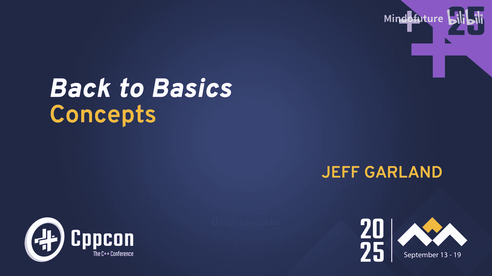
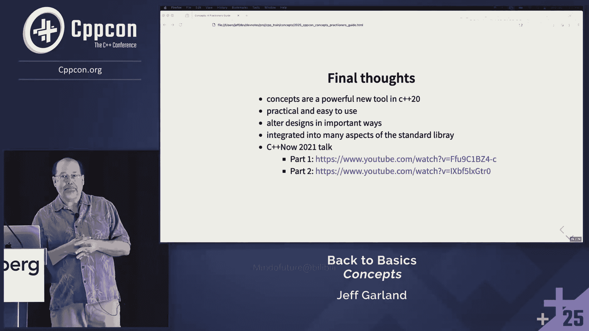
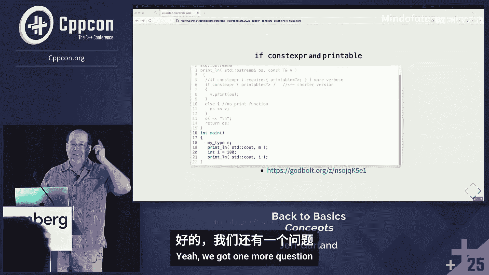

# 013：回归基础





## 概述

在本节课中，我们将学习 C++ 20 引入的核心特性——概念。我们将从基础开始，逐步深入，了解概念是什么、为什么需要它们、如何使用它们，以及它们如何改善代码设计、可读性和错误信息。课程将涵盖概念的基本语法、标准库中的概念、如何编写和组合概念，以及在实际设计中的应用。

## 什么是 C++ 概念？

C++ 概念是作用于类型或值的布尔谓词。在本课程中，我们主要关注类型。布尔谓词是指计算结果为真或假的东西。概念用于描述类型的“形状”，即类型必须支持的操作、方法或与其他类型的关系。

概念的一个关键点是其语义要求。自 STL 开始，语义要求就一直是概念的一部分，它们描述了类型应如何行为。然而，编译器无法检查语义要求，因此我们主要处理的是语法要求，但这本身已经非常强大。

## 概念与类型

理解概念和类型之间的区别至关重要。

*   **类型**：描述一组可以在运行时执行的操作。它具有内存布局和大小，可以被实例化（在栈或堆上分配）。
*   **概念**：描述类型的形状和用法，即可以在其上执行哪些操作。概念完全存在于编译时，没有运行时开销，也不会出现在链接器中。

## 核心语法与关键字

C++ 20 为概念引入了新的关键字：

*   `concept`：用于定义概念。
*   `requires`：用于编写要求表达式或子句。
*   `concept_name auto`：这是一种模式，允许你在原本需要具体类型的地方使用概念，编译器会在编译时用具体的类型来解析它。

概念是可组合的，你可以使用逻辑与、或等操作从简单的概念构建更复杂的概念。本质上，概念是一个布尔谓词，用于判断一个类型是否属于某个集合。

## 基本用法示例

让我们从一个最简单的概念开始。

```cpp
template<typename T>
concept Printable = requires(T v, std::ostream& os) {
    { v.print(os) };
};
```

这个 `Printable` 概念要求类型 `T` 必须有一个名为 `print` 的方法，该方法接受一个 `std::ostream&` 参数。如果表达式 `v.print(os)` 有效，则概念得到满足。

```cpp
class MyType {
public:
    void print(std::ostream& os) const { os << "MyType"; }
};
```

`MyType` 类满足 `Printable` 概念，因为它有 `print` 方法。

现在，我们可以检查一个类型是否满足概念：

```cpp
static_assert(Printable<MyType>); // 编译通过
static_assert(Printable<int>);    // 编译错误：int 没有 print 方法
```

这非常有用，例如，可以在大型代码库中强制要求所有领域类型都满足特定的序列化模式，无需运行单元测试即可在编译时发现问题。

## 使用概念约束代码

上一节我们介绍了概念的基本定义和检查。本节中我们来看看如何在函数、变量和模板中使用概念来约束类型。

### 1. 约束函数参数和返回值

这是概念最常见的用途之一。

```cpp
// 方式一：在函数签名中使用 `concept auto`
void f(Printable auto p) {
    p.print(std::cout);
}

// 方式二：在模板头中使用概念
template <Printable T>
void f_template(T p) {
    p.print(std::cout);
}
```

这两种方式是等价的。`f` 函数只接受满足 `Printable` 概念的类型。第二种方式更明确地表明了这是一个模板。

```cpp
// 约束返回值
Printable auto createPrintable() {
    return MyType{};
}
```

这个函数的返回值可以是任何满足 `Printable` 概念的类型，而不仅限于 `MyType`。这提供了灵活性，同时保证了返回类型的形状。

### 2. 初始化变量

你可以使用概念来约束变量的类型。

```cpp
// 错误：概念不是类型，无法直接用于变量声明
// Printable s;

// 正确：使用 `auto` 和概念来初始化变量
auto s = createPrintable(); // s 的类型被推导为 MyType，并且它满足 Printable
```

这里，`s` 的类型由 `createPrintable()` 的返回类型推导而来，但编译器会确保该返回类型满足 `Printable`。如果 `createPrintable` 的返回类型后来改变了，但只要新类型仍然满足 `Printable`，代码就仍然有效。

### 3. 重载决议

概念可以用于约束重载集，帮助编译器选择更合适的函数。

```cpp
// 一个接受任何类型的通用模板（无约束）
void printLine(auto p) {
    std::cout << p << std::endl;
}

// 一个专门处理 MyType 的重载
void printLine(const MyType& mt) {
    mt.print(std::cout);
    std::cout << std::endl;
}
```

当调用 `printLine(MyType{})` 时，更具体的 `MyType` 重载会被选中。

```cpp
// 一个受概念约束的重载
void printLine(Printable auto p) {
    p.print(std::cout);
    std::cout << std::endl;
}
```

现在，对于任何满足 `Printable` 的类型，编译器会优先选择这个受约束的模板，而不是顶部的通用模板，因为它更具体（受概念约束）。

### 4. 指针与智能指针

概念也可以用于约束指针类型。

```cpp
void process(const Printable auto* ptr) {
    if (ptr) ptr->print(std::cout);
}

void processUnique(std::unique_ptr<Printable auto> ptr) {
    if (ptr) ptr->print(std::cout);
}
```

`process` 函数只接受指向满足 `Printable` 类型的指针。`processUnique` 则约束 `std::unique_ptr` 管理的对象类型必须满足 `Printable`。

### 5. `if constexpr` 与 `requires` 子句

`if constexpr` 可以在编译时根据条件选择代码分支，常与概念或 `requires` 子句结合。

```cpp
void printLineSmart(auto p) {
    if constexpr (Printable<decltype(p)>) {
        // 如果 p 满足 Printable，编译此分支
        p.print(std::cout);
    } else if constexpr (requires { std::cout << p; }) {
        // 否则，如果 p 可以流输出，编译此分支
        // 这里使用了 `requires` 表达式，无需预先定义概念
        std::cout << p;
    } else {
        static_assert(false, “Type cannot be printed”);
    }
    std::cout << std::endl;
}
```

`requires` 表达式本身就是一个强大的工具，可以直接在布尔上下文中使用，无需先定义命名概念。

### 6. 约束成员函数

可以在成员函数后添加 `requires` 子句来约束其可用性。

```cpp
template <typename T>
class Wrapper {
    T value;
public:
    T& operator*() requires std::is_pointer_v<T> {
        return *value;
    }
    // ... 其他成员
};
```

这里，`operator*` 仅当 `T` 是指针类型时才存在。如果 `Wrapper<int>` 尝试调用 `operator*`，将会编译失败。

### 7. 类型别名与容器

可以使用概念创建受约束的模板别名。

```cpp
template <Printable T>
using PrintableVector = std::vector<T>;

PrintableVector<MyType> vec1; // 正确
PrintableVector<int> vec2;    // 编译错误：int 不满足 Printable
```

`PrintableVector` 是一个 `std::vector`，但其元素类型被约束为必须满足 `Printable`。

## 标准库中的概念

C++ 20 标准库提供了大量精心设计的概念，了解它们对编写现代 C++ 代码至关重要。以下是部分分组：

*   **数值概念**：如 `std::integral`, `std::floating_point`, `std::signed_integral` 等，用于约束数值类型。
*   **比较概念**：
    *   `std::equality_comparable<T>`：类型 `T` 可进行相等比较。
    *   `std::equality_comparable_with<T, U>`：类型 `T` 和 `U` 可相互进行相等比较。
*   **关系概念**：如 `std::totally_ordered`，用于约束可排序的类型。
*   **对象关系概念**：描述类型间的关系。
    *   `std::same_as<T, U>`：`T` 和 `U` 是同一类型。
    *   `std::convertible_to<T, U>`：`T` 可转换为 `U`。
    *   `std::assignable_from<T, U>`：可赋值。
*   **构造与初始化概念**：如 `std::constructible_from`, `std::default_initializable`。
*   **Regular/Semiregular**：非常重要的概念，源自 STL 设计。
    *   `std::semiregular`：类型可默认构造、拷贝构造、拷贝赋值、析构，并且不移动。
    *   `std::regular`：在 `semiregular` 基础上，还要求可进行相等比较（`equality_comparable`）。这描述了一个“行为良好”、可预测的类型。

使用 `static_assert` 可以方便地检查类型的规约性：

```cpp
struct MyStruct {
    int x;
    // 编译器会生成默认的构造、拷贝、移动、析构函数
    // 但需要自己定义或默认 `operator==`
    bool operator==(const MyStruct&) const = default;
};
static_assert(std::regular<MyStruct>); // 现在编译通过
```

*   **范围概念**：概念与范围库同时出现，范围库极大地依赖概念。例如 `std::ranges::range` 概念要求类型具有 `begin()` 和 `end()`。

```cpp
void printInts(std::ranges::range auto&& rng) {
    for (int i : rng) std::cout << i << ' ';
    std::cout << '\n';
}
// 可以用于 vector, array, list, span, iota_view 等任何范围
```

## 编写与组合概念

我们已经看到了许多使用概念的示例，现在来看看如何自己编写和组合概念。

### 定义概念

使用 `concept` 关键字和 `requires` 表达式定义概念。

```cpp
template<typename T>
concept OutputStreamable = requires(T v, std::ostream& os) {
    { os << v } -> std::same_as<std::ostream&>;
};
```

这个 `OutputStreamable` 概念要求类型 `T` 必须能使用 `<<` 运算符输出到 `std::ostream`，并且该运算符的返回类型必须是 `std::ostream&`（`->` 用于约束返回类型）。

### 组合概念

概念可以使用逻辑运算符进行组合。

```cpp
template <typename T>
concept PrintableAndMovable = Printable<T> && std::movable<T>;

template <typename T>
concept PrintableOrInt = Printable<T> || std::same_as<T, int>;
```

你也可以在 `requires` 子句中直接组合：

```cpp
template <typename T>
void func(T v) requires (Printable<T> || std::integral<T>) && std::movable<T> {
    // ...
}
```

标准库中的概念（如 `std::regular`）通常就是由许多更基础的概念组合而成的。

## 概念与设计

概念不仅仅是语法糖，它深刻地影响了软件设计，特别是依赖管理。

### 打破类型依赖

传统上，函数和类依赖于具体的类型。这导致了紧密的耦合：修改一个类型可能影响许多依赖它的组件。

概念允许你将依赖从具体类型提升到抽象概念。现在，组件依赖于“具有某种形状的类型”，而不是某个特定类型。这减少了耦合，提高了代码的灵活性和可复用性。

**权衡**：将依赖转移到概念意味着，如果概念发生变化（例如约束变严格或变宽松），所有依赖该概念的代码都需要重新编译。但这通常是你期望的：如果概念收紧，不满足新概念的类型应该被捕获；如果概念放松，更多类型可以被接受。

### 提升代码可读性与健壮性



考虑返回类型：


```cpp
// 1. 无约束 auto：完全依赖返回值，下游代码可能意外中断
auto getValue() { return someFunction(); }

// 2. 具体类型：如果 someFunction 返回类型改变（如 int -> long），这里会隐式转换，可能丢失精度或导致其他问题
int getValue() { return someFunction(); }

// 3. 受概念约束的 auto：清晰地表达了接口契约，如果 someFunction 返回类型改变但不再满足概念，编译会失败
TimeDuration auto getValue() { return someFunction(); }
```



使用受概念约束的 `auto` 在灵活性和安全性之间取得了良好的平衡。它使接口意图更清晰，并能在编译时捕获不匹配的契约。

## 总结

本节课中我们一起学习了 C++ 20 概念的基础知识和应用。

*   **概念是什么**：作用于类型的编译时布尔谓词，用于描述类型的形状和约束。
*   **核心优势**：提供更清晰的接口契约、更好的编译时错误信息、更灵活的泛型编程，并且没有运行时开销。
*   **基本用法**：用于约束函数参数、返回值、变量、重载、指针、`if constexpr` 分支以及模板特化。
*   **标准库概念**：熟悉 `std::regular`、`std::ranges::range` 等现有概念，避免重复造轮子。
*   **编写与组合**：可以使用 `concept` 和 `requires` 定义新概念，并通过逻辑运算符组合它们。
*   **设计影响**：概念有助于将依赖从具体类型转移到抽象接口，从而降低耦合、提高代码可读性和健壮性。


概念是一个强大的工具，一旦开始使用，就很难再回到没有它的时代。它使得编写清晰、安全、高效的泛型代码变得更加容易，是现代 C++ 编程不可或缺的一部分。