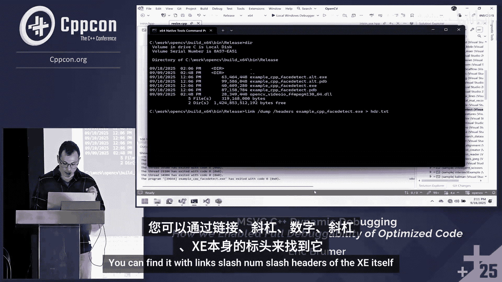
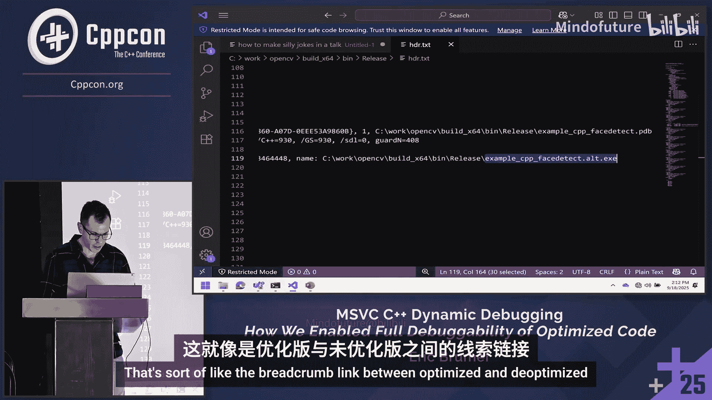
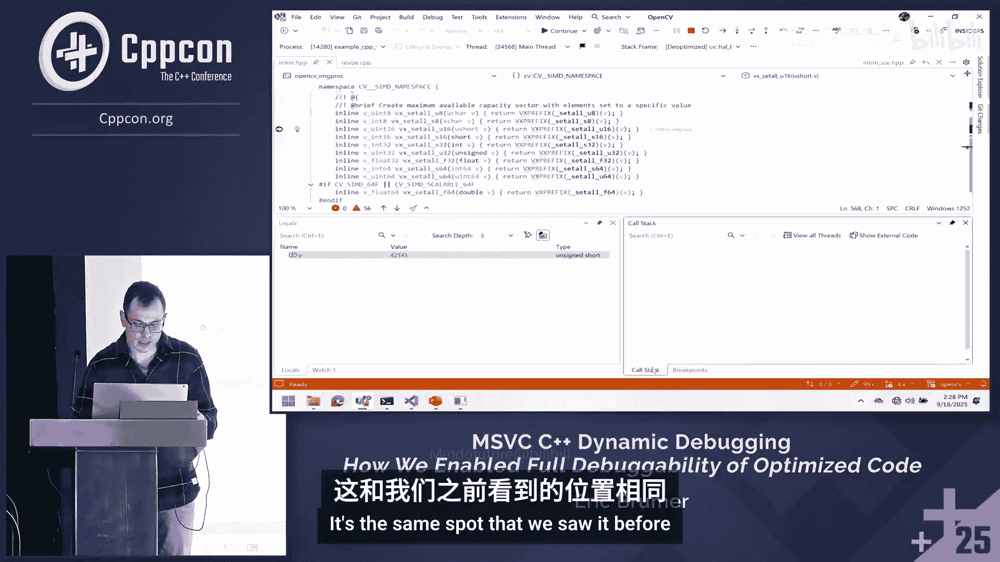

# 014：你的优化代码可以被调试——MSVC C++ 动态调试方法 🚀


在本节课中，我们将学习微软 Visual Studio 引入的一项新功能——C++ 动态调试。这项功能旨在解决调试优化代码时的常见痛点，让你既能享受优化带来的性能提升，又能获得与调试非优化代码一样的便利体验。

---

## 概述：优化与调试的矛盾

上一节我们介绍了优化代码调试的挑战。优化器的工作是让代码运行得更快，但这常常意味着它会移除变量、内联函数，甚至改变代码的执行顺序。这些优化使得调试器难以准确定位变量值和跟踪执行流程，导致出现“变量已被优化掉”或单步执行不符合预期等问题。

## 动态调试的核心原理

本节中我们来看看动态调试如何解决这个问题。其核心思想是：**构建两个版本的二进制文件**。

*   **优化版本**：这是实际运行的、完全优化的代码，保证了程序的执行速度。
*   **非优化版本**：这是一个隐藏的、关闭了优化的版本，保留了完整的调试信息。

当你设置断点时，调试器会“重定向”执行流。程序依然从优化版本启动并运行，但当你命中断点时，调试器会将执行切换到对应函数的非优化版本。这样，你就能在非优化代码中查看所有局部变量，并且单步执行会像在调试版本中一样直观。

以下是启用该功能的编译器开关：
```bash
/dynamicdebug
```

## 功能演示：从“痛苦”到“流畅”

让我们通过一个实际演示来感受动态调试带来的改变。

### 调试传统优化代码的困境

首先，我们运行一个完全优化的程序（未启用动态调试）。虽然程序运行速度很快，但调试体验不佳：

*   **变量查看失败**：尝试查看局部变量时，调试器显示“变量已被优化掉”。
*   **单步执行混乱**：使用“逐过程”时，执行箭头并不总是跳到下一行，有时会跳回之前的行，行为难以预测。
*   **无法进入函数**：尝试“逐语句”进入一个函数时，调试器可能直接跳过，因为该函数已被内联优化。
*   **断点设置失败**：在某些函数上设置断点时，Visual Studio 会显示空心红圈（警告图标），表示无法在此源位置绑定断点。



### 启用动态调试后的体验



现在，我们在项目设置中启用动态调试并重新构建。程序启动后，运行速度与完全优化版本无异。

*   **成功查看变量**：在命中断点的函数栈帧中，可以看到标记为“已反优化”。此时，所有局部变量和参数都可以正常查看和悬停预览。
*   **准确的单步执行**：“逐过程”会精确地移动到下一行代码。“逐语句”可以成功进入函数调用，进入的帧也会被反优化。
*   **可靠的断点**：可以在任何函数上设置断点，包括那些被内联或优化掉的函数。你甚至可以为不存在的参数设置条件断点（例如 `V % 2 == 1`），并且它能被正确触发。

当你结束调试（例如删除所有断点并继续执行）后，程序会自动切换回完全优化的代码路径，确保性能不受影响。

---

## 技术实现揭秘

了解了动态调试的便利性后，本节我们将深入幕后，看看它是如何实现的。主要涉及三个方面：双二进制链接、编译时管理和优化还原。

### 1. 双二进制链接机制

程序如何知道另一个二进制文件的存在？关键在于文件头中的链接。

*   **文件链接**：优化的可执行文件（如 `app.exe`）的文件头中包含一个特殊的调试目录项，其中直接存储了非优化版本文件（如 `app.alt.exe`）的路径和名称。调试器启动时就是通过这个“面包屑”找到备用二进制文件的。
*   **执行流切换**：当在优化函数上设置断点时，调试器会在内存中对该函数开头进行“热补丁”，将其修改为一段跳转代码，从而将执行流重定向到非优化二进制文件中的对应函数。
*   **执行流返回**：同样重要的是从非优化代码返回优化代码。在非优化版本中，函数调用指令的地址在磁盘上被预留为零。当调试器加载非优化二进制时，会将这些地址填充为优化二进制中对应函数的真实地址。这样，当非优化函数调用其他函数时，实际调用的是优化版本，保证了未调试部分的代码仍以全速运行。

### 2. 编译时管理：为何没有双倍时间？

构建两个二进制文件，编译时间却没有翻倍，这是如何做到的？秘诀在于**重用前端输出**和**并行处理**。

以下是简化的编译流程对比：

**传统优化编译流程：**
1.  前端处理 `a.cpp` -> 生成 `a.il`（中间语言）
2.  后端（优化器）处理 `a.il` -> 生成 `a.obj`（优化目标文件）
3.  链接器处理 `a.obj`, `b.obj`... -> 生成 `app.exe`（优化可执行文件）

**启用动态调试后的编译流程：**
1.  前端处理 `a.cpp` -> 生成 `a.il`（**仅此一次**）
2.  **并行执行**：
    *   后端（优化器）处理 `a.il` -> 生成 `a.obj`
    *   后端（非优化器）处理 `a.il` -> 生成 `a.alt.obj`
3.  **并行执行**：
    *   链接器处理 `*.obj` -> 生成 `app.exe`
    *   链接器处理 `*.alt.obj` -> 生成 `app.alt.exe`

由于整个构建过程中最耗时的通常是前端（解析、语义分析），而后端和链接步骤被并行化，因此总体编译时间增加有限。实测表明，对于中小型项目，完整构建时间增加约5%-15%，迭代构建（修改单个文件）时间增加约5%-20%。

### 3. 还原编译器优化：以内联为例

最神奇的部分之一是能够对已被内联优化掉的函数设置断点。这是如何实现的？

关键在于编译器记录了所有的**跨函数优化决策**，尤其是内联决策。当你在一个函数（如 `funcA`）上设置断点时，调试器不仅会反优化 `funcA` 本身（如果它还存在），还会找出所有内联了 `funcA` 代码的调用方函数（如 `funcB`, `funcC`），并将这些调用方也一并反优化。

这样，原本被内联展开的代码逻辑被“还原”为一个实际的函数调用，断点得以绑定并触发。所有相关的局部状态（参数、局部变量）也都在反优化后的上下文中被重建，因此你甚至可以为不存在的参数设置条件断点。

---



## 当前限制与使用方式

本节课我们一起学习了动态调试的原理与优势，最后了解一下它的当前适用范围和启用方法。

*   **平台限制**：目前仅支持 **Windows** 平台，使用 **MSVC** 编译器工具链。支持远程调试，但目标机器也需是 Windows 或 Xbox。
*   **架构与优化**：目前仅支持 **x64** 架构。需要基于 **/O2** 优化等级，但不支持链接时代码生成（LTCG，即 `/GL` 和 `/LTCG`）。
*   **启用方法**：
    *   **Visual Studio IDE**：在项目属性 -> 配置属性 -> C/C++ -> 常规 -> “启用 C++ 动态调试” 设置为“是”。
    *   **Unreal Engine 5.6+**：在构建配置文件中设置 `bDynamicDebugging = true`。

## 总结


本节课中我们一起学习了 MSVC C++ 动态调试功能。它通过智能地构建和切换优化/非优化双版本二进制文件，巧妙地平衡了代码运行效率与调试体验。你无需再在代码中插入 `#pragma optimize(off)` 或费力阅读汇编代码来推断变量值。现在，你可以始终以发布模式的速度进行开发和调试，在需要洞察代码细节时，获得与调试版本无异的流畅体验。如果你经常需要调试优化代码，强烈建议尝试这一功能。🔧