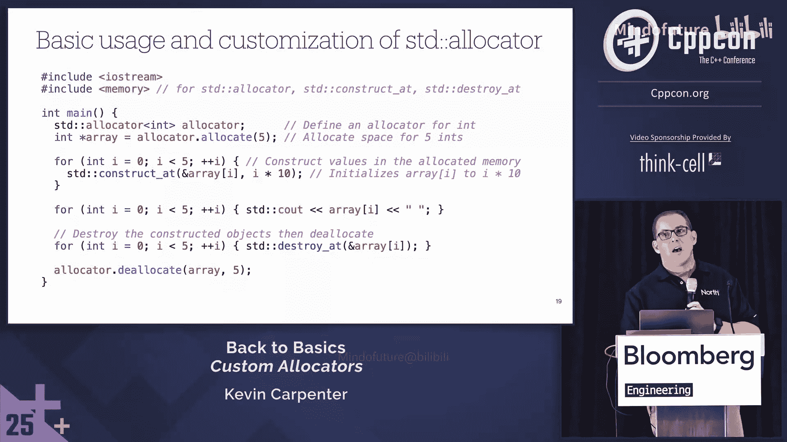

# 015：从基础到高级


## 概述

在本教程中，我们将学习 C++ 中自定义内存分配器的概念、原理和实现。我们将从默认内存管理的问题出发，理解标准库分配器模型，并探讨两种流行的自定义分配器设计模式：池分配器和栈分配器。最后，我们将动手构建一个用于跟踪内存分配的实用分配器。通过本教程，初学者将能够掌握自定义分配器的基本知识及其应用场景。

---

## 为什么需要自定义分配器？默认内存管理的问题

在深入自定义分配器之前，我们首先需要了解 C++ 默认内存管理机制（如 `new` 和 `delete`）存在哪些问题。

### 性能开销

使用 `new` 进行内存分配可能涉及高昂的成本。一次简单的 `new` 操作背后，可能发生以下步骤：

1.  调用 `malloc`。
2.  `malloc` 若自身内存不足，则执行上下文切换到内核。
3.  内核通过 `mmap` 或 `brk`/`sbrk` 系统调用分配内存。
4.  执行上下文切换回用户空间。
5.  在分配的内存上构造对象。

这个过程可能非常耗时，尤其是频繁进行小内存分配时。

```cpp
int* p = new int(42); // 看似简单，背后可能很复杂
```

### 内存碎片与缓存局部性

频繁的随机内存分配和释放会导致**内存碎片**。碎片化内存不仅降低了内存利用率，还会破坏**CPU缓存局部性**。

当CPU需要访问数据时，它首先检查高速缓存（L1、L2）。如果数据不在缓存中（缓存未命中），就需要访问更慢的主内存。如果程序中的对象因为内存碎片而分散在内存的不同区域，CPU就需要频繁地在不同内存地址间跳转，导致更多的缓存未命中，从而显著降低程序性能。

---

## 理解标准库分配器模型

上一节我们介绍了默认内存管理的弊端，本节中我们来看看C++标准库提供的解决方案之一：分配器。

### 标准分配器简介

C++标准模板库（STL）中的所有容器都使用一个名为 `std::allocator` 的模板参数来管理内存。虽然我们通常不显式指定它，但它确实存在。

```cpp
std::vector<int> vec1; // 默认使用 std::allocator<int>
std::vector<int, MyCustomAllocator<int>> vec2; // 使用自定义分配器
```

`std::allocator` 最初是为了解决早期系统（如DOS）中“近内存”和“远内存”的访问问题而设计的。如今，它提供了标准化的内存控制接口。

### 分配器的核心职责

分配器的核心工作是管理**原始内存**，而非对象生命周期。它将内存分配与对象构造分离开来：

*   **分配/释放内存**：提供连续的原始内存块。
*   **构造/析构对象**：在已分配的内存上构造对象，或析构对象以释放资源（但内存本身可能仍由分配器管理）。

标准库容器负责调用分配器的这些方法。C++11之后，`std::allocator_traits` 这个辅助类简化了分配器的实现，它为分配器提供了合理的默认实现，我们通常只需实现 `allocate` 和 `deallocate`。

### 分配器的基本用法

以下是使用标准分配器进行手动内存管理的示例：

```cpp
#include <memory>
#include <iostream>

int main() {
    std::allocator<int> alloc;

    // 1. 分配原始内存（可容纳5个int）
    int* p = alloc.allocate(5);

    // 2. 在内存上构造对象
    for (int i = 0; i < 5; ++i) {
        alloc.construct(p + i, i * 10); // 在地址 p+i 处构造 int，值为 i*10
    }

    // 3. 使用对象
    for (int i = 0; i < 5; ++i) {
        std::cout << p[i] << ' ';
    }
    std::cout << '\n';

    // 4. 析构对象
    for (int i = 0; i < 5; ++i) {
        alloc.destroy(p + i);
    }

    // 5. 释放内存
    alloc.deallocate(p, 5);

    return 0;
}
```

**关键点**：`allocate`/`deallocate` 处理内存，`construct`/`destroy` 处理对象。自定义分配器可以优化前一步（内存管理），而后一步通常交给容器或 `allocator_traits`。

---

## 常见自定义分配器设计模式

理解了标准分配器模型后，我们可以探索两种高效的自定义分配器模式：池分配器和栈分配器。它们分别适用于不同的场景。

### 池分配器

池分配器适用于频繁创建和销毁**大量相同尺寸对象**的场景，例如游戏中的子弹、敌人，或网络应用中的事务对象。

#### 工作原理

1.  **预先分配**：启动时一次性分配一大块内存，并将其分割成多个固定大小的“块”（每个块大小等于对象大小）。
2.  **空闲列表**：使用一个嵌入式链表（“空闲列表”）来跟踪所有未被使用的内存块。每个空闲块的开头存储下一个空闲块的地址。
3.  **快速分配**：当请求分配时，从空闲列表头部取出一个块，将头部指针指向下一个空闲块，然后返回该块地址。这几乎是**O(1)**的操作。
4.  **快速释放**：当释放内存时，将对应的块插回空闲列表的头部。释放顺序无需与分配顺序一致。

#### 伪代码概念

```cpp
class PoolAllocator {
    struct FreeNode {
        FreeNode* next;
    };
    FreeNode* free_list_head;
    char* memory_pool;
    size_t pool_size;
    size_t object_size;

public:
    void* allocate() {
        if (free_list_head == nullptr) throw std::bad_alloc();
        void* block = free_list_head;
        free_list_head = free_list_head->next; // 移动头指针
        return block;
    }

    void deallocate(void* ptr) {
        FreeNode* node = static_cast<FreeNode*>(ptr);
        node->next = free_list_head; // 将块插回链表头部
        free_list_head = node;
    }
};
```

#### 优点与缺点

*   **优点**：
    *   **极快的分配/释放速度**（几乎只是指针操作）。
    *   **完全避免内存碎片**，因为所有块大小相同。
    *   **良好的缓存局部性**，同类型对象在内存中可能连续存储。
*   **缺点**：
    *   只适用于**单一固定大小**的对象。
    *   需要**预先确定**可能的最大对象数量，否则需要实现更复杂的多池或扩展机制。

### 栈（单调缓冲区）分配器

栈分配器模拟了程序栈的内存管理方式，适用于**生命周期嵌套**或**短暂存在**的数据，例如游戏中的单帧数据、临时计算缓冲区。

#### 工作原理

1.  **预先分配**：一次性分配一大块内存。
2.  **指针偏移**：维护一个指向当前空闲内存起始位置的偏移指针（`offset`）。
3.  **顺序分配**：每次分配请求都从当前偏移指针处取出所需大小的内存，然后将偏移指针向后移动相应字节。分配是连续的。
4.  **作用域释放**：通常不支持释放单个对象。相反，你可以设置“标记”（`checkpoint`）。释放时，只能将偏移指针回退到之前设置的某个标记处，从而一次性释放从那之后分配的所有内存。

#### 伪代码概念

```cpp
class StackAllocator {
    char* memory_start;
    size_t total_size;
    size_t current_offset;

public:
    void* allocate(size_t size, size_t alignment) {
        // 计算对齐后的地址
        void* aligned_ptr = align_forward(memory_start + current_offset, alignment);
        // 计算新的偏移量
        size_t new_offset = (static_cast<char*>(aligned_ptr) - memory_start) + size;

        if (new_offset > total_size) throw std::bad_alloc();

        current_offset = new_offset;
        return aligned_ptr;
    }

    // 通常不提供单个对象的deallocate
    void deallocate_to_marker(size_t marker) {
        current_offset = marker; // 将指针回退到标记处
    }

    size_t get_marker() const { return current_offset; }
};
```

#### 优点与缺点

*   **优点**：
    *   **可能的最快分配速度**（仅增加一个偏移量）。
    *   **无内存碎片**。
    *   **支持不同大小的对象**。
*   **缺点**：
    *   **释放不灵活**，必须按分配的逆序进行（后进先出）。
    *   不适合对象生命周期不可预测或交错的场景。

#### 两种分配器对比总结

| 特性 | 池分配器 | 栈分配器 |
| :--- | :--- | :--- |
| **分配速度** | 极快 (O(1)) | 最快 (移动指针) |
| **释放速度** | 极快 (O(1))，可单独释放 | 快，但只能作用域释放 |
| **灵活性** | 固定对象大小 | 任意对象大小 |
| **适用场景** | 同类型对象频繁创建销毁（如游戏实体、连接） | 临时数据、单帧内存、作用域内存 |

---

## 实战：构建一个跟踪分配器

学习了理论之后，让我们动手实现一个简单但实用的自定义分配器：**跟踪分配器**。它的功能是包装标准分配器，并记录所有内存分配和释放操作，用于调试和性能分析。

以下是实现步骤：

1.  **定义分配器类模板**：它需要满足标准分配器的接口要求。
2.  **使用 `std::allocator` 作为底层分配器**：我们将委托它进行实际的内存操作。
3.  **添加跟踪逻辑**：在 `allocate` 和 `deallocate` 函数中打印日志。
4.  **提供必要的类型定义和构造函数**：包括拷贝构造函数和比较运算符，这是标准容器对分配器的要求。

```cpp
#include <iostream>
#include <memory>
#include <vector>

template <typename T>
class TrackingAllocator {
public:
    // 分配器必须提供的类型定义
    using value_type = T;

    // 构造函数
    TrackingAllocator() = default;
    template <typename U>
    TrackingAllocator(const TrackingAllocator<U>&) noexcept {}

    // 分配内存并跟踪
    T* allocate(std::size_t n) {
        std::size_t total_bytes = n * sizeof(T);
        std::cout << "[Allocate]   " << n << " objects of size " << sizeof(T)
                  << " (" << total_bytes << " bytes total)\n";

        // 委托给标准分配器进行实际分配
        return std::allocator<T>{}.allocate(n);
    }

    // 释放内存并跟踪
    void deallocate(T* p, std::size_t n) {
        std::size_t total_bytes = n * sizeof(T);
        std::cout << "[Deallocate] " << n << " objects of size " << sizeof(T)
                  << " (" << total_bytes << " bytes total)\n";

        // 委托给标准分配器进行实际释放
        std::allocator<T>{}.deallocate(p, n);
    }
};

// 分配器需要支持比较操作
template <typename T, typename U>
bool operator==(const TrackingAllocator<T>&, const TrackingAllocator<U>&) {
    return true; // 我们的跟踪分配器是无状态的，所以总是相等
}

template <typename T, typename U>
bool operator!=(const TrackingAllocator<T>& a, const TrackingAllocator<U>& b) {
    return !(a == b);
}

int main() {
    // 使用我们的跟踪分配器创建一个vector
    std::vector<int, TrackingAllocator<int>> vec;

    std::cout << "Pushing back elements...\n";
    vec.push_back(1); // 可能分配
    vec.push_back(2); // 可能重新分配并释放旧内存
    vec.push_back(3); // 可能再次重新分配并释放旧内存
    vec.push_back(4);
    vec.push_back(5);

    std::cout << "\nVector contents: ";
    for (auto i : vec) std::cout << i << ' ';
    std::cout << '\n';

    std::cout << "\nGoing out of scope...\n";
    // main函数结束时，vector析构，会释放所有内存
    return 0;
}
```

**运行此程序，你可能会看到类似以下输出：**

```
Pushing back elements...
[Allocate]   1 objects of size 4 (4 bytes total)
[Allocate]   2 objects of size 4 (8 bytes total)
[Deallocate] 1 objects of size 4 (4 bytes total)
[Allocate]   4 objects of size 4 (16 bytes total)
[Deallocate] 2 objects of size 4 (8 bytes total)
... (后续push_back可能触发更多分配/释放)

Vector contents: 1 2 3 4 5



Going out of scope...
[Deallocate] 8 objects of size 4 (32 bytes total) // 最终释放
```

这个输出清晰地展示了 `std::vector` 在增长过程中（通常以2的幂次扩容）是如何进行内存重新分配和拷贝的。这个简单的跟踪分配器是理解和调试容器内存行为的强大工具。

---


## 总结与建议


在本教程中，我们一起学习了C++自定义分配器的核心知识：

1.  **动机**：我们了解了默认 `new`/`delete` 在性能和内存布局上的潜在问题。
2.  **基础**：我们学习了标准库分配器模型，明确了分配器负责管理原始内存，而对象构造/析构由容器负责。
3.  **模式**：我们探讨了两种高效的自定义分配器设计模式：
    *   **池分配器**：用于固定大小、频繁创建销毁的对象，提供O(1)的分配/释放。
    *   **栈分配器**：用于临时、生命周期嵌套的数据，提供最快的顺序分配和批量释放。
4.  **实践**：我们实现了一个**跟踪分配器**，演示了如何将自定义分配器与STL容器结合，并用于观察内存行为。

### 给初学者的建议

*   **优先使用现代C++和标准库**：在大多数情况下，`std::vector`、`std::unique_ptr`、`std::make_shared` 等工具已经足够高效和安全。遵循“80/20法则”，用20%的精力获得80%的收益。
*   **不要过早优化**：除非性能分析（Profiling）明确表明内存管理是瓶颈，否则应避免引入复杂的自定义分配器，因为它们会增加代码复杂性和出错风险。
*   **理解原理，善用工具**：即使不自己实现，理解这些模式也有助于你更好地使用像 `std::pmr::monotonic_buffer_resource`（栈分配器）和 `std::pmr::unsynchronized_pool_resource`（池分配器）这样的C++17标准库内存资源工具。
*   **谨慎行事**：如果必须实现自定义分配器，务必进行充分测试，特别是对于对齐（Alignment）、边界检查和重复释放等常见问题。记住：“测量两次，切割一次”（Measure twice, cut once）。

通过掌握这些基础知识，你已具备了在必要时深入优化C++程序内存管理的能力。记住，强大的能力也意味着重大的责任。