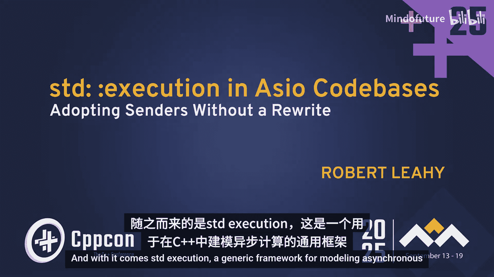
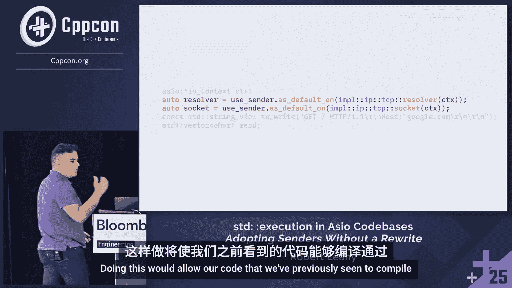
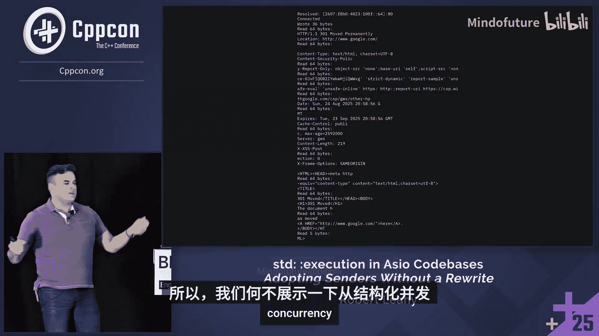
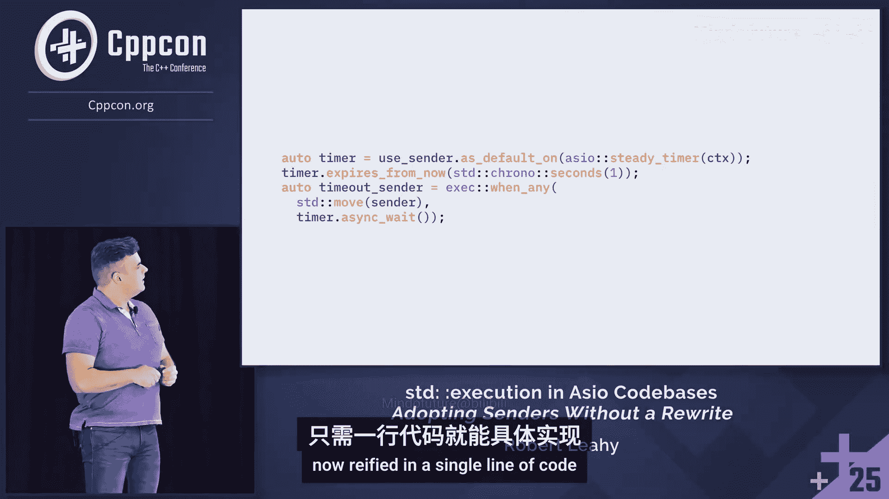

# 016：在Asio代码库中采用stdexecution



## 概述

在本节课中，我们将探讨如何将C++26标准中的新异步框架`stdexecution`（发送者/接收者模型）与已存在二十多年的行业标准库Asio进行集成。我们将学习如何在不重写现有Asio代码的前提下，利用`stdexecution`的结构化并发优势，实现两个生态系统的无缝协作。

---

## 同步函数调用模型回顾

上一节我们概述了课程目标，本节中我们来看看异步编程的基础——同步函数调用模型。

一个函数本身只是一组潜在的指令集合。为了执行工作，它需要与一个调用点结合。调用点将向前推进的能力委托给函数。

同步函数还需要一个执行工作的空间，即一个栈帧，用于存储所有具有自动存储期的变量。

从调用点的角度看，栈帧的分配和跳转到函数是原子性的。函数运行至完成，并通过调用点返回结果，完成整个循环。

以下是同步函数的一个例子，它演示了如何将多次部分读取拼接成一次完整的读取：

```cpp
size_t read_fully(int fd, void* buffer, size_t total) {
    char* ptr = static_cast<char*>(buffer);
    size_t remaining = total;
    while (remaining > 0) {
        ssize_t n = read(fd, ptr, remaining);
        if (n <= 0) {
            // 处理错误或EOF
            break;
        }
        ptr += n;
        remaining -= n;
    }
    return total - remaining;
}
```

在这个函数中，参数`buffer`被具体化为一个具有自动存储期的变量`ptr`。我们可以在函数的剩余部分自由使用和修改它，而无需担心其生命周期。

---

## Asio异步模型

上一节我们回顾了同步模型，本节中我们来看看Asio的异步模型。

Asio模型的核心是一个**发起函数**。它是一个具有特殊属性的常规同步函数：在成功完成后，会有一个异步操作在后台挂起。

这意味着操作可以在同步发起函数返回后完成。因此，仅选择一个调用点是不够的。我们需要将发起函数与一个**完成处理器**（一个可调用对象）结合起来，该处理器可以调用并传递操作合成的所有值。

当这两者结合时，就产生了一个异步操作。操作完成后，会调用完成处理器。

与同步模型不同，Asio模型本身并不内在地提供稳定的本地存储。在同步函数中，栈帧的分配是隐藏的。但在Asio中，这种稳定的存储并不存在。

以下是一个Asio函数示例，它实现了与之前同步函数相同的功能：

```cpp
template <typename CompletionToken>
auto async_read_fully(tcp::socket& sock, void* buffer, size_t total, CompletionToken&& token) {
    // 为了简化，这里省略了实际的异步循环逻辑
    // 关键点在于，lambda需要捕获`buffer`和`total`，并在后续操作中被移动。
    auto initiation = [&sock, buffer, total](auto&& handler) {
        // Asio操作会移动这个lambda，其内部状态（如指向buffer的指针）是不稳定的。
        // 需要小心管理生命周期。
        // ...
    };
    return async_initiate<CompletionToken, void(error_code, size_t)>(
        initiation, token, std::ref(sock), buffer, total
    );
}
```

在这个代码中，lambda捕获了`sock`、`buffer`和`total`。这个lambda会被移动到后续的异步操作中，其内存地址并不稳定，因为Asio缺乏同步函数所具有的稳定栈帧特性。

---

## stdexecution 发送者/接收者模型

上一节我们介绍了Asio模型，本节中我们来看看C++26的`stdexecution`模型。

`stdexecution`模型的核心是一个**发送者**，它是完全柯里化的异步函数类比。就像一个函数一样，它自身没有动力，直到它与报告其完成的上下文——一个**接收者**——结合。因此，这个模型常被称为“发送者与接收者”。

一个发送者和一个接收者连接后，该操作的输出是一个**操作状态**。这是同步栈帧的异步类比，是操作在其整个生命周期中可以依赖的、稳定的本地存储。

关键的是，与同步领域不同，我们可以独立地观察此存储的分配。当我们调用`connect`并返回一个操作状态时，我们没有义务立即开始推进其所代表的异步操作。相反，我们可以将其推迟任意时间。但一旦我们在操作状态上调用`start`，就会产生一个异步操作。它运行至完成，并向接收者发送一个完成信号。

同样，我们可以查看一个使用发送者/接收者模型实现的`read`操作示例：

```cpp
auto async_read_fully_sender(tcp::socket& sock, void* buffer, size_t total) {
    return stdexec::let_value(
        stdexec::just(std::span<char>(static_cast<char*>(buffer), total)),
        [&sock, total](std::span<char> span) {
            // 使用 `let_value` 在操作状态中分配一个 `span`。
            // 这个引用在异步操作的剩余时间内保证有效。
            size_t remaining = total;
            // ... 异步循环逻辑
            return stdexec::just(remaining); // 简化返回
        }
    );
}
```

在这里，我们使用`let_value`在操作状态内部分配了一个`span`。这个引用在异步操作的剩余时间内保证有效，因此我们可以放心地使用它，其方式不仅类似于同步领域，而且在词法上完全相同。

---

## 整合两大生态系统

上一节我们分别了解了Asio和`stdexecution`的模型，本节中我们来探讨如何将它们整合在一起。

回顾课程开头的例子，我们是从`stdexecution`代码中调用Asio操作。因此，也许我们应该从`stdexecution`模型开始：一个发送者、一个接收者和一个操作状态，但它们具有特殊的结构。

当我们在操作状态上调用`start`时，它会合成一个完成处理器，并将其传递给一个Asio发起函数。根据我们对Asio模型的理解，结果是一个异步操作。该操作完成并调用完成处理器。但我们选择了这个完成处理器，我们合成了它，因此我们当然可以将其实现为向接收者发送完成信号。

让我们尝试用代码来实现这个想法。首先，我们编写一个工厂函数，它创建一个Asio发送者，并接受一个“发起函数”——一个只等待选择完成处理器的单元可调用对象。

根据我之前所说的“发送者是同步函数的完全柯里化版本”，我们只需将参数柯里化到一个发送者中并返回它。

这引出了一个根本问题：那个发送者内部到底是什么？让我们深入查看。

```cpp
template <typename Initiation>
auto make_async_sender(Initiation initiation) {
    // 发送者类型
    struct asio_sender {
        using is_sender = void; // 选择加入stdexec概念机制
        Initiation init; // 数据成员，存储柯里化的发起函数

        template <typename Receiver>
        auto connect(Receiver&& rcvr) && {
            // 连接操作，返回操作状态
            struct operation_state {
                using is_operation_state = void;
                Initiation init;
                std::decay_t<Receiver> rcvr;
                void start() & noexcept {
                    // 调用发起函数，并传递我们合成的完成处理器
                    std::move(init)([this](auto&&... args) {
                        // 完成处理器：将底层Asio操作合成的值完美转发给接收者
                        stdexec::set_value(std::move(rcvr), std::forward<decltype(args)>(args)...);
                    });
                }
            };
            return operation_state{std::move(init), std::forward<Receiver>(rcvr)};
        }
    };
    return asio_sender{std::move(initiation)};
}
```

这个发送者通过提供必要的嵌套类型别名来选择加入`stdexecution`的概念机制。它有一个用于存储发起函数的数据成员。它的`connect`方法接收一个接收者，并将发起函数和接收者一起放入一个操作状态中返回。

操作状态通过一个必要的嵌套类型别名选择加入成为操作状态。它现在有两个数据成员。然后，它拥有操作状态的基本操作：`start`。`start`会调用发起函数，并向其提供我们合成的完成处理器。这个完成处理器获取底层Asio操作合成的所有值，并将它们通过值通道完美转发给接收者，从而完成操作。

---

## 处理异常与完成签名

上一节我们初步整合了两个模型，但代码存在一个问题：`start`函数被标记为`noexcept`，但我们泛型接受的`initiation`可能抛出异常。这会导致程序终止，显然不符合人机工程学。

解决方案不是简单地移除`noexcept`。`start`是从同步领域过渡到异步领域的点，同步报告机制（如抛出异常）变得不可用。`start`的实现必须只使用异步报告机制，例如捕获自身的异常并将其导向接收者的错误通道。

但这又带来了新问题：我们的包装器原本有一个很好的属性——它完成的方式与底层Asio操作完全相同。现在，我们添加了一种新的完成方式（通过异步的“抛出异常”模拟）。我们如何通用地向用户记录和公开这一点？

在同步领域，函数有签名。我们可以查看它，了解返回的值（如果有），并根据是否标注`noexcept`来判断它们是否有错误通道。作为一个通用生态系统，`stdexecution`对此有解决方案：通过实例化`stdexec::completion_signatures`来记录操作完成的方式。

```cpp
// 示例：记录操作可以成功完成（传递一个int），或通过发送exception_ptr错误完成
using my_sigs = stdexec::completion_signatures<
    stdexec::set_value_t(int),
    stdexec::set_error_t(std::exception_ptr)
>;
```

但是，仅仅特化一个类模板并不能解决问题。我们实际上需要的是关联。因此，我们发现还没有完全探索发送者的接口表面，因为发送者还需要通过提供`get_completion_signatures`这个consteval静态成员函数来记录它们可以完成的方式，其返回类型记录了相应操作将如何完成。

然而，这里我们还没有令人满意地回答问题。我们需要发现底层Asio操作完成的方式，然后加上`set_error`（带`exception_ptr`）。这引出了一个问题：我们如何通用地发现底层Asio操作的完成方式？

答案在于Asio的**完成令牌**机制。

---

## Asio 完成令牌机制

上一节我们遇到了如何发现Asio操作签名的问题，本节中我们引入Asio的完成令牌机制。

之前我们看到的Asio发起函数并不是一个符合惯例的Asio发起函数，因为它直接接受一个完成处理器。为了使它符合惯例，我们需要进行一项更改：重写函数签名，使其接受一个**完成令牌**，而不是直接接受完成处理器。

但仅此转换本身并没有给我们带来什么。关键在于，添加一层间接性是不够的，如果你不实际通过定制点进行解析。在这种情况下，定制点是`async_initiate`。

`async_initiate`接收启动操作的逻辑（作为一个lambda）。它可以决定在何时、何地以及如何调用该lambda，从而决定异步操作在何时、何地以及如何开始。更重要的是，完成处理器的声明也来自`async_initiate`的实现。定制点的另一方不仅可以决定操作如何开始，还可以决定它如何完成。

此外，我们还以另一种方式定制了发起函数：我们定制了它的返回值，并允许`async_initiate`也选择该值。我们不再局限于返回`void`。

最后，通过这种转换，我们迫使发起函数的作者通用地记录其操作可以完成的所有方式。

因此，我们需要重新制定我们对如何适配Asio和`stdexecution`的理解，以考虑使用这些允许我们完全定制Asio操作的完成令牌。

我们更新对Asio生态系统的理解图：发起函数不接受完成处理器，而是接受完成令牌。完成令牌能够定制发起函数的每个元素。

我们可以想象，也许我们建议的完成令牌会如此彻底地定制发起函数，以至于诱导其返回一个发送者。如果它这样做，我们当然可以免费获得`stdexecution`生态系统的其余部分。

---

## 实现自定义完成令牌

上一节我们引入了完成令牌的概念，本节中我们来看看如何实现一个能返回发送者的自定义完成令牌。

首先，我们声明一个完成令牌类型及其一个实例以便使用。

```cpp
struct asio_sender_token {
    // 标记类型，用于特化
};
inline constexpr asio_sender_token use_asio_sender{};
```

但正如之前所说，如果我们不实际在另一侧提供实现，这没有任何意义。因此，我们特化`async_result`来提供我们的实现。

```cpp
// 为我们的令牌特化 async_result
template <typename Initiation, typename... Args>
struct async_result<asio_sender_token, Initiation(Args...)> {
    // 关键：我们接收所有签名，通用地记录此Asio操作完成的所有方式。
    // 为简化，假设我们知道签名。实际中需要从Initiation推导。
    using completion_signatures = stdexec::completion_signatures<
        stdexec::set_value_t(std::size_t), // 示例：成功时返回读取的字节数
        stdexec::set_error_t(std::error_code), // Asio错误码
        stdexec::set_error_t(std::exception_ptr), // 我们添加的异常通道
        stdexec::set_stopped_t() // 我们稍后添加的停止信号
    >;

    template <typename Initiation2, typename... Args2>
    static auto initiate(Initiation2&& initiation, asio_sender_token, Args2&&... args) {
        // 将发起函数柯里化为一个单元可调用对象
        auto f = [initiation = std::forward<Initiation2>(initiation), ...args = std::forward<Args2>(args)] (auto&& handler) mutable {
            std::forward<Initiation2>(initiation)(std::forward<decltype(handler)>(handler), std::move(args)...);
        };
        // 将参数柯里化为一个发送者，并转换Asio签名为stdexecution期望的形式
        return make_async_sender(std::move(f));
    }
};
```

在静态成员函数`initiate`中，我们接收发起函数、完成令牌实例以及需要柯里化到发起函数中的参数。我们忠实地执行这个柯里化，将发起函数构造成一个只等待选择完成处理器的单元可调用对象`f`。

然后，我们再次将参数柯里化为一个发送者，但该发送者通过将Asio签名转换为`stdexecution`期望的形式而得到丰富。我们提供了之前缺失的重要上下文。

这引发了一系列问题。我们需要修改大量代码才能使其工作，例如提供必要的模板元编程来转换这些签名。

签名转换的基本思想是将Asio的完成签名（例如`void(std::error_code, size_t)`）转换为`stdexecution`的完成签名（例如`stdexec::set_value_t(size_t)`和`stdexec::set_error_t(std::error_code)`）。此外，我们还需要附加`stdexec::set_error_t(std::exception_ptr)`，因为我们用异步的“抛出异常”丰富了该集合。

现在，我们需要遍历代码并用这种理解更新它。我们需要在发送者上提供`get_completion_signatures`，但也需要提供其受约束的版本。回想一下`connect`，我们需要将发起函数从发送者传播到操作状态。在某些C++引用限定符下，这可能是不可能的。例如，如果我们有一个仅可移动的发起函数，但有人尝试左值连接我们的发送者（这需要我们复制发起函数），这显然是不可能的。因此，我们在此场景中检测到这种情况，并拒绝在此实例中生成完成签名。

继续这样，我们转到`connect`，它仍然接受接收者并将数据移动到操作状态，但现在被约束为要求提供的接收者能够接受我们发出的所有完成签名。

这里需要注意一些微妙之处：我通过委托给`stdexec::completion_signatures_of_t`来确定我们发出的完成签名。这反过来会尝试评估我在前一页幻灯片上展示的函数，从而传递性地引入其上的所有约束。

操作状态则不受此转换的干扰。

---

## 结构化并发与异常处理

上一节我们处理了完成签名，但还有一个更根本的问题：Asio的异步模型是**非结构化并发**，而`stdexecution`带来了**结构化并发**。

在Asio中，你可以启动一个操作，然后直接离开（例如停止调用`io_context::run()`），操作可能被永远放弃。这在Asio应用程序中是常见且有效的优雅关闭方式。

然而，结构化并发要求：当你启动一个异步操作时，该操作必须在某个时刻向你报告完成。这就像结构化编程中，你不会期望调用一个函数会导致执行跳转到某个不相关的部分并永不返回。

因此，我们现在需要弄清楚如何在这种非结构化原语之上分层实现结构化并发的保证。

让我们考虑一个简单的例子：直接从`main`启动一个异步操作并驱动其完成。我们调用发起函数（一个常规同步函数）。如果成功，它会返回，并且有一个异步操作在后台挂起。

但这个“挂起”到底意味着什么？谁将运行它？我们需要做什么来诱导它完成？

在大多数Asio应用程序中，答案是：我们需要去执行上下文，并将向前推进的能力委托给它。我们需要在其上调用`run()`。在内部，`run()`有特殊的结构，它等待异步部分准备好执行并执行它们。

因此，是`run()`调用了我们的完成处理器。当从完成处理器抛出异常时，它被抛给`run()`，并由`run()`根据该执行上下文和执行器提供的任何策略进行处理。它可能只是不再运行该操作，也可能做其他事情。

不幸的是，这种表述与`stdexecution`的要求不符。结构化并发要求操作必须报告完成。

解决方案是注入我们自己的逻辑。我们可以在完成处理器周围包装我们自己的lambda。这样，我们就可以以我们想要的任何方式处理由此抛出的任何异常。我们可以将它们导向接收者，通过错误通道发送。

事实上，我们可以说我们正在实现一个执行器，而这是我们处理异常的、执行器指定的方式，它满足结构化并发的保证。

---

## 实现包装执行器

上一节我们提出了注入包装逻辑的想法，本节中我们来实现一个P0443风格的单向执行器。

我们的执行器有两个成员：一个指回操作状态的引用（因为接收者在那里），以及一个对底层执行器的包装（因为我们不想定制所有异步部分的执行方式，只想定制异常处理这一特定方式）。

P0443风格执行器必须是可比较的，因此我们提供`operator==`。

执行器的基本操作是单向成员函数`execute`，它接收一个单元可调用对象并以某种方式调用它——根据该执行器体现的任何策略调用它。

最简单的实现是简单地委托给我们包装的执行器。但我们需要保证调用内部执行器的`execute`不会抛出异常。我们这样做的全部原因是为了捕获异常并将其导向接收者的错误通道。因此，我们正是这样做的。

但随后我们意识到另一件事：我们底层的执行器体现了它体现的任何执行策略。我们对此一无所知。也许该策略是将工作放在队列上，稍后出列并在不在我们调用堆栈下的某个地方调用它。在这种情况下，这个`catch`将无法捕获由此抛出的异常。因此，仅在外面包装是不够的，我们还必须侵入`execute`内部并在那里也进行包装。

当然，这不足以填满P0443风格单向执行器所需的接口，但这不是本次演讲的重点。

现在，我们需要关心我们刚刚编写的这个类如何被注入到Asio生态系统中。我们如何告诉Asio需要使用这个来调用我们操作的异步部分，而不是它本来要选择的任何其他执行器？

答案是：我们需要编写一个**关联器**。我们需要将我们的完成处理器与一个获取执行器的策略关联起来，以便我们可以在每个分析级别定制它。

之前，当我们特化`async_result`以提供`async_initiate`的实现时，我们看到了类似的东西。现在，我们特化`associated_executor`以提供`get_associated_executor`的实现。

但这需要一个我们可以讨论的完成处理器类型，这是我们稍后要担心的事情。现在，让我提请你注意`get`的实现：我们获取我们的完成处理器以及Asio本来要使用的任何后备执行器，将两者包装到我们的执行器中并返回它，从而导致Asio在每个分析级别定制它调用异步部分的方式。我们现在已经成功地捕获了所有这些异常并将它们重定向到我们的接收者。

当然，这要求我们有一个可以实际讨论的完成处理器类型。因此，我们继续这样做。我们将之前使用的lambda的主体提取到函数调用操作符中。我们提供一个指回操作状态的指针。然后，当然，如果我们不回头查看我们的操作状态，实际获取那个lambda并用我们的完成处理器替换它，这将是无用的。当这个完成处理器沉入Asio时，它现在随身携带我们刚刚定义的定制。Asio被诱导使用我们的执行器，我们的逻辑在每个分析级别。

---

## 处理广义放弃与操作状态生命周期

上一节我们处理了异常，但放弃操作不仅仅通过异常发生。Asio应用程序中优雅关闭的常见方式是简单地停止调用执行上下文的`run()`，让`run()`永不再次推进操作，优雅地清理所有资源并退出作用域。这是Asio程序员做的，不是因为他们是糟糕的程序员，而是因为这种表述在Asio应用程序中完美工作。

因此，仅处理通过异常放弃是不够的。我们也需要处理任何其他原因的放弃。

我们需要考虑异步操作的任何异步部分的结果。在顺利情况下，操作完成，我们无需担心。在不太顺利的情况下，我们只是完成了整体异步目标的一部分，操作仍在进行中，我们可以稍后处理其最终化。

我们之前只处理了带有放弃的异常。如果抛出异常并不表示异步操作将不再向前推进呢？想象你有一个高级Asio操作，它由两个同时启动和运行的操作组成。你运行某个异步部分，但那只是一个子操作的一部分。它抛出一个异常。那个子操作被放弃了，但总的异步操作还没有。仍然有另一个未完成的操作。因此，在这种情况下，立即发送该错误是不安全的。

然后，还有那种新情况：我们无缘无故地放弃了它。我们需要将其具体化为一种新的完成信号，通过向接收者发送`stdexec::set_stopped`来指示向前推进已被放弃。

因此，现在我们必须以新的视角审视我们的代码。我们之前编写这段代码时确信我们处理了所有边缘情况。但如果这个发起函数去启动两个操作，只在启动第二个时抛出异常，那么后台仍然有一个异步操作未完成。因此，在此响应中最终化包装器是不合适的。

此时，我们所能做的只是绝望地记下发生了异常，并希望也许稍后我们会弄清楚该怎么做。当然，如果操作状态中没有它的成员，我们就无法记下异常。因此，我们这样做。但这不是我们具体化这个错误假设的唯一地方。我们在执行器内的这两个地方也这样做了。因此，我们再次简单地记下发生了异常的事实，举手投降，希望我们会在某个时候弄清楚如何处理它。

处理异常并不是我们引入的唯一东西。我们还引入了广义放弃的概念。因此，我们提供某种方式让这通过操作状态进行通信。

但在此之前，我们需要承认操作状态本身具有生命周期，这个生命周期类似于常规同步栈帧的生命周期。当通过接收者发送完成信号时，就像从同步函数返回。此后，我们不能依赖操作状态在其生命周期内。

因此，现在我们需要回过头来，从操作状态生命周期的角度审视每个异步步骤的结果。之前，我说操作完成是顺利情况。但如果操作完成，我们不能认为操作状态在其生命周期内。因此，我们不能去检查我们添加的所有那些记录操作当前状态的必要成员。

沿着幻灯片看另外两种情况，我们这样做是至关重要的。我们必须确定操作是否被放弃。但要做到这一点，我们需要查看操作状态的一个成员。

这让我们回到我们生态系统的图表，回到我们的包装器lambda调用操作的每个异步部分的方式。这让我回到了我一直在谈论的类比：同步栈帧和操作状态之间的类比。

我在这里纠结于操作状态的生命周期。但这个包装器lambda，我们需要与之通信以告诉它操作是否被放弃，是一个同步函数。它有一个常规的同步栈帧。在那个栈帧中，它可以存储具有自动存储期的局部变量。

因此，也许它继续这样做。但它告诉操作状态那个变量在哪里，以便操作状态现在可以以一种保证在其生命周期内（当我们展开并检查它时）的方式与之通信。

但幻灯片上的图表不是规范的。这不是唯一可能的调用堆栈。我们可以递归地具体化这一点。那我们该怎么办？嗯，那个上层包装器lambda也只是一个常规同步函数。它有自己的栈帧，有自己的自动存储期变量。因此，我们只需创建一个侵入式链表。我们让操作状态知道所有等待完成处理器结果的状态在哪里，以便它们可以去，并且它可以与它们通信操作是否完成，以及认为操作状态是否安全或不安全。

---

## 实现帧（Frame）机制

上一节我们讨论了操作状态生命周期管理的挑战，本节中我们通过实现一个**帧（Frame）** 机制来解决它。

我们创建一个`frame`类型。由于我前面所说的，我们需要用其侵入式链表来丰富我们的操作状态。

```cpp
class frame : public boost::intrusive::slist_base_hook<> {
    operation_state* self_; // 关键：这是指针，不是引用
    std::unique_lock<std::recursive_mutex> lock_;

public:
    // 删除拷贝和移动，确保唯一所有权
    frame(const frame&) = delete;
    frame& operator=(const frame&) = delete;

    frame(operation_state* self, std::recursive_mutex& mtx)
        : self_(self)
        , lock_(mtx) {
        // 将自己添加到操作状态的侵入式链表中
        if (self_) {
            self_->frames_.push_front(*this);
        }
    }

    // 用于检测操作是否已结束的便捷操作符
    explicit operator bool() const noexcept { return self_ != nullptr; }

    void release() {
        if (self_) {
            // 从链表中弹出自己
            this->unlink();
            // 解锁互斥锁
            lock_.unlock();
            // 将self_设为null，确保无法再查看操作状态
            self_ = nullptr;
        }
    }

    ~frame() {
        if (!self_) {
            // 操作已完成，无事可做
            return;
        }
        // 从链表中移除自己，避免悬垂指针
        this->unlink();

        // 计算是否应由我们实际完成此操作
        bool should_complete = self_->frames_.empty(); // 我们是最后一个参与者

        if (should_complete) {
            // 检查是否被放弃
            if (self_->abandoned_) {
                // 释放锁并检查是否应完成
                lock_.unlock();
                // 检查存储的异常
                if (self_->stored_exception_) {
                    stdexec::set_error(std::move(self_->receiver_), std::move(self_->stored_exception_));
                } else {
                    stdexec::set_stopped(std::move(self_->receiver_));
                }
                return;
            }
        }
        // 否则，仅释放资源，操作仍在进行或由他人完成
        lock_.unlock();
    }
};
```

`frame`派生自`slist_base_hook`，允许它参与这个侵入式链表。它有一个指回操作状态的指针（这是关键，不是引用）。当我们意识到操作已完成，并且不再安全访问操作状态时，我们可以将其设置为null，使其不可能发生。

我们删除拷贝和移动操作，并提供一个便捷的`operator bool`，允许我们的消费者检测操作是否已结束。

在构造函数中，我们不仅填充self指针，还成为递归互斥锁的锁保护。然后，我们将自己添加到操作状态的侵入式链表中。

操作状态需要能够在操作完成时通知我们并停用我们。因此，我们提供一个`release`函数来做到这一点：我们从侵入式链表中弹出自己，解锁互斥锁，最后将self设置为null以确保无法再去查看操作状态。

但这并没有回答我们编写此类型的根本问题：我们如何知道何时通过接收者发送异常和停止。该逻辑具体化在也许是整个演讲中最复杂的幻灯片中——`frame`的析构函数。

如果self已经被清除（已设置为nullptr），操作已经完成，因此我们无事可做。另一方面，如果我们有工作要做，我们过去将自己从侵入式链表中移除（我们不希望有指向自己的悬垂指针）。

然后，我们计算是否应该由我们实际完成此操作，是否应由我们提供结构化并发的保证。如果没有剩余的帧，我们是参与生态系统的最后一个人。因此，我们检查是否被放弃。

如果我们被放弃，我们是参与的最后一部分。如果我们不最终化操作，永远不会有人这样做，我们将违反结构化并发的保证。因此，我们释放锁并检查是否应完成。如果应完成，我们检查存储的异常。如果找到，我们以错误完成。如果没找到，我们通过接收者发送`set_stopped`。

在这样做的过程中，我们做了之前在演讲中做过的事情：我们丰富了操作可以完成的集合。因此，我们立即尽职地回到转换签名，并丰富它以记录我们也发送`set_stopped`的事实。

考虑到这一点，我们现在可以去访问那些我们之前留下的代码片段。我们记下了发生异常，但我们不明白需要实现什么逻辑才能仅在适当时发送该异常。现在我们知道 exactly 该做什么。我们需要做的就是构造一个`frame`对象并让其生命周期结束，它将为我们处理其他一切。

当然，这不是我们这样做的唯一地方。我们在执行器中也这样做了。因此，现在我们只需创建两个局部变量。

---

## 完成处理器的实现

上一节我们实现了`frame`，但如果完成处理器不参与，这是没有帮助的，因为完成处理器是这一切的中心。因此，现在我们需要给它真正的构造函数，直到你想要的复杂逻辑来构造和销毁它。

当它被创建时，当然会填充指针。但现在我们丰富移动操作，以便只有最传递派生的完成处理器具有指向操作状态的非空指针。这是完全可以接受的，因为Asio只要求完成处理器是可移动的。因此，当Asio操作移动它时，只有最近创建的那个才会有非空指针，将控制操作状态。所有其他的都将被停用，它们的生命周期结束没有任何后果。



说到这一点，我们实际上需要实现该逻辑。因此，在我们的析构函数中，我们检查指回操作状态的指针。如果为真，我们可能需要最终化（这是被放弃的情况）。因此，我们构造一个`frame`，以便当它超出作用域时，将执行最终化逻辑（如果有的话）。我们去操作状态并说它已被放弃。

但这都只是围绕不顺利情况的脚手架。当操作实际成功完成时的顺利情况呢？在这种情况下，我们获取锁保护。我们去操作状态并释放当前参与生态系统的每个栈帧。我们告诉它们，当我们展开时，它们无事可做。完成这些后，我们丢弃锁。我们获取对我们接收者的引用。我们知道我们内部的指针，从而停用我们的析构函数，并确保我们完成此操作的唯一方式是在下一行，我们通过接收者发送`stdexec::set_value`。



在完成这些后，我们实际上已经成功地将结构化并发的保证投射到Asio的非结构化原语之上。



---

## 整合取消机制

上一节我们实现了结构化并发，但这是双刃剑。结构化并发不仅保证操作将完成，还要求你在继续之前等待这些操作完成。这是我们保证操作状态在其关联的异步操作期间保持在其生命周期内的方式。

但如果你启动某个操作并且它运行很长时间，而你在之后的某个时间点决定不再关心该计算的结果，那该怎么办？现在，你被结构化并发的保证束缚了手脚。尽管你不再关心该计算，你需要等待它完成。

这引出了整合这两个生态系统的最后一部分：需要将它们实现取消的方式结合起来。幸运的是，两者都支持实现这一点的机制。

在`stdexecution`的情况下，这是通过**停止令牌**实现的。接收者随身携带一个环境。我们可以询问该环境以获取其停止令牌，然后在停止令牌上，我们有两个重要的基本操作：我们可以询问是否已经请求停止，并且我们可以使用它在该令牌和一个可调用对象之间形成关联，以便当请求停止时，可调用对象被调用，并且它具体化的任何操作被急切地执行。

```cpp
// stdexecution 停止令牌示例
auto token = stdexec::get_stop_token(stdexec::get_env(rcvr));
if (token.stop_requested()) {
    // 处理停止
}
auto callback = token.register_callback([]{
    // 停止被请求时执行的操作
});
```

Asio，另一方面，通过**取消槽和信号**实现这一点。发出取消信号，相应的取消槽然后调用它持有的任何处理器（如果有的话）。

```cpp
// Asio 取消槽示例
asio::cancellation_signal signal;
asio::cancellation_slot slot = signal.slot();
slot.assign([]{
    // 取消被请求时执行的操作
});
signal.emit(asio::cancellation_type::all); // 发出取消信号
```

有了这些，我们可以看看如何将这两个生态系统粘合在一起。我们当然从接收者开始，因为那是我们从`stdexecution`生态系统中的消费者那里接收的工具。从那个接收者，我们当然可以生成一个环境。从那个环境，我们可以获取一个停止令牌。使用那个停止令牌，我们可以与一个称为**停止回调**的可调用对象形成关联，以便当请求停止时，我们急切地采取某些操作。当然，我们可以采取的操作可以很容易地向Asio发出取消信号——一个Asio知道的取消信号，因为我们将它的槽与一个完成处理器关联。

让我们看看如何在实际代码中具体化这一点。让我们看看我们必须添加到操作状态中来实现这一点。

我们有一个`on_stop_request`可调用结构。然后，当然，我们有一个取消信号。此后，我们有一个可选的停止回调，一个停止回调类型，通过访问我们的接收者、询问其环境、询问该环境以获取其停止令牌，然后询问该停止令牌需要形成哪种回调类型以将其与我们的`on_stop_request`类型关联而合成。

这当然引出了一个问题：那个`on_stop_request`类型是什么样子的？一个简单的可调用对象，它获取递归互斥锁，然后向Asio发出取消信号。

这引出了一个问题：为什么我们需要这个递归互斥锁？答案是Asio说的。与`stdexecution`不同，Asio说，如果你以相对于被取消操作的所有其他元素线程不安全的方式发出信号，你会有未定义行为。幸运的是，在演讲的早期，我们将这个递归互斥锁贯穿了我们生态系统的每个部分。因此，当我们持有它时，我们知道我们没有与任何其他异步部分竞争。我们可以有信心地发出信号。

但这不足以将这两个生态系统粘合在一起，因为我们依赖于一个可选的数据成员的存在。因此，我们回到启动操作的地方，并用填充该可选的逻辑来丰富它，通过获取适当的停止令牌并与`on_stop_request`的实例关联来构造我们的停止回调。

注意，在这里我们利用`frame`的便利成员，它让我们询问操作是否已经完成。如果`frame`为假，`this`可能在其生命周期之外，因此去查看其成员是不合适的。否则，我们有必要这样做。

但这引出了一个明显的问题：为什么我要推迟这个构造？为什么我不简单地在我的构造函数中设置它？为什么我需要让`optional`参与进来？再次，这是因为Asio说的。Asio说，如果你在从其发起函数返回之前向操作发出取消信号，该取消信号可能会错过并且没有效果。我们为确保可以停止操作以继续我们的生活所做的所有工作都将白费，因为那个取消信号消失在虚空中，操作因此不受阻碍地运行。

当然，这仍然不够，因为我们还没有将那个取消槽发布给Asio。因此，我们在本次演讲中第二次编写一个关联器，将我们的完成处理器类型与一个取消槽关联。我们的`get`成员函数简单地转到操作状态，转到其取消信号并返回槽，从而将其集成到Asio中。

但Asio并不是唯一有神秘要求的生态系统。`stdexecution`也有一些自己的神秘要求。之前，我们详细讨论了操作状态的异步生命周期——我们只能假设它在异步操作运行期间、直到我们发出完成信号的精确时刻之前在其生命周期内。标准还要求我们具体化这一点关于停止令牌：我们只允许从调用`start`开始到立即之前通过接收者发送完成信号的时间段内使用与接收者关联的停止令牌。

因此，我们也想具体化这个要求。我们不仅有义务推迟停止回调的构造，还必须在操作完成之前急切地销毁它。

因此，我们在最后一刻遍历所有完成操作的地方。我们查看完成发生的地方，并简单地通过重置`optional`来丰富它。当然，我们在代码中的多个地方完成操作。因此，我们去查看代码中的另一个地方，并类似地丰富它。

---

## 最终整合与示例

现在，我们实际上已经完成了整合这两个生态系统的所有代码。

但这让我们处于什么位置？我以展示一些示例代码开始这次演讲。然后我们深入探讨了`stdexecution`和Asio的异步模型。这一切对于我们整个演讲所针对的代码——我们实际想要使其工作的代码、从`stdexecution`原生调用所有这些Asio操作的能力——意味着什么？

当我们盯着这段代码时，我们注意到一个问题。我们启动所有异步操作的方式违背了我们从演讲中知道的事情。我们知道启动异步操作需要一个完成令牌，但我们在这里没有说明一个。

但当我们回到设置代码时，我们可以通过了解Asio的其他事情来丰富我们的理解：当Asio选择完成令牌时，你当然可以显式提供一个。但如果你不显式提供，并且你正在执行操作的IO对象关联的执行器有一个默认完成令牌，它将被简单地使用。

因此，我们可以获取这些IO对象，并将它们的执行器重新绑定到一个以我们的完成令牌作为默认值的执行器。现在，我们不需要说明它，我们可以简单地仅使用其必要参数调用异步操作，并默认使用`stdexecution`。

或者，如果我们注意这些操作完成的方式，我们就能做到。我们注意到这些操作都以Asio操作惯用的方式完成：发送一个前导错误码指示操作是否成功。我们的集成盲目地将这些发送到值通道，而我们瞄准的代码——我们想要能够编写的代码——完全忽略它们，表现得好像它们不存在。它甚至无法编译，正如我们目前所见。


这是因为我们编写的完成令牌是Asio和`stdexecution`之间集成的底层。它只做最低限度的工作，允许你从`stdexecution