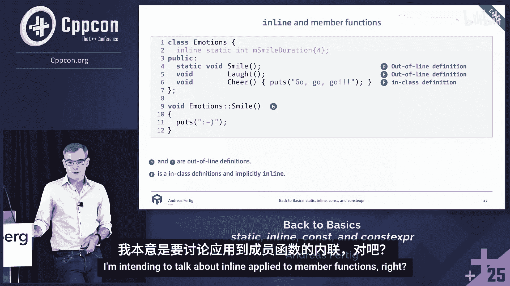
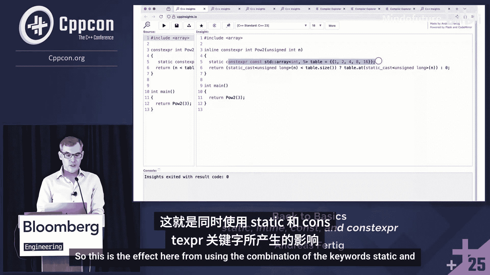
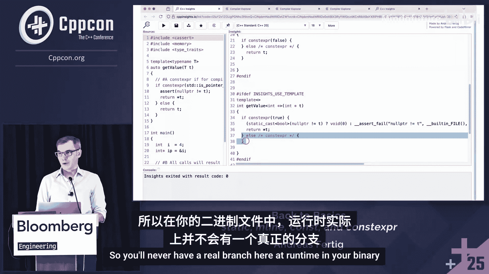
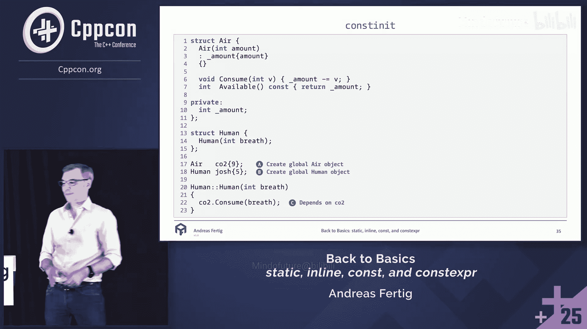
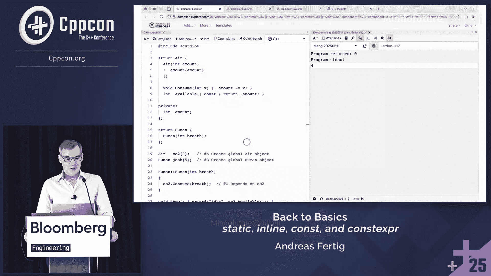

# 017：精通 `static`、`inline`、`const` 和 `constexpr`


在本教程中，我们将深入探讨 C++ 中四个核心关键字：`static`、`inline`、`const` 和 `constexpr`。我们将逐一分析它们在不同上下文中的含义、用法、常见误区以及它们之间的相互作用。目标是帮助你清晰理解这些看似简单却功能强大的工具，从而编写出更高效、更安全的代码。

## 1：`static` 关键字详解

`static` 是一个多用途关键字，其含义根据使用上下文而变化。本节我们将逐一解析它在不同场景下的作用。

### 自由函数中的 `static`

当 `static` 应用于一个自由函数（非成员函数）时，它使该函数具有**内部链接**，成为**翻译单元局部函数**。

```cpp
static void foo() { /* ... */ }
```

这意味着该函数仅在定义它的翻译单元（通常是一个 `.cpp` 文件及其包含的所有头文件）内可见。其他翻译单元无法链接或调用此函数。

**重要提示**：如果你在头文件中将函数声明为 `static`，并且该头文件被多个 `.cpp` 文件包含，那么每个翻译单元都会获得该函数的一个独立副本。这不仅会增加二进制文件大小，还可能阻碍链接时优化。因此，对于自由函数，通常建议仅在 `.cpp` 源文件中使用 `static`，以实现真正的“仅本文件使用”的目的。

### 函数内的静态局部变量

在函数内部，`static` 用于声明具有**静态存储期**的局部变量。

```cpp
void func() {
    static int v = 0; // 静态局部变量
    v++;
}
```

这种变量的特点是：
*   **初始化时机**：在程序执行流程**第一次**经过其声明时进行初始化。
*   **线程安全**：自 C++11 起，这种初始化是线程安全的。
*   **生命周期**：在程序整个运行期间都存在，而非函数调用期间。
*   **后续调用**：函数后续调用时，该变量会保持上一次调用结束时的值。

需要注意的是，由于静态局部变量的构造和析构顺序难以精确控制，一些编码规范会禁止使用此特性。

### 类中的 `static`

在类中，`static` 可以用于数据成员和成员函数。

**静态数据成员**：
```cpp
class MyClass {
    static int s_data; // 声明
};
int MyClass::s_data = 42; // 定义（C++17前必需）
```
*   它不属于类的任何一个对象，而是属于类本身，所有对象共享同一份数据。
*   它不占用类对象的内存空间。
*   在 C++17 之前，必须在类外进行定义（分配存储空间）。

**静态成员函数**：
```cpp
class MyClass {
    static void static_func();
};
```
*   静态成员函数没有隐含的 `this` 指针，因此不能直接访问类的非静态成员。
*   它可以通过类名或对象来调用。
*   由于没有 `this` 指针，调用时少了一个参数传递，可能带来微小的性能优势。

---

上一节我们介绍了 `static` 关键字的各种用法，本节我们来看看另一个容易混淆的关键字：`inline`。

## 2：`inline` 关键字详解

`inline` 关键字的历史含义是“建议编译器进行内联展开”，但现代编译器的优化策略已经非常智能，这个提示作用已大大减弱。如今，`inline` 更关键的作用是管理**单一定义规则**。

### 自由函数中的 `inline`

对于自由函数，`inline` 的主要作用是允许其在多个翻译单元中被定义，而链接器会选择其中一个定义使用。

```cpp
// header.h
inline int add(int a, int b) {
    return a + b;
}
```

**核心作用**：抑制 ODR（单一定义规则）冲突。这使得将函数定义放在头文件中成为可能，便于跨多个源文件共享。

**重要警告**：所有翻译单元中看到的 `inline` 函数定义必须**完全一致**。任何差异（例如通过预处理器宏导致的不同）都会引发未定义行为，因为链接器可能随机选择其中一个版本。

### `inline` 变量（C++17）

C++17 引入了 `inline` 变量，这对于头文件中的变量定义非常有用。

```cpp
// header.h
inline int global_counter = 0; // 可以在头文件中定义并初始化
```




这解决了在 C++17 之前，头文件中的全局变量或静态类成员变量可能导致的多重定义链接错误问题。

### 类成员函数的隐式 `inline`

在类定义内部实现的成员函数会被**隐式地**标记为 `inline`。

```cpp
class Widget {
    void doSomething() { /* ... */ } // 隐式 inline
    void doAnotherThing();
};
void Widget::doAnotherThing() { /* ... */ } // 非隐式 inline，除非显式添加
```

这样设计是为了方便将类定义在头文件中。需要注意的是，在 C++20 的模块中，这一隐式规则可能会发生变化。

---

了解了 `static` 和 `inline` 之后，我们进入一个更复杂、用法更多的领域：`const` 关键字。

## 3：`const` 关键字详解

`const` 是一个 **CV 限定符**（C 代表 const，V 代表 volatile），用于指定“只读”属性。理解其“顶层”和“底层”的区分至关重要。

### 顶层 `const` 与底层 `const`

*   **顶层 `const`**：表示对象本身是常量。这是一个“可选”的、由开发者添加的约束，用于表达“初始化后不应修改”的意图。
*   **底层 `const`**：表示指针或引用所指向的数据是常量。

```cpp
int a = 1;
const int b = 2;          // 顶层 const: b 本身是常量
int const c = 3;          // 同上，等价写法

int *p1 = &a;             // 指向非常量的指针
const int *p2 = &a;       // 底层 const: 指向常量数据的指针（数据不可变）
int *const p3 = &a;       // 顶层 const: 指针本身是常量（指向不可变）
const int *const p4 = &a; // 既是底层 const（指向常量）也是顶层 const（指针常量）
```

**关键点**：在函数重载解析时，编译器会忽略顶层 `const`。因此，`void func(int)` 和 `void func(const int)` 被视为相同的签名，会导致重定义错误。

### `const` 在函数参数中的应用

`const` 常用于函数参数，以保护数据不被意外修改，并作为 API 契约的一部分。

```cpp
void printString(const std::string& str); // 承诺不修改 str
```

对于指针参数，需要仔细区分是保护指针本身还是指针指向的数据。

---

`const` 保证了运行时的常量性，而 C++11 引入的 `constexpr` 则将常量性提升到了编译时。

## 4：`constexpr` 与 `consteval` 关键字详解

`constexpr` 用于声明可以在编译时求值的对象或函数，是实现编译期计算的核心工具。

### `constexpr` 变量

`constexpr` 变量必须是编译期常量。

```cpp
constexpr int max_size = 100; // 编译期常量
constexpr double pi = 3.14159;
```




### `constexpr` 函数

`constexpr` 函数具有“双重性”：既可以在编译时调用（如果参数是常量表达式），也可以在运行时调用。

```cpp
constexpr int factorial(int n) {
    return (n <= 1) ? 1 : n * factorial(n - 1);
}
int main() {
    constexpr int fact5 = factorial(5); // 编译时计算
    int x = 10;
    int runtime_fact = factorial(x);    // 运行时计算
}
```

**特性**：
*   `constexpr` 函数在 C++14 后允许包含循环、局部变量等更复杂的逻辑。
*   它们被隐式地标记为 `inline`。
*   编译期求值发生在 C++ 的“常量求值上下文”中，可以看作一个 C++ 虚拟机。

### `constexpr` 与 `static` 结合（C++23）




从 C++23 开始，可以在 `constexpr` 函数内声明 `static` 的局部 `constexpr` 变量。

```cpp
constexpr int power_of_two(int n) {
    static constexpr int lookup[] = {1, 2, 4, 8, 16}; // C++23 合法
    return lookup[n];
}
```
这使得编译期查找表等模式更加高效，因为该静态数组只会在所有编译期求值中初始化一次。

### `consteval` 立即函数（C++20）

`consteval` 用于声明**立即函数**，它**必须**在编译时求值，否则会产生编译错误。

```cpp
consteval int square(int n) {
    return n * n;
}
// int x = square(10); // 正确，编译时计算
// int y = 10;
// int z = square(y);  // 错误！y 不是常量表达式，无法在编译时调用
```
`consteval` 函数没有运行时版本，主要用于编译时元编程和作为 C++26 静态反射等特性的基础。

### `constinit` 变量（C++20）

`constinit` 确保具有静态存储期的变量（如全局变量、静态局部变量）**在编译时进行初始化**，但变量本身**不是常量**（即可修改）。

```cpp
constinit int global_var = 42; // 保证编译时初始化
```
它主要用来解决**静态初始化顺序问题**，即不同翻译单元中全局对象的初始化顺序未定义所导致的问题。`constinit` 通过强制编译时初始化来规避这个风险。




### 编译时分支：`if constexpr` 与 `std::is_constant_evaluated`




**`if constexpr`**：
用于编译时条件判断。条件必须是编译期常量表达式，不符合条件的分支在编译时就会被丢弃。

```cpp
template<typename T>
auto get_value(T t) {
    if constexpr (std::is_pointer_v<T>) {
        return *t; // 仅当 T 是指针类型时生成此代码
    } else {
        return t;
    }
}
```

**`std::is_constant_evaluated()` 与 `if consteval`**：
用于在函数内部判断当前是否处于常量求值上下文（即编译时）。

```cpp
// C++20 使用 std::is_constant_evaluated
constexpr double magic(double d) {
    if (std::is_constant_evaluated()) {
        // 编译时路径：使用更精确但更慢的算法
        return compute_precise(d);
    } else {
        // 运行时路径：使用快速近似算法
        return compute_fast(d);
    }
}

// C++23 引入更清晰的 if consteval
constexpr double magic_cpp23(double d) {
    if consteval {
        return compute_precise(d);
    } else {
        return compute_fast(d);
    }
}
```
注意：`if constexpr (std::is_constant_evaluated())` 是错误用法，因为 `if constexpr` 的条件在编译时求值，此时 `std::is_constant_evaluated()` 总是返回 `true`。


---

## 总结

本节课我们一起深入学习了 C++ 中四个关键关键字：
1.  **`static`**：控制链接性（翻译单元局部）、存储期（函数内静态变量）以及类成员的归属（属于类而非对象）。
2.  **`inline`**：现代主要作用是抑制 ODR 规则，允许在头文件中定义函数和变量（C++17），类内成员函数隐式内联。
3.  **`const`**：CV 限定符，用于指定只读性。需分清顶层 `const`（对象本身常量）和底层 `const`（指向常量数据），顶层 `const` 在重载时被忽略。
4.  **`constexpr` / `consteval` / `constinit`**：编译时计算的核心。
    *   `constexpr`：变量和函数可在编译时求值（函数有双重性）。
    *   `consteval`：函数必须在编译时求值（立即函数）。
    *   `constinit`：保证变量在编译时初始化，解决静态初始化顺序问题。
    *   配合 `if constexpr` 和 `if consteval` 实现编译时分支。


理解这些关键字的精确语义和适用场景，能帮助你写出意图更清晰、更高效、更安全的 C++ 代码。记住，`const` 是关于意图和契约，`constexpr` 是关于能力和时机。