# 018：为实时音频软件用现代C++重写遗留GUI库（续）🎨


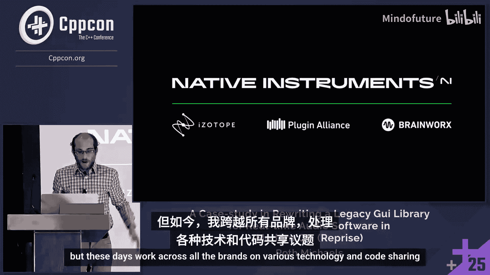

在本节课中，我们将学习如何利用C++20的概念（Concepts）特性，为一个实时音频软件的遗留GUI库重构其属性系统。我们将重点关注如何将一个命令式、运行时类型检查的系统，转变为声明式、编译时类型安全的现代C++设计。


---

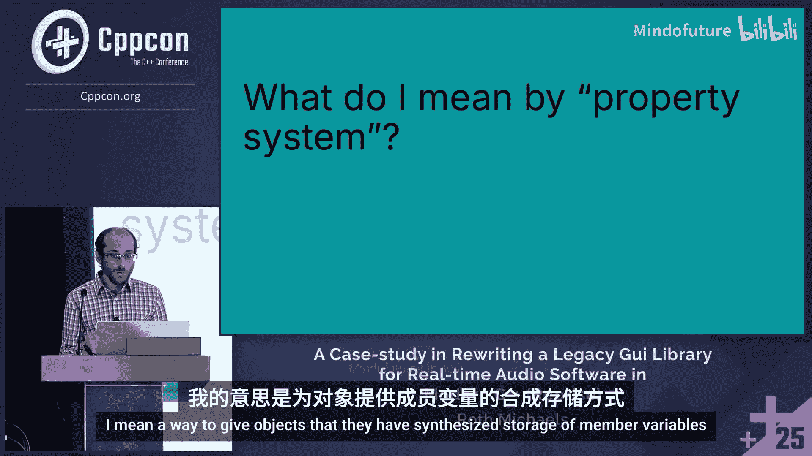

## 项目背景与动机 🎯

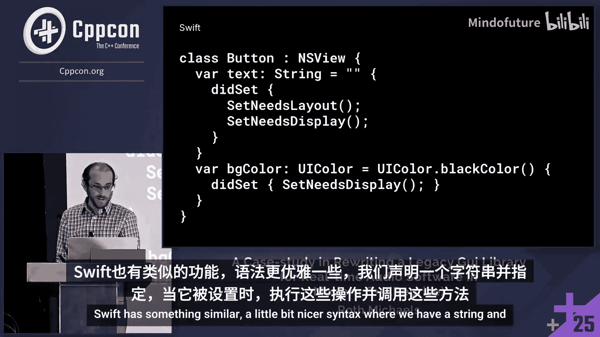


上一节我们介绍了遗留GUI库`Canvas`在音频插件环境中面临的挑战。本节中，我们来看看其属性系统的具体问题。

我们的目标是构建一个属性系统，能够为对象合成成员变量的存储空间以及对应的getter和setter方法。对象需要知道属性何时被更改，以便执行诸如重绘之类的操作。同时，系统需要支持将属性序列化到XML或其他格式。

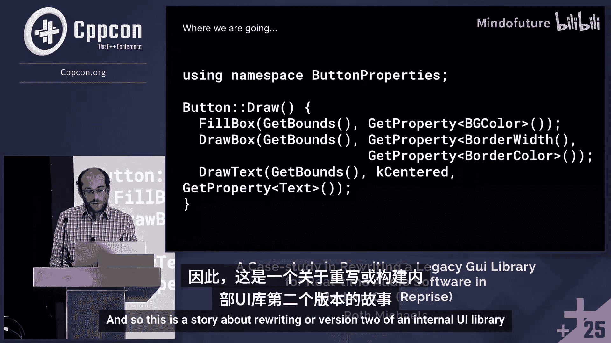

其他语言如Objective-C和Swift提供了类似的声明式语法。在C++中，我们希望通过现代特性实现类似的目标。

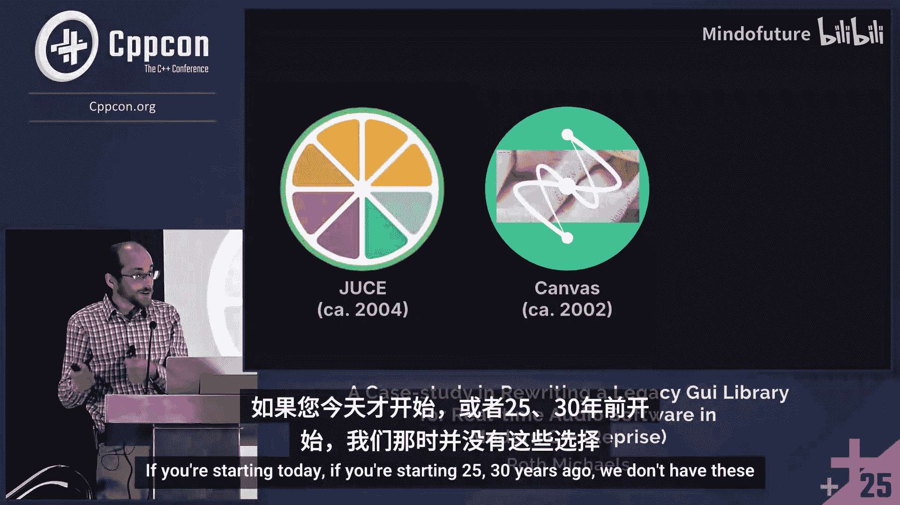

以下是遗留属性系统的主要问题：

1.  **命令式声明**：属性需要在运行时通过一系列函数调用创建，这可能导致条件性声明等奇怪用法。
2.  **缺乏类型安全**：属性通过字符串名称和`boost::any`（或`std::any`）存储，获取和设置时需要进行运行时类型检查和转换，容易出错。
3.  **重复代码**：需要为每个属性手动定义字符串常量名称，并在创建时重复指定类型和名称，增加了出错风险。
4.  **有限的类型支持**：系统仅支持少数基本类型（如字符串、颜色、矩形），复杂类型需要用户自行进行字符串解析。
5.  **混乱的通知机制**：任何代码都可以监听任何对象的属性变化信号，导致“远距离幽灵动作”，代码难以理解和维护。


## 解决方案：声明式属性系统 ✨

为了解决上述问题，我们决定利用C++20的概念特性，构建一个全新的声明式属性系统。核心思想是将所有属性信息集中在一个地方声明，利用编译时检查确保类型安全，并自动合成所需的接口。

### 核心概念：属性描述与属性类型

首先，我们需要定义两个核心概念：`PropertyDescription`（属性描述）和`PropertyTypeDescription`（属性类型描述）。

一个`PropertyDescription`描述了一个具体的属性，它需要包含：
*   `property_type`：该属性的类型描述符。
*   `name`：属性的名称（用于序列化）。
*   `default_value`：属性的默认值。

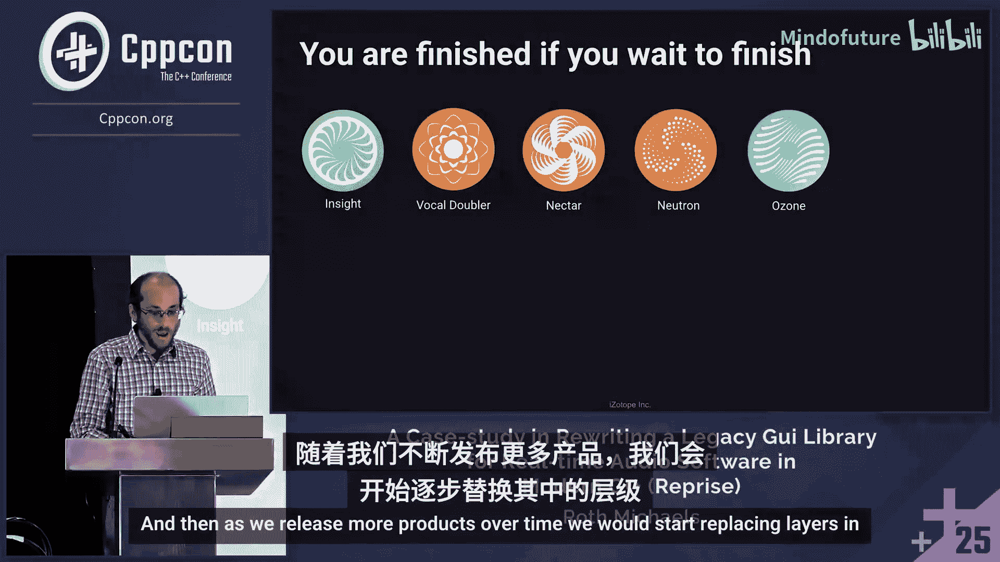

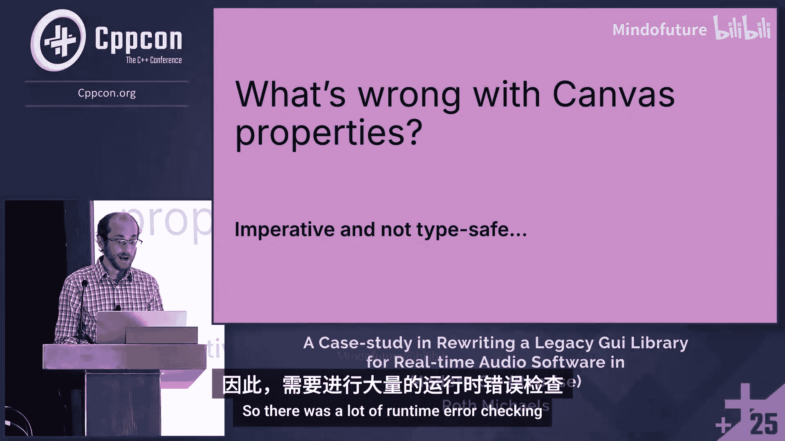

一个`PropertyTypeDescription`描述了属性值的底层C++类型如何与序列化格式相互转换，它需要包含：
*   `type`：底层的C++类型（例如`std::string`, `int`）。
*   `serialized`：一个函数，将`type`转换为`std::string`。
*   `deserialized`：一个函数，将`std::string`转换回`std::optional<type>`。

以下是使用概念定义这些约束的示例代码：

```cpp
// 属性类型描述的概念
template<typename T>
concept PropertyTypeDescription = requires {
    typename T::type;
    { T::serialized(std::declval<typename T::type>()) } -> std::convertible_to<std::string>;
    { T::deserialized(std::string{}) } -> std::same_as<std::optional<typename T::type>>;
};

// 属性描述的概念
template<typename T>
concept PropertyDescription = requires {
    requires PropertyTypeDescription<typename T::property_type>;
    requires HasName<T>; // 检查是否有可获取的名称
    requires HasDefaultValue<T>; // 检查是否有可获取的默认值
};
```

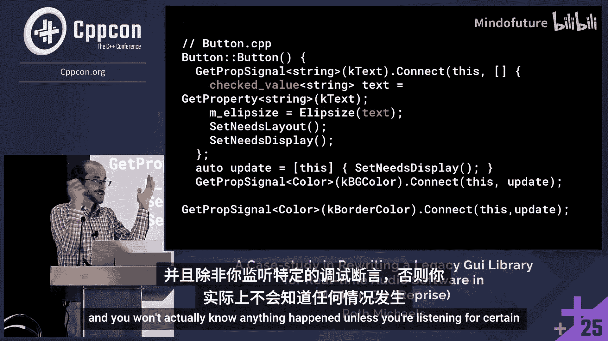

其中，`HasName`和`HasDefaultValue`是辅助概念，用于检查`T`是否通过成员变量或成员函数提供了名称和默认值。这体现了概念的强大之处：我们可以优雅地处理多种实现方式。

```cpp
// 检查是否有名为`name`的成员变量
template<typename T>
concept HasNameValue = requires { { T::name } -> std::convertible_to<std::string>; };

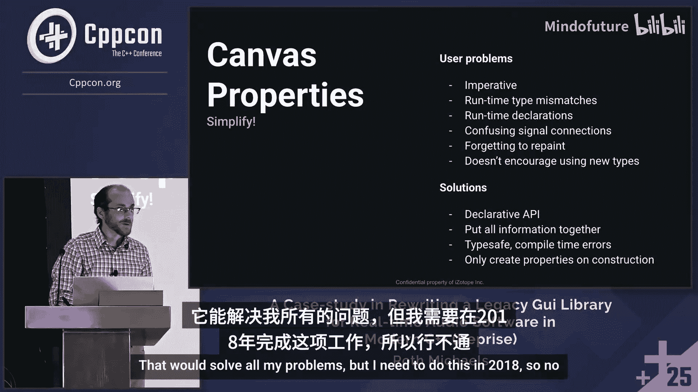

// 检查是否有名为`name()`的成员函数
template<typename T>
concept HasNameFunction = requires { { T::name() } -> std::convertible_to<std::string>; };

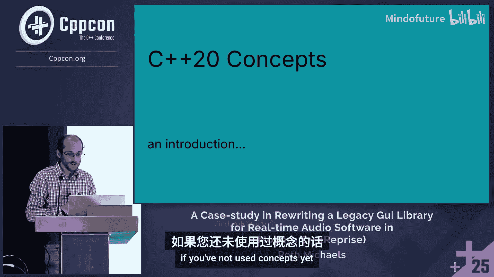

// 综合概念：有名称（无论是变量还是函数）
template<typename T>
concept HasName = HasNameValue<T> || HasNameFunction<T>;

// 根据实现方式获取名称的通用函数
template <HasNameValue T>
std::string get_name() { return T::name; }

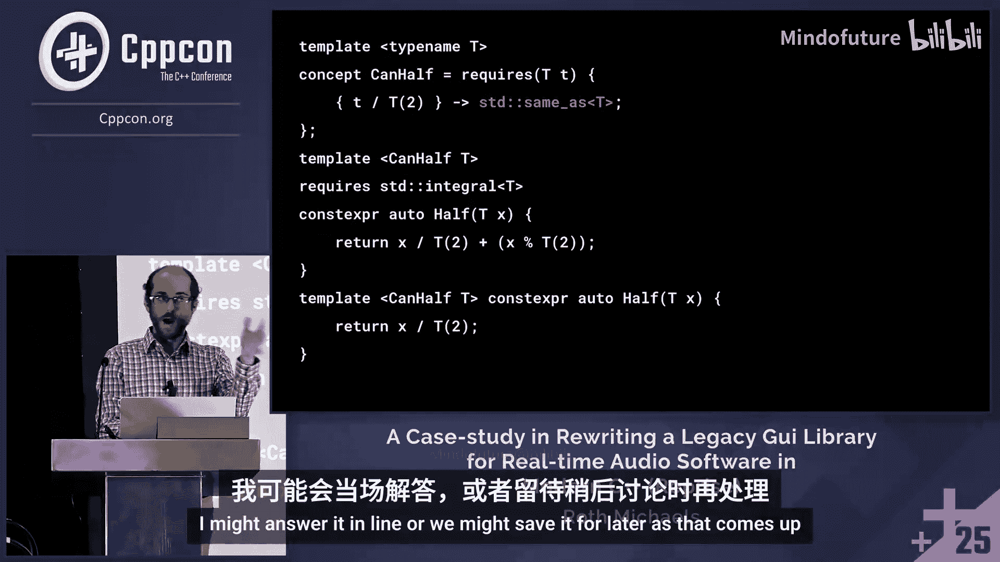

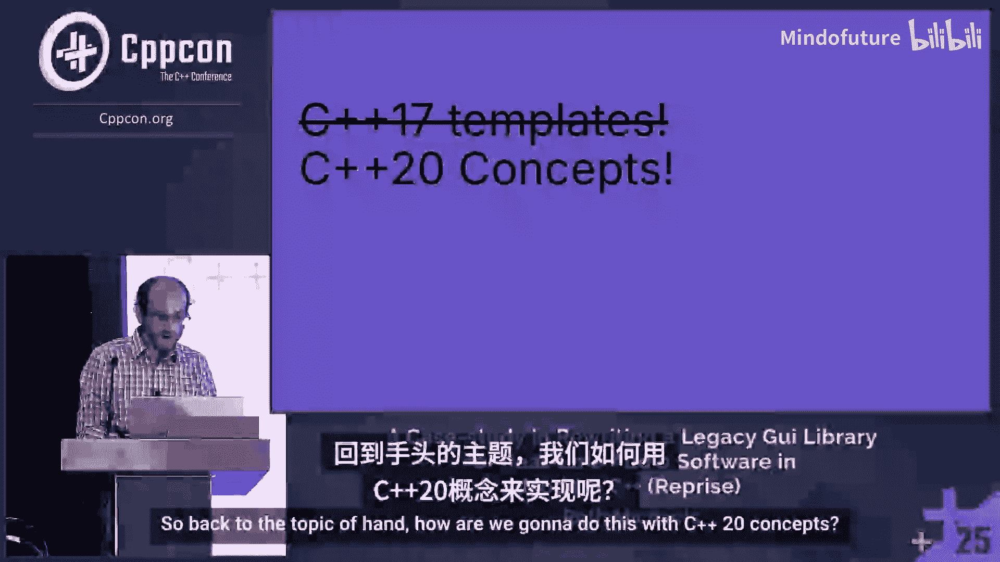

template <HasNameFunction T>
std::string get_name() { return T::name(); }
```

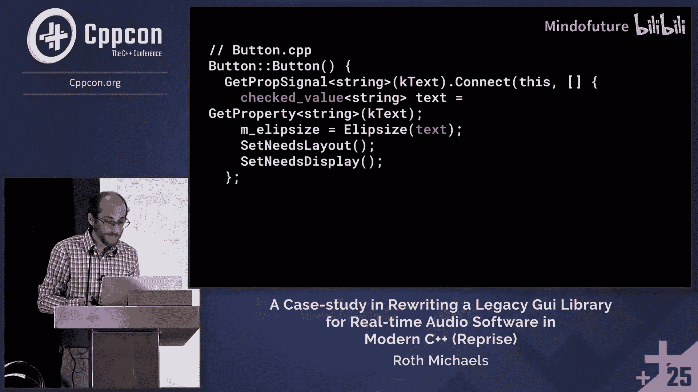

### 定义属性与属性列表 🧱


利用上述概念，我们可以以一种清晰、声明式的方式定义按钮的属性：

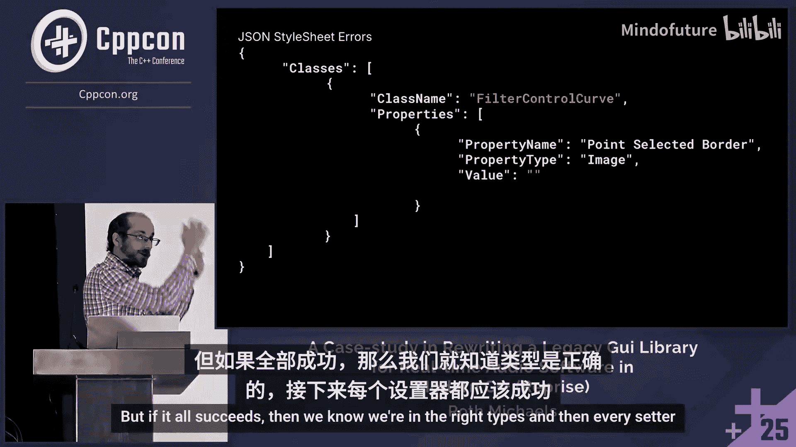

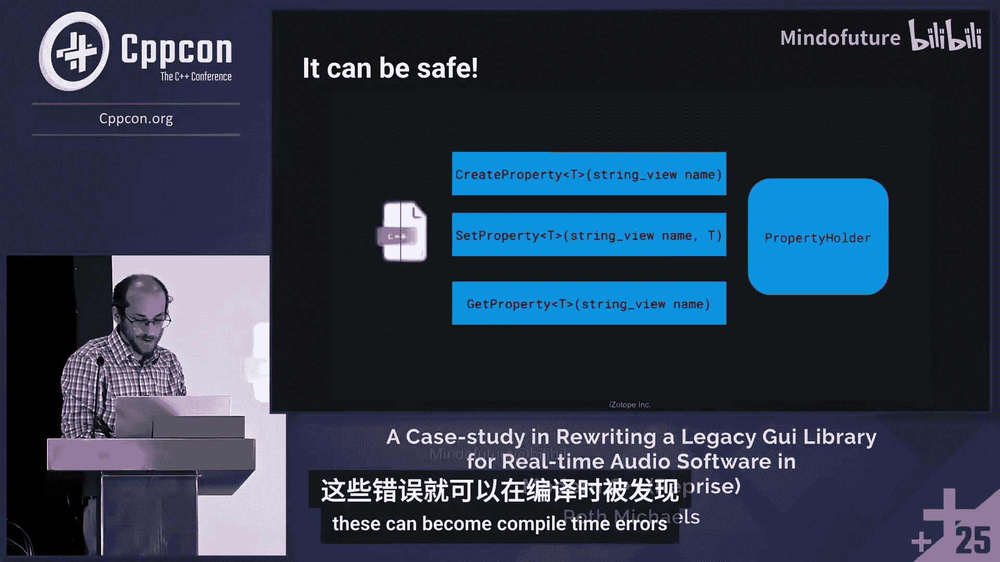

```cpp
// 1. 定义属性类型描述符
struct StringPropertyType {
    using type = std::string;
    static std::string serialized(const type& v) { return v; }
    static std::optional<type> deserialized(const std::string& s) { return s; }
    static constexpr auto name = "string";
};

struct ColorPropertyType { ... }; // 类似定义

// 2. 定义具体的属性描述
namespace button_properties {
    struct Text {
        using property_type = StringPropertyType;
        static constexpr auto name = "text";
        static constexpr auto default_value = std::string{"Click Me"};
    };

    struct BackgroundColor {
        using property_type = ColorPropertyType;
        static constexpr auto name = "background-color";
        static constexpr auto default_value = Color{0.9f, 0.9f, 0.9f};
    };
    // ... 更多属性
}

// 3. 将属性收集到一个属性列表中
using ButtonPropertyList = PropertyList<
    button_properties::Text,
    button_properties::BackgroundColor
>;
```

### 合成属性功能：HasProperties 模板 🛠️

接下来，我们创建一个`HasProperties`模板（使用CRTP模式），它接收一个属性列表，并自动为派生类合成类型安全的getter和setter。

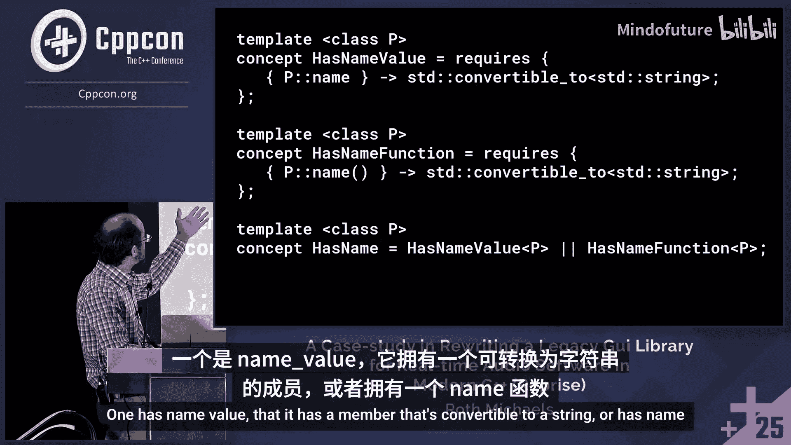

```cpp
template <typename Derived, PropertyList PropertyListT>
class HasProperties {
public:
    // 类型安全的 Getter
    template <PropertyDescription P>
        requires (is_type_in_list_v<P, PropertyListT>) // 确保P在属性列表中
    auto get_property() const {
        // 内部调用遗留的property_holder_.get_property<P::property_type::type>(get_name<P>())
        // 因为我们知道属性一定存在，所以可以断言成功。
        auto opt = property_holder_.get_property<typename P::property_type::type>(get_name<P>());
        assert(opt.has_value());
        return *opt;
    }

    // 类型安全的 Setter
    template <PropertyDescription P>
        requires (is_type_in_list_v<P, PropertyListT>)
    void set_property(typename P::property_type::type value) {
        // 内部调用遗留的property_holder_.set_property(get_name<P>(), value)
        // 因为我们知道属性一定存在且类型匹配，所以可以断言成功。
        bool success = property_holder_.set_property(get_name<P>(), value);
        assert(success);
        // 触发变更通知（后续介绍）
    }

protected:
    HasProperties() {
        // 在构造时，为属性列表中的每一个属性创建底层存储
        create_properties<PropertyListT>();
    }

private:
    LegacyPropertyHolder property_holder_;

    template <PropertyDescription... Properties>
    void create_properties() {
        // 使用折叠表达式为每个属性调用创建函数
        (create_property<Properties>(), ...);
    }

    template <PropertyDescription P>
    void create_property() {
        // 调用遗留接口创建属性，使用get_name<P>()和get_default_value<P>()
        property_holder_.create_property<typename P::property_type::type>(
            get_name<P>(), get_default_value<P>()
        );
        // 连接变更信号
        connect_property<P>();
    }
};
```

`is_type_in_list_v`是一个编译时检查，利用折叠表达式实现：

```cpp
template <typename T, typename... List>
inline constexpr bool is_type_in_list_v = (std::is_same_v<T, List> || ...);
```

### 使用属性系统 🎮

现在，按钮类可以非常简单地从`HasProperties`继承，并获得所有声明好的属性功能：

```cpp
class Button : public HasProperties<Button, ButtonPropertyList> {
public:
    // 可选的：定义属性变更回调
    void did_set(button_properties::Text) { /* 文本改变时重绘 */ }
    void did_set(button_properties::BackgroundColor) { /* 背景色改变时重绘 */ }

    void draw() {
        // 使用合成好的getter获取属性值
        auto bg = get_property<button_properties::BackgroundColor>();
        auto text = get_property<button_properties::Text>();
        // ... 使用这些值进行绘制
    }
};

// 在代码中使用
Button btn;
btn.set_property<button_properties::Text>("Hello World");
btn.set_property<button_properties::BackgroundColor>(Color{1.0f, 0.0f, 0.0f});
```

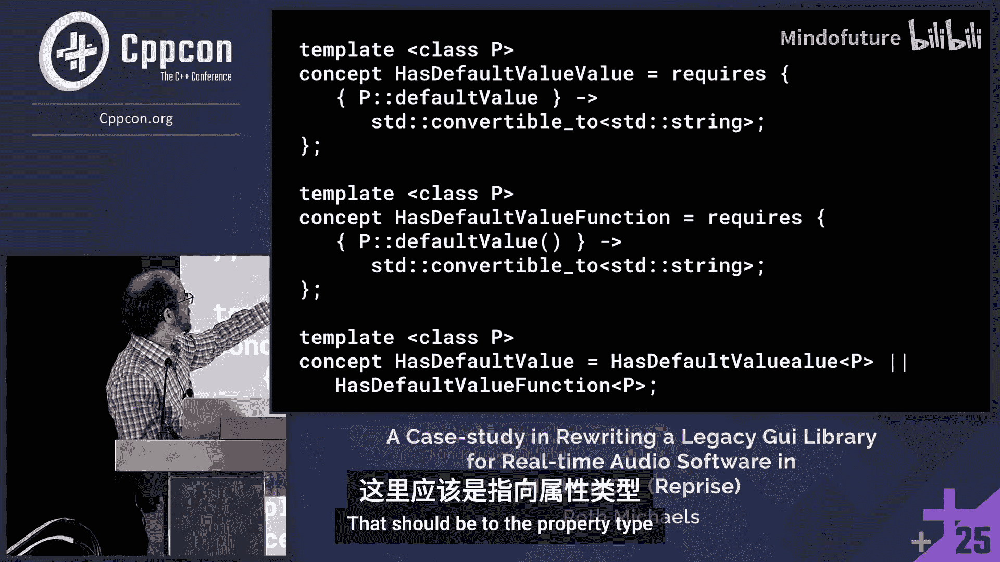

### 高级特性：条件性变更通知 🔔

我们还可以扩展系统，让属性声明自己是否影响布局或显示，并让类声明自己是否需要相应的通知。这可以通过`if constexpr`和更多的概念检查来实现。

例如，我们可以定义`LayoutProperty`和`DisplayProperty`标签。属性描述符可以继承它们：

```cpp
struct Text : UIProperty { ... }; // UIProperty 同时继承自LayoutProperty和DisplayProperty
struct BackgroundColor : DisplayProperty { ... };
```

在`HasProperties`内部连接信号时：

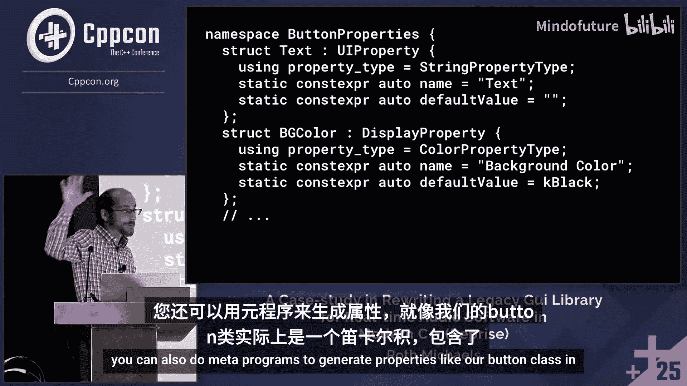

```cpp
template <PropertyDescription P>
void connect_property() {
    property_holder_.get_signal(get_name<P>()).connect([this](const auto&) {
        // 1. 如果派生类有对应的did_set，则调用它
        if constexpr (has_did_set_for_v<Derived, P>) {
            static_cast<Derived*>(this)->did_set(P{});
        }
        // 2. 如果属性影响布局，且派生类有set_needs_layout方法，则调用它
        if constexpr (std::is_base_of_v<LayoutProperty, P> && has_set_needs_layout_v<Derived>) {
            static_cast<Derived*>(this)->set_needs_layout();
        }
        // 3. 如果属性影响显示，且派生类有set_needs_display方法，则调用它
        if constexpr (std::is_base_of_v<DisplayProperty, P> && has_set_needs_display_v<Derived>) {
            static_cast<Derived*>(this)->set_needs_display();
        }
    });
}
```


`has_did_set_for_v`等特性同样可以利用概念来检测类中是否存在特定签名的成员函数。


---

## 总结 📝

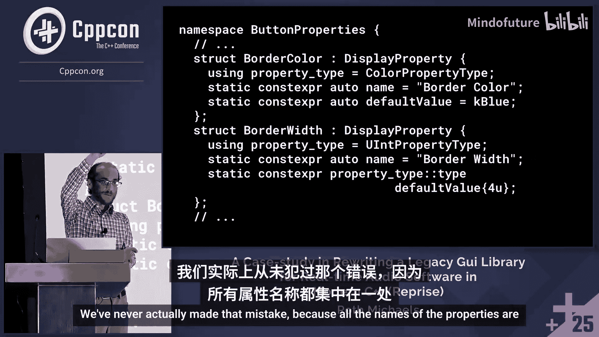


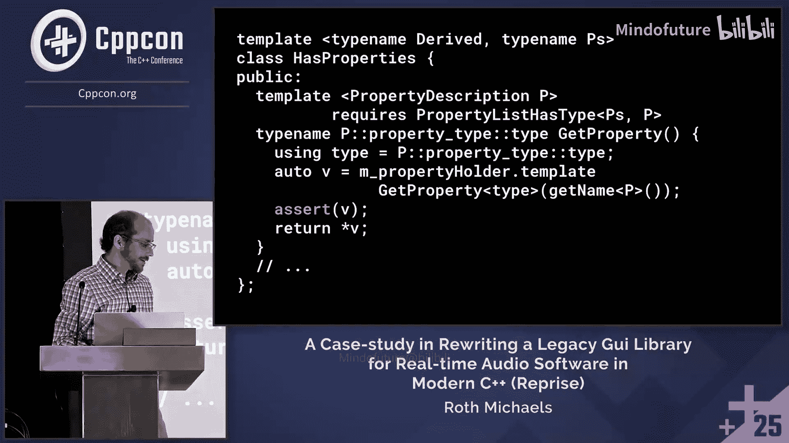

本节课中我们一起学习了如何运用C++20的概念特性，对一个实时音频软件GUI库的属性系统进行现代化重构。我们主要完成了以下工作：

1.  **分析了遗留系统的问题**：包括命令式声明、运行时类型错误、代码重复、有限的类型支持和混乱的通知机制。
2.  **引入了声明式设计**：通过定义`PropertyDescription`和`PropertyTypeDescription`概念，将属性信息集中声明，实现了关注点分离。
3.  **实现了编译时类型安全**：利用概念约束模板，确保只能对声明的属性进行获取和设置操作，将运行时错误转化为编译时错误。
4.  **自动合成了接口**：通过`HasProperties`模板和CRTP模式，自动为类生成类型安全的getter、setter，并在构造时初始化属性。
5.  **设计了灵活的通知机制**：结合概念检查与`if constexpr`，实现了条件性的属性变更回调，代码既安全又高效。


通过这次重构，我们得到了一个更简洁、更安全、更易于维护和扩展的属性系统，同时为未来集成C++的反射和元类特性打下了良好的基础。这个案例充分展示了现代C++特性，特别是概念，在构建高质量、可维护的库基础设施方面的强大能力。