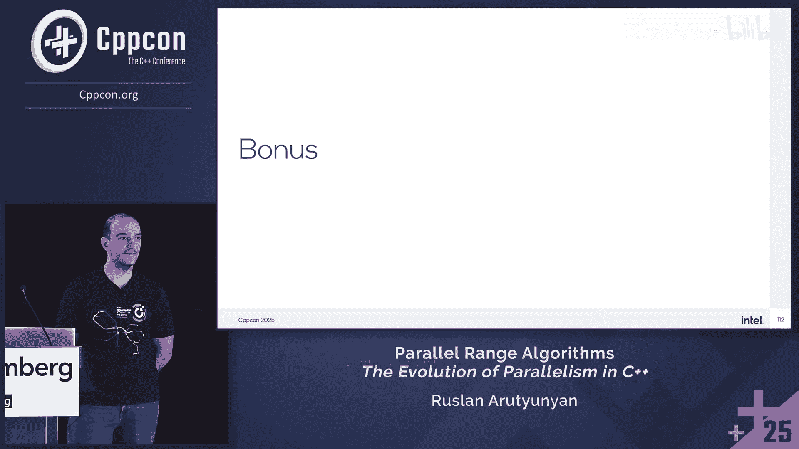
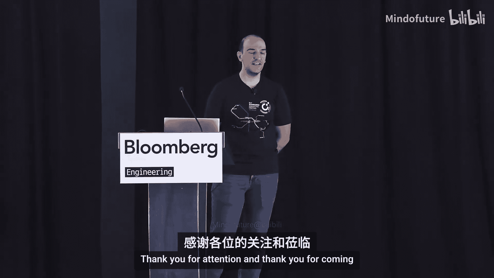

# 019：并行范围算法 - C++并行化的演进


## 概述

在本节课中，我们将学习C++并行范围算法的演进、设计动机、核心概念以及它们与C++17标准并行算法的区别。我们将探讨如何利用新的API编写更简洁、更高效的并行代码，并了解其背后的设计决策和实现考量。

---

## P19.1：演讲者介绍与主题引入

大家好。感谢大家选择我的演讲。

我叫Ruslan。我是C++标准委员会成员。我在英特尔工作，主要负责oneAPI DPL（Data Parallel Library）的开发，这是英特尔对并行算法的实现。我对其他线程引擎也有贡献，例如oneTBB。我也曾是SYCL语言的贡献者。我在C++标准中贡献了诸如`std::execution`等特性，当然，也包括我们今天要讨论的并行算法。最近，我担任了C++委员会中SG1（并发与并行）小组的联合主席。

但今天演讲的主题不是我，而是并行范围算法。

让我们深入探讨。

---

## P19.2：什么是并行算法与并行范围算法

上一节我们介绍了演讲背景，本节中我们来看看核心概念。

**并行算法**是大家可能已经熟悉的算法，例如`std::for_each`或`std::transform`，它们将**执行策略**作为第一个模板参数。这些算法位于`std`命名空间，接受迭代器。

以下是一个串行版本的`find_if`示例：
```cpp
std::find_if(begin, end, predicate);
```
并行版本完全相同，只需将执行策略作为第一个参数：
```cpp
std::find_if(std::execution::par, begin, end, predicate);
```
这里的`std::execution::par`意味着“尽最大努力并行执行”。

**并行范围算法**是提案P3179的内容。这些算法位于`ranges`命名空间，其第一个模板参数受`execution_policy`概念的约束。它们有两种重载：一种接受**范围**，另一种接受**迭代器和哨兵**。

以下是示例。串行版本：
```cpp
std::ranges::find_if(input, predicate);
```
并行版本：
```cpp
std::ranges::find_if(std::execution::par, input, predicate);
```
我们只是添加了执行策略`par`作为第一个参数。

这就是基本概念。但当然，还有更多内容。这是关于演进的讨论。

一个重要的免责声明是：我们**只并行化循环本身**。例如对于`find_if`，我们不会将执行策略传递给任何范围或视图。本提案仅涉及算法，不修改标准中的任何视图或范围。

---

## P19.3：设计动机与问题示例

上一节我们定义了并行范围算法，本节中我们来看看为什么需要它们。

动机是结合范围API的强大表达能力和并行执行的高性能，以提高代码的表达力、生产力和易用性。

让我们看一个例子。假设我们有三个连续的算法调用：`transform`、`reverse`和`find_if`。
```cpp
// 三个独立的算法调用
auto it1 = std::transform(std::execution::par, ...);
auto it2 = std::reverse(std::execution::par, it1, ...);
auto result = std::find_if(std::execution::par, it2, ..., predicate);
```
这段代码存在几个问题：

1.  **调用开销**：每个算法调用都会引入开销，必须等待前一个调用完成才能开始下一个。
2.  **不必要的计算**：对于`find_if`，一旦找到目标元素，理论上可以停止搜索其后的元素，但在此链式调用中无法实现。
3.  **代码冗长**：需要多次调用，并手动管理中间迭代器。

我们可以尝试使用视图和管道来编写更“惰性”的代码：
```cpp
// 使用视图管道
auto pipeline = input | std::views::transform(lambda) | std::views::reverse;
auto result = std::find_if(std::execution::par, pipeline.begin(), pipeline.end(), predicate);
```
这减少了算法调用次数，并允许`find_if`在找到元素后提前停止。但它仍然冗长，并且如果迭代器和哨兵类型不同（虽然目前不常见），它可能无法工作。

另一个问题是，当传递一个**右值范围**（如管道结果）时，如果该范围不是“借用范围”，返回的迭代器可能是`std::ranges::dangling`，无法使用。为了解决这个问题，我们必须将管道结果存储在左值中：
```cpp
auto pipeline = input | std::views::transform(lambda) | std::views::reverse; // 存储为左值
auto result = std::ranges::find_if(std::execution::par, pipeline, predicate); // 现在可以工作
```
并行范围算法提案旨在解决所有这些问题。

---

## P19.4：并行范围算法与C++17并行算法的区别

上一节我们看到了现有方式的痛点，本节中我们来详细看看新提案带来的具体变化。

以下是并行范围算法与C++17并行算法及串行范围算法的主要区别。其中一些区别仅适用于一方，一些适用于双方。

以下是核心区别列表：

1.  **执行策略作为第一参数**：这是最明显的变化。
2.  **要求随机访问迭代器/范围**：C++17并行算法只要求前向迭代器，但新提案要求**随机访问迭代器**和**范围**。这对于高效并行化是必需的。
3.  **要求大小已知的范围**：新提案要求范围是**大小已知的**。这对于并行任务划分和内存安全至关重要。
4.  **输出参数为范围**：对于接受输出参数的算法（如`copy`），新提案的重载接受一个**输出范围**，而不是一个输出迭代器。对于迭代器-哨兵重载，则增加了一个**输出哨兵**参数。

让我们看看函数签名的变化。

**串行范围算法签名示例（迭代器版）**：
```cpp
template <typename I, typename S, typename O>
O copy(I first, S last, O result);
```
**并行范围算法签名示例（迭代器-哨兵版）**：
```cpp
template <typename EP, typename I, typename S, typename O, typename SO>
requires execution_policy<EP> && sized_random_access_iterator<I> && sized_sentinel_for<S, I> && ...
auto copy(EP&& exec, I first, S last, O result_first, SO result_last);
```
*   增加了执行策略`EP`。
*   输入迭代器`I`需满足`sized_random_access_iterator`概念。
*   增加了输出哨兵`SO`。

**串行范围算法签名示例（范围版）**：
```cpp
template <typename R, typename O>
O copy(R&& r, O result);
```
**并行范围算法签名示例（范围版）**：
```cpp
template <typename EP, typename IR, typename OR>
requires execution_policy<EP> && sized_random_access_range<IR> && sized_random_access_range<OR>
auto copy(EP&& exec, IR&& input_r, OR&& output_r);
```
*   增加了执行策略`EP`。
*   输入范围`IR`和输出范围`OR`都需满足`sized_random_access_range`概念。
*   输出参数直接是一个范围`OR`，而不是迭代器。

这些概念（如`execution_policy`, `sized_random_access_range`）在标准中是“仅用于说明的”，旨在简化标准文本的措辞。

---

## P19.5：关键设计决策的探讨

上一节我们列出了技术差异，本节中我们深入探讨这些设计背后的原因。

### 为何要求随机访问和大小已知？

*   **现实情况**：尽管C++17标准允许前向迭代器，但主流实现（如Intel oneDPL， NVIDIA Thrust， GNU libstdc++）在实践中都要求或倾向于随机访问迭代器以实现高效并行。只有MSVC STL支持前向迭代器的并行算法。
*   **性能必需**：随机访问允许常数时间的偏移计算，这对于将工作均匀分割给多个线程或核心至关重要。
*   **内存安全与提前规划**：知道范围的大小可以防止内存越界，并允许运行时系统提前规划并行执行策略。
*   **牺牲的用例**：这确实排除了像`std::views::filter`这样的非随机访问、大小未知的视图。未来可能会探索某种“中间地带”，但C++26不会改变此决定。

### 为何输出参数是范围？

这是提案中争论最激烈的部分。

**支持方论据**：
*   **易用性**：用户可以直接传递容器或范围，无需调用`begin()`。
*   **内存安全**：算法可以检测输出范围是否足够大，并安全地停止在范围末尾。
*   **更好的性能**：算法可以利用输出范围的整体信息进行优化。
*   **错误检测**：返回值可以指示在输入和输出中的停止位置，用户可据此处理。
*   **已有先例**：标准中已有算法如`uninitialized_copy`和`partial_sort_copy`接受输出范围，存在不一致性。

**反对方论据**：
*   **切换成本**：从串行范围算法切换到并行版本不再是简单地添加一个执行策略，还需要更改输出参数的类型。
*   **不一致性**：与现有的、接受输出迭代器的串行范围算法不一致。

最终，委员会被说服，认为**内存安全、易用性和性能提升的好处超过了切换成本**。关于不一致性，可以通过未来为串行算法也添加接受输出范围的重载来解决（提案P3490正在探索这一点）。

输出范围语义很明确：算法将处理直到**任一范围（输入或输出）被耗尽**。这与`std::ranges::copy`等算法处理多个输入序列的逻辑是一致的。

---

## P19.6：算法实现示例：并行 `copy_if`

上一节讨论了设计哲学，本节我们通过一个具体算法`copy_if`的实现示例，来看看并行化的复杂性。

我们以实现一个并行的`copy_if`为例。其基本思路分为几个阶段：

1.  **计算掩码**：并行遍历输入范围，对每个元素应用谓词，生成一个由1（需复制）和0（不需复制）组成的序列。
    ```cpp
    std::vector<size_t> mask(input_size);
    std::transform(std::execution::par, input_range, mask.begin(),
                   [&](const auto& x) -> size_t { return predicate(x) ? 1 : 0; });
    ```
2.  **前缀和（扫描）**：对掩码序列进行**独占前缀和**计算。结果序列中的每个值，对于需要复制的元素，表示其**在输出中的目标索引**。
    ```cpp
    std::vector<size_t> indices(input_size);
    std::exclusive_scan(std::execution::par, mask.begin(), mask.end(), indices.begin(), 0);
    ```
3.  **分散写入**：再次并行遍历输入、掩码和索引。对于掩码为1的元素，根据其对应的索引值，将输入元素写入输出范围的相应位置。
    ```cpp
    auto zipped_view = std::views::zip(input_range, mask, indices);
    std::for_each(std::execution::par, zipped_view.begin(), zipped_view.end(),
                  [&](auto&& tuple) {
                      auto&& [in_val, msk, idx] = tuple;
                      if (msk == 1) {
                          output_range[idx] = in_val;
                      }
                  });
    ```
4.  **处理输出空间不足**：这是关键。如果输出范围小于需要复制的元素数量，算法必须在写满输出范围时停止。我们需要确定：
    *   **输出结果**：自然是`output_range.end()`。
    *   **输入结果**：应该返回输入中**第一个因输出空间不足而未被复制的、满足谓词的元素**的位置。为了实现这一点，我们可以利用前缀和序列是**有序**的这一特性，使用`upper_bound`在索引序列中查找输出范围大小对应的位置，从而定位到正确的输入停止点。

这个简化的示例说明了并行化一个看似简单的算法所需的复杂步骤，特别是处理边界条件和确保正确性。

---

## P19.7：异构计算与性能

上一节我们看了CPU上的实现逻辑，本节中我们看看如何在GPU等异构设备上使用并行范围算法，并了解其性能收益。

以Intel oneDPL和SYCL为例，我们可以轻松地将管道化的范围算法卸载到GPU上执行。

以下是示例代码框架：
```cpp
sycl::queue q; // 关联到GPU设备
usm_allocator<int, sycl::usm::alloc::shared> allocator(q);
std::vector<int, decltype(allocator)> data(allocator);
// ... 填充数据 ...

auto pipeline = data | std::views::transform(foo) | std::views::reverse;
auto policy = oneapi::dpl::execution::device_policy(q);

auto result = std::ranges::find_if(policy, pipeline, predicate);
```
代码与CPU版本几乎相同，只是使用了特定的**设备策略**和**共享内存分配器**。

**性能数据**：
在一个包含1600万个元素的管道（`transform -> reverse -> find_if`）测试中：
*   **对比基线（三个串行算法调用）**：
    *   三个并行算法调用（迭代器版）：约**12倍**加速。
    *   三个并行范围算法调用：约**12倍**加速。
    *   **单个管道化并行范围算法调用**：约**30倍**加速。
*   **在GPU上**，加速比更为显著，管道化调用可达**130倍**加速。

即使不考虑并行，**单个管道化的串行调用也比三个独立的串行调用更快**（约1.3-1.8倍），因为它避免了中间结果的多次内存遍历和写入。

---

## P19.8：范围、状态与未来工作

上一节展示了强大的性能，本节中我们总结提案的范围、当前状态和未来方向。

**标准化范围**：
*   本提案旨在为C++17中所有的**并行算法**提供对应的**范围版本**。
*   不包括`<numeric>`头文件中的算法（如`reduce`, `transform_reduce`），因为目前`ranges`命名空间下还没有对应的串行版本。这需要未来单独提案。
*   不包括`ranges`中一些本质上是串行或特殊的算法，如`fold`（有特定顺序）和`generate_random`（与随机数生成器紧密耦合）。

**当前状态**：
该提案（P3179及其补充提案）已被C++26采纳。你可以通过Intel oneDPL等库提前体验。

**未来可能的工作方向**：
1.  **数值范围算法**：为`<numeric>`添加范围版本，包括并行版本。
2.  **基于发送器/接收器的异步并行算法**：与C++的异步模型集成。
3.  **为串行范围算法添加输出范围重载**：解决之前提到的不一致性问题。

---

## 总结



在本节课中，我们一起学习了C++26的并行范围算法。
*   我们了解了其设计动机：**结合范围表达力与并行性能**。
*   我们掌握了其核心形式：在`std::ranges`算法中，添加`std::execution`策略作为第一参数。
*   我们探讨了关键设计：要求**随机访问**、**大小已知**的范围，并将**输出参数改为范围**以提升安全性与易用性。
*   我们通过`copy_if`的例子窥见了并行实现的复杂性。
*   我们看到了其在**异构计算**（如GPU）上的应用和显著的**性能收益**。
*   最后，我们了解了该特性的当前标准化状态和未来演进方向。




并行范围算法是C++向更简洁、更安全、更高性能并行编程迈进的重要一步。