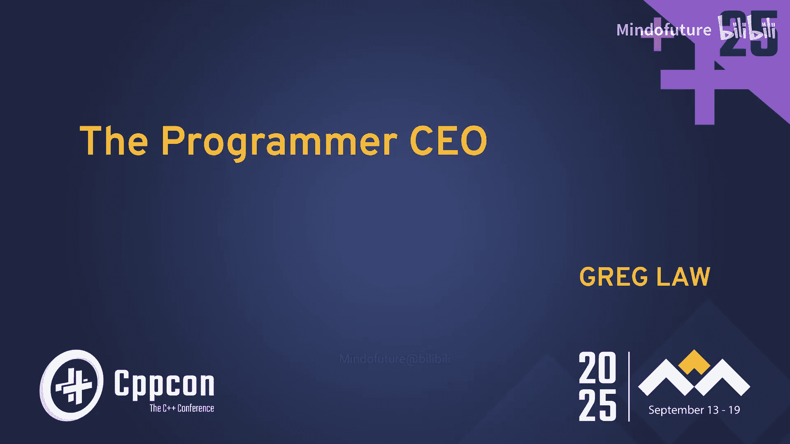
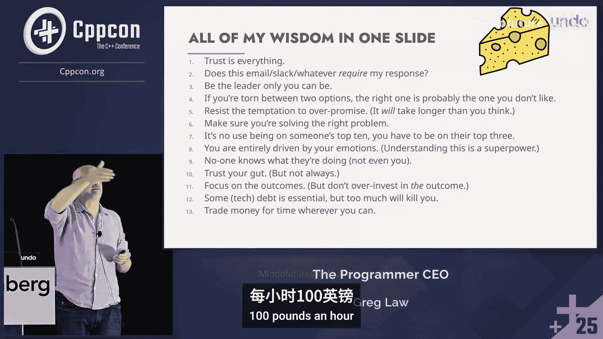

# 022：关于成为程序员CEO的真相 🚀

## 概述
在本节课中，我们将跟随Greg Law的亲身经历，学习从一名程序员转变为一家科技公司CEO的完整历程。我们将探讨创业的动机、寻找合伙人、融资、销售、领导力以及如何应对过程中的各种挑战。课程的核心在于揭示技术创业背后的真实故事，而非浪漫化的想象。

---

## 章节 1：创业的起点与动机

参加大会、结识朋友、建立联系并与他们进行深入的面对面交流，这种感觉非常棒。获取联系方式，并沉浸在一群真正聪明、充满动力的开发者环境中，这非常棒。

然而，创业之路并非始于浪漫的想象。本课程并非仅仅针对有抱负的创业者或已经是企业家的人。如果你正走向公司的领导或管理岗位，这里有很多内容对你有用。或者，即使你无意进入管理层，作为一名独立贡献者，领导力仍然是重要组成部分。领导者和老板不是一回事。希望你的老板也是一位领导者，但许多领导者并非老板。领导者就是有人愿意追随的人，就这么简单。

我期待这次演讲，因为我可以谈论我最喜欢的主题——我自己。我们将以一种自传式的叙事弧线来进行，然后提炼出我一路走来学到的所有智慧和教训。其中大部分是我通过艰难方式学到的，希望你们不必如此。许多教训是我从他人那里听来的，这里也有一两件事是我做对了的。所以，这是一份我从如何创业、融资到如何进行销售和营销中学到的经验清单。

---

## 章节 2：关于销售与营销的认知转变

我曾经认为，工程是困难的部分，是科学。而销售是那种轻松、模糊的事情。编程，你只需要让计算机做你想做的事。销售，你必须让人们做你想做的事。而营销，你必须让人们做你想做的事，甚至无法亲自见到他们。我认为这更难。

在开始这段旅程时，我预计到自己不了解这些事情，需要一路学习。让我惊讶的是，其中有多少内容关乎心理学，尤其是我自己和他人的心理。

---

## 章节 3：创业的“为什么”与团队的重要性

在讨论如何创业之前，先问问为什么。我从不认为这是在鼓励人们创业。事实上，你应该做相反的事。我觉得我应该劝阻你们所有人创业。如果你在听了这些之后仍然决定去做，那也许适合你。但如果你需要鼓励，那可能就不适合。你必须完全投入。

我喜欢这句古老的非洲谚语：“如果你想走得快，就独自前行；如果你想走得远，就结伴同行。”你可以和很多人一起做更多事。创业之初，我有个想法，想把它推向市场，最好的方式就是创建一家公司，这样我就可以追求这个愿景，让编程变得更好。

但说实话，真正的动机是什么？是自我吗？我认为所有企业家都有点不对劲。我们小时候得到的拥抱不够还是什么。我们只是需要这种认可。不是为了钱。钱是创业的一个非常糟糕的理由，尤其是在科技领域，因为你的预期回报……不如加入一家大公司，努力工作，晋升，赚取丰厚的薪水。创业的预期财务回报中位数要么是零，要么是负数。

除非你真的想成为亿万富翁，那你可以为此创业。但对我来说，是我的自我，它太大也太脆弱，无法仅用金钱来修复。我需要建立这个东西。

然而，“结伴同行”这句话真的很重要。独自一人能做的只有那么多。所以，无论你是创业、在其他公司工作，还是参与开源项目，你都想与人合作，你可以做得更多。这就是领导力和心理学发挥作用的地方。

---

## 章节 4：灵感的来源与寻找联合创始人

一切始于一个早晨在淋浴时的想法。我看到了“时间旅行调试”这个概念，但当时不叫这个名字。我一直在思考如何为真实世界的复杂代码大规模实现它。淋浴时我突然想到：如果你想向后回溯，可以从一个快照开始向前播放。如果我播放了1000条指令，想退回一条，我可以从头开始播放999条。只要确保重播时执行路径相同，那么在道德上就是一样的。这就是突破点。

淋浴是我的创意源泉。实际上，我博士课题的想法是在马桶上产生的。现在我们不再在马桶上有想法了，因为我们有手机。但你在淋浴时不能用手机，所以我们仍然有想法，或者可能在骑自行车或跑步时。我认为，感到无聊并让创造力流动是很重要的。

我的第一个想法是：我需要一位联合创始人。我从未想过独自创业，总觉得必须有一位联合创始人。

---

## 章节 5：如何选择联合创始人

我找到了一位以前共事过的超级聪明、有创业精神、见识广博的人。我向他推销了这个想法。但他不理解。他说：“你为什么要做这个？栈跟踪（backtrace）不是已经提供了你需要的东西吗？”回想起来，那是一个危险信号。如果像他这样超级聪明的人都不理解，那说明解释这件事并说明其重要性真的很难。这一点我后来才发现。

然后我意识到，几年前共事过的一位朋友Jules（Julian Smith）非常适合。我给他发了邮件说明想法。我仍然记得他的回信：“我很乐意和你一起创业。”这让我非常高兴。遗憾的是，我们最终没有一起走到最后，但他在公司头十多年里绝对是不可或缺的，没有他我们绝对走不到那一步。

我认为，如果你要有联合创始人，找到合适的人至关重要。我认识一个人，他和别人联合创业，而那个人为了启动业务窃取了数据。你真的想和这样的人一起创业吗？因为创业会很艰难，你们会有分歧，必须有基本的信任。否则，太难了，你永远无法起步。

---

## 章节 6：启动公司的实际步骤

那么，如何实际启动公司呢？显然，第一件事是打开`vi`编辑器，开始往空文件里写代码。但显然不止这些。人们总说会被繁文缛节（red tape）缠住。

这里有个秘密：其实没有那么多“繁文缛节”。我必须承认，这是基于英国的情况，其他地方可能不同。但通常，人们以此为借口。大公司可能有很多繁文缛节，但小公司没有。当我们有了第一位员工（在棚屋里）时，我们才去了解雇佣法之类的东西。在英国，如果你雇佣某人，在工作场所，你必须进行风险评估；如果员工超过六人，你必须把它写下来。仅此而已。这比我想象的要容易得多。

所以，我认为你应该寻求帮助。可能是心理帮助。除此之外，孵化器很棒。我们创业时孵化器还不流行，但现在像Y Combinator这样的孵化器非常棒。选择时要谨慎，看看他们的过往记录，是否孵化过一些成功的公司。

你也可以寻求建议。你会惊讶地发现，你可以联系到那些成功的重要人物，他们几乎都会回复。有些人会说抱歉太忙，但你会惊讶于有多少人愿意和你见面。你可以说“我请你吃午饭聊聊”，然后他们通常会买单。政府通常也想提供帮助，但意愿和实施是两回事。有各种拨款、竞赛，可能有用。

要小心那些“挂名”的人。我的经验法则是：他们以前做过吗？如果他们成功过，或者即使生意不成功但经营过，或者他们帮助和指导过很多其他人，那很好。如果他们只是从大公司提前退休，可能毫无帮助，甚至是负帮助。

---

## 章节 7：辞职与面对现实

下一步，辞掉日常工作。我去了老板那里说：“我有个想法，想创业，我要辞职了。”他们说：“有什么办法能说服你留下吗？”我说，这与钱无关。但我告诉他们：“你们可以试着说服我这件事不会成功。”因为我非常尊重那家公司的创始人。我说：“如果我能从技术上实现，业务方面会很容易，每个人都会想买。”他们说：“好吧，我们来谈谈技术部分。”他们找不到漏洞，认为技术上可行。但他们说：“我们能聊聊业务部分吗？可能比你想的难。”我说：“不，不，这次真的不一样。”他们说：“每个人都认为自己的不一样。”我知道每个人都认为自己的不一样，但这次真的、真的不一样。

结果，它并没有什么不同。

---

## 章节 8：早期融资与“龙穴”经历

当时英国有个电视节目叫《龙穴》（Dragons‘ Den），后来在美国变成了《鲨鱼坦克》（Shark Tank）。我没有上那个节目，因为我们的东西太技术化了。但当地政府组织了一个类似的活动，有一位原版“龙”担任评委。大约200家公司参加，经过多轮淘汰，我们进入了最后10名，在大概1500名观众面前进行了路演。

我们没有赢。我不知道为什么我这么做，但那位“龙”在给我安慰奖时在我耳边低声说：“我觉得你的东西很棒，别担心，我们会帮你搞定融资的。”第二天，我打电话给他说：“我受够融资了。过去六个月我一直在做路演和见投资人。”在我的辩护下，人们并没有直接拒绝，只是没人说“是”，这太耗时了。但我犯的一个大错误是误判了我们的处境。任何战略都关乎诊断。如果你对现状诊断错误，就会制定错误的战略。我以为我们快成功了，即将发布产品，获得一些客户和收入，然后再考虑融资。他说：“好吧，如果你想去试试，就去吧。”

---

## 章节 9：产品发布与残酷的现实

于是我们发布了。我们很快推出了1.0版本。有句话说，如果你不为自己的1.0版本感到尴尬，那说明你发布得太晚了。我们做对了这一点。1.0版本相当简陋。你可能看得出来，网站是我自己做的，这完全是浪费时间，根本不应该做。我甚至还画了一个装CD的盒子图案，虽然我们公司没那么老，但我觉得如果卖东西，应该有个实物概念。这完全是浪费时间。最后，我花了几百英镑请一个做设计师的朋友帮忙设计（给了友情价），网站还是我自己实现的，因为那样太贵了。但设计好多了。

我们做了“龙穴”活动，然后发布了产品。我太兴奋了，想告诉全世界，每个人都会对这个神奇的东西感到惊讶。我该怎么做？我不太懂。我谷歌了“如何写新闻稿”，写了一份，发了出去。我甚至发邮件给网站托管商，警告他们我们要发布了，可能会有大量访问，网站可能会崩溃。我不知道我指望他们做什么。他们说：“好的，谢谢提醒。”结果，什么都没发生，没人在乎。因为每天都有无数产品发布，如果连Chris（那位聪明的朋友）都不理解，那么每天收到上千份新闻稿的科技记者可能也不会感兴趣。

---

## 章节 10：漫长的坚持与“海洛因”般的执念

从开始到我最终能辞掉日常工作，用了七年。在那段时间的后期，有一部电影叫《阳光小美女》。里面有个爸爸完全活在自己的幻想中，总在打电话说“我再打一个电话就好了，亲爱的”。你看就知道这个人疯了，永远不会成功。看那部电影时我非常不舒服。我和妻子一起看的，我们什么都没说，但我心里想：“天哪。”

如果我知道要花七年，我永远不会开始。只是利用晚上和周末，同时还有日常工作。巧合的是，我的第一个孩子也在2005年出生，和我们创建公司是同一年。所以很艰难。

但我就是无法放弃。实际上，有几个满意的客户告诉我，这个产品就像海洛因，不止一个人用了完全相同的词。有人说如果因为某些原因不能用，会有戒断症状。所以产品让人上瘾，但公司对我来说也像海洛因。我总想“我再发最后一封邮件”，“我再打最后一个电话”，然后就算了。但总会有那么一点点进展，让我坚持下去。

所以，是的，我们最终在七年后达到了那个阶段。我并非完全妄想。有足够的信号，有东西回来，足以让我继续。但我不想对人们说“无论如何，坚持下去，只要足够努力，你就会成功”。因为大多数企业都失败了。知道何时收手非常重要。对我们来说，只是有足够的信号。

我记得发布后一两年，我们设置了PayPal集成，让人们可以用信用卡购买下载。因为我想会有很多购买，无法手动处理。结果有一天早上，我检查邮件，收到PayPal的邮件：有一笔销售，295美元到账。那是一个重要的里程碑，我高兴得跳了起来。第二天早上，我又检查邮件，又有一笔销售！我想：“开始了，事情开始运转了。”在那之后的一年多里，我每天早上都检查邮件，再没有一笔销售进来。

但我们确实有进展。最终，我们与一个叫Total View的调试器达成了OEM类型的合作，到年底能带来大约3-4万美元的年收入。不够生活，而且我有孩子要养，不能只靠吃面条住在父母的地下室。我得付房贷，把食物摆上桌。但对Jules、Richard和我来说，这是一笔零花钱，可以去度个假，买点好东西。但这并不是我真正想要的——辞掉日常工作。

最终，我们尝试融资，但毫无进展。最烦人的是他们不说“不”。请投资人如果打算拒绝，请快点说“不”。所以我们停止了。后来投资真的发生时，其实是偶然。这是我做对的少数几件事之一。

---

## 章节 11：偶然的融资与股权结构

我有一位非正式的顾问，叫Robert Brady。他经营过一家成功的公司。他下班后偶尔会来，我们一起喝杯啤酒，我提出问题，他给出建议。后来他卖掉了自己的公司。我说：“你不如正式加入我们，我给你5%的股份。”因为我想让他既有兴趣（利益），也有利害关系。回想起来，可能有点慷慨，但需要有意义。他很乐意参与，但他说：“我会付一点钱买股份，而不是白拿。”所以，我们的第一轮融资其实是偶然发生的。

第二轮融资也是偶然。Robert带我们去了一个剑桥天使投资人的聚会。我本来只是去寻求建议。有句老话说：如果你想要钱，就去寻求建议；如果你想要建议，就去要钱。第二天，一位非常活跃的投资人发邮件说：“我觉得你们可能有点东西，我们应该谈谈。”于是我们真的融到了资，足够我辞掉工作了。

---

## 章节 12：融资与股权稀释的基本原理

你创建公司，拥有一堆股份，还有一些钱。假设公司有10股，你在银行存了1000美元。这时公司估值就是1000美元，因为除了钱什么都没有。顺便说一句，一个想法本身价值为零。只有实现这个想法才有价值。

你做一些事情，写代码，获得一些客户或其他证明点。你决定现在有真正的价值了，要从投资人那里融资。通过谈判，决定公司估值现在是500万美元。在《鲨鱼坦克》上，人们会说“我要多少钱，换多少百分比”。实际上，你从估值开始谈，然后推导出百分比。我有10股，总值500万美元。假设我要融资100万美元。那么每股价值50万美元。我只需要凭空创造2股新股卖给他们。这感觉有点像欺诈，但公司最初创建时1000美元资本也是这么来的。

当然，有代价：你被稀释了。每股占公司的百分比变小了。但没关系。然后我们可能会创建一个期权池。我认为期权非常重要。期权就是字面意思：以特定价格购买股份的选择权。期权通常在融资轮中获得批准，但尚未创建或授予。批准后，你可以向员工和其他人授予期权。员工在未来某个时间点可以行权，那时他们付钱，你创建股份。所以期权是名义上的。

期权池可能占一定比例。然后你重复这个过程，进行种子轮或A轮融资，然后是B轮融资，估值更高，分配更多股份。

但正如我所说，大多数企业不会成功。我们需要考虑不那么乐观的情况。我认识很多同时期创业的人，只有一两个成功了。大多数失败了。大多数失败得很彻底，直接归零。但也有一些进行了“甩卖”，公司还有些价值，比如专利，或者可以说服别人收购团队。公司以远低于预期的价格出售，但总比没有好。

假设在这个例子中，我们最终以200万美元出售公司。我们融资了100万，卖200万，也许不算世界末日。期权可能都作废了，因为行权价可能低于售价。所以投资者拥有1/6，创始人拥有5/6。从投资者的角度看，这并不好。他们投入100万美元，你搞砸了，你带着钱走了，他们却亏损了。投资者通常更关注下行风险，他们见过很多失败案例。而企业家往往只想着上行空间，因为必须这样想才能坚持下去。

但实际情况很少是这样。通常，投资者的股份是特殊的“优先股”，这意味着在公司出售时，他们先获得偿付。投资者先拿回他们的100万美元，然后创始人分剩下的。如果是不参与分配的优先股（non-participating preferred）是这样。还有参与分配的优先股（participating preferred），甚至双重参与优先股（double-dip preferred），情况更复杂。

一切始于条款清单（term sheet），你们在那里商定条款：优先结构等。创建公司时，你会有公司章程（articles of association），这是公司的基本规则。融资时会被替换。还有股东协议（shareholders agreement），规定优先结构和其他细节。其中一项总是有争议的是“兑现条款”（vesting provisions）。因为投资者担心：如果我投了钱，第二天创始人辞职了怎么办？如果创始人拥有80%的股份却不在公司，业务就难以为继。通常的规则是，如果提前离开，你会失去所有股份。这总是很有争议。但如果他们解雇你呢？这很复杂。

无论是投资者还是客户，在设定条款时往往会变得非常对立。但你需要从对方的角度思考。从投资者的角度看，他们通常是被坑的一方。而且创始人都很疯狂，会做各种事。我听说过剑桥一个著名的案例，有人把钱花在了直升机上。我也见过公司破产时，抽屉里有一堆未付的账单。情况可能变得非常混乱，他们需要保护自己免受下行风险，否则很快就会没钱。

最重要的是你的投资人是谁。因为实际上，条款是什么并不重要。如果你的投资人想坑你，他们就会坑你。这甚至不像婚姻，因为婚姻可以离婚。引入投资人后，除了完全放弃，没有脱身的方法。所以，投资人是谁更重要。要去获取推荐信。我很幸运，我的投资人很好，但我当时没想过这点。今天我一定会去做：找到他们之前投资过的公司，尤其是那些没成功的，了解他们是如何行事的。因为当一切顺利时，每个人都和颜悦色，合作愉快。只有当危机来临时，才能看到人们的真面目。

要融足够的钱。我总是搞错这一点。事情总是比你想象的花更长时间。所以要融足够的钱，让你不必在一年后又去融资。因为最终你会被稀释得更多。

有不同类型的投资者。天使投资人通常投自己的钱。风险投资人通常投别人的钱。你也可以自力更生（bootstrap）。事实上，在我那批创业者中，最成功的两家公司完全是自筹资金、自力更生的。如果你能做到，那很棒。但我仍然会像引入Robert Brady那样引入一个人。我认为你需要内部有人，即使他们不是财务投资者。

设定估值有点荒谬，因为早期公司如何估值？后期有了收入，你可以用增长率等公式计算出一个估值范围。早期，实际上更像《龙穴》或《鲨鱼坦克》那样，只是一个百分比。通常每轮稀释10%到30%左右。你融得越多，稀释比例可能相同。我掉进了这个陷阱。在B轮融资时，我想：我可以融500万，稀释20%；也可以融1000万，稀释20%。那我选1000万吧。问题是，这隐含了一个你需要快速达到的估值，如果达不到，事情就开始出错了。

---

## 章节 13：销售的本质与挑战

现在进入销售部分。谁是你的联合创始人，谁是你的投资者，谁是你的客户——这些现在是最重要的。我们当时完全不知道自己在做什么。我们设置了PayPal那些东西，但没想过是要做B2C模式还是企业销售。我们甚至没问过这个问题。

当我们进行第一轮融资时，介绍认识了一位叫Ken的人，他非常懂行，进来帮助我们。他是一位顾问，提供了很多价值，后来成了我困难时期的重要教练。他教我如何做企业销售。这很难。关键是要思考客户关心什么。没有“思科”这样的实体，只有一群人，他们都有自己的希望和梦想。所以要弄清楚他们需要什么，想要什么。在复杂的企业环境中销售是协作性的，不是那种油滑的、二手车销售员式的刻板印象，试图操纵和欺骗别人。在这个行业，你要卖给的通常是非常聪明的人。必须是双赢。

你需要在内部有“教练”，最好不止一个。他们可以告诉你内部发生了什么，因为从外部看，这些大企业非常不透明。你永远无法确切知道情况。你需要一个可以一起喝啤酒或咖啡的人，他们可能会告诉你一些本不该说的事，因为他们看到了你产品的价值，希望它成功。至少一开始，他们可能不是为你着想，但他们希望你的产品进入公司，因为他们知道这对公司有好处。所以你需要内部的教练来引导你应对复杂性和动态。

如果只是某人待办清单上的第10项，那永远不会发生。就像广告一样，如果你是第5名，总会有新的事情插到前面，你永远进不了前三名。

采购部门没有权力。别听他们的。

小心“创新实验室”。很多大公司、银行都有创新实验室，他们会整天和你聊天，因为这是他们的工作。但他们永远不会、永远不会从你这里购买任何东西，也对你毫无用处。

企业销售流程很复杂，可以看看“米勒·海曼销售法”（Miller Heiman）。销售只是第一部分。对于像我们这样的企业销售，采用“先立足后扩张”（land and expand）的模式很常见。销售之后，我们需要确保成功。

我们做的第一笔企业交易是与Cadence（芯片设计公司）。我们取得了巨大成功，解决了一个非常高价值的问题。他们觉得这太棒了，终于有人注意到这东西有多好了。我们当时卖的是浮动许可证（floating licenses）。他们说：“我们先买100个浮动许可证起步。”他们有几千名工程师。我们唯一的担心是这不够，如何管理需求？但总之开始了。我们击掌庆祝，办公室里一片欢腾。

六个月后（这些都是年度合同），我与签支票的负责人进行回顾。他走进房间，脸色苍白。他说：“我刚刚查看了使用统计数据。我们买了100个并发许可证，过去六个月的峰值使用量是——3。”我当时想：他要被解雇了，我的公司要完蛋了。

那时我意识到了“客户成功”（customer success）的重要性。但更重要的是促成行为改变。无论你的产品多好，除非你推动，否则他们不会都开始使用它。我们挽救了局面。Cadence至今仍然是我们重要且满意的客户。我其实不太清楚我们是怎么扭转的，但我们做到了。

---

## 章节 14：成长、失误与低谷

展示一些照片。这是Nick在棚屋里。我们一度有五个人在我花园的棚屋里。我妻子非常宽容，棚屋挺大，但还是有点挤。最终我们搬进了第一个办公室。这是我，看起来多年轻啊，那不过是大约十年前。这就是你将经历的变化。

签下那个租约时我非常紧张，每年大约1万英镑，虽然不多，但感觉很吓人。小小的办公室。然后我们继续融资，事情进展顺利，搬进了更好的办公室。我们没有整层楼，只是一部分。我们在地毯上印了Undo的logo，一切都很棒。那是2017年的我们，照片里很多人现在还在公司。Nick是我们的产品路线总监，Tommy负责所有测试基础设施，Mark是我们的CTO，Jules是我的联合创始人（他是唯一一个现在已不在公司的人），Dan在Tom的团队，Tracy的工作可能最艰难——照顾我，Marco负责AI项目，Finn是AI项目的技术负责人（Finn和Nick都曾在棚屋工作过），Liani是我们的参谋长，尽管他为我工作，向我汇报，但他几乎是我的导师，教会了我几乎所有关于领导力的知识。还有Ia，他处理我们一些最棘手的客户问题，非常出色。

一切都在上升，很好。但这是一场过山车，并非一直向上。在那个时候，更像是上升而非过山车。但直到准备这次演讲时，在Sherry的帮助下我才意识到：我当时太专注于办公室了。我用我们豪华的办公室和里面的人作为衡量成功的标准。但我们停止了销售。当然，如果钱进不来，豪华办公室毫无意义，反而是一种负担。

那是我犯过的最大错误。当时我们在小镇破败地段的小办公室，大约10个人。我们已经成功销售给了Cadence和SAP（欧洲最大的科技公司）。我们打入了这两家公司的核心业务。我们本没有权利做到这一点。我本应该告诉投资者：“接下来一年不会有新销售了。你们需要再投300万。我们要招一批工程师，因为产品几乎无法运行。技术债堆积如山。更重要的是，我们需要让Cadence和SAP成功。这是我们现在的全部重点，直到他们满意、产品正常工作。我们甚至不会尝试获取新客户。”我没有这么说。我甚至没想过可以这么说。我想我当时觉得不被允许。我说的是：“我们有了SAP，那就去拿下Oracle和IBM。我们有了Cadence，那就去拿下Mentor和Synopsys。能有多难呢？”

结果很糟糕。士气开始下滑，销售目标差距越来越大。我开始做越来越绝望的事情来获取一些收入，甚至签了一个本不该签的单子，因为它完全把我们带错了方向，但我们只是需要钱。我们看到了危机来临。然后我接到了当时的董事长Tim的电话（董事长已从Robert换成了Tim）。我记得很清楚，当时我正在外面购物。他开始谈论“执行”（execution），每三四个词就有一个“执行”。我想：怎么回事？很明显，有风投说了些令人担忧的话。我意识到，好吧，我有麻烦了。

过了一段时间，最终，我被解除了CEO职务。是时候引入一个真正懂行的人了。这又是误诊的例子。实际上，Undo一直存在一个悖论：我们有一个非常棒的产品，每个人都爱不释手，形容它像海洛因。我们有一些很棒的客户。但为什么我们还不是亿万富翁？为什么总是这么难？所以风投们可能会想：Greg不懂销售，我们需要一个更懂商业的人。

最终，我们找到了一位CEO，他非常出色，考虑到我们的处境，甚至超出了我们的合理预期。他不仅精通销售，是一位非常有成就的销售，而且技术背景很强，懂产品，有计算机科学背景。Barry为我们做了两件非常重要的事，虽然最终他只待了18个月，但这两件事让我们得以成功。真正让我们成功的是，他给了我们空间去修复技术债。我之前不敢这么做，因为我总觉得投资者、董事会成员会把我视为不懂商业的技术人员。我太害怕说：“伙计们，我们必须修复技术。”但如果不修复技术，产品几乎无法运行，每次在新代码库上使用都会崩溃。我们甚至因此失去了几位工程师，他们说：“我受不了了，太令人沮丧了，只是不断堆积技术债，根本没时间好好修复任何东西。”他给了我们那个空间。

另一件事是关于Jules。Jules变得越来越不开心，年复一年，他很痛苦。说实话，当时没人对情况感到特别开心。但我就是做不到——与Jules分开。我做不到，部分是因为技术上，那时我已经失去了董事会的信任，而Jules和我各拥有公司一半的股份，我们都在董事会。所以从技术上讲，我不确定我能做什么。但更重要的是，情感上我做不到。需要Barry进来帮助Jues戒掉那个让他痛苦的坏习惯。

这不是一个愉快的结局。我相信从Jules的角度看，他会认为：“Greg把事情搞砸了。如果他按我说的做，我们就不会有这些问题。”也许他是对的。但我们做事的方式越来越不同。不幸的是，他至今没有和我说过话。这很艰难。我们曾亲如兄弟，一起奋斗。这绝对是整个创业过程中最艰难的事。

但不再担任CEO也很难。事实上，我没有意识到……情感上，我想我刚刚达到对自己情绪的“有意识的无能”阶段。在此之前，我几乎一生都处于“无意识的无能”状态。我以为自己很理性，但实际上，我成功地告诉自己，我对这种安排很满意。Barry担任CEO，我担任COO，为他工作，一开始压力小了很多，业务似乎也进展顺利。然后我们遇到了新冠疫情，这肯定没帮助，可能还有其他问题。

我记得Barry打电话给我说：“我要离开了，我觉得我在这里的工作结束了。”那一刻，肾上腺素立刻流遍全身，我非常激动和兴奋。我想：“我的王冠回来了。”直到那个电话，我才意识到自己真实的心理状态。

那是一个漫长复杂的故事。我对董事会说：“好吧，我在这里带领公司进入下一阶段，但顺便说一句，我不想再出去找新CEO了。如果你们想找，祝你们好运，但我不干了。而且，我对担任临时CEO没兴趣。”每个CEO都是临时的，我比任何人都清楚这一点。但“临时CEO”意味着你不是真正的CEO，只是在找别人。他们说：“好吧，我们考虑一下。”第二天回来说：“Greg，你担任代理CEO（acting CEO）怎么样？”我想：“我的天，我知道他们不信任我，但没想到他们认为我这么蠢。”

我们有18个月的时间没有正式的CEO。我的意思是，我是CEO，但我的LinkedIn上没这么写。这很疯狂。我们当时资金即将耗尽，没钱雇人。不管他们认为我多差劲，反正没有其他人能做这份工作。18个月后，我们终于挺过来了。

这很难。就像推石头上山。成功从来不是一条直线。希望你能做得更好。这是我们的经常性收入图表，是一条很漂亮的上升线（我稍微挑选了一下数据，最近几个月没那么好）。但现在事情运转起来了。这是我们现在的办公室，没那么豪华，但更适合我们。这不是全部团队，很难让所有人同时聚齐。我们现在大约有40多人。

现在感觉更像这样：如果你的产品尚未达到市场匹配（pre-product market fit），就像推石头上山；达到市场匹配后（post-product market fit），就像追着石头下山。两者都很难，都很可怕、危险、压力大。现在压力很大，但肯定感觉更像后者。

---

## 章节 15：核心经验与智慧总结

在剩下的时间里，我将把所有智慧浓缩到一张幻灯片上，然后我们可以提问。这里可能有点“陈词滥调”，但这是我的经验之谈。有很多懒惰的愤世嫉俗，尤其是工程师。有种说法是：愤世嫉俗者和悲观者看起来聪明，乐观者变得富有。人们真的讨厌商业行话，比如“低垂的果实”（low hanging fruit）。这是一个完美的比喻。人们能接受“把所有鸡蛋放在一个篮子里”，因为这是个存在已久的比喻。有些话可能有点老套，但它们有作用。如果要说谁该为使用行话负责，那肯定是这个会议上的人。

**信任就是一切**。无论你是经营公司、在公司工作，还是与他人合作开源项目，如果不能彼此信任，你就寸步难行。信任分三种：
1.  **基础信任**：我能把钱包放在桌上出去吃午饭，回来时它还在吗？如果连这都没有，那真的完了。这很容易。
2.  **意图信任**：我信任你的意图吗？我可能不同意你说的，但至少你出发点是对的。
3.  **判断信任**：我信任你的判断吗？我可能会用不同的方式做，但这是你的职责范围，所以我信任你的判断比我好。如果能达到这个水平，那就是一种超能力。

关于微观管理：我仍然不擅长，但努力在做。对于一封邮件或Slack消息，问问自己：它需要我回复吗？而不是：我有没有一个能展示我聪明才智的回复可以发到这个线程？它需要回复吗？还是我可以让别人去处理？

**做独一无二的领导者**。意思是不要只是模仿别人，不要做电视里那种样子。你必须做真实的自己。我说“真实性”：如果你能伪装出真实性，那你就成功了。但你必须用心领导。但这并不意味着回避艰难的决定。事实上，如果你在两个选项之间纠结，一个是你希望成真的舒适选项，另一个是你非常不希望成真的选项，而你无法决定，那几乎肯定是你不想选的那个。因为我们会合理化一切来支持我们想要的选项。这并不意味着总是坏选项，有时很明显是错的。但如果纠结，那就是你不想要的那个。最明显的例子是：你是否需要解雇某人？但也有很多更小的版本。所以，像“这封邮件需要我回复吗？”这种问题，默认是“不需要”。“这个正在酝酿的情况需要采取行动吗，还是我可以忽略它希望它消失？”默认是“需要采取行动”，除非有充分理由不这么做。

**不要过度承诺**。我对投资者过度承诺，结果因此被解雇。因为为了获得高估值、融到大笔资金，我不得不设定非常激进的销售目标。这导致了痛苦。同样，估算项目时间：如果你一开始就说“不，这需要的时间比你想要的更长”，每个人可能一开始会讨厌你；或者他们会在最后事情花了更长时间时才讨厌你。最好让他们一开始就“讨厌”你。

**确保你在解决正确的问题**。多次事情进展顺利，都是因为诊断正确。我多次从根本上误解了情况，对业务缺乏情境意识。

**你需要进入前三名，而不仅仅是前十名**。

**你几乎完全受情绪驱动**。我们并不理性。如果你能理解这一点……其他人也一样。如果你发现自己认为“那个人很情绪化”，他们可能是，但你也是。

**没有人知道他们在做什么**。早期那些投资者告诉我各种事情，我以为他们真的很聪明，有些人非常成功。但没有人知道他们在做什么。我们都在摸索。但也要有点谦逊，你也不知道。所以，当你向导师寻求建议时，如果你认为他们值得倾听，那就真的深入探究建议的内容和原因。为什么这么说？你当时情况如何？诊断是什么？情境意识如何？这适用于这里吗？通常你会发现不适用，有时会发现适用。

**倾听你的直觉**。这很难，但很多时候，回想起来，我的直觉是对的。不总是，但次数惊人。直觉常常被理性化掉。所以，倾听你的直觉，听听那个“蜥蜴脑”部分在告诉你什么。

**关注结果**。任何在Undo工作的人可能都听腻了我说这个。每个季度末我们设定下个季度的目标时，我总是说：“这看起来不像一个结果，像一项活动。”这很重要。不是“我要写这段代码”、“我要发布这个东西”。你为什么做？为什么做这个功能？是因为你想让用户增长更快，还是想让产品崩溃更少？无论是什么，那才是我们要衡量的。那是目标，而不是达到目标的途径。

**但不要过度投资于结果**。这可能听起来矛盾，但这是“关注结果”与“过度执着于特定结果”的区别。如果你发现自己躺在床上想“如果……会怎样？”，那就是过度投资于结果了。因为“如果……会怎样”的疑问毫无帮助。

**有些技术债是必要的**。我喜欢“技术债”这个术语。就像财务债务一样，大多数人本能地认为它是坏事。但就像财务债务，没有技术债你无法重做任何事情。技术债非常强大。有句话说：编程的难点不在于解决问题，而在于选择正确的问题来解决。所以在早期，你应该积累尽可能多的技术债，只要你能承受。但就像财务债务一样，过多且不受控制的技术债会杀死你。我们积累的技术债几乎杀死了我们。实际上，我们积累的一些财务债务也几乎杀死了我们。

**用金钱换取时间**。时间是唯一无法挽回的资源。早期不容易，你没多少钱，所以很多事情必须自己做。但我肯定也搞错了好几次。早期，我会给自己的时间定一个价值，比如每小时100英镑。我会判断：做这件事能为我节省一小时时间吗？如果能，我就愿意花100英镑。如果你无法从时间中获得那种回报，你可能应该去做别的事。

最后，来自伟大哲学家Ferris Bueller的话：“人生过得很快。如果你不时停下来看看周围，你可能会错过它。”所以，享受这段旅程。

还有最后一点：**永远不要以道歉开始演讲**。我经常看到这个。即使你只是对两个人讲20分钟，那两个人也投入了20分钟——他们无法挽回的时间。如果你一开始就说“抱歉，我没有足够时间准备”或“我不是这方面的专家”，你实际上是在说：“这东西有点烂，但我们将就一下吧。”你已经在那里了，所以我们必须继续。永远不要以道歉开始，即使我们做这些事时都很紧张。同样，结束时也不要说“谢谢”。你不该谢他们，他们应该谢你。唯一的例外是，如果掌声雷动，鲜花被扔上台，那时你可以说谢谢。

---

## 章节 16：问答环节摘要

**问**：你提到用员工数量和办公室来衡量成功，而不是销售额，导致销售下滑。这让我产生共鸣。关于衡量员工数量，或者确保没有欺诈（比如远程员工是AI或兼职多份工作），有什么经验教训吗？
**答**：说实话，如果公司规模较大（比如超过100人），情况不同。但如果公司规模较小（比如少于100人），而你不知道员工是真人还是AI，是在办公室还是在世界另一端，那你的公司已经岌岌可危了。你应该知道他们在做什么。关键是关注结果。如果我被衡量的是写了多少行代码，那就容易钻空子。如果衡量的是结果，那么只要员工能带来我想要的结果，即使他们一周只工作两天（而我以为他们全职），那又有什么关系呢？

**问**：你提到改变人们的行为很难。作为员工，向同事介绍新IDE或做演示后，回到工位，可能什么也没发生。如何让人们改变行为？
**答**：需要持续的努力，并事先理解这有多难。我有一位很喜欢的客户，他非常想改变组织内部使用我们产品的方式，做了很多视频教程。在一次会议上（我不是故意让他难堪），我问：“我们能看看你的视频有多少观看量吗？”他查了一下，数字很低。我很难受。但期望不能是“我告诉他们了，放在Wiki上了，所以大家都知道了”。不，他们不知道。你需要一遍又一遍地告诉他们。还有不同的认知层次：第一层，知道产品存在吗？这仍然很难。我们有合作了十多年的大客户，我仍然能遇到那些公司的工程师，他们从未听说过我们。第二层，知道它是做什么的？对我有什么好处？我为什么要用？第三层，知道怎么用？我需要设置路径吗？怎么做？还需要耐心。我们一些最老的客户，十多年了，用户图表仍在增长。我们仍在不断增加用户，即使已经在该客户那里努力了十多年。所以，耐心和坚持。

**问**：回到“知道何时收手”的部分。你坚持了七年，同时还有孩子。那个阈值是什么？哪些信号决定应该继续还是放弃？
**答**：你可能问错人了。我不擅长这个。我认为要和亲近的人谈谈，但不是那些疏远的人。不要直接问“我应该放弃吗？”，因为他们可能会出于支持说“不”。要问更具体的问题，比如“你认为我们为什么挣扎？差距在哪里？”问别人，也问自己。像我们，一路走来都有信号。为了演讲效果和时间，我可能描绘得过于黯淡了。但从一开始，我们的收入虽然微薄，但每年都在增长。如果你发现那个核心指标（KPI）年复一年停滞不前，那可能是个信号。绝对值不重要，重要的是增长。

**问**：早期如何做好招聘？早期招聘非常关键，招错人代价很大。
**答**：这是个好问题，我真应该放进演讲里。早期招聘影响巨大，因为前5到10个人奠定了公司文化。有很多运气成分，但这没什么帮助。