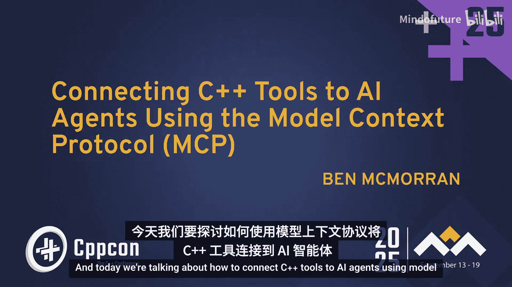
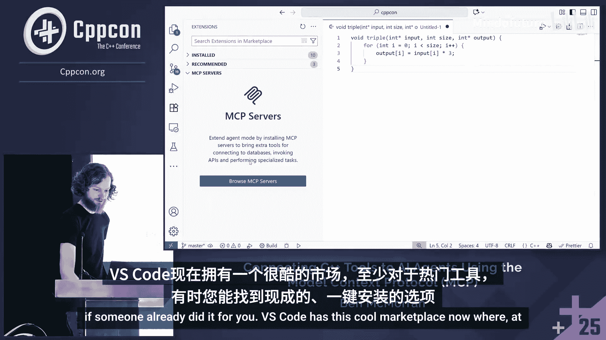
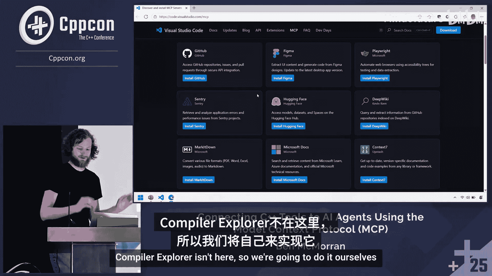
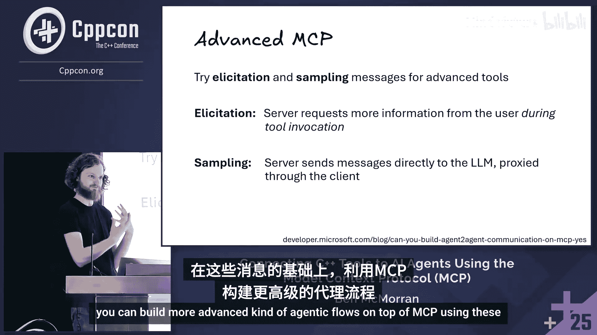

# 023：使用模型上下文协议将C++工具连接到AI智能体





## 概述
在本节课中，我们将学习如何利用模型上下文协议，将C++开发工具连接到AI智能体，从而增强开发体验。我们将从大语言模型与开发工具集成的历史演进开始，逐步理解MCP协议的核心概念、工作原理，并通过一个实际案例演示如何构建一个MCP服务器。

## 从聊天到智能体：开发工具的演进

为了理解MCP是什么以及它为何有用，我们需要回顾一下大语言模型与开发工具集成的演进历程。

### 早期阶段：手动复制粘贴
2022年11月ChatGPT的发布开启了LLM在开发工具中应用的时代。最初，开发者使用方式很简单：将问题连同源代码一起复制粘贴到聊天界面中。例如，修复单元测试时，开发者需要手动输入“帮我修复这个测试”，并粘贴相关代码。

这种方式存在明显问题：需要手动复制代码，且粘贴的代码可能并非真正有问题的部分。

### 集成阶段：上下文自动收集
进入2023年，随着OpenAI等公司开放API，各类产品开始将聊天功能集成到IDE内部。此时，工具可以利用已有的数据源（即“上下文”）来回答问题。用户可以说“帮我修复这个测试，我有一个计算器文件”，客户端会预先获取文件内容并拼接到提示词中。

这种方式有所改进，但用户仍需明确提及文件。

### 检索增强生成阶段
到2023年中，产品开始实现自动上下文收集，即“检索增强生成”。系统能够根据用户问题，自动搜索并关联相关代码文件，无需用户手动指定。

实现方式主要有两种：
1.  **客户端预处理**：通过关键词搜索或向量嵌入等技术，从数据库中检索相关上下文，全部拼接到提示词中。这种方法可能导致上下文过多或搜索不准确。
2.  **多步方法**：先利用LLM本身判断哪些可用上下文与问题最相关，再基于此构建最终提示词。

尽管聊天功能已大大增强，但它仍局限于“回答问题”。用户仍需自行编辑代码、构建和验证修复结果。

### 智能体阶段：工具调用
时间推进到2024年末至2025年初，“编码智能体”开始兴起，它们能够半自主地处理简单的开发内循环任务。其关键技术是“工具调用”。

以下是工具的核心组成部分：
*   **工具元数据**：描述工具的信息，供模型决定是否使用。
    ```json
    {
      "name": "add",
      "description": "Adds two numbers together.",
      "inputSchema": {
        "type": "object",
        "properties": {
          "a": { "type": "number" },
          "b": { "type": "number" }
        }
      }
    }
    ```
*   **实现函数**：执行工具实际功能的编程语言函数。

工具调用的工作原理是，LLM经过训练，能够输出特殊的令牌序列来请求调用工具。客户端执行对应的函数后，将结果返回给LLM，LLM再生成最终回答给用户。

通过结合文件编辑、终端命令执行等工具，就能构建一个简单的智能体。关键在于形成了**闭环反馈**：LLM可以运行命令、观察结果（如构建失败）、编辑文件、再次运行命令，从而迭代解决问题，这比简单的聊天界面强大得多。

## 模型上下文协议：解决工具集成碎片化问题

开发者自然希望为智能体添加自定义工具。同时，IDE厂商也开始提供可扩展的工具接口。然而，这导致了集成碎片化问题：不同的聊天界面（如VS Code、CI系统）和不同的工具提供商（如任务管理系统、构建系统、云平台）形成了复杂的组合矩阵。

模型上下文协议正是为解决此问题而设计，它将N×M的集成复杂度降低到N+M。熟悉开发工具的人会发现，这与语言服务器协议解决的问题非常相似，只是将“编辑器”和“语言服务器”换成了“MCP客户端”和“MCP服务器”。





### MCP协议基础
MCP在底层是一个基于标准IO或HTTP的JSON-RPC协议。JSON-RPC是一种使用JSON进行远程过程调用的机制。基于此协议，通信双方可以用不同的编程语言实现，具有良好的互操作性。

协议包含多种消息类型，但我们将重点关注与工具调用相关的四种核心消息：
1.  `initialize`：客户端与服务器协商支持的能力。
2.  `tools/list`：客户端请求服务器列出可用工具。
3.  `tools/call`：客户端请求调用特定工具。
4.  `tools/result`：服务器返回工具调用结果。

基本的交互流程如下：
1.  客户端发送`initialize`消息进行握手。
2.  客户端发送`tools/list`消息获取工具列表。
3.  根据用户输入，客户端发送`tools/call`消息调用工具。
4.  服务器执行工具后，返回`tools/result`消息。
5.  服务器还可以通知客户端工具列表有更新。

## 实战演示：构建Compiler Explorer MCP服务器

上一节我们介绍了MCP协议的基本原理，本节我们将通过一个实际案例，看看如何构建一个MCP服务器。

假设我们有一个简单的C++函数，用于将数组中的值翻三倍。我们想知道MSVC编译器是否会将其向量化。直接询问AI，它无法给出确切答案，因为它看不到实际的汇编代码。

一个自然的想法是：如果能使用Compiler Explorer（一个在线查看编译器汇编输出的工具）就好了。我们可以构建一个MCP服务器来提供这个功能。

以下是构建此MCP服务器的核心步骤和代码：

首先，包含必要的库并设置服务器传输层（这里使用HTTP）。
```cpp
#include <mcp/server.hpp>
#include <mcp/transport/http.hpp>
...
auto transport = std::make_shared<mcp::transport::HttpTransport>("localhost", 8080);
mcp::Server server(transport);
```

接着，在初始化时声明服务器能力（本例中仅提供工具）。
```cpp
auto init_params = server.getInitParams();
init_params->capabilities->tools = true;
server.setInitParams(std::move(init_params));
```

然后，定义工具的元数据，描述其名称、用途和输入参数。
```cpp
mcp::ToolMetadata tool_meta;
tool_meta.name = "get_assembly";
tool_meta.description = "Provides the assembly that MSVC would produce for given C++ code.";
tool_meta.inputSchema = {
    {"code", mcp::SchemaType::String, "The C++ source code."},
    {"options", mcp::SchemaType::String, "Additional compiler flags (optional)."}
};
```

最后，实现工具的后端函数，该函数调用Compiler Explorer的API并返回结果。
```cpp
auto tool_handler = [](const mcp::ToolInput& input) -> mcp::ToolOutput {
    // 1. 从输入中解析代码和编译选项
    std::string code = input.arguments["code"];
    std::string options = input.arguments.value("options", "");

    // 2. 构造请求，调用Compiler Explorer API
    // （此处为简化示例，实际需使用HTTP客户端库）
    std::string assembly_output = callCompilerExplorerAPI(code, "msvc", options);

    // 3. 返回结果，MCP支持多种类型（文本、图像等），此处返回文本
    return mcp::ToolOutput{
        .content = {{mcp::ContentType::Text, assembly_output}}
    };
};

// 将元数据和处理器注册到服务器
server.registerTool(tool_meta, tool_handler);
server.start();
```

服务器构建完成后，可以使用Anthropic提供的MCP Inspector工具进行测试和调试。在VS Code中，需要在`.vscode/mcp.json`配置文件中添加服务器连接信息。配置成功后，AI智能体就能在对话中看到并使用这个`get_assembly`工具，从而获取准确的汇编代码并分析向量化情况。

## 最佳实践与安全考量

在决定构建和使用MCP服务器时，需要考虑以下几点最佳实践和安全问题。

### 何时不使用MCP
MCP设置相对复杂，在以下情况可能有更简单的选择：
*   **传递少量固定信息**：如代码风格指南、构建说明。优先使用客户端内置的“自定义指令”、“规则”或“提示词文件”功能。
*   **利用现有工具**：如果你的需求可以通过一个简单的Shell脚本调用现有系统实现，那么编写脚本并配以使用说明可能更快。
*   **仅支持单一平台**：如果你只针对VS Code或某个特定IDE，使用其平台特定的扩展API可能更简单、功能更丰富。
*   **高度结构化的工作流**：如果你的流程需要精确控制，直接编写普通程序并在需要时调用LLM API可能更合适。

### 安全警示：致命三重威胁
将工具接入AI系统时，必须警惕“致命三重威胁”，即同时满足以下三个条件：
1.  **访问私有数据**。
2.  **暴露于不受信任的内容**（如来自其他用户的输入）。
3.  **能够进行外部通信或数据渗出**。

如果系统同时具备这三者，就可能通过“提示词注入”攻击导致私有数据泄露。因为LLM无法像区分HTML标签或SQL语句那样，严格区分数据和指令。即使你的单个MCP服务器不满足全部三个条件，也要注意整个聊天上下文是共享的，其他工具服务器可能组合构成威胁。

### 优化工具设计
为了让LLM更好地使用你的工具，请注意：
*   **编写清晰的工具描述**：LLM仅通过元数据了解工具，因此描述至关重要。可以参考成熟工具（如VS Code内置工具）的描述，甚至可以让LLM协助撰写描述。
*   **提供友好的错误信息**：LLM可能错误调用工具。返回清晰、可读的错误信息，能帮助它自我纠正并再次尝试。
*   **设计LLM友好的输入结构**：例如，一个查找代码定义的工具，接受“符号名称”作为输入比接受“文件偏移量”更友好，因为LLM不擅长精确计算字符位置。
*   **建立测试用例集**：用于评估工具被正确调用的频率，并优化描述。

### MCP高级功能
对于更复杂的智能体，MCP还提供了其他有用的消息类型：
*   **`elicitation`**：允许工具在运行时直接向用户请求更多信息，无需通过LLM中转。
*   **`sampling`**：允许服务器利用客户端已有的LLM连接发送自己的请求，例如用于在返回前总结大量数据。




## 总结
本节课我们一起学习了如何利用模型上下文协议将C++工具连接到AI智能体。我们从开发工具与AI集成的历史演进讲起，理解了工具调用的关键性。然后，我们深入探讨了MCP协议如何解决工具集成的碎片化问题，并详细解析了其基于JSON-RPC的工作原理。通过一个构建Compiler Explorer MCP服务器的实战演示，我们掌握了创建自定义工具的基本步骤。最后，我们讨论了何时该用或不该用MCP、必须重视的安全威胁“致命三重威胁”，以及如何设计更易用、更强大的工具。希望本教程能帮助你开始探索利用MCP增强自己的开发工作流。