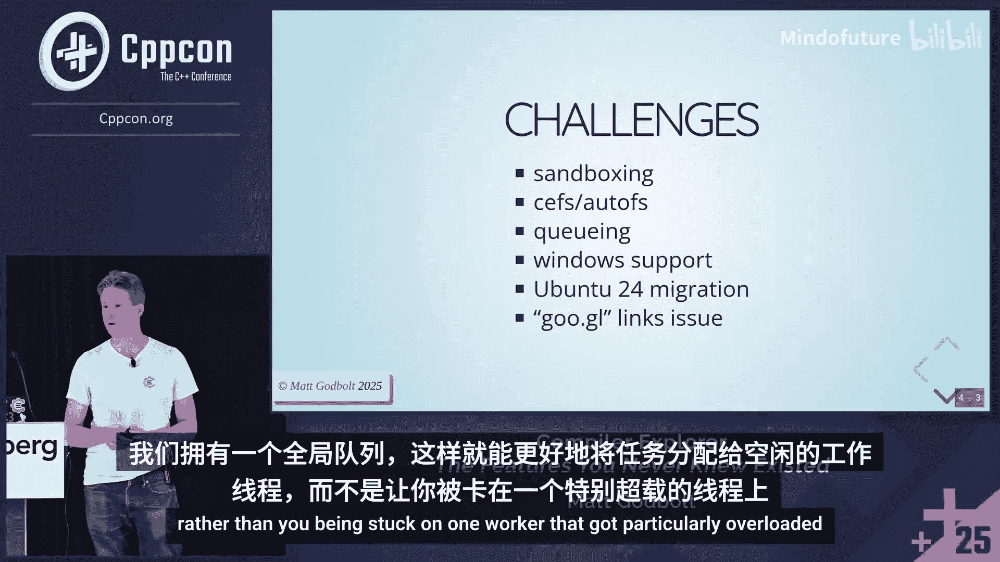

# 024：你从未知晓的功能 🛠️


在本教程中，我们将跟随 Matt Godbolt 在 CppCon 2025 上的演讲，深入探索 Compiler Explorer 这个强大的在线工具。我们将学习其历史、核心界面、各种高级功能以及幕后工作原理。无论你是初学者还是经验丰富的开发者，本教程都将帮助你更高效地使用 Compiler Explorer 来分析和理解代码编译。

## 历史与概述 📜

Compiler Explorer 始于 2012 年，最初是 Matt Godbolt 在 DRW 公司内部开发的一个小工具。当时，他与上司就 C++ 范围 for 循环的性能问题产生了争论。为了验证观点，他编写了一个 shell 脚本，在终端一侧运行编译器并查看汇编输出，另一侧则用 Vim 编辑代码。这种即时对比的方式非常有效，于是他将其整合成了一个简单的网页应用。

最初，这个网站被命名为 “Interactive Compiler”，并托管在他的个人域名下。随着工具支持的语言和编译器越来越多（从最初的 GCC 和 Clang 扩展到如今超过 5000 个编译器、80 种语言），它逐渐演变成了我们今天熟知的 Compiler Explorer。

如今，Compiler Explorer 每月处理数千万次编译，背后有一个优秀的团队和赞助商支持其运营。它已从一个简单的内部工具，成长为全球开发者不可或缺的代码分析平台。

## 核心界面导览 🖥️

上一节我们回顾了 Compiler Explorer 的历史，本节中我们来看看它的核心用户界面。界面主要分为代码编辑区和汇编输出区。

代码编辑区在左侧，你可以在这里编写 C++、Rust 等多种语言的代码。右侧是汇编输出区，显示所选编译器为你的代码生成的汇编指令。两个区域通过颜色高亮进行关联：鼠标悬停在代码的某一行或某个变量上，右侧对应的汇编指令也会高亮显示，反之亦然。

以下是界面中一些关键元素的介绍：

*   **编译状态指示器**：编辑区上方有一个圆形图标。绿色表示编译成功，黄色表示有警告，红色表示编译错误。点击这个图标可以查看发送给编译器的完整命令行参数，这在向编译器项目报告 bug 时非常有用。
*   **编译器选择下拉框**：你可以从这里选择不同的编译器（如 GCC、Clang、MSVC）及其版本。由于编译器数量庞大，你可以使用搜索框进行模糊查找（例如输入 `clang x86 trunk`），也可以将常用的编译器标记为“收藏”以便快速访问。
*   **编译器选项输入框**：你可以在这里添加编译标志，例如 `-O3`、`-Wall` 等。如果选项很多，可以点击下拉箭头打开详细视图，像编辑文本一样进行管理。
*   **视图管理按钮**：`Add new...` 和 `Add tool...` 按钮用于向结果面板添加新的视图。`Add new...` 通常用于需要介入编译过程的视图（如栈使用分析），而 `Add tool...` 用于编译后对二进制文件进行分析的工具（如 `readelf`、`nm`）。

所有面板都是可拖拽的，你可以自由排列它们的位置，甚至可以将其堆叠成标签页形式。每个面板都可以被重命名、最大化或克隆，方便你管理复杂的对比场景。

## 实用功能与工具详解 🔧

了解了基本界面后，本节我们将探索一些能极大提升效率的实用功能和工具。

### 1. 代码对比与多编译器检查

Compiler Explorer 非常适合对比不同编译器或不同优化选项下的代码生成结果。

*   **差异视图**：添加一个 “Diff” 视图，可以并排对比两个编译器（或同一编译器不同设置下）生成的汇编代码差异。这对于理解优化选择或平台差异非常有帮助。
*   **一致性视图**：如果你需要快速检查一段代码在多个编译器上是否能通过编译，可以使用 “Conformance” 视图。它会以紧凑列表的形式显示多个编译器的编译状态（绿色对勾或红色错误），点击状态图标可以快速查看详细信息。

### 2. 预处理器与栈使用分析

有时你需要查看宏展开后的代码或分析函数的栈内存使用情况。

*   **预处理器输出**：通过 `Add tool...` 添加 “Preprocessor” 视图，可以查看经过预处理器处理后的代码，这对于调试复杂的宏定义非常有用。
*   **栈使用分析**：通过 `Add new...` 添加 “Stack usage” 视图，可以估算函数及其调用树的栈内存使用情况。这能帮助你识别潜在的大栈对象，指导优化决策。

### 3. 二进制文件分析工具

编译生成目标文件或可执行文件后，你可以使用一系列工具进行分析。

*   **`nm`**：列出目标文件中的符号。
*   **`readelf`**：显示 ELF 格式二进制文件的详细信息，如文件头、节头、动态链接信息等。
*   **`objdump`**：反汇编二进制文件。
*   **查看重定位表**：当编译为目标文件（`.o`）时，可以查看重定位条目，了解链接器将如何修补指令中的地址。

### 4. 编译器优化探索

Compiler Explorer 提供了独特的方式来窥探编译器的优化过程。

*   **架构与标准覆盖**：通过 “Overrides” 按钮，你可以轻松切换编译目标架构（如 `-march=skylake`）或 C++ 语言标准版本（如 `-std=c++20`），无需记忆复杂的命令行标志。
*   **LLVM 优化管道**（针对 Clang）：添加 “LLVM Opt Pipeline” 视图，可以逐步查看 LLVM 编译器在优化过程中，中间表示（IR）是如何被一系列 Pass 改变的。你可以点击任何一个产生变化的 Pass，查看优化前后的具体 IR 代码，是学习编译器优化的绝佳窗口。

## 代码执行与性能分析 ⚡

上一节我们介绍了静态分析工具，本节中我们来看看如何动态运行代码并进行底层性能分析。

### 1. 执行代码

Compiler Explorer 允许你在沙箱中安全地运行代码。

*   **基本执行**：将输出模式切换到 “Execute the code”，即可运行程序并查看标准输出。你可以在 “Arguments” 输入框中指定命令行参数，在 “Stdin” 框中输入标准输入内容。
*   **高级执行视图**：通过 `Add new...` 添加一个 “Executor” 视图，可以获得更专注的执行环境，方便单独管理执行参数和输入输出。
*   **调试辅助**：你可以启用 `libsegfault` 来在程序崩溃时获取栈回溯信息，也可以启用 `heaptrack` 来动态分析堆内存分配情况。

### 2. 微架构性能分析

对于追求极致性能的代码，你可以进行指令级分析。

*   **LLVM-MCA 分析**：将语言切换到 “Analysis” 并选择 “LLVM-MCA”，它可以模拟指定代码片段（通常是内循环）在特定 CPU 微架构上的执行情况。它会给出总周期数、指令吞吐量等预测数据。
*   **时间线视图**：在 LLVM-MCA 分析中添加 `-timeline` 标志，可以生成一个 ASCII 艺术风格的时间线图，直观展示指令在每个周期内的解码、执行、退役等状态，帮助你理解指令级并行和 CPU 流水线行为。

**示例：使用 LLVM-MCA 分析循环**
```cpp
// 假设这是你要分析的内循环代码
for (int i = 0; i < N; ++i) {
    sum += data[i] * data[i];
}
```
通过将其放入独立的分析窗口并选择 LLVM-MCA 工具，你可以获得该循环体的性能预测报告。

## 项目模式与高级技巧 🚀

Compiler Explorer 不仅限于单文件分析，还支持简单的多文件项目。

### 1. IDE / 项目模式

通过 `Add new...` 添加 “IDE” 视图，你可以进入项目模式。


*   **管理多个文件**：在左侧的文件树中，你可以添加多个源文件、头文件甚至数据文件。所有文件会被上传到一个临时目录中。
*   **基于项目的编译**：在 IDE 视图下添加的编译器，会看到项目中的所有文件，从而可以编译和链接多文件项目。
*   **使用 CMake**：你甚至可以添加 `CMakeLists.txt` 文件，让 Compiler Explorer 调用 CMake 来构建你的项目。网站提供了一些 CMake 项目模板，帮助你快速上手。

### 2. 实用技巧与幕后

*   **个性化设置**：所有设置（如主题、编译延迟、默认语言）都保存在浏览器的本地存储中。你可以通过 “Reset code & UI layout” 快速恢复默认界面。
*   **短链接与状态保存**：生成的分享链接（如 `godbolt.org/z/...`）会长期有效。你也可以将当前的窗口布局和代码保存为本地模板。
*   **多域名技巧**：`godbolt.org` 是主域名。访问其子域名（如 `rust.godbolt.org`）会默认打开对应语言的编辑器。你也可以使用 `compiler-explorer.com` 或 `gcc.godbolt.org` 等域名，它们对应独立的本地设置，方便你在不同配置间切换。
*   **幕后架构**：Compiler Explorer 运行在 AWS 上，使用沙箱技术隔离用户代码以确保安全。它正在从基于机器本地队列的架构，转向全局队列系统，以更公平、高效地分配编译任务，减少用户等待时间。

## 总结 📝

在本教程中，我们一起深入探索了 Compiler Explorer 这个强大工具。我们从其诞生历史开始，逐步学习了核心界面的操作，包括代码与汇编的关联查看、多编译器管理和面板自定义。

接着，我们探讨了一系列高级功能：如何对比代码差异、分析预处理器输出和栈使用情况、使用二进制工具分析目标文件，以及通过 LLVM 优化管道理解编译器内部工作。我们还学习了如何在沙箱中安全执行代码，并利用 LLVM-MCA 进行底层的微架构性能分析。

最后，我们介绍了用于多文件项目的 IDE 模式，并分享了一些提高效率的实用技巧和关于其背后架构的见解。




希望本教程能帮助你解锁 Compiler Explorer 的全部潜力，让它成为你学习、调试和优化代码的得力助手。