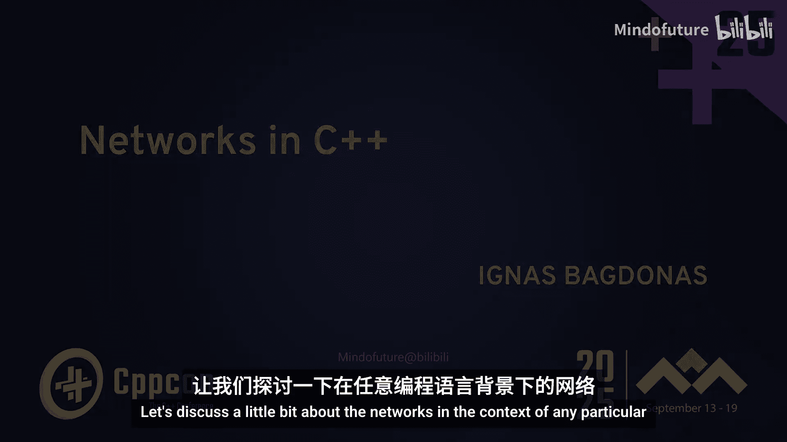
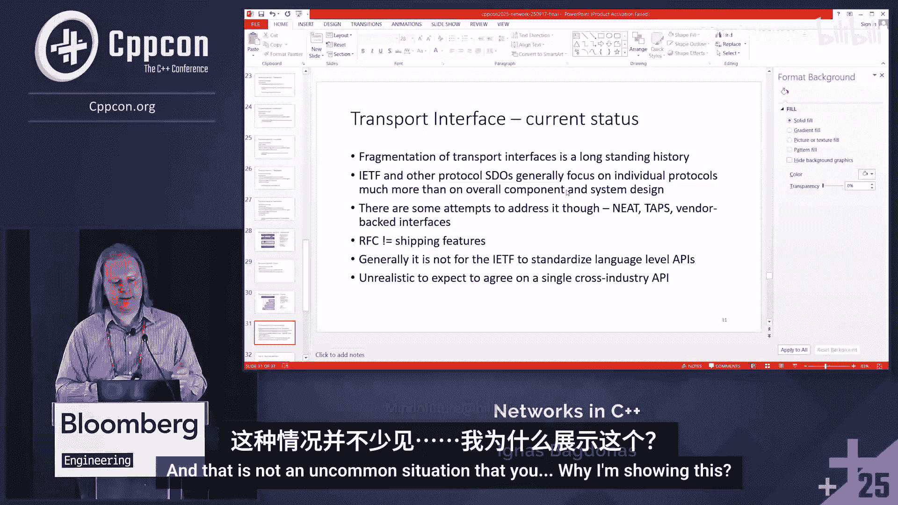
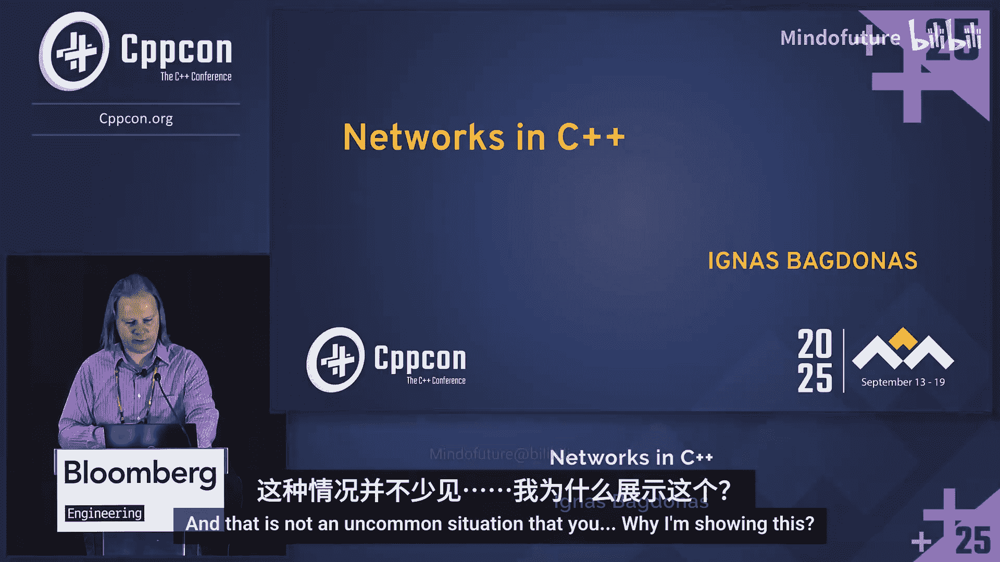
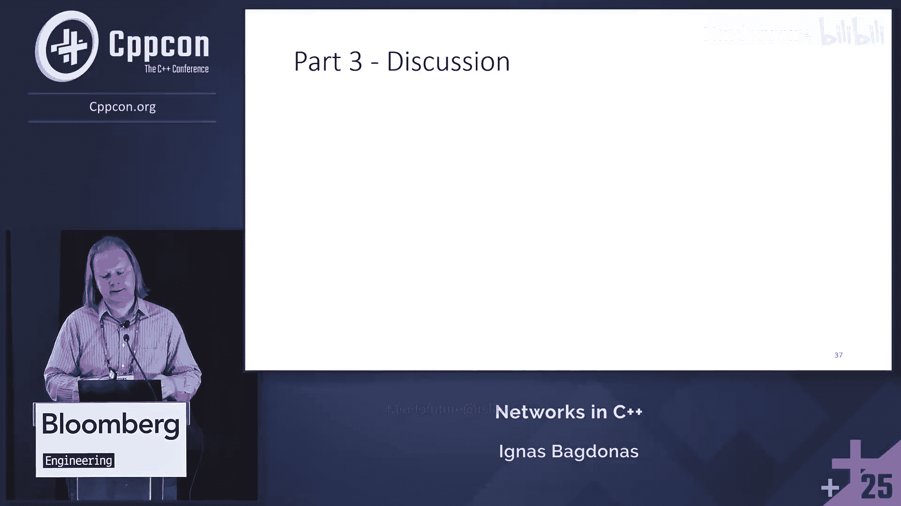

# 025：C++中的网络——实际正在改变什么

在本节课中，我们将探讨现代网络传输协议的发展，以及它们如何对C++等编程语言的网络编程接口提出新的挑战。我们将分析现有接口（如BSD Sockets）的局限性，并讨论设计一个更通用、更符合现代需求的网络传输接口的必要性和可能性。

## 概述：网络接口的现状与挑战

网络通常被视为一个简单的“管道”，应用程序通过操作系统提供的接口（如BSD Sockets）发送和接收数据包，而很少关心底层细节。然而，过去几十年间，新的传输协议（如QUIC、SCTP）带来了新的功能，试图在现有接口之上建模这些功能时，会遇到两个主要限制：一是难以引入新功能，二是将复杂性推给了应用程序。40年前标准化的接口已无法充分利用新传输协议的潜力。

## 现有协议与接口分析

上一节我们介绍了网络接口面临的整体挑战，本节中我们来看看具体有哪些现有协议，以及它们暴露出的接口问题。

### TCP协议
TCP是绝对主流的协议，它模拟逻辑会话并维护内部状态（TCP控制块）。然而，通过BSD Sockets接口使用TCP时，一些问题开始显现：
*   **保活操作**：无法轻松地在数据平面上发送零字节消息来保持连接活跃。虽然可以通过套接字选项设置内部TCP保活消息，但这并非应用程序可见的外部操作。
*   **路径MTU**：可以查询当前连接的路径MTU，但如果底层网络发生变化（例如添加MPLS标签导致MTU减小），没有简单的方法能通知应用程序路径层参数已改变。
*   **认证选项**：如TCP-MD5和TCP-AO，用于防止会话重放攻击，但启用它们需要使用特定的、平台差异很大的套接字选项，缺乏可互操作的通用接口。
*   **快速打开**：允许在TCP会话建立的初始SYN包中携带有效载荷，但这不属于常规数据接口，需要作为异常情况处理。
*   **拥塞控制**：TCP拥有灵活多样的拥塞控制机制，但其内部状态和控制参数无法直接访问，只能通过平台特定的套接字选项或扩展来获取，这同样属于异常路径。

因此，拥有一个通用接口会非常有益，该接口既能用于数据操作（发送/接收），也能以相对统一的方式获取TCP会话的动态属性信息。

### 其他传输协议
让我们继续分析其他常见传输协议及其接口特点。

以下是其他一些重要传输协议及其接口挑战：
*   **MPTCP**：使用多个并行TCP连接，在应用层看来是一个逻辑会话。其拥塞控制和调优方式不同，需要特定的接口来暴露和调整这些信息。
*   **UDP**：简单的数据报协议。发送后无法简单获知数据是否到达，且拥塞控制留给应用程序处理。当前接口不允许以简单方式查询底层路径属性。
*   **UDPLite**：一种小众协议，校验和较短且不覆盖部分载荷。它定义了可用的错误接口，通知应用程序收到了校验和错误的数据包，由应用程序决定如何处理。
*   **TLS/DTLS**：TLS不是独立协议，而是一个建立在TCP之上的协议栈。虽然它简化了安全凭证处理，但其库实现（如OpenSSL）对事件处理有自己的一套看法，可能与应用程序的期望冲突，使得数据发送/接收的处理变得复杂且受限制。DTLS在UDP上实现，存在类似问题。
*   **SCTP**：一种小众协议，用于移动无线控制平面。它设计了可靠性，并定义了“流”（子通道），允许并发承载对象或有效载荷。其接口不再是一个套接字或文件描述符，而是具有逻辑分离的实体，如何映射到BSD Sockets上并不明确，通常依赖于实现。
*   **InfiniBand/RDMA**：高性能计算领域的协议。它采用了**队列模型**：发送队列、接收队列和完成队列。应用程序提交一个描述符（指定源地址、目标地址等），库在后台完成传输。当操作完成时，会在完成队列收到通知。这与Linux的io_uring理念相似。
*   **光纤通道**：用于存储网络。其设计正确的一点是**命名与寻址的集成**。端点具有名称，并通过名称服务动态地将名称转换为拓扑相关的地址标识符。这类似于将DNS集成到IP世界中，作为一个统一的连接服务。
*   **QUIC**：一个相对较新但流量占比很高的协议，基于UDP，集成了TLS，并模拟了多路TCP连接。它支持多通道、灵活的拥塞控制和服务质量参数。大多数QUIC实现在用户空间，这带来了与TLS库集成和事件处理的接口挑战。

## 通用接口的设计思路

在分析了各种协议的特定需求后，我们可以尝试归纳出设计一个通用传输接口所需的核心要素。

### 核心需求归纳
基于以上分析，我们可以从两个维度概括需求：
1.  **跨协议通用需求**：
    *   **会话建立**：如何建立两点间的传输会话。需要更注重基于DNS名称的标识，而不仅仅是IP地址。
    *   **参数配置**：需要以更统一的方式信令传输特定参数和配置。**基于描述符的方案**是一个可能的候选，描述符定义所有传输协议的超集，特定实例从中选取所需部分。
    *   **拥塞感知**：需要一个接口来提供网络当前状态的可见性，并可能进行调整。
2.  **接口模型转变**：
    *   **从同步到异步队列模型**：BSD Sockets接口本质上是同步的。一个更实用的模型是**异步队列模型**，应用程序将消息或描述符发布到队列，然后继续执行其他操作，随后从另一个队列（如完成队列）查询通知。这简化了应用程序逻辑，无需处理多个异常。
    *   **统一事件处理**：需要能够使用现有或熟悉的事件通知系统（如epoll, kqueue）。描述符机制可以很好地抽象子通道。
    *   **描述符抽象**：将子通道也表示为描述符可能是正确的方法。

### 功能层与架构设想
如果尝试对此进行分层和绘制图表，可以设想以下架构：
*   **传输服务参数**：这是一个预配置的概念。应用程序预先设置连接属性（如证书、路由参数、服务质量参数），获得一个上下文标识符。
*   **连接建立**：通过提供名称并引用上述上下文来建立连接。
*   **连接关闭**：明确地关闭传输连接。
*   **集成DNS**：DNS被集成到传输层，应用程序主要处理名称，而非直接操作IP地址。
*   **底层基础设施**：现有的数据包层和传输层基础设施，将一切视为数据包处理。

关于向后兼容性，BSD Sockets可以在新接口之上建模，或者作为独立的子系统并行存在，供不需要新功能的用例使用。

## 当前进展与行业现实

那么，目前在这方面有哪些努力和现实情况呢？

现实情况是，大多数传输协议的实现主要关注其特定协议本身，缺乏端到端的视角来整合多种协议。这导致了接口各异、事件处理方法不同的现状。
*   **IETF的尝试**：如“通用传输接口”（TAPS, Transport Services）工作组，旨在定义一个涵盖所有传输的通用接口模型。然而，这类努力有时受学术驱动影响较大，且IETF发布RFC并不代表业界一定会广泛采纳和产品化。
*   **其他倡议**：如NEAT（新扩展传输API），主要由大学驱动。此外，网络系统供应商和操作系统供应商也有各自定义的接口，导致了碎片化。
*   **从编程语言侧入手**：鉴于IETF标准与实际实现之间的差距，从特定编程语言（如C++）侧尝试定义一个实际可用的网络传输接口库，可能更接近现实使用场景。这样的库可以与现有的并发机制集成，并为当今的主流传输协议提供近乎通用的接口。

## 总结与展望

本节课中我们一起学习了现代网络传输协议对编程接口提出的新挑战。我们分析了从TCP、QUIC到RDMA等多种协议的接口痛点，认识到40年前的BSD Sockets API在应对新功能时存在局限性。核心问题在于同步调用模型、缺乏统一的参数配置和拥塞控制接口，以及对命名寻址的支持不足。

设计新接口的关键思路是转向**异步队列模型**（类似io_uring或InfiniBand的提交/完成队列），采用**基于描述符的抽象**来统一数据操作和事件通知，并**深度集成DNS命名**。虽然IETF有过TAPS等标准化尝试，但从**编程语言库**的层面着手，定义灵活、可适配不同底层平台和并发框架的接口，可能更具实践意义。

这项工作并非适用于所有应用，但对于需要处理大量并发连接、使用多种现代传输协议（如HTTP/3 over QUIC）的中间件开发者而言，一个设计良好的通用网络库能显著降低复杂性和提升可移植性。