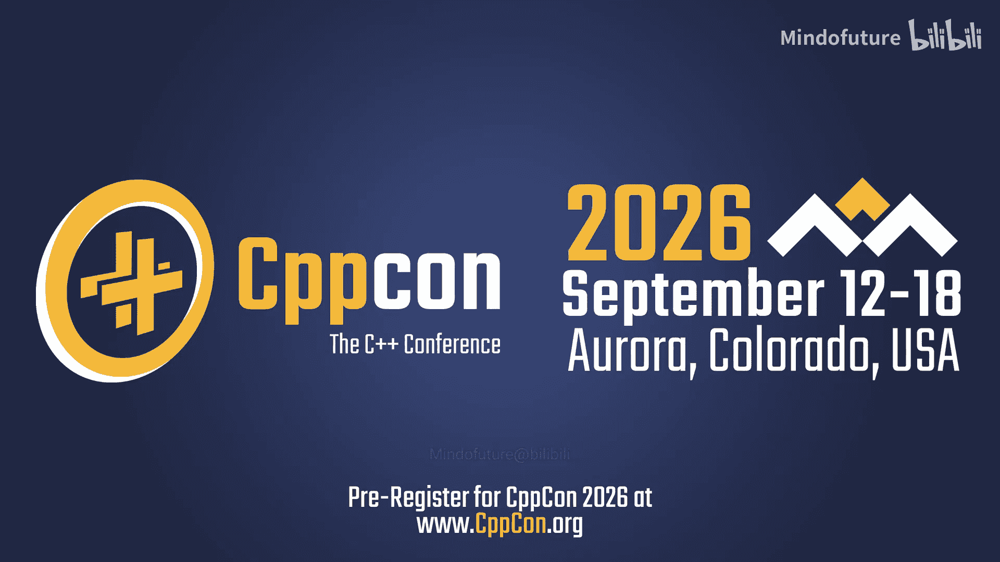
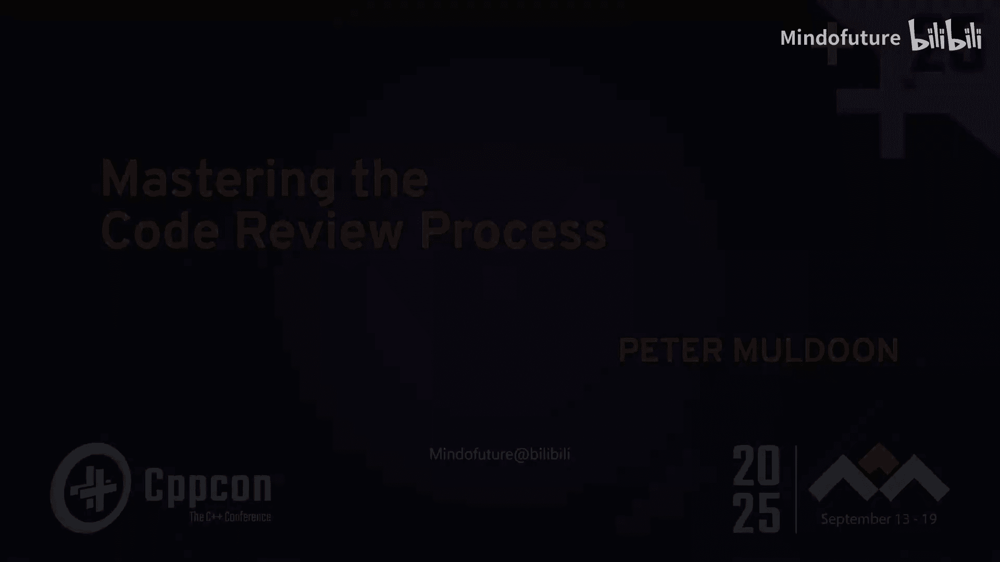

# 026：掌握代码审查流程

在本节课中，我们将学习如何构建一个有效的代码审查流程，以平衡代码质量、开发速度和代码库的长期可持续性。我们将探讨流程的核心要素、如何衡量其有效性，以及如何培养积极的审查文化。

## 概述

代码审查不仅仅是检查代码语法，更是一个涉及流程、协作和文化的系统工程。一个良好的审查流程能提升代码质量、加速功能交付、促进知识共享，并确保代码库的长期健康。

## 演讲者介绍

我是 Pete Muldoon，自1991年开始使用C++。我的职业生涯主要在系统分析和架构领域，拥有21年的咨询经验，接触过许多不同的公司和团队。过去十年，我在彭博社工作，目前负责处理全球交易所信息的“行情系统”。我喜欢探讨实用的软件工程原则及其在现实问题中的应用。

## 代码审查的本质与目标

上一节我们介绍了演讲背景，本节中我们来看看代码审查的核心定义和目标。

代码审查本质上是一种**技术性评审**。它是对自己或他人工作的正式分析，旨在提供建设性的判断，指出优缺点，而非单纯挑错。

代码审查主要有三种类型：
*   **建设性**：指出问题并提供解决方案。
*   **指导性**：分享新知识或最佳实践，提供学习机会。
*   **破坏性**：仅进行负面批评，通常无益。

那么，代码审查的核心目标是什么？
*   **提升质量**：确保代码正确、可维护且符合需求。
*   **功能交付**：最终目标是将有价值的业务功能可靠地投入生产环境。
*   **维护代码库长期健康**：防止代码库因只关注短期功能而腐化，避免未来重写。
*   **控制时间**：在保证质量的前提下，追求合理的审查和交付速度。

此外，代码审查还有一些不那么明显但同样重要的目标：
*   **促进知识共享与教育**。
*   **建立共同所有权**：审查者需对合并的代码承担共同责任。
*   **分散工作负载，培养团队协作感**。

## 代码审查在工程实践中的地位

上一节我们明确了审查的目标，本节中我们来看看它在整个软件工程中扮演的角色。

数据显示，拥有良好的代码审查流程是提升代码质量的首要方法。在工程实践中：
*   开发者**阅读代码的时间远多于编写代码**。
*   代码审查是保持代码库可持续健康的**最后一道防线**。
*   它可以作为**最佳实践的放大器**，在团队中传播知识。
*   目前，**人工智能（AI）难以在短期内完全替代人工审查**，尤其是在代码结构和设计层面。AI更适合处理表面细节，作为辅助工具。

## 代码审查中的矛盾与平衡

在实践中，代码审查流程常面临几组相互矛盾的指令，需要在其中找到平衡：

1.  **标准严格度**：过于僵化的标准会扼杀创造力；过于宽松则导致混乱。
2.  **审查时效**：仓促审查可能导致遗漏；拖延审查则会阻碍交付。
3.  **变更范围**：过于最小化的变更可能错失改进机会；过于宽泛的变更则可能引入无关修改，增加风险。
4.  **新特性采用**：是坚持陈旧的“保守一致性”，还是积极采用新的语言特性和工程实践。

找到这些矛盾之间的平衡点，是构建高效、协作的审查流程的关键。

## 低效代码审查的后果

一个低效的审查流程会带来诸多负面影响：
*   **生产环境故障和缺陷**。
*   **代码质量低下且不统一**，尤其是在跨团队时。
*   **开发速度缓慢**，PR（拉取请求）长期闲置或过于复杂耗时。
*   **任务覆盖不全面**，开发者因害怕破坏代码而不敢进行必要的重构。
*   **陷入“自行车棚”效应**，即过度争论琐碎细节而忽视核心问题。

## 提交审查前的准备

在请求他人审查之前，开发者应做好充分准备，以尊重审查者的时间并提高效率。

以下是提交前应完成的检查清单：
*   **运行静态代码分析**：消除所有编译警告。
*   **确保通过所有单元测试和集成测试**。
*   **如果变更了可观察行为，请添加新测试**。
*   **进行自我审查**：检查并修正明显的错误。
*   **考虑使用AI辅助**进行初步检查。

此外，为审查者提供清晰的信息至关重要：
*   **编写恰当的标题和描述**：清晰说明**做了什么**、**为什么做**以及**如何验证**变更有效。
*   **降低审查者的认知负荷**：
    *   再次强调**自我审查**。
    *   **限制PR的范围**，避免巨型PR。
    *   如果变更涉及多个文件，**明确指出核心变更的位置**。

关于**草稿PR**：它适用于获取早期反馈、确认方向或了解历史遗留问题，不应被合并。一旦转为正式PR，就应遵循完整的审查流程。

## 审查流程的时间线与规模控制

一个典型的代码审查生命周期包括：开发 -> 提交审查 -> 收到初始反馈 -> 修改并回复 -> 等待最终批准 -> 合并。

**PR的规模至关重要**。过大的变更会带来诸多问题：
*   审查者难以在脑中构建完整上下文，无法提供高质量反馈。
*   审查者因担心风险而不敢轻易批准。
*   代码库越是非结构化（通常历史越久），变更集就应该越小。
*   难以理解的变更本质上风险更高。

应将格式化（如空格、缩进、重命名）等变更放在独立的PR中先行合并，以便专注于实质性的代码修改。

## 审查流程的时效管理

**任何变更只有在生产环境中运行才具有价值**。因此，缩短审查周期至关重要。

建议采取以下措施：
*   设定明确的**启动审查时限**（例如24小时内必须开始审查）。
*   在每日站会等场合**保持流程可见性**，同步审查状态。
*   明确**合并PR是开发者的责任**。
*   将**代码审查的优先级置于编写新代码之上**（特殊情况除外），防止流程堵塞。
*   数据显示，**每日进行审查的团队满意度最高**。

当然，指南适用于大多数情况，需为特殊情况保留灵活性。

## 审查反馈的分类与表达

在具体审查代码时，反馈可以清晰分为几类，并用表情符号等标记，以避免歧义：

1.  **必须修复的问题**：代码存在错误或结构性问题。`🚨`
2.  **建议性替代方案**：存在可能更好的模式或实现。`🔧`
3.  **细微之处**：个人偏好的风格或微小优化建议。`📌`
4.  **提问**：对代码意图或实现不理解，需要澄清。`❓`
5.  **赞扬**：对出色的代码表示认可。`👍`

清晰分类有助于作者快速理解反馈的紧急性和性质。反馈时应**对事不对人**，使用具体、建设性的语言，多提问，而非直接指责。

## 审查中应关注什么

在审查过程中，应关注以下方面：
*   **标准化基础项**：使用简短的检查清单来统一团队的基本要求。
*   **保持代码一致性**：确保新代码与周围代码风格一致，但不要以“一致性”为名延续不良实践。
*   **视审查为协作**：乐于接受有能力审查者的意见，将其视为学习机会。
*   **培养审查技能**：在团队内进行培训和分享。
*   **持续教育**：关注语言和工程实践的新发展。
*   **重点审查测试代码**：检查测试是否覆盖了正常、异常路径及边界情况，测试命名是否清晰，是否使用了魔数。

## 如何衡量流程有效性

要改进流程，必须进行度量。以下是一些可衡量的指标：
*   **测试覆盖率**：包含测试的PR数量占总PR数的比例。
*   **PR吞吐量**：已创建PR与已合并PR的数量对比，识别积压。
*   **审查时间**：从PR创建到收到首次评论/完成合并的平均时间。
*   **团队满意度调查**。

数据显示，拥有度量指标并定期审视的团队，对审查流程的满意度是其他团队的三倍。

## 根据变更影响调整审查策略

并非所有PR都相同，应根据其“爆炸半径”调整审查策略：
*   **小型功能变更**：低风险，由同行和团队负责人审查即可。
*   **大型架构变更**：高风险，需引入了解历史背景的“历史学家”和精通现代架构的专家进行审查。
*   **远程协作与多人审查**：对于重要变更，应要求多于一名审查者。
*   **设计评审**：对于重大变更，可在编写代码前进行设计评审。
*   **审查会议**：对于存在争议或非常重要的变更，可召开审查会议进行集体讨论。

## 培养积极的审查文化

要建立良好的审查文化，可以采取以下措施：
*   **制定并使用简短的检查清单**，标准化流程，减少争议。
*   **进行代码审查辅导和结对编程**。
*   **定期举行团队评审走查**，以教育为目的共同审查PR。
*   **运行并分享度量指标**，用数据驱动改进。
*   **给予建设性反馈**，具体、对事不对人，并赞扬好的代码。
*   **设定共同期望**，让所有团队成员参与流程，庆祝优秀的PR和有益的审查。

## 利用AI辅助代码审查

AI可以自动化一些低风险、模式固定的代码转换任务，从而解放人力去关注更复杂的设计问题。例如：
*   将 `virtual` 替换为 `override`。
*   将 `typedef` 替换为 `using`。
*   将迭代器循环转换为范围 `for` 循环。
*   应用 `const`、`noexcept` 等。

关键是为AI操作设置严格的**防护栏**，并分步骤进行，避免一次性进行过多转换导致代码混乱。AI在此处是强大的辅助工具，而非决策者。

## 总结与行动号召

本节课中我们一起学习了如何构建一个平衡质量、速度和可持续性的代码审查流程。

总而言之，代码审查旨在**提升代码质量并交付产品**。它是一个**指导新成员、促进协作的机会**。我们应追求**基于指南而非个人偏好的客观审查**，这能带来更好的解决方案和更高的团队生产力。

最后，请大家记住：**代码审查关乎整个流程，而不仅仅是代码本身**。我们需要**承认并承担起作为审查者的责任**。请审视并改进你所在团队的审查流程。

---
*注：本教程根据Pete Muldoon在CppCon 2025的演讲《Mastering the Code Review Process》内容整理，保留了原演讲的每一句话的核心含义，并按照要求进行了结构化、简化和格式优化。*