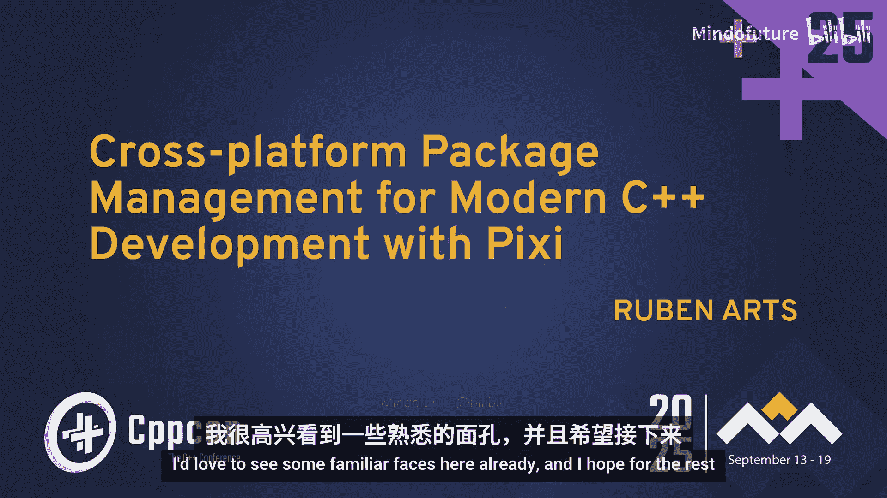
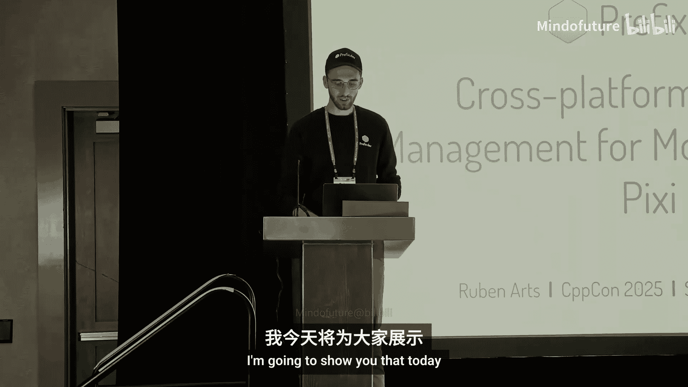
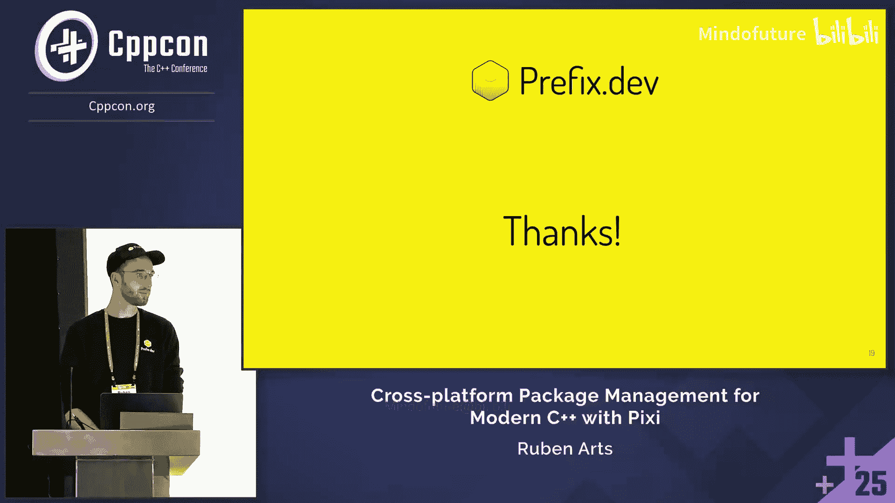
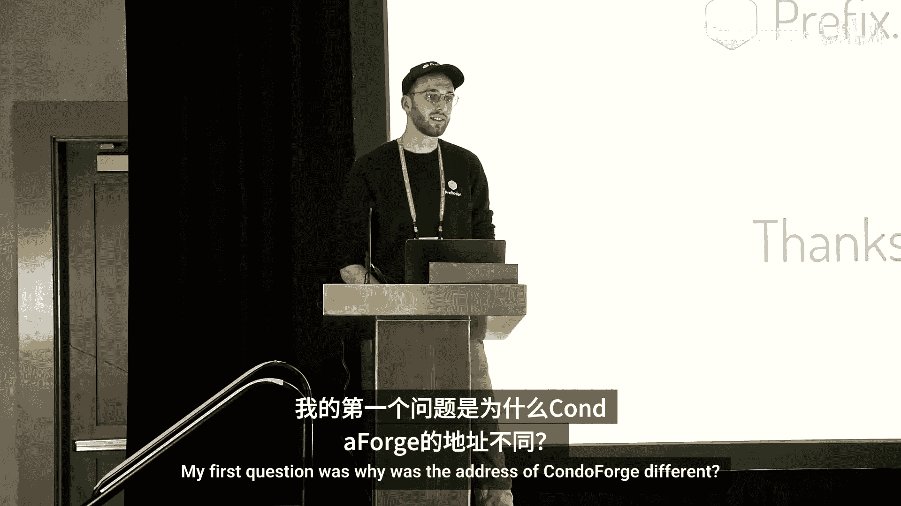
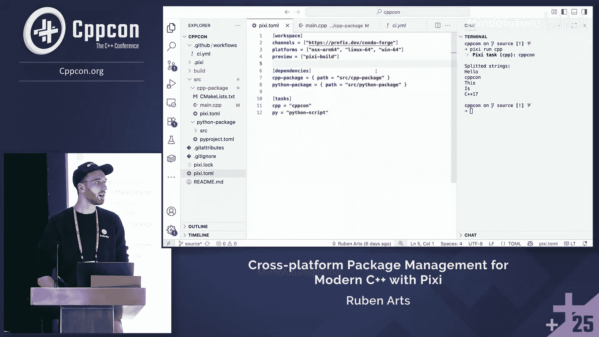
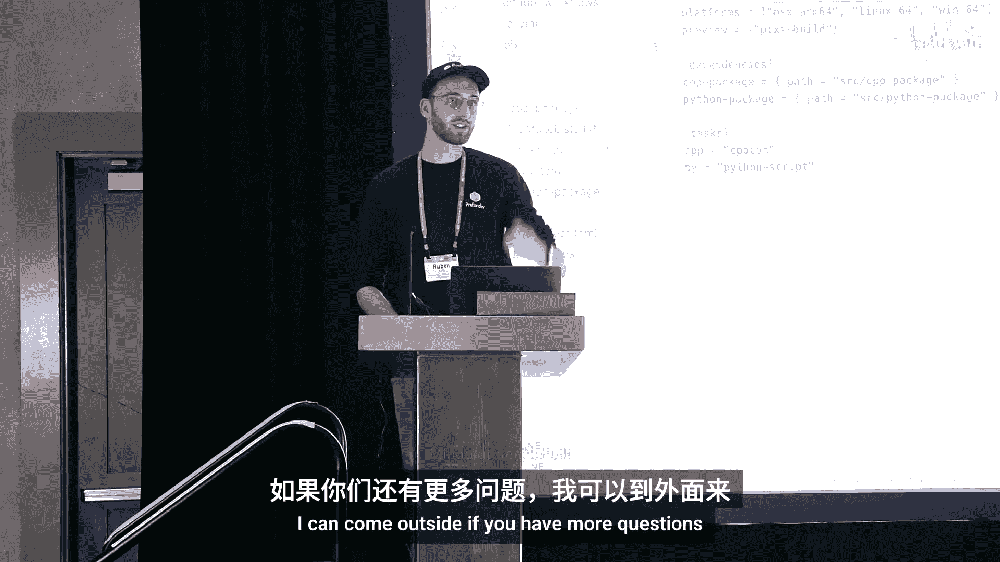

# 027：使用 Pixi 进行现代 C++ 开发的跨平台包管理





## 概述

在本教程中，我们将学习如何使用 Pixi，一个强大的跨平台包管理工具，来简化和优化现代 C++ 项目的开发工作流。Pixi 不仅支持 C++，还支持多种语言和工具，并专注于提供可复现的开发环境。

---

## 什么是 Pixi？🚀

Pixi 是一个跨平台的包管理工具。它并非专为 C++ 设计，而是一个通用的包管理器，适用于包括 C++、Python、Rust 在内的多种语言。Pixi 的核心优势在于其跨平台性（支持 Windows、macOS 和 Linux）、对二进制和源码依赖的支持，以及对环境可复现性的高度重视。

---

## Pixi 的优势与用例 💡

上一节我们介绍了 Pixi 的基本概念，本节中我们来看看它为何值得关注，以及一些实际的应用案例。

Pixi 可以像 Homebrew、apt-get 或 Winget 等系统包管理器一样工作，但它能管理任何语言、任何操作系统的包。一个关键用例是 **FreeCAD**，这是一个开源的 C++ CAD 设计程序。使用 Pixi 后，其编译说明从冗长的平台特定指南，简化为几条跨平台命令，极大地简化了贡献者和用户的入门流程。

此外，Pixi 还附带一个名为 **Pixi Global** 的工具，用于在您的机器上安装和管理开发工具（如 Git、Zed 编辑器、conda 等）。它会将每个工具安装在独立的环境中，避免版本冲突，并且无需激活即可使用。

---

## Pixi 工作空间实战演示 🛠️

了解了 Pixi 的优势后，本节我们将通过一个实际演示来了解其核心工作流程。

Pixi 工作空间的核心是一个名为 `pixi.toml` 的清单文件。这个文件声明了项目的依赖、目标平台和任务。

以下是 `pixi.toml` 文件的一个示例结构：
```toml
[project]
name = "cpp_con"
channels = ["conda-forge"]
platforms = ["linux-64", "osx-64", "win-64"]

[dependencies]
cmake = "*"
boost = "*"
python = "*"

[tasks]
configure = "cmake -B build"
build = { depends-on = ["configure"], cmd = "cmake --build build" }
test = { depends-on = ["build"], cmd = "cd build && ctest" }
```

**关键操作：**
*   `pixi add <package>`: 添加依赖包并更新 `pixi.toml`。
*   `pixi install`: 根据 `pixi.toml` 安装所有依赖。
*   `pixi update`: 更新所有包到最新版本。

**任务系统：**
Pixi 内置了一个强大的任务运行器。您可以定义任务（如配置、构建、测试），并指定它们之间的依赖关系。Pixi 会自动按正确顺序执行。

运行任务只需使用 `pixi run <task-name>` 命令。例如，`pixi run test` 会自动依次运行 `configure`、`build`，最后执行 `test`。

---

## 可复现性与日志文件 📄

我们刚刚演示了如何使用 Pixi 任务来组织构建流程。为了实现真正的可复现性，Pixi 在每次安装后都会生成一个详细的 `pixi.lock` 日志文件。

这个文件记录了所有已安装包的确切来源、版本、哈希值和许可证信息。将此文件提交到版本控制系统（如 Git）后，任何人在任何机器上执行 `pixi install` 都能获得完全一致的环境。这解决了“在我机器上能运行”的经典问题，并使得回滚到之前可工作的状态变得非常简单。

---

## 在 CI/CD 中集成 Pixi 🔄

拥有可复现的本地环境很棒，但如何确保持续集成（CI）环境与本地一致呢？Pixi 让这一切变得简单。

传统的 CI 配置（如 GitHub Actions）需要为每个操作系统编写不同的安装脚本。使用 Pixi 后，CI 配置变得统一且简洁。您只需要一个步骤来安装和设置 Pixi，之后就可以运行与本地完全相同的 `pixi run` 命令。这消除了本地与 CI 环境之间的差异。

一个简化的 GitHub Actions 步骤示例：
```yaml
- name: Install pixi and dependencies
  run: |
    curl -fsSL https://pixi.sh/install.sh | bash
    pixi install
- name: Build and test
  run: pixi run test
```

---

## 深入 Pixi 工作空间与源码构建 🏗️

前面的章节我们主要关注使用预编译包的环境。Pixi 更强大的功能在于管理**源码依赖**和构建自己的包。

Pixi 引入了 **“源码包”** 的概念。您可以在 `pixi.toml` 中直接依赖一个本地目录或仓库中的 C++ 项目。Pixi 会使用指定的**构建后端**（如 `pixi-build-cmake`）自动为其构建一个 conda 包，并将其安装到当前环境中。

一个源码包的 `pixi.toml` 示例：
```toml
[package]
name = "my-cpp-lib"
version = "0.1.0"

[build-system]
requires = ["pixi-build-cmake"]
build-backend = "pixi_build_cmake"

[dependencies]
boost-cpp = "*"

[host-dependencies]
cmake = "*"
```

**构建后端**是理解源码构建的关键。它类似于 Python 的 `setuptools`，是一个知道如何从特定类型源码（如 CMake、Python `pyproject.toml`、Rust `Cargo.toml`）构建出标准包的工具。Pixi 会自动下载并运行相应的后端。

当您执行 `pixi install` 时，Pixi 会：
1.  解析所有依赖（包括源码依赖）。
2.  为每个源码包创建独立的构建环境。
3.  按照正确的依赖图顺序构建源码包。
4.  将构建产物作为普通包安装到工作空间。

这种方式支持**可编辑安装**，并且构建结果会被缓存，后续构建速度极快。

---

## 技术栈：Conda-Forge 与 Rebuild 🚄

Pixi 的强大能力建立在成熟的技术栈之上。其默认的包来源是 **Conda-Forge**，这是一个拥有超过 30,000 个包、由社区管理的庞大仓库。它最初为科学计算和 Python 生态服务，但其底层架构从一开始就为编译 C/C++/Fortran 库而优化，因此非常适合 C++ 开发。



为了提升构建效率，Pixi 的团队开发了 **Rebuild** 工具，显著加速了 Conda 配方（recipe）的构建过程。它将构建元数据格式简化，并优化了解决依赖和缓存逻辑，使得从源码构建大型包变得更加高效。

---

## 总结与快速开始 🎯



本节课中我们一起学习了 Pixi 如何作为一个跨平台包管理器，彻底改变 C++ 项目的开发体验。

**核心总结：**
*   **可复现工作流**：通过 `pixi.toml` 和 `pixi.lock` 文件，确保环境在任何地方一致。
*   **跨平台统一**：一套命令和配置适用于所有主流操作系统。
*   **隔离与安全**：项目环境彼此隔离，避免全局污染。
*   **高效的 CI/CD**：轻松实现本地与云端开发环境的一致。
*   **强大的源码管理**：支持将本地项目作为依赖进行构建和分发。
*   **丰富的生态**：背靠 Conda-Forge 庞大的二进制包仓库。

**立即尝试：**
访问 Pixi 官网或扫描文档二维码，使用一行命令即可安装 Pixi 单文件二进制程序，开始体验现代化、无忧的 C++ 开发包管理。






---
*教程内容整理自 CppCon 2025 演讲 “使用 Pixi 进行现代 C++ 开发的跨平台包管理”。*