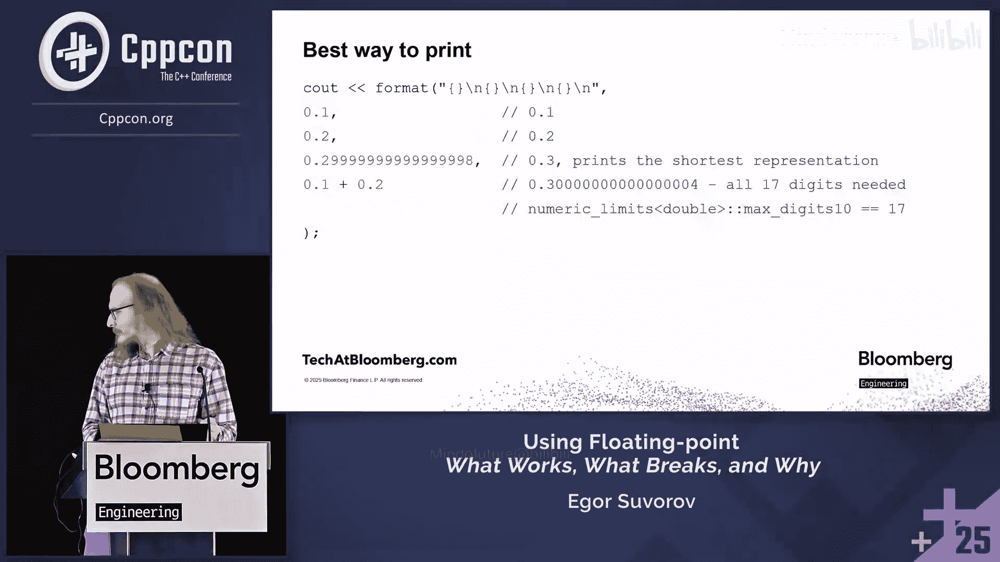

# 028：什么有效、什么会出错及其原因

在本节课中，我们将要学习C++中二进制浮点数（如 `float` 和 `double`）的核心概念、工作原理以及常见的陷阱。我们将探讨其背后的数学原理、C++标准库和编译器的实现细节，并了解为什么某些看似简单的操作会产生意想不到的结果。

## 1. 浮点数基础与表示

浮点数被设计用来同时处理非常小和非常大的数字，并关注**相对精度**。例如，对于 `double` 类型，数字1和下一个可表示数字之间的差值约为 `10^-16`。即使对于10亿这样的数字，其相对误差也大约在 `6 * 10^-16` 左右。

然而，如果你关心**绝对精度**，可能会遇到问题。例如，在1和2之间有 `2^52` 个 `double` 值，在2和4之间同样有 `2^52` 个，但分布密度减半。越接近0，数字分布越密集。

浮点数的二进制表示遵循IEEE 754标准。一个数字被转换为二进制指数形式，确保其以“1.”开头，剩余部分称为**尾数**，再加上**指数**和**符号位**。

*   **符号位**：1位。
*   **指数位**：若干位（`float` 为8位，`double` 为11位）。
*   **尾数位**：剩余位（`float` 为23位，`double` 为52位）。

其存储格式可以抽象为：
`(-1)^sign * 1.mantissa * 2^(exponent - bias)`

## 2. 特殊值：非规范数、无穷大与NaN

上一节我们介绍了浮点数的常规表示，本节中我们来看看几种特殊的浮点数值。

**非规范数**：在0和最小的正规格化数（`std::numeric_limits<double>::min()`）之间，存在一个“间隙”。为了填补这个间隙并实现**渐进下溢**，标准引入了非规范数。这使得当两个非常接近的小数相减时，结果不会意外地变成0，从而避免了后续可能的除零错误。

**无穷大**：在进行可能溢出的计算时很有用。例如，比较 `a * b > c`，如果 `a * b` 溢出为无穷大，比较操作仍能按预期工作。标准数学函数也支持无穷大，例如 `exp(-∞) = 0`，`log(0) = -∞`，这有助于减少条件分支，写出更简洁的代码。

**有符号零**：存在 `+0` 和 `-0`，它们在比较时相等（`+0 == -0`）。区别主要体现在某些运算的符号上，例如 `1 / +0` 得到 `+∞`，而 `1 / -0` 得到 `-∞`。这在中间结果溢出时，有助于保持最终结果的正确符号。

**NaN**：表示“非数字”，通常由无效的数学运算产生，例如对负数开平方根，或 `NaN` 参与任何运算。`NaN` 具有传播性。一个关键特性是 `NaN` 不等于任何值，**包括它自身**（`NaN != NaN` 为真）。这破坏了许多关于比较的常规假设。

## 3. 舍入规则与编译时舍入

由于浮点数的精度有限，舍入发生在多个环节：编译时、运行时、输入输出时。

默认的舍入模式是**舍入到最近的值**。当遇到“中间值”（恰好位于两个可表示数字的正中间）时，需要打破平局。以下是几种平局决胜策略：

*   向零舍入
*   向负无穷舍入
*   向正无穷舍入
*   远离零舍入（类似四舍五入）
*   **半偶舍入**（也称为银行家舍入法）

**半偶舍入**是IEEE 754的默认策略，它选择尾数最低位为0的那个值。这样做的目的是让舍入误差在统计上相互抵消。例如，对 `{0.5, 1.5, 2.5}` 应用半偶舍入得到 `{0, 2, 2}`，其和为4，而真实和为4.5，误差为-0.5。若采用“四舍五入”，则得到 `{1, 2, 3}`，和为6，误差为+1.5。

在**编译时**，当你写下 `0.1` 这样的字面量时，编译器必须将其舍入为最接近的可表示浮点数。`0.1` 在二进制中是循环小数，无法精确表示，因此会被舍入。`0.1` 被略微向上舍入，而 `0.3` 的字面量实际上被表示为略小于数学上0.3的一个值。

## 4. 运行时计算与经典问题

在运行时进行浮点运算时，舍入会再次发生。经典的 `0.1 + 0.2 != 0.3` 问题就是由多重舍入造成的。

1.  `0.1` 和 `0.2` 在编译时已被舍入为各自最接近的 `double` 近似值。
2.  CPU以无限精度计算这两个近似值的和，得到一个中间结果。
3.  这个中间结果同样无法精确表示为 `double`，因此需要再次舍入到最接近的可表示值。
4.  最终得到的结果与数学上的 `0.3` 不同，也与编译时 `0.3` 字面量所表示的近似值不同。

因此，直接比较 `0.1 + 0.2` 和 `0.3` 会返回 `false`。

## 5. 编译器差异与可移植性问题

不同编译器甚至同一编译器的不同设置，可能导致浮点计算结果不一致，这常常让人感觉像是遇到了未定义行为。

**额外精度问题**：在32位模式下，GCC有时会使用古老的x87 FPU的80位寄存器进行计算，导致中间结果保持了比 `double` 类型更高的精度。当这个更高精度的结果用于决策（例如转换为整数）时，可能与全程使用64位 `double` 计算的结果不同。一个简单的重构（如将表达式提取到函数中）就可能改变程序行为。

**优化问题**：编译器在 `-ffast-math` 等优化模式下，可能会进行一些在纯数学上正确、但不符合IEEE 754严格舍入规则的变换，这会影响结果的确定性。

**标准库函数**：对于 `+`, `-`, `*`, `/`, `sqrt()` 等基本运算，标准要求精确到最后一个比特。但对于 `pow()`, `sin()` 等函数则没有这样的保证。例如，`pow(10, 2)` 在某些实现中可能不会精确地返回 `100`。

## 6. 如何输出与调试浮点数

调试浮点数问题时，正确输出其值至关重要。

**默认输出的问题**：`std::cout` 或 `printf` 的默认格式通常只打印6位有效数字，并会自动舍入和切换为科学计数法。例如，打印 `0.1 + 0.2` 的结果会显示 `0.3`，这掩盖了真实值。

**如何精确输出**：
*   对于 `float`，需要至少9位十进制数字才能唯一区分所有不同的值。应使用 `std::numeric_limits<float>::max_digits10`。
*   对于 `double`，需要至少17位十进制数字。应使用 `std::numeric_limits<double>::max_digits10`。
*   **最佳实践**：使用C++20的 `std::format` 或 `std::to_chars`。它们能自动计算出最短的十进制表示，既能区分该浮点数，又便于阅读。例如，对于精确的 `0.3`，输出 `“0.3”`；对于 `0.1+0.2` 的结果，则会输出足够多的小数位以显示其与 `0.3` 的区别。

**输出特殊值**：无穷大打印为 `“inf”` 或 `“infinity”`。NaN的打印格式多样，可能包含符号和负载信息，如 `“-nan(ind)”`。注意，不同平台或CPU架构可能为同一运算产生不同负载的NaN，导致其字符串表示不同，影响跨平台一致性。

## 7. 数值计算中的陷阱与建议

了解了原理后，我们来看看实践中常见的陷阱和应对策略。

**避免“魔法ε”比较**：简单地用 `fabs(a - b) < epsilon` 来比较浮点数并不总是有效，因为合适的 `epsilon` 值取决于具体应用场景和数值范围。`std::numeric_limits<double>::epsilon` 是1与大于1的最小浮点数之差，它只适用于1附近的比较，并非万能。

**排序与容器**：直接将包含NaN的浮点数数组进行 `std::sort` 或放入 `std::set` 会导致未定义行为，因为NaN破坏了严格弱序关系。在排序前需要过滤或特殊处理NaN。

**选择更稳定的公式**：
*   计算三角形面积：避免使用海伦公式，应使用向量叉积。
*   计算点的极角：使用 `atan2(y, x)`，而非 `acos` 或 `asin`。
*   计算幂：`x * x` 比 `pow(x, 2)` 更快且更精确。
*   连加运算：对于大量数据求和，考虑使用Kahan求和算法来补偿累积误差。

**向指定小数位舍入**：如果直接将一个浮点数格式化为两位小数，由于该浮点数本身已是近似值，可能无法正确应用“四舍六入五成双”的规则。可靠的方法是：在知晓原始数据精度（如知道有3位小数）的前提下，将所有数值转换为整数（乘以1000），在整数域进行舍入计算，最后再转换回来输出。

## 8. C++语言特性相关陷阱

C++本身的一些特性也会与浮点数相互作用，产生微妙问题。

**函数重载**：如果你包含了 `<cmath>`，需要注意有 `std::abs`（针对浮点数）和C语言继承来的 `abs`（针对整数）。如果误用了整数版本的 `abs` 来处理浮点数，会导致意外的取整操作。建议使用 `std::fabs`，它只针对浮点类型，意图更明确。

**浮点与整型转换**：
*   **浮点转整型**：使用 `static_cast<int>(a_double)` 会截断小数部分。如果浮点值超出目标整型范围，行为是**未定义的**（可能崩溃或产生无意义结果）。
*   **整型转浮点**：如果整数值无法在浮点类型中精确表示，转换结果是**实现定义的**（编译器决定如何舍入）。虽然GCC和MSVC文档说会“舍入到最近”，但未明确平局决胜规则。

**性能问题：非规范数**：在某些CPU上，处理非规范数的速度可能比处理规范数慢数十倍。如果你的应用程序意外产生了大量非规范数，性能会急剧下降。某些编译器和CPU架构支持 `-ftz`（刷新到零）等选项，将非规范数当作零处理以提高速度，但这会改变数值语义。

**复数 `std::complex`**：C++标准库中的 `std::complex` 为了保证对无穷大、NaN等特殊值的正确处理，可能比手写的、不考虑特殊情况的复数类慢很多（测试中观察到30%-50%的差异）。如果不需要处理这些特殊情况，可以考虑使用自定义实现。

## 9. 综合案例：安全比较整型与浮点型

假设我们需要将一个混合了 `long long` 和 `double` 的列表进行排序。一个朴素的泛型比较器会先将 `long long` 转换为 `double`，再进行比较。这会导致问题：多个不同的 `long long` 值可能被转换为同一个 `double` 近似值，从而破坏比较的传递性。

解决方案是根据数值范围分情况处理：
1.  如果 `double` 值 `d` 的绝对值较小，处于所有整数都能被 `double` 精确表示的范围内，则将 `long long` 转换为 `double` 进行比较。
2.  如果 `d` 的绝对值很大，超出了 `long long` 的范围，或者其附近整数在 `double` 中表示有间隔，则将 `double` 转换为 `long long` 进行比较（需注意检查NaN和溢出）。

这需要仔细处理边界条件，例如 `LLONG_MAX` 可能无法被 `double` 精确表示。一个健壮的实现远比看起来复杂。

## 10. 总结与最佳实践

本节课中我们一起学习了C++浮点数的复杂世界。以下是关键总结和最佳实践：

1.  **理解数据**：明确你的输入数据是精确值（如来自整型的转换）还是近似值（如用户输入或计算产生）。明确输出需要怎样的精度和格式。
2.  **优先使用整型**：许多问题（如判断平行、求总和）用整型可以避免浮点数的所有麻烦。
3.  **接受近似性**：理解浮点运算是近似计算，避免做出基于绝对相等的逻辑决策。
4.  **使用稳定公式**：在提高精度之前，先考虑使用数值稳定性更好的数学公式。
5.  **谨慎对待编译器**：知晓编译器的优化标志（如 `-ffast-math`）和额外精度可能带来的影响。对于关键的数字算法，可能需要检查生成的汇编代码。
6.  **充分测试**：测试应覆盖边界情况，如0、无穷大、NaN、非规范数。考虑使用 `float` 进行穷举测试（因为状态空间较小）。随机测试有帮助，但需补充针对算法特定决策点的针对性测试。
7.  **利用库**：对于复杂数学计算，优先使用成熟的数值库，它们通常实现了经过充分验证的、稳定高效的算法。
8.  **输出时使用 `max_digits10` 或 `std::format`**：以确保能够唯一标识和调试浮点数值。

浮点数是一个强大的工具，但需要尊重其特性。通过理解其工作原理和潜在陷阱，你可以更有效地利用它们，并避免程序中出现令人头疼的数值错误。