# 029：C++定义十年的火箭引擎


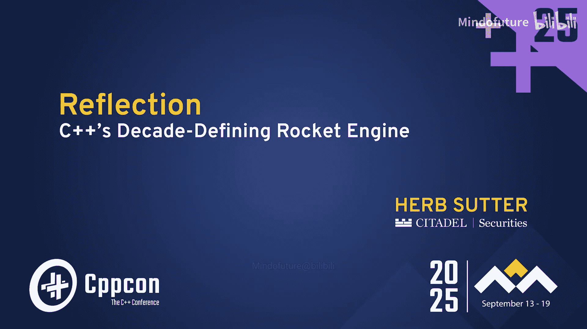

## 概述

在本节课中，我们将学习C++26中引入的静态反射功能。反射允许程序在编译时查看和生成自身代码，这为元编程开启了全新的可能性。我们将从基础概念开始，逐步探索反射的实际应用，并展望其未来潜力。

## 章节1：反射基础与工具

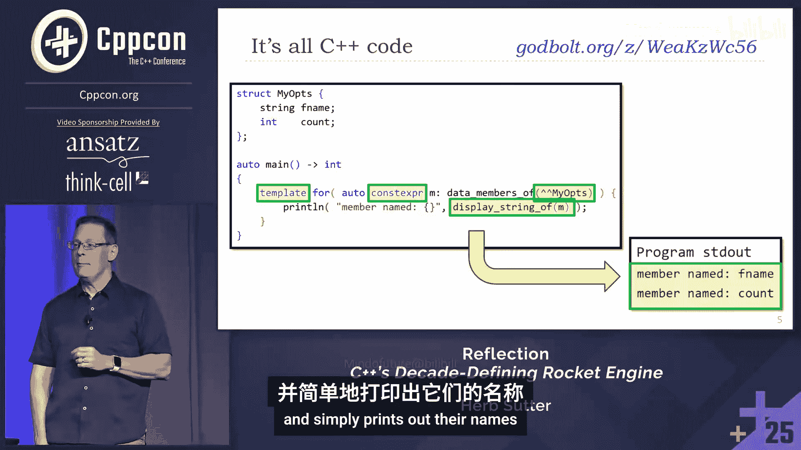

反射的核心定义是：程序能够查看和生成自身。通常，“反射”一词涵盖了读取和生成两部分，有时我们也会用“反射”特指读取部分，用“生成”特指写入部分。因此，元程序就是操作程序的程序。

据我所知，我们刚刚加入C++标准的反射功能，在商业语言中是独一无二的，属于顶尖水平。这是版本1，我们将在C++26之后继续构建它。但即使是版本1，功能也非常丰富。如果你在其他语言中使用过反射，那很好。我并非贬低它们，它们为反射铺平了道路，并展示了反射的实用性。

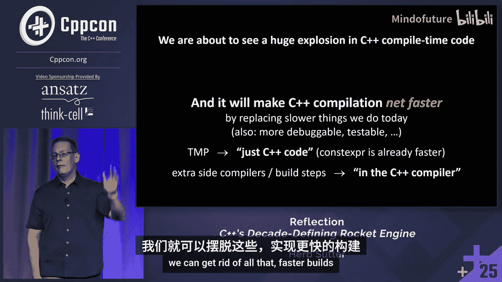

但请注意，这不是运行时反射，而是静态的、编译时反射。当然，如果你计算了某些内容并想在运行时存储它，默认情况下是零开销的。但如果你想在运行时存储某些内容，可以使用从定义静态数组、定义静态字符串开始的工具，那是你转换到运行时数据的函数。

除了普通的`for`循环，我们还有一个模板`for`循环。和往常一样，“模板”意味着编译时，也意味着展开循环体。当你实例化一个模板时，每个特化基本上都是展开的，你可以在循环体中得到不同的类型和不同的重载解析。模板`for`循环也是如此，因为你实际上需要这个功能，但使用起来其实很简单。

当然，如果你这样做，你可能需要一个常量函数来迭代数据成员。然后，我们有双尖括号`<< >>`（或称为“猫耳朵”）反射运算符来反射类型。

这里有一个简单的例子，它接受一个类型并遍历其成员，这是我们以前无法做到的，然后简单地打印出它们的名字。

```cpp
template <typename T>
void print_member_names() {
    template for (auto member : <<T>>) {
        std::cout << member.name() << std::endl;
    }
}
```

## 章节2：编译时性能考量

现在，我想解决房间里的大象。在反射出现之前，有多少人已经担心编译时间了？我看到很多人举手了。有多少人害怕所有关于编译时间的讨论？是的。

答案就在幻灯片上：我们即将看到C++编译时代码的巨大爆炸式增长。总的来说，这通常会使你的程序更快，构建也更快。原因如下：

因为这不仅仅是增加东西。如果你在做一些新的事情，当然会有额外的成本。但如果你是在替换今天用模板元编程做的事情呢？有多少人已经有过这样的经验：将一些用模板元编程计算的东西，改用`constexpr`函数（它更可读、更可调试，因为它只是代码），然后发现编译速度快了一个数量级？相当多的人举手了。

这是因为你直接表达了你的意图，而不是通过一个并非为计算而设计的类型系统和特化来表达计算。相反，你将自己表达为代码。猜猜看，优化器喜欢代码。它们看到代码，就会自动抓住并优化它。调试器也能工作。这是一个好处，也是为什么我们已经看到使用`constexpr`代码带来的速度提升。

同样的事情也适用于我们稍后会讨论的辅助编译器：当我们简化工具链，在编译器中做更多事情，而不是重复大部分可能是正确的解析时，我们可以摆脱所有这些，从而获得更快的构建。

## 章节3：当前可用的反射功能

我们将进行相当多的演示。祝我们好运。我会一直这么说，因为演示的“恶魔”总是在附近。我将展示三种实现。前两种是Dan Katz的Clang实现和David Vandevoorde的EDG实现，它们实现了当前草案标准的内容，加上一些扩展，因为它们拥有标准内容的超集。

我将展示C++26中的例子，但也会展示在近期和中期未来可以期待的例子。对于其中一些，我将切换到我的CPP2编译器，它同样是C++，只是语法不同，但它编译成100%可移植的C++，可以在过去十年的每个C++编译器上运行。但它的反射实现更超前。所以我需要用它，因为我在其中实现了比原型中更多的反射功能。但这都是标准的一部分。这里没有混淆，我们谈论的是C++本身的未来。

在看了工具之后，让我们开始看看我们今天能做什么。在本节中，我将讨论仅使用我们已添加到C++26中的功能就能做的事情。截至六月，它仍然非常新鲜。之后，我们将看看在C++26之后可以做的事情，但在更近的时期，比如可能进入C++29。然后我想带我们看得更远，看看这将如何影响长期发展轨迹，不仅仅是C++，还有其他语言和我们的行业。因为我们不常有机会通过向语言添加功能来做到这一点。

这是一个路线图草图。我会回到这张幻灯片，并突出显示不同的部分，因为反射（读取部分）和生成（写入部分）都有。我们现在已经在C++26中标准化了版本1的一个子集。我们将添加更多，但稍后再谈。目前，我们已经添加了对命名空间、类的反射。我们甚至得到了函数和参数，以及称为“注解”的东西，它们基本上看起来很像属性，但在属性内部，它们以等号开头。我会尽量记得演示其中一个。

我们在同一翻译单元中有一些生成功能，使用拼接运算符`[: ... :]`。但只要在单独的文件中，我们就可以生成任何我们想要的东西，因为我们有`ofstream`，我们有`cout`，我们知道如何向文件发送文本和二进制信息。所以，我们还没有在同一翻译单元编译时完全实现生成功能。这即将到来。但仅通过使用反射并生成文件，我们已经可以做很多事情了。

## 章节4：热身示例：嵌入JSON

这是一个使用`#embed`功能和拼接运算符的热身示例。你会在这里看到Godbolt链接。让我们实际切换到那个链接。如果这能成功，我这次演讲的其余部分机会就大得多。如果演示不成功，我还有幻灯片。但现场演示能让我们相信它是真实的，对吧？

这里我们有一个用C++ Builder设置的Godbolt，它是一个多文件设置。我们要做的第一件事是，通过`#embed test.json`，创建一个JSON数据变量，你可以把那个文件粘贴到这里，本质上就是这样。

你为什么要这样做？你可能想单独签入那个文件。那个文件可能不仅仅是我的C++程序的唯一真实来源，也可能是系统其他部分的唯一真实来源。你不想复制它，只想签入一次。事实上，它就在下面。我们可以看到它是一个JSON文件，有一个名为`magic`、类型为`string`的条目，然后是一个嵌套的结构体，里面有`word`（字符串类型）和`number`（整数类型）的条目。

然后，我们将调用这个函数。我不会逐步讲解它。如果你想看答案，在这个Godbolt示例中，这行代码上面有150行代码。请查看代码。这个函数解析我们刚刚通过`#embed`嵌入的JSON数据，并做一些非常棒的事情：它创建一个全新的结构体，一个计算生成的、与运行时输入（更准确地说是编译时输入）匹配的数据类型，这样我们就可以像访问数据成员一样访问`v.magic`，因为它就是；也可以访问嵌套的数据成员`v.inner.word`，因为它也是。然后我们就能按预期打印出这些东西。

现在，我想指出一点。因为我们有新的反射运算符（双尖括号运算符）和拼接运算符，有些人想知道，所有这些“乱七八糟”的东西会不会污染我的代码？实际上并没有那么糟，至少现在还没有。但这类东西自然会放在库中。这里有一个如何做到这一点的例子。我在这里放这个拼接，是因为我想向你展示拼接。但你也可以直接调用一个常规模板，在这个例子中是一个变量模板。所以现在调用点就像我们今天在C++中期望的那样。在那个变量模板内部，我们进行拼接。它也可以是一个函数模板。所以你可以把反射运算符隐藏在函数模板里。这样，你就不必让你的用户知道反射或拼接，你可以把它们放在库里，因为它只是代码。

最后一点，为什么不呢？因为我们可以。我们还有这个`static_assert`。但我想带你看看这个做了什么。这是一个原始字符串字面量，它基本上打印一些信息，并验证它以JSON格式打印了一些信息。然后我们使用一个用户定义字面量（C++已经支持），将其转换为一个对象。但由于它可以使用反射，那个用户定义字面量会调用反射，创建结构体，我们可以立即使用这个计算生成类型的成员。

这很好，它让我们热身，了解我们能做什么。

## 章节5：命令行选项解析器

现在，让我们看一个稍微高级一点的例子，但它仍然很简单，所以我们可以实时讲解：一个命令行选项解析器。

我们都用过命令行选项解析器。这个有点不同。`parse_options<my_opts>`看起来就像一个普通的模板调用，因为它就是。但请注意，它传递的是选项结构体，并且只传递选项结构体，没有传递单独的字符串名称。它只是说，这是结构体，去填充它。只需查看结构体，我告诉了你标志、名称和它们的类型。直接去填充它。

让我们看看这是什么样子。这里我们有那个结构体。我们可以看到，是的，事实上，这行得通。如果我们有命令行（命令行的文字我几乎看不清），是`--count 42`，文件名未指定，所以它使用默认值。如果我们省略文件名，它也会默认，因为我们为文件名设置了默认值。这一切都很好。

那么这里到底发生了什么？让我们向上滚动。当我们向上滚动时，我们会看到`parse_options`接受其模板参数。它做了什么？类型本身就是一个输入。所以我们将使用一个模板`for`循环，它将展开对反射类型的每个非静态数据成员的访问。请注意，这里我们把反射放在了函数模板内部，所以它没有到处泄漏。不是每个人都需要写双尖括号。这取决于你把它放在哪里。

然后我们简单地遍历，寻找以`--`开头的命令行选项，即标志名。如果找到，那么我们尝试创建一个字符串流，并将该值流入`opts.`。然后你看到第36行的拼接了吗？流入`opts.`数据成员。在一次实例化中，这将是`opts.count`，在另一次实例化中，这将是`opts.fname`，类型是正确的。你可以看到为什么我们像模板一样展开它，因为每个循环体中的类型实际上可能不同。这是类型安全的。我们所做的只是遍历成员，搜索它们的名称。哦，看，一个名字匹配了。然后尝试流入那个成员。这一切都是类型安全且正确的。事实上，如果我在这里尝试说`--count x42`，哦，错误：为`--count`提供的值不是有效的`int`。我们得到这条消息是因为我们实际上显示了友好的名称，即使编译器可能把`I`作为类型ID的名称，我们通过所有这些并说，给我们那个数据成员类型的真实、友好的源名称显示字符串。所以你得到的不是混乱的编码，而是用户能理解的实际源类型。

为了进一步证明这是实时的，让我们添加另一个数据成员，另一个我们可以添加的东西。一旦编译完成，我们仍然想修正我们的计数值。但现在，假设我们想放，哦，看，现在`opts.pi`默认降到了3.14159，正如它应该的那样。你知道，它是一个`float`。别因为我用`float`表示π而责备我，因为情况即将变得更糟。假设我们在1897年的印第安纳州，我们说`pi = 3.2`。哦，我打对了吗？它太小了，我看不清。有人看到我打错了吗？哦，没有等号。对了。现在我们符合1897年印第安纳州几乎通过法律的规定。如果你不相信我，去查一下。就差那么一点，尽管参议院大部分时间都在嘲笑它，这很好。

## 章节6：类型擦除包装器

这是一个更长的例子。我将做一个“不可能的任务”式的即兴表演，称之为“可绘制任务”。我们想要一个类型擦除的包装器`drawable`，它可以包装任何具有大致`draw`函数的对象，该函数可以接受一个坐标或可转换为坐标的东西，并返回一个`int`或可转换为`int`的东西。所以，如果你考虑参数和返回值的转换，这就像`std::function`所做的那样。所以它不必完全是这样，但必须与该接口兼容。

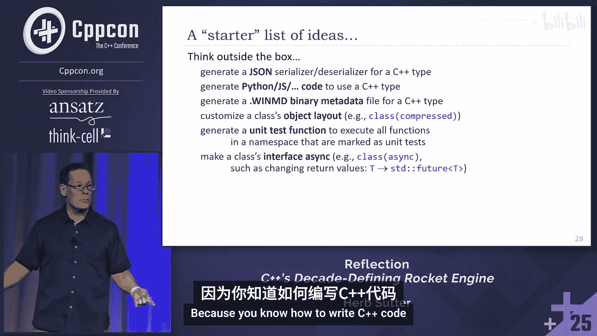

因为我以前没写过这样的东西，我想看看AI有多好。我让ChatGPT来做。它写了200行代码，然后我调整了一下。我不假装理解所有内容，但它似乎区分了`const`和非`const`。你们中做过这个的人会告诉我它是否正确。它似乎能工作。我测试并调整了它。现在，是的，事实上，你可以有一个`drawable`的`vector`，放入`sprite`、`icon`、`button`。这是三个不相关的类型，就在这里。把它们放进去，然后对每个多态地调用`draw`。它工作了。你怎么做这个？`Drawable`内部的核心数据结构是什么？有人喊出来。虚函数表，是的。这被称为如何编写你自己的虚函数表。

让我们看看ChatGPT在我的一点帮助下做了什么。我不会逐行讲解所有代码。这是超过200行的代码。但在这里，我想首先向你证明，事实上，我袖子里没有藏东西。这对中间和后面的人来说够大吗？是的，哦，即使在后面，哦，我想要你的视力，我真羡慕。

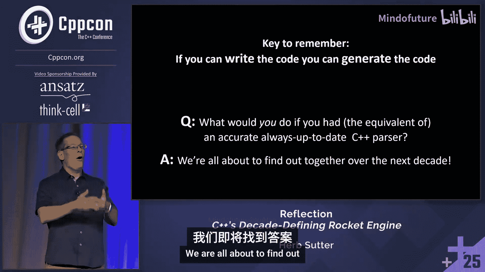

好的，我们正在做`drawable`的规范。让我向上翻页，只是为了向你证明，事实上，`sprite`、`icon`和`button`都是不相关的类型，没有继承的把戏。事实上，其中一些有我们正在寻找的确切函数，在这个例子中是`button`。它接受一个`point`，但`point`可以从一个`coordinate`参数转换而来，它返回一个`short`，可以转换为`int`。所有这些都兼容，并且它们都能工作。你可能以前在这里见过这样的演示。让我把它拉过来，这样你就能真正看到。事实上，是的，在GCC、Clang、Microsoft上，所有这些都能正确工作。

到目前为止还没有反射。我展示这个例子的原因是为了教你。就像我学习它时一样，我的整个职业生涯，我都是在学习的过程中写下这些东西。这里的情况完全一样。

现在，我们如何概括这个？简短的答案是：让手动编写的普通情况正常工作，剪切并粘贴它，在所有东西周围加上引号，然后替换你想要的名称，并在成员函数或数据成员变化的地方放入循环。实际上就是这么简单。这个完整的端到端例子花了我两个小时，从一张白纸开始，到ChatGPT，到修复代码，再到编写反射代码。我以前写过反射代码，但我对它的速度之快感到惊讶。

让我向你展示那是什么样子，因为在这里，我们有这个代码。如果你把这个代码放在一边，我们现在可以看到反射代码。首先，我将向你展示反射代码的输出。反射代码在底部做了什么？也许我会先展示底部。滚动，滚动，滚动，滚动，滚动，滚动，滚动。它所做的就是接受一个示例类`drawable`，它具有我们想要包装的签名（可能不止一个，但现在只有一个），然后调用一个编译时函数`poly`（我不知道该叫什么，所以叫多态类型擦除器`poly`，差不多）。它将以此作为输入，然后我们将生成本质上与右侧相同的代码，通过剪切粘贴进行测试，是的，它能工作。

所以这里是包含文件、类`drawable`、我们在文件顶部手动编写的各种概念等。但当我们转到左侧的文件时，我特别想提请你注意这个例子，看看虚函数表是如何工作的。所以这里是虚函数表。它在文件的中间。你可以用滚动条看到它有多大。所以我们在文件的中间。大部分是类`d`。这里的左侧是手写的。注意我们是如何手写虚函数表的，它有两个条目：析构函数和复制函数，无论你擦除什么类型，这些都是一样的。这种类型擦除的东西需要构造和复制。所以这不是每个函数都有的，只是为了让我的类型擦除包装器能够构造。

这是每个函数都有的部分。所以如果我包装了一个有两个函数的东西，我在这部分会有双倍的条目。让我们看看我们是怎么做的。实际的……让我先展示我们确实生成了那个。滚动，滚动。我想我们快到了。不，那是问题所在。还有一个我们生成的自由函数。好吧，这里的某个地方是虚函数表。相信我，它在那里。很难找到。我会再找一次。不，你知道吗，我真的很想看到它，因为我想向你展示它是如何变化的。所以当你看到`v`时停下来。它在那里。那是虚函数表。好的，注意它生成了与右侧相同的东西。但这些都是生成的。当然，它不在同一个文件中。它被输出到另一个C++文件，然后我们可以在同一个构建中使用它，如果我们想的话。但我们必须从不同的文件中使用它。我们还没有实现同一翻译单元内的源代码生成。

好的，让我们看看这段代码。如果我们看看我们必须编写的代码，让我们看看`poly`函数本身。它是一个简单的函数，接受原型并返回一个字符串。你可以看到它首先在我们另一个文件中的所有东西周围加上引号，包括依赖项和所有内容，这是你的构造函数。当你到达其中一些东西时，你看到，我只是复制粘贴了文件。然后，哦，我看到`drawable`的地方，我只需全局搜索或替换，把`drawable`改成引号加部件名加引号。这很容易。你对所有东西都这样做。

现在，有些东西是每个成员函数都有的。所以我想在这里提一下为什么我这样做。你会注意到，到目前为止，我向你展示的这个函数只是一个普通的运行时函数。它甚至不是`constexpr`函数。它只是一个做字符串处理的普通运行时函数。但我必须用这个反射原型调用`poly_impl`，现在它将使用反射信息。

我的初始实现是把所有这些，包括这个不需要是编译时的函数，也做成`constexpr`。在这个例子中，我遇到了Clang对`constexpr`操作的限制，因为所有的字符串。所以你有很多理由。我相信随着我们给它们压力，编译器会增加它们的限制。但你有理由在普通代码中做很多事情，然后将需要的部分委托给反射代码。这是一个很好的卫生习惯的例子。

如果我们快速看一下，这是处理每个成员并输出所有字符串片段的函数。它所做的就是：这将对每个成员调用一次，它遍历该成员函数的参数，记住它的返回类型和参数，然后生成我们看到的所有那些东西。这里有一大堆东西，这些片段将由我们已经看到的、组装它们的最终调用者放在正确的位置。

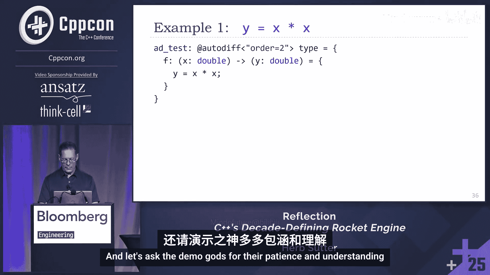

这样做的一个好处是，如果我们直接回到底部，如果我现在想改变这个，让我们看看它。我想现在改变这个，有另一个函数。我们等它重建。让我们看看新的虚函数表。现在我有一个包含`draw`和`get_name`的虚函数表。所以现在我可以包装任何具有`draw`和`get_name`（参数和返回类型可转换）的东西。我没有写任何代码。

所以这非常非常有用，并说明了我们将能够做的那种事情。我真的很想强调，手写版本需要200行代码来让`drawable`工作。现在我有300行代码。手写代码就在那里。你们视力真好。这是对后排的测试。有手吗？不，我想没有。所有那些现在都只是生成的。我写了300行代码，它将为我将来想要的任何类型擦除的东西做所有这些。我再也不用写它了。我可以调试它，因为它是代码。它一开始会有代码生成错误，但它只是代码。我们会调试它们。当它工作时，我们就发布它。

## 章节7：元类与接口生成

八年前，在这个舞台上，我相信我首次现场演示了元类论文P0707，它展示了如何使用反射来帮助我们更轻松、更正确地生成C++类型。我首先在ACC的舞台上以幻灯片形式展示。我相信第一次演示是在这个舞台上。这里有一个快速的复习例子，我以前讲过，所以我会很快。

想法是：今天我们在左边写样板代码。如果我们能直接说，嘿，我写的不是任何类，我写的是一个接口，这意味着我想要某些默认值，那会怎样？所有函数默认都是纯虚的，即使我没有写。那只是默认值。我自动得到一个虚析构函数，即使我没有手写。我自动抑制复制和移动，诸如此类。

这就是我们今天在C++26中可以实现的样子。我们可以做到。它只需要进入一个单独的文件，然后我们从那个单独的文件中使用它。

让我在Godbolt上快速展示一下，表明它已经完成了。这是我想记住向你展示的另一件事。我们不吃你。我们不是你。好了。

这里我们有类`widget`。我们把它用作原型。我在它上面调用`interface`元函数。看，这里，它生成了我们看到的所有东西。我不会逐步讲解。到现在，这是一个简单的例子，因为我们已经见过更难的了。我想向你展示的是，嘿，如果我们实际添加另一个函数，比如`float h(double)`，哦，看，它也出现了。现在我们处理了那个。所以我向你证明这是实时的。这实际上是在反射并生成应用了默认值（虚和纯虚）的正确最终函数。

但现在，假设我们走得更远一点。假设你是这个编译时函数`interface`的作者。你会说，伙计，如果我能给用户一种方式说，哦，我所有的函数，除了那个，我不想那个成为接口的一部分，那该多好。我只是编一个稻草人例子。你怎么做？

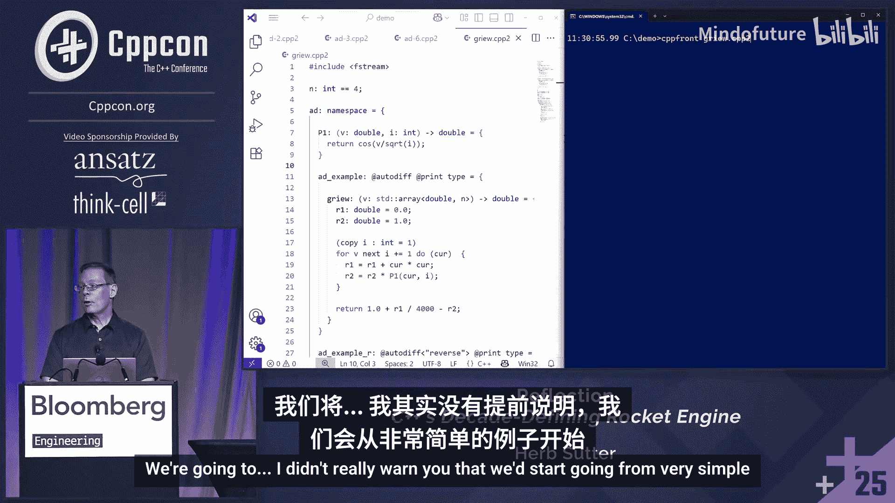

你可以在C++26中做到，不需要任何更多的语言功能，因为你可以创建一个自定义注解。注解在标准中。它看起来是这样的。我可以直接写。在这个代码中，用户可以只写`= suppress`，现在注意在右侧，`g`消失了。这是魔法吗？标准中有什么我可以谷歌的`suppress`特性吗？不，标准中没有任何关于抑制的内容。所有的一切就是，在这段代码中，当我遍历所有成员函数时，我实际上是在查看注解，并说，哦，我想看到所有不是特殊成员函数且没有`suppress`注解的函数。`suppress`注解是什么？我刚刚编了一个。它只是一个类型。就是这么容易。现在你写了一个元函数，你开始为你的用户提供一个API，从你的调用站点向你的元函数提供信息。这非常有用。

到目前为止，这都是C++26。未来我们能做什么？反射将走向何方？同样，当我们超越这里时，更多的是假设性的。但已经有提案和实现摆在桌面上，可以添加到你的翻译单元中，同时编译，这样我们已经做过的那些事情，比如接口，实际上可以在同一翻译单元内使用。

这张幻灯片现在在EDG编译器上通过这个Godbolt链接是可能的。它将生成完全相同的输出。注意，关键是我们从同一个文件内部生成这个。这种模式你会经常看到：我把我的示例、原型放在某个子命名空间中，然后我反射它，调用一个编译时函数来反射它并做一些事情。通常是为了反射它并为我制作一个修改后的版本来使用。所以我把原始的、不完整的放在某个子命名空间中，我反射它并制作它，当我完成时，就是完成的版本。

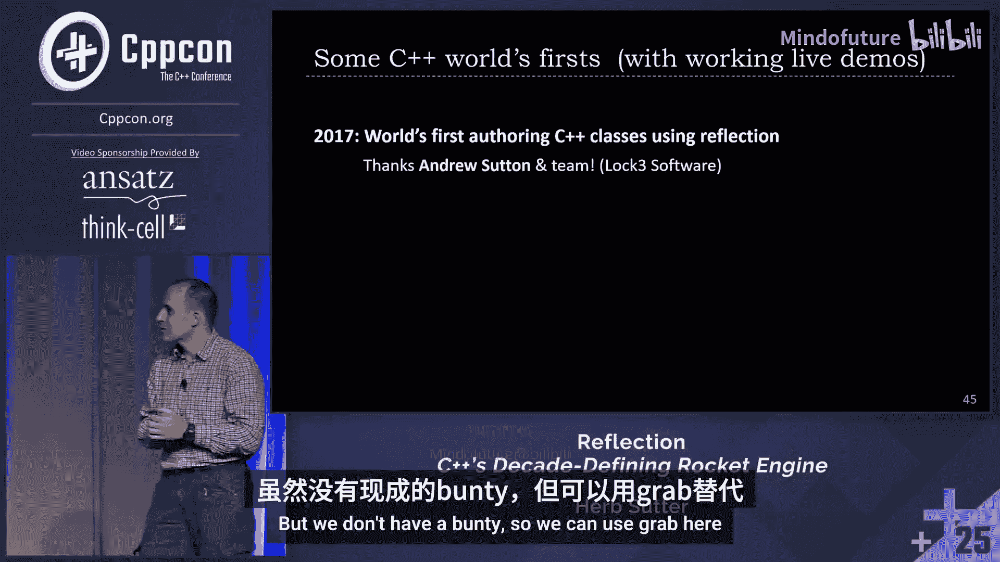

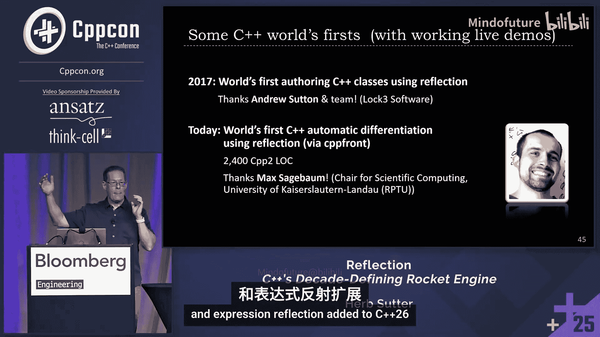

这将变得如此普遍，以至于我提议，从八年前开始，继续提议为它提供一个语法糖：`class interface widget`正是且仅仅是那个的语法糖。我已经在CPP2中实现了相同的东西。它是一种从左到右的替代语法，但做的事情完全一样。一个接口类型。所有这些，包括现在Godbolt上的EDG编译器和带有这个例子的CPP2，都生成完全相同的、诚实的、可移植的、100% C++代码类型，可以在每个编译器上工作。编译时的东西它们能工作，不是每个编译器都能工作，但创建的类型可以在每个编译器上工作。


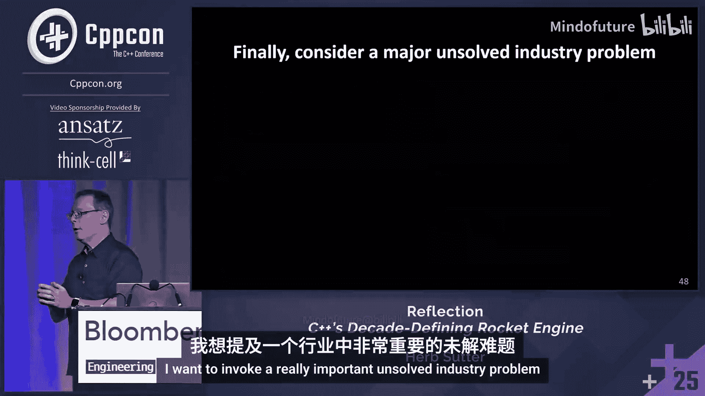

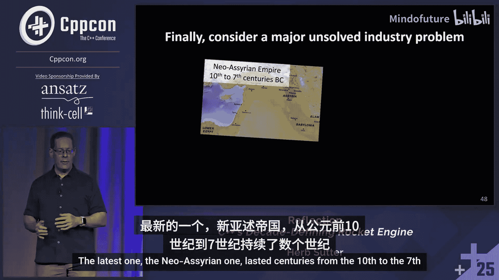

我已经实现了一堆这样的东西。`interface`是第一个。多态基类有序值结构体、枚举、标志枚举。我们可以使用`class enum`，它只是反射并使所有东西成为`constexpr`函数。`flag enum`做同样的事情并添加位运算符。我们可以使用C语言枚举以实现与C的兼容性。

但展望未来，我个人认为，一旦我们有了生成功能，类前缀和语法（委员会SG7已临时鼓励将其作为那四行代码的语法），我认为我们再也不会写一个裸露的`class`了。为什么我们要写？我们会说我们在写什么类。我写的不是任何类，我写的是一个接口。你知道，一旦你这样做并表达了你的意图，你也再也不会写`= default`和`= delete`来摆脱C++生成的你不想要的函数，或者恢复一个被抑制但你确实想要的函数。因为今天，我们有一个硬编码到编译器中的、适用于所有类类型的元函数，因为语言猜测你可能想要什么。但我写的不是一个值类型，我写的是一个接口，一个代理，一个异步函数，或者其他东西。

所以我只是从我八年前写的那篇元类论文的底部读起，它现在终于要成为现实了。每一小节都让我如此兴奋，因为我展示了当时无法编译的代码，但大部分是实际代码，旨在用于那些事情。第3节的每个小节都相当于一个重要的语言特性，在其他语言中，这将是一个语言特性，否则需要自己的EWG演进论文，并硬编码到语言中。但在这里，可以表达为一个通常很小的库，可以通过库演进工作组。

例如，这篇论文首先演示了如何用10行C++ `constexpr`反射代码实现Java/C#接口，并获得与Java和C#等语言中内置语言特性相同的表现力、优雅性和效率，在那里它们被指定为20页的文本供人类编译器编写者去实现。10行函数。20页文本，我八年前在舞台上用现场演示展示了。现在我们可以在草案标准中做到，而且更多。

所以反射将有助于简化C++进一步演进的需求。我们仍然会有反射不直接影响的语言特性。但许多本应是语言特性的东西，我们现在可以用反射作为库来实现，而且可以做得很好。这意味着我们可以测试和修复它们。我们有可以立即移植的代码，而不必等待你的编译器供应商全部实现它。通过GitHub和包管理器交付更快，更容易定制和适应分叉。

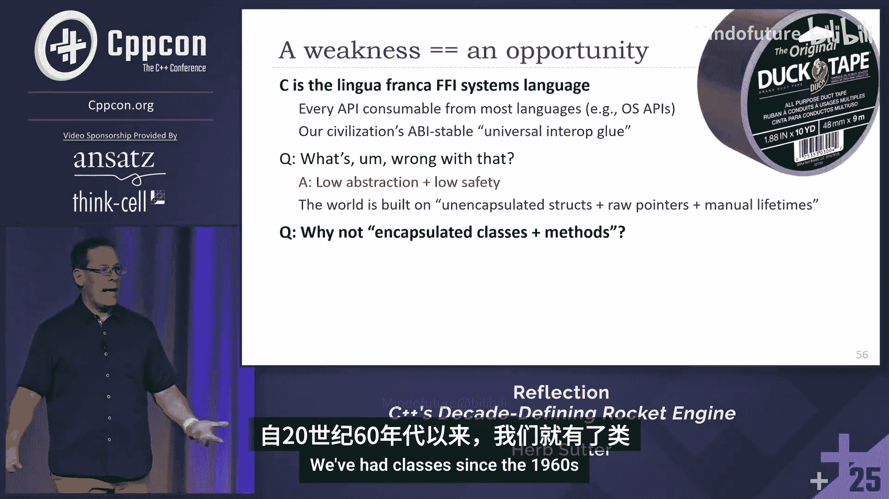

## 章节8：反射的潜在应用

那么我们能用它做什么？我们还不知道。但这里有一个初步的想法列表。

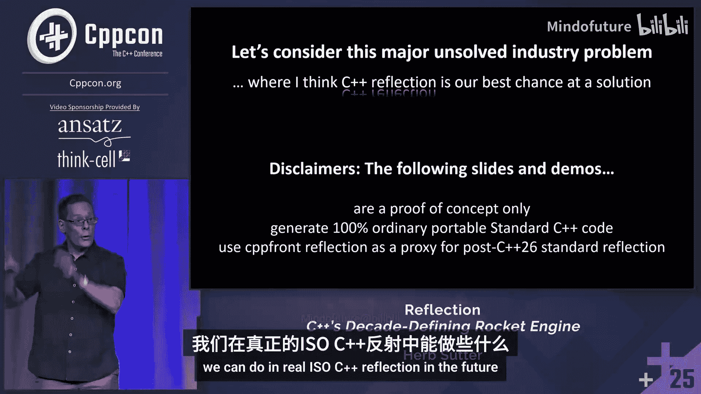

如果我生成C++文件，我可以为C++类型生成序列化器/反序列化器。只是普通的C++代码作为反射。我可以输出C++代码。我可以输出Python代码。我可以输出JavaScript代码。并反射类型的结构，为另一种语言编写包装器。

如果我能输出文件，我可以输出二进制文件，比如当C++/CX辅助编译器需要为C++类型生成的WinMD二进制信息。我可以自定义类的对象布局，比如`class compressed`。你们中有多少人手动做过这个，并希望有一种不用模板元编程就能做到的方法？汤姆·福利。

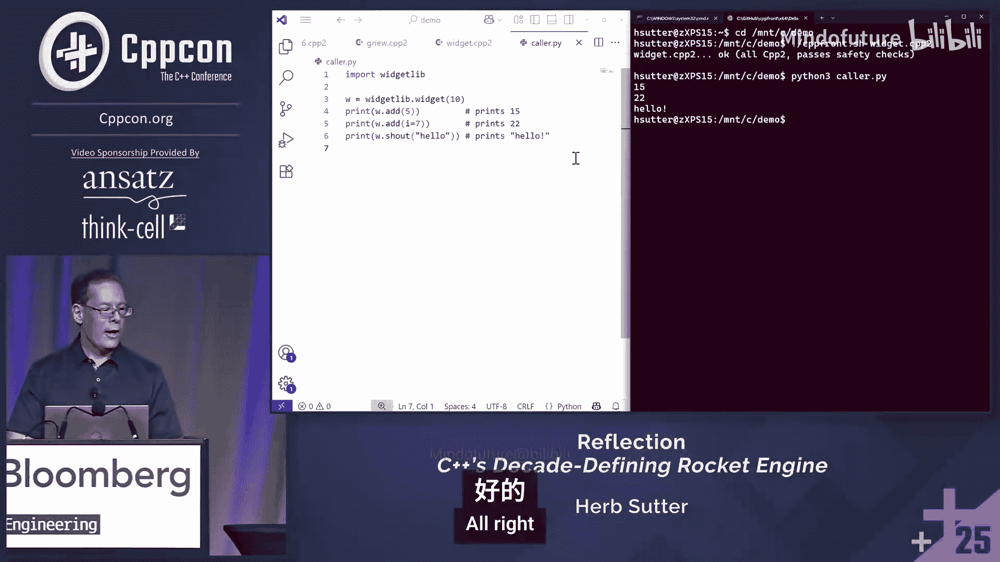

生成单元测试函数。只需遍历命名空间，找到每个名为单元测试的函数，并生成一个运行所有测试的函数。而不是在Python脚本中做，只需用几行C++代码编写。

使类的接口异步。所以`class async`可能在其所有成员函数调用上运行发送者-接收者线程池。然后这些函数的返回类型可能从`T`变为`future<T>`。你已经可以想到如何编写它。为什么？因为你知道如何编写C++代码。如果你能编写它，你就能自动化它。

所有这些，可移植，可测试，可共享，标准的C++代码，没有辅助编译器，没有脚本，没有语言扩展。

这是一个预测。如果我错了，我欠你们所有人一杯啤酒。我真的希望我没有错，不仅仅是因为啤酒。我们现在正走在一条直接的道路上，能够（无论供应商是否这样做）在下一个十年内淘汰辅助编译器和像C++/CX这样的构建系统，这些系统必须添加我们直到现在才能在C++源代码中拥有的信息，但有了反射就可以。淘汰C++/CLI，淘汰C++/CX。我想我应该知道并能够这么说，因为我领导了其中两个的设计：C++/CLI，C++/CX。我因此受到了很多批评：你为什么要扩展C++？你是想用一些专有的东西接管C++吗？不，只是我们需要购买.NET，我们需要购买Windows COM，我们还不能用C++表达我们需要的所有信息。这就是为什么我一直如此努力地推动反射作为一个方向，这样我就永远不需要，正如我八年前公开说的，再发明C++/CLI或C++/CX了。

我让ChatGPT修复了表情符号。这是输入/输出表情符号。很好。但我觉得它需要一个微笑。所以谢谢你，ChatGPT。

关键要记住，如果你在想，我能用反射做什么？简单的答案：如果你能手动编写代码，你就能编写代码来生成它作为字符串和标记。

所以，如果你有一个相当于准确的、始终最新的C++解析器，可供你的代码使用，你会做什么？我们都即将找出答案。

## 章节9：语句与表达式反射

我们都即将找出那个问题的答案。现在，让我们看看语句和表达式，这是下一件事。因为注意，我们已经可以用命名空间、类、函数、参数、注解做很多事情了。这在版本1中已经很多了。紧随其后的是语句和表达式。这些我必须在CPP2中展示，因为我们还没有在Dan或David的实现中实现对这些东西的反射。所以这是CPP2领先的地方。

但我想向你展示一个叫做自动微分的东西。为此，我想邀请Max Sagebaum上台。请给他掌声。

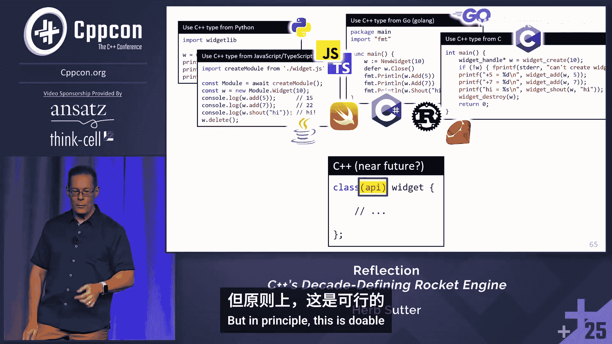

谢谢邀请我。谢谢邀请我。我很高兴你今年能来，因为去年同一周你在芝加哥参加自动微分会议，做了几个演讲。那是因为Max是世界自动微分专家之一。所以让他来介绍很多材料比我更好，因为我必须假装我听过，总结我听到的。他懂这些东西，包括他实现了今天存在的主要自动微分库之一，并了解其中的权衡。

所以让我们谈谈它是什么，因为到现在，你们中有些人可能在想，你一直在用自动微分这个词。我知道像Maple中的符号微分。我记得在学校做过。我也知道数值微分，我们取epsilon，让delta越来越小，做近似来求导数。这里有什么不同？

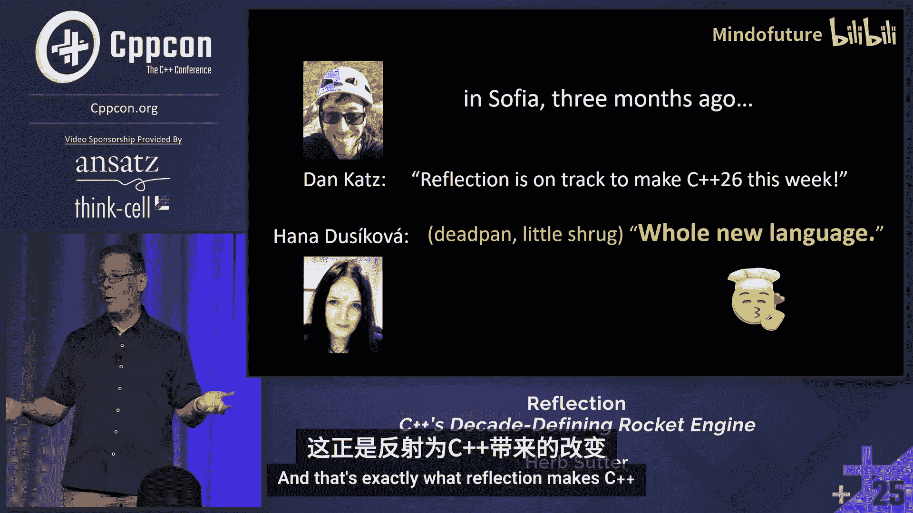

自动微分或算法微分是一种数学理论，你基本上假设可以将计算机程序分离成小的基本函数。这基本上就是编译器总是做的。对于每个这些简单函数，我们知道导数。然后通过应用链式法则和方向导数，我们可以产生一个数学级数，说我们可以计算导数。这就是我们如何将其应用于计算机代码。

这比符号微分和数值微分更好，正如幻灯片总结的，因为符号微分准确，但会爆炸性增长，速度慢，且不具扩展性；数值微分可计算，但也不具扩展性，而且你会得到舍入误差之类的东西。算法微分总是能给你数值精确的导数。顺便说一下，关于选项3的一点是，它在数值上是精确的，并且是线性时间的，比运行原始函数多一个常数因子。对于前向模式，常数因子大约是2到3。是的，对于反向模式，大约是2到4。

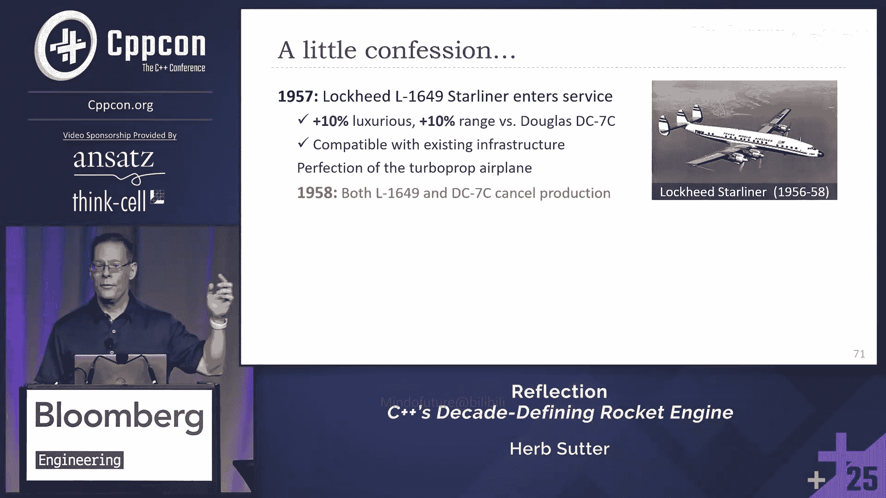

那么用这个例子向我们展示前向模式。我们有`y = sin(x) * x^2`。是的，我们首先将其分离为基本函数。所以我们有`sin(x)`，`x^2`，然后我们将这两个相乘。所以这基本上是具体化临时变量。然后我们可以计算导数。`sin`的导数是`cos`，很简单，`x^2`的导数是`2x`。然后我们将这两个相乘。所以`y`对`v`的导数是`u`，所以我们写`u`乘以，然后`u`对`v`的导数。就这样。另一件事是`v`对`u`的导数。

我们没有提到的一件事是，这种自动微分的一个优点是，你可以有带控制流（分支、循环）的函数，这些你无法轻易地表示为符号函数。这绝对正确。通常你可以支持它。有些东西可能相当困难，取决于你使用什么自动微分工具，但通常你可以支持它。

那么如果有多个输入和输出呢？这只是一个从`x`到`y`的函数。如果有更多呢？对于前向模式，如果你只有一个输入，你可以有任意多个输出。你只需计算一个，然后你就有了输出的完整梯度。对于反向模式，但反过来，当你有，例如，在AI模型训练中，你有数十亿的输入，但通常只有一个输出。那么你将不得不运行这个数十亿次，这将花费一些时间。你可以通过使用向量模式来减少常数向量。但如果你使用反向模式，你可以说，好的，我运行这个一次，存储一些数据，然后重用我存储的东西，运行反向传递，然后你在一次传递中获得完整的梯度。有一点内存开销，你需要存储，但通常你可以管理。

所以前向模式在输入少于输出时很好。它是线性的。我方向说对了吗？是的，没错。但那样不会扩展。如果你有十亿个输入，你将不得不做一百万次。然后你想要反向模式，你进行一次前向传递，计算你然后向后导航的数据结构，但它是线性的。然后你一次得到所有输入的导数，仍然是线性的。是的，是的。

现在，如果你想要二阶导数、三阶导数、n阶导数呢？算法微分的一个优点是，你有一个代码，你应用它，你得到一个不同的代码。然后你可以一次又一次地应用它，你可以有任意高阶的导数。但问题是，通常这不是你想要的，因为它非常通用。你会得到很多你必须指定的导数值或导数方向。你可以做的是有一个泰勒实现，然后使用这些泰勒实现，这将减少你需要指定的值的数量和方向。在99%的情况下，这就是你想要的。

总结一下，我认为最大的收获是：它只是代码。你有关于如何优化它的白板讨论。它只是代码。

那么我们为什么要关心？这出现在任何重要领域吗？我们在这个会议上听到了一点。它用于训练AI。所以如果你听说过反向传播，那基本上就是算法微分的反向模式。科学软件也经常使用这个。是的。

但你可以手动编写这些导数。事实上，你告诉我，这些天，人们确实手动编写导数代码。是的，仍然这样做。我必须坦白，如果你想拥有最快的导数，这是你应该做的方式。但你的原始代码需要一年时间来开发，然后需要另一年甚至两年来编写导数代码，因为它通常更复杂。然后是维护方面，你在原始代码中改变了什么，然后你必须更新你的导数代码以使其相同或计算相同的东西。算法微分有一个初始成本，但你必须应用它，然后你可以在一秒钟内对你的代码运行AD，并得到导数，这些导数不是最优的。但然后你可以分析你的导数评估或计算，找到热点，然后优化那个压力大的热点。然后你将拥有近乎最优的导数计算器。

一个热点是线性系统。所以你不想在黑盒模式下做这个，因为它可能产生更长的导数，这很容易优化。

所以现在，我们有运算符重载库，它有局限性。顺便说一下，CoDiPack是你的，你参与的那个。有自定义编译器和分支，比如Tapenade和基于Clang的Clad。但正如你所说，问题是，如果你有一个定制的编译器，你将如何在生产中使用它？我使用GCC，我不会采用你的Clang分支，即使我使用Clang，我也需要生产质量的东西。

那么，既然你实际上已经在CPP2中用C++2编写了自动微分，并将其作为一个库，你会如何总结好处？感觉如何？有什么不同？这就是你在演讲中已经告诉我们的。你现在手头有一个最新的C++解析器或C++反射解析器。拥有一个最新的东西的好处是，如果你有一个好的API，你总是知道如何查询下一个东西。你知道，我有一个函数，从一个函数，我知道，好的，可以查询输入参数，我可以查询输出值，然后我可以为AD查询函数体的语句，然后每个语句的表达式。希望在C++29中，但知道你想查询什么以及如何查询是最重要的。这通常是在遍历一些不是为反射而是为编译而设计的编译器的AST时遇到的问题。所以你有很多额外的东西需要忽略，这使得有时很难找到你想要的东西。

那么你想看一些例子吗？这是一个。让我们做一个非常简单的`y = x^2`，然后让我们请求演示之神给予耐心和理解。

这里，我们再次使用CPP2代码，但这完全编译为C++。它完全兼容C++。只是，我使用这个是因为我这里有语句和表达式反射。所以这里是我们的函数`y = x^2`。我们将做一阶导数。为了展示这是如何工作的，我将尝试运行一个可视化图表，ChatGPT再次帮助了我，因为我不是Python专家。

它在哪？哦，这在我排练时发生过。我可能需要关闭bash。关闭bash。关闭窗口。关闭所有这些。让我们尝试重启它们。哦，好了。首先我们有。哦，不，我不想要PowerShell。哦不，我把它们都带回来了。也许，也许那就够了。你认为它可能重启了吗？让我们看看。哦，CH。我可以向你展示截图，但我真的很想现场展示。哦，不是PowerShell。那是默认的。你错过了Bird Pon。我再试一次。不，我只好用幻灯片向你展示这个了。对不起，但我会向你展示自动微分代码。

好的，所以我们在演示中。我只是无法可视化。我喜欢可视化输出，而且我们在C++中还没有图形。别让我开始。

这里我们将编译这段代码，80。想想看谁做，因为我们所有的演示编号都从0开始。我还使用了打印函数元函数，它说，好的，自动微分，然后打印结果，这样我们可以直观地看到生成的代码。同样，是CPP2语法。所以这里是原始代码。那么告诉我们这里用自动微分代码看到了什么。所以我们编辑了自动微分生成的后缀`_d`，并且我们也添加了参数`x`的方向`x_d`和输出。是的，你可以看到这里，我们有简单的乘法。在简单乘法之前，我们添加了`y`方向的更新，这只是我们之前在幻灯片上看到的乘法。所以这很简单。当你实现自动微分时，总是先做导数计算，因为如果你有自赋值，那么你会使用一个新值，如果你之后做的话。

如果Python正常工作，你会实时看到这个图表。对于这个自动微分例子，抱歉，展示是因为所有源文件所做的就是说，对于`x`从-10到10，步长0.1，创建一个数据文件，包含`x`、`y`和`dy`的值。这里它们被打印出来。这也显示了二阶导数，因为我们直接到了阶数等于2。

现在，如果我们为另一个例子做这个，让我们做`y = x + sin(x) + 10`。所以这里我们将转到AD2。让我们编译那个。这里我们看到第5行是那个新函数。所以我们将去。让我们看看谁B2。告诉我们这里有什么不同。现在我们有这三个我们想求和的项。我们为第二项创建了一个临时变量，它本身就是一个表达式。所以我们先做这个。这基本上是与符号微分的区别。所以你必须在一次中完成所有这些，这使得它更高效，或者使AD更高效。我们去掉最后一项，因为它是常数。基本上就是这样。否则，我们只是在这里添加`z`导数值。


所以注意，我们有我们的原始函数，做它该做的事。这个函数两者都做。它在同一次路径中进行原始计算，并计算`y`和`dy`。所以这很重要。我们在一次传递中以常数开销完成两者。这看起来像这个函数，我们有函数、一阶导数和二阶导数。你在这里看到，对于一阶导数，线性部分