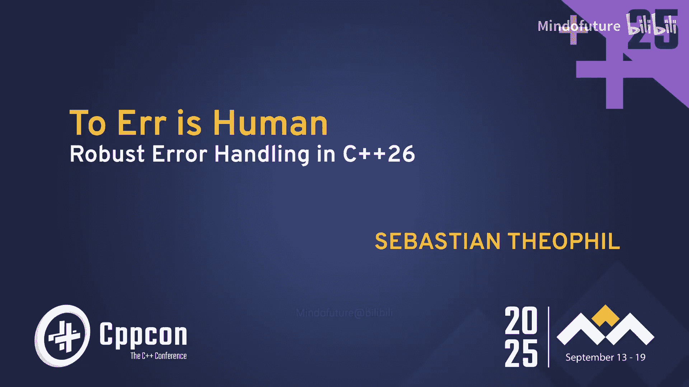

# 031：C++26中的健壮错误处理




在本节课中，我们将学习C++中错误处理的多种机制，从基础的C风格错误码到C++26的新特性，并结合实际开发经验，探讨如何在项目中构建健壮且实用的错误处理策略。

## 概述：错误处理的重要性

参加CppCon这样的会议，能让你看到许多有趣的人和许多被解决的复杂问题。


欢迎各位。感谢大家来听我的演讲。今天我将讨论两个不同的主题。我将首先介绍C++中用于错误处理的工具。然后，我将更多地讨论在实践中应该处理哪些错误以及如何进行处理。

我使用C++编程已经有一段时间了，并且一直在Thingstel公司工作。我们团队规模很小，但拥有超过一百万非常活跃的用户。我们的软件运行在普通的桌面计算机上。这是一个非常不稳定的环境，因为我们无法控制它。用户可以在上面安装任何东西，管理员对如何配置这些机器有非常具体的想法，安全工具也可能干扰你的程序。简而言之，为了发布一个能够成功的稳定产品，我们必须拥有出色的错误处理和报告机制，以使产品达到稳定状态。

但在开始之前，让我先澄清一下我所说的“错误处理”是什么意思。这是一个非常广泛的领域。当我思考错误处理时，我想到的是错误，即可能出错的事情。当我思考必须处理出错情况的系统时，我首先想到的是这些事物。这是工作在“硬核模式”下的系统，人命关天，就像这架飞机一样。

我出于好奇研究了一下这些系统是如何工作的。事实证明，像那些现代飞机，它们通常有三台主计算机，每台都可以控制整架飞机，然后它们在不同的位置还有一些其他备份系统。它们有不同的硬件，通常由不同的团队实现相同的软件，以确保不会受到同一个软件缺陷的影响。这些系统必须能够在宇宙辐射或发动机爆炸等情况下存活下来。

我们所做的，通常被称为**可靠性工程**。这是一个可靠的系统，能够在其物理系统部分被摧毁的情况下存活下来。而我们讨论的错误处理则要简单得多。我们主要处理程序错误。我们处理不可预见的系统配置和行为，但我们会假设你的内存正常工作，你的电脑不会突然爆炸。如果你像我一样幸运，在一个与安全不是特别相关的领域工作，你总是可以退回到这样做。当然，这是“简单模式”下的错误处理。

那么，我们为什么要费心做这些呢？正如我所说，我们发布的软件有时会在意想不到的环境中运行，用户会对它们做意想不到的事情，而且我们也会犯错。我认为我是在引用Andrei Alexandrescu的话：糟糕的错误处理会滋生错误。我们可以在错误处理代码上投入巨大的精力。但归根结底，我们不是为了编写完美的错误处理代码而获得报酬。我们是为了交付客户价值、解决用户问题而获得报酬的。因此，目标不是编写错误处理代码本身，而是尽快获得一个稳定的产品。而良好的错误处理是实现这一目标的关键。

在我的演讲中，我将首先从最基础的开始，介绍我们拥有的错误处理机制。然后，在演讲的最后一部分，我将讨论在Thingstel实践中我们处理什么错误以及如何处理。

## C风格错误处理：基础与挑战

让我们从基础开始，C风格错误处理。每个人都认识这个函数，用于在特定路径打开文件的POSIX函数`open`。

```c
int open(const char *pathname, int flags, mode_t mode);
```

现在，这个函数将其返回值（文件句柄）与错误码混在一起，因为它要么返回一个有效的文件句柄，要么在失败时返回-1。如果你打开手册页，你会看到它可以设置全局的`errno`变量为某个错误值。这里有一长串这个函数可能设置的错误情况。从你可能应该处理的良性错误（例如，文件不存在），到稍微奇怪的`EINTR`（这个调用被信号中断），再到奇怪的`EFAULT`（路径在地址空间之外）。我不认为我需要处理这个，如果存在的话，很可能是一个程序错误，也许是一个未初始化的变量，但这不是我应该处理的。还有一长串更多的错误情况。

Windows上的情况非常相似。`CreateFile`函数也将其返回值与错误码混在一起。它要么返回一个有效的文件句柄，要么返回`INVALID_HANDLE_VALUE`。它也会设置全局错误变量，你可以通过调用`GetLastError`来查询。

所以是相同的接口，相似的问题。C++标准库中也有这样的函数，例如`std::strtol`，它将字符串转换为长整型。当然，成功时它返回解析的整数。如果未发生转换，它返回0，就好像0不是一个有效的长整型一样，它还会设置`endptr`指针（可能指向字符串开头），并设置`errno`变量。在溢出时，情况类似，它会钳制值，但同样返回一个无效的长整型并设置`errno`。

有很多事情你必须检查才能正确处理，并检查是否发生了错误。所以这是一个非常不方便的接口。但不幸的是，这永远不会消失，我们至少需要好的工具，直到Herb Sutter实现他的愿景，每个人都用C++和反射编程。但只要操作系统有C风格的接口，这就不会消失。我们需要好的工具来处理这类错误。

## C++异常：优势与权衡

首先，在C++中，我们发明了异常，以使这更优雅一些。

异常名声不佳。有时人们称它们为“goto”语句。人们说它们难以推理，难以理解由异常引入的控制流，它们在抛出和捕获时非常慢。像Google的一些人禁止在他们的代码库中使用异常。当然，它们也要求你编写异常安全的代码。

当我写这个时，我回去查看了Google C++风格指南，看看他们对异常的看法，我引用一下：“我们不建议使用异常并非基于哲学或道德理由，而是基于实际理由。如果我们从头开始重做，情况可能会有所不同。”我将其解读为，他们的主要问题实际上是让旧代码变得异常安全。我可能错了，但这是我读到的意思。

但异常在某些情况下可能是完全正确的工具。这里有一个非常简单的代码片段。我查询福克斯顿的天气。我们向某个JSON API发起HTTP请求，解析返回的JSON，并向日志文件写入内容。这里的每一行都可能抛出异常：有人拔掉了你的网线，返回了不同格式的JSON，或者你的磁盘满了。例如，在解析器的情况下，这个错误可能在`std::par`调用栈的深处被检测到。因此，异常的展开、栈的展开实际上是一个特性，非常实用。

我昨天和Khalil聊过，他正在做关于使异常更快的工作，他告诉我，有编写JSON库的人来找他说，嘿，我们想将错误处理切换到异常，因为在这个调用栈中，我们必须非常频繁地检查返回值，这实际上影响了我们的性能。

但当然，也有一些批评，比如异常可能使你的代码难以阅读和推理，如果你不尽可能在本地捕获异常，这些批评是完全正确的，就像我在这里做的那样。

与返回调用相比，异常有一些非常好的方面。它们有更多的语义错误信息。这些异常是结构体，它们有名字。如果需要，我们可以附加更多数据。当然，我们“快乐路径”上的代码完全不受错误处理的影响。所以这些都是编程中非常好的方面。最后但同样重要的是，如果你在他的主题演讲中听过，Bjarne喜欢它们，所以我能说什么呢？

有些观点仍然有些道理。它们在错误路径上有点慢。异常是串行的，这意味着同一时间只能有一个异常在传播。这可能是个问题。当然，代码必须是异常安全的，这是事实。

两年前Pete有一个关于异常误用的非常好的演讲，收集了他在代码审查中发现异常被误用的情况以及他如何清理它们，这是一个我非常推荐的演讲。

## `std::expected`：结合返回值与异常的优点

那么，如果我们能结合返回调用的优点（简单性）和异常的优点（语义丰富性），会发生什么？幸运的是，有人想到了这个主意。现在我可以问你，这是第一个吗，你有基于此想法的先前工作吗？正是如此。

Andrei Alexandrescu在2012年的演讲中提出了完全相同的观点。如果我们能结合这两者的优点会怎样？这是一个非常好的演讲。这就是`std::expected`诞生的方式。引用最后一句话：“让我们把异常变成错误码。”这样做的优势将是：更多的简单性。我们可以同时有多个错误码在传播。我们可以存储它们，它们只是变量。我们可以为以后存储它们。我们可以跨线程移动它们。我们可以收集和转换它们，等等。

那么，我们如何使用`std::expected`呢？这是每个人都喜欢的错误处理示例：解析一个整数。

```cpp
std::expected<int, std::string> parse_int(std::string_view str) {
    // 解析逻辑...
    if (/* 解析成功 */) {
        return parsed_value;
    } else {
        return std::unexpected("解析失败");
    }
}
```

我有一个非常简单的函数，从`string_view`解析一个整数，它返回一个`unexpected`，其中要么是整数，要么是我们遇到的错误条件。但这里我对如何解析整数不那么感兴趣，我更感兴趣的是如何处理这个结果。

假设我想在解析整数的基础上构建，我想解析一个整数，然后取这个解析整数的倒数，用1除以这个整数。

`parse_int`返回我一个`expected`。`exp`有一个非常简单的接口。我可以将其转换为`bool`来检查这个`expected`中是否包含有效值。如果是，我可以访问这个值并对其进行操作。在这里，我检查这个整数是否为0，因为不能除以0。`std::unexpected`是一个方便的构造函数，我可以直接给它我的新错误信息，这将自动转换为我在这里想返回的`std::expected<double, std::string>`。如果我的整数不是零，我可以返回1除以该整数的结果。在`else`部分，我也可以通过`.error()`访问错误并进行转换。

这是一个非常简单的接口，但这不是我们应该编程的方式，我认为这不是使用`std::expected`最方便的接口。`std::expected`还有一个非常优雅的、单子式的函数式接口。我想在这里指出三个函数。

*   `transform`：这个函数只会在`std::expected`包含有效值时被调用，然后它可以转换那个值。
*   `transform_error`：类似，它让你转换包含的错误。
*   `and_then`：这个函数也只会在`std::expected`包含有效值时被调用，它让你将整个`std::expected`转换为另一种类型的`expected`。

这里我们转换整数。我们将错误从一个简单的枚举转换为一个更用户可读的字符串。最后，我们做和之前一样的事情，检查整数是否为0，否则用1除以该整数。

这是一个非常优雅的接口，我认为这就是我们应该用`std::expected`编程的方式。这个函数现在不包含任何显式的流程控制语句，这使得推理程序状态变得容易得多，更容易理解我们确实覆盖了所有情况，没有在这长串的`if-else`语句中遗漏任何情况，这使得犯错变得更难。

因此，我认为`std::expected`可能将成为未来C++中返回错误的默认方式，因为它功能非常强大，同时又非常简单。

顺便说一下，如果你有问题，可以随时提问。我们最后也有提问环节。但如果你想打断我，可以。

> 问：`transform`和`transform_error`可以调换顺序吗？比如是否必须先处理某些事情，然后再做其他操作？
>
> 答：我想我可以改变`transform`和`transform_error`的顺序。`transform_error`转换错误类型，在这个例子中，从枚举转换为字符串。我想我必须在最后做`and_then`，因为到那时我已经有了一个`expected<string>`，现在我返回更多字符串，我想我必须这样做。

## C++26合约：守卫程序不变式

这让我想到了今天我想简要介绍的另一个C++特性，因为我也认为它与捕获和处理错误有关，即使它是另一种错误，那就是**合约**。

我在这里链接的由Tim Moore（他也是本次会议的程序主席）撰写的合约论文是一篇很长的论文，但它非常易读，是一个非常全面的提案，尽管篇幅很长，但概念上非常简单。他自己写了一篇博客文章“五分钟解释合约”，其中包含了你需要知道的最重要的事情的基础知识。

简而言之，合约是一种更灵活的新标准机制。与之前的机制不同，它不是用于检查环境行为或操作系统函数的不同行为。它用于守卫我们代码中的不变式，防止程序错误。当然，我们可以编写更好的断言，可以在函数上编写前置或后置条件。

这个合约提案中最好的特性之一是，我们可以在构建时配置如果违反了这些合约之一，实际会发生什么。

这里有一个非常简单的例子，一个小函数。我们有一个前置条件，检查这个参数不为零。如果你写一个前置条件，该前置条件当然只能访问函数参数。你在该前置条件中捕获的变量`x`是隐式`const`的，所以你不会意外地改变你的函数参数之一。我们可以编写后置条件。这些后置条件也可以捕获这里的返回值，捕获为`r`。它们也可以引用函数参数，以建立两者之间的关系。如果一个后置条件引用了函数参数，那么这个函数参数必须声明为`const`，它不仅是隐式`const`的，你必须声明为`const`，以确保你没有在函数体内意外地改变这个函数参数，否则这个后置条件就没有意义了。我们可以直接编写更好的断言，合约断言。它们更好，因为它们不仅仅是一个在发布版本中自动移除的宏，它是可配置的。

那么这些内容何时被求值呢？对于C++来说，这都是非常、非常合理的默认值。前置条件在参数初始化之后、函数体运行之前被求值，因为你当然可以访问它们。后置条件必须在返回值初始化之后、局部变量销毁之前被求值，否则你无法捕获它，但局部变量的销毁可能会再次操纵函数内部的状态。

合约支持异常，意思是如果你在合约断言中抛出异常，这也会导致合约违规，同样非常合理。它们也支持常量表达式上下文，然后它们会变成编译错误。

正如我最初所说，合约的行为可以在构建时配置。我们可以选择四种不同的语义来定义当合约被违反时会发生什么。

1.  **忽略语义**：这意味着，如果合约被违反，我们什么都不做。
2.  **观察语义**：这意味着将调用一个合约违规处理程序，它可以做任何你想做的事情，然后程序继续执行。
3.  **强制语义**：这意味着将调用合约违规处理程序进行日志记录或其他操作，然后程序终止。
4.  **快速强制语义**：这意味着我们尽快终止。

在CppCon Siege上，John Lakos提出了一个很好的直觉，说明哪些用例应该使用哪种合约语义。在我们的案例中，你知道桌面应用程序与安全不是特别相关，我们已经总是实现观察语义，所以我们进行错误处理和报告，然后我们抱最好的希望并继续执行。因为可能发生的最坏情况是程序崩溃，但这比用错误消息打扰用户要好。强制语义可能是Bloomberg本身，也许你知道，出了问题，你有足够的时间进行日志记录，你想找出这个问题。但然后你终止，因为你不想损失数百万美元。快速强制语义是医疗设备。某些东西超出规格。你立即停止。你没有时间进行日志记录。

我们也可以自定义合约违规处理程序。这里有一个非常简单的示例代码，我认为直接来自论文，你只需要定义全局函数`handle_contract_violation`，它在这里接收一个`contract_violation`实例，你可以检查语义是什么，在哪里，然后最重要的是，可能委托给你自己的错误报告机制或默认实现。

合约断言明确地可能有副作用，例如日志记录，发送错误报告将是一个副作用。但论文说它们不允许有破坏性副作用，破坏性副作用是会影响程序正确性的副作用。在一个正确的程序中，如果你把所有合约断言都去掉（比如使用忽略语义），你的程序必须仍然工作，否则你就犯了一个非常严重的错误。断言本身当然也应该是完整和独立的。它们不应该有改变未来前置或后置条件正确性的副作用。在C++中任何事情都是可能的，但这不是你应该做的。它们具有零开销，意思是如果你为你的合约选择忽略语义，那么它应该对程序行为没有影响。

因此，合约也是一个我非常期待的巨大特性，我看到了一个非常重要的优势，特别是如果你目前正在使用像Boost这样的库。那么通常你会在代码库的最开始有类似这样的代码来配置Boost断言的行为，然后配置Boost断言应该以某种方式与你自己的断言机制相关联。我希望如果库使用合约，我们可能都能使用一个单一的合约违规处理程序来处理我们使用的所有库。那将会非常好。

## 库强化：强制执行标准契约

我想提到的最后一个C++ 26特性是**库强化**。

库强化意味着我们现在想要强制执行我们一直在标准中记录的前置和后置条件。标准说，你知道，解引用迭代器的前置条件是这个迭代器必须指向一个有效元素之类的东西，但我们从未强制执行过任何这些内容。我们从未断言过。它只会崩溃，希望在发布版本中，也许它不会崩溃。所以现在我们想要强制执行它们，我们想为所有这些前置和后置条件插入合约断言。

微软很长时间以来都有类似的东西，他们有我们一直使用的调试迭代器，帮助捕获了很多错误，这些将来也将基于合约。所以Clang支持这个，GCC支持这个，据我所知微软也支持这个，我猜我不能……所以这些都还没有使用合约，Clang没有，Visual Studio也没有，它们都只是断言并可能终止程序，但至少断言在那里，它们帮助你编写正确的程序。

到目前为止有什么问题吗？提出好问题的每个人都会得到一双Thingstel袜子。我还剩四双。

## 实践策略：聚焦与工具化

我们在C++中有这么多选项，这么多好的选项，但我们的时间如此之少。那么我们在实践中做什么呢？正如我所说，我们不是为了处理错误而获得报酬，我们是为了解决客户问题而获得报酬，所以我们必须集中精力，我们必须把精力集中在最重要的领域。我们想要有非常好的工具来处理错误，否则我们的程序员不会去做。因此，我们必须拥有易于使用的错误处理工具，不仅包括标准工具，还包括我们自定义库中的工具。我们拥有的所有错误处理代码都必须经过测试，否则它可能根本不起作用。我们必须将所有努力集中在实践中最重要的地方，可能你的代码中只有很少的区域会在错误处理上做大部分工作。

那么我们在实践中编程时做什么呢？当我们使用任何其他外部API或操作系统API时，我们检查每一个API调用。这里我有两个例子，非常简单的API。在POSIX系统上获取主机名，`gethostname`函数在成功时返回0。我们这样写。如果由于某种原因失败，它也会设置`errno`变量。所以我们有这个`ERRNO`宏来检查`errno`变量是否被设置为任何值。在Windows上有一个类似的约定，通常Windows API函数在成功时返回0。如果它们不返回0，那么它们也会设置这个`GetLastError`。所以我们有这个`API_R`宏来检查这些情况。

因此，我们检查每一个API调用，并且我们使这变得非常、非常容易。事实上，我们为在Windows、macOS或其他系统上发现的各种返回码模式准备了不同的包装器。它们检查这个错误变量`GetLastError`，每个结果对应一个。

我们还想确保即使在代码审查中，这也是你在代码审查中首先要看的事情：程序员是否考虑到了所有可能返回的错误？我们被训练得如此习惯于这样做，以至于我们甚至有一个注解`RETURNS_VOID`，以确保我们可以注解我们已经考虑过错误处理。但这个函数不返回任何错误。所以没有什么可做的，因为否则，在代码审查中，我会立即说，这个呢，你忘了错误处理。

我们也积极地使用断言。断言前置条件、后置条件、不变式，并且这些断言保留在发布版本中。我们默认使用`noexcept`，除非我们当然知道某些东西会抛出异常，在这种情况下，就像`RETURNS_VOID`一样，我们也注解函数为`throwing`，尽管这没有任何标准含义，它只是一个注解。

我们默认使用`noexcept`，我们也注解我们知道会抛出异常的函数，所以我没有忘记`noexcept`，这个函数实际上会抛出，即使没有语言特性来注解这一点。当然，写太多`noexcept`可能会导致我们的程序终止。但如果我不知道这个函数会抛出，而且我反正没有处理异常，那么程序在某个时候反正也会终止。所以我们可能立即终止。相反，我们做的是安装一个终止处理程序，以便在我们写了不该写的`noexcept`或者我们只是忘记了异常处理时得到通知。

## 错误响应：收集信息与继续执行

现在我们已经注解了一切，检查了所有这些返回码，我们如何处理它们呢？默认情况下，我们假设一切正常。所有这些函数永远不会返回错误。我们只会捕获它们曾经返回的任何错误。这里的目标是保持代码路径集合的规模较小。我们不想在不需要的地方编写错误处理代码，我们无法重现它，它不会被测试，而那里它将是错误的。我们希望保持程序简单，程序状态集合小。当然，唯一的例外是那些你事先知道会发生错误的情况，打开文件是经典的例子。在这里，打开文件在成功时会返回一个非负值，即文件句柄。它可能返回一个无效的文件句柄和`EINTR`，在这种情况下，我们必须重试。然后有一个错误代码列表，我们知道它们可能发生，并且我们可以接受打开文件失败。文件不存在，我们没有访问权限，磁盘上没有空间，典型的文件错误场景。我们可能可以重现它们，如果我们能重现，那么我们当然会处理它们。

Windows上类似，API错误也一样。这里是我知道可能发生的错误代码列表。我想忽略它们。如果`RemoveDirectory`返回任何其他错误，例如`ERROR_SHARING_VIOLATION`，我想被通知。

那么，当这些检查之一失败时，我们现在做什么呢？首要任务是收集尽可能多的信息。因此，我们的客户端应用程序发送错误报告，它会自动创建一个错误报告，其中包含整个调用栈，在Windows上是小型转储，在macOS上也是小型转储，这些只包含栈内存，所以可能只有几百千字节大小，如果客户给了我们这样做的权限，我们就把它们发送回我们的后端。我们的服务器应用程序只是一个用于我们自己后端的私有服务器，会挂起线程并通知管理员，以便管理员可以查看实时系统，看看出了什么问题。

第二个优先事项，正如我所说，是继续执行。现在的行为是未定义的。但这只是意味着我们将禁用任何进一步的报告。我们不终止，特别是在断言之后，我们甚至不为断言显示错误消息，断言只是可能出错的代码。我们希望确保我们的程序员编写大量断言，编写大量不变式，我们想激励他们这样做。如果客户每次断言出错都打电话来，那么我想人们就不会写那么多断言了。

这就是合约世界中的观察语义。现在我们收到了很多来自那百万客户的错误报告，每个人都遇到过几次错误的断言。我们在后端收集它们，我们有一个小应用程序可以用来查看它们、过滤它们，并找出最常见的场景。当然，我们经常发现我们永远无法在内部重现的场景：软件与一些疯狂的安全软件冲突的地方，管理员错误配置了系统的地方，由于他们在非常慢的机器上使用而导致的时序问题，各种不同的问题。

因此，我们可以查看发生此错误的操作系统、我们软件的哪些版本，我们可以进行全文搜索。对于每个单独的块，我们看到发生错误的代码行、在哪些版本中、在哪些时间跨度内，等等。这里很酷的一点是，这个数据库实际上在遇到问题的客户端和我们之间建立了一种双向通信，因为在这里我们可以输入修复了这个错误的构建版本。当另一个客户遇到相同的错误时，它会向我们发送错误报告。后端会注意到，嘿，这个错误在这个版本中已经修复了，它会回复那个版本。客户端将自动下载甚至自动安装这个更新，客户将永远不会再遇到这个问题。在最好的情况下，它只会被默默地修复。这里有更多信息，哪些客户状态，等等。这使我们能够做到这一点。它还允许我们要求客户弹出消息并说，是的，你遇到了这个错误。你能告诉我们更多关于这个的信息吗？请联系支持。

因此，我们收集更多信息，并尝试在家里重现这个错误。因为我们只想为那些我们可以重现的错误添加处理。这样错误处理就是可测试的。在最好的情况下，我们找到了问题的实际修复方法，一个实际的变通方案，而不是仅仅显示我最初给你看的那个消息框。

我们还做另一件事来定制行为，我认为合约提案也在努力扩展合约以实现这一点，因为我们根据严重性对我们遇到的错误进行分类，这影响了我们在遇到这些错误之一时的行为。

## 错误分类与分级处理

因此，存在关键错误。例如，空指针访问，如果任何这些API调用失败或断言失败。这意味着这些错误总是严重的，不应该发生，因为它们总是程序错误。所以我们不必为它们编写处理程序，我们只想在发生时得到通知。程序，就像我说的，之后处于无效状态，不会发送进一步的错误报告。所以我们发送错误报告，禁用报告，通常根本不向用户显示消息。

下一个不太严重的错误类别是我称之为“某种程度上未经测试”的情况。这是定义的行为，但不清楚这将如何发生。这里有一个小代码示例。我们得到一个范围，可能是一个字节范围。我想从中提取Unicode码点值。我在这里假设，我想验证这总是一个有效的码点。因为我无法重现这不是真的情况。但在这里，错误处理也非常简单。我总是可以返回Unicode替换字符。所以这是一个定义行为的情况。我知道如果我的假设不成立会发生什么。我只想在这个假设不成立时得到通知。所以理论上，这可能发生。我们确实发送错误报告。我们不禁止进一步的错误报告，我们只是限制它们，因为这可能经常发生。不幸的是，如果我们运气不好，我们仍然会正常继续执行。

再低一级的优先级可能是第三方错误。我们遇到了其他东西中的错误，我们与之交互，我们可以处理这个错误，我们已经重现了它，我们支持它，我们已经测试了它。但它稍微降低了用户体验。所以用户可能会向我们投诉，他们可能会打电话给我们的支持团队。所以这可能是我们总是记录的事情，但我们永远不会报告给我们的后端，我们已经知道了。但如果用户曾经向我们的支持团队投诉，我们可以查看日志文件，我们看到这是问题所在，我们可以礼貌地告诉他们应该把愤怒指向哪里。


再低一级的优先级可能是奇怪的系统配置。例如，在Windows上，你可以配置你的十进制分隔符，你可以说空格字符应该是你的十进制分隔符。这有一些令人惊讶的效果，不是每个软件都能处理。我们再次重现了这一点，我们支持这一点，我们可以接受这一点，但它仍然可能导致奇怪的问题。所以这是我们可能只在调试版本中记录的事情，但同样，人们会打电话给我们说，我有这个奇怪的问题，我们可以弄清楚，是的，那可能是空格分隔符的问题。所以我们可以设置，我们的支持工程师可以在系统上设置一个标志，然后即使在发布版本中也能启用记录这个，因为这可能是支持电话的原因。

好的，然后我们有了所有这些错误场景。我们最近和Tim Moore聊过，他很好奇人们如何在实践中使用错误。所以我希望其中一些能进入下一个合约提案。正如我所说，我们进行错误报告，并将调用栈发送到我们的后端。

## 错误报告系统：实践与后端分析

所以我们有自己的系统，有点类似于Google的Breakpad，但我们可以报告各种错误，所以每当我们的程序遇到失败的断言、意外的API返回码时，我们启动一个错误处理进程，我们进行进程外错误处理，这是你应该总是做的事情，因为如果你的进程遇到错误，你不知道你的进程处于什么状态，也许它已经无法发送错误报告了。所以我们进行进程外处理，我们挂起发生错误的进程，收集我们需要的所有信息，创建小型转储，如果客户给了我们这样做的权限，就上传它。然后我们在服务器端进行分析，我们符号化，加载这些小型转储，符号化它们，按它们在代码库中发生的位置对它们进行分组，这样我们就可以得到这个可视化，并找到导致最多问题的代码位置，并首先修复它们。

说到这里，我差不多准时结束了。非常感谢大家的关注。


我们还有时间提问。用袜子交换。是的。

> 问：我很想听听你对`std::error_code`、`std::error_condition`和`std::error_category`的看法。
>
> 答：我们不用那些。我们发现它们处于错误的抽象层次。当我们开始进行跨平台编程时，我们必须从代码库中移除各种Windows依赖，并引入跨平台接口。我们实际上从未有过需要将问题的原因传递出去的场景。我们以不同的方式捕获了这一点。假设你有一个文件操作，创建临时文件，写入临时文件，无论什么，在这个文件抽象的很深处，你在某个地方进行实际的`fwrite`调用，在那里你必须进行错误处理。只有一系列允许发生的事情：磁盘空间不足，等等。在这些情况下，我抛出这个异常。所有其他情况都是不允许发生的，我想报告它们。但在外部，试图写入文件的用户并不关心为什么失败。我只知道JSON解析、HTTP请求、文件操作可能因一系列允许的原因而失败。但通常，我不关心原因。我不关心是请求失败、响应失败还是其他。这是我们从未真正做过的事情。所以，我们关心错误代码的情况非常接近操作系统函数。而在这里，我不想要任何跨平台抽象，因为Windows上的`ERROR_SHARING_VIOLATION`如何转换为任何`E...`错误条件？就像，我甚至不想考虑它。所以`CreateFile`可以返回`ERROR_SHARING_VIOLATION`，我必须处理它。然后我，是的，可以处理它或不处理。所以这是我们从未发现有用过的东西。

> 问：关于`std::expected`，我想知道你对从虚函数返回什么样的错误有什么看法。例如，我们有一个名为`Runner`的类，然后有一个名为`run`的虚函数，它返回一个带有某种错误的`std::expected`。有两个实现。一个是狗，所以你可以让狗跑，它可以成功跑，或者因为累了或饿了而不跑。另一个实现是汽车，你可以……没油了，电池没电了。狗没有电池或燃料，汽车没有情绪。在这个虚构的例子中，你会怎么想？
>
> 答：是的。所以我在审查代码时给其他程序员的最喜欢的答案总是和之前一样的答案，对吧？弄清楚你是否真的需要这个。即使对于`std::expected`，也是同样的论点。`std::expected`有一个非常、非常好的竞争对手。那就是`std::optional`。它用于某些事情……我不关心原因，对吧？我的意思是，有争论。也许你关心原因，因为你想显示更好的错误消息，等等。我明白了，然后你需要传递一些东西出去，但如果情况是这样，你可能也确切地知道错误场景是什么以及你必须报告什么。所以在一个虚构的例子中很难说。我不知道，是的。

> 问：之前当你谈到Thingstel并不是在一个高度安全的环境中运行时，你说当遇到错误写入或插入失败时，尽可能继续执行。你是否认为这是对安全风险的潜在权衡？一旦你的程序进入未定义状态，是的，发生了错误。当然，这可能是一个安全问题。
>
> 答：如果我们的软件不仅仅是一个简单的办公应用程序，那么是的，你是对的。但到目前为止，可能发生的最坏情况是编辑器崩溃。所以相比之下是良性的。是的，但没错。是的，如果我们在其他环境中，我们会做其他事情。是的，这只是上次谈话的内容。现在，是的，你明白了。

> 问：你对`std::expected`不从析构函数抛出异常有什么看法？这是你会怀念的东西，还是`std::expected`不从析构函数抛出异常？
>
> 答：昨天，我和`std::expected`的起源，非常、非常原始的起源`Expected<T>`的Andrei Alexandrescu聊过。`Expected<T`的一个特别之处是，如果你没有检查错误代码，它会从析构函数抛出，这很聪明。但人们不喜欢从析构函数抛出异常的结构体，还有很多其他原因。但这会使`std::expected`变得非常特别，而不仅仅是另一种`optional`。你仍然可以断言。但即便如此，我也不确定，就像我遇到的所有其他情况一样，我甚至不那么关心错误代码，我不确定这是一个好的设计选择。如果我写一个库，我可能必须使用`std::expected`并返回错误代码。但就像我说的，在我们的应用程序中，我们可能甚至不在乎它只是被允许不工作，这没关系。所以我不会检查它。如果你想要那样，你仍然会使用断言，对吧？它们也会起作用。谢谢。

> 问：谢谢你的演讲。我猜你有一个“没有袜子”的错误，但如果你能……我没有。既然你提到了代码审查，我只是想知道你如何确保开发者已经考虑了函数可能返回并处理的所有错误、异常或错误码。这是一个手动过程吗？你必须查看文档然后弄清楚吗？还是……
>
> 答：是的，然后你必须知道你正在审查谁。如果你偶尔探查，如果这真的是全部，是的。是的。这是你必须学习的东西，我想，在某个时候，如何阅读这个，如何彻底阅读这个，如何区分可能发生的情况。我发现微软文档非常好，例如，他们经常解释可能发生什么。是的，这是一个手动过程，或者是的，是的。

> 问：在允许你的程序崩溃之前，尝试尽可能多地保存用户数据，这是一个好主意吗？
>
> 答：是的，但尝试尽可能多地保存用户数据，当然是个好主意，但今天大多数应用程序都这样做，对吧？你崩溃了，再次打开它，你回到了你之前的位置。所以幸运的是，这在很大程度上是一个已解决的问题。是的。

还有其他人吗？否则，谢谢你的时间，享受南瓜吧。


## 总结


本节课中，我们一起学习了C++错误处理的演进与实践。我们从基础的C风格错误码开始，了解了其不便之处。接着探讨了C++异常，它提供了语义丰富的错误信息，但引入了控制流复杂性和性能考量。然后，我们深入研究了`std::expected`，它结合了返回值和异常的优点，提供了类型安全、可组合的错误处理方式。我们还预览了C++26的合约特性，它用于守卫程序不变式，并可根据构建配置灵活处理违规。最后，结合Thingstel的实际经验，我们讨论了在实践中应聚焦于可重现、可测试的错误，建立分级的错误分类与响应机制，并构建强大的错误报告和分析系统，以高效地交付稳定、有价值的软件产品。记住，错误处理的最终目标不是编写完美的错误处理代码，而是快速交付稳定的产品，解决用户的实际问题。