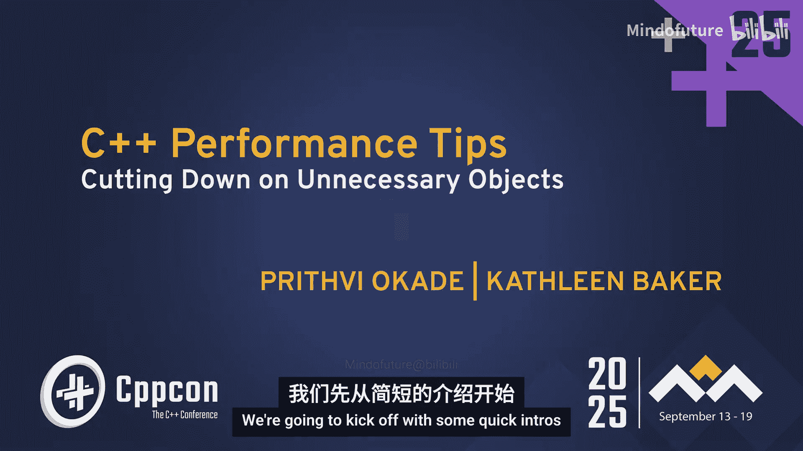
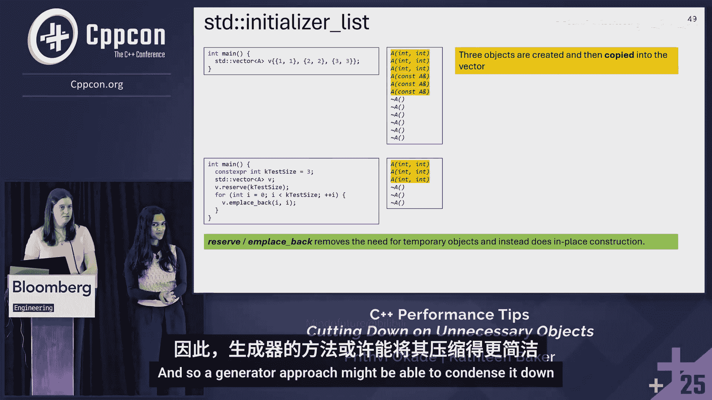

# 032：减少不必要的对象




## 概述

在本教程中，我们将学习如何在C++中识别并减少不必要的对象创建。不必要的对象会导致额外的内存分配、运行时代码执行和资源消耗，从而影响程序性能。我们将探讨从基础策略到高级技巧的一系列方法，包括使用视图类型、就地构造、透明比较器和编译时数据构造，以帮助您编写更高效的C++代码。

---

## 1：理解问题：为什么额外的对象是个问题？🤔

C++默认是值语义语言，这意味着在赋值时复制的是值本身，而不仅仅是指针。因此，当创建对象副本时，会调用复制构造函数，导致新的对象被创建。

考虑以下代码：
```cpp
std::string str = "hello world";
std::string str2 = str;
std::cout << str2;
```
我们实际上只是想打印“hello world”。更优的写法是直接打印，避免创建`str`和`str2`：
```cpp
std::cout << "hello world";
```
即使开启优化，第二个代码片段生成的代码量也少得多。这里的`str`和`str2`就是不必要的对象。

### 额外对象带来的问题
1.  **昂贵的运行时操作**：对象创建可能触发内存分配、操作系统调用或运行复杂算法。
2.  **执行更多代码**：如第一个例子所示，不必要的步骤增加了运行时负担。
3.  **占用更多内存**：需要更多的栈或堆空间。

### 何时可以接受额外对象？
对于小型且构造不昂贵的类型，创建额外对象是可以接受的。根据经验，在64位系统中，大小小于等于24字节且没有昂贵复制操作的类型可视为“小型”。例如，`std::string_view`（16字节）和`std::span`（24字节）。

### 如何检测额外对象？
推荐使用编译器警告`-Wall`和`-Wextra`。在整个教程中，我们会提及特定的警告和Clang-Tidy检查来帮助识别问题。

---

## 2：基础策略：避免创建临时对象 🛠️

上一节我们介绍了额外对象的问题，本节中我们来看看一些避免创建临时对象的基础策略。

### 将非平凡类型作为只读函数参数
当一个函数只需要读取一个非平凡类型（如`std::string`）时，按值传递会导致不必要的拷贝。

**不推荐的写法：**
```cpp
void foo(std::string s) { /* 只读取 s */ }
```
**推荐的写法：**
```cpp
void foo(const std::string& s) { /* 只读取 s */ }
```
对于`std::string`，更优的选择是使用`std::string_view`，我们稍后会详细讨论。

可以使用Clang-Tidy检查`performance-unnecessary-value-param`来发现此问题。

### 返回类的非平凡成员对象
当从一个成员函数返回类的非平凡成员时，应返回常量引用以避免拷贝。

**示例：**
```cpp
class MyClass {
    A a; // A 是非平凡类型
public:
    const A& getA() const { return a; } // 推荐：返回常量引用
    A getANotGreat() const { return a; } // 不推荐：导致拷贝
};
```
如果调用者将返回值存储为对象而非引用，拷贝仍会发生。可以使用Clang-Tidy检查`performance-no-automatic-move`和`performance-unnecessary-copy-initialization`来捕获此类情况。

### 使用基于范围的for循环
在遍历非平凡对象容器时，应使用引用以避免拷贝。

以下是三种写法的比较：
```cpp
std::vector<A> vec = getVec();
for (const auto a : vec) { ... } // 不好：创建拷贝
for (const auto& a : vec) { ... } // 好：无拷贝
for (auto&& a : vec) { ... } // 好：无拷贝（转发引用）
```
可以使用警告`-Wrange-loop-construct`或Clang-Tidy检查`performance-for-range-copy`来发现应使用引用的循环。

---

## 3：进阶技巧：结构化绑定、返回值与Lambda捕获 🧩

上一节我们介绍了函数参数和循环中的基础优化，本节中我们来看看一些更具体的场景。

### 结构化绑定
使用结构化绑定时，对于只读变量，应使用`const auto&`以避免拷贝。

**示例：**
```cpp
struct B { A a; int i; };
B b;
auto [a1] = b; // 不好：调用拷贝构造函数
const auto& [a2] = b; // 好：无拷贝
```

### 从函数中显式移出对象
关于函数返回值，有两个重要的优化：**返回值优化（NRVO）** 和 **强制拷贝省略（C++17起）**。

**不要阻碍NRVO：**
```cpp
A foo() {
    A a;
    return std::move(a); // 不好！显式move阻碍了NRVO
}
A fooBetter() {
    A a;
    return a; // 好！可能触发NRVO或强制拷贝省略
}
```
使用警告`-Wpessimizing-move`可以检测到阻碍NRVO的显式`move`。

**需要显式move的场景：**
当返回一个本地对象的成员，或通过结构化绑定返回时，需要显式使用`std::move`来避免拷贝。
```cpp
B foo() {
    B b;
    auto& [a] = b;
    return a; // 不好：调用拷贝构造函数
}
B fooBetter() {
    B b;
    auto& [a] = b;
    return std::move(a); // 好：调用移动构造函数
}
```

### Lambda捕获
Lambda按值捕获对象会导致拷贝。当安全时（确保被捕获对象在Lambda生命周期内有效），应使用按引用捕获。

**示例：**
```cpp
A a;
auto lambda1 = [a](){}; // 按值捕获：导致拷贝
auto lambda2 = [&a](){}; // 按引用捕获：无拷贝
```
对于成员函数，`[*this]`会拷贝整个对象，而`[this]`和`[&]`仅捕获指针。在C++20及以后，应避免使用默认捕获`[=]`，因为它已被废弃。

对于可变参数，也应使用引用捕获以避免拷贝：
```cpp
template <typename... Args>
void foo(Args&&... args) {
    auto lambda1 = [args...](){}; // 拷贝每个参数
    auto lambda2 = [&args...](){}; // 无拷贝
}
```

---

## 4：字符串与向量：使用视图和预留空间 📊

上一节我们探讨了函数和Lambda中的优化，本节我们将目光转向两个最常用的类型：`std::string`和`std::vector`。

### 使用`std::string_view`
`std::string_view`是一个轻量级的、不可修改的字符串视图，可以避免从字符串字面量或字符数组创建`std::string`对象。

**示例：**
```cpp
void foo(const std::string& s);
void fooBetter(std::string_view sv);

foo("hello"); // 创建临时 std::string 对象
fooBetter("hello"); // 无临时对象，使用 string_view
```
`string_view`可以处理`std::string`、`const char*`和带长度的`const char*`，且不进行堆分配。但注意，`string_view`不一定以空字符结尾，因此不能直接用于需要C风格字符串的API。

### 字符串拼接优化
使用`+`运算符拼接多个字符串会产生多个临时对象。
```cpp
std::string s = s1 + s2 + s3; // 创建2个临时字符串
```
更高效的方法是使用`reserve`预分配空间，然后进行拼接。
```cpp
std::string my_string_cat(std::string_view s1, std::string_view s2, std::string_view s3) {
    std::string result;
    result.reserve(s1.size() + s2.size() + s3.size());
    result.append(s1);
    result.append(s2);
    result.append(s3);
    return result;
}
```
即使对于小字符串（利用**短字符串优化**），`reserve`方法也仅创建一个对象，因此更优。

### 使用`reserve`优化向量
向`std::vector`添加元素时，如果空间不足，向量会重新分配内存并移动现有元素，这很昂贵。

**不推荐的写法：**
```cpp
std::vector<A> vec;
for (int i = 0; i < 4; ++i) {
    vec.emplace_back(i); // 可能导致多次重新分配
}
```
**推荐的写法：**
```cpp
std::vector<A> vec;
vec.reserve(4); // 预分配足够空间
for (int i = 0; i < 4; ++i) {
    vec.emplace_back(i); // 无重新分配，就地构造
}
```
可以使用Clang-Tidy检查`performance-reserve-in-vector-construction`来发现此类问题。

### 使用`std::span`避免向量创建
`std::span`是一个轻量级的连续序列视图，可以避免从C风格数组创建`std::vector`。

**示例：**
```cpp
void foo(const std::vector<int>& v);
void fooBetter(std::span<const int> sp);

int arr[] = {1, 2, 3};
foo({std::begin(arr), std::end(arr)}); // 创建临时 vector
fooBetter(arr); // 无临时对象，使用 span
```
`span`还能与其他连续容器（如`std::array`、`std::initializer_list`）一起工作。

---

## 5：标准库类型与容器：善用就地构造 🏗️

上一节我们学习了字符串和向量的优化，本节我们将把就地构造的理念应用到更多标准库类型和容器中。

### 初始化列表`std::initializer_list`
使用初始化列表构造容器（如`std::vector`）会导致元素先被创建，然后拷贝到容器中。
```cpp
std::vector<A> vec = {A(1), A(2), A(3)}; // 创建3个临时A对象并拷贝
```
更好的方法是使用`reserve`和`emplace_back`进行就地构造。
```cpp
std::vector<A> vec;
vec.reserve(3);
for (int i = 1; i <= 3; ++i) {
    vec.emplace_back(i); // 就地构造
}
```

### `std::pair`和`std::tuple`
对于`std::pair`，直接构造可能导致拷贝。C++23确保了移动构造，但在此之前或为了最佳性能，应使用`std::piecewise_construct`进行就地构造。
```cpp
// 直接构造（C++23前可能拷贝）
std::pair<A, A> p(A(1), A(2));
// 就地构造（推荐）
std::pair<A, A> p2(std::piecewise_construct,
                   std::forward_as_tuple(1),
                   std::forward_as_tuple(2));
```
`std::tuple`没有`piecewise_construct`，但可以使用`std::make_tuple`（移动构造）或C++17的**类模板实参推导（CTAD）**来避免拷贝。

### `std::optional`, `std::expected`, `std::variant`
对于这些可容纳值的类型，应使用其**就地构造函数**（`std::in_place`或`std::in_place_type`）或对应的`make_`函数（如`std::make_optional`），以避免先构造后移动。
```cpp
std::optional<A> opt1 = A(10); // 构造后移动
std::optional<A> opt2(std::in_place, 10); // 就地构造（推荐）
```
对于赋值操作，使用`emplace`方法（如`opt.emplace(20)`）也能实现就地构造，但注意它会先销毁当前值。

### `std::array`与`std::to_array`
`std::to_array`虽然方便，但会导致元素被移动构造。
```cpp
auto arr = std::to_array<A>({A(1), A(2)}); // 移动构造
```
直接使用`std::array`构造函数可以实现就地构造，尽管语法稍显冗长。C++17的CTAD可以部分改善这一点。
```cpp
std::array<A, 2> arr2 = {A(1), A(2)}; // 就地构造（推荐）
```

### 向容器添加元素：`emplace`系列函数
对于所有标准库容器，优先使用`emplace`、`emplace_back`、`emplace_front`、`try_emplace`（对于map）等函数，而不是`push`、`insert`，因为它们直接在现场构造对象，避免了临时对象的创建和移动/拷贝。
可以使用Clang-Tidy检查`modernize-use-emplace`来自动建议此类替换。

---

## 6：关联容器：透明比较器与高效插入 🔑

上一节我们涵盖了序列容器，本节我们来看看如何优化关联容器（如`std::map`、`std::set`）的使用。

### 使用`emplace`和`try_emplace`
对于`std::map`，使用下标运算符`[]`插入非平凡值类型时，会先默认构造一个值，然后进行赋值，效率低下。
```cpp
std::map<int, A> m;
m[10] = A(20); // 1. 默认构造A, 2. 构造A(20), 3. 移动赋值, 4. 析构两个临时对象
```
应使用`emplace`或`try_emplace`进行就地构造。
```cpp
m.emplace(10, 20); // 就地构造键值对（推荐）
m.try_emplace(10, 20); // 同上，且键存在时不构造值（更优）
```
当键已存在时，`try_emplace`保证不构造值对象，而`emplace`不提供此保证。

### 处理多参数构造函数
当键或值类型的构造函数接受多个参数时，需要使用`std::piecewise_construct`。
```cpp
// 错误：无法直接传递多个参数
// m.emplace(B(1,2), B(3,4));
// 正确：使用 piecewise_construct
m.emplace(std::piecewise_construct,
          std::forward_as_tuple(1, 2), // 就地构造键
          std::forward_as_tuple(3, 4)); // 就地构造值
```

### `insert_or_assign`
对于同时需要插入和赋值的场景，使用`insert_or_assign`比先检查再使用`[]`赋值更高效，因为它能利用移动语义。
```cpp
// 使用 insert_or_assign
auto [it, inserted] = m.insert_or_assign(10, A(30));
```

### 透明比较器
当在`std::set<std::string>`或`std::map<std::string, ...>`上使用`find`、`count`、`contains`等方法，并传入一个`const char*`（字符串字面量）时，编译器会隐式创建一个临时的`std::string`对象用于比较，这会产生不必要的分配。

**问题示例：**
```cpp
std::set<std::string> s = {"hello", "world"};
const char* test = "hello";
s.find(test); // 隐式创建临时 std::string，触发内存分配
```
**解决方案：** 使用**透明比较器**，如`std::less<>`（对于有序容器）或自定义的透明哈希与相等比较（对于无序容器）。
```cpp
// 有序容器
std::set<std::string, std::less<>> s = {"hello", "world"};
s.find(test); // 无临时对象，直接比较 const char*

// 无序容器
struct MyStringHash {
    using is_transparent = void;
    size_t operator()(std::string_view sv) const { /* ... */ }
    size_t operator()(const std::string& s) const { /* ... */ }
    size_t operator()(const char* s) const { /* ... */ }
};
std::unordered_set<std::string, MyStringHash, std::equal_to<>> us;
us.find(test); // 无临时对象
```
透明比较器通过内部的`is_transparent`类型标识，允许容器用不同的可比类型直接进行比较，无需转换。

---

## 7：编译时数据构造：将工作提前到编译期 ⚡

我们之前讨论的都是如何在运行时避免临时对象。终极优化是将对象的构造从运行时转移到编译时。编译时构造的对象不占用运行时初始化时间，其内存也在编译期就布局好。

### 局部和全局对象
对于不会被修改的局部`const`对象或全局对象，可以考虑将其变为编译时常量。

**全局对象问题：**
```cpp
const std::string kGlobalStr = "hello"; // 运行时初始化
const std::vector<int> kGlobalVec = {1, 2, 3}; // 运行时初始化
```
使用编译标志`-Wglobal-constructors`和`-Wexit-time-destructors`可以警告此类运行时初始化的全局对象。

**优化为编译时常量：**
```cpp
constexpr std::string_view kGlobalStr = "hello"; // 编译期
constexpr std::array<int, 3> kGlobalVec = {1, 2, 3}; // 编译期
```
将`std::vector`改为`std::array`，`std::string`改为`std::string_view`，并加上`constexpr`，即可在编译期初始化。

### 单例（Magic Static）的局限
有时人们用“Magic Static”（函数内的静态局部变量）来延迟全局对象的初始化。
```cpp
const std::string& GetStr() {
    static const std::string s = "hello";
    return s;
}
```
这解决了全局构造函数的问题，但**没有解决退出时析构**的问题（`-Wexit-time-destructors`仍会警告）。将其改为`constexpr`视图或数组是更彻底的方案。

### 用户自定义数据结构
对于自定义的、包含字符串或向量的结构体，也可以尝试迁移到编译时。核心是将所有成员类型替换为编译期友好的类型（如`std::string_view`、`std::array`）。
```cpp
// 运行时版本
struct MyStruct { std::string name; std::vector<int> data; };
const std::vector<MyStruct> kData = { ... };

// 编译时版本
struct MyStructCT {
    std::string_view name;
    std::span<const int> data;
};
constexpr std::array<MyStructCT, N> kDataCT = { ... };
```

### 编译期字符串拼接
如果字符串拼接的结果在编译期可知，可以编写工具类在编译期完成拼接。
```cpp
constexpr std::string_view kPart1 = "Hello, ";
constexpr std::string_view kPart2 = "world!";
// 运行时拼接
auto runtime_str = std::string(kPart1) + std::string(kPart2);
// 编译期拼接（需自定义类，如 MyCompileTimeStringJoiner）
constexpr auto compiletime_str = MyCompileTimeStringJoiner<kPart1, kPart2>::value;
```

### 编译期集合（Set/Map）
目前C++标准库没有`constexpr`的`std::set`或`std::map`。C++23引入了`std::flat_map`和`std::flat_set`，并计划在C++26中使其成为`constexpr`。在此之前，可以考虑使用第三方库（如Chromium的`fixed_flat_map`）或为简单用例编写自己的编译期查找包装器。

---

## 总结

在本教程中，我们一起学习了如何在C++中减少不必要的对象创建以提升性能。我们从理解问题本质开始，探讨了值语义带来的拷贝开销。然后，我们学习了一系列从基础到高级的策略：

1.  **基础策略**：对只读的非平凡类型使用常量引用参数、返回成员变量的引用、在基于范围的for循环中使用引用。
2.  **进阶技巧**：在结构化绑定中使用`const auto&`，理解NRVO并避免不必要的`std::move`，在Lambda中优先使用引用捕获。
3.  **字符串与向量优化**：使用`std::string_view`和`std::span`避免数据复制，使用`reserve`预分配内存，优化字符串拼接。
4.  **标准库容器就地构造**：对`pair`、`tuple`、`optional`、`variant`等使用就地构造函数或`emplace`系列方法。
5.  **关联容器优化**：使用`emplace`/`try_emplace`插入，利用透明比较器（`std::less<>`、透明哈希）避免查找时的临时对象创建。
6.  **编译时数据构造**：将常量数据迁移到编译期，使用`constexpr`、`std::array`、`std::string_view`等，消除运行时初始化和析构开销。

贯穿始终的是“**就地构造**”的核心思想：尽可能直接在目标内存位置构造对象，避免先构造后拷贝/移动。同时，善用编译器警告（如`-Wall`、`-Wextra`、`-Wpessimizing-move`）和Clang-Tidy静态分析工具，可以帮助我们自动识别许多优化机会。




性能优化需要结合实际场景进行测量，但掌握这些模式将为编写高效、现代的C++代码奠定坚实基础。