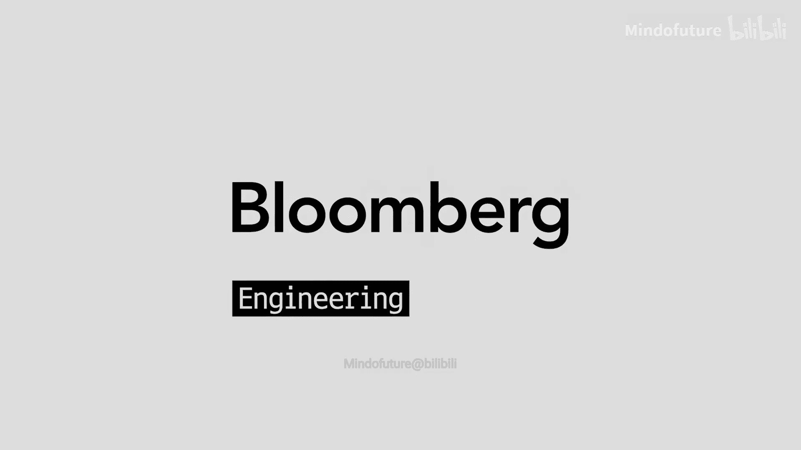
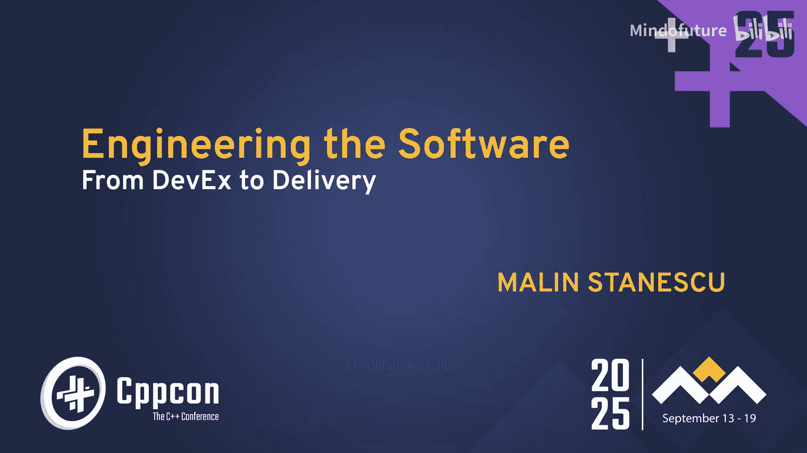
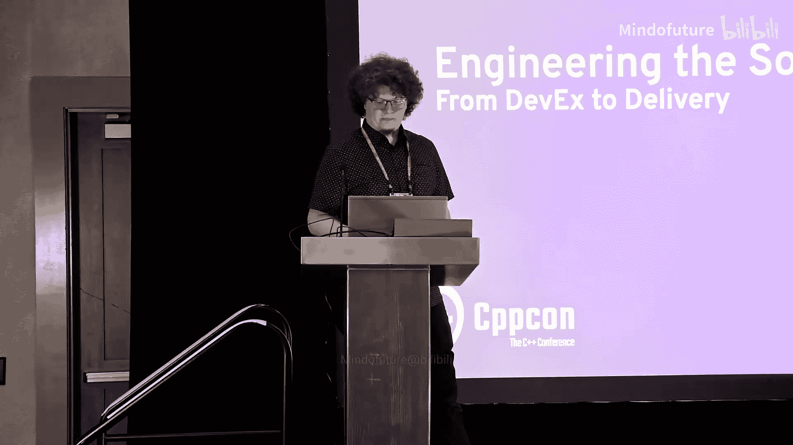
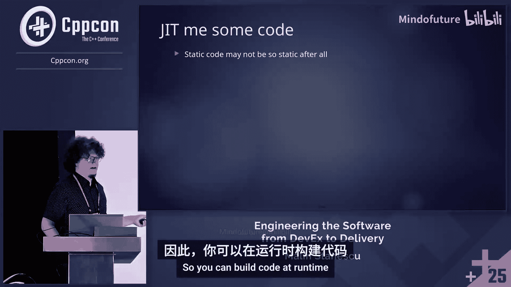
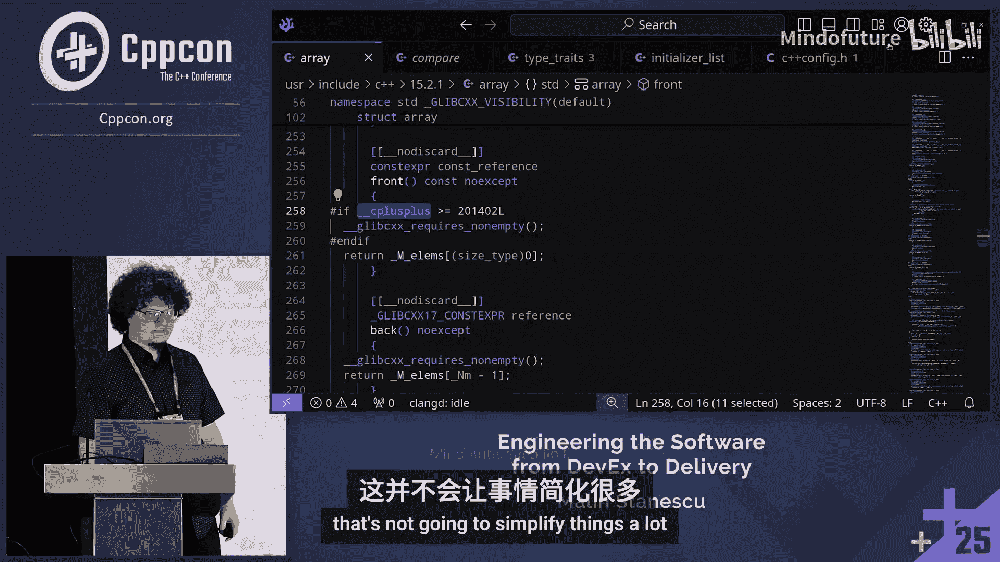
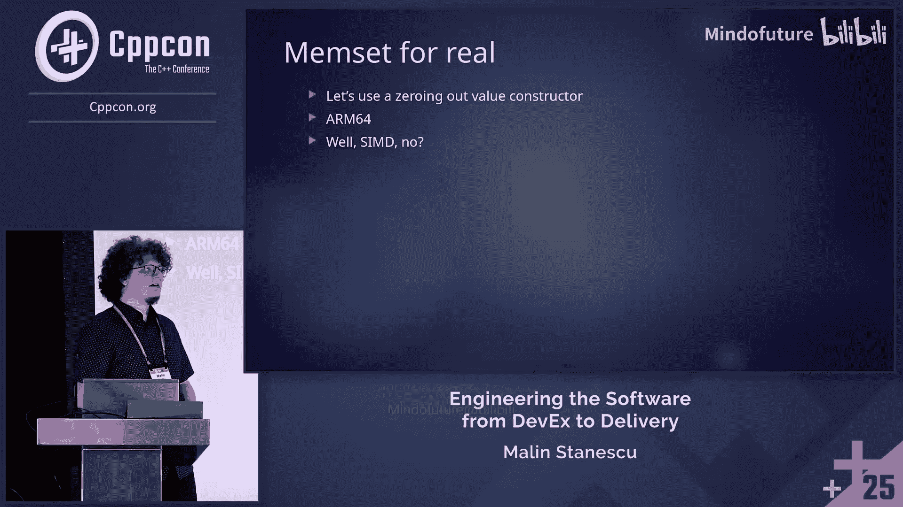
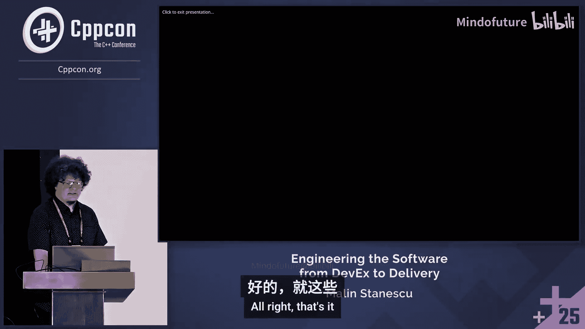

# 033：下移复杂性——扩展C++代码的真正路径 🛠️







在本节课中，我们将探讨如何通过“下移复杂性”来有效管理和扩展大型C++项目。我们将分析从汇编到现代高级语言的演进，讨论设计模式、构建系统、依赖管理等核心挑战，并思考未来编程语言的发展方向。

## 概述：软件工程的挑战与目标

作为一名程序员，我们日常的大部分工作被称为“软件工程”。这意味着我们需要将需求（无论是瀑布模型、用户故事还是书面要求）转化为可运行的代码。本节课将讨论我们如何交付软件，以及如何通过工程化手段让开发工作变得更轻松。

## 演讲者介绍 👨‍💻

我是Malin Stanescu，是Ofer（大陆集团的一家子公司）的高级软件工程师。我们专注于自动驾驶汽车技术。我的日常工作非常多样化，可能涉及USB描述符、变分原理，但主要与“运动恢复结构”相关，我是一名几何计算机视觉专家。

此外，我还参与了一个行星防御研究项目，旨在探测可能对地球构成威胁的小行星。我们使用一种称为“合成跟踪”的技术，通过叠加多张图像来增强信噪比，从而用较小的望远镜发现快速移动的暗弱天体。这项计算非常密集，但通过优化，我们已能将处理时间从几天缩短到几分钟。

我的工作核心通常是首先创建一个易于开发的环境，这能极大地简化创建可用软件的过程。

## 代码规模与团队复杂性 📈

C++ 拥有大量大型代码库。理解不同规模项目的挑战至关重要：
*   **1-10行**：简单的单行程序或实用函数，几乎不会出错。
*   **100-1000行**：包含函数和类的演示代码，易于实现和理解。
*   **1万-10万行**：包含小型组件和库，需要一个团队维护。此时持续集成（CI）管道变得重要。
*   **100万-1000万行**：需要多个团队协作。代码变更率很高，测试和CI系统面临巨大压力。
*   **10亿行以上**：可能出现项目特有的“方言”，甚至将编译器包含在代码库中。管理庞大的团队和快速的代码变更成为核心挑战。

随着团队和代码复杂性的增加，用于测试代码的时间反而减少。因此，工程化你的CI流程与工程化你的功能代码同等重要。

## 管理复杂性的策略：编译需求 🧠

管理这种复杂性的一种方法是“下移”复杂性，即简化代码或通过分工来扩展，而不显著增加维护负担。

关键在于你为**什么**而编写代码：
*   **通用编程**：如桌面应用或Web服务器基础设施。重点是让各个部分良好交互。**面向对象编程**是常见模式，它能将需求转化为业务对象，减轻思维负担。
*   **嵌入式编程**：资源固定且有限。程序员需要“编译需求”，即思考如何在实际约束下实现功能。这种方式促使你对代码进行推理，可能带来数据导向设计等优势，并有机会优化性能。

除了实现功能和性能，你还可以投入时间思考如何让代码对你和你的队友来说更**易于使用和开发**。这可以显著抵消理解需求所带来的负担，从而以更少的努力获得更好的产品。



## 设计模式与依赖注入的权衡 ⚖️

许多培训资料很少讨论设计模式的成本。例如，我曾尝试将小行星检测软件的各个模块集成到一个可执行文件中，通过动态加载提供灵活性。但这需要设计正确的接口、设置控制反转容器，并且调试变得复杂（需要配置IDE来启动宿主应用）。这些看似微小的痛点累积起来，可能导致项目延期数月。

**依赖注入**允许从外部切换实现方式。通常通过创建基类和派生类来实现。但在C++中，你可以使用**静态依赖注入**：
```cpp
// 通过构建系统选择编译不同的实现文件
// config.h
#ifdef USE_IMPLEMENTATION_A
    #include "implementation_a.h"
#else
    #include "implementation_b.h"
#endif
```
这种方式无需动态派发（虚函数调用），没有运行时开销。但它要求项目具备构建系统，且测试时需要检查所有可能的构建配置组合，增加了测试复杂度。这听起来只对嵌入式（一次构建）有用，但高性能计算库（如BLAS）也常用此模式，针对特定硬件配置源码并在运行时构建。

## C++的构建挑战与模块化 ⏱️

C++的构建时间是个老大难问题。但通过工程化努力，也可以实现快速构建。一个简单的“Hello World”程序在C语言中编译只需20毫秒，在C++中稍慢，但依然很快。

C++构建缓慢通常与标准库和模板的（过度）使用有关。以`std::array`为例，这个基础数据结构为了提供值语义（C语言数组是引用语义），引入了大量头文件和模板代码，导致编译单次就可能展开上万行代码。



相比之下，自己实现一个简单的数组类型可以避免引入迭代器等复杂头文件，初始化行为更明确，甚至能修复标准库中可能存在的bug（例如C++14中`const`访问器未标记为`constexpr`的问题）。但这会牺牲标准兼容性。

那么，C++不利于软件扩展吗？静态类型检查有助于确保正确性，但模板滥用会导致编译时间长、错误信息晦涩。**静态依赖注入**是避免模板滥用的一种方法。现代C++的特性（如概念、契约）能否帮助简化复杂性？从`std::array`的实现来看，它们往往只是在头文件中添加更多条件编译宏，并未从根本上简化。

此外，C++在处理多维容器时也不够优雅，将其转换为能高效优化（如内存拷贝）的简单循环并不容易。

## 提升开发效率的历史性跨越 🚀

历史上，几次重大的语言演进显著提升了开发效率：
1.  **汇编到C**：引入了**数据结构**和**结构化编程**，极大降低了管理代码的思维负担。
2.  **自动资源管理**：C++的RAII、Java/C#的垃圾回收、Python的自动内存管理。无需手动管理指针和内存，极大地提升了代码正确性，助力软件扩展。

现代C++特性（如模块）旨在解决构建时间问题和头文件机制的脆弱性。但模块与头文件不同，它不支持通过包含不同配置头文件来切换实现变体（例如Linux内核的Kconfig或Marlin固件的配置头文件方式）。

模块的核心是**记忆化**缓存编译结果。类似技术（预编译头文件）因混合不同翻译单元的状态而效果不佳。Rust编译器也严重依赖记忆化来获得可接受的构建速度。

## 开发体验与安全性 🔒

许多提升开发体验（DevEx）的特性也提升了安全性，反之亦然：
*   **静态类型**：帮助IDE提供准确的自动补全，也防止了类型错误。
*   **Rust的所有权模型**：以内存安全著称，但借用检查器有时会拒绝实际上正确的代码，影响开发体验。

安全性的范畴更广。我曾在一个没有指针、无法直接访问内存的配置语言（Plant ML）中遇到内存损坏问题，原因是配置错误导致硬件缓冲区溢出。这说明，缺乏静态类型和检查机制，即使没有指针也不安全。

在功能安全领域，动态内存分配通常被禁止以避免内存碎片。因此，Rust引以为傲的所有权模型在此用处不大，因为所有数据都是静态分配的，生命周期与程序相同。

更有用的安全特性可能是**禁止整型提升**（C/C++中小的整型会被提升，导致隐蔽错误），以及更好地处理**内存对齐**问题（尤其在异构多核嵌入式系统中）。

## 依赖管理与部署困境 📦

将软件及其所有依赖交付到用户计算机是一个难题。
*   **包管理器**：系统包管理器可能没有所需版本；语言包管理器（如NuGet, Cargo）会遇到“钻石依赖”问题——两个依赖项需要同一个库的不同版本。NuGet类似C++虚继承，尝试统一版本；Cargo则允许每个包携带自己的依赖副本，导致代码膨胀。
*   **传统解决方案**：Linux发行版充当了“软件发行商”的角色，协调所有软件包共同工作。
*   **现代方案**：容器。但容器本质上也是复制一切，并非最优雅的解决方案。

这本质上是一个**版本管理和变体管理**问题。每次创建新版本都相当于创建了一个分支，需要维护。ABI（应用二进制接口）相对容易处理（可以重新编译），但API（应用编程接口）则难以改变，因为它是人类定义的契约。

## 反射、元编程与未来展望 🔮

C++23引入了反射。观察其他语言（如C#）的实现很有启发。C#可以通过库函数实现反射，无需额外语法关键字。C++由于担心ABI破坏，选择引入新的语言关键字和编译期元编程，这增加了语言复杂度，形成了“两个语言”（编译期和运行期）。

如果我们把编译器也视为一个软件组件，就可以挂钩并使用它。函数式编程中的“函数效应”概念可以将计算（如处理头文件）表示为对象，并结合环境信息使其近乎纯函数。这样，实现模块的记忆化就变成了缓存这些函数效应。这允许我们将代码视为数据，用普通函数操作它。

更重要的是，通过运行期反射，我们可以跨多个软件版本进行反射，实现**API差异比较**等高级功能。

最后，我们需要重新思考编程的本质。C++是编译型语言，但在硬件层面，它被解释为微指令在多个执行端口上运行。我们通常看不到内存访问的物理延迟。例如，在ARM64上清零内存，编译器可以生成使用`DC ZVA`指令的优化代码，该指令直接操作数据缓存，效率极高。



我们目前优化代码的方式（修改源码，祈祷编译器向量化）类似于“玄学”。未来的编程语言应该允许我们更直接地表达意图，让系统为我们完成优化。

## 总结




本节课我们一起探讨了扩展C++代码时面临的核心挑战与管理策略。我们从代码规模与团队协作的复杂性出发，分析了“编译需求”的思想、设计模式的成本、构建系统的优化，以及依赖管理和部署的困境。我们还对比了不同语言在开发体验与安全性上的取舍，并展望了通过反射、元编程以及更根本的语言设计来“下移复杂性”、提升开发效率的未来方向。关键在于，我们不仅要思考如何实现功能，更要思考如何构建一个让开发本身变得更简单的环境。