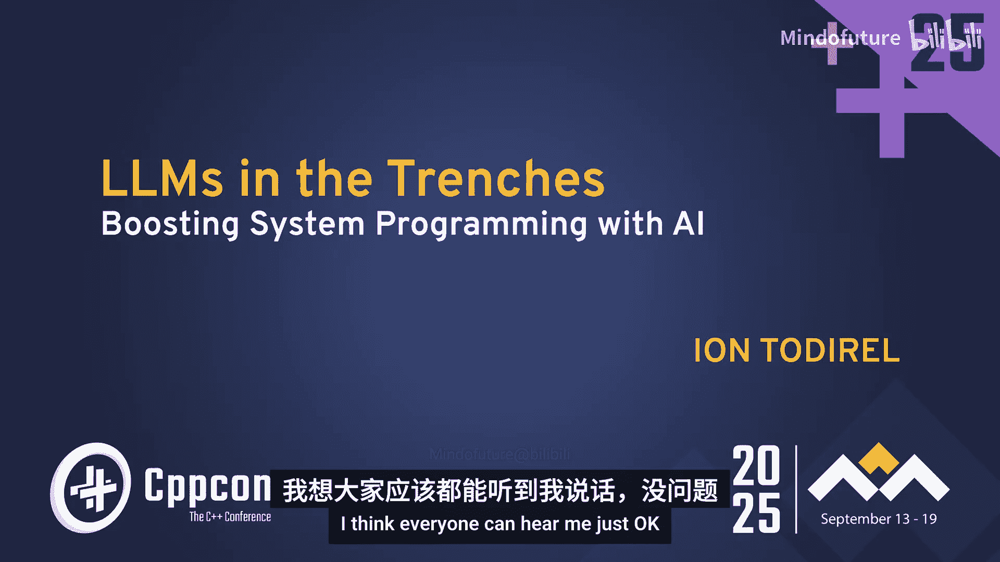

# 034：用AI提升开发效率 🚀




在本教程中，我们将跟随 Ion Todirel 在 CppCon 2025 上的演讲，学习如何将人工智能工具应用于实际的 C++ 系统编程项目中。我们将通过一个完整的业余无线电中继器/追踪器项目，探索 AI 在硬件设计、代码优化、库移植和系统集成等多个任务中的实际应用、成功经验与教训。

## 项目概述：中继器与追踪器 📡

本项目是一个完全从零开始构建的业余无线电设备，包含一个中继器和一个追踪器。它不依赖互联网基础设施，利用无线电波进行通信，尺寸小巧，可手持且电池供电。

硬件由两块电路板组成：
*   **主板**：负责数据调制解调，核心是 DSPIC33 微控制器。
*   **数据板**：运行中继器和追踪器逻辑，核心是 ESP32-WROOM-32E 微控制器，并集成了 GPS 接收器和环境传感器。

软件栈从底层硬件开始，向上经过调制解调器通信、二进制数据到文本的转换，最终到达中继器和追踪器的编码/解码逻辑。

接下来，我们将深入几个具体任务，看看 AI 如何协助解决。

---

## 任务一：ESP32 微控制器引脚分配 🧩

在开始编写固件之前，我们需要为所有外设（GPS、调制解调器、电源系统、LED等）分配 ESP32 的 GPIO 引脚。这需要考虑引脚功能、串行接口数量、I2C 需求以及需要避开的特殊引脚。

上一节我们介绍了项目整体架构，本节中我们来看看如何利用 AI 快速完成硬件引脚规划。

### 应用 AI 的方法
我们向 AI 模型提供简单的提示，包含芯片型号、外设需求和约束条件。

**核心提示示例：**
```
我正在使用 ESP32-WROOM-32E 微控制器。我的计划是连接以下外设：GPS（UART）、调制解调器（UART）、电源控制（GPIO）、状态LED（GPIO）、环境传感器（I2C）。请为我提供一个引脚分配方案。请避免使用 Strapping Pins，并注意哪些引脚是仅输入模式。
```

### AI 生成的方案与评估
经过几次迭代，AI 能够生成一个完整且基本可用的引脚分配方案。它成功识别了：
*   需要上拉电阻和去耦电容的特殊引脚（如 `GPIO2`）。
*   可用于模拟输入的 `GPIO` 引脚。
*   大部分 `Strapping Pins`。

### 遇到的挑战与机会
然而，AI 方案也存在一些问题：
*   **信息不完整**：某些模型仅将 `GPIO26-32` 标记为 `GPIO`，未区分输入/输出。
*   **错误限制**：错误地声称 `GPIO0` 只能用于编程。
*   **硬件误解**：错误建议为 `GPIO0` 添加上拉（这会导致无法编程），或假设模块有内部闪存占用了某些引脚。

### 经验总结
对于此类硬件规划任务：
1.  **提供图像最有效**：直接提供数据手册中的引脚排列图，效果远好于仅提供文字描述。
2.  **明确约束是关键**：明确指出需要避开的引脚（如 `Strapping Pins`）和仅输入引脚，能大幅减少迭代次数。
3.  **多模型尝试**：不同模型表现不同，不要局限于一个模型。
4.  **上下文越多，迭代越少**：提供尽可能多的背景信息，有助于 AI 一次性给出更准确的方案。

---

## 任务二：GPIO 与驱动程序初始化 ⚙️

有了引脚分配方案后，下一步是初始化这些 GPIO 并配置相应的驱动程序（如 I2C）。我们的目标是使用 Espressif 官方 IDF SDK，并避免使用已弃用的接口。

上一节我们利用 AI 完成了硬件引脚规划，本节中我们来看看如何快速生成初始化的代码框架。

### 应用 AI 的方法
我们将引脚分配表（例如 CSV 格式）粘贴给 AI，并请求生成初始化代码。

**核心提示示例：**
```
以下是 ESP32-WROOM-32E 的引脚分配：
LED, GPIO4
POWER_EN, GPIO12, 需要配置为开漏输出并上拉
I2C_SDA, GPIO21
I2C_SCL, GPIO22
请使用 ESP-IDF 编写初始化这些 GPIO 和 I2C 驱动程序的代码。
```

### AI 生成的代码与评估
AI 能够极其快速地生成可编译的代码框架。它成功建议了与开源漏极 I/O（如电池充电器）接口的正确配置（上拉，激活时输出低电平）。

### 遇到的挑战与机会
初始代码也存在一些需要调整的地方：
*   **代码风格偏好**：AI 可能首先生成使用 `esp_rom_gpio.h` 的代码，但开发者可能更倾向于使用 `driver/gpio.h` 中的高级函数。
*   **配置不完整**：生成的 `gpio_config_t` 结构体可能未完全初始化所有字段，导致聚合初始化错误。
*   **接口过时**：可能推荐使用已弃用的 `i2c_driver_install` 而不是 `i2c_master_init`。
*   **Web 编辑器差异**：像 ChatGPT 的 Web 代码编辑器有时显示的内容与实际聊天回复不符，造成混淆。

### 经验总结
对于代码生成任务：
1.  **快速启动优势**：AI 能快速生成基础代码，节省查阅文档和示例的时间。
2.  **代理模式潜力**：此任务非常适合使用具有“执行工具”能力的 AI 代理。代理可以自动编译代码，根据错误信息迭代修改，直到没有错误为止。
3.  **权衡迭代成本**：有时直接手动修复 AI 代码中的几个小错误，可能比反复提示 AI 修改更快。
4.  **慎用 Web 编辑器**：对于关键代码，更推荐让 AI 在聊天中直接输出代码块，以避免渲染不一致问题。

---

## 任务三：优化 C++ 库以用于嵌入式平台 🏎️

项目中有两个核心 C++ 库（路由器和封包编码器），最初是在桌面平台（Linux）上开发的。我们需要将它们移植到资源受限的嵌入式平台（如 ESP32、Raspberry Pi Pico），并进行性能优化，特别是减少或消除堆内存分配。

上一节我们生成了硬件初始化代码，本节中我们聚焦于软件库的优化，使其更适合嵌入式环境。

### 应用 AI 的方法：性能优化
我们选取库中的特定函数，要求 AI 进行优化。

**示例一：字符串查找函数优化**
原始函数使用 `std::map` 查找枚举值。AI 在第一次迭代中建议使用排序的静态数组和 `std::lower_bound`，并引入了 `std::string_view` 以避免依赖堆分配的容器。第二次迭代中，AI 发现了更优解：由于枚举值首字母唯一，直接比较第一个字符即可。

**示例二：地址比较函数优化**
原始函数将地址结构体转换为字符串再比较，可能效率低下。AI 首先优化了 `to_string` 函数本身。随后，在尝试避免字符串转换的请求下，AI 提出了“标准化”地址的思路，即先将不同格式的地址转换为一致格式，再进行简单的成员比较，代码比手写的复杂逻辑更简洁、易读。

### 遇到的挑战与机会
*   **性能假设需验证**：AI 认为“预留内存的 `to_string`”比“原始 `to_string`”更快，但实际测量发现前者更慢。这凸显了性能优化必须依赖实际测量。
*   **解决方案不可预测**：不同的模型，甚至同一模型的不同次提问，可能会给出截然不同的优化方案（如复杂的哈希方案）。
*   **嵌入式偏见**：某些模型会强烈建议避免使用任何 STL 组件，尽管现代嵌入式工具链已良好支持。

### 经验总结
对于性能优化任务：
1.  **总能获得启发**：即使 AI 的方案不是最终答案，其思路也常能提供有价值的优化方向。
2.  **必须实测性能**：绝不能假设 AI 推荐的方案就是最快的。测量是唯一真理。
3.  **代理工具是绝配**：可以创建 AI 代理，自动运行性能测试，并迭代尝试不同的优化方案，直到找到最优解。
4.  **详细注释有帮助**：在提供给 AI 的代码中包含详细注释，有助于模型更好地理解上下文和意图，从而提出更合适的方案。

---

## 任务四：设计支持多编码的字符串 API 🔤

在封包编码器中，消息部分可能包含 UTF-8 文本。最初的设计考虑使用 `std::codecvt` 在不同编码（UTF-8, UTF-16）间进行转换。我们需要一个高效、现代且不引入沉重外部依赖的 API 设计。

上一节我们探讨了代码性能优化，本节我们关注 API 设计，如何优雅地处理字符串编码问题。

### 应用 AI 的方法
我们向 AI 描述需求：只有消息部分可能是 UTF-8，其余都是 ASCII；希望避免运行时转码；寻求最佳设计模式。

### AI 的指导与最终方案
AI 立即指出一个关键信息：`std::codecvt` 在 C++17 中已被弃用，并在 C++20 中移除。这促使我们重新思考设计。
AI 随后建议了 ICU 库，但它过于庞大。最终，通过几轮迭代，AI 帮助确认了一个简洁的设计：
*   **内部存储**：消息在内部仅存储为字节数组 (`std::vector<uint8_t>`)。
*   **灵活输入**：提供多个重载的 `set_message` 函数，接受 `std::string_view`、`std::u8string` 等，直接存储其字节，不进行转码。
*   **灵活输出**：提供 `as_ascii_string()`, `as_u8string()` 等方法，按需格式化整个封包。调制解调器最终使用的则是返回字节数组的接口。

### 遇到的挑战与机会
*   **知识更新**：早期模型可能未及时指出 `std::codecvt` 已弃用，但新模型通常能立刻识别。
*   **平台假设**：AI 可能建议使用 `MultiByteToWideChar` 等 Windows 特定 API，而未考虑跨平台需求。

### 经验总结
对于 API 设计任务：
1.  **规避已弃用特性**：AI 能有效提醒我们避免使用即将或已经过时的标准库组件。
2.  **快速探索方案**：AI 能帮助快速头脑风暴，从复杂、传统的方案（如全面转码）过渡到更简单、高效的设计（如字节存储）。
3.  **明确约束条件**：必须明确告知 AI 跨平台、轻量级等约束条件，以避免得到不合适的建议。

---

## 任务五：构建 GPS 数据模拟与可视化系统 🗺️

开发追踪器时，需要真实的 GPS 数据进行测试和调试。我们不可能一直带着设备在路上跑。因此，需要构建一个系统：能够生成模拟的 GPS 路线数据，并实时播放给追踪器，同时在地图上可视化轨迹。

上一节我们设计了数据处理 API，本节我们进入系统集成领域，构建一个复杂的测试支持工具链。

### 应用 AI 的方法
我们向 AI 描述完整需求：生成路线、模拟 GPS 信号、可视化地图。我们对其中涉及的技术栈（如 OpenStreetMap, Valhalla）知之甚少。

### AI 的协助与实现方案
AI 出色地充当了技术选型和快速原型设计的向导：
1.  **地图服务**：推荐了可本地运行的 OpenStreetMap 容器。
2.  **路线生成**：推荐了 Valhalla 路径引擎，并提供了从 `.pbf` 地图文件生成路线的 Python 脚本。
3.  **高级需求**：当询问如何获取道路限速信息时，AI 指出 OpenStreetMap 数据中包含相关标签，并给出了查询 Valhalla API 获取这些信息的方法。
4.  **插值与计算**：提供了使用 Haversine 公式计算航向的代码。
5.  **Web 服务器**：推荐了简单易用的 `crow` C++ WebSocket 库。
6.  **前端展示**：生成了使用 OpenLayers 库显示地图和轨迹的 JavaScript 代码。

### 遇到的挑战与机会
*   **复杂任务分解**：AI 难以一次性给出一个完整的、符合接口规范的 GPS 模拟器类实现。它擅长解决子问题，但将子问题组装成完整模块仍需人工完成。
*   **代码质量**：对于复杂任务，初始生成的代码可能可读性不佳。

### 经验总结
对于系统集成与原型设计任务：
1.  **强大的技术侦察兵**：AI 在快速学习并应用陌生技术栈（如地图服务、路径规划）方面表现惊人，极大降低了入门门槛。
2.  **脚本生成专家**：生成 Python、JavaScript 脚本对 AI 来说轻而易举，几乎无需迭代。
3.  **复杂模块仍需人工**：对于需要精细设计接口和状态的复杂模块，AI 目前更擅长提供“零部件”而非交付“整机”。
4.  **结果需要评估**：对于 AI 推荐的库和方案，仍需人工评估其适用性和可靠性。

---


## 任务六：在 Linux 容器中自动发现 USB 串口 🔌

为了自动化测试和容器化部署，需要让程序能自动识别并映射特定的 USB 转串口设备（即项目的主板），即使系统上连接了多个同类设备。

上一节我们构建了模拟测试环境，本节我们解决一个具体的系统编程问题：在 Linux 下如何以编程方式可靠地发现特定硬件设备。

### 应用 AI 的方法
我们询问 AI：在 Linux 下，如何以编程方式唯一标识和发现 USB 串口设备，而不依赖静态系统配置（如 udev 规则）。

### AI 的解决方案
AI 准确推荐了使用 `libudev` 库，它是 `udev` 工具的程序化接口。AI 生成了代码来查询设备管理器，遍历串口设备，并提取关键属性如制造商(`ID_VENDOR`)、产品ID(`ID_MODEL_ID`)、序列号(`ID_SERIAL`)等。我们可以通过这些属性来过滤和识别特定设备。

### 遇到的挑战与机会
*   **属性名幻觉**：AI 可能不知道 `ID_SERIAL` 这个确切的属性名对应的是设备的序列号，有时会“幻想”出一个不存在的属性名。但这可以通过迭代和查阅 `udevadm info` 命令的输出快速纠正。

### 经验总结
对于系统编程任务：
1.  **精准定位工具库**：AI 能快速指出完成特定系统任务应该使用的正确库（如 `libudev`），节省大量搜索时间。
2.  **快速生成样板代码**：能快速生成查询、遍历、过滤设备列表的样板代码。
3.  **需验证细节**：对于属性名、标志位等具体细节，需要结合官方文档或系统命令进行验证，AI 可能在此处产生小误差。

---

## 总结与核心洞见 💡

在本教程中，我们一起学习了如何将 AI 工具应用于一个完整的 C++ 系统编程项目，涵盖了从硬件引脚规划、驱动初始化、代码优化、API 设计，到系统集成和脚本编写的多个方面。

通过 Ion 的实践，我们可以得出以下核心洞见：

*   **原型设计加速器**：AI 在项目早期原型和设计阶段作用巨大，能显著提升生产力，让开发者快速验证想法。
*   **擅长处理样板代码**：对于 C++ 中常见的模板代码、序列化/反序列化、低级硬件操作等，AI 能高效生成可靠代码。
*   **不完美但有用**：AI 的答案不必完美或完整即可提供巨大价值。有经验的开发者可以快速理解、修正并整合 AI 的建议。
*   **迭代与代理**：AI 生成的代码可能需要迭代改进。具备“执行工具”能力的 AI 代理（如自动编译、运行测试）有望缩短这个迭代循环。
*   **持续进化**：AI 模型的能力在快速进步，尤其在代码优化方面，时常能给出令人惊喜的方案。
*   **设计能力是关键**：要高效利用 AI，开发者自身需要具备良好的软件设计能力，才能提出正确的问题，并判断和整合 AI 的输出。
*   **安全与工程流程**：在生产环境中使用 AI，绝不能绕过既有的代码审查、安全测试和工程最佳实践。AI 是强大的助手，但责任仍在人类工程师肩上。


总而言之，AI 已成为现代 C++ 开发者工具箱中一个极具潜力的新工具。它并非要取代开发者，而是通过处理繁琐细节、提供创意灵感和加速学习过程，来**增强**开发者的能力，让我们能更专注于高层次的架构设计和问题解决。