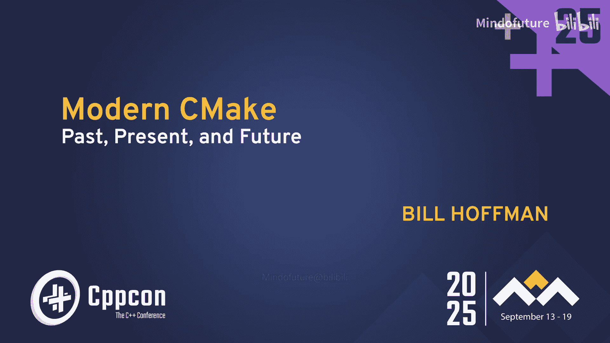
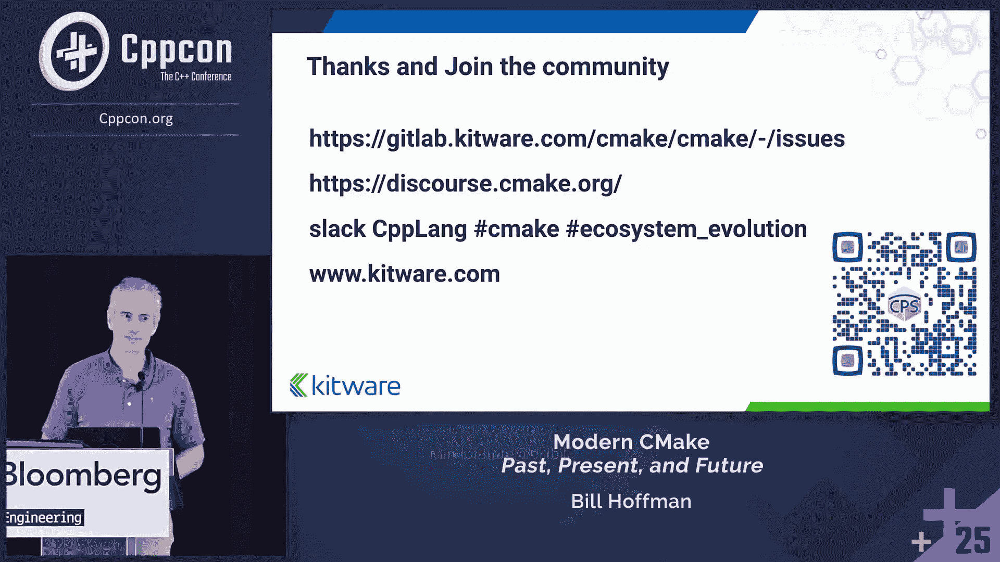

# 035：C++构建可移植性的25年




在本教程中，我们将跟随 Bill Hoffman 在 CppCon 2025 上的演讲，回顾 CMake 在过去25年中的发展历程。我们将了解 CMake 的起源、各个发展阶段的核心特性、当前的最新进展以及对未来的展望。内容将涵盖从最初的“标志汤”到现代目标模型，再到即将到来的 CMake 4 时代，重点关注其如何提升 C++ 项目的构建可移植性和开发体验。

---

## 演讲者介绍

上一节我们概述了本教程的内容，本节中我们来认识一下本次演讲的主讲人 Bill Hoffman。

Bill Hoffman 拥有丰富的职业生涯。他在 G Research 的计算机视觉组工作了九年。作为一名刚毕业的本科生，他的任务是将团队从 Symbolics Lisp 机器迁移到当时崭新的 C++ 语言，最初使用 SGI 工作站，后来转向 Linux 和 Windows。他逐渐成为了负责软件库、GNU Make 和 Autotools 的“软件库专家”。

1998/1999年，他共同创立了 Kitware 公司并担任 CTO。CMake 的原型大约在1999年启动。如今，他更多从事管理工作，并为 CMake 项目寻找资金以支持像 Brad King（演讲中提到的“veto”）这样的优秀人才持续工作。

此外，他在40多岁时开始接触越野跑，图中是他在 Leadville 100 英里赛中的场景。

---

## Kitware 公司与 CMake 的诞生

上一节我们介绍了 Bill Hoffman，本节中我们来看看他创立的 Kitware 公司以及 CMake 是如何诞生的。

Kitware 是一家专注于咨询和研究合同的公司，其专业领域包括计算机视觉、数据分析、科学计算、医疗成像和软件解决方案。他们基于开源平台构建这些解决方案。Kitware 的软件解决方案团队（即 CMake 团队）规模不大，但负责的远不止 CMake 本身。

CMake 起源于美国国家医学图书馆的一个项目。该图书馆发起了“可视人计划”，创建了一个包含 CT、MRI 以及人体解剖切片图像的数据集。为了推动医学影像科学的发展，他们意识到需要将最先进的图像分割和配准算法代码化，因此决定创建一个工具包。

Kitware 因创建了 VTK（可视化工具包）而闻名，因此被邀请参与这个新工具包（即 ITK，Insight 分割与配准工具包）的开发。Bill Hoffman 立即“偏离”了工作说明书，为 ITK 创建了一个构建系统，这便是 CMake 的起点。自此之后，CMake 获得了来自各种项目、外部贡献等各方的资助。

在准备这次演讲时，Bill 发现自己在2015年的一篇博客中指出，CMake 诞生于2000年8月31日，到2025年已满25年。当时的主要目标之一是避免外部依赖，这就是为什么 CMake 拥有自己的语言，并且只依赖于 C++ 编译器。他当时写道，要避免他称之为“构建过程的复活节彩蛋狩猎”——即为了构建一个项目，需要先获取 A，再获取 B，然后构建 C…… 这个问题在当时非常棘手，甚至至今也未完全解决。

以下是发送给 ITK 邮件列表的第一封宣布 CMake 的邮件摘要：
“我重构了 ITK 的构建过程，创建了一个名为 CMake（跨平台 Make）的包。它包含了构建 CMake 本身的所有过程…… 我将 PC 构建器重命名为 `CMakeSetup`，`Makefile.in` 等文件现在都叫 `CMakeLists.txt`。” 这标志着 CMake 和 `CMakeLists.txt` 文件的诞生。

---

## CMake 的演进阶段

上一节我们了解了 CMake 的起源，本节中我们将系统性地回顾 CMake 发展的几个主要阶段。

Brad King（veto）曾在 C++ Now 会议上做过一个关于“后现代 CMake”的演讲，他将 CMake 的演进划分为几个时代。

### CMake 1：原始“标志汤”时代

这个阶段可称为“亲友团”时代。当时只有 ITK、VTK、ParaView 等少数几个关系密切的项目在使用。其工作方式是收集一堆编译器标志，将它们传递到源代码树中，并尝试让所有东西链接起来。它确实能工作。

代码看起来类似这样：
```cmake
SET(SRCS foo.c bar.c)
ADD_EXECUTABLE(myexe ${SRCS})
```
有趣的是，25年后的 CMake 4 版本中，这种用法才被最终弃用。这本质上是使用不带扩展名的文件，CMake 会去搜索 `.c`、`.C` 等后缀。

同时，`find_package` 命令也是 CMake 1.0 的一部分，说明他们从一开始就有好的想法，但并非所有都得到了完美执行。

### CMake 2：世界征服时代

这个阶段主要是 Bill 积极寻找项目来使用 CMake。最终，他抓住了最大的机会：KDE（一个著名的 Linux 桌面环境）。

有趣的是，最初有一位 KDE 开发者因故未能参加会议，他发邮件说本可以提议将 CMake 作为 KDE 的构建系统，但最终会议选择了 SCons。六个月后，这位开发者又发来邮件，展示了 KDE 开发列表上的讨论：他们使用 SCons 六个月后仍然无法构建任何东西。

于是，Kitware 当时大约10个人全力以赴，在几周内让 KDE 的核心库在 CMake 上构建起来。随后一周，有人在 Mac 上成功运行；几周后，又有人在 Windows 上运行起来。进展非常迅速。KDE 社区有句格言：“谁写出代码谁赢”。于是他们放弃了 SCons（该分支后来可能成为了 Waf）。这对 CMake 来说是巨大的成功，带来了很多好处：
*   迫使 CMake 严格遵循 Linux 的安装规范（如共享库版本等）。
*   解决了“先有鸡还是先有蛋”的问题：因为要构建 KDE，CMake 被预先包含在了 Linux 发行版中。
*   催生了“现代 CMake”。

另外，在2008年，LLVM 项目加入了第一个 CMake 文件，并在一段时间内保持双构建系统。从 Google 搜索趋势图可以看出，在 KDE 采用 CMake 后，其搜索量直线上升，超过了 Autotools。

Stephen Kelly（当时在 KDAB 工作，也是一位 KDE 开发者）提出了“现代 CMake”这一术语。他博客中的一个简单 QT 示例展示了现代 CMake 的精髓：
```cmake
find_package(Qt5Widgets REQUIRED)
add_executable(myapp main.cpp)
target_link_libraries(myapp Qt5::Widgets)
```
这展示了如今非常流行且有用的完整目标模型。`Qt5::Widgets` 是在其他地方构建的，但我可以像使用本地目标一样引入它，而无需传递那些不知从何而来的链接器标志或 `-L` 路径。我获得的是一个真正的目标对象。

### CMake 3：目标命令时代

这个阶段的核心是完善目标的使用，并引入了使用需求（usage requirements）和构建需求（build requirements）的概念，使得目标之间的依赖关系管理更加清晰和强大。

---

## CMake 的实用特性与技巧

上一节我们回顾了 CMake 的演进历史，本节中我们来看看 CMake 中一些可能不为人知但非常实用的特性和调试技巧。

### 性能剖析

你知道可以对 CMake 本身进行性能测试吗？想知道为什么你的 CMake 配置运行缓慢吗？

以下是一个简单示例。在 VTK 项目中，我添加了一个命令：`execute_process(COMMAND sleep 10)`。然后运行 CMake 时，使用以下命令启用性能剖析：
```bash
cmake --profiling-format=google-trace --profiling-output=cmake-profile.json
```
接着，你可以将生成的 `cmake-profile.json` 文件加载到 `perfetto` 等工具中进行分析。你可以看到配置时间有一半花在了 `execute_process` 上，并且能清楚地看到参数是 `sleep 10`，从而定位问题。删除该命令后，配置时间显著缩短。这个功能对于分析配置阶段或生成阶段的性能瓶颈非常有用。

### 调试支持

CMake 支持调试适配器协议（DAP）。任何支持 DAP 的编辑器都可以调试 CMake 代码。例如，在 VS Code 中，你可以设置断点、查看调用栈、检查缓存变量（数量可能惊人，例如配置 VTK 时可能有512个）和目录信息，基本上获得了完整的 CMake 调试器。

### 并行安装

这是一个较新加入的功能。默认未开启，因为如果安装步骤设置了奇怪的依赖关系可能会导致问题。但如果你的项目没有此类问题，可以通过设置全局属性来开启：
```cmake
set_property(GLOBAL PROPERTY CMAKE_INSTALL_PARALLEL_JOBS 4)
```
然后使用 `cmake --install . -j 4` 进行并行安装，对于安装大量文件的大型项目可以显著提速。CMake 还可以可视化安装步骤。

---

## 回顾与展望：从 CMake 1 到 CMake 4

上一节我们了解了一些实用技巧，本节我们将时光倒流，回顾早期的 CMake，并展望未来的 CMake 4。

### 早期 CMake 与目标回顾

能找到的最早的 CMake 网页是2002年的。上面写着：“欢迎使用 CMake，跨平台开源 Make 系统。用于控制软件编译过程。” 页面还列出了一些目标，我们稍后会回顾。侧边栏提到，2002年时 C++ 标准是 C++98，新特性包括命名空间、RTTI、新式类型转换、异常处理和 STL，还没有反射。

“关于”页面提到，当时 CMake 在 Unix 上生成 Makefile，在 Windows 上生成 `.dsp`（MSVC 项目文件）。还有一个有趣的注释：“开发人员编写代码的能力总是远超过编写文档，因此我们在此致歉，开发速度超过了文档更新速度。因此，学习 CMake 的最佳方式是研究现有的 CMake 代码并复制它。” 这个问题贯穿了 CMake 的历史，我们将在整个演讲中多次提及。

现在，让我们回顾一下原始 CMake 网页上列出的目标，并给它们打分：

1.  **开发一个开源的跨平台工具来管理构建过程。**
    Bryce Adelsohn 在2021年 C++ Now 上说：“你想要一个标准的构建系统？你有了。它叫 CMake。抵抗是徒劳的。” 我认为在创建开源跨平台工具方面，可以得 **A+**。

2.  **允许使用原生编译器和系统。**
    最初只生成 Makefile，后来支持了很多其他系统：MSBuild、Xcode、Ninja 等。Ninja 的加入尤其强大。在 Google 发布 Ninja 后，CMake 大约一个月内就集成了它。任何采用 CMake 生态系统的开发者，他们的构建速度几乎一夜之间就变快了，因为他们可以立即使用这个新的构建工具。这正是 CMake 的目标之一：它本身不是构建工具，而是利用丰富的原生工具生态。当有新工具出现时，CMake 可以将其带给开发者，而开发者无需直接迁移或移植。此外，CMake 支持几乎所有你能想到的编译器。在这方面，可以得 **A+**。

3.  **简化构建过程。**
    在这方面可能做得不够好。2024年 C++ 开发者调查显示，约30%的人认为管理依赖的库和应用程序是主要痛点，38%认为是次要痛点。加起来有近70%的人对构建系统感到不满。但考虑到 CMake 出现之前，编写 Makefile、`.in` 文件，以及链接大型项目都非常困难，需要深刻理解链接器和命令行，尤其是在跨平台方面。CMake 提供了封装，使得事情变得更简单。当然，还有更多工作要做。我慷慨地给个 **B**。

4.  **可选地提供管理构建系统的用户界面。**
    你可以在命令行运行 CMake，也可以使用基于终端的 `ccmake` 或 GUI 工具 `cmake-gui`。此外，许多 IDE 和编辑器都提供了对 CMake 的 GUI 支持，如 CLion、Visual Studio、VS Code 等。我认为在这方面可以得 **A+**。

5.  **创建一个可扩展的框架。**
    我必须承认，CMake 语言可能不是任何人最喜欢的部分。但人们用它做了很多疯狂的事情，比如写了一个光线追踪器。它确实是可扩展的，功能强大，允许通过自定义命令深度介入构建过程。但这也可能是个“特性”（其实是缺陷）。我给它 **B**。

6.  **建立一个自我维持的软件用户和开发者社区。**
    我认为这方面做得非常好。CMake 项目有近1500名贡献者。Craig Scott 写了一本关于 CMake 的非常好的书。在微软的“VS Code 新特性”演讲中，近一半内容是关于如何在 VS Code 中用好 CMake。社区已经真正成长起来。甚至在 CMake 20周年时，Visual Studio 团队还发文祝贺。这方面可以得 **A**。

### CMake 4：互操作与标准化时代

那么，CMake 4 会是什么样？我认为它将更多地关注实现和定义可供其他应用程序使用的格式，使 CMake 更易于被整个生态系统访问。核心是 **CPS（通用包规范）** 文件，它将可供 IDE、包管理器和其他工具使用。

对于模块，我们与标准委员会合作创建了 **P1689**（扫描格式）和 **P3286**（模块元数据格式）。P3286 用于实现 `import std`，并最终将被 CPS 使用。

还记得早期文档说“学习的最佳方式是复制”吗？这导致了很多糟糕的 CMake 代码存在。最初，当你想从其他构建系统迁移到 CMake 时，可以简单地添加 `CMakeLists.txt`，它与原有构建系统可以共存于同一源码树。但现在，如果你想把旧的 CMake 1 风格代码升级到现代 CMake，你无法在同一个目录下放两个 `CMakeLists.txt`。

因此，我们添加了功能，允许为 `CMakeLists.txt` 使用替代文件名。你可以使用 `--project-file` 参数指定项目文件名，它与 `add_subdirectory` 兼容，并且会在整个目录树中回退到 `CMakeLists.txt`。这个功能旨在临时使用，总会产生警告，并不是让你永久改用其他文件名，而是帮助你从旧版本 CMake 迁移到新版本。

---

## CMake 的最新进展

上一节我们展望了 CMake 4，本节中我们具体看看正在开发中的一些新特性。

了解 CMake 最新进展的最佳地点是查看其“实验性功能”文档。目前有7个实验性特性，前三个都与 **CPS** 相关：
1.  导出包依赖的能力。
2.  使 `export`、`find_package` 和依赖项协同工作。
3.  导出通用包规范信息并查找导入的 CPS 文件。
4.  `import std` 支持。
5.  构建数据库支持（`.json` 文件，对构建模块有用）。
6.  性能检测（Instrumentation）。

### CPS：通用包规范

CPS 旨在明确定义一个库是什么。你可能认为在拥有二进制库50年后，我们已经定义了它们是什么，但事实并非如此。如果你有一个 `.so` 或 `.dll` 文件，要使用它，你需要知道：包含路径、兼容的编译器标志、必要的宏定义（`-D`）等等。CMake 的解决方案是导出用 CMake 语言编写的 `CMakeConfig.cmake` 文件。这对 CMake 很好，推动了现代 CMake 的发展，但对生态系统中的其他部分（如 Conan 等包管理器）就不太友好，它们需要解析 CMake 文件。

CPS 的理念是将这些信息移到一个可移植的 JSON 格式中。它正在开源开发，支持一个包的多种配置、多个组件、灵活的版本兼容性、默认可重定位、传递依赖应能直接工作。

旧方式示例：
```cmake
install(EXPORT example-target ...)
install(... cmake files for example ...)
```
新方式（CPS）：
```cmake
install(PACKAGE_INFORMATION_FOR example ...)
```
并且使用相同的 `find_package` 命令，力求最大兼容性。目标是创建一个可以轻松插入的系统，并希望在未来几年内成为标准。这是迈向 C++ 包管理的第一步，以标准化的方式定义库和包。

CPS 可以与包管理器良好集成。Conan 和 vcpkg 已经进行了一些实验性工作，前景很好。包管理器既可以消费 CMake 生成的 CPS 文件，也可以为其他非 CMake 的构建工具创建 CPS 文件，从而在包管理器和构建系统之间建立沟通机制。更多构建系统也可以采用它，因为它们无需学习如何解析 CMake 语言。

### C++20 模块支持

CMake 4 的另一项重大特性是 C++20 命名模块支持。我们正在努力将 `import std` 移出实验状态。

构建系统为何要关心模块？它带来了什么麻烦？对于 C++ 模块，假设模块 A 消费模块 B，而 B 导出一个模块。如果你先编译 A，会得到错误。这在以前的 C++ 中是不会发生的，因为编译顺序可以是任意、高度并行的。但有了模块，你需要知道谁生成什么模块，谁消费什么模块。这形成了一个困境：我需要编译 C++ 代码才能找出编译顺序，但我又需要知道编译顺序才能编译代码。

CMake 在 Fortran 模块上有过类似经验，当时的解决方案是在 CMake 中加入一个简单的 Fortran 解析器。显然，我们不想为 C++ 也加入一个解析器。通过与标准委员会合作，**P1689** 格式被创建出来，用于描述源文件的依赖关系，现在已被主流编译器厂商实现。这样，CMake 可以要求编译器解析文件并提供这些信息，然后扫描所有文件，收集依赖信息，整合到每个目标中，最后将其插入到构建图（如 Ninja）中。为此，我们甚至修改了 Ninja（多年前为 Fortran 修改过，但未合并；当听说 C++ 模块需要时，终于被合并了）。

在 CMake 中，使用文件集（file sets）会是未来的推荐方式：
```cmake
add_library(mylib)
target_sources(mylib PUBLIC FILE_SET modules ...)
```
`import std` 即将可用。你需要设置 C++ 标准为23或更高，然后可以设置 `CMAKE_CXX_IMPORT_STD` 为 `ON` 来为项目中的所有目标启用，或为每个目标单独设置。编译时，CMake 会生成一个隐藏目标来处理 `import std` 的使用信息。

### 性能检测（Instrumentation）

这个特性允许你在构建时进行检查。之前提到的性能剖析针对的是配置和生成阶段。但 CMake 是构建生成器，一旦完成，它就退出了，留下一个 Ninja 构建文件。如何获取实际构建过程的信息？通过 CMake Instrumentation，CMake 可以收集构建过程每个步骤（配置、生成、编译、链接、自定义命令、安装、测试）的数据，并提供性能洞察，甚至可以在不同用户和机器间收集数据（如果你需要）。它可以生成 Google Trace Event 文件，用于可视化数据和分析并行性与瓶颈。

启用后，会根据不同事件类型生成包含时间戳、持续时间、角色、输出大小、前后 CPU 负载、前后主机内存使用情况等信息的 JSON 片段文件。在用户定义的间隔（例如每次构建后、每次配置后，或手动通过 `ctest` 触发），CMake 会自动整理并生成一个大的索引文件。你还可以设置自定义回调脚本。

启用方式：
```cmake
cmake_instrument(API_VERSION ... DATA_VERSION ... OPTIONS ...)
```
或者，在 `CMakeUserPresets.json` 中设置类似 JSON。设置 `CTEST_USE_INSTRUMENTATION=ON` 会启用检测并内置回调将数据发送到 CDash。

### 其他即将到来的特性

*   **SBOM（软件物料清单）支持**：用于生成 SPDX 文件。可以通过在 CMake 中要求为目标生成 SBOM，或者使用 `-DCMAKE_INSTALL_SBOM_FORMATS=SPDX` 来启用。包管理器可能会用此来生成 SBOM，而无需修改 `CMakeLists.txt`。
*   **Fast Build**：这是一个新的构建后端，类似于 Ninja，但其突出特点是能进行非常快速的分布式构建，并内置了对象文件缓存。设置分布式构建非常简单快捷。目前，其配置阶段可能稍慢，但尚未进行深度优化。对于完全构建、分布式构建（即使只有两台机器）和缓存重建，它都显示出优势。

### 文档与工具集成改进

*   **新的现代教程**：即将发布，旨在更新文档，确保教程代表现代 CMake 的最佳实践。
*   **导出 SARIF**：CMake 现在可以将其警告和错误导出为 SARIF 格式，这体现了 CMake 4 与外部工具更好交互的主题。

---

## 未来愿景与社区参与

上一节我们介绍了 CMake 的最新进展，本节中我们来探讨 Bill Hoffman 个人对未来的一些设想，并了解如何参与 CMake 社区。

### 未来愿景

1.  **CMake 代码检查（Linting）**：如果有一个 CMake Linter 工具就太好了。例如，对于一个使用旧式全局包含目录和定义的项目，Linter 可以发出警告：“检测到旧式包含，应使用 CMake 3.15+”、“发现 `add_definitions`，请勿使用”等。希望在接下来的一两年内能有这样的工具。

2.  **CMake 不是包管理器**：项目及其复杂性随时间增长。例如，HPC 模拟依赖着大量库，像一座冰山。对于如此复杂的依赖图，使用 `ExternalProject` 或 `FetchContent` 是无法扩展的，你需要一个真正的包管理器。CMake 在某种程度上可能促成了这种包爆炸和相互依赖，因为它使得构建和链接这些东西变得容易。但 CMake 本身并不是解决这个问题的正确工具。

3.  **新的工作流程：CMake Provision**：我设想在现有工作流程（编辑源码 -> 运行 CMake 生成构建系统 -> 构建）中，增加一个 **`cmake --provision`** 步骤。这个步骤会运行你配置的包管理器（如 Conan, vcpkg），根据项目中的某个清单文件（如 `toml` 或 `json`）拉取依赖项。然后 CMake 照常运行 `configure` 和 `generate`，但整个环境已经由包管理器设置好了。这样，开发者仍然可以使用他们熟悉和喜爱的 CMake+Ninja 工作流，同时清晰地分离了包管理和构建步骤，便于排错。

4.  **Spec + CMake 开发模式**：我设想一个未来，你有一个定义良好的 CMake 文件，加上一个包管理器（暂且叫它 Spec）。作为开发者，你可能只关心 A、B、C 这几个库。你可以告诉包管理器：“我想开发 A、B、C”，它会为你设置好这些库的源码树和构建树，其他依赖则由包管理器从二进制缓存获取或构建。你可以进行编辑、运行、调试，这是一种“非安装构建”，即直接从源码树运行，出错时能直接定位到源码。如果你发现库 F 有问题，可以将其加入开发集，包管理器会将其拉入你的源码区。当 A、B、F 稳定后，你可以专注于开发 C，从而获得更快的周转时间。我认为这样的模式对 C++ 开发会非常棒。

### 总结与致谢

回顾 CMake 的时代：
*   **CMake 1**：原始“标志汤”。
*   **CMake 2**：世界征服。
*   **CMake 3**：目标命令。
*   **CMake 4**：互操作与标准化（希望你喜欢 JSON）。



感谢所有用户和贡献者，没有用户，项目就没有价值。CMake 现在拥有大量用户，感谢所有人的贡献。

### 如何参与社区

如果你想为 CMake 添加新功能：
1.  **首先创建一个 Issue**，描述你的想法。
2.  **在 Discourse 论坛上发起讨论**。记住《大教堂与集市》这本书，不要独自去建造“大教堂”，而要在“集市”中协作。提前与社区（如 Craig Scott, Brad King）沟通，可以避免花费数月时间开发后才发现方案无法被接受。

加入社区的方式：
*   加入 Discourse 邮件列表。
*   加入 Slack (`cpplang.slack.com`)，关注 `#cmake` 和 `#ecosystem-evolution` 频道。
*   或者，如果你不想参与讨论，只想雇佣 Kitware 解决问题，可以访问 `kitware.com`。

---

## 问答环节

上一节我们探讨了未来并了解了如何参与社区，本节是演讲结束后的问答环节摘要。

1.  **关于 SBOM 实现**：
    *   **问**：SBOM 支持是从外部包管理器拉取信息，还是从 CMake 内部为项目生成？会与包管理器通信以了解外部依赖的构建信息吗？
    *   **答 (Brad King)**：包管理器告诉我们的信息，我们会整合到 SBOM 中。SBOM 的包管理信息建立在 CPS 之上。我们坚决反对在 CMake 语言中添加更多东西。对于支持 CPS 的包管理器，我们有很好的信息导入能力。对于尚不支持 CPS 的包管理器，我们正在开发填充脚本，可以在安装目录上运行以生成 CPS。有 CPS，就有 SBOM 信息；没有 CPS，我们就无法提供相关信息。

2.  **关于 CMake 项目模板**：
    *   **问**：对于想快速创建一个小库测试想法的情况，需要复制修改旧的 CMake 文件。是否有工具可以模板化一个初始的 `CMakeLists.txt`？
    *   **答**：目前没有官方工具。但在这个时代，可以尝试使用 AI 大语言模型，它们可能能帮你完成95%的工作。

3.  **关于 CMake 版本管理**：
    *   **问**：系统仓库中的 CMake 版本通常很旧，无法使用新特性。其他语言/工具有版本管理工具（如 Rust 的 rustup，Node 的 nvm）。是否考虑过提供一个能自动为项目安装合适 CMake 版本的工具？
    *   **答**：这个问题关乎对不同用例开发者的共情。CMake 团队通常不愿添加那些无法在所有环境（例如，一台没有网络连接的 AIX 机器）中工作的功能。我们希望这样的功能存在于 CMake 二进制文件之外，比如通过 pip 安装、由构建编排工具调用，或者由包管理器拉取。一个独立的辅助项目来帮助生成正确版本的 CMake 会很有价值。CMake 官网本身也提供二进制下载。

4.  **关于包含空格的构建路径**：
    *   **问**：（非问题，而是分享）尝试了在构建目录名中使用空格，结果立即报错无法构建。
    *   **答**：这正是我们测试时总是使用包含空格的路径（如 `my build`）的原因，很多贡献者的代码会在这里出错。

5.  **关于 CMake 语言类型系统**：
    *   **问**：CMake 中一切都是字符串，列表是字符串，数字也是字符串。如果有一个更好的类型系统，CMake 是否会受益？
    *   **答**：如果能坐时光机回去，或许可以做得更好。但现在要改变，需要付出大量工作。可能确实有好处，但成本太高。

---


本节课中，我们一起学习了 CMake 从诞生至今25年的演进历程。我们从其起源和早期“标志汤”阶段开始，经历了被 KDE 采用后的“世界征服”和“现代 CMake”的诞生，再到以目标为中心的 CMake 3 时代。我们深入探讨了 CMake 4 的愿景，即强调互操作性和标准化，特别是通过 CPS 和 C++ 模块支持。我们还了解了许多实用特性，如性能剖析、调试支持、并行安装，以及未来的 SBOM、Fast Build 等。最后，我们探讨了 CMake 在复杂依赖管理中的定位、对未来工作流程的设想，并强调了开放社区协作的重要性。CMake 的成功离不开其庞大的用户和贡献者社区，它将继续作为 C++ 生态系统中跨平台构建的基石不断进化。