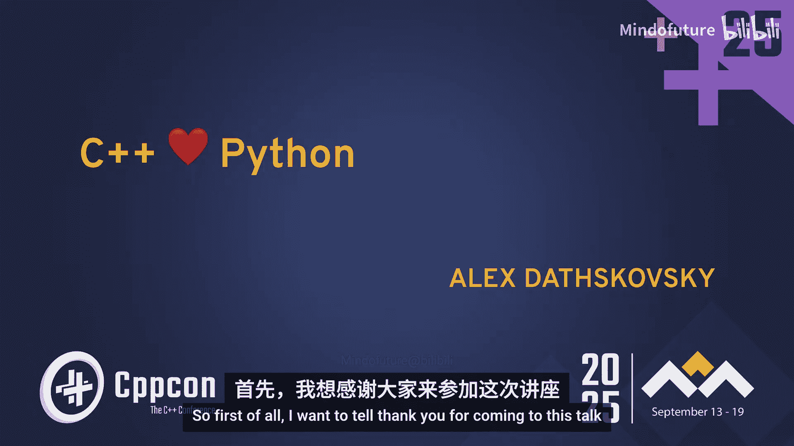
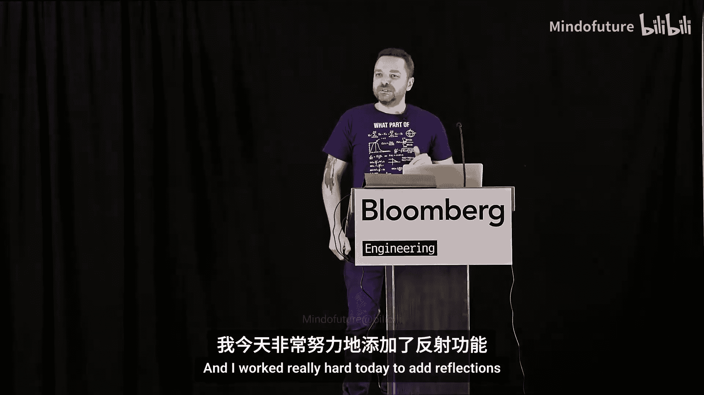
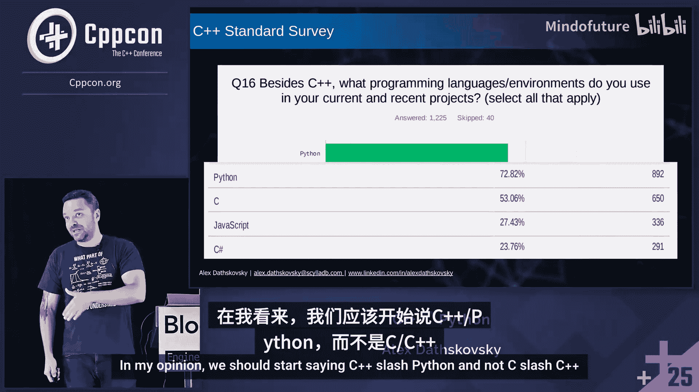
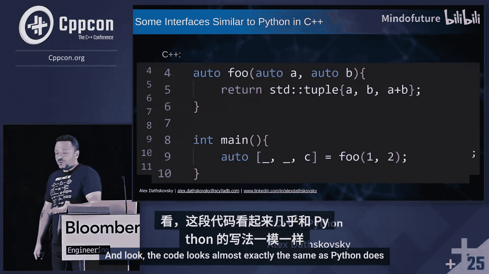
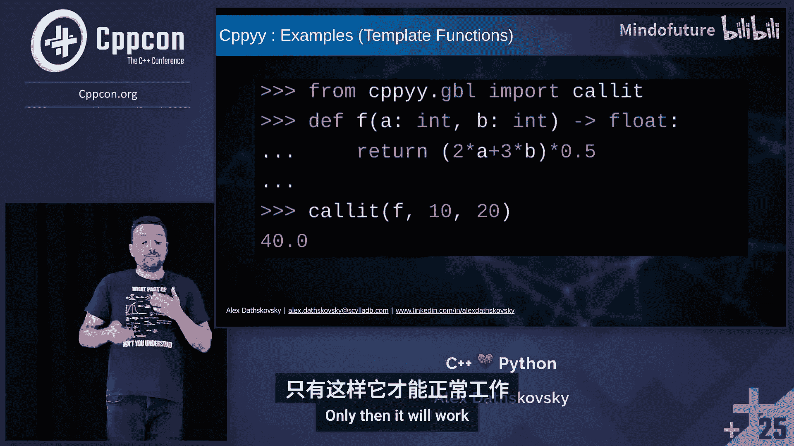

# 036：现代C++与Python的融合与绑定







在本教程中，我们将学习如何将C++与Python这两种强大的语言结合起来。我们将探讨它们各自的优势、现代特性如何使它们越来越相似，以及如何通过多种技术实现它们之间的高效互操作，从而在开发速度与运行性能之间取得最佳平衡。

## 1：C++与Python的现代融合

上一节我们介绍了本课程的目标，本节中我们来看看为什么C++和Python开发者经常同时使用这两种语言。调查数据显示，Python是C++开发者最常用的第二语言。这两种语言正在相互借鉴，变得越来越相似。

### 1.1 字符串格式化


在Python中，格式化字符串非常直观。

```python
name = "World"
num = 42
print(f"Hello {name}, the answer is {num}")
```



在C++中，借助`fmt`库（或C++23的`std::print`），我们可以实现几乎相同的效果。

```cpp
#include <fmt/core.h>
// 或 #include <print> // C++23
int main() {
    std::string name = "World";
    int num = 42;
    fmt::print("Hello {}, the answer is {}\n", name, num);
    // std::print("Hello {}, the answer is {}\n", name, num); // C++23
    return 0;
}
```

### 1.2 容器打印

Python可以轻松打印容器内容。

```python
my_list = [1, 2, 3]
my_dict = {"a": 1, "b": 2}
print(my_list, my_dict)
```

现代C++也能实现类似功能。

```cpp
#include <fmt/ranges.h>
#include <vector>
#include <map>
int main() {
    std::vector<int> vec = {1, 2, 3};
    std::map<std::string, int> dict = {{"a", 1}, {"b", 2}};
    fmt::print("{}\n", vec);
    fmt::print("{}\n", dict);
    return 0;
}
```

### 1.3 多返回值与结构化绑定

Python函数可以轻松返回多个值。

```python
def get_values():
    return 1, 2, "three"

a, b, c = get_values()
print(a, b, c)
```

C++通过`std::tuple`和结构化绑定实现了类似功能。

```cpp
#include <tuple>
#include <iostream>
std::tuple<int, int, std::string> get_values() {
    return {1, 2, "three"};
}
int main() {
    auto [a, b, c] = get_values(); // C++17 结构化绑定
    std::cout << a << " " << b << " " << c << std::endl;
    return 0;
}
```

### 1.4 枚举循环

Python的`enumerate`函数在迭代时非常方便。

```python
items = ["apple", "banana", "cherry"]
for index, value in enumerate(items):
    print(f"{index}: {value}")
```



在C++23中，我们可以利用生成器创建类似的功能。

```cpp
#include <iostream>
#include <vector>
#include <generator> // C++23

template<typename Container>
std::generator<std::tuple<std::size_t, typename Container::value_type>> enumerate(Container&& container) {
    std::size_t index = 0;
    for (auto&& value : container) {
        co_yield {index++, value};
    }
}

int main() {
    std::vector<std::string> items = {"apple", "banana", "cherry"};
    for (auto [index, value] : enumerate(items)) { // 类似Python的语法
        std::cout << index << ": " << value << std::endl;
    }
    return 0;
}
```

### 1.5 忽略返回值

Python可以使用下划线忽略不关心的返回值。

```python
def foo():
    return 1, 2, 3

_, _, c = foo() # 只关心第三个返回值
print(c)
```

C++26引入了类似的语法。

```cpp
auto foo() -> std::tuple<int, int, int> {
    return {1, 2, 3};
}
int main() {
    auto [_, _, c] = foo(); // C++26，使用下划线忽略
    std::cout << c << std::endl;
    return 0;
}
```

### 1.6 函数式编程与范围

Python以其简洁的函数式编程风格著称。

```python
import random
# 生成20个随机数，过滤出大于5小于9的数
numbers = [random.uniform(0, 10) for _ in range(20)]
filtered = [x for x in numbers if 5 < x < 9]
print(filtered)
```

C++20引入的范围库提供了强大的函数式操作能力。

```cpp
#include <ranges>
#include <vector>
#include <random>
#include <fmt/ranges.h>
int main() {
    std::mt19937 gen(std::random_device{}());
    std::uniform_real_distribution<> dis(0.0, 10.0);
    // 生成并过滤数字
    auto numbers = std::views::iota(0, 20)
                   | std::views::transform([&](int){ return dis(gen); });
    auto filtered = numbers | std::views::filter([](double x){ return x > 5 && x < 9; });
    // 注意：views是惰性求值的，需要将其物化到容器中或直接使用
    for (auto val : filtered | std::views::take(10)) { // 取前10个结果
        fmt::print("{}\n", val);
    }
    return 0;
}
```

## 2：Python的挑战与现代化

上一节我们看到了C++如何借鉴Python的便利特性，本节中我们来探讨Python自身面临的一些挑战及其现代化改进。Python作为解释型和动态语言，在带来开发便利的同时，也存在着性能瓶颈和类型安全等问题。

### 2.1 Python的潜在问题

以下是Python动态特性可能引发的一些问题。

**缺失返回语句**
```python
def risky_function():
    a = 5 + 5
    # 忘记写 return a
# 只有在调用此函数时才会出错
```

**变量作用域混淆**
```python
b = 100 # 全局变量
def confusing_function(a):
    result = a + b # 如果调用时忘记传参b，Python会使用全局的b，导致逻辑错误
    return result
```

**整数溢出行为不同**
```python
import sys
def overflow_like_cpp():
    x = sys.maxsize + 1 # 在Python中，这会自动升级为更大的整数类型（如int64），不会像C++那样回绕到0
    return x
```

**位操作开销大**
```python
# Python的`bin`操作返回的是字符串，对大量数据进行位操作时内存和性能开销大
bit_string = bin(255) # 返回的是字符串'0b11111111'
```

### 2.2 Python的现代化改进

现代Python通过类型提示和类型检查器来增强代码的安全性和可维护性。

**类型提示（Python 3.10+）**
```python
def add(a: int, b: int) -> int:
    return a + b
# 调用时，类型检查器（如mypy）会给出警告
result = add(5, 3.2) # 警告：参数b期望int，得到float
```

**泛型函数（Python 3.12+）**
```python
from typing import TypeVar, List
T = TypeVar('T', int, str) # 定义类型变量T，只能是int或str
def process_items(items: List[T], extra: T) -> List[T]:
    items.append(extra)
    return items
# 正确使用
process_items([1, 2], 3)   # OK
process_items(["a", "b"], "c") # OK
process_items([1, 2], "c") # 类型检查错误：'c'不是int
```

**使用类型检查器（如mypy）**
将类型检查集成到CI/CD流程中，可以在运行前捕获错误。
```bash
# 运行mypy检查
mypy your_script.py
```

**更快的包管理工具**
考虑使用`uv`替代传统的`pip`和`conda`，它能显著加快依赖解析和安装速度。
```bash
# 使用uv安装包
uv pip install numpy pandas
```

**性能提升**
Python解释器本身也在持续优化性能。例如，使用内置函数通常比手写循环更快。
```python
import timeit
# 方法1：手动循环求和
def sum_with_loop(lst):
    total = 0
    for x in lst:
        total += x
    return total
# 方法2：使用内置sum函数
def sum_with_builtin(lst):
    return sum(lst)
# 方法2通常快得多，因为sum是用C实现的
```

**使用NumPy进行数值计算**
对于数值计算，使用NumPy库可以带来数量级的性能提升。
```python
import numpy as np
import time
data = np.random.rand(100000) # 创建NumPy数组
start = time.time()
result = np.sum(data) # 使用NumPy的sum函数
end = time.time()
print(f"NumPy sum took: {end - start:.4f} seconds")
# 注意：避免频繁在Python列表和NumPy数组间转换，这会带来巨大开销
```

## 3：C++扩展Python：基础绑定

上一节我们了解了Python的现代化改进，本节中我们来看看如何将高性能的C++代码集成到Python中。当Python内置函数和库（如NumPy）仍无法满足性能需求时，我们可以用C++编写关键部分，并通过绑定（Binding）使其在Python中可用。

### 3.1 CPython C API 基础

Python解释器（CPython）本身是用C写的，它提供了`Python.h`头文件，允许我们用C或C++编写扩展模块。

**一个简单的C扩展示例**
假设我们有一个用C++实现的高性能函数`add`。

`add.cpp`:
```cpp
// 简单的C++函数
double add(double a, double b) {
    return a + b;
}
```

为了在Python中调用它，我们需要编写一个CPython封装模块。

`add_module.c`:
```c
#define PY_SSIZE_T_CLEAN
#include <Python.h>

// 1. 包装函数：将Python对象转换为C类型，调用C++函数，再将结果转回Python对象
static PyObject* py_add(PyObject* self, PyObject* args) {
    double a, b;
    // 解析Python传递的参数（一个包含两个double的元组）
    if (!PyArg_ParseTuple(args, "dd", &a, &b)) {
        return NULL; // 解析失败，返回NULL会触发Python异常
    }
    double result = add(a, b); // 调用实际的C++函数
    // 将C double转换为Python float对象
    return PyFloat_FromDouble(result);
}

// 2. 定义模块的方法列表
static PyMethodDef AddMethods[] = {
    {"add", py_add, METH_VARARGS, "Add two numbers."},
    {NULL, NULL, 0, NULL} // 哨兵，表示列表结束
};

// 3. 定义模块结构
static struct PyModuleDef addmodule = {
    PyModuleDef_HEAD_INIT,
    "add_module", // 模块名
    NULL, // 模块文档
    -1, // 模块状态大小（-1表示使用全局变量）
    AddMethods // 模块的方法列表
};

// 4. 模块初始化函数（当Python执行`import`时调用）
PyMODINIT_FUNC PyInit_add_module(void) {
    return PyModule_Create(&addmodule);
}
```

**编译与安装**
我们需要一个`setup.py`文件来编译这个扩展。

`setup.py`:
```python
from setuptools import setup, Extension
module = Extension('add_module', sources=['add_module.c', 'add.cpp'])
setup(
    name='AddModule',
    version='1.0',
    description='A simple C extension for addition',
    ext_modules=[module]
)
```
在命令行中运行以下命令进行构建和安装：
```bash
python setup.py build_ext --inplace
```
这会在当前目录生成一个`add_module.cpython-xxx.so`（Linux/macOS）或`add_module.pyd`（Windows）文件。之后就可以在Python中导入使用了：
```python
import add_module
result = add_module.add(5.5, 3.2)
print(result) # 输出 8.7
```

### 3.2 使用pybind11简化绑定

直接使用CPython C API需要大量样板代码。`pybind11`是一个轻量级的C++库，它大大简化了创建Python绑定的过程。

**使用pybind11重写上面的例子**
首先，确保安装了pybind11（例如通过`pip install pybind11`或作为子模块包含）。

`add_module_pybind11.cpp`:
```cpp
#include <pybind11/pybind11.h>
namespace py = pybind11;

double add(double a, double b) {
    return a + b;
}

// 使用PYBIND11_MODULE宏定义Python模块
PYBIND11_MODULE(add_module_pybind, m) {
    m.doc() = "pybind11 example plugin"; // 可选模块文档字符串
    m.def("add", &add, "A function that adds two numbers"); // 暴露函数
}
```

**编译pybind11扩展**
可以使用`setup.py`配合pybind11的扩展类。

`setup_pybind11.py`:
```python
from setuptools import setup, Extension
import pybind11

ext_modules = [
    Extension(
        'add_module_pybind',
        ['add_module_pybind11.cpp'],
        include_dirs=[pybind11.get_include()], # 包含pybind11头文件
        language='c++',
    ),
]

setup(
    name='add_module_pybind',
    ext_modules=ext_modules,
)
```
构建和导入方式与之前类似，但代码简洁得多。

### 3.3 性能考量与最佳实践

将C++函数暴露给Python会带来调用开销。为了最大化性能，请遵循以下最佳实践：

**1. 批量处理数据**
避免在Python和C++之间频繁交换少量数据。设计函数一次处理一个数组或列表。
```cpp
// 不佳：每次调用只处理一个值
double process_single(double x);
// 更佳：一次处理整个向量
std::vector<double> process_batch(const std::vector<double>& input);
```

**2. 使用已有的绑定类型**
对于数值计算，直接使用`pybind11`对`numpy`数组的绑定（`pybind11::array_t`），避免数据拷贝。
```cpp
#include <pybind11/pybind11.h>
#include <pybind11/numpy.h>
namespace py = pybind11;

py::array_t<double> add_arrays(py::array_t<double> a, py::array_t<double> b) {
    auto buf_a = a.request(), buf_b = b.request(); // 获取数组信息
    if (buf_a.size != buf_b.size)
        throw std::runtime_error("Input shapes must match!");
    auto result = py::array_t<double>(buf_a.size);
    auto ptr_a = static_cast<double*>(buf_a.ptr);
    auto ptr_b = static_cast<double*>(buf_b.ptr);
    auto ptr_res = static_cast<double*>(result.request().ptr);
    for (size_t i = 0; i < buf_a.size; i++) {
        ptr_res[i] = ptr_a[i] + ptr_b[i];
    }
    return result;
}
```

**3. 妥善管理内存和对象生命周期**
Python有垃圾回收机制。当从C++返回对象到Python时，确保使用智能指针（如`std::shared_ptr`）来管理内存，防止Python回收内存后C++端出现悬垂指针。

**4. 注意全局解释器锁（GIL）**
Python的GIL会阻止多个线程同时执行Python字节码。在C++扩展中执行长时间计算时，可以释放GIL以允许其他Python线程运行。
```cpp
#include <pybind11/pybind11.h>
namespace py = pybind11;
void long_running_task() {
    py::gil_scoped_release release; // 释放GIL
    // ... 执行耗时的C++计算 ...
    // 析构函数会自动重新获取GIL
}
PYBIND11_MODULE(mymodule, m) {
    m.def("long_running_task", &long_running_task);
}
```

## 4：高级绑定技术与工具

上一节我们介绍了使用CPython API和pybind11进行基础绑定的方法，本节中我们将探索更多高级绑定工具和技术，包括Cython、cppyy以及如何利用C++反射来简化绑定代码。

### 4.1 使用Cython

Cython是一门编程语言，它是Python的超集，允许你编写C扩展时使用近乎Python的语法，并且能方便地调用C/C++代码。它特别适合将Python代码加速，或者为C++库创建复杂的Python接口。

**一个简单的Cython例子**
假设我们有一个C++头文件`mylib.h`和实现。

`mylib.h`:
```cpp
namespace mylib {
    class Calculator {
    public:
        int add(int a, int b);
    };
}
```

`mylib.cpp`:
```cpp
#include "mylib.h"
namespace mylib {
    int Calculator::add(int a, int b) { return a + b; }
}
```

我们可以用Cython为其创建Python绑定。

`mylib.pyx` (Cython源文件):
```cython
# distutils: language = c++
# 声明我们要使用的C++部分
cdef extern from "mylib.h" namespace "mylib":
    cdef cppclass Calculator:
        Calculator() except +
        int add(int, int)

# 创建Python可用的包装类
cdef class PyCalculator:
    cdef Calculator* c_calc  # 持有一个C++实例的指针
    def __cinit__(self):
        self.c_calc = new Calculator()
    def __dealloc__(self):
        del self.c_calc
    def add(self, int a, int b):
        return self.c_calc.add(a, b)
```

`setup.py`:
```python
from setuptools import setup, Extension
from Cython.Build import cythonize
extensions = [
    Extension(
        "mylib_cython",
        sources=["mylib.pyx", "mylib.cpp"],
        language="c++",
    )
]
setup(
    name="mylib_cython",
    ext_modules=cythonize(extensions),
)
```

构建后，可以在Python中这样使用：
```python
import mylib_cython
calc = mylib_cython.PyCalculator()
print(calc.add(5, 3)) # 输出 8
```

Cython的优点是语法接近Python，性能好，并且能处理复杂的C++特性（如模板、继承）。缺点是学习另一种方言，并且调试可能稍复杂。



### 4.2 使用cppyy进行动态绑定

`cppyy`是一个独特的工具，它通过Clang/LLVM在运行时动态地解析C++代码并生成Python绑定，无需预编译扩展模块。这非常适合快速原型设计和交互式使用。

**安装与基本使用**
```bash
pip install cppyy
```

在Python中直接使用：
```python
import cppyy
# 1. 直接包含C++头文件（字符串形式）
cppyy.include('''
#include <iostream>
int add(int a, int b) {
    return a + b;
}
''')
# 2. 直接从cppyy的全局命名空间调用函数
result = cppyy.gbl.add(5, 3)
print(result) # 输出 8
# 3. 使用C++标准库
cppyy.include('<vector>')
cppyy.include('<algorithm>')
v = cppyy.gbl.std.vector[int]([5, 1, 3, 4, 2])
cppyy.gbl.std.sort(v.begin(), v.end())
print(list(v)) # 输出 [1, 2, 3, 4, 5]
```

**绑定现有的C++库**
如果已有编译好的共享库（`.so`或`.dll`），可以轻松加载：
```python
import cppyy
# 加载共享库
cppyy.load_library("libmylib.so")
# 包含头文件（cppyy会从库中读取符号）
cppyy.include("mylib.h")
# 使用库中的类
obj = cppyy.gbl.mylib.MyClass()
obj.doSomething()
```

**处理GIL**
在cppyy中，可以标记函数不获取GIL，以支持真正的多线程。
```cpp
// 在C++头文件中
void thread_safe_work() {
    // 长时间计算，不涉及Python对象
}
```
在Python中调用时，可以通过设置函数属性来释放GIL（需要cppyy后端支持）：
```python
import cppyy, threading
cppyy.include('''
void thread_safe_work() {
    for (volatile int i=0; i<100000000; ++i) {}
}
''')
func = cppyy.gbl.thread_safe_work
func.__release_gil__ = True # 标记此函数调用时释放GIL
# 现在可以在多个线程中并发调用func
```

cppyy的优点是极其灵活，无需编译步骤，支持复杂的C++特性。缺点是首次运行时需要解析C++代码，有一定开销，并且对于非常庞大的代码库可能不是最佳选择。

### 4.3 利用C++反射简化绑定（前瞻）

C++26及以后的版本预计将引入强大的静态反射功能。这将允许我们在编译时查询类型信息（如类名、方法、成员变量），从而自动生成绑定代码，极大减少样板文件。

**概念性示例**
假设我们有一个带反射的C++类：
```cpp
// 未来C++语法（概念性）
class [[reflexpr]] MyClass {
public:
    int value;
    void print() const { std::cout << value << std::endl; }
};
```

我们可以编写一个通用的绑定生成器：
```cpp
#include <reflexpr>
template<typename T>
void generate_bindings(pybind11::module& m) {
    using meta_T = reflexpr(T); // 获取类型的元信息
    // 获取类名
    constexpr auto name = get_display_name_v<meta_T>;
    // 创建一个pybind11 class_
    auto pyclass = py::class_<T>(m, name);
    // 遍历所有公共数据成员并添加属性
    for_each(get_public_data_members_v<meta_T>, [&](auto member) {
        constexpr auto member_name = get_display_name_v<member>;
        pyclass.def_property(member_name,
            [](T& obj) { return obj.*pointer_of_v<member>; }, // getter
            [](T& obj, decltype(T::value) val) { obj.*pointer_of_v<member> = val; } // setter
        );
    });
    // 遍历所有公共成员函数并添加方法
    for_each(get_public_member_functions_v<meta_T>, [&](auto func) {
        constexpr auto func_name = get_display_name_v<func>;
        pyclass.def(func_name, pointer_of_v<func>);
    });
}
// 使用
PYBIND11_MODULE(mymodule, m) {
    generate_bindings<MyClass>(m);
}
```

虽然完整的静态反射标准尚未落地，但像`pybind11`这样的库已经开始探索使用实验性的反射特性或编译时模板技巧来减少重复代码。关注C++标准的发展，反射将成为自动化绑定的关键。

## 5：总结与最佳实践

在本教程中，我们一起学习了C++与Python互操作的多种方法。我们从两种语言的现代融合特性开始，探讨了Python的挑战与改进，深入研究了使用CPython API、pybind11、Cython和cppyy进行绑定的技术，并展望了利用C++反射的未来。

以下是关键要点的总结和最佳实践建议：

1.  **选择合适的工具**：
    *   **快速原型/交互**：考虑使用 **cppyy**，它无需编译，动态绑定。
    *   **性能关键的生产扩展**：**pybind11** 是成熟、高性能、易于集成到构建系统的选择。
    *   **将大量Python代码加速或混合C++与Python逻辑**：**Cython** 提供了强大的中间语言。
    *   **需要极致的控制或目标Python版本非常古老**：可能需要直接使用 **CPython C API**。

2.  **性能至上**：
    *   **批量处理**：设计API时，尽量让函数一次处理一个数据集（数组、向量），而不是单个标量。
    *   **避免数据拷贝**：使用像`pybind11::array_t`这样的类型，直接在原始数据缓冲区上操作。
    *   **理解开销**：Python到C++的调用有固定开销。确保计算量足够大以抵消此开销。
    *   **释放GIL**：对于纯C++的长时间计算，使用`py::gil_scoped_release`释放全局解释器锁，允许Python其他线程运行。

3.  **确保安全与正确**：
    *   **管理内存**：使用智能指针（如`std::shared_ptr`）管理从C++传递到Python的对象生命周期。
    *   **异常处理**：确保C++异常能安全地转换为Python异常，并跨边界传播。
    *   **类型安全**：利用Python的类型提示和`mypy`等工具，以及C++的强类型，在早期捕获错误。

4.  **拥抱现代化**：
    *   **更新工具链**：使用新的Python版本（获得性能提升）、新的包管理器（如`uv`）和新的C++标准。
    *   **代码清晰**：利用C++的结构化绑定、范围`for`循环和格式化库，使C++代码更接近Python的简洁性。
    *   **关注反射**：随着C++静态反射标准的发展，未来自动生成绑定代码将变得更加容易，可以持续关注相关进展。

5.  **保持学习**：
    C++与Python的生态都在快速发展。新的库、工具和语言特性不断涌现。掌握互操作的核心原理，就能灵活运用各种工具来解决实际问题。


通过结合C++的性能与Python的敏捷性，你可以构建出既强大又易于开发和维护的应用程序。希望本教程为你开启了这扇大门。