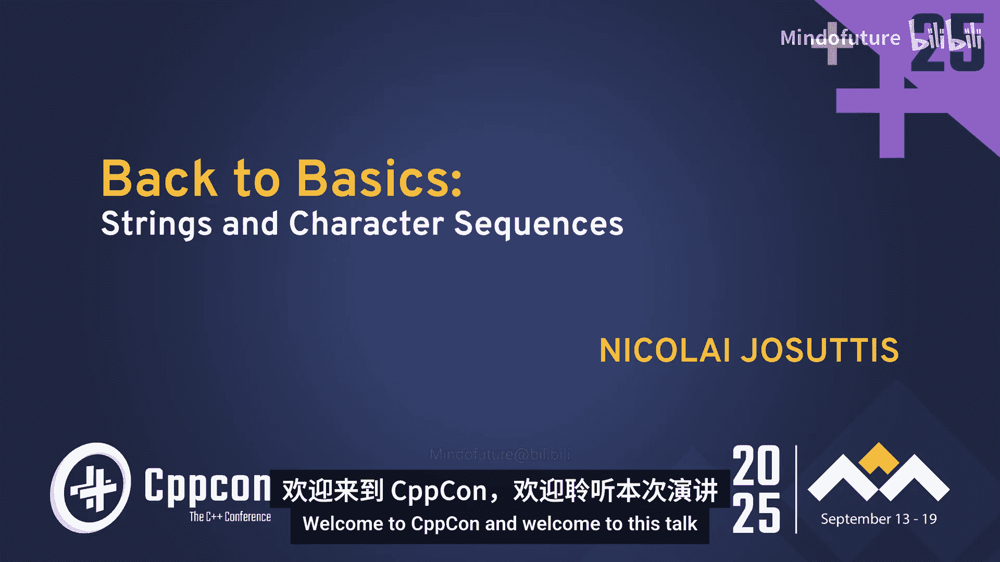
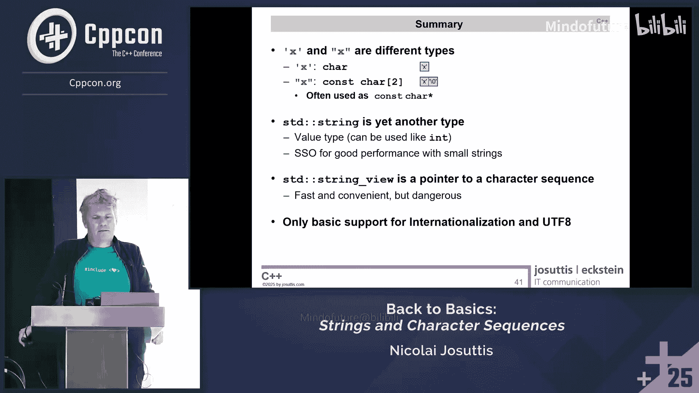

# 039：字符串与字符序列




在本节课中，我们将要学习C++中字符串和字符序列的基础知识。我们将从最基本的字符类型开始，逐步深入到字符串字面量、`std::string`类、`std::string_view`以及字符编码等核心概念。通过本教程，你将清晰地理解这些类型之间的区别、各自的优缺点以及在实际编程中需要注意的陷阱。

## 字符类型与字符串字面量

在C++中，字符和字符串是两种不同的概念。理解它们的类型是正确使用它们的第一步。

一个用单引号括起来的字符，例如 `‘h’`，其类型是 `char`。它是一个整数值，代表该字符在字符集中的编码值。

一个用双引号括起来的字符串字面量，例如 `“hi”`，其类型是 `const char[3]`。它是一个字符数组，包含了字符串中的所有字符，并在末尾自动添加一个空字符（`‘\0‘`）作为终止符。这是从C语言继承来的约定。

字符串字面量存储在程序的某个固定位置。当你将其赋值给一个指针时，例如 `const char* p = “hi”;`，指针 `p` 存储的是该字符数组中第一个字符的地址。虽然它常常被当作指针使用，但字面量本身是一个数组。

上一节我们介绍了字符和字符串字面量的基本类型，本节中我们来看看如何更灵活地表示字符串字面量。

## 原始字符串字面量

在字符串字面量中，某些字符（如双引号 `“` 和反斜杠 `\`）需要转义，这有时会降低代码的可读性。自C++11起，引入了原始字符串字面量来解决这个问题。

原始字符串字面量以 `R”(` 开头，以 `)“` 结尾。在这两个标记之间的所有字符都会按原样存储，无需转义。

以下是原始字符串字面量的语法示例：
```cpp
// 普通字符串字面量，需要转义
const char* s1 = "\"Hello\\nWorld\"";
// 原始字符串字面量，无需转义
const char* s2 = R"("Hello\nWorld")";
// s1 和 s2 存储的内容完全相同
```

你甚至可以在 `R”` 和 `(` 之间指定一个分隔符（最多16个字符），用于处理字符串内容本身包含 `)“` 的情况。结束标记则变为 `)` 加上分隔符再加上 `“`。

原始字符串字面量对于编写包含大量特殊字符（如HTML、XML、正则表达式）的字符串非常有用。

了解了如何表示字符串数据后，接下来我们看看C++中用于管理字符串的核心类：`std::string`。

## std::string 类

`std::string` 是C++标准库提供的字符串类，它是一个值类型，封装了字符串数据及其所有必要信息（如长度、容量），并管理自身的内存生命周期。

你可以像使用其他基本类型一样使用 `std::string`：初始化、赋值、比较、拼接等。默认构造的字符串是空的。`std::string` 内部始终存储一个尾随的空字符，以便在需要时可以安全地转换为C风格字符串（通过 `.c_str()` 方法）。

以下是 `std::string` 的基本用法：
```cpp
#include <string>
#include <iostream>

int main() {
    std::string s1; // 空字符串
    std::string s2 = “Hello”; // 初始化
    s2 += “ World!”; // 拼接
    std::cout << s2 << std::endl; // 输出
    const char* cstr = s2.c_str(); // 获取C风格字符串指针
    return 0;
}
```

`std::string` 内部通过动态分配堆内存来存储字符数据。当字符串增长超出当前容量时，它会分配新的、更大的内存块，将旧数据复制过去，然后释放旧内存。这个操作（内存分配和复制）是昂贵的。

为了优化性能，现代C++库实现普遍采用了**短字符串优化**。

## 短字符串优化

短字符串优化的基本思想是：许多程序中的字符串都很短（如名字、ID、国家代码）。因此，`std::string` 对象内部会预留一小块固定大小的缓冲区（例如15个字符加一个空字符）。

当字符串内容可以放入这个缓冲区时，就不需要分配堆内存，所有数据都存储在栈上的 `std::string` 对象自身内部。这使得创建、复制和销毁短字符串非常高效。

当字符串内容超过缓冲区大小时，`std::string` 才会像以前一样分配堆内存。

需要注意的是，短字符串优化的具体细节（如缓冲区大小）并未由C++标准规定，因此不同编译器/标准库的实现可能不同。例如，GCC和MSVC可能为短字符串预留15个字符的空间，而Clang可能预留22个。这可能导致跨编译器切换时性能特征发生变化。

对于宽字符（如 `wchar_t`, `char16_t`, `char32_t`），由于每个字符占用更多字节，短字符串优化能容纳的字符数会更少。

上一节我们介绍了 `std::string` 及其优化，本节中我们来看看一个更轻量级但需要谨慎使用的工具：`std::string_view`。

## std::string_view

`std::string_view` 是C++17引入的类，它不拥有字符串数据，而是包含一个指向常量字符序列的指针和一个长度。它是对现有字符串数据的“视图”或“引用”。

与 `std::string` 相比，`std::string_view` 的构造和复制成本极低（通常只是复制指针和长度），因为它不分配内存也不复制数据。

以下是 `std::string_view` 的典型用法：
```cpp
#include <string>
#include <string_view>
#include <iostream>

void print(std::string_view sv) {
    std::cout << sv << std::endl;
}

int main() {
    std::string s = “Hello String”;
    const char* cstr = “Hello C-string”;

    print(s); // 隐式转换 std::string -> std::string_view
    print(cstr); // 隐式转换 const char* -> std::string_view
    print(“Hello Literal”); // 直接使用字符串字面量
    return 0;
}
```

**使用 `std::string_view` 必须注意生命周期问题**。`std::string_view` 不延长所指向数据的生命周期。你必须确保在 `std::string_view` 存续期间，其底层数据始终有效。例如，指向局部 `std::string` 内部数据的 `string_view`，在该 `string` 被销毁后就会悬空。

此外，`std::string_view` 不以空字符结尾，因此不能直接传递给期望C风格字符串（以 `\0` 结尾）的函数，除非你确信视图包含终止符。

`std::string_view` 主要用于函数参数，作为只读字符串数据的轻量级传递方式，可以接受 `std::string`、字符串字面量和字符数组等多种输入，同时避免不必要的拷贝。

`std::string_view` 非常高效，但像指针一样危险。接下来，我们探讨一个更复杂的话题：字符编码和国际化的基础支持。

## 字符编码与国际化的基础支持

现实世界需要表示远超128个ASCII字符的符号，这引入了字符编码的复杂性。

早期使用8位字符集（如Latin-1），但不同地区对同一编码值的解释可能不同（例如欧元符号 `€` 的编码值在Windows和Linux上可能不同）。为了支持全球字符，出现了更宽的字符类型（如16位的 `char16_t` 和32位的 `char32_t`）以及变长编码UTF-8。

UTF-8是一种Unicode编码，它使用1到4个字节来表示一个字符。ASCII字符（0-127）使用1个字节，其他字符使用更多字节。UTF-8在存储和网络传输中非常高效，是Web和文件系统的实际标准。但由于字符是变长的，无法直接通过偏移随机访问第N个字符，必须顺序遍历。

C++对国际化的支持比较基础：
*   **字符类型**：`char` (通常用于UTF-8或本地编码)、`wchar_t` (宽度由实现定义，不跨平台)、`char16_t` (用于UTF-16)、`char32_t` (用于UTF-32)、`char8_t` (C++20引入，用于明确表示UTF-8代码单元)。
*   **字符串类型**：`std::string`、`std::wstring`、`std::u16string`、`std::u32string`、`std::u8string` (C++20)。
*   **字符串字面量前缀**：`u8”` (UTF-8)、`u”` (UTF-16)、`U”` (UTF-32)、`L”` (宽字符，依赖实现)。

C++标准库目前缺乏强大的字符编码转换和Unicode处理工具（如大小写转换、规范化、分词等）。处理国际化文本通常需要借助第三方库（如ICU）。



## 总结

本节课中我们一起学习了C++中字符串与字符序列的核心知识：

1.  **字符与字面量**：单引号的 `‘X‘` 是 `char` 类型，双引号的 `“X“` 是 `const char[2]` 类型的数组。原始字符串字面量 `R”(…)“` 可以避免转义，提高可读性。
2.  **std::string**：这是一个值类型，管理自身的字符数据和内存。它通过**短字符串优化**来提升短字符串的性能，但优化的具体行为因编译器而异。
3.  **std::string_view**：这是一个非拥有、只读的字符串视图，仅包含指针和长度。它非常轻量高效，但**必须谨慎管理其底层数据的生命周期**，防止悬空引用。
4.  **字符编码**：C++提供了多种字符类型和字符串类型来支持不同的编码（如UTF-8、UTF-16、UTF-32），但对高级国际化操作（编码转换、Unicode算法）的支持有限，处理复杂文本时需要额外注意或使用专门库。


理解这些基础类型的区别、内存管理方式和适用场景，是编写正确、高效C++程序的关键。