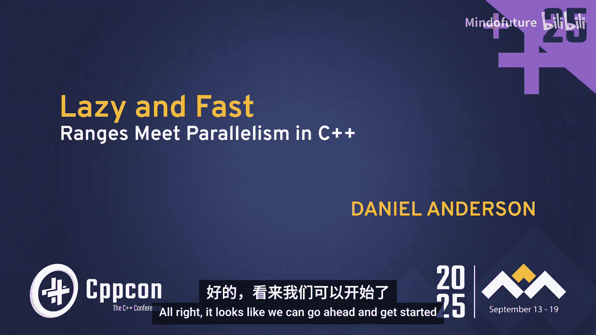
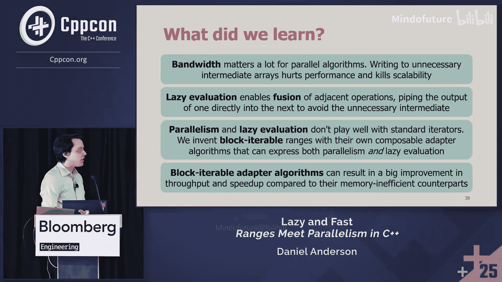
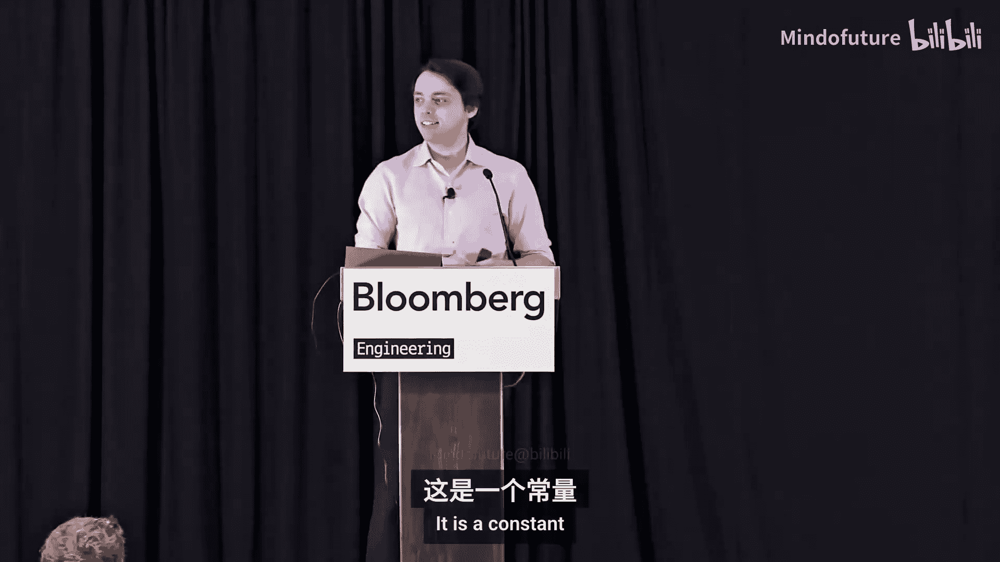

# 040：惰性与快速 - C++中范围与并行化的结合




在本节课中，我们将要学习如何结合C++的范围（Ranges）与并行算法，以解决并行计算中常见的性能瓶颈——内存带宽限制。我们将探讨惰性求值（Laziness）和循环融合（Loop Fusion）如何帮助减少内存访问，并介绍一种新的“块可迭代范围”（Block Iterable Range）概念，以实现并行与惰性的最佳结合。


---

## 核心问题：并行算法的瓶颈

上一节我们介绍了课程概述，本节中我们来看看并行算法面临的核心挑战。

几乎所有做过并行计算的人都会遇到一个问题：随着核心数量的增加，性能提升会很快遇到瓶颈。下图展示了几个简单并行算法的吞吐量随核心数增加的变化情况。


可以看到，初始阶段性能提升显著，但很快增速放缓，最终增加更多核心几乎无法带来性能提升。这种现象被称为**可扩展性墙**（Scalability Wall）。

为了更清晰地观察，我们可以查看**并行加速比**（Parallel Speedup），即多核性能相对于单核性能的提升倍数。理想情况下，加速比应与核心数成线性关系。

```cpp
// 理想并行加速比公式
理想加速比 = 使用的核心数
```

然而，实际测量结果显示，即使使用72个核心，加速比也远未达到72倍，通常在15到30倍之间。这表明存在一个主要瓶颈，限制了并行效率。

这个瓶颈通常不是计算操作本身，因为算法是**工作高效**（Work Efficient）的，即它们完成的计算量与顺序算法相同。瓶颈也不是缓存效率，因为这些算法通常按顺序访问内存。

真正的瓶颈是**内存带宽**（Memory Bandwidth）。算法计算速度太快，以至于无法从主内存（DRAM）中足够快地读取数据。当所有核心都等待数据时，增加更多核心就无济于事了。这种算法被称为**内存受限**（Memory Bound）或**带宽受限**（Bandwidth Bound）算法。

对于大多数简单的数据并行算法，内存带宽是90%情况下的主要瓶颈。

---

## 解决方案：惰性求值与循环融合

既然我们确定了内存带宽是问题所在，本节中我们来看看如何通过减少内存访问来解决问题。

一个关键技术是**循环融合**（Loop Fusion）。考虑以下顺序操作代码：

```cpp
std::vector<int> A = {...};
std::vector<int> B, C, D;

// 操作1: 变换
std::transform(A.begin(), A.end(), std::back_inserter(B), [](int x){ return 2*x + 1; });
// 操作2: 扫描（前缀和）
std::inclusive_scan(B.begin(), B.end(), std::back_inserter(C));
// 操作3: 过滤
std::copy_if(C.begin(), C.end(), std::back_inserter(D), [](int x){ return x % 3 == 0; });
```

这段代码需要大约 **3N** 次内存读写（N为输入大小），因为它为每个中间结果（B, C）创建了临时存储，效率低下。

如果我们将这三个循环手动融合为一个，代码将如下所示：

```cpp
std::vector<int> D;
int running_sum = 0;
for (int x : A) {
    int transformed = 2*x + 1;      // 变换
    running_sum += transformed;     // 扫描
    if (running_sum % 3 == 0) {    // 过滤
        D.push_back(running_sum);
    }
}
```

融合后的版本只进行大约 **N** 次读写，内存效率提高了三倍。然而，手动融合代码复杂，尤其是在并行场景下。

幸运的是，C++20引入了**视图**（Views），它通过**惰性求值**（Lazy Evaluation）自动实现了循环融合。视图被定义为廉价复制的范围，并且按约定必须在迭代时即时计算，而不能预先存储结果。

使用范围视图重写上述操作：

```cpp
auto result = A
            | std::views::transform([](int x){ return 2*x + 1; })
            | std::views::inclusive_scan
            | std::views::filter([](int x){ return x % 3 == 0; });
```

由于视图是惰性的，这段代码会自动融合操作，同样只进行大约 **N** 次内存读写，而无需中间存储。

**关键结论**：
1.  大多数简单并行算法受内存带宽限制。
2.  惰性求值通过自动融合操作来减少内存带宽消耗。

那么，是否可以直接将惰性视图用于并行算法呢？遗憾的是，目前还不行。

---

## 当前困境：并行与惰性的不兼容性

上一节我们看到了惰性的好处，本节中我们来看看为什么它不能直接与并行算法结合。

问题在于**迭代器类别**（Iterator Categories）。并行算法通常需要**随机访问迭代器**（Random Access Iterator），以便能够快速跳转到范围的任意位置进行任务分割。

然而，大多数惰性视图（如 `transform`、`filter`、`scan`）只能产生**前向迭代器**（Forward Iterator）或**双向迭代器**（Bidirectional Iterator）。这是因为要获取中间某个元素的值，可能需要计算前面所有元素的值（例如在 `scan` 中），这与“即时计算、不存储”的惰性本质相冲突。

因此，我们面临一个矛盾：
*   **并行需要**：随机访问（或更强），以便分割工作。
*   **惰性提供**：前向或双向访问，以保持内存效率。

我们需要一个介于两者之间的新概念。

---

## 新概念：块可迭代范围

为了找到并行与惰性的平衡点，我们需要从并行算法的工作原理中寻找灵感。以并行扫描（Prefix Sum）为例，典型的并行算法遵循以下模式：

1.  **本地阶段**：将输入范围分割成块，并行处理每个块，计算块内结果和块摘要（如块内和）。
2.  **全局聚合**：顺序或递归地聚合所有块的摘要（例如，计算块摘要的前缀和）。
3.  **最终本地阶段**：再次并行处理每个块，利用全局聚合信息完成最终计算。

注意，在这个模式中，并行性体现在**块**（Block）级别，而**块内部的处理仍然是顺序的**。我们不需要随机访问每一个元素，只需要能够随机访问到每个块的起始位置。

由此，我们定义一个新的范围概念：**块可迭代范围**（Block Iterable Range）。

一个块可迭代范围是一个前向范围，但它额外提供了一个接口，可以**随机访问到其分块的起始位置**。

```cpp
// 概念性接口
template <typename Range>
concept BlockIterableRange = std::ranges::forward_range<Range> &&
    requires(Range& r, size_t i) {
        { r.begin_block(i) } -> std::random_access_iterator; // 获取第i块的起始迭代器
        { r.end_block(i) } -> std::random_access_iterator;   // 获取第i块的结束迭代器
    };
```

这样，我们获得了“最佳结合”：
*   **并行性**：线程可以通过随机访问不同的块来并行工作。
*   **惰性**：每个块本身是一个前向范围，可以按需惰性计算，无需预先物化整个结果。

只要确保所有块的**大小相同**（以便于组合），我们就可以像组合普通视图一样组合这些块可迭代适配器，实现自动融合。

---

## 算法实现模式

本节中我们来看看如何具体实现这些支持并行和惰性的算法适配器。我们的库包含以下核心操作：

*   **中间操作**（生成新范围）：
    *   `transform` / `map`
    *   `scan` （前缀和）
    *   `flatten` / `join`
    *   `zip`
*   **终止操作**（产生结果）：
    *   `reduce` （归约）
    *   `to_sequence` （物化为序列）

实现这些适配器的关键思想是：**部分惰性**（Partially Lazy）。我们不完全惰性，也不完全急切。

**典型模式如下**：
1.  **构造时（部分急切）**：算法立即并行执行“第一本地阶段”和“全局聚合”。它会计算并存储每个块所需的少量元数据（例如，对于 `scan`，存储每个块的起始前缀和）。这需要线性时间，因此它不满足标准视图的常数时间构造要求，不能称为“视图”。
2.  **迭代时（部分惰性）**：当获取某个块的迭代器时，它从适配器中查找该块的元数据。随后，在迭代该块内的元素时，完全按需进行惰性计算。

这种模式在计算量和内存占用之间取得了平衡：我们进行了一些预先计算，但只存储了少量元数据（与块数成正比，远小于元素总数），从而大幅减少了内存写入。

以下是几个算法的简要说明：

*   **`transform`**：这是最简单的，它实际上可以完全惰性，不需要块元数据。如果输入是随机访问的，输出也可以是随机访问的。
*   **`scan`**：构造时并行计算每个块的和，然后计算这些块和的前缀和并存储。迭代时，每个块从存储的起始值开始，顺序计算块内元素的前缀和。
*   **`flatten`**：输入是一个“范围的块可迭代范围”。构造时需要找到输出范围中每隔固定距离（块大小）的元素位置，这涉及计算子范围大小的前缀和并进行搜索。存储这些“检查点”迭代器。迭代时，迭代器在子范围间跳转。
*   **`filter`**：可以利用 `flatten` 和 `transform` 组合实现，无需从头编写。首先找出每个块中满足谓词的元素（保存其迭代器），这形成了一个“范围的块可迭代范围”。然后通过 `flatten` 将其重新平衡为等大的块，最后通过 `transform` 解引用迭代器得到元素值。

通过组合少数几个基本适配器，我们可以构建出许多其他算法，这体现了函数式组合的强大之处。

---

## 应用与性能验证

理论需要实践检验。本节中我们通过两个实际应用来验证我们提出的方法是否真的能提升性能。

### 应用一：并行广度优先搜索

在BFS中，我们需要迭代计算每一层的顶点边界（frontier）。虽然层与层之间的计算是顺序的，但每一层内部的邻居查找和过滤可以并行。

使用我们的库，BFS中从当前边界计算下一层边界的核心逻辑可以简洁地表示为：

```cpp
auto next_frontier = current_frontier
                   | transform([&graph](Vertex v){ return graph.neighbors(v); }) // 获取所有邻居
                   | flatten                                                      // 展平为顶点列表
                   | filter([&](Vertex v){                                        // 过滤：成功标记距离的顶点
                        int expected = -1;
                        return distance[v].compare_exchange_strong(expected, current_dist + 1);
                     })
                   | to_sequence; // 物化为新的边界序列
```

**性能对比**：
*   **急切版本**（写入所有中间结果）：大约需要 **4N** 次内存写入（N为边界大小）。
*   **惰性版本**（使用我们的库）：`transform` 和 `flatten` 的中间写入被融合掉，大约只需要 **2N** 次写入。

由于减少了约一半的内存带宽消耗，我们预期惰性版本的加速比提升约一倍。基准测试结果证实了这一点。

### 应用二：并行大整数加法

对于存储为数字序列的大整数，并行加法算法包括：
1.  逐对相加数字。
2.  处理进位传播（这是一个扫描操作）。
3.  将进位加到中间结果上。

使用我们的库，算法可以表示为：

```cpp
auto result = zip_with(A, B, std::plus<>{})        // 逐对相加
            | scan(carry_propagation_op)            // 进位传播扫描
            | zip_with(intermediate_sums, std::plus<>{}) // 加上进位
            | to_sequence;
```

**性能对比**：
*   **急切版本**：需要为三个主要步骤存储中间结果，约 **3N** 次写入。
*   **惰性版本**：中间结果被融合，仅最终结果需要写入，约 **1N** 次写入。

内存带宽消耗减少到约三分之一，基准测试显示加速比提升了约三倍，完美验证了我们的假设。

---

## 总结与资源

本节课中我们一起学习了以下内容：

1.  **带宽至关重要**：对于大多数数据并行算法，内存带宽是限制可扩展性的主要瓶颈。
2.  **惰性求值是救星**：通过自动融合相邻操作，惰性求值可以消除不必要的中间存储，显著减少内存带宽消耗。
3.  **结合并行与惰性的挑战**：传统的随机访问需求与惰性求值的前向迭代特性存在冲突。
4.  **引入块可迭代范围**：我们提出了一种新的范围概念，它允许在块级别进行随机访问（用于并行），同时在块内部保持前向迭代（用于惰性），从而实现了“最佳结合”。
5.  **实践验证**：通过并行BFS和大整数加法的案例，我们证明了该方法能有效减少内存访问，并带来成倍的性能提升。

**核心公式**：
```
性能提升 ∝ 1 / (内存带宽消耗)
减少中间存储 → 降低带宽消耗 → 提高并行加速比
```

如果你想深入了解或使用这些算法，可以参考以下资源（注：示例链接为占位符，实际库可能需要查找作者提供的GitHub仓库）：
*   算法实现库：`https://github.com/.../parallel-lazy-ranges`
*   文档说明：`https://.../docs`

**记住**：在并行编程中，当你遇到性能瓶颈时，首先应该考虑是否是内存带宽限制。而惰性求值和循环融合是应对这一挑战的强大工具。

---

## 问答环节

**问：如何组合惰性操作？例如，将一个 `scan` 连接到另一个 `scan`，第二个 `scan` 的构造是否需要物化第一个 `scan` 的结果？**

答：第二个 `scan` 确实需要计算第一个 `scan` 的结果，但关键区别在于它**不需要将第一个 `scan` 的完整结果写入内存**。它可以在遍历第一个 `scan` 产生的惰性范围时，在本地内存中即时计算所需的块摘要。我们节省的是**内存带宽**（避免写入），而不是计算量。对于带宽受限的场景，这是巨大的胜利。



**问：在实现 `flatten`（或 `join`）视图时，如果内部范围是纯右值（prvalue），如何避免悬垂引用？**

答：在实际的库代码中，我们需要为纯右值情况提供重载。如果是纯右值，通常需要将其值物化（例如，存储到容器中）以避免悬垂。幻灯片展示的是针对左值引用的简化版本。

**问：如何确定块大小？是由用户控制吗？**

答：在当前库的实现中，块大小是一个硬编码的常数（例如2000）。为了简单起见，没有提供用户接口。理论上，用户可以将其作为参数，或者库可以实现自动调优。

**问：标准库中的 `zip` 是否也保持随机访问性？**




答：是的，标准库中的 `zip` 视图在输入为随机访问范围时，也能产生随机访问范围。这意味着 `zip` 已经可以与现有的并行范围算法较好地协同工作。