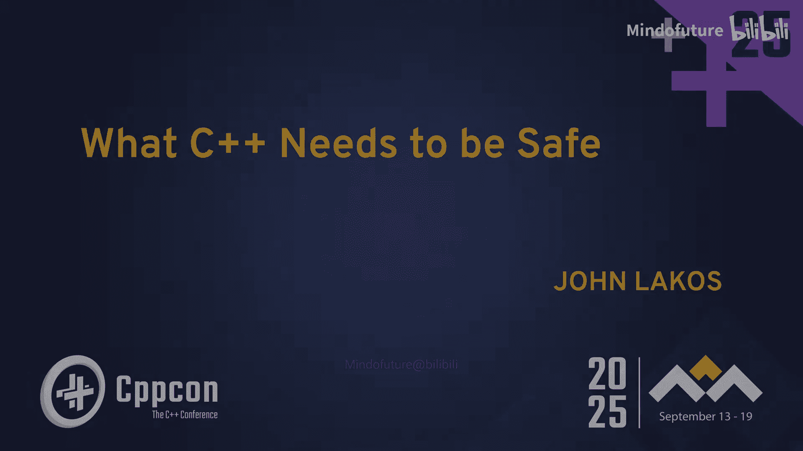
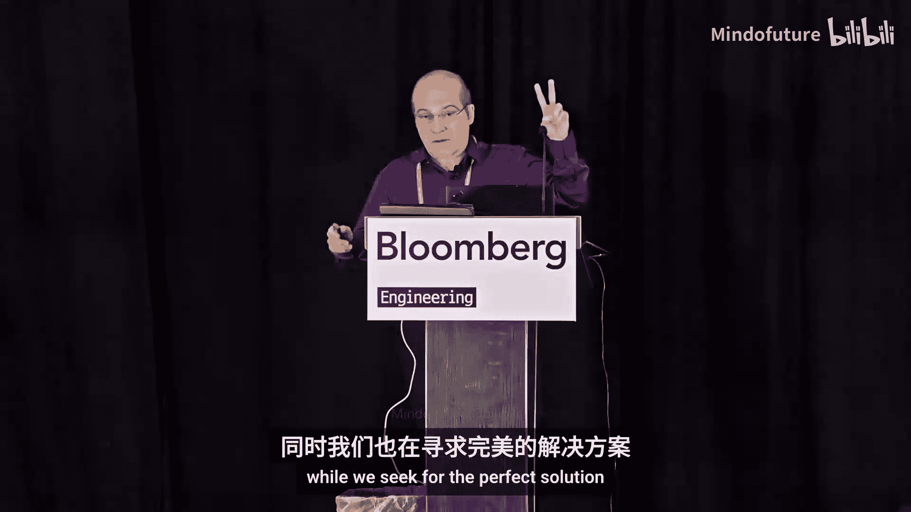
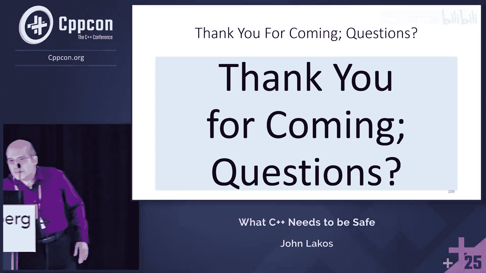

# 041：使C++安全、健康且高效 - John Lakos - CppCon 2025






## 概述

在本教程中，我们将学习John Lakos在CppCon 2025演讲的核心内容。演讲探讨了C++语言当前面临的挑战，特别是关于安全性、生态系统健康和开发效率的问题。我们将了解一个旨在通过渐进式改进，而非彻底重写，来保护现有万亿级C++代码资产并使其更安全、更易用的战略计划。核心概念包括**契约（Contracts）**、**错误行为（Erroneous Behavior）**和**幽灵数据（Ghost Data）**等。

## 引言与动机

C++正受到来自多方面的批评。新兴语言如Rust以其内存安全性作为卖点，监管机构和网络安全组织也在质疑使用可能引发未定义行为（UB）的语言编写关键代码的合理性。许多公司，包括Google、Microsoft和Adobe，虽然拥有数百万行C++代码，迁移成本巨大，但也开始担忧C++的未来。

我们的顶级战略是重振C++，让那些正在远离C++的公司看到它的未来。具体目标是使C++更**安全**、更**健康**、更**高效**。

## 核心焦点领域

以下是三个主要的改进方向：

1.  **安全性**：对我们而言，安全性包含**正确性（Correctness）**和**安全性（Security）**。一个程序即使行为有明确定义，但如果做了错误的事情（例如计算错误的价格），也是不正确的。安全性意味着程序的基本行为符合预期，能够检测缺陷，并且在存在缺陷时，能防止被利用进行恶意操作。
2.  **健康性**：C++的生态系统需要得到更好的支持。目前编译器对新特性的实现投入不足，工具链和库生态相比其他语言也显得不够丰富。我们需要投入资源来改善这一状况。
3.  **高效性**：这包含两个方面：
    *   **运行时效率**：C++程序必须保持其接近硬件的性能优势。安全特性不应以牺牲必要的性能为代价。
    *   **开发效率**：通过减少样板代码、改进工具链等方式，让C++开发者的体验更高效。人工智能（AI）辅助可能在这方面发挥重要作用。

我们的目标是：让C++更容易安全、正确地使用，缩小与安全语言的差距，打消人们迁移的念头，并提升典型用户的开发体验，同时不牺牲必要的性能。

## 标准化流程与挑战

上一节我们介绍了改进C++的宏观目标，本节中我们来看看实现这些目标所面临的实际挑战，特别是缓慢的标准化流程。

一个新特性从构想到投入生产环境使用，往往需要长达10年的时间。这个过程包括：提案在委员会中多次讨论、修改甚至被否决；最终进入标准后，需要编译器厂商实现；而大型企业通常要等待新编译器版本稳定多年后才会在生产环境中采用。

这种漫长的周期严重打击了企业参与标准制定的积极性。Bloomberg提出的改进模型旨在将周期缩短至3-4年，其核心是**早期原型集成**：即使特性尚未完全进入标准或生产就绪，也应尽早将其原型集成到可用的编译器中。这样，开发者可以提前用其测试现有代码，为正式发布做好准备。

## 理解“安全”的含义

“安全”对不同的人意味着不同的事情，我们需要明确其范畴。

*   **内存安全（Memory Safety）**：一个内存安全的语言不允许访问未分配或未初始化的内存。这是Rust等语言的主要优势。但内存安全并不等同于消除所有未定义行为（例如，整数溢出是UB，但不一定是内存安全问题）。
*   **正确性是安全的一部分**：我们认为，如果一个程序给出了错误的结果（如金融计算错误），即使它没有内存错误，也是不安全的。安全应包含功能正确性。

我们最终要实现的目标是：**在不修改源代码的情况下，确保没有未定义行为被执行**。这意味着为所有代码（包括第三方库）提供工具，使其能够避免UB，而客户端代码无需任何改动。

## 实现安全的关键工具

以下是六种我们正在探索的、用于解决未定义行为的关键技术工具：

1.  **运行时契约检查（Runtime Contract Checking）**
2.  **错误行为（Erroneous Behavior）**
3.  **符号化契约断言（Symbolic Contract Assertions）**
4.  **源代码子集化/配置文件（Source Code Subsetting / Profiles）**
5.  **编译时强制排他性（Compile-time Enforced Exclusivity）**
6.  **运行时强制引用计数（Runtime Enforced Reference Counting）**

接下来，我们将重点介绍其中几个核心工具。

## 深入核心工具：契约（Contracts）

契约是本次演讲的核心提案，也是C++26的重要特性。

*   **什么是契约？** 契约是客户端和库之间协议的自然语言描述。契约断言是C++结构，用于标识在正确程序中必须为真的条件。即使不进行检查，它也是程序中一个为真的陈述，可供AI、静态分析器或人类阅读，增加了冗余信息，有助于测试和验证。
*   **C++26中的契约**：提供了前置条件（`pre`）和后置条件（`post`）的声明方式。它支持多种语义：
    *   `enforce`：检查条件，违反则处理。
    *   `observe`：检查条件，违反则记录/报告，但程序继续。
    *   `ignore`：不检查。
    *   `assume`：假设条件成立，编译器可利用此进行优化（需谨慎使用）。
*   **重要原则**：契约断言是**冗余的**和**无副作用的**。你不能依赖断言一定被执行（它们是“幽灵代码”），且断言内的代码不应改变程序的本质行为。
*   **强大之处**：通过为`operator[]`等基础操作添加边界检查契约，可以消除标准库中大量（约65%）的安全缺陷。开发者可以自主决定在程序的哪些部分、以何种强度（性能代价）启用检查。

```cpp
// 示例：一个带有前置条件和后置条件的函数
double safe_sqrt(double x) [[pre: x >= 0.0]]
                         [[post r: r >= 0.0]] {
    return std::sqrt(x);
}
```

## 其他关键工具简介

上一节我们详细介绍了契约，本节中我们简要看看其他工具。

*   **错误行为（Erroneous Behavior）**：这是一种新的行为类别，类似于未定义行为（UB），但它是**被定义的**。关键区别在于，编译器不能基于错误行为进行“时间旅行”优化（即假设其不会发生并进行激进优化）。例如，读取未初始化的变量可以被定义为返回一个特定值（如0），而不是UB。这可以防止安全漏洞，同时避免隐藏真正的程序意图错误。
*   **幽灵数据（Ghost Data）**：这是一个前瞻性的研究概念。其核心思想是，在编译或链接时，跨翻译单元传递额外的信息（幽灵数据），使得在局部代码区域能够进行更全面的检查（如生命周期、数据竞争），而无需修改抽象机模型。这就像是给契约系统加上了“涡轮增压器”，目标是尽可能多地在运行时检测问题，并随着代码注解的丰富，逐步减少运行时开销，向静态检查的理想状态靠拢。

## 性能与效率特性



安全固然重要，但C++的高性能传统也必须保持。我们也在推进提升效率的特性。

*   **平凡重定位（Trivial Relocation）**：这是一个重要的性能特性。目前，像`std::vector`重新分配时，对于非平凡可移动类型，需要进行“析构-逐字节拷贝-构造”操作。平凡重定位允许编译器对满足条件的类型进行简单的逐字节拷贝来“移动”对象，无需调用析构和构造函数。这可以显著提升包含复杂对象的容器性能。
    *   实现方式：通过类似 `[[trivially_relocatable]]` 的属性来标记类型，告知编译器“相信我，可以这样优化”。

## 总结与行动号召

本节课中我们一起学习了John Lakos为C++规划的未来之路。

**总结如下：**
1.  **挑战**：C++面临安全性质疑、生态健康度不足和开发效率挑战，导致一些公司考虑迁移。
2.  **目标**：通过渐进式改进，使现有海量C++代码变得更安全、健康、高效，保留其软件资产价值。
3.  **核心路径**：
    *   **安全**：大力推广**契约（Contracts）** 作为基础和首要工具，结合**错误行为**和未来的**幽灵数据**等技术，目标是在不修改源码的情况下消除未定义行为执行。
    *   **健康**：呼吁并投入资源，改善编译器支持、工具链和库生态。
    *   **高效**：在保持运行时性能顶尖的同时，通过语言特性（如**平凡重定位**）和工具提升开发效率。
4.  **流程改进**：倡导缩短标准化到生产的周期，鼓励早期原型和采用。
5.  **社区努力**：这是一项中长期计划，需要像Bloomberg这样的企业以及整个C++社区共同努力、投入资源。


C++世界依赖C++，C++也依赖它的社区。我们的“北极星”目标是：**确保C++在25年后依然是我们愿意且能够使用的高性能并发计算首选语言**。这并非要与Rust等语言竞争，而是为了守护那些拥有庞大C++代码库的企业和项目的未来。加入这项努力，共同塑造C++的明天。