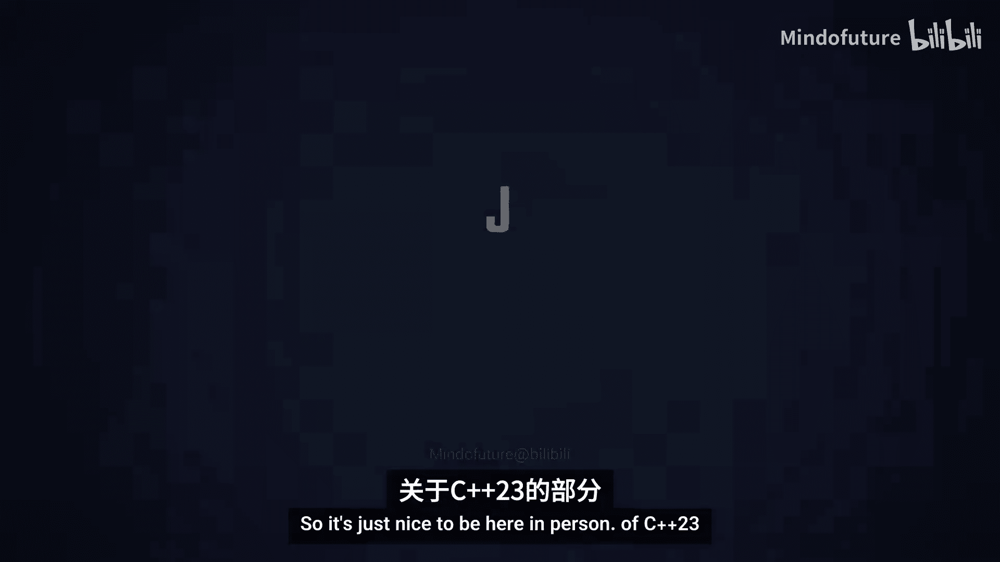
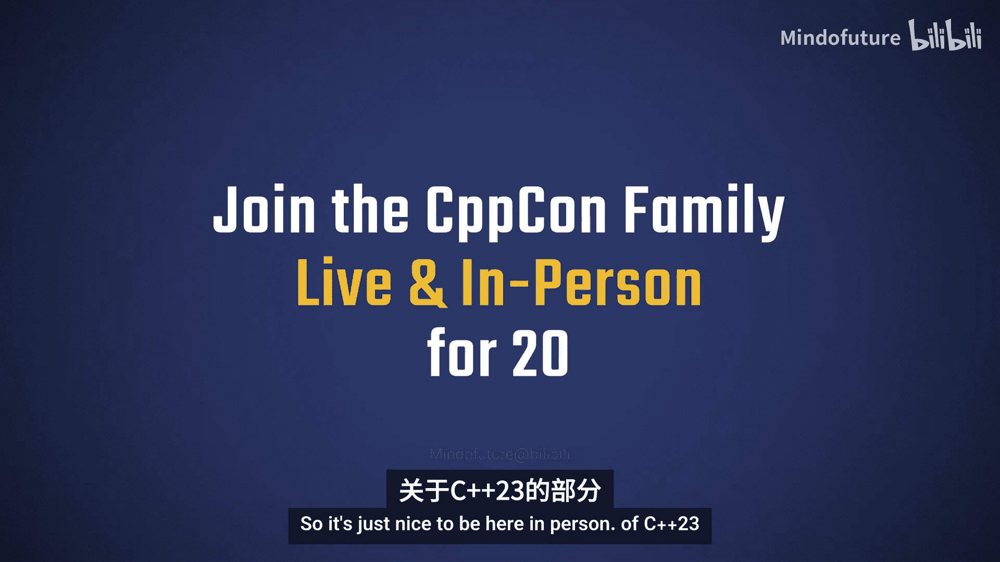
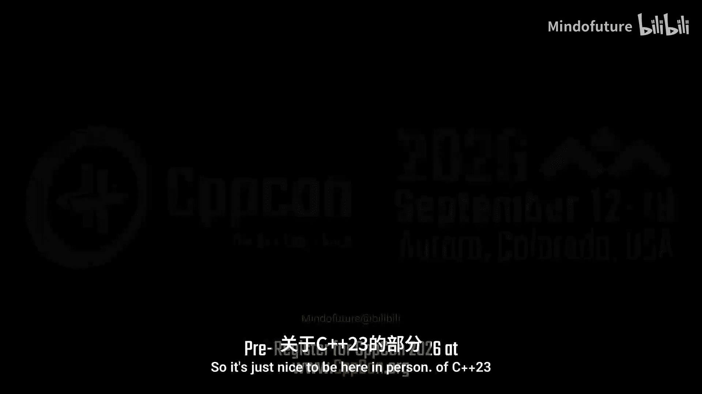
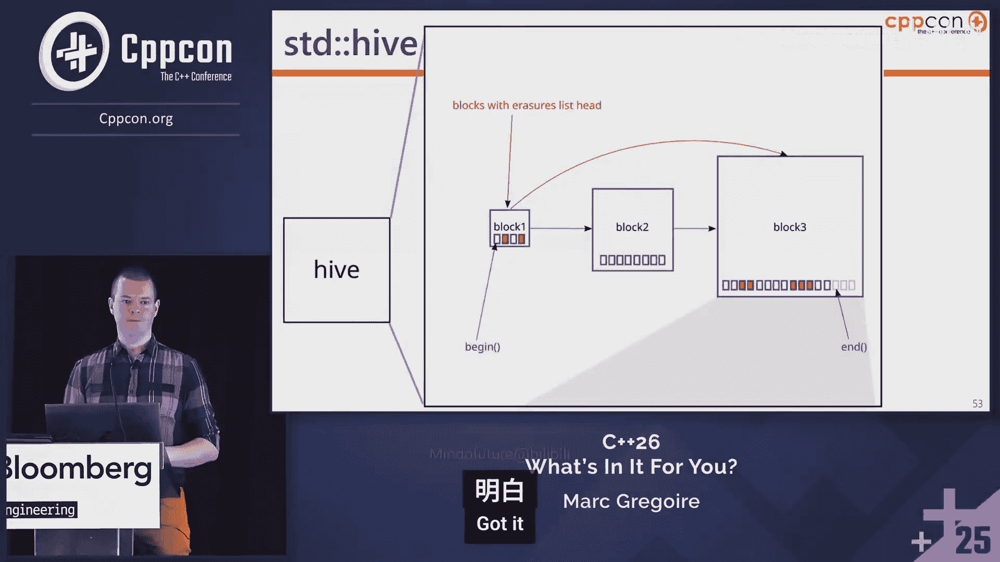
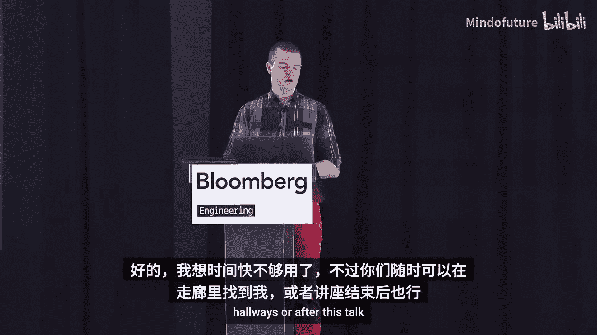

# 042：C++26 为你带来了什么









在本教程中，我们将一起学习 C++26 标准中引入的一系列核心语言和标准库新特性。C++26 是一个重大的更新，带来了许多激动人心的改进，旨在提升开发者的生产力、代码安全性和表达能力。我们将从静态反射、契约等重大特性开始，逐步介绍其他语言和库的增强。

## 核心语言特性

上一节我们概述了 C++26 的整体规模，本节中我们来看看核心语言层面的具体更新。

### 静态反射

C++26 引入了对静态反射的初步支持。静态反射允许程序在编译时检查和操作自身的结构。

核心组件包括：
*   **`std::meta::info`**：一个表示程序元素（如类型、函数）的常量表达式数据结构，称为反射值。
*   **反射运算符 `^`**：用于从操作数创建反射值，例如 `^int` 获取 `int` 类型的反射信息。
*   **元函数**：一系列作用于反射值的 `consteval` 函数，例如 `enumerators_of` 获取枚举的所有枚举项。
*   **拼接器 `[:r:]`**：从一个反射值创建语法元素，例如 `[:r:] x;` 可以定义一个类型由反射值 `r` 决定的变量 `x`。

以下是展示语法的简单示例：
```cpp
// 获取 int 类型的反射值
std::meta::info r = ^int;
// 使用拼接器定义变量 x，其类型为 int
[:r:] x;
// 组合使用：定义变量 c，其类型为 char
[:^char:] c;
```

一个更实用的例子是获取枚举值的字符串名称：
```cpp
enum class Color { Red, Green, Blue };

consteval std::string enum_to_string(auto value) {
    // 遍历枚举的所有枚举项
    template for (std::meta::info enumerator : std::meta::enumerators_of(^decltype(value))) {
        // 使用拼接器创建枚举值进行比较
        if (value == [:enumerator:]) {
            // 使用元函数获取枚举项的名称
            return std::meta::name_of(enumerator);
        }
    }
    return "unnamed";
}
```

C++26 还引入了**注解**，其语法为 `[[=annotation]]`，可以通过反射进行查询，从而为特定注解的类型执行特殊逻辑。

### 契约

契约是 C++26 的另一项重大特性，引入了三种类型的断言，用于在代码中明确表达前提条件、后置条件和不变式。

以下是三种契约类型：
1.  **前提条件**：断言在函数被调用时必须为真，通常用于验证输入参数或对象状态。
    ```cpp
    int func(int i) [[pre: i > 0]] {
        return i * 2;
    }
    ```
    可以使用 `[[pre: i > 0, “i must be positive”]]` 的形式提供诊断信息（字符串字面量）。

2.  **后置条件**：断言在函数执行完成后必须为真，用于验证函数结果或副作用。
    ```cpp
    void MyContainer::clear() [[post: empty()]] {
        // 清空容器的实现
    }
    ```
    后置条件可以引用函数的返回值，使用 `[[post r: r >= i]]` 语法，其中 `r` 代表返回值。

3.  **断言语句**：在函数体内任意位置使用的状态断言，类似于现有的 `assert` 宏，但属于语言核心特性。
    ```cpp
    int foo(int x) {
        [[assert: x != 3]];
        return x;
    }
    ```

契约的评估策略有四种，通过编译模式或实现定义的方式设置：
*   `ignore`：忽略所有契约检查。
*   `observe`：违反契约时，调用契约违反处理函数，然后继续执行。
*   `enforce`：违反契约时，调用处理函数，若其正常返回，则终止程序。
*   `enforce_narrow`：违反契约时，不调用处理函数，直接终止程序。

契约违反处理函数名为 `handle_contract_violation`。其行为（包括是否可替换）由实现定义。

### 未命名占位符变量

有时我们需要为实体命名，但后续永远不会使用该名字。C++26 允许使用单个下划线 `_` 作为未命名占位符。

使用示例：
```cpp
// 忽略 Logger 的命名，因为后续不会使用
Logger _ = get_logger();
// 结构化绑定中忽略不关心的部分
auto [x, _, z] = get_tuple();
```

### `static_assert` 增强

在 C++26 之前，`static_assert` 的第二个参数（消息）必须是字符串字面量。现在，它可以是任何常量求值的字符串。

这带来了新的用例：
*   **共享字符串**：定义一个 `constexpr` 字符串并在多个断言中使用。
*   **计算字符串**：未来当 `std::format` 成为 `constexpr` 后，可以生成动态的诊断信息。
    ```cpp
    // 未来可能的用法
    static_assert(sizeof(int) == 4, std::format("Expected 4, got {}", sizeof(int)));
    ```

### `= delete` 支持说明

现在可以为删除的函数提供说明原因。
```cpp
void old_api() = delete("Use new_api() instead");
// 对于只移动类型
MyMoveOnlyType(const MyMoveOnlyType&) = delete("Copy construction is expensive, use move instead");
```

### 结构化绑定增强

C++26 为结构化绑定带来了多项改进。

首先，可以为单个绑定指定属性：
```cpp
auto [x, [[maybe_unused]] y] = get_point();
```

其次，结构化绑定现在可以用于条件语句中：
```cpp
// 如果函数 f() 返回的类型可转换为 bool 并可结构化绑定
if (auto [a, b, c] = f(); a > 0) {
    // 使用 a, b, c
}
```
这大致等价于：
```cpp
auto e = f();
auto [a, b, c] = e;
if (static_cast<bool>(e)) { ... }
```
一个常见用例是处理类似 `std::from_chars` 的结果：
```cpp
if (auto [ptr, ec] = std::from_chars(str.data(), str.data() + str.size(), value); ec == std::errc{}) {
    // 解析成功，使用 value
}
```
这之所以可行，是因为 C++26 为 `std::from_chars_result` 等类型添加了 `operator bool`。

第三，结构化绑定现在可以是 `constexpr`：
```cpp
constexpr auto [x, y] = get_point();
```

第四，结构化绑定现在可以引入一个**参数包**（只能是一个）：
```cpp
auto [...pack] = f(); // pack 是一个包含 f() 返回的所有元素的包
auto [x, ...rest] = f(); // rest 是一个包，包含除第一个元素外的所有元素
auto [x, y, ...rest] = f(); // rest 可能为空包
// auto [...a, ...b] = f(); // 错误：只能有一个包
```

### 包索引

包索引允许你轻松地从参数包中访问特定元素，简化了之前需要复杂模板代码的操作。

语法是 `pack...[index]`：
```cpp
template <typename... Ts>
void bar(Ts... args) {
    auto first = args...[0]; // 获取包中的第一个元素
}
```
索引必须是常量表达式。

实用示例：
```cpp
// 获取参数包中第 I 个元素
template <size_t I, typename... Ts>
constexpr auto element_at(Ts... args) -> decltype(auto) {
    return args...[I];
}
// 获取元组类结构中第 I 个元素
template <size_t I, TupleLike T>
constexpr auto tuple_element_at(T&& t) -> decltype(auto) {
    auto [...elems] = std::forward<T>(t);
    return elems...[I];
}
```

### `#embed` 指令

`#embed` 是一个新的预处理器指令，用于轻松嵌入外部数据（尤其是二进制数据）到源代码中。
```cpp
// 嵌入 PNG 文件
const unsigned char favicon[] = {
#embed "favicon.png"
};
// 限制嵌入数据的最大大小
const unsigned char random_data[] = {
#embed 255 "/dev/urandom"
};
```

### 向参数包授予友元

现在可以轻松地将友元关系授予参数包中的所有类。
```cpp
template <typename... Friends>
class Foo {
    // 授予 Friends... 包中所有类型友元关系
    friend Friends...;
};
```

### 常量表达式增强

C++26 在常量求值方面有显著增强。

首先，现在可以在常量表达式中将 `void*` 转换回具体类型指针，前提是 `void*` 确实指向该类型的对象。这为常量表达式下的类型擦除提供了可能。
```cpp
constexpr int v = 42;
constexpr void* vptr = &v;
constexpr int* iptr = static_cast<int*>(vptr); // C++26 允许
```
这为未来实现 `constexpr` 的 `std::function`、`std::any` 等奠定了基础。

其次，现在可以在常量求值中使用**布置 new**。

第三，现在可以在常量求值中**抛出和捕获异常**。
```cpp
constexpr int divide(int a, int b) {
    if (b == 0) throw std::invalid_argument("divide by zero");
    return a / b;
}
constexpr std::optional<int> checked_divide(int a, int b) {
    try {
        return divide(a, b);
    } catch (...) {
        return std::nullopt;
    }
}
constexpr auto r1 = checked_divide(5, 0); // C++26 中合法，返回 nullopt
```

### 错误行为与 `[[indeterminate]]` 属性

C++26 引入了**错误行为**的概念。它总是由不正确的程序代码引起，实现可以诊断但不要求必须诊断。例如，读取未初始化变量现在被定义为错误行为。
```cpp
int d1; // 未初始化
int e1 = d1; // 错误行为（之前是未定义行为）
```
如果你不希望触发错误行为，可以使用新的 `[[indeterminate]]` 属性。标记为该属性的变量，其读取是**未定义行为**而非错误行为。
```cpp
void f(int);
void g() {
    int y;
    f(y); // 错误行为，y 未初始化
    [[indeterminate]] int x;
    f(x); // 未定义行为
}
```
这适用于你明确知道变量将被立即覆盖的场景。

## 标准库特性

上一节我们介绍了核心语言的主要更新，本节中我们来看看标准库中引入的一些重要新特性和改进。

### 执行控制库

执行控制库是一个全新的库，旨在简化异步操作的处理。它定义在 `<execution>` 头文件中。

其关键设计目标包括：
*   **可组合且泛型**的构建块，以适配不同的执行资源（CPU、GPU等）。
*   封装常见的异步模式，易于在管道中复用。
*   易于正确使用。
*   支持正确的错误传播和取消操作。

关键抽象概念：
*   **执行资源**：执行工作的场所（如线程池、GPU）。
*   **调度器**：表示在某个执行资源上调度工作策略的轻量级句柄。
*   **发送器**：描述要在执行资源上执行的异步工作。它可以发送三种信号：值（成功）、错误、停止（取消）。
*   **接收器**：作为不同发送器之间的粘合剂，是一个支持 `set_value`、`set_error`、`set_stopped` 的回调。

异步算法分为三类：
1.  **发送器工厂**：不接受发送器参数，返回一个发送器。例如 `execution::schedule(scheduler)`。
2.  **发送器适配器**：接受一个或多个发送器作为输入，返回另一个发送器。例如 `then(sender, callable)` 在发送器完成后调用可调用对象。
3.  **发送器消费者**：接受发送器，不返回发送器。例如 `this_thread::sync_wait(sender)` 会阻塞直到工作完成。

使用示例：
```cpp
// 获取一个线程池调度器
auto sched = thread_pool_scheduler{};
// 构建异步工作流水线
auto work = execution::schedule(sched)
          | execution::then([] { std::cout << "Hello"; return 1; })
          | execution::then([](int i) { std::cout << i; return i + 40; });
// 提交并等待执行完成
auto [result] = std::this_thread::sync_wait(std::move(work)).value();
```

### 新容器：`inplace_vector` 和 `hive`

C++26 引入了两个新容器。

`std::inplace_vector<T, Capacity>` 是一个容量在编译时固定的动态大小向量，元素存储在容器自身内部（栈上或作为对象的一部分），无需堆分配。当尝试插入超出容量的元素时会抛出 `std::bad_alloc` 异常（或使用 `try_push_back` 返回 `nullptr`）。
```cpp
std::inplace_vector<int, 3> vec;
vec.push_back(1); // 大小=1
vec.push_back(2); // 大小=2
vec.push_back(3); // 大小=3
// vec.push_back(4); // 抛出 std::bad_alloc
```

`std::hive`（也称为桶数组或对象池）是一种非连续容器，由多个内存块组成。每个元素都有一个“跳过字段”标记其是否已被擦除。迭代时会跳过被擦除的元素。当块中所有元素都被擦除时，整个块会被释放。插入元素可能重用已擦除元素的位置或分配新块。
**优点**：擦除元素不会导致重新分配或元素移动，迭代器和指针在插入和擦除后保持稳定。
```cpp
std::hive<int> hive;
hive.insert(1);
hive.insert(2);
for (int i : hive) { std::cout << i << ' '; }
```

### `submdspan` 函数

C++23 引入了 `std::mdspan` 多维数组视图。C++26 增加了 `std::submdspan` 函数，用于创建现有 `mdspan` 的子视图。
```cpp
// 将一个 3D 立方体六个面的所有元素置零
void zero_3d_cube_surface(std::mdspan<int, std::dextents<size_t, 3>> cube) {
    using std::submdspan;
    // 对每个面应用 zero_2d_grid 函数
    zero_2d_grid(submdspan(cube, 0, std::full_extent, std::full_extent)); // 第一个维度为 0 的面
    // ... 处理其他五个面
}
```

### 饱和算术

标准库增加了饱和算术函数，运算结果会被限制在目标类型的取值范围内，而不是进行模运算。
```cpp
unsigned char pixel = 255;
// 普通算术：255 + 4 = 3 (模 256)
// 饱和算术：255 + 4 = 255
auto brightened = std::add_sat(pixel, 4);
```
相关函数有 `std::add_sat`, `std::sub_sat`, `std::mul_sat`, `std::div_sat`。

### 字符串流和 `bitset` 的 `string_view` 支持

现在可以使用 `std::string_view` 来构造和重新初始化 `std::stringstream` 和 `std::bitset`。
```cpp
std::string_view sv = "Hello";
std::stringstream ss1(sv); // 从 string_view 构造
ss1.str(sv); // 用 string_view 重新初始化
std::bitset<10> bs(sv); // 从 string_view 构造 bitset
```

### 文本编码查询

`<text_encoding>` 头文件允许查询源代码字面量使用的编码和执行环境的编码。
```cpp
bool environment_supports_utf8() {
    return std::text_encoding::literal() == std::text_encoding::utf8 &&
           std::text_encoding::wide_literal() == std::text_encoding::utf8;
}
```
这可以用于在支持时输出特殊字符，否则回退到 ASCII 表示。

### 原生文件句柄

现在可以通过 `native_handle()` 方法获取流底层的操作系统原生文件句柄。类型 `std::native_handle_type` 会映射到对应系统的类型（如 POSIX 的 `int`，Windows 的 `HANDLE`）。
```cpp
std::ofstream file("log.txt");
// 获取底层文件描述符/句柄，用于调用特定平台的 API
auto handle = file.native_handle();
```

### 更多的 `constexpr` 支持

标准库中大量的组件现在成为 `constexpr`：
*   稳定排序算法（`std::stable_sort`, `std::stable_partition`, `std::inplace_merge`）。
*   `<cmath>` 和 `<complex>` 中的许多数学函数。
*   `std::atomic` 和 `std::atomic_ref` 的大部分方法。
*   特殊内存算法（如 `std::uninitialized_copy`）。
*   所有标准异常类型。
*   几乎所有容器和容器适配器（除了新的 `std::hive`）。

### 新的 SI 词头

C++26 增加了 2022 年采纳的四个新 SI 词头，用于极大和极小的数字：
*   `std::quetta` (Q, 10^30), `std::ronna` (R, 10^27)
*   `std::quecto` (q, 10^-30), `std::ronto` (r, 10^-27)
它们仅在 `std::intmax_t` 能够表示其分子或分母时才会被定义。

### 调试库

`<debugging>` 头文件提供了平台无关的调试支持：
*   `std::is_debugger_present()`：检查调试器是否附加。
*   `std::breakpoint()`：触发断点。
*   `std::breakpoint_if_debugging()`：仅在调试器附加时触发断点。

### 线性代数库

`<linalg>` 头文件引入了一套基于 BLAS（基础线性代数子程序）的自由函数，用于线性代数计算。它使用 `std::mdspan` 表示矩阵和向量，支持混合精度计算，并允许提供执行策略以进行并行化。
```cpp
std::vector<double> data(40);
std::iota(data.begin(), data.end(), 0.0);
auto vec = std::mdspan(data.data(), 40);
// 缩放向量：所有元素乘以 2
std::scale(std::execution::par, vec, 2.0);
```

### 复数作为元组类类型

现在可以将 `std::complex` 值当作元组类类型来访问，从而可以直接使用结构化绑定。
```cpp
std::complex<double> c{3.0, 4.0};
auto [real, imag] = c; // C++26: real=3.0, imag=4.0
```

### `views::concat` 视图工厂

`views::concat` 接受任意数量的输入范围，返回一个将它们串联起来的视图。
```cpp
std::vector v1{1, 2, 3};
std::vector v2{4, 5};
std::array a{6, 7, 8};
for (int i : std::views::concat(v1, v2, a)) {
    std::cout << i << ' '; // 输出 1 2 3 4 5 6 7 8
}
```

### 字符串与 `string_view` 的 `operator+` 重载

新增了 `operator+` 的重载，支持 `std::string` 和 `std::string_view` 在任意方向上的拼接。
```cpp
std::string str = "Hello";
std::string_view sv = " World";
auto s1 = str + sv; // 有效
auto s2 = sv + str; // 有效
```

### 算法的列表初始化支持

现在调用算法时，可以直接使用列表初始化语法，而无需显式指定类型。
```cpp
struct Point { int x; int y; };
std::vector<Point> points;
// 之前：points.push_back(Point{1, 2});
// C++26:
points.push_back({1, 2}); // 本来就支持
std::ranges::find(points, {1, 2}); // C++26 新支持
std::ranges::fill(points, {0, 0}); // C++26 新支持
```

### `views::cache_latest`

这是一个新的范围适配器，用于缓存迭代器最后一次解引用的结果。这可以避免在类似 `transform | filter` 的管道中，`transform` 对同一元素进行多次计算。
```cpp
auto square = [](int i) { std::cout << "square "; return i*i; };
auto even = [](int i) { std::cout << "even "; return i%2==0; };
std::vector vec{1,2,3,4,5};
for (int i : vec | std::views::transform(square) | std::views::filter(even)) { }
// 输出可能包含重复的 "square" 调用
for (int i : vec | std::views::transform(square) | std::views::cache_latest | std::views::filter(even)) { }
// 使用 cache_latest 后，"square" 对每个元素只调用一次
```

### 范围算法 `ranges::generate_random`

新的范围算法，用于用随机数填充一个范围。
```cpp
std::array<int, 42> arr;
std::mt19937 gen(std::random_device{}());
std::uniform_int_distribution dist(0, 100);
std::ranges::generate_random(arr, gen, dist);
```

### 新的随机数引擎：Philox

C++26 新增了 Philox 随机数引擎（`std::philox4x32` 和 `std::philox4x64`）。它们具有状态小、周期长、易于并行化的特点，适用于蒙特卡洛模拟等场景。
```cpp
std::philox4x32 gen(std::random_device{}());
std::normal_distribution dist;
double random_value = dist(gen);
```

### 格式化文件系统路径


现在可以方便地使用 `std::format` 格式化 `std::filesystem::path` 对象，支持 UTF-8 文件名。
```cpp
std::filesystem::path p = "/usr/bin";
std::cout << std::format("Path: {}", p); // 输出 Path: "/usr/bin"
```

### `std::print` 空行


C++23 的 `std::print` 在打印空行时需要显式提供空字符串参数。C++26 简化了这一操作。
```cpp
std::print("\n"); // C++23 和 C++26
std::println();   // C++26: 打印一个空行，无需参数
```

### 数据并行类型库

`<simd>` 头文件定义了可移植的数据并行类型（`std::simd`, `std::simd_mask`）和相关操作，这些操作可以利用现代 CPU 的 SIMD 指令。
```cpp
std::simd<double, 16> x = [](auto i) { return i; }; // 初始化 0..15
std::simd<double, 16> y = sin(x) * sin(x) + cos(x) * cos(x); // 所有分量应约为 1.0
std::print("{}", y);
```

## 总结

本节课中我们一起学习了 C++26 标准中引入的众多新特性。我们从两大核心特性——静态反射和契约开始，它们将显著改变我们编写元编程和健壮代码的方式。接着，我们探讨了语言层面的诸多改进，如未命名占位符、增强的结构化绑定、包索引、常量表达式能力的巨大提升等。

在标准库部分，我们介绍了全新的执行控制库，它旨在简化异步编程；两个新容器 `inplace_vector` 和 `hive` 提供了不同的存储和性能权衡；此外还有饱和算术、线性代数库、调试支持、文本编码查询等大量新增和增强功能。






需要强调的是，本教程涵盖的只是 C++26 庞大更新中的一部分。还有更多特性，如危险指针和 RCU、大量的独立实现功能增强、范围库的进一步改进等，未能在此详述。C++26 是一个内容丰富、旨在提升开发者体验和代码质量的重要标准版本。建议你根据提到的关键词，进一步查阅相关资料以深入了解你感兴趣的特性。