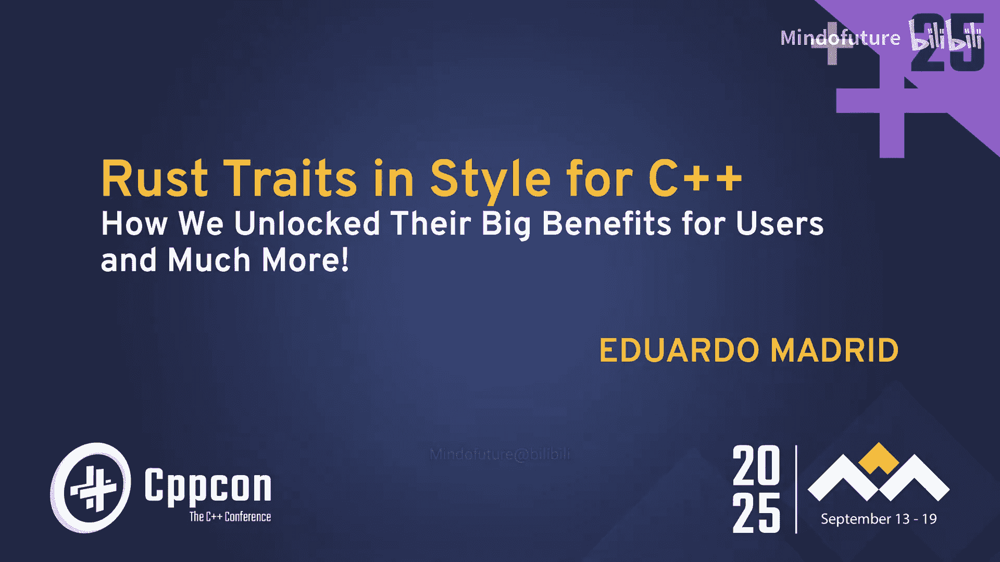
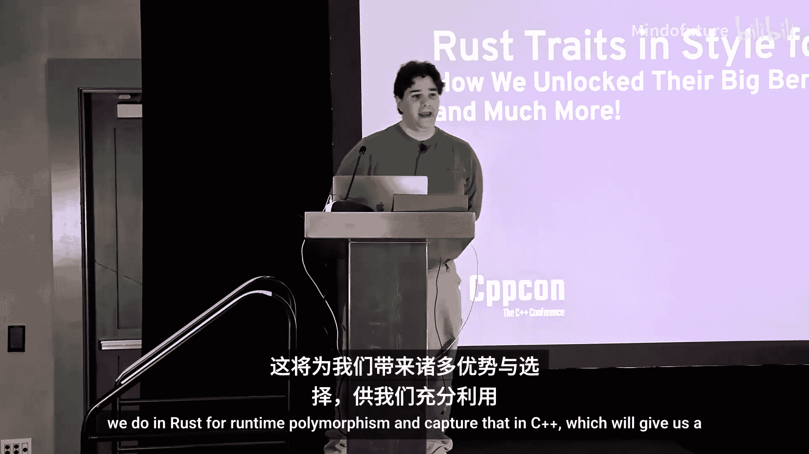
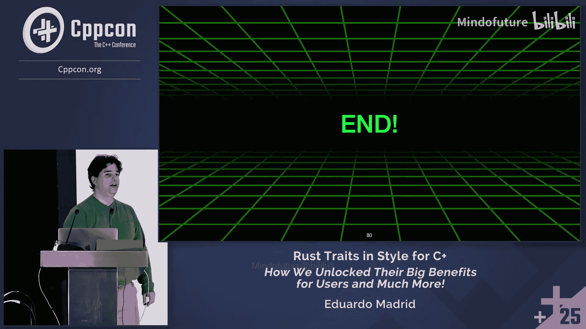
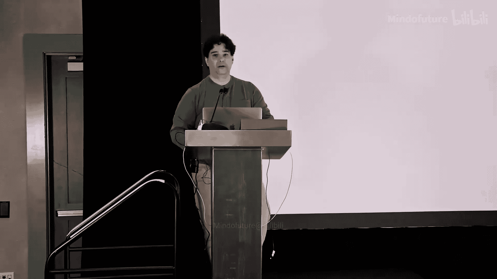
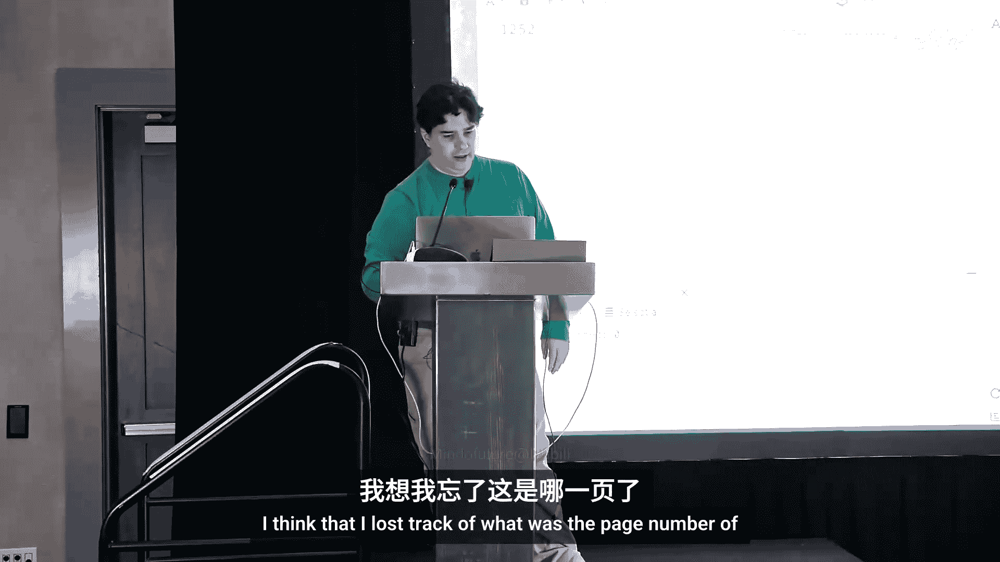
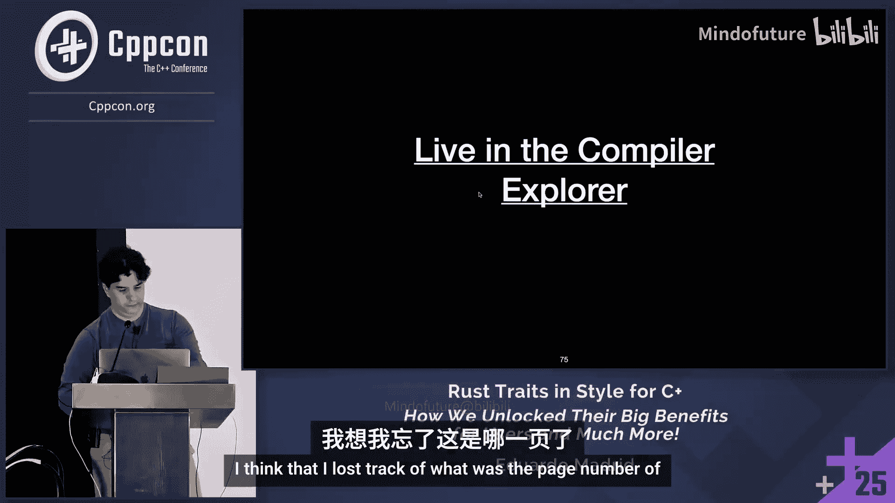
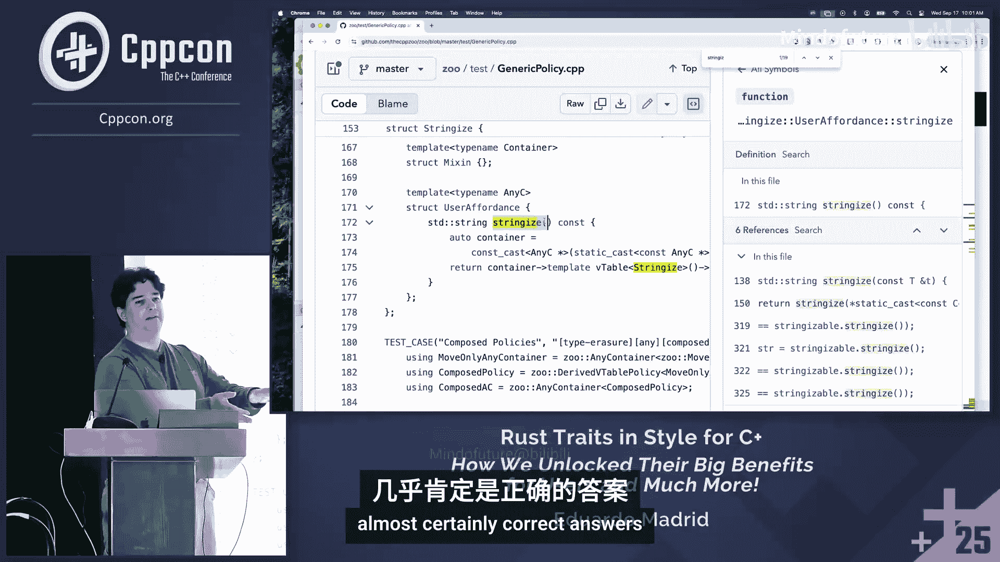
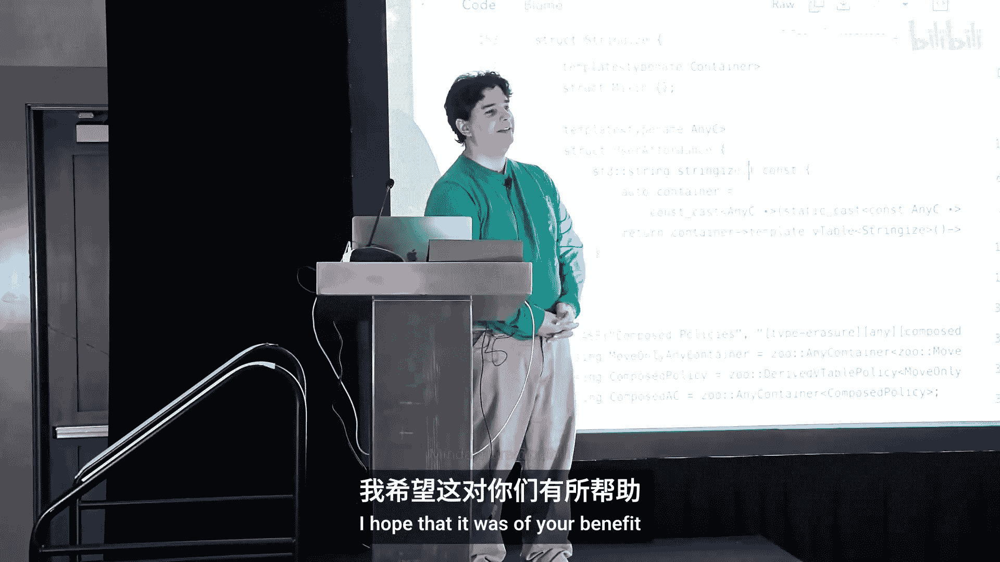

# 043：从 Rust 特性中汲取灵感






## 概述

在本教程中，我们将探讨如何在 C++ 中实现 Rust 语言中“特性”风格的运行时多态。我们将学习如何利用 C++ 强大的编译时能力，通过用户代码（特别是类型擦除框架）来合成运行时多态机制，从而获得比传统虚函数继承更好的性能、更小的代码体积和更强的建模能力。

---

## 第一部分：问题与动机

### 1.1：什么是运行时多态及其价值

运行时多态的核心是：在编译时，代码并不知道将使用哪个具体实现。程序在运行时动态发现并调用相应的实现。这使得我们可以用同一个接口替换不同的实现，代码无需修改即可工作。

其核心价值在于**抽象**和**复用性**。假设你有 N 种实现，代码库有 M 种使用方式。如果没有抽象，你需要编写 N * M 份代码。如果定义了一个良好的接口，你只需要 1（接口） + N（实现） + M（使用）份代码。这是一个巨大的优势。

### 1.2：传统 C++ 方式的痛点

上一节我们介绍了运行时多态的理想目标，本节中我们来看看 C++ 传统实现方式面临的问题。

传统 C++ 通过虚函数和继承来实现运行时多态，但这带来了一系列问题：

1.  **对象切片**：当通过值传递或存储多态对象时，如果派生类对象大于基类，会导致派生类特有的数据被“切掉”，引发难以追踪的错误。
2.  **侵入性**：为了获得多态能力，类型必须从某个基类继承。这强制引入了“是一个”的结构关系，而很多时候我们只想表达“能做”某个行为。
3.  **引用语义**：为了避免切片，必须使用指针或引用，这引入了间接访问、生命周期管理和潜在的状态共享问题，破坏了局部推理。
4.  **包装负担**：对于已存在的类型（如 `int`），若想赋予其多态能力，必须为其创建包装类，这增加了代码复杂度。
5.  **组合爆炸**：如果一个类型需要参与多个多态接口，要么创建复杂的多重继承层次，要么为每个接口创建单独的包装器，管理起来非常繁琐。
6.  **缺乏灵活性**：虚函数机制是语言内置的“一揽子”方案，无法根据需求进行定制或优化（例如，禁用不需要的 RTTI）。

---

## 第二部分：Rust 的解决方案

### 2.1：Rust 特性简介

Rust 通过 **特性** 来实现运行时多态。特性定义了一组方法签名，任何类型都可以为某个特性提供实现，而无需修改类型本身的定义或继承关系。这是一种**非侵入式**的、**选择加入**的机制。

以下是一个 Rust 序列化特性的例子：
```rust
trait Serializable {
    fn serialize(&self, buffer: &mut Vec<u8>) -> Result<(), Error>;
}
```
为 `i32` 实现这个特性：
```rust
impl Serializable for i32 {
    fn serialize(&self, buffer: &mut Vec<u8>) -> Result<(), Error> {
        // ... 序列化逻辑
        Ok(())
    }
}
```
可以看到，`i32` 类型本身没有变化，我们只是从外部为其“添加”了 `Serializable` 的能力。

### 2.2：Rust 中的动态分发

在 Rust 中，要使用特性的动态分发（运行时多态），通常需要使用 `Box<dyn Trait>` 这样的“胖指针”。它包含一个指向数据的指针和一个指向虚函数表（vtable）的指针。

```rust
let serializable_obj: Box<dyn Serializable> = Box::new(42);
serializable_obj.serialize(&mut buffer);
```
这种方式具有值语义（独占所有权），但通常需要在堆上分配内存。

---

## 第三部分：在 C++ 中实现 Rust 风格的多态

### 3.1：核心思想：类型擦除与外部多态

上一节我们看到了 Rust 特性的优雅之处，本节中我们来看看如何在 C++ 中实现类似的效果。

关键在于结合两种技术：
1.  **外部多态**：从类型外部为其赋予多态能力，而不修改类型本身。
2.  **类型擦除**：通过控制对象的构造、析构、移动和复制操作，我们可以在运行时管理不同类型的对象，同时通过统一的接口来操作它们。

这本质上是在**用户代码层面**，模仿编译器为虚函数创建虚表（vtable）和进行动态分发的机制。

### 3.2：框架使用示例

假设我们有一个名为 `su` 的类型擦除框架。以下是如何定义一个 `Serializable` “特性”（在框架中称为“affordance”）并使用它：

首先，定义 affordance（包含虚表条目）：
```cpp
// 这是一个简化的示意结构，实际框架代码更复杂
struct serializable_affordance {
    struct vtable_entry {
        void (*serialize)(const void* obj, std::vector<std::byte>& buffer);
        std::size_t (*get_length)(const void* obj);
    };
    // ... 其他用于绑定到容器的代码
};
```
然后，通过策略构建器将其与容器配置组合：
```cpp
using policy = su::policy<su::local_buffer<sizeof(void*) * 2>, su::affordances<serializable_affordance>>;
using serializable = su::any_container<policy>;
```
现在，我们可以创建具有 `Serializable` 能力的对象：
```cpp
serializable obj = su::make<serializable>(42); // 包装一个 int
obj.serialize(some_buffer); // 动态调用 serialize 方法
```
这个 `serializable` 容器具有值语义，并且可以根据配置选择在栈上存储小对象或在堆上存储大对象。

### 3.3：机制剖析

以下是该机制如何工作的关键点：

1.  **虚表构建**：框架将每个 affordance 提供的虚表条目组合起来，形成一个完整的虚表。
2.  **对象管理**：容器（或叫值管理器）负责存储实际对象（可能在内部缓冲区或堆上），并持有指向该对象虚表的指针。
3.  **动态分发**：当调用 `obj.serialize()` 时，代码通过容器找到虚表，从虚表中找到对应的函数指针，并将指向实际对象的指针传递给它进行调用。
4.  **类型安全桥梁**：在 affordance 的实现中，通过模板函数将 `void*` 转换回具体的类型 `T`，然后调用为该类型特化的函数（例如，一个通用的 `serialize_impl(const T&)`）。

---

## 第四部分：优势与总结

### 4.1：C++ 实现带来的独特优势

通过用户代码合成运行时多态，我们获得了超越 Rust 或传统 C++ 虚函数的灵活性：

*   **真正的值语义**：对象可以按值传递和存储，无需担心切片。
*   **可配置的存储策略**：用户可以决定对象是存储在栈上（避免堆分配）还是堆上，甚至可以禁用堆分配作为编译时约束。
*   **非侵入性**：现有类型无需修改即可获得多态能力。
*   **组合自由**：一个类型可以轻松拥有多个独立的“特性”，没有包装器组合爆炸的问题。
*   **利用现有生态**：仍然可以使用异常、RTTI（可选）等完整的 C++ 特性。
*   **性能优化潜力**：由于在编译时提供了更多信息，编译器有机会进行更好的优化。




### 4.2：总结








本节课中我们一起学习了：

1.  **传统 C++ 运行时多态（基于继承）的局限性**，包括侵入性、对象切片和组合复杂性。
2.  **Rust 特性**如何以一种非侵入式、选择加入的方式优雅地解决了这些问题。
3.  **如何在 C++ 中利用类型擦除和外部多态技术**，在用户代码层面模拟 Rust 特性的机制。
4.  **这种方法的强大优势**，它结合了 Rust 特性设计上的优点和 C++ 在性能、灵活性和控制力上的固有优势。






最终结论是：C++ 足够强大，允许我们在库中实现和定制通常需要语言内置支持的功能。这为我们提供了无与伦比的建模能力和优化空间，让我们能够为特定问题选择最合适的解决方案，真正做到“博采众长”。