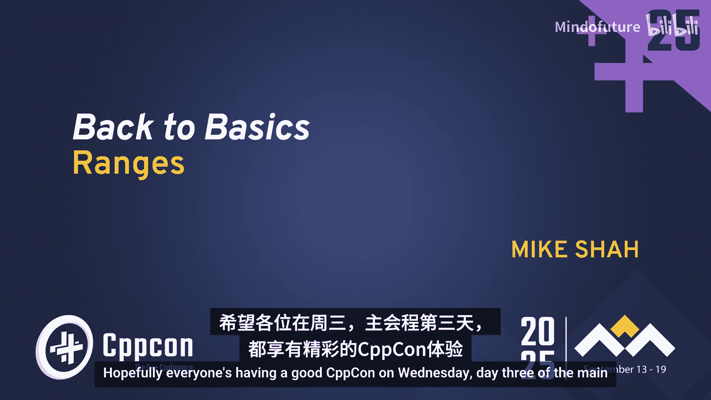
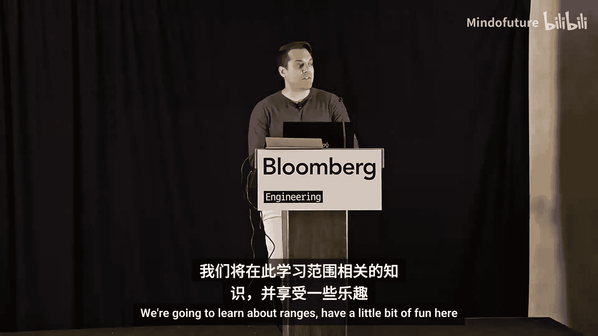
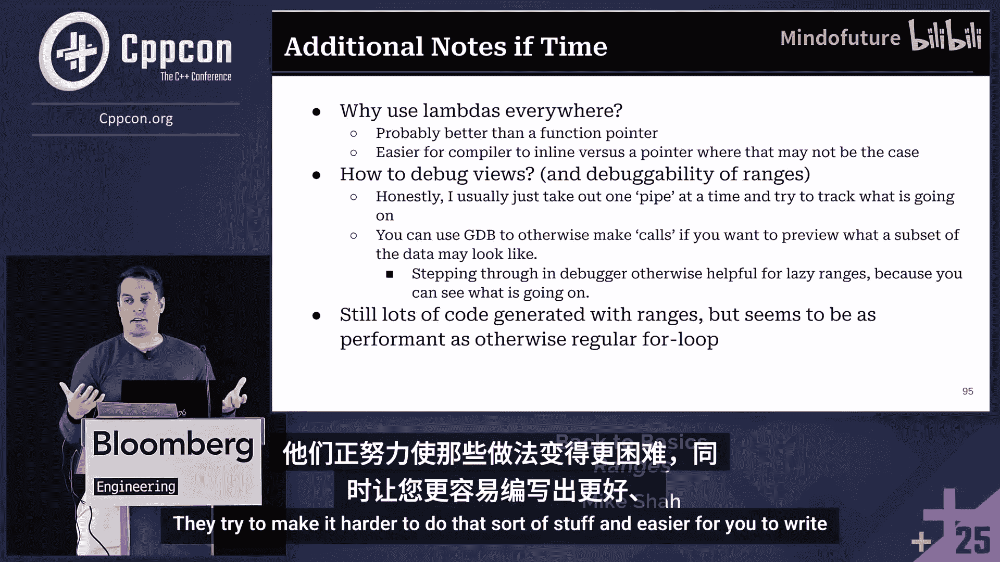
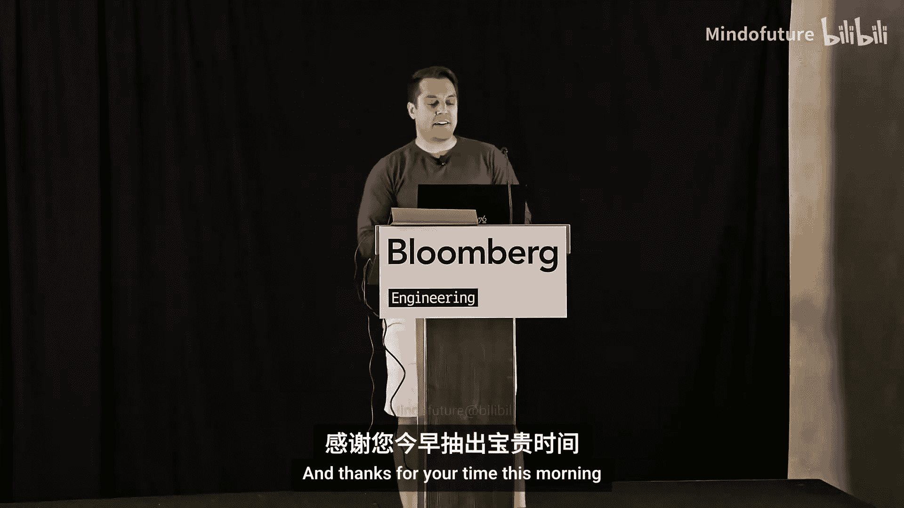
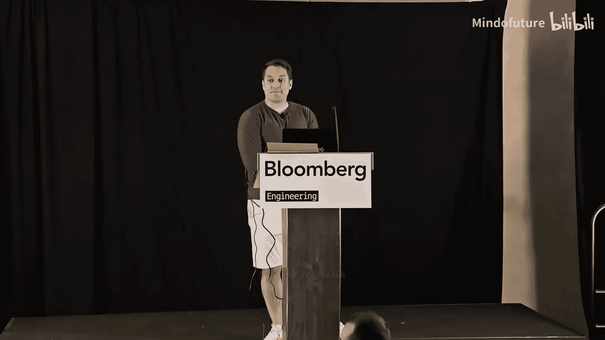

# 044：C++ 范围






## 概述

在本节课中，我们将学习 C++ 中的范围（Ranges）。我们将从最基础的循环开始，逐步理解迭代器（Iterators）的概念，然后学习标准模板库（STL）算法，最终掌握 C++20 引入的范围库。通过本教程，你将学会如何用更简洁、更安全、更可组合的方式来处理和转换数据。

## 从循环到迭代器

### 循环：算法的基础

算法本质上就是循环。在程序中寻找循环是理解计算发生位置的好方法。作为程序员，我们一半的工作是转换数据，另一半是存储数据。因此，我们需要好的抽象工具来完成这些任务。

一个基本的 `for` 循环结构如下：
```cpp
for (初始化; 条件; 表达式) {
    // 执行操作
}
```
它的作用是定义计算的开始和结束，并对数据执行操作，例如打印或修改值。

我们可以用 `for` 循环遍历一个字符数组：
```cpp
char message[] = "Hello, everyone, welcome!";
for (int i = 0; i < sizeof(message); ++i) {
    std::cout << message[i];
}
```

使用标准库容器（如 `std::array` 或 `std::string`）可以让代码更清晰、更安全：
```cpp
std::string message = "Hello, everyone, welcome!";
for (size_t i = 0; i < message.size(); ++i) {
    std::cout << message[i];
}
```

### 使用指针进行迭代

除了使用索引，我们还可以使用指针来遍历数据。这种方法更接近底层的内存操作。
```cpp
std::array<char, 27> message = {'H', 'e', 'l', 'l', 'o', ...};
char* ptr = message.data();
char* end = message.data() + message.size();
for (; ptr != end; ++ptr) {
    std::cout << *ptr;
}
```
这里，`ptr` 指针指向数据的起始地址，通过指针算术运算（`++ptr`）移动到下一个元素，直到到达 `end` 指针所指向的末尾。

### 迭代器：指针的泛化

指针迭代的方式虽然有效，但不够通用。对于树或图等非连续数据结构，仅靠 `++` 操作无法移动到下一个元素。因此，C++ 引入了**迭代器**的概念。

迭代器是一个对象，它封装了遍历集合中元素的行为。它提供了 `begin()` 和 `end()` 方法来获取指向集合起始和“末尾后一位”的迭代器。
```cpp
std::vector<int> vec = {1, 2, 3};
auto start = std::begin(vec); // 获取起始迭代器
auto finish = std::end(vec);   // 获取结束迭代器
for (auto it = start; it != finish; ++it) {
    std::cout << *it;
}
```
`++it` 操作的具体行为由迭代器类型决定。对于 `std::vector`，它可能只是增加索引；对于链表或树，它可能遵循特定的遍历算法（如广度优先搜索）。

使用自由函数 `std::begin()` 和 `std::end()` 比成员函数 `.begin()` 和 `.end()` 更通用，因为它们适用于所有提供了相应迭代器的容器。

### 范围：迭代器对

一个**范围**就是一对迭代器：一个指向开始，一个指向结束。这个“结束”迭代器通常指向最后一个元素之后的位置，这使得处理空集合变得简单。
```cpp
// [begin, end) 定义了一个范围
auto range_begin = std::begin(container);
auto range_end = std::end(container);
```
这个范围精确地定义了计算发生的区间。

### 基于范围的 for 循环

由于“获取起止迭代器并循环”的模式非常常见，C++11 引入了**基于范围的 for 循环**语法糖。
```cpp
std::map<std::string, int> my_map = {{"apple", 1}, {"banana", 2}};
for (const auto& key_value_pair : my_map) {
    std::cout << key_value_pair.first << ": " << key_value_pair.second;
}
```
编译器会将上述代码展开为使用迭代器的传统 `for` 循环。我们还可以使用结构化绑定来让代码更清晰：
```cpp
for (const auto& [key, value] : my_map) {
    std::cout << key << ": " << value;
}
```

## 标准模板库算法

### 算法与迭代器的结合

标准模板库提供了大量泛型算法，它们接受迭代器对作为参数，对指定范围内的元素执行操作。这使我们能够用函数调用替代手写的循环。

要使用这些算法，需要包含 `<algorithm>` 头文件（部分数学相关算法在 `<numeric>` 中）。

以下是一些常用算法的示例：

排序 (`std::sort`)：
```cpp
std::vector<int> numbers = {5, 3, 1, 4, 2};
std::sort(numbers.begin(), numbers.end());
```

分区 (`std::partition`)：
```cpp
std::vector<int> vec = {1, 9, 2, 8, 3, 7};
auto it = std::partition(vec.begin(), vec.end(), [](int i){ return i < 5; });
// 现在 vec 被分为小于5和大于等于5的两部分
```

复制 (`std::copy`)：
```cpp
std::vector<int> source = {1, 2, 3};
std::vector<int> destination;
std::copy(source.begin(), source.end(), std::back_inserter(destination));
// `std::back_inserter` 是一个输出迭代器适配器，它会调用 `destination.push_back()`
```

变换 (`std::transform`)：
```cpp
std::string str = "hello";
std::string upper;
std::transform(str.begin(), str.end(), std::back_inserter(upper), ::toupper);
// upper 变为 "HELLO"
```

### 迭代器的缺陷

尽管迭代器功能强大，但也存在一些陷阱：

1.  **迭代器失效**：当容器（如 `std::vector`）发生内存重分配（例如 `push_back`）时，指向旧内存的迭代器会失效，继续使用可能导致未定义行为。
2.  **迭代器不匹配**：错误地将一个容器的 `begin` 和另一个容器的 `end` 配对。
3.  **接口不一致**：少数算法（如 `std::rotate`）的参数顺序不是简单的 `(begin, end)`，而是 `(first, middle, last)`，需要额外注意。
4.  **空间不足**：使用输出迭代器向固定大小数组写入时，如果数据量超过数组容量，会导致错误。

## C++20 范围库

### 什么是范围？

范围库（定义在 `<ranges>` 头文件中）是对迭代器概念的改进和扩展。一个范围仍然表示一个元素序列，但提供了更安全、更易用的接口。

核心改进在于，许多范围算法现在可以直接接受整个容器作为参数，而无需手动传递 `begin()` 和 `end()` 迭代器。

### 范围算法

范围算法是 STL 算法的“约束”版本，位于 `std::ranges` 命名空间中。它们通常比传统算法少一个参数。

比较传统算法和范围算法：
```cpp
// 传统方式
std::vector<int> v1 = {3, 1, 4, 1, 5};
std::sort(v1.begin(), v1.end());

// 范围方式 (C++20)
std::vector<int> v2 = {3, 1, 4, 1, 5};
std::ranges::sort(v2); // 更简洁，不易出错
```
范围算法直接对容器 `v2` 进行操作，意图更清晰，减少了因迭代器不匹配而出错的机会。

查找示例 (`std::ranges::find_if`)：
```cpp
std::vector<int> vec = {5, 3, 8, 1, 9};
auto it = std::ranges::find_if(vec, [](int i){ return i == 1; });
if (it != std::ranges::end(vec)) {
    std::cout << "Found 1!";
}
```
注意，范围算法仍然返回迭代器，我们可以用 `std::ranges::end(container)` 来获取结束迭代器进行比较。

### 视图与适配器：惰性求值

范围库引入了两个重要概念：**范围适配器**和**视图**。

*   **范围适配器**：将一个范围（如容器）转换为一个**视图**。
*   **视图**：是对一个范围的惰性（Lazy）视图。它并不立即复制或处理所有数据，而是提供一个“窗口”，在需要时才逐个元素地进行计算。

这使得我们可以组合多个操作，并且只在必要时才执行计算，对于处理大型或无限数据流非常高效。

使用管道运算符 `|` 可以优雅地组合视图操作：
```cpp
#include <ranges>
#include <vector>
#include <iostream>

int main() {
    std::vector<int> numbers = {1, 2, 3, 4, 5, 6, 7, 8, 9, 10};

    // 创建一个视图：筛选出大于5的数
    auto greater_than_five = numbers | std::views::filter([](int n){ return n > 5; });

    // 惰性求值：只有在循环迭代时才会应用 filter
    for (int n : greater_than_five) {
        std::cout << n << ' '; // 输出: 6 7 8 9 10
    }
}
```
在这个例子中，`greater_than_five` 是一个视图。`for` 循环每次迭代时，它才会从 `numbers` 中取出一个元素，检查是否大于5，如果是则 yield（产生）该元素。它并没有预先创建一个新的 `{6,7,8,9,10}` 向量。

### 组合操作与强制求值

视图可以轻松组合：
```cpp
std::vector<std::string> names = {"Mike", "Bob", "Miguel", "Mariissa", "Mary"};
auto result = names
            | std::views::filter([](const std::string& s){ return s.starts_with('M'); })
            | std::views::filter([](const std::string& s){ return s.size() > 4; });

for (const auto& name : result) {
    std::cout << name << '\n'; // 输出: Miguel Mariissa
}
```
由于是惰性求值，当检查 `"Bob"` 时，第一个 `filter` 发现它不以 ‘M’ 开头，就不会再传递给第二个 `filter`，提高了效率。

如果我们需要将视图的结果保存到一个实际的容器中（即强制求值），可以使用 `std::ranges::to` (C++23) 或类似方式：
```cpp
// C++23 方式
std::vector<std::string> long_m_names = names
                                       | std::views::filter([](auto& s){ return s.starts_with('M'); })
                                       | std::views::filter([](auto& s){ return s.size() > 3; })
                                       | std::ranges::to<std::vector>();
```
这将触发计算，并将结果收集到一个新的 `std::vector<std::string>` 中。

## 总结

本节课我们一起学习了 C++ 范围的完整演进路径：

1.  **基础**：从传统的 `for` 循环开始，理解数据遍历的本质。
2.  **抽象**：引入迭代器，将遍历行为泛化，使其适用于各种数据结构，并学习了基于范围的 for 循环。
3.  **算法**：利用 STL 算法配合迭代器，用声明式的函数调用替代命令式的循环，提高代码的清晰度和可复用性。
4.  **现代范围**：掌握 C++20 范围库，直接对容器进行操作，减少错误。重点理解了**视图**和**惰性求值**的概念，以及如何使用管道运算符 `|` 组合多个数据转换操作，写出更简洁、更高效、更易读的代码。








**建议**：在可能的情况下，优先使用范围算法和视图来替代传统的循环和算法。它们能带来更好的代码可读性、可维护性，并通过概念约束提供更清晰的编译错误信息。同时，惰性求值为性能优化提供了新的思路。随着 C++23/26 等新标准的发布，范围库的功能还将继续增强。