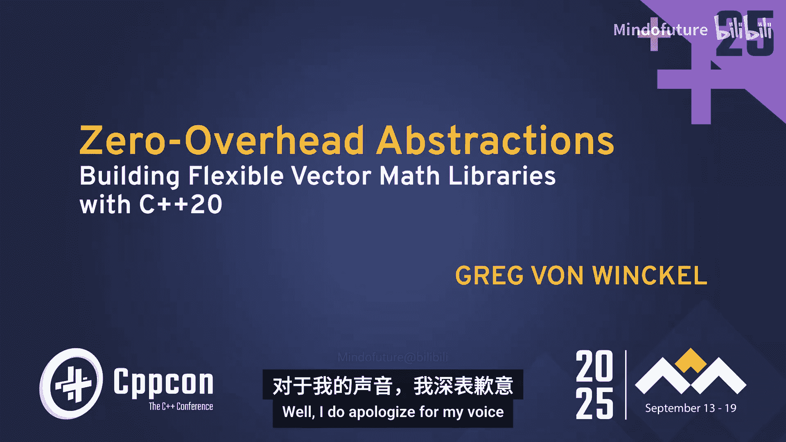
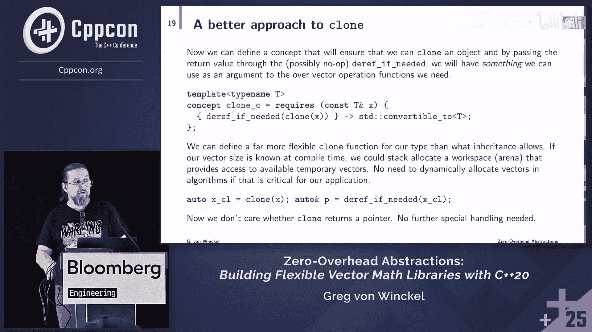

# 045：使用概念和定制点构建向量数学库





## 概述

在本教程中，我们将学习如何利用 C++20 的概念（Concepts）和定制点对象（Customization Point Objects, CPOs）来构建一个高性能、零开销且高度抽象的向量数学库。我们将探讨传统面向对象方法在科学计算中的局限性，并展示如何通过现代 C++ 特性实现更灵活、更高效的泛型编程。

## 章节 1：问题背景与动机

科学计算，特别是向量计算，在人工智能、机器学习、物理模拟、图形图像处理等领域无处不在。长期以来，我们的目标一直是编写能够复用的泛型代码。然而，在追求高性能和可移植性之间，以及追求抽象和具体实现之间，总是存在权衡。

传统方法，如面向对象编程（OOP），通过定义抽象基类和虚函数来提供接口。虽然这在某些情况下有效，但它可能导致代码臃肿、运行时开销，并且在需要高度优化（如在 GPU 上运行）或处理非标准类型时显得笨拙。

我们的模型问题是：编写一个执行数学运算的库，该库能够使用任意类型，但又不想让库依赖于这些类型的头文件。我们需要找到一种方法来实现这一点。

## 章节 2：核心算法与基本操作

让我们以共轭梯度法（Conjugate Gradient）作为核心算法示例。该算法需要以下基本数学操作：
*   向量加法
*   向量缩放（乘以标量）
*   向量内积
*   检查向量维度
*   获取用于中间计算的临时向量空间

上一节我们介绍了算法需求，本节中我们来看看如何将这些需求转化为代码接口。

以下是五个基本操作：
1.  **add_in_place**：将一个向量加到另一个向量上。
2.  **scale_in_place**：用一个标量缩放一个向量。
3.  **inner_product**：计算两个向量的内积。
4.  **dimension**：获取向量的维度。
5.  **clone**：获取一个可用于中间计算的向量副本或新空间。

在面向对象方法中，我们可能会定义一个抽象基类 `VectorBase`，包含这些操作的纯虚函数。但 `clone` 方法会带来问题：它通常返回一个 `std::unique_ptr<VectorBase>`，这强制了堆分配，可能不适用于栈分配或内存池场景。

## 章节 3：从 OOP 到概念（Concepts）

面向对象方法在需要频繁询问“这是什么类型”并得到不同答案时是合适的。但在科学计算中，容器的类型通常是固定的，我们更需要的是基于操作的泛型，而不是基于类型的多态。

C++20 的概念（Concepts）为此提供了完美的解决方案。我们可以为每个基本操作定义一个概念，而不是一个基类。

例如，`add_in_place` 的概念可以定义为：
```cpp
template <typename T>
concept add_in_place_c = requires(T& a, const T& b) {
    { add_in_place(a, b) } -> std::same_as<void>;
};
```
这表示对于类型 `T`，必须存在一个接受 `T&` 和 `const T&` 的 `add_in_place` 函数，且返回 `void`。

对于棘手的 `clone` 操作，我们可以引入一个辅助工具 `deref_if_needed`，它能够智能地处理指针和对象，使算法代码对两者都统一。
```cpp
template <typename T>
concept clone_c = requires(const T& x) {
    { deref_if_needed(clone(x)) } -> std::convertible_to<T>;
};
```
`inner_product` 和 `scale_in_place` 的概念则关联了向量元素类型（标量类型）：
```cpp
template <typename T>
concept inner_product_c = requires(const T& a, const T& b) {
    { inner_product(a, b) } -> real_scalar_c; // 返回类型满足 real_scalar_c 概念
};

template <typename T, typename Scalar>
concept scale_in_place_c = requires(T& v, const Scalar& alpha) {
    { scale_in_place(v, alpha) } -> std::same_as<void>;
};
```
最后，我们将这些概念组合成 `real_vector_c` 概念，它完整描述了一个“实数向量”类型所需满足的接口。
```cpp
template <typename T>
concept real_vector_c = add_in_place_c<T> &&
                        clone_c<T> &&
                        dimension_c<T> &&
                        inner_product_c<T> &&
                        requires(T& v, const element_type_t<T>& alpha) {
                            { scale_in_place(v, alpha) } -> std::same_as<void>;
                        };
```
现在，共轭梯度算法的签名可以清晰地用概念来约束：
```cpp
template <real_vector_c Vector, self_map_c<Vector> Matrix>
Vector conjugate_gradient(const Matrix& A, const Vector& b, const Vector& x0, ...);
```

## 章节 4：定制点对象（CPOs）与 ADL 的问题

虽然我们可以使用自由函数重载（依赖于实参依赖查找，ADL）来实现这些概念，但 ADL 可能导致命名空间污染、难以诊断的错误以及意外的重载决议。

定制点对象（CPO）是一种看起来和用起来都像函数，但实际上是函数对象的工具。关键优势在于，CPO 不会被 ADL 发现，从而避免了相关问题。

一个传统的 CPO（不使用 tag_invoke）示例如下：
```cpp
struct add_inplace_fn {
    template <typename T>
    void operator()(T& a, const T& b) const {
        // 依赖 ADL 找到具体的 add_in_place 实现
        add_in_place(a, b);
    }
};
inline constexpr add_inplace_fn add_in_place{};
```
用户在自己的命名空间中定义 `add_in_place` 自由函数，当通过 CPO `::add_in_place` 调用时，ADL 会找到用户定义的函数。但这种方法仍有命名冲突和错误信息不友好的问题。

## 章节 5：Tag Invoke 模式

`tag_invoke` 是一种更先进的 CPO 模式，它将所有定制派发集中到一个单一的 `tag_invoke` 函数上，该函数以一个代表 CPO 类型的标签作为第一个参数。

CPO 的定义变为：
```cpp
inline constexpr struct add_inplace_fn {
    template <typename T>
    void operator()(T& a, const T& b) const {
        return tag_invoke(*this, a, b);
    }
} add_in_place{};
```
用户的定制化则通过在其类型所在的命名空间中定义 `tag_invoke` 重载来实现：
```cpp
namespace mylib {
    struct Vector { ... };
    void tag_invoke(std::tag_t<add_inplace_fn>, Vector& a, const Vector& b) {
        // 具体的实现
    }
}
```
`tag_invoke` 模式统一了定制点，提供了更清晰的命名空间和潜在更好的编译错误信息。然而，其缺点是需要编写大量的样板代码。

## 章节 6：Tin Cup 工具介绍

为了减少 `tag_invoke` 的样板代码，作者开发了 **Tin Cup**（Tag Invoke Customization Point）工具。它是一个使用 Python（Jinja2 模板）的代码生成器，可以自动生成所有必需的 CPO 样板代码、概念检查以及增强的诊断信息。

使用 Tin Cup 非常简单。例如，在命令行中生成 `add_in_place` CPO：
```bash
python -m tincup add_in_place ‘$T&’ ‘const $T&’
```
其中 `$T` 表示泛型类型。Tin Cup 也提供了 Vim、VS Code 等编辑器的插件，可以更方便地生成代码。

Tin Cup 生成的代码包括：
*   CPO 函数对象（使用 `tag_invoke`）。
*   对应的概念（如 `add_in_place_c`）。
*   类型别名。
*   **增强的诊断**：当调用错误时，编译器会给出更友好的提示，例如“您可能忘记解引用指针”或“参数顺序错了”。

## 章节 7：Real Vector Framework 实践

基于 Tin Cup，作者创建了 **Real Vector Framework**。它生成了向量计算所需的所有核心 CPO（`add_in_place`, `clone`, `dimension`, `inner_product`, `scale_in_place`）以及一些高级操作（如元素级一元、二元函数应用，ReLU，Softmax）。

该框架还提供了内存管理工具（如托管内存区域），可以显著减少临时向量的分配/释放开销。框架内实现了一些算法，如共轭梯度法、L-BFGS 优化器等。

使用此框架，共轭梯度法的实现变得非常清晰，几乎与数学公式一一对应：
```cpp
template <real_vector_c Vector, self_map_c<Vector> Matrix>
Vector conjugate_gradient(const Matrix& A, const Vector& b, const Vector& x0, ...) {
    auto x = x0;
    auto r = b; add_in_place(r, -1, A(x)); // r = b - A*x
    auto p = clone(r); // p = r
    ...
    while (...) {
        auto Ap = clone(p); A(Ap, p); // Ap = A*p
        auto alpha = inner_product(r, r) / inner_product(p, Ap);
        scale_in_place(p, alpha); // p *= alpha
        add_in_place(x, p); // x += p
        scale_in_place(Ap, alpha); // Ap *= alpha
        add_in_place(r, -1, Ap); // r -= Ap
        ...
    }
    return x;
}
```
代码中 `clone` 后紧跟 `deref_if_needed` 的模式确保了代码对指针和非指针类型的统一处理。


## 章节 8：总结与展望



本节课中我们一起学习了如何利用 C++20 的概念和定制点对象来构建零开销抽象的向量数学库。

**核心要点总结：**
1.  **概念优于继承**：对于科学计算中的泛型算法，使用概念来约束接口比使用面向对象继承更灵活、更高效。
2.  **定制点对象**：使用 CPO（特别是 `tag_invoke` 模式）可以避免 ADL 的问题，并提供清晰的定制接口。
3.  **工具辅助**：像 **Tin Cup** 这样的工具可以自动生成 `tag_invoke` 所需的繁琐样板代码和增强的诊断信息，大大提高开发效率。
4.  **实践框架**：**Real Vector Framework** 展示了如何将这些理念应用于实际，构建出支持多种后端（如 `std::vector`、`std::span`、自定义类型）的高性能数学库。

未来的工作包括进一步完善 Real Vector Framework，添加更多算法，并探索将其与 C++26 可能引入的线性代数库、反射等功能相结合的可能性。最终目标是推动类似 `tag_invoke` 的定制机制成为更原生、更易用的语言特性。


通过本教程，希望你能够掌握使用现代 C++ 构建高性能泛型库的核心方法，并将其应用到自己的项目中。