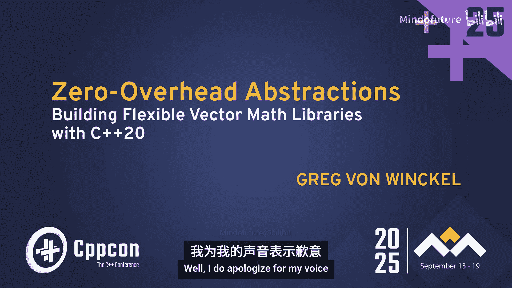
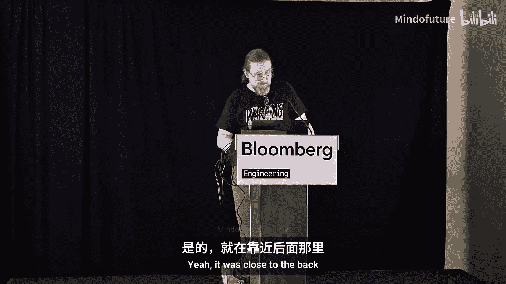
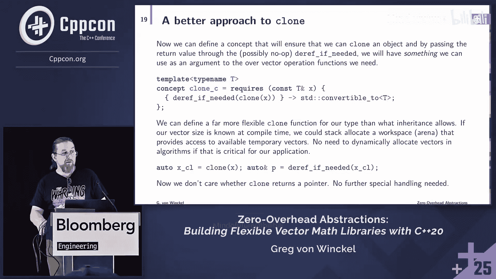

# 046：使用概念和定制点构建向量数学库





## 概述
在本教程中，我们将学习如何利用 C++ 的概念（Concepts）和定制点对象（Customization Point Objects, CPOs）来构建一个高性能、零开销且高度抽象的向量数学库。我们将从传统的面向对象方法遇到的挑战开始，逐步过渡到使用现代 C++ 特性（特别是 C++20 的概念和定制点）来实现更灵活、更高效的通用算法。

---

## 章节 1：问题背景与动机

科学计算，特别是向量计算，在人工智能、机器学习、物理模拟、图形图像处理等领域无处不在。长期以来，我们的目标一直是编写能够处理任意向量类型的通用代码，以实现代码复用。然而，尽管这个承诺已经存在了几十年，但现实往往不尽如人意。

传统的面向对象编程（OOP）方法，通过定义抽象基类和虚函数来提供接口，在某些场景下是有效的。例如，它可以封装数据，避免在应用代码和优化器之间复制数据。但是，当我们需要更灵活的操作（如在 GPU 上运行）或避免虚函数调用的开销时，OOP 方法就会变得笨拙和低效。

我们的模型问题是：**如何编写一个数学运算库，使其能够使用任意类型，同时又不需要依赖该类型的头文件？**

---

## 章节 2：传统方法的局限性

上一节我们介绍了构建通用向量库的目标。本节中，我们来看看几种传统实现方法及其局限性。

以下是几种常见的传统方法：

1.  **CRTP（奇异递归模板模式）**：可以绕过虚函数调用，但缺乏真正的灵活性，无法方便地用于概念（Concepts）。
2.  **表达式模板**：被 Eigen 或 Armadillo 等库使用，可以实现惰性求值和优化。但编写自己的表达式模板代码通常会导致极其冗长（超过 10 万行）的编译器错误，难以调试。
3.  **特征类（Traits）、函数模板、策略模式和类型擦除**：这些方法各有优劣，但通常无法实现“为所有满足算法所需操作的类型定义算法”这一理想目标。

以**共轭梯度法**为例，其数学算法需要以下基本操作：
*   向量加法
*   向量缩放（乘以标量）
*   向量内积
*   获取向量维度
*   获取临时向量（克隆）

如果使用面向对象方法，我们需要定义一个抽象基类 `Vector`，包含对应的纯虚函数。这会立即带来问题：
*   `clone()` 方法通常返回一个 `std::unique_ptr<Vector>`，这限制了栈内存分配或内存池的使用。
*   为了算法方便，我们可能想添加像 `axby`（线性组合）这样的复合操作到基类中，但这会导致基类不断膨胀，成为一个“上帝类”，难以维护。

我们真正需要的是：**一种方式，能够声明“这个算法适用于所有实现了算法所需操作的类型”**。

---

## 章节 3：使用概念（Concepts）定义接口

上一节我们看到了面向对象方法的局限。本节中，我们将使用 C++20 的概念来定义向量接口，这是一种编译期契约。

我们可以为每个基本操作定义一个概念。核心概念是 `RealVector`。

**向量加法概念**
```cpp
template <typename T>
concept AddInPlace_c = requires(T& a, const T& b) {
    { add_in_place(a, b) } -> std::same_as<void>;
};
```
这个概念要求：给定类型 `T` 的可变引用和常量引用，必须存在一个名为 `add_in_place` 的函数，它接受这两个参数并返回 `void`。

**克隆概念**
克隆的挑战在于：我们不知道它是否动态分配内存。解决方案是使用一个 `deref_if_needed` 包装器。
```cpp
template <typename T>
concept Cloneable_c = requires(const T& x) {
    { clone(x) } -> std::same_as<decltype(deref_if_needed(clone(x)))>;
    requires std::convertible_to<decltype(deref_if_needed(clone(x))), T>;
};
```
这个概念确保：对对象 `x` 调用 `clone` 后，再应用 `deref_if_needed`，得到的结果可以转换回类型 `T`。这样，无论 `clone` 返回的是指针还是引用，算法代码都能统一处理。

**维度概念**
```cpp
template <typename T>
concept Dimension_c = requires(const T& x) {
    { dimension(x) } -> std::integral;
};
using dimension_type = decltype(dimension(std::declval<T>()));
```

**内积概念**
```cpp
template <typename T>
concept InnerProduct_c = requires(const T& a, const T& b) {
    { inner_product(a, b) } -> RealScalar_c;
};
using element_type = decltype(inner_product(std::declval<T>(), std::declval<T>()));
```

**缩放概念**
```cpp
template <typename T>
concept ScaleInPlace_c = requires(T& a, const element_type<T>& alpha) {
    { scale_in_place(a, alpha) } -> std::same_as<void>;
};
```

**实向量概念**
最后，我们将所有概念组合起来，定义 `RealVector` 概念：
```cpp
template <typename T>
concept RealVector_c = AddInPlace_c<T> &&
                       Cloneable_c<T> &&
                       Dimension_c<T> &&
                       InnerProduct_c<T> &&
                       ScaleInPlace_c<T> &&
                       requires (T& v, const element_type<T>& a) {
                           // 确保内积返回的类型可用于缩放
                           { scale_in_place(v, a) };
                       };
```
现在，我们可以使用 `RealVector_c` 作为约束来编写通用算法，如共轭梯度法。

---

## 章节 4：定制点对象（CPOs）与 ADL 的问题

上一节我们用概念定义了接口。本节中，我们来看看如何实现这些接口函数，并解释为什么简单的自由函数重载可能不是最佳选择，从而引出定制点对象。

实现这些接口函数最直接的想法是使用**自由函数**和**参数依赖查找（ADL）**。ADL 允许编译器在函数调用未限定时，在实参类型所属的命名空间中查找函数。

**ADL 示例**
```cpp
namespace mylib {
    struct Vector { ... };
    void add_in_place(Vector&, const Vector&); // ADL 会找到这个函数
}
mylib::Vector a, b;
add_in_place(a, b); // 调用 mylib::add_in_place
```
然而，ADL 有其问题：
1.  **名称冲突**：`add_in_place` 这类名称不唯一，在大型项目中容易冲突。
2.  **查找规则复杂**：ADL 的查找规则（涉及关联命名空间）可能令人困惑，导致意外地找到或找不到函数。
3.  **错误信息模糊**：如果重载决议失败，编译器错误可能不会清晰地指出问题所在。

更好的解决方案是使用**定制点对象（CPO）**。CPO 是一个行为像函数但不是函数的对象（通常是一个函数对象）。关键优势在于：**CPO 不会参与 ADL**。

**传统 CPO 示例**
```cpp
struct add_in_place_fn {
    template <typename T>
    void operator()(T& a, const T& b) const {
        // 使用 ADL 调用真正的实现
        add_in_place(a, b);
    }
};
inline constexpr add_in_place_fn add_in_place{};
```
这里，全局的 `add_in_place` 是一个常量对象。当调用 `add_in_place(a, b)` 时，它调用其 `operator()`，然后在 `operator()` 内部使用 ADL 来查找具体的 `add_in_place` 函数。这隔离了命名空间，但依然依赖 ADL 和可能的重载冲突。

---

## 章节 5：Tag Invoke 模式与 TinCuP 工具

上一节介绍了基本的 CPO。本节中，我们将探讨一种更强大、更规范的 CPO 实现模式——Tag Invoke，并介绍一个能自动生成相关代码的工具。

**Tag Invoke** 模式将所有定制点的分发集中到单个函数 `tag_invoke` 上。CPO 对象本身只携带一个“标签”，用于选择正确的 `tag_invoke` 重载。

**Tag Invoke CPO 示例**
```cpp
// 1. 定义 CPO 标签类型
struct add_in_place_cpo {
    template <typename T>
    void operator()(T& a, const T& b) const {
        return tag_invoke(*this, a, b);
    }
};
inline constexpr add_in_place_cpo add_in_place{};

// 2. 用户在自定义类型的命名空间中提供 tag_invoke 重载
namespace mylib {
    struct Vector { ... };
    void tag_invoke(add_in_place_cpo, Vector& a, const Vector& b) {
        // ... 具体实现
    }
}
```
这种模式的优点：
*   **命名空间清洁**：只有一个 `tag_invoke` 扩展点。
*   **更好的诊断**：更容易提供清晰的编译错误。
*   **零开销**：调用是直接静态分派的。

然而，为每个 CPO 手动编写 Tag Invoke 样板代码非常繁琐。为此，作者创建了工具 **TinCuP**。

**TinCuP** 是一个使用 Python 和 Jinja 模板的代码生成器。它可以自动生成所有 Tag Invoke 所需的样板代码。

**使用 TinCuP**
```bash
# 通过命令行生成 add_in_place 的 CPO 代码
tin cup -j add_in_place ‘$& a, const $& b‘
```
其中 `$` 表示通用类型占位符。TinCuP 会生成包含 CPO 类、概念检查、类型别名以及**增强诊断功能**的完整代码。例如，如果你错误地传递了一个指针，编译器错误会提示“你可能忘记解引用参数了”。

TinCuP 还支持高级功能，如为 CPO 指定额外参数（用于编译时或运行时策略选择）。

---

## 章节 6：Real Vector 框架与算法实现

上一节我们有了强大的工具来定义 CPO。本节中，我们将看到如何利用这些构建一个完整的“实向量框架”并实现通用算法。

基于 TinCuP，作者创建了 **Real Vector Framework**。它生成了五个核心 CPO：`add_in_place`, `clone`, `dimension`, `inner_product`, `scale_in_place`。此外，还提供了更多高级 CPO：
*   `unary`：对向量逐元素应用一元函数。
*   `variadic`：对多个向量逐元素应用多元函数。
*   `relu`, `softmax`：AI 中常用的激活函数。
*   内存管理工具：提供托管内存区域（arena），避免频繁分配/释放，可带来成百上千倍的性能提升。

该框架还实现了一些标准算法：
*   共轭梯度法
*   有限内存 BFGS 优化
*   线搜索
*   投影梯度下降法
*   截断共轭梯度信赖域法

**通用算法的威力**
使用概念和 CPO 的最大优势是真正的通用性。例如，任何满足 `std::ranges::range` 概念的类型（如 `std::vector`, `std::array`）都可以自动获得所有操作的默认实现，而无需用户编写任何代码。




**共轭梯度法的实现对比**
使用 `RealVector_c` 概念和 CPO 后，共轭梯度法的实现代码非常清晰，几乎与数学公式一一对应：
```cpp
template <RealVector_c Vector, SelfMap_c Mapping>
void conjugate_gradient(Vector& x, const Mapping& A, const Vector& b, ...) {
    auto r = deref_if_needed(clone(b)); // 克隆 b 并确保得到引用
    // ... 算法逻辑，直接使用 scale_in_place, add_in_place, inner_product 等 CPO
    // 代码看起来就像数学：scale_in_place(p, beta); add_in_place(p, r);
}
```
代码中唯一的“噪音”是 `deref_if_needed(clone(...))` 这个模式，它确保了临时向量资源的正确管理，但让算法逻辑保持了数学上的简洁。

---



## 章节 7：总结与未来展望

本节课中，我们一起学习了如何利用现代 C++ 的特性构建零开销抽象的向量数学库。

**核心要点总结：**
1.  **从 OOP 到概念**：使用 C++20 的概念（`concept`）来定义编译期接口契约，替代运行时的虚函数接口。
2.  **从 ADL 到 CPO**：使用定制点对象来提供可定制的函数接口，避免了自由函数重载和 ADL 带来的命名冲突和复杂性问题。
3.  **Tag Invoke 模式**：一种规范化的 CPO 实现模式，集中扩展点，改善错误诊断。
4.  **工具辅助**：利用像 TinCuP 这样的代码生成器，可以自动生成繁琐的 Tag Invoke 样板代码，并集成增强的编译期诊断。
5.  **实现通用算法**：结合概念和 CPO，可以编写出真正通用的、高性能的算法，代码既清晰（贴近数学）又高效（零开销抽象）。

**未来工作方向：**
1.  扩展 Real Vector Framework，加入更多算法。
2.  将现有的 Rapid 优化库从继承架构重构为基于概念和 CPO 的架构。
3.  探索与 C++26 的 `std::linalg`（线性代数）和反射特性的集成。
4.  尝试开发一个 Clang 编译器扩展，将 CPO/Tag Invoke 模式作为原生语言特性进行概念验证，并推动其进入未来的 C++ 标准（如 C++29）。


通过这种方法，我们能够在保持代码抽象性和可复用性的同时，不牺牲任何运行时性能，真正实现“零开销抽象”的承诺。