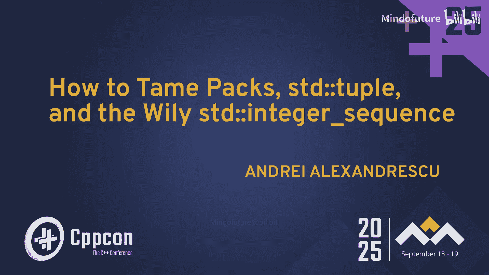
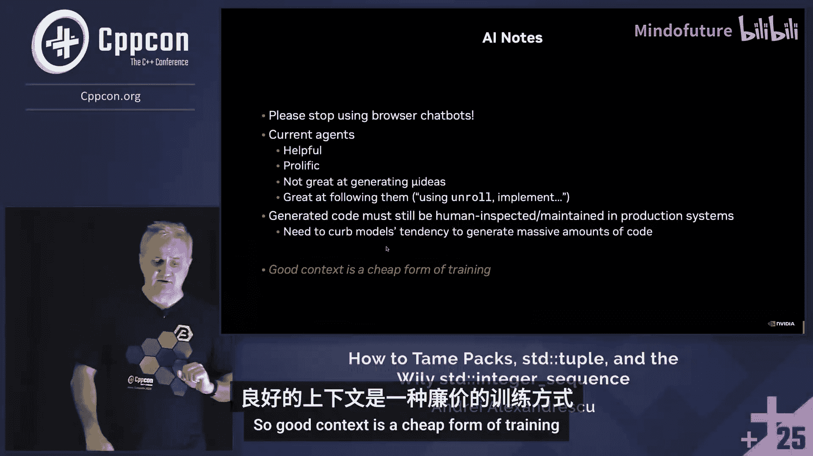
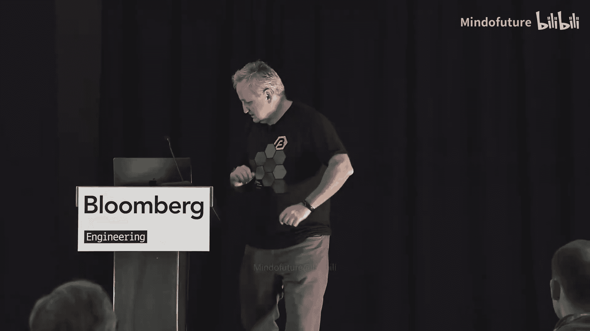
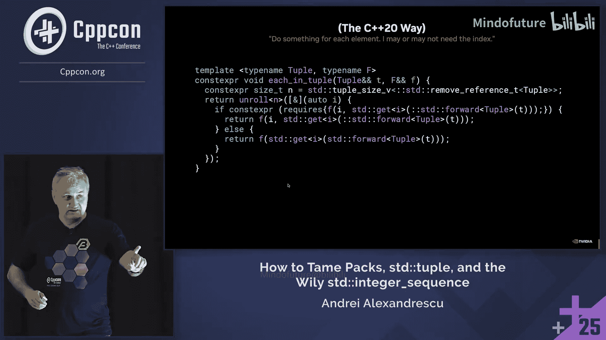
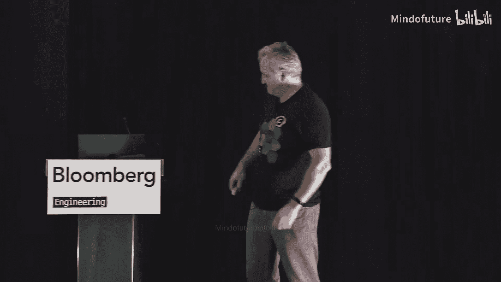

# 047：如何驯服参数包、std::tuple 和狡猾的 std::integer_sequence





## 概述

在本节课中，我们将学习如何高效地处理 C++ 中的参数包（parameter packs）和 `std::tuple`，并探索如何避免直接使用复杂的 `std::integer_sequence`。我们将介绍一系列简洁、实用的元编程技巧，这些技巧易于理解，并能显著提升代码的简洁性和性能。这些技巧对于编写科学计算（如张量运算）和 AI 相关代码尤其有用。

## 从传统方法到更简洁的方案

上一节我们概述了本课程的目标。本节中，我们来看看处理参数包和元组的传统方法及其局限性。

通常，为了遍历一个 `std::tuple`，我们需要使用 `std::integer_sequence` 和两个函数：一个主函数和一个实现细节函数。这种方法代码冗长且不直观。

```cpp
namespace detail {
    template <typename Tuple, typename F, std::size_t... Is>
    void for_each_impl(Tuple&& t, F&& f, std::index_sequence<Is...>) {
        (f(std::get<Is>(std::forward<Tuple>(t))), ...);
    }
}

template <typename Tuple, typename F>
void for_each(Tuple&& t, F&& f) {
    detail::for_each_impl(
        std::forward<Tuple>(t),
        std::forward<F>(f),
        std::make_index_sequence<std::tuple_size_v<std::remove_reference_t<Tuple>>>{}
    );
}
```

然而，从 C++17 开始，我们可以利用折叠表达式（fold expressions）和一个小技巧来简化。这个技巧使用一个默认参数来生成索引序列。

```cpp
template <typename Tuple, typename F, std::size_t... Is>
void for_each(Tuple&& t, F&& f, std::index_sequence<Is...> = {}) {
    if constexpr (sizeof...(Is) != std::tuple_size_v<std::remove_reference_t<Tuple>>) {
        // 递归调用自身，生成正确大小的索引序列
        for_each(std::forward<Tuple>(t), std::forward<F>(f),
                 std::make_index_sequence<std::tuple_size_v<std::remove_reference_t<Tuple>>>{});
    } else {
        // 使用折叠表达式展开
        (f(std::get<Is>(std::forward<Tuple>(t))), ...);
    }
}
```

这种方法避免了冗长的辅助函数，但仍有改进空间。我们的目标是找到更优雅、更强大的解决方案。

## 利用 C++20 的 Lambda 与模板进行展开

上一节我们看到了传统方法的繁琐。本节中，我们来看看如何利用 C++20 的特性进行更优雅的编译时循环展开。

核心思想是创建一个 `unroll` 函数，它接受一个次数 `N` 和一个 Lambda。这个 Lambda 会收到一个编译时常量索引。为了实现这一点，我们使用 `std::integral_constant`。

```cpp
template <std::size_t N, typename F>
void unroll(F f) {
    [&f] <std::size_t... Is> (std::index_sequence<Is...>) {
        (f(std::integral_constant<std::size_t, Is>{}), ...);
    }(std::make_index_sequence<N>{});
}
```

这里的关键在于 Lambda 的参数 `auto ic`。当传入 `std::integral_constant<std::size_t, 0>{}` 等对象时，`ic` 在编译时和运行时都可以隐式转换为 `std::size_t` 值，这为我们提供了极大的灵活性。

## 实现可提前终止的迭代

上一节我们实现了基础的展开循环。本节中，我们为其增加一个实用功能：根据 Lambda 的返回值决定是否提前终止迭代。

我们希望 Lambda 可以返回 `bool` 类型。如果返回 `false`，则停止后续迭代；如果返回 `void` 或 `true`，则继续。这可以通过编译时内省（introspection）来实现。

```cpp
template <std::size_t N, typename F>
void unroll(F f) {
    if constexpr (std::is_same_v<std::invoke_result_t<F, std::integral_constant<std::size_t, 0>>, void>) {
        // void 返回类型：使用逗号运算符展开所有
        [&f] <std::size_t... Is> (std::index_sequence<Is...>) {
            (f(std::integral_constant<std::size_t, Is>{}), ...);
        }(std::make_index_sequence<N>{});
    } else {
        // bool 返回类型：使用逻辑与运算符，支持短路求值
        [&f] <std::size_t... Is> (std::index_sequence<Is...>) {
            (f(std::integral_constant<std::size_t, Is>{}) && ...);
        }(std::make_index_sequence<N>{});
    }
}
```

这样，我们就拥有了一个功能强大的通用展开工具。

## 创建和过滤元组

上一节我们专注于迭代。本节中，我们来看看如何动态地创建和过滤 `std::tuple`。

直接从一个参数包过滤并返回另一个参数包在 C++ 中是不可能的。一个巧妙的解决方案是引入一个“空位标记”类型，在构造元组时过滤掉它。

我们首先定义一个标记类型 `null_tuple_field`。

```cpp
struct null_tuple_field_t {};
inline constexpr null_tuple_field_t null_tuple_field;
```

然后，我们可以创建一个 `make_tuple_filtering` 函数，它会在构造过程中忽略所有 `null_tuple_field_t` 类型的参数。

```cpp
template <typename... Ts>
auto make_tuple_filtering(Ts&&... args) {
    return [&args...] <std::size_t... Is> (std::index_sequence<Is...>) {
        // 过滤逻辑：如果参数是 null_tuple_field_t 类型，则忽略
        return std::make_tuple(
            [](auto&& x) -> decltype(auto) {
                using ArgType = decltype(x);
                if constexpr (std::is_convertible_v<ArgType, const null_tuple_field_t&>) {
                    // 返回一个占位符，但实际会被忽略？需要更精细的处理。
                    // 更佳实践：在调用 std::make_tuple 前过滤序列。
                    // 此处为概念演示。
                } else {
                    return std::forward<decltype(x)>(x);
                }
            }(std::get<Is>(std::forward_as_tuple(std::forward<Ts>(args)...))) ...
        );
    }(std::index_sequence_for<Ts...>{});
}
```

实际上，更简洁的方式是在展开时直接条件性地构造元组元素。`null_tuple_field_t` 模式体现了“空对象模式”（Null Object Pattern），在 C++ 中，类似的概念还有 `std::monostate`、`std::nullopt_t` 等。

## 灵活的元组遍历：Each In Tuple

上一节我们处理了元组的创建。本节中，我们来实现一个更灵活的元组遍历函数 `each_in_tuple`，它能够智能地判断 Lambda 需要一个参数（仅元素）还是两个参数（索引和元素）。

这需要用到 C++20 的 `requires` 表达式来进行编译时检查。

```cpp
template <typename Tuple, typename F>
void each_in_tuple(Tuple&& t, F f) {
    [&t, &f] <std::size_t... Is> (std::index_sequence<Is...>) {
        // 检查 f 是否能以 (索引， 元素) 的形式调用
        if constexpr (requires { f(std::integral_constant<std::size_t, 0>{}, std::get<0>(t)); }) {
            (f(std::integral_constant<std::size_t, Is>{}, std::get<Is>(t)), ...);
        } else {
            // 否则，只传递元素
            (f(std::get<Is>(t)), ...);
        }
    }(std::make_index_sequence<std::tuple_size_v<std::remove_reference_t<Tuple>>>{});
}
```

这个函数极大地简化了需要根据索引进行不同操作的元组处理代码。

## 部分循环展开的挑战与优化

上一节我们处理了完整的展开。本节中，我们面对一个更复杂的场景：部分循环展开（Partial Unrolling）。这在处理剩余元素（tail elements）时非常有用，例如在 GPU 编程或高性能计算中。

简单的部分展开可能会为每个剩余元素生成一个条件检查，如果剩余元素数量较多，会导致性能下降。一个更好的策略是使用二分查找（bisection）逻辑来减少条件分支。

初始的二分查找实现可能如下：

```cpp
template <std::size_t N, typename F>
void unroll_leftovers(std::size_t count, F f) {
    if constexpr (N >= 2) {
        constexpr std::size_t Half = N / 2;
        if (count > Half) {
            unroll<Half>(f); // 展开上半部分
            unroll_leftovers<Half>(count - Half, f);
        } else {
            unroll_leftovers<Half>(count, f);
        }
    } else if constexpr (N == 1) {
        if (count > 0) f(std::integral_constant<std::size_t, 0>{});
    }
}
```

然而，这种方法会导致编译器生成大量重复的基本块（basic blocks），因为 `if-else` 的两边代码都会被实例化，造成代码膨胀。

优化的关键在于重构代码结构，将公共部分提取出来，减少重复实例化。

```cpp
template <std::size_t N, typename F>
void unroll_leftovers_opt(std::size_t count, F f) {
    if constexpr (N >= 2) {
        constexpr std::size_t Half = N / 2;
        // 公共部分：处理可能存在的“完整块”
        if (count > Half) {
            unroll<Half>(f);
            count -= Half;
        }
        // 递归处理剩余部分
        unroll_leftovers_opt<Half>(count, f);
    } else if constexpr (N == 1) {
        if (count > 0) f(std::integral_constant<std::size_t, 0>{});
    }
}
```

这种优化后的结构能显著减少生成的代码量，同时保持逻辑的正确性。



## 总结与关于 AI 编程助手的思考

本节课中，我们一起学习了如何驯服 C++ 中的参数包和 `std::tuple`。我们通过一系列微技巧（micro-ideas）构建了强大的工具：

1.  利用折叠表达式和 Lambda 实现简洁的编译时展开。
2.  通过返回类型内省，支持可提前终止的迭代。
3.  引入“空位标记”类型来过滤元组。
4.  使用 `requires` 表达式实现灵活的元组遍历。
5.  优化部分循环展开，以减少代码生成和提高性能。



这些技巧的核心在于**封装复杂性**。我们应该将 `std::integer_sequence` 等繁琐的细节隐藏在简洁的库函数之后，而不是在业务代码中直接与之搏斗。



最后，关于 AI 编程助手（如 Cursor、Copilot），当前的它们更像是“打了鸡血的实习生”，非常擅长执行指令、复用现有模式，但在创造新的、高效的编程范式方面能力有限。因此，**扎实的编程基础知识和深刻的洞察力变得比以往更加重要**。你需要知道“问什么”和“如何评估结果”。将这些微技巧教给你的 AI 助手，它们就能成为你得力的效率倍增器。记住，好的上下文提示（Context）是一种廉价的“训练”方式。

**停止仅仅使用聊天机器人，开始使用智能体（Agents），并学会如何有效地引导它们。**




---
*教程内容整理自 Andrei Alexandrescu 在 CppCon 2025 的演讲《如何驯服包、std::tuple 和狡猾的 std::integer_sequence》。*