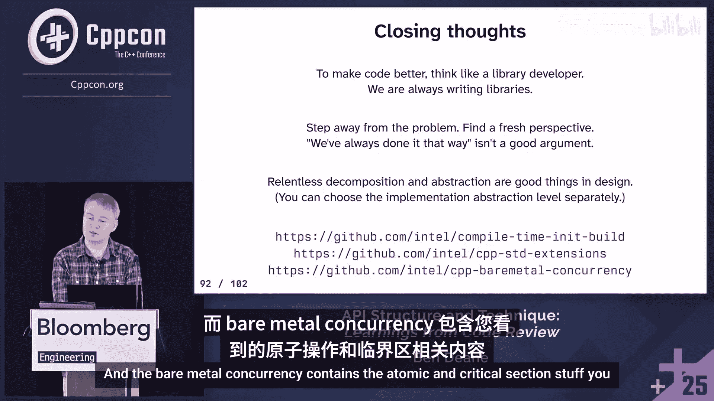

# 048：API 结构与技术

在本节课中，我们将学习如何从 C++ 代码审查中提炼经验，构建更安全、更易读、更符合现代 C++ 范式的 API 和技术。我们将从嵌入式开发的常见模式入手，探讨如何通过提升抽象层次来改进代码。

## 概述

大家好。本次演讲内容较长，幻灯片很多。过程中请随时提问。演讲时长取决于互动情况，因此可能没有专门的问答时间。如果您对特定幻灯片有疑问，请随时提出。

幻灯片上的所有代码都是真实的，您可以自由使用。当然，代码在转换为幻灯片时可能存在错误，并且为了简洁，我移除了 `[[nodiscard]]` 等属性。如果您发现错误，请指正。

对于那些不认识我的人，我曾在游戏行业工作，90年代中期开始使用 C++，之后在金融行业工作，现在在英特尔与 Michael Case 和 Luke Valenti 以及一个优秀的团队共事。

本次演讲讲述的是我从审查团队代码、学习并找到简化他们工作的方法中所获得的故事。我始终追求编写优秀的代码，但我们必须承认，所有代码都有改进空间。作为人类，我们擅长复制模式。当我们作为领域专家工作时，常常意识不到代码的缺陷，因为它“能用”，我们习惯了它，看不到痛点。从自己的领域中抽身，以更高层次的视角看待问题是非常困难的。

很多时候，当我看到人们试图做什么时，我会识别模式、发现用例，并找到提升抽象层次的方法。人们的意图是正确的，但他们有时没有意识到有更简单的方法，或者这些方法可能还不存在，而我的工作就是创造它们。在某种程度上，我对嵌入式领域相对陌生反而有所帮助，因为我没有背负大量关于“如何做这件事”的历史知识。

我目前的工作环境是嵌入式、裸机、无操作系统的，非常底层，但它仍然是 C++20，仍然是现代 C++。我的团队大多数成员在五年前主要写 C 语言，他们被 Luke、Michael 和我投入到这个充满现代 C++ 习语和模板元编程的代码库中，并且进步非常快，这值得高度赞扬。

在固件开发中，硬件规范常常渗透到固件中，导致过度具体化的问题。我们需要退一步思考真正要解决的问题，并进行适当的抽象。固件也是软件，即使我们不常使用这个词。

您可能认为您知道在嵌入式系统中编写 C++ 意味着什么。但事实是，大多数在网络上找到的建议和代码并没有跟上 C++ 的发展步伐，特别是 C++20 及以后。我甚至不是在讨论禁止异常或运行时分配这些仍然合理的选择。这里的差距在于，例如，您不想在运行时使用 `std::string`，但在编译时使用它完全没问题。像 `libfmt` 这样的库，其接口涉及字符串和 `<format>` 头文件，可以进行编译时格式化，永远不会触及运行时，非常适合嵌入式使用。但如果您的嵌入式工具链没有提供 `<format>` 头文件，您就无法编译，但您仍然可以使用它。因此，我们基本上在编译时使用所有的 STL。这就是我们的思维方式。

我们希望摆脱魔数、魔幻操作和必须考虑状态的情况。我们想要这种最佳的抽象感。在编程中，我们倾向于接受魔数是不好的，会引入命名常量。但我们对于魔幻操作的警惕性较低，仍然很乐意进行移位、加法、掩码等操作，因为规范就是这么说的。硬件规范渗透到了实际代码中，但通常有更好的方式来表达我们的意图。本次演讲就是这些更好方式的集合。

## 从比特开始

让我们从最基础的东西开始，字面意义上的“小”东西，因为我们经常需要处理比特。嵌入式代码充满了位掩码和位计算。顺便问一下，在座有多少人从事某种嵌入式开发？根据一些估计，嵌入式开发约占全球 C++ 工程师的三分之一。

### 计算字大小

这是一个非常常见的事情。`uint32_t` 是我们硬件中普遍使用的词汇类型，因此是我们各处使用的通用数据类型。您有一些字节，想要计算使用了多少个 32 位字。谁写过这样的代码？很多人，甚至最近还有人写。第一种写法很常见，幸运的话，人们会写第二种。这是一件简单的事情，触手可及，正好能计算您当前需要的东西。使用一些魔数有关系吗？这完全可读，对吧？也许是的。

但我希望有一个更通用的解决方案。以下是我目前的解决方案。它可能更可读，但在某种意义上可读性可能稍差。但它表明我们有 `T` 类型，有 `n` 个，我们想知道使用的尺寸。现在这在所有情况下都是正确的，并且是可靠的。如果您在编译时知道这些，还可以使用便利的别名，例如 `size8_t` 代表 `size_t<uint8_t>`。

如果您在编译时知道，还可以使用用户定义字面量，并且可以非常简洁。例如，可以说我有 48 个 8 位大小的东西，我想转换为 32 位大小的东西。我使用 `_z` 作为尺寸 UDL，因为这看起来很合理，并且可用。您可能会想，乍一看，这不是我们习惯的，但我认为它相当可读。它很简洁。我们希望简单的操作是简洁的。如果有人不同意，可以随时与我争论。

### 位操作

除了计算字大小，我们还进行大量的位操作。现在是 2025 年，我仍然看到大多数与硬件交互的示例代码在进行手动的位移位和掩码操作。谁的代码库里有这种东西？我们很多人都有。我也一样，但我在努力改进。我们认为它容易阅读是因为我们习惯了，但我要说，它通常并不比拥有良好抽象时更容易阅读，而且通常也不安全，除非我们加上 `static_cast`，我们稍后会看到。

这通常是我们创建位掩码的方式。我们有一个字段，范围是从第 7 位到第 3 位（包含）。我们只是创建最高有效位的掩码，创建最低有效位的掩码，然后用一个减去另一个，得到这些位之间的掩码。这还可以。如果您可以忽略整数提升。

但它会变得棘手，因为 `x` 的类型是什么？我们正在减去两个 `char`。是的，它是 `int`。显然，是的，显然，它被提升了，而且是 `signed int`。我们主要使用无符号类型，即使这些是 `uint8_t`，它仍然是 `int`。

当然，人们希望安全。所以，他们会做一些奇怪的事情，这是我们看到的另一件事。因为我们需要计算涉及最高位的某些东西，我们可能会看到这样的代码。每个人都知道这有什么问题。线索在幻灯片的标题中。是的，这是未定义行为，因为我们正在按类型的宽度（这里是 32）进行移位。当这些问题隐藏在数十万行的代码库中时，它们就不那么明显了。

如果我们想要一个位掩码，我们直接请求一个，怎么样？我们可以使用模板参数中的编译时值，或者使用常规参数中的运行时值，并指定我们想要返回的类型，比如 `uint8_t`。我认为这样更好，代码更易读。这在所有情况下都是安全的。实际上，安全性取决于底层是否有运行时检查。当然，我们有测试，并且使用 UBSan 运行测试，这也有帮助。

### 位打包与解包

除了创建掩码，很多时候我们进行位打包和解包，并做这样的事情。如果我再次要求每个人举手，我相信房间里一半的人会举手表示他们有类似的代码。我当然看到很多这样的代码。实际上，我看到的不是这样的代码，我看到的是这样的代码。这对任何人来说都熟悉吗？当然，亲爱的听众，您知道在这个例子中并非所有这些转换都是必要的，因为您在这里参加 CppCon，您是一位经验丰富、精通现代 C++ 的专家。但在现实世界中，代码的作者和审阅者只希望它能工作，他们不想每次都要考虑发生了哪些整数提升，知道我的移位操作。像我这样的人出现，打开警告和 lint 工具，他们希望它安静下来，这样他们就知道代码没问题。所以他们就直接加上转换。我不责怪他们，但我确实希望保持这些 lint 和警告开启，并希望让他们的生活更轻松。

所以当他们进行这样的位打包时，我希望他们就这样做位打包。同样，请求我们想要的类型，将高位和低位字节（或本例中的高位和低位字）放进去。我们也可以进行位解包，同样，请求我们想要那两个高位和低位值的类型。我们可以为这些编写漂亮的重载集，例如，您可以将四个字节打包成一个 32 位字，甚至将八个字节打包成一个 64 位字，然后您就有了这个抽象，它就能工作。当然，就像这样，它适用于您可能需要的所有大小。这只是一种更好的表达方式，我真的不知道还有什么其他方式能让它更清晰。

这是针对 8 位边界的打包和解包。但有时我们需要处理非 8 位边界。有时您可能有一个包含一些字段的寄存器，您可能只想将东西解构到这些字段中。我们也可以做到。我们称之为 `bit_struct`，它的工作方式与位解包完全相同，您指定边界在哪里。当然，如果您想要三个项目，就指定两个边界。然后您就能得到正确的结果。这里把它们放在 8 位边界上，这样您很容易看到发生了什么，而不必在脑子里计算比特位，但它们在任何地方都有效。

更进一步，我们最终会得到完整的字段定义和完整的消息定义，这些定义可以覆盖在数组上，并可以按需读取字段，看起来像这样，但这真的进入了兔子洞，这是另一个话题的内容。

关于字节序的问题？是的，字节序呢？您注意到了。当我们进行位打包时，这是大端序。因为我们说的是 1, 2, 3, 4, 5, 6, 7, 8。在某种意义上，是从高到低。在这张幻灯片上，是从低到高。这完全正确。这是一个当前的设计选择，可能会改变。这样设计是为了在某种意义上最不令人惊讶。您肯定希望解包顺序与打包顺序相同，并且希望打包顺序与您在代码中书写数字的顺序相同。这就是这次这样决定的原因。感谢您的问题。为录音说明一下，问题是关于字节序的。但在这种情况下，因为我们在模板参数中从 0 开始计数比特位，所以在这个意义上，您可能会说它是小端序。这些设计在一定程度上是为了最小化意外。它们总是可以改变的，如果我在代码审查中看到人们因此遇到问题。但目前，它们就是这样。再次感谢您的问题。

好的，我们已经看到了一些简单的东西。本次演讲的重点在于，这些简单的构造具有很大的实用性，它们可以取代那些人们认为易于阅读但实际只是因为历史习惯而显得容易的既定模式。

## 枚举位标志

这是另一个常见模式。谁这样做过？您想要枚举位标志，这是一件事。您定义一个具有 2 的幂次方值的枚举或枚举类，然后重载一些位运算符。也许您经历了一系列麻烦，可能使用了宏。您说服自己拥有了类型安全。您肯定对 ADL 形成了自己的看法。我认为也许我们一直做错了，有很多演讲和库帮助我们做错，甚至博客文章也是如此。

我的意思是，每个人都觉得这个表达式没问题吗？看起来没问题。好的，这个我也觉得没问题。这个呢？当然，没问题。如果丹在房间里，如果您是化学家，您应该觉得这个没问题。我所做的只是重新标记。硫是 16，氮是 7，钒是 23。您觉得这个没问题吗？同样的事情。我只是重新标记了。如果您是宝可梦训练师，这完全说得通。但不知何故，我们觉得这个没问题。甚至没有编号为 A 或 B 的宝可梦。X 甚至不是枚举的可命名成员，空间不是密集的。这是类型安全吗？我不知道。我认为我们一直混淆了标签和数字。

在底层，寄存器值是一个 `uint32_t`。我们真正想要的是命名这些比特位。但这与假装这些名称就是数值是分开的。那么，为什么我们不使用 `std::bitset` 呢？我认为 `std::bitset` 只是没有提供这种接口，这是唯一的原因。但如果我们想将寄存器视为一个位集，我看到有人在点头，您也这样做过吗？是的，这有点像，我不知道为什么人们不这样做，实际上有些人正在这样做，他们可能有同样的想法。

所以，让我们只使用我们想要的接口。我们想要命名比特位。所以让我们只在枚举中命名比特位。让我们基于该枚举类型创建一个位集。这不是标准的 `std::bitset`。我们会告诉它设置位 A 和 B。然后我们可以用 B 索引它，或者我们可以要求它只设置 C。我们可以使用我们习惯的位集操作。然后当我们从中提取数字时，我们可以直接说：给我一个数字。让我们有一个模板化于类型的 `to` 操作。我认为这是更好的类型安全。我们不需要在枚举中移位那些比特位，不需要预先计算什么。我们只需要一个约定，比如一个最大值。制作一个能做到这一点的位集真的不难，只是 `std::bitset` 没有开箱即用地做到。`std::bitset` 和许多东西的接口有点奇怪，因为它们代表了提案者拥有的用例。但我认为这省去了很多麻烦。

## 从比特到字节

我们已经处理了比特。通常，我们需要处理字节。让我们检查一个用例。这是一个非常常见的用例。我们有一个在某个已知地址提供的数据表。它需要被解释，它是一个数据表，一个数组，但有时我需要查看那里的一个字节，有时需要查看一个 16 位字，有时需要查看一个 32 位字，等等。当然，代码看起来像这样，因为它确实如此。我想我们都见过看起来像这样的代码，它经常发生。我们有一个在某个已知地址的表，我们只是解释它，所以我们基于该值查看字节。我们可能需要读取不同大小的东西。当然，这使用了 `reinterpret_cast`。

当我们使用 `reinterpret_cast` 时会发生什么？未定义行为。虽然不是 Jason 说的，但几乎可以肯定，只要您的代码中有 `reinterpret_cast`，您就有 UB。如果您怀疑这一点，去和 Jason Turner 谈谈。即使我们认为从 `byte` 指针或 `char` 指针读取是可以的，实际上也不是。我们不断发现标准在这方面存在新的不足。目前，在 C++ 中基本上不可能访问对象的底层对象表示。原因是我们不仅在硬件上运行 C++，还在编译时在表达式虚拟机中运行它，这两者的交互导致我们仔细审视这些事情。基本上，无法绕过使用 `memcpy` 或 `bit_cast`。我们关于由底层存储支持的对象的心理模型，在编译器处理常量表达式方面是完全错误的。

总之，人们想要这样做，所以我想，好吧，让我们尝试制作一个安全的方法。我称之为 `byterator`，因为它从某种意义上说是字节上的迭代器。但它允许您使用 `read_u8` 和 `peek_u16` 等函数来窥视、读取或写入任何整数类型。现在我们有了一个安全的方法来做我们真正想做的事情。就像我在演讲开头说的，领域专家的意图是正确的。我不是阻止他们做他们想做的事，我只是试图让它更容易、更安全。

所以 `byterator` 可以做这些事情。在底层，只有很少的函数做这些事，这些函数用 UBSan 测试过，并且使用 `memcpy`，希望它们做正确的事。总有可能我犯了错误，但比使用 `reinterpret_cast` 犯错的几率小。我认为这是目前我们能做的最好的。它有一些不错的功能，比如我们可以控制返回类型，所以我们可以说读取一个 `uint8_t`，但以 `uint16_t` 的形式返回给我。这真的很有用，特别是当您希望返回值是枚举类型时。

## 可选类型

让我们简要谈谈 `std::optional`。我们希望在接口中使用可选类型，我们希望延迟构造，这是可选类型的一个很好的用例，这些都是有用的想法。`std::optional` 有什么问题？很多，其中一些 Steve 已经修复了，但在嵌入式意义上，`std::optional` 使用的空间比需要的多。有时这是个问题。您放了一个额外的布尔值在那里，对齐和填充意味着您通常有一个双倍大小的整数类型。很多时候我们有一个哨兵值可以放进去，或者有时称为墓碑值。所以我有一个允许这样做的可选类型，人们可以使用它，它的接口与 `optional` 相同。他们可以在声明时放入一个墓碑值，或者他们可以为特定类型重写墓碑特征，然后它就会使用那个值。

这个可选类型适合嵌入式工作的特点。这里没有异常使用。如果您访问一个未设置的可选类型，您不会得到异常，您会得到墓碑值。我为指针类型和浮点类型提供了默认的墓碑值。显然，浮点类型的墓碑值是 NaN。为什么我没有在这里使用 NaN？我确实考虑过。NaN 不被视为特殊值？是的，您无法将 NaN 与墓碑值进行比较。所以我使用了无穷大。

额外的多参数变换可能值得单独讲一次，但它真的很有用。标准库不断将东西放入成员函数中，这将其绑定为单参数。但是，如果您想进行函数式风格的编程，您需要多参数变换。所以我们把它加了进去，然后我们从代码审查中认识到另一个用例：很多时候我们只是将可选类型用于延迟构造。既然我们这样做，我们想专门化一种方式来指出代码，我们称之为 `cached`。它在底层是一个可选类型，具有与可选类型基本相同的接口，加上几个额外的东西。它接受一个 lambda，当您访问它时，它会调用那个 lambda 并进行延迟构造。是的，因为它缓存了，或者它更像一个惰性可选。它是否意味着无效？是的，您可以用两种方式使其无效。所以，是的，它是一个惰性可选。很多时候它用于延迟构造，这就是 `cached` 的想法。有两种方法可以使其无效：您可以重置它，这意味着下次访问时会惰性计算；或者您可以刷新它，这意味着它立即重新计算。

在我们引入这个之后，我们又发现了另一个用例。很多时候我们有一个缓存的东西，它只在加载时缓存一次。所以我们只是做了一个小的变体，称之为 `latched`。这是没有重置或刷新功能的 `cached`。因为这是 C++，您总是可以玩一些把戏，比如就地销毁和重建来绕过这一点，但如果您那样做，在代码审查中会非常显眼。您总是可以从 `latched` 开始，然后如果发现需要重置它，再移到 `cached`，它们基本上是向下兼容的，是接口的纯粹扩展。

## 时间处理

时间处理很棘手，尤其是在嵌入式领域。这里有一个场景：您的微控制器有一个 32 位寄存器，它只是持续地以微秒为单位递增。这是一个相当常见的事情，谁编程过这样的微控制器？几个人。这里有什么问题？问题是 32 位的微秒数并不长。因为您真的需要将时间视为有符号数，您将拥有该比特空间的一半在过去，以便知道何时过期，另一半在未来。这意味着您总共只有大约 36 分钟的时间宇宙。您仍然需要知道计时器何时过期。

36 分钟的问题在于，作为人类，等待某事发生太长了。如果您得到一个错误，然后必须等待 36 分钟，那不好。另一方面，对于人类事物的时间尺度来说，它又太短了。比如，您可以很愉快地离开电脑半小时，喝杯咖啡，再回来，但某些东西已经搞砸了。我们看到像半范围检查这样的事情。同样，这也许不是我们这些精明的 C++ 专家会写半范围检查的方式，但它确实发生了。这段代码还行，但然后有人过来，他们好心地重构它，说，哦，我可以把它内联到那里。有人看出这里的问题吗？所以如果 `T` 是 `uint32_t`，我们仍然没问题。但如果 `T` 是 `uint8_t` 或 `uint16_t` 呢？当您说 `~x` 时，它会提升为 `int`。最大值的一半，最大值将是 `-1`，因为您只是按位取反。现在 `-1` 除以 2，那是 0。所以整数提升不是您的朋友。我知道您想说使用 `numeric_limits` 或以不同的方式编写它，我完全同意。但事实是，像这样的事情是存在的。这是真实的代码。它会发生，我们不希望看到这类事情因为任何原因导致错误。

所以我们希望将这类事情抽象成一个类型。那个类型是 `rollover_t`。想法是，您有这个 32 位微秒时间，当它回滚时，您需要一个类型来表示它。您需要一个类型，其中一半比特位在过去，一半在未来。所以您的无符号类型的 `rollover_t` 支持这个，并且支持所有正常的算术运算，模 2 的 N 次方。

如果您有一半的比特空间在过去，从您的角度来看，过去是哪个方向？我认为在那边。所以过去在那里，现在在这里，一些比特在未来，那个窗口总是在滚动。您想要比较。现在，这种行为很容易实现，我的意思是，不容易，但可以做到。我选择删除 `rollover_t` 上的比较运算符。有人知道为什么吗？比如 `operator<` 被删除了。因为它在严重地滚动。我有一个情况，未来的值在某些情况下确实更小。是的，但它可能是整数。是的，但小于运算符考虑了半范围。当然，它可能更像寄存器回绕。不要读。好的，记住这一点。原子操作？不，原子操作不是原因。原因如下。我们用一个 3 位计数器来让它变得非常容易。想象这个场景：0 小于 1，1 小于 2，等等。7 小于 0。小于运算符是非传递的。这是一件事，但将一个非传递的比较运算符传递给 `sort` 并不好。所以我们有一个比较运算符，我称之为 `cmp`。它是类的一个成员。就像石头剪刀布一样。`operator<` 不会满足像 `sort` 这样的算法的要求，让 `operator<` 存在是危险的。所以我不让它存在。总的来说，我不想禁止危险，这就是为什么我仍然有 `cmp`，如果您想使用它。作为库作者，我的工作不是告诉您不能那样做。因为您是领域专家，您知道您想做什么，您的意图是正确的，您知道您需要做什么，有时我们需要做危险的事情。我不想阻止您做危险的事情，因为那会阻止您做聪明的事情。但我确实想为您提供日常使用的安全接口。我确实想确保您在做危险事情时知道自己在做什么。这就是我这样做的原因。我希望您和您的代码审阅者在做危险事情时是深思熟虑和知情的，有时我们需要这样做。但我们不应该在不知道它危险的情况下做它。所以，如果您知道您的数据适合排序，比如您知道回滚情况不会发生，因为您的所有数据都收集在比特空间的一半内，您完全可以排序它。但同样，我不希望日常使用危险的接口。天真的时间接口还有另一个问题。

这是一个硬件抽象层中可能存在的非常简单的接口部分，它只允许我们说现在是什么时间，并在未来安排某事运行。有什么比这更自然的呢？我们有很多事情想用它来做。我们想在做事前等待一段时间。这个接口看起来干净、现代、漂亮。但有一个问题。有人看出问题吗？也许只有您在嵌入式领域工作，有中断的情况下。在您计算超时的时候，您没问题，但然后世界上发生了其他事情。您甚至可能进入睡眠状态。程序员合上笔记本电脑盖子去喝咖啡。他们回来，40 分钟后，超过了回滚时间。现在那个稍微在未来一点的东西很久以前就在过去了，但现在它又在很远的未来，因为它已经滚过去了。如果他们在 36 分钟前回来，它本应在很久以前，但因为刚好超时，现在它在很远的未来，他们永远在等待一个应该在接下来 5 毫秒内发生的事情。

任何允许我们单独计算时间点然后安排它的接口都会有这个问题，并且极难发现这些问题。在小规模上，它们只在最终系统中出现。它们确实会出现，不是吗，Michael，在最终系统中。因为人类，我们人类非常不擅长推理时间。

所以，与其处理时间点，不如只处理持续时间。这就是我们想要表达的。我们想说在 5 毫秒后运行那个东西。那么我们为什么要计算超时然后说在那时运行，而不是直接说在那之后运行？让我们不要手动处理超时，或者更好，我们甚至可以使用基于发送者的接口。我们可以说，给我一个计时器，安排在 5 毫秒后。安排它，然后做我的事。或者在第二种情况下，我们可以说，给我一个时间调度器，我想定期做某事。现在，对这些超时计算的控制发生在底层，危险可以被限制，我们可以有一个实现，我们测试它以正确处理回滚，并在一个地方正确推理，而不是将这些事情分散在代码各处，并不得不在每次代码审查中推理。我们希望有一个地方来推理这类中断可能很棘手的事情。

在我继续之前有什么问题吗？有什么意见吗？有人认为这是个可怕的想法吗？没有人愿意说出来。好的。

## 线程安全与中断安全

让我们谈谈线程安全。或者实际上，中断安全，这在嵌入式领域是类似但不同的概念。嵌入式领域常常为我们提供原始的构造，我们需要从中构建抽象。我们甚至没有标准库中相当底层的构造，比如互斥锁、屏障、信号量。它们仍然相当底层，它们不允许我们在基于任务的层次上进行推理，但我们在嵌入式领域甚至没有这些。所以我们尽我们所能。我们基本上只有一个工具。很多时候，我们可以关闭和打开中断。幸运的是，这非常廉价。所以我们基本上有这个全局临界区。

让我们看看我们可以用这个抽象做什么。我们可以提供一个函数，说就在临界区下运行我要给您的这个函数。这只是我们刚刚看到的一个非常薄的抽象层。尽管如此，我们将在此基础上构建。实际上，比那稍微多一点。通常，我们希望在谓词为真或变为真时运行一个函数。所以我们将允许用户传入一些谓词。然后我们有看起来像这样的代码。我们自然可以编写一个 RAII 类型来禁用中断。昨天谁参加了 Ben Saks 的演讲？Ben 做了一个关于实现原子操作的非常好的演讲，触及了一些相同的想法。

好的，这没问题。这里抽象的问题在于它在我们的平台上工作得很好，但我们也想测试它。如果这真的提升了抽象层次，我们应该能够在桌面测试上运行它。Michael 和我所做的工作几乎都涉及处理并发性。就像开头的幻灯片一样，几乎没有数字运算，因为这些微处理器能力不强，但它们疯狂地进行 I/O 操作。它们这样做，所以 95% 的代码在进行 I/O，并且是并发进行的，处理来自不同地方的中断。问题是，我们如何在桌面上测试这个？我们如何将其转化为桌面测试？我们有这个全局互斥锁或临界区的概念。我们没有硬件级别的并行性，但我们有并发性。我们没有任何其他标准的东西。

所以，如果我们只有这个抽象，这里是我们看到的一些问题。我们有 2 个不相关的代码片段，两个不相关的数据片段。但由于锁在桌面上是全局的，我们不一定会真正推荐那样做，因为它会争用，但这在平台硬件上通过了偶然的注意，因为只有这个。但这并不是编写桌面代码的最佳方式。

我们可能有脆弱的正确性。在平台上，我们可能意外地在两个不同的地方使用共享数据，而它今天碰巧工作，因为这两个不同的地方碰巧从不同优先级的中断调用，它们实际上没有相互踩踏。所以我们有偶然的成功发生。我们也不想要那个，因为您永远不知道什么时候会再次崩溃，通常是在整个系统中，而不是在单元测试中，我们实际上有证据。

我们有其他类型的脆弱正确性。在平台上，中断经常发生，RAII 实际上就像桌面上的递归互斥锁。我不知道您怎么想，但每当我以为我需要使用递归互斥锁时，我就感觉不好。我只是觉得我的代码结构没有组织好。您不想经常这样做。所以在桌面上，我们可以用单个全局递归互斥锁实现这个临界区。那会工作。但由于这些原因，我认为它不会很好。特别是偶然成功的原因。我不想以脆弱的方式编写东西。因为即使在微控制器的世界里，事物也在变得越来越强大。总有一天我们会有实际的硬件并发性。总有一天我今天考虑的约束将不再适用。

但我希望两个地方有相同的接口，所以我是这样做的。我注入并发性。我使用这个全局 API 注入模式。这就是 `call_in_critical_section` 函数的样子。我们传递给它一个我们要调用的函数。它委托给这个策略。它如何找到策略？它通过一个模板，通过一个变量模板找到策略，它给了一些虚拟参数。对于任何给定的调用点，这些虚拟参数将始终是一个空包，但它仍然用它来找到正确的地方。哦，它还有这个唯一的模板参数。这就像命名一个互斥锁。所以默认情况下，它对每个调用点都是不同的，因为它是一个默认的模板参数。当然，参数来自调用点，参数没有什么不同。每个调用点在这里都会得到一个不同的 lambda，所以每个调用点都会得到一个不同的类型。但如果我们想使用相同的类型，例如在一个队列结构中，我们可以只创建一个标签类型，称之为 `mutex`，称之为 `my_mutex`，随便。然后我们使用它。现在在桌面上，这是访问同一个互斥锁。所以这在桌面上是正确的。在平台上，当然，它是我们的实现。没问题。

现在这仍然是按类型而不是按实例。我们还没有完全达到我们想要的粒度水平，但比我们之前有的好得多。现在，桌面测试策略，就像我说的，只使用一个互斥锁，那个类型选择它使用哪个互斥锁。它做您期望的事情：锁定一个守卫，然后返回函数。我省略了谓词。在平台上，我们只使用我们的中断禁用 RAII 类型。我们之前看到过。这就是所有可用的。现在这工作得很好。所以桌面测试现在可以有相同的调用代码。它们可以有相同的东西。唯一改变的是非常底层的实现。我们没有任何偶然工作的代码。我们没有更多的递归锁定依赖。我们可以在测试上运行线程清理器。这太重要了。如果您有线程代码，您应该运行线程清理器，因为它会发现您否则无法发现的错误。我们所做的是，我们将中断竞争条件转化为桌面测试中的数据竞争，这些可以被工具捕获。太重要了。

我昨天提到了 Ben 关于原子操作的演讲。关闭中断并不是确保线程安全数据的唯一方式，因为我们在各种嵌入式平台上通常有某种形式的原子操作。但有一个问题。让我说明这个问题。您如何理解这段代码？我的意思是，您期望从编写这段代码中得到什么？这里没有技巧，只是一个普通的原子整数，我们在递增它。这应该是 43 吗？`x` 应该是 43。当然，除此之外，您对生成的代码有什么期望？您可能期望它使用原子指令，对吗？无论这对平台意味着什么。这难道不告诉我们，当我们使用原子操作时，我们是在针对实现编程，而不是接口吗？这就是问题所在。您期望原子构造。问题是您的嵌入式设备可能没有很多原子指令。它可能有一两个。它可能有一个 32 位值的原子交换。仅此而已，例如。是的，所以 `std::atomic` 遭受了这种接口和实现的混淆。我们使用 `std::atomic` 期望一个实现，奇怪的是，那个实现可能根本不存在。您可能没有 `fetch_add` 或任何其他东西。您应该看看 Ben 昨天的演讲，因为他触及了一些相同的观点。

当然，`std::atomic` 的另一个问题是它位于 C++ 内存模型的核心。它定义了操作如何变得可见。这也是接口的一部分，不应该锁定在一个特定的实现上。所以我们期望原子操作有两件事：我们期望非抢占性，操作应该是原子的，字面意思是不可分割的。但我们也期望从 C++ 内存模型来的可见性。所以 `std::atomic` 是这种思想的混淆，我们是在针对实现编程，而不是接口。当然，在平台上，这可能只是工作，除非您忘记对齐变量，您会得到一个进程异常，我见过这种情况发生。因为您的交换指令需要对齐。您可能会说这是工具链的问题。我同意。工具链有问题，但它存在。也可能是交换有比您最初意识到的更多的约束。现在您正确对齐了它，但因为它是一个布尔值，内存中的下三个字节是别的东西。处理器将在正确对齐的 32 位值上生成交换指令。当您这样做时，交换将覆盖内存中的下三个字节。我也见过这种情况发生。当然，问题在于您根本没有那么多实际的原子指令，没有单条指令能执行 `fetch_add`。

在大多数工具链实现中，`std::atomic` 真的试图使用原子指令。如果它们不能，有时最终会调用工具链中的内在函数，这些函数以相对昂贵的方式实现这些操作。您真正想要的是原子访问，来自内存模型的可见性保证，尽可能便宜。事实上，在许多情况下，简单地关闭和打开中断会便宜得多。所以是的，原子操作在接口上有意义，而不是实现。我实际上不关心它是否使用原子指令。我关心它是否正确地、高效地做事。所以再次，我的原子实现非常像 Ben 昨天谈到的，只是我在底层交换了一个策略。

所以这些顶层函数做同样的事情：使用虚拟参数包（它总是空的）来选择策略。然后它们调用策略函数。然后原子类型只是像一个常规值一样反映，但我们只是使用这些策略操作原子地访问它。就像在 Ben 的演讲中一样，这里的临界区关闭中断。它也进行内存屏障。它做 `asm volatile` 的事情。所以现在我也可以做像注入类型覆盖这样的事情，这样当我请求一个原子布尔值时，我实际得到的是看起来、走起来、叫起来都像原子布尔值的东西，但在底层，它是一个 `uint32_t`，因为这是平台唯一能用交换指令做的事情。它正确对齐，当我需要时我得到原子指令。当我有平台不支持的其他东西时，那么我得到策略操作，它只是关闭中断再打开。没有人必须记住正确对齐这些变量。事情就能工作。

## 原子位集

现在我有原子操作了。什么会真的有用？我们已经谈过一些了。原子位集。我真的不知道为什么标准库还没有这个。它只是位集加原子。现在，在标准库中，您当然可以将任何东西包装在 `atomic` 中，所以您可以将其包装在 `bitset` 周围。但这真正来自一次代码审查，有人试图……我忘了他们是怎么尝试的。他们试图使用一个位集，他们有一些任务需要等待，这些任务在位集中表示。当它们进来并完成时，他们会清除该位，然后继续。他们真正想要的是原子位集。他们想要一个能做到这一点的东西。那么，为什么我选择说原子位集而不是 `atomic<bitset>`？有几个原因。一方面，它更简单。但一个很大的原因是一些操作必须被移除。特别是，`bitset` 允许您进行二进制或、与、异或等操作。如果您有两个原子东西并对它们进行二进制操作，您需要某种更高级的方式来假设这是一个原子操作。您不想将其硬编码到那个想法中。但基本上，原子位集看起来就像一个位集，您可以像使用位集一样用它做几件事。您想做的大多数常见事情都得到底层原子接口的支持。所以那没问题。是的，但它确实有一些限制，一些限制，就像我说的，是因为语义无论如何都需要您在更高层次上思考，比如二进制操作。移位操作还不是 `std::atomic` 的一部分，大多数平台还没有这样的指令。这里的另一个限制是，因为它是原子的，底层的东西，就像在位集中，您可以在底层有一个数组。位集可以任意大，因为您不必担心保持这些比特位一致。它不是原子的。但当它是原子的时，您如何保持数组中所有比特位之间的一致性？所以目前，这又涉及到做出决定，我认为这属于更高层次。您总是可以有一个常规的位集，在调用临界区时在锁下使用它。所以原子位集更专门化。

## 日志记录

我没有时间涵盖日志记录。这本身就是一个完整的话题。周四上午，我将做一个关于我们的日志库如何演变的开放内容会议。但这里有一个示例。您看到的这行日志。这里的一切都发生在编译时。这个的结果是一个日志，上面写着“hello cppcon 42 is int”。所有的格式化都发生在编译时。您会注意到 42 是一个值，`int` 是一个类型，但我仍然像它们都要传递给这个 `info` 函数一样传递它们，当然，这是一个宏。所以日志记录中发生了一堆事情，我将在周四上午讨论。但这就是调用点的样子。您可能还会想到，42 虽然是一个完美的编译时常量，但一旦我们将其传递给函数，它就不再是常量表达式。我们没有常量函数参数。然而，就像我说的，这完全发生在编译时。这里没有理由有任何运行时成本。现在，如果有运行时变量，那么它们将在运行时格式化。但在这种特定情况下，没有理由有任何运行时成本。我不希望人们必须记住将 42 包装在 `integral_constant` 或类似的东西中。即使我们有更现代的方式来做这件事，他们不必拼写 `integral_constant` 或 `constant_wrapper` 之类的东西。不，他们不必记住那样做。我见过这样的情况，非常合理，人类忘记了包装东西，结果它变成了一个运行时值，而它本应是一个编译时常量。所以我修复了那个。

## 总结

最后，您知道，如果问题是 C++ 有什么好处。如果您谷歌这个问题，您会发现互联网上大多数人认为 C++ 适用于需要高性能、高效率的应用程序，比如本次会议上充分代表的那些。最常见的答案总是性能、性能、性能。这对我来说不是一个很好的答案，因为 C++ 说实话，在良好性能方面并没有垄断地位，事实上它并不真正擅长原始性能，因为如果您需要超高性能，您总是必须关心硬件。是的。您总是必须知道您编程层次之下的层次，大多数时候是硬件，您总是必须注意语言之外的细节。相反，或多或少，任何编译语言都可以达到 Fortran 的 20% 以内，如果您像写 Fortran 一样写它。这不是我的话，是 Alex Stepanov 说的。

那么 C++ 真正最擅长什么？它是这些东西的组合。我们有布局控制和低层访问，我们可以实际推理。我们有元编程，它允许我们编写可组合的系统，在编译时进行，这样我们就能获得最大的运行时效率。我们可以构建抽象。它们可能是小抽象，可能是大抽象。无论哪种方式，我们都可以构建抽象和功能，并使它们可组合，这样您就可以在非常高的层次上表达某些东西，而它编译下来几乎什么都没有。对我来说，这些东西的组合使 C++ 成为赢家。

最后，我想劝告您像库开发者一样思考，即使我们编写轮子函数，我认为这使我们所有人，在某种意义上，都是库开发者。我做的很好的一件事就是远离问题。寻找新的视角。尝试在领域之外思考。尝试避免跳转到实现想法。“我们一直那样做”通常不是一个很好的论据。当我坐下来写代码时，我尝试尽可能抽象地思考。在 Bjarne 的主题演讲中，他说不要为了抽象而抽象。我会说，在设计阶段，为了抽象而抽象是必要的。这并不意味着我必须抽象地实现事情。但我喜欢抽象地思考事情，这样我就能发现新的见解。它可能影响我的实现，也可能不。我可以单独决定如何实现某件事，以及我