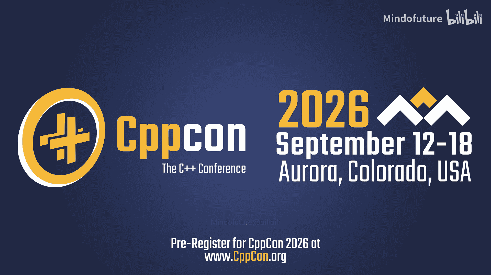
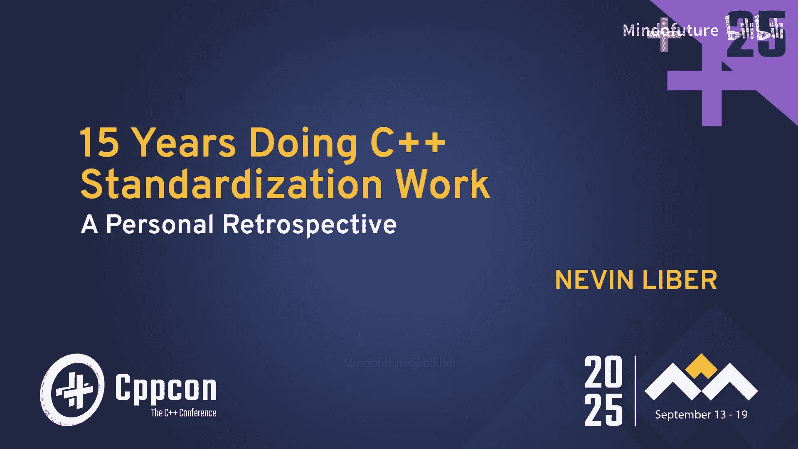
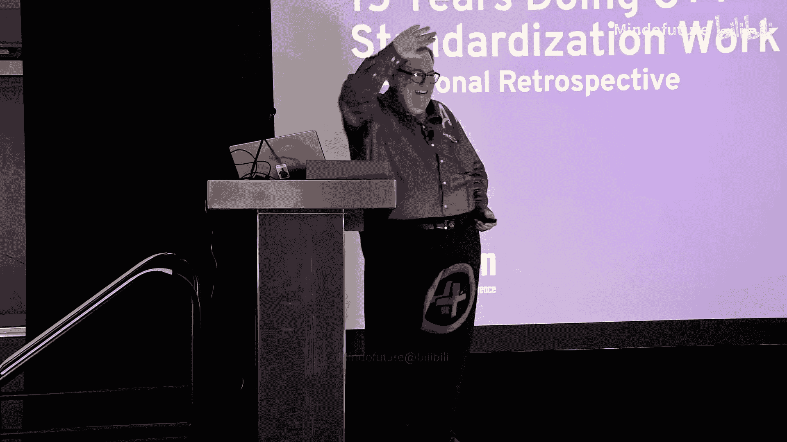
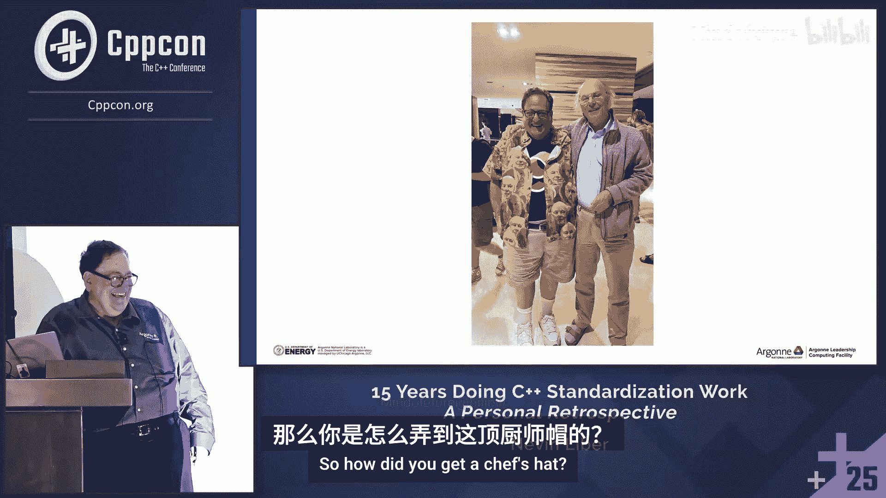
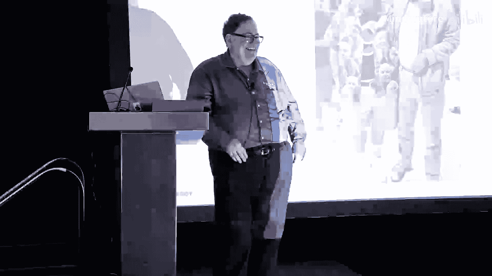

# 049：个人回顾与委员会参与指南

在本教程中，我们将跟随Nevin “-” Liber的视角，回顾他参与C++标准化委员会15年的历程。我们将了解如何从一名普通开发者成长为委员会成员，并深入探讨C++标准制定的流程、挑战与收获。本教程旨在消除对标准化工作的神秘感，鼓励更多开发者参与其中。

## 章节 1：缘起与早期探索

上一节我们概述了本教程的目标。本节中，我们来看看Nevin是如何与C++结缘并开启标准化之旅的。

Nevin的C++之旅始于AT&T贝尔实验室。当时他对C++一无所知，但在一位朋友的启发下，他开始主动学习。他结识了工程师Jim Coplien（后来提出了“奇异递归模板模式”CRTP），并在其帮助下获得了SeaFront编译器，通过观察生成的C代码来理解C++的对象模型。

在学习过程中，他遇到了一个关于`for`循环中变量作用域的问题：为何循环结束后，循环变量`i`似乎仍在作用域内？这与他理解的作用域应持续到右花括号`}`为止相悖。Jim也无法解答，于是他们决定向唯一可能知道答案的人求助。

Nevin鼓起勇气，花了整整两天时间，字斟句酌地给Bjarne Stroustrup（C++之父）写了一封非常恭敬的邮件，阐述了他的疑问。第二天，他收到了Bjarne礼貌而友好的回复。Bjarne承认这确实是一个设计上的失误，作用域本应如Nevin所想的那样，但为了保持向后兼容性，无法更改。这是Nevin学到的关于标准化工作的第一课：**维护向后兼容性至关重要**。

后来，Bjarne到访贝尔实验室，Nevin有幸与他握手并交谈。Bjarne提到，他们曾将庞大的5ESS电话交换系统代码（约5000万行）从C迁移到C++，仅仅因为C++有函数原型而当时的C没有，就发现了3个隐藏的bug。这件事给Nevin留下了深刻印象。

然而，此时的Nevin对多种编程语言都抱有好奇心，C++并非他唯一的热情所在。他后来去了苹果工作，又进入研究生院学习，尝试了Java甚至Mumps等语言。

在担任助教期间，他遇到一个学生无法编译一段看似正确的C++代码。他查阅了大量资料才发现问题所在：在当时，两个连续的`>`字符（例如在模板嵌套中）会被解析为右移运算符`>>`，需要在中间加一个空格。这个经历让他意识到，**发现问题本身就有价值**。同时，他也回忆起在贝尔实验室阅读Bjarne的技术报告时的感受：报告不仅说明“做了什么”，还解释了“为什么这么做”以及“其他选项为何被否决”。他认为这是进行语言设计等工作的绝佳方式。

至此，Nevin决定，他的下一份工作一定要是专业的C++开发。

## 章节 2：深入工业界与接触标准

上一节我们介绍了Nevin如何从初学者成长为决心从事专业C++开发的工程师。本节中，我们来看看他如何在实际工作中深化对C++的理解，并首次接触到标准化工作。

Nevin在报纸上（是的，那个需要邮寄纸质简历的年代）发现了一则招聘C++工程师的广告。与许多写着“C/C++程序员”的广告不同，这则广告明确要求真正的C++技能。他加入了WMS Gaming，一家老虎机公司。

在这里，C++被用于在资源极其有限的系统上（Intel 80188处理器，640KB RAM，64KB电池备份RAM）开发全视频老虎机。由于涉及真钱交易和严格的监管认证，代码必须精益、健壮且可靠。这段经历让他深刻体会到**在约束下进行高效C++编程的重要性**。

公司支持他参加各种C++培训和研讨会，他的老师变成了Scott Meyers、Dan Saks、Herb Sutter、Andrei Alexandrescu和Steve Dewhurst等行业专家。他还参加了第一届CppCon（2007年），并遇到了Boost库的创始人Beman Dawes。Beman是第一个建议他应该参加标准会议的人，并告诉他很快在附近的费米实验室将有一次本地会议。

尽管Nevin当时就想：“等等，我有工作，我可以飞过去参加”，但他内心仍然充满畏惧，认为自己不够优秀、不够聪明、不够专业，没有勇气迈出那一步。这一等就是三年。

如果当时他知道标准化委员会和制定管道螺纹、电源插座或卫生纸标准的是同一类人，或许就不会那么 intimidated（感到畏惧）了。Dan Saks分享的一段历史揭示了这一点。

以下是C/C++标准化起源的关键事件列表：
*   **二战期间**：坦克、船舶和飞机制造商需要协调零件标准，成立了国家标准化机构。
*   **20世纪70年代**：该机构演变为美国国家标准学会（ANSI），制定了在工业界建立共识的正式规则。
*   **1978年**：摩托罗拉的Jim Brodie需要编写一个可靠的C编译器，但K&R的书籍描述过于非正式。他发现其他人也有同样的问题，于是需要一项国家标准。
*   **1983年**：Jim Brodie按照ANSI的流程，在行业媒体上发布通知，邀请所有感兴趣的人参加筹备会议。这次会议促成了C标准委员会的成立。
*   **C++需要标准时**：C委员会决定不接手。于是流程重演，1989年12月举行了一天的组织会议，C++标准委员会由此诞生。

Nevin当时并不知道这段历史。对他而言，委员会是由一群比他更聪明、更杰出的精英组成，在“高山之巅”为芸芸众生改进语言。但另一方面，他渴望学习更深入的C++知识，而市面上已没有他没上过的高级课程或研讨会了。这成了他参加标准会议的主要动机：**为了学习**。

## 章节 3：迈出第一步：首次参会

上一节我们看到了Nevin参与标准化的动机逐渐成熟。本节中，我们来看看他如何克服心理障碍，真正参加第一次标准会议。

机缘巧合，Scott Meyers将Nevin推荐给芝加哥的一家低频交易公司DRW。DRW正在寻找优秀的C++人才，并最终录用了他。作为录用条件的一部分，公司同意派他参加即将在费米实验室举行的本地会议。

现在，他需要弄清楚如何参会。他给Herb Sutter发了邮件。Herb回复表示欢迎，并说明可以以观察员身份参会，可以参与讨论，但没有投票权。他需要国家机构的邀请和批准。这些规则至今变化不大。

随后，时任美国委员会主席的Steve Clamage给他写了邮件。邮件中最重要的部分是：“会议**可能很无聊**。” Herb也曾多次在会议前说类似“我们只是在进行收尾工作，不会太令人兴奋”的话。但Nevin后来发现，**每一次会议都从未无聊过**，总会有令人兴奋的议题。

第一次会议在费米实验室举行。Bjarne在场，Herb因病未能到场，通过会议电话发言，“宛如上帝之声”。Nevin看到委员会正在激烈辩论关于默认拷贝构造函数和移动构造函数的规则。他有一些技术观点想说，但仍然感到害怕和恐惧。

整个会议期间，他都没能鼓起勇气在会议期间发言。他通过一位认识的委员会成员中转邮件来表达观点，而对方总是鼓励他：“你应该自己说出来。” 但他始终没能做到。

会议结束后，他回到DRW，询问公司是否可以正式加入委员会。由于会费仅需2000美元（在金融公司这很容易），公司同意了。在与法务部门沟通并签署了不泄露公司机密的协议后，DRW成为了国家机构成员，Nevin也正式成为了ISO全球目录中的一员，拥有了投票权。

Nevin强调，加入委员会其实没有魔法：**支付费用，即可加入**。每个国家有不同的方式。如果个人无法承担，也可以通过C++基金会或Boost等途径加入。

## 章节 4：找到自己的声音与角色

上一节我们见证了Nevin正式成为委员会成员。本节中，我们来看看他如何在委员会中找到自己的位置并发声。

在马德里会议上，Nevin遇到了John Lakos（《大规模C++程序设计》作者）。John正在为“宽契约和无异常”的提案游说，他逐个说服委员会成员。John也成功说服了Nevin。

然而，在全体会议就这一主题进行激烈辩论时，Nevin突然意识到一个逻辑问题：如果违反了前置条件，标准规定程序进入未定义行为（UB）。标准还说，此时标准本身不再适用。那么，即使有宽契约和`noexcept`声明，在UB状态下，你仍然可以通过`noexcept`抛出异常，因为标准已不适用。

他环顾四周，似乎没人提出这一点。于是，在激烈的全体会议中，他**不得不第一次开口发言**。他身后的一位编译器专家立即反驳：“`noexcept`优先于未定义行为。” 从实践角度看，这位专家是正确的；但从标准理论角度看，Nevin至今仍认为自己的逻辑站得住脚。不过，这没关系。重要的是，房间里的人倾听并理解了他的观点，并进行了思考。对他来说，这就足够了：**提出观点，被人理解**。

他认为C++26中的契约（Contracts）特性最终解决了这个问题，他对此全力支持。

马德里会议还发生了两件重要的事：他与John Lakos成为了朋友；并且，他参与投票通过了13年来的第一个新标准——C++11。投票过程有些出乎意料，在一个看似普通的快速表决后，大家才反应过来：“我们刚刚投票通过了C++11。” 第二天，委员会休息了一天——13年来的第一次休息。

一年后，下一个标准（C++14）开始成形，Nevin在委员会中的角色也逐渐清晰。他发现自己擅长**发现那些不太正确的小细节，并设法修复它们**。

以下是他在后续工作中推动或参与解决的一些问题示例：
*   **位域（Bitfields）**：发现标记为`int`和`signed int`的位域行为可能不同。他坚持这是错误的，并最终说服了整个核心语言工作组。
*   **空指针与字符串流**：成功辩论了`std::stringstream`视图中的空指针值（未定义行为）不应等同于空字符串。
*   **`vector<bool>`的`emplace_back`**：为保持一致性，推动并成功为`vector<bool>`添加了`emplace_back`方法（尽管其行为仍与其他`vector`特化版本不完全一致）。
*   **静态调用运算符与下标运算符**：在C++23中，有人提议使函数调用运算符`operator()`可以是静态的，另一份提案则提议使下标运算符`operator[]`可以是静态的。但两份提案都忽略了应该让两者行为一致。Nevin在与其他国家代表团负责人交流后，共同推动了国家机构评论，最终在C++23中修复了这个问题。

这些“胜利”令人满足。然而，Nevin同样记得那些**失败的辩论**，它们带来的“伤口”持续了很长时间。

## 章节 5：挫折、坚持与“求和类型”的胜利

上一节我们看到了Nevin在委员会中的一些成功贡献。本节中，我们来看看他经历的重大挫折，以及如何从挫折中恢复并最终推动重要特性进入标准。

Nevin当时主要参与新成立的库演化工作组（LEWG）。他们正在辩论一个名为`std::optional`的提案。`optional`是一种可以表示“有值”或“无值”状态的类型，非常重要。

辩论始于邮件列表。一个主要争议点是：**比较操作符应如何工作**？对于整数等常规类型很简单，但对于浮点数（有NaN状态，NaN不等于任何值，包括其自身）或具有特殊规则的其它类型，则很复杂。委员会无法达成共识。

在2013年布里斯托尔会议的一个晚上，LEWG从晚上7:30一直争论到凌晨1:15，没有休息。气氛非常激烈，人们不断重复自己，拒绝回答问题，令人沮丧。最终，为了能让`optional`进入C++14，他们决定**移除除相等`==`和小于`<`之外的所有关系操作符**（不等于`!=`、大于`>`等都被移除），留待以后解决。这个妥协方案在全体委员会获得通过，进入了C++14工作草案。

然而，这并非终点。在下一次由DRW主办的芝加哥会议上，由于这个悬而未决的问题，`optional`被**从标准中撤出**，转入了“技术规范”（TS），Nevin称之为“提案的炼狱”。因为一旦进入TS，即使未来纳入标准也可能改变，生产代码通常不会采用，导致委员会无法获得迫切需要的使用反馈。

`optional`在“库基础技术规范”中待了三年。这件事让Nevin感到筋疲力尽和沮丧，失去了继续战斗的能量。

大约此时，Nevin和他在DRW的同事Matt Godbolt正在设计一个更好的`variant`（可变类型容器）。他们本打算开源并标准化它。但Nevin因为`optional`的经历，感到没有能量再去推动一个新的、可能引发激烈辩论的提案。

有趣的是，大约一年后，来自Qt的Axel Naumann带着一个与Nevin和Matt设计非常接近的`variant`提案来到了委员会。这验证了他们的设计。但Axel的提案存在一些“新手错误”，没有充分解释设计决策。Nevin知道如何推动它通过，但也清楚其中艰难的设计部分。

Axel邀请Nevin成为合著者，但Nevin拒绝了。原因在于，如果他的名字在论文上，在辩论时他就不能离开房间（因为需要作者在场）。而`optional`带来的“伤口”仍在作痛，他需要这个选项。于是，他选择在幕后做大量工作，帮助完善提案。

核心设计难题是：如果一个`variant`当前持有类型A的对象，你想将其替换为类型B的对象。在销毁A并尝试构造B时，如果B的构造函数抛出异常，**`variant`应处于什么状态**？这决定了整个设计。委员会对此有数十种想法，邮件列表上有超过400封邮件。Nevin努力让大家聚焦于这个问题。

在科纳会议上，他们举行了一个大型晚间会议来辩论此事，但设计本质上并未偏离原始方案。两年后，在芬兰会议上，他们终于将`variant`纳入了C++17。同时，`optional`和`any`（可持有任何可拷贝类型的容器）也成功进入了标准。这是自C语言原生`union`以来，C++首次拥有了真正的“求和类型”。

至于之前提到的`optional<T&>`（可选引用），在C++26中，由Steve Downey推动，最终也加入了标准。所以，“我们最终等到了后来”。

## 章节 6：新角色与新舞台

上一节我们经历了从挫折到最终推动“求和类型”进入标准的漫长旅程。本节中，我们来看看Nevin在委员会中承担的新职责以及职业上的新变化。

这些事件巩固了Nevin在委员会中的新身份：**固执但务实，力求高效**。这些特质使他适合承担下一项任务：**孵化器（Incubator）**。

由于提案太多，委员会需要设立孵化器来对提案进行初步筛选和打磨，然后再提交给相应的工作组。在圣地亚哥会议上，设立了语言侧和库侧两个孵化器。Nevin将所有时间都花在库孵化器上，帮助塑造其工作方式。后来，他被邀请共同主持库孵化器的工作，并持续至今。被人需要和赏识的感觉很好。

另一件重要的事是，委员会同事Daisy Hollman和Hal Finkel将Nevin引荐到国家实验室系统工作。他们看到了Nevin在委员会工作之外的更多潜力，为他争取到了阿贡国家实验室的职位。现在，他的工作从老虎机转向了**超级计算机**。

在阿贡，他致力于一个名为Kokkos的库，专注于**性能可移植性**。科学家们需要将代码移植到具有新架构的超级计算机上，并保持相似的性能。由于他的委员会工作背景，他确保高性能计算社区的需求能被委员会了解。例如，他曾经不理解“可平凡复制”的重要性，直到在阿贡才明白这是GPU和CPU之间传输数据的关键方式，并就此向委员会成员进行解释。

他还参与了另一个性能可移植性层Sickle的标准化工作，并且最近（三周前）也开始参与C语言委员会，帮助标准化相关特性。

## 章节 7：鼓励参与与展望未来

上一节我们看到了Nevin在委员会和职业生涯中的新发展。本节中，作为总结，我们来看看他如何鼓励他人参与，以及对C++未来的展望。

Nevin希望他的故事能说服一些人：**你也可以加入委员会**。不仅仅是为了贡献，也是为了学习。他从中获益良多，学会了如何与人辩论，学到了技术知识。

他非常期待C++26。除了反射，还有用于解决安全问题的契约、错误行为处理和强化机制。在库方面，有线性代数、原位工厂等。这是一个令人兴奋的版本。

委员会约有540人，每次会议大约有200人出席。他们影响着全球数百万开发者和数十亿用户。只有大约200人来自25个国家，在为此做出贡献，让世界变得更美好。**你仍然可以加入**。下次会议（2026年3月）将最终确定C++26，你可以出现在合影中。

如果这还不够有说服力，那么下次会议在夏威夷。来夏威夷吧！你可以带着提案来。作为会议主席，他们会优先处理你的论文，因为他们知道这可能是你获得公司资助来参会的方式。你将有时间培育和研究你的想法，向周围的人学习，并深入钻研任何你真正感兴趣的领域。这就像CppCon的“走廊交流”，但是“加强版”。

Nevin特别感谢了委员会的所有成员。每个人都有自己的故事。在某种意义上，他们都是“齿轮”。如果他离开，C++很可能继续发展。但**正是集体的努力，才使得C++的改进得以实现**。

他特别感谢了Sherry（ likely 指 Sherry List，会议组织者或助手），花费了大量时间帮助他准备这次演讲，希望能说服大家参加标准会议。

---

**本节课中我们一起学习了**：
1.  C++标准化工作的起源和历史背景。
2.  一名普通开发者如何克服心理障碍，逐步深入并最终成为标准化委员会核心成员的历程。
3.  标准化工作的日常：辩论、妥协、寻求共识，以及处理挫折。
4.  委员会的组织结构和工作流程（如孵化器、LEWG、LWG等）。
5.  推动具体特性（如`optional`、`variant`）进入标准所面临的挑战和所需的坚持。
6.  参与标准化工作对个人职业发展的积极影响。
7.  委员会对广大C++开发者社区的重要性，以及鼓励更多人参与其中的呼吁。

Nevin的故事表明，参与标准化不需要你是天才或专家，需要的是热情、坚持、愿意学习以及为社区贡献的意愿。C++的未来依赖于广泛而多元的参与者。