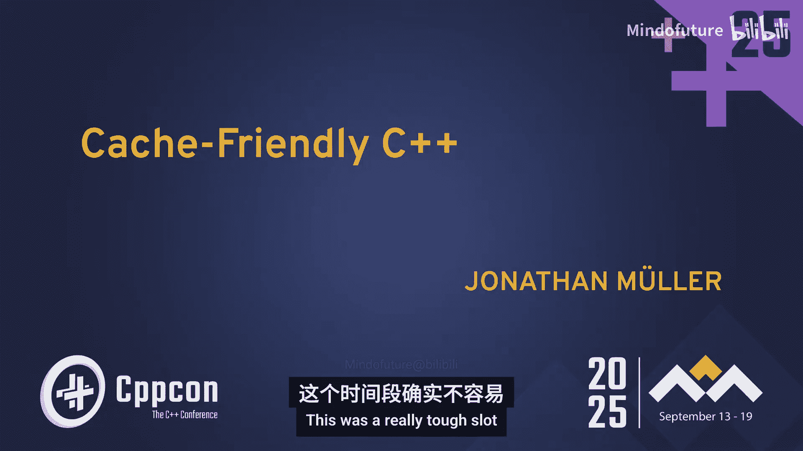
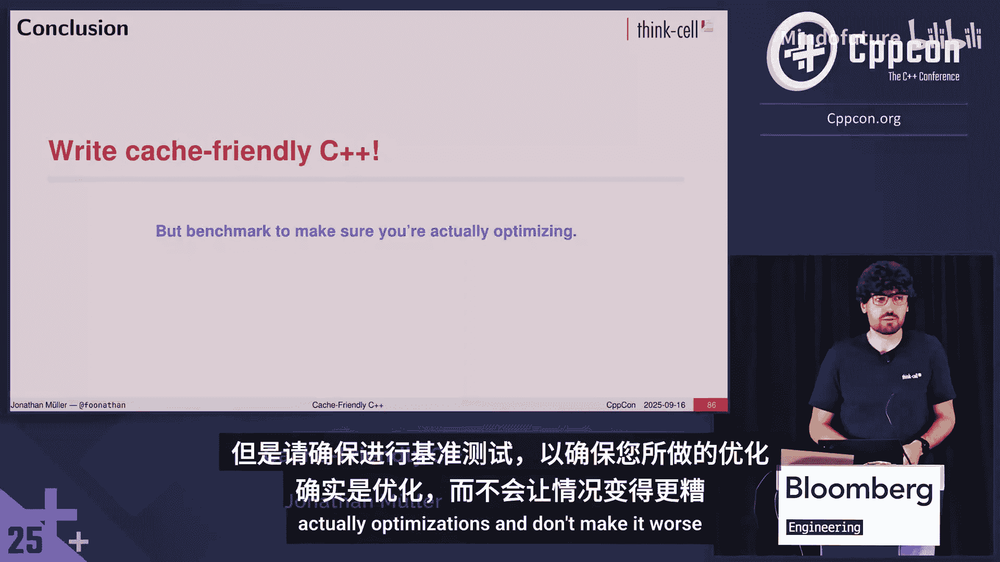
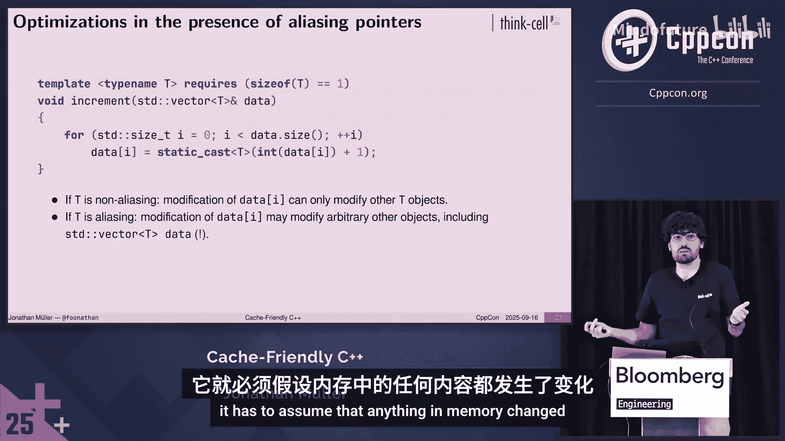

# 050：缓存友好的C++ - Jonathan Müller - CppCon 2025

在本教程中，我们将学习如何编写缓存友好的C++代码。我们将探讨CPU缓存的工作原理，以及如何通过优化数据布局、访问模式和容器选择来提升程序性能。课程内容涵盖从基础概念到多线程环境下的缓存注意事项。

## 动机：为什么需要关心CPU缓存？

为了理解缓存的重要性，我们首先比较几种不同的集合容器。标准库提供了两种集合类型：`std::set`（基于二叉搜索树）和`std::unordered_set`（基于哈希表）。我们也可以简单地使用`std::vector`。

以下是这些容器在填充N个随机整数并执行随机查找时的基准测试结果。仅基于大O复杂度，我们预期`std::unordered_set`（O(1)查找）最快，其次是`std::set`和排序后的`std::vector`（O(log N)查找），最后是未排序的`std::vector`（O(N)查找）。

然而，实际结果却出人意料。当元素数量为64时，未排序向量的线性搜索实际上比其他所有容器都快。此外，O(1)复杂度的`std::unordered_set`（绿线）在性能上始终被排序后的`std::vector`（红线）超越。

问题的答案在于CPU缓存。

## CPU缓存是什么？

为了演示缓存的影响，我们进行另一个基准测试。我们有一堆随机数据，然后随机修改其中的某个位置。随着数据大小的变化，我们测量修改所需的时间。

你可能会天真地认为，无论数据量多大，修改所需的时间都相同。但事实并非如此。随着数据量的增加，我们获得的速度会下降。

在最初的蓝色区域（约几千字节内），性能保持恒定。在绿色区域（约80KB到2MB），性能随着数据增加而下降。在橙色区域（超过2MB），性能下降得更快，但最终趋于平缓。

为什么会这样？简单来说，内存访问并非直接从CPU到主存。主存访问非常慢。例如，在Apple M1上，RAM访问速度约为70 GB/s，而其计算性能可达2.6 TFLOPs，相当于约10,000 GB/s的操作速度。这意味着主存访问比计算慢约100倍。

因此，现代计算机使用缓存。缓存是更小、更快的内存，位于CPU附近。当CPU需要访问数据时，它首先检查缓存。如果数据在缓存中（缓存命中），则直接使用；如果不在（缓存未命中），则从主存加载数据到缓存，然后再提供给CPU。

缓存是分层的。在M1上，每个核心有64-128 KB的L1缓存（访问约3个周期），多个核心共享8-12 MB的L2缓存（访问约18个周期），还有一个与GPU共享的8 MB L3缓存（访问延迟10-150纳秒）。只有耗尽所有缓存后，才需要访问主存（延迟约100纳秒）。

这解释了基准测试的结果。在蓝色区域，数据完全适合L1缓存。在绿色区域，数据适合L2缓存，但随着数据增加，L1缓存未命中的概率增加，性能下降。在橙色区域，数据超出L2缓存，性能进一步下降，最终趋近于主存访问速度。

缓存有两种写入模型：直写缓存（同时更新缓存和主存）和回写缓存（只更新缓存，稍后写回主存）。现代CPU缓存通常是回写式，这在多线程环境中会带来有趣的影响。

关键要点是：主存访问非常慢。我们可以通过使用缓存来避免许多访问。缓存更快、更接近CPU，可以缓存频繁访问的值。然而，缓存很小，因此要获得高性能，需要确保尽可能多的数据适合缓存。

## 如何高效利用缓存空间？

以下是一个计算人员平均年龄的例子。我们使用强类型整数表示年龄，然后遍历所有数据计算总和与平均值。

为了优化并确保尽可能多的数据适合缓存，一个简单的方法是使用更小的数据类型。如果我们使用`int`需要4字节，但人的年龄范围有限，我们可以使用`short`（2字节）甚至`unsigned char`（1字节）。

基准测试显示，`short`比`int`快，因为更多数据可以放入缓存。但`unsigned char`虽然比`int`快，却不如`short`快。这是因为在此CPU上，`unsigned char`的算术运算可能比`short`慢。这再次强调，优化前后必须进行测量，因为改善一个指标可能会在其他方面造成损失。

优化基本类型大小很简单：选择更小的原始类型（如`signed char`或`short`），使用`float`代替`double`，并指定枚举的底层类型（默认为`int`）。由于通常不对枚举进行算术运算，这可以节省缓存空间。

但使用1字节整数类型时需要小心。实际上有三种不同的1字节整数类型：`signed char`、`unsigned char`和普通的`char`。此外还有`char8_t`（用于UTF-8文本）和`std::byte`（用于内存访问）。所有这些都是8位/1字节类型。

基准测试一个递增1字节类型的函数，结果显示除了`char8_t`外，所有类型性能相同，而`char8_t`更快。原因与CPU缓存或汇编指令无关，而是与优化器有关。

C++有严格的别名规则。如果对象位于某个内存地址，只能使用兼容类型的指针访问它。`char`、`signed char`和`unsigned char`的指针可以指向内存中的任何对象，这意味着它们是“别名类型”。对于非别名类型`T`，修改`data[i]`只能修改其他`T`对象。但对于别名类型，修改`data[i]`可能修改内存中的任何内容，包括可能修改`std::vector`的大小。

在循环中，如果类型是非别名类型，优化器可以推断`data.size()`不变并将其提升到循环外。但对于别名类型，优化器必须假设赋值可能修改大小，因此每次循环都需要重新加载大小。

这解释了`char8_t`的性能优势，因为优化器可以更好地优化它。当然，你仍然可以使用`char`或`signed char`，只需确保自己应用优化，例如手动将大小提升到循环外，或者使用`std::for_each`。这样就能获得相同的性能。

再次强调，进行任何优化时都要进行基准测试，特别是对于1字节类型，由于严格的别名规则，它们具有特殊属性。

## 使用位域和内存对齐

如果你需要小于1字节的数据，可以使用位域。例如，一个`Widget`可以有`enabled`、`visible`布尔值和三种`state`。如果分别存储，`Widget`大小为3字节。但我们可以使用位域，`enabled`和`visible`各占1位，`state`占2位，这样`Widget`可以打包到1字节中。

然而，访问位域更慢，因为每次访问都需要从字节中提取和屏蔽位。因此，从缓存中容纳更多`Widget`获得的收益可能会被访问开销完全抵消，必须进行基准测试。

一种通常免费的优化是重新排列结构体成员。考虑一个`Message`结构体，包含`uint8_t type`、`uint32_t length`、`void* data`和`uint16_t checksum`。在64位系统上，这些成员总大小为15字节，但结构体实际大小为24字节。原因是内存对齐。

对齐是类型的要求，规定了对象地址必须是其对齐值的倍数。对于结构体，其对齐值是所有成员中最大的对齐值。放置成员时，必须确保每个成员的偏移量是其对齐值的倍数，因此需要插入内部填充字节。最后，还需要尾部填充，以确保结构体数组中的每个对象也都正确对齐。

对于按原始顺序排列的`Message`，编译器需要插入大量填充字节。但如果我们将成员按对齐值从大到小重新排序，就能获得最优的填充，现在`Message`大小为16字节，可以在缓存中容纳更多实例。

我们甚至可以进一步利用对齐。指向`T`的指针，因为`T`对象必须正确对齐，所以指针地址的最低几位总是0。我们可以利用这些位存储额外信息。例如，需要存储指向`Container`或`Text`的指针时，传统方法需要存储一个布尔标志和一个`void*`指针，共16字节。但如果我们假设`Container`和`Text`对象至少2字节对齐，指针地址的最后一位总是0。我们可以将指针存储为整数，并将最后一位设置为1表示`Text`，0表示`Container`。这样只使用8字节就存储了相同的信息。

如果类型更小，更多实例可以放入缓存。因此，使用`short`代替`int`，使用`float`代替`double`，指定枚举的底层类型，考虑位域，重新排序结构体成员以避免填充，并考虑使用指针对齐位等技巧来存储额外信息。

然而，所有这些都意味着数据访问可能变慢。因此必须进行基准测试，以确认是否真正获益。

## 预取和缓存行

你可能会疑惑，在计算平均年龄的基准测试中，当我们使年龄类型变小时，为什么会有帮助？我们只访问每个地址一次，不应该都是缓存未命中吗？同样，缓存也没有解释为什么排序向量比`std::unordered_map`快。

为了探究原因，我们不仅基准测试随机访问，还测试线性访问（向前和向后）。在顺序访问中，无论数据大小如何，性能都相同。只有在真正随机访问时，性能才会下降。

原因是预取器。当我们访问地址X时，通常也会访问下一个地址。CPU设计者知道这一点，因此引入了预取器，它会预加载可能在未来访问的地址到缓存中，从而避免缓存未命中。

在另一个基准测试中，我们随机访问数据块。我们随机选择一个起始块，然后以随机顺序访问该块中的所有索引。随着块大小的增加，性能上升，但收益递减。

这是因为内存访问以缓存行为单位进行。缓存行是连续的内存块，通常为64字节。当我们加载地址2时，不仅加载地址2，还加载整个包含地址2和3的缓存行。当我们稍后需要地址3时，它已经在缓存中了。

在块访问基准测试中，当块很小时，我们加载了整个缓存行但丢弃了大部分信息。随着块大小增加，我们越来越高效地使用了缓存行。

因此，CPU不仅缓存数据，还希望通过预取整个缓存行来最小化内存访问。它学习我们的内存访问模式并进行预取。要获得真正的高性能，需要具有高局部性的可预测内存访问模式。

## 使用缓存友好的容器

要利用预取和缓存行，意味着我们需要可预测的访问模式，避免指针追逐，希望顺序内存访问，并确保高局部性（即最小化类型大小，使更多数据适合缓存行，同时确保不关心的数据不在缓存行中）。

`std::vector<T>`是缓存友好容器的典型例子。它的值连续存储在内存中，没有元数据浪费缓存行空间。迭代时顺序访问内存，预取器可以发挥作用。类似地，`std::array`、`inplace_vector`等具有连续内存访问的容器也是缓存友好的。

相反，`std::list`是链表，每个节点包含值和指向前后节点的指针。迭代时跟随指针，预取器无法帮助，且指针浪费了缓存行空间。

`std::deque<T>`逻辑上是指向块的指针向量。在块内是连续的，预取器满意。只有切换到下一个块时，才需要一点指针追逐。如果块足够大，块间转换影响不大，因此它也是缓存友好的。但不幸的是，至少在一个标准库实现中，块大小太小，无法获得有意义的缓存收益。

标准库的`map`和`set`实现（基于二叉搜索树）非常不缓存友好。从内存布局看，它就像链表，节点包含左右指针，需要指针追逐，预取器无法帮助，且元数据浪费缓存行空间。

同样不幸的是，`unordered_map`和`unordered_set`也不缓存友好。它们使用闭地址法，本质上是桶数组，每个桶是一个单向链表。查找时计算哈希值，找到桶，然后跟随指针直到找到键值对。这对预取器不友好，且元数据浪费缓存行空间。这就是为什么在基准测试中，对于足够小的值，排序向量击败了O(1)容器。

哈希表可以更快，只需使用开地址法。在开地址法中，你有一个平坦的元素列表（如`std::vector`），哈希后找到适当的桶，检查是否是所需值，如果不是则查看相邻位置。这非常缓存友好，因为没有指针，只需查看相邻地址。但标准库未提供此实现。

总之，应优先使用占用大块连续内存的容器，因为它们更缓存友好。预取器可以帮忙，不会用不必要的元数据浪费缓存行，只包含关心的数据。在几乎所有情况下，都应使用`std::vector`。如果需要其属性，也可以使用`std::deque`的实现，或使用开地址法的哈希表。

## 代码也是数据

在我进行测试测量后，发现测量的L2缓存大小与实际不符。数据表显示L2缓存为4 MB，但性能下降发生在达到4 MB之前。原因是，代码也是数据。

CPU指令也存储在内存中。主存访问慢，因此使用更快的缓存来避免。在L1级别，通常有独立的指令缓存和数据缓存，但在L2缓存，它们通常是统一的。因此，测量的L2缓存大小较小，因为部分L2缓存用于存储正在执行的程序。

代码也是数据意味着代码本身也有缓存效应。我们可以构造精心设计的例子来演示代码的奇怪缓存效应。

例如，我们有一堆随机数据并求和，但如果遇到零，则执行64次单独的递增操作。条件`data[i] == 0`很少为真，但如果为真，则有64次单独的递增。我们可以先求和再执行递增，或者先执行递增再求和。这不会改变结果，只是编写顺序的选择。

在Apple M1的高性能核心上，先求和再递增的版本明显更快。仅仅因为CPU指令在内存中的布局方式，就导致了巨大的性能差异。我研究了一下，但未找到根本原因。

关键是，你的程序存在于主存中，主存访问慢，因此有缓存。就像可以有缓存友好的数据访问模式一样，也可以有缓存友好的代码访问模式。

缓存友好的数据访问模式希望按线性顺序访问数据，代码的等价模式是希望顺序执行的指令。这意味着不希望分支跳转到程序完全不同的位置。例如，函数调用可能首次调用时导致缓存未命中。类似地，对于数据，希望避免指针追逐，因为预取器无法工作；代码的等价模式是间接跳转（如调用虚函数或函数指针），预取器无法预取。

同样，希望最小化数据大小以更高效地使用缓存行；对于代码，在循环中希望尽可能少做事情，以便更多代码适合缓存。

因此，不仅要以考虑缓存的方式设计数据，整个程序也是如此，因为代码本身也很重要。实现这一点的一种方法是遵循数据导向设计。

## 数据导向设计

数据导向设计通常与面向对象编程对比。在OOP中，关注对象（领域特定的抽象）；在数据导向设计中，关注算法（数据转换）。在OOP中，有封装数据和行为的智能对象（具有成员变量和成员函数的类）；在数据导向设计中，只有操作数据的算法。

例如，在OOP中，我们可能设计一个`Person`类，具有姓名和年龄，然后有`Person`的向量，并编写计算平均年龄和找到最年长者姓名的函数。

在数据导向设计中，我们从算法开始。计算平均年龄的函数只需要所有人的年龄，不需要姓名。找到最年长者姓名的函数需要姓名和年龄，可以拆分为两个函数：一个找到最年长者的索引（仅需年龄），另一个根据索引返回姓名。

我们看到两种不同的数据布局方法。第一种称为结构数组：有一个包含字段的结构，然后是该结构的数组。第二种称为数组结构：`Person`不再作为一个实体存在，它只是一个索引，我们有构成人的所有数据（如所有人的姓名和年龄）。

在OOP中，通常使用结构数组，因为对象是关于对象的。在数据导向设计中，使用适合算法的布局。如果经常需要同时处理年龄和姓名，那么将它们放在一起有意义；如果有时只处理其中一个，那么将它们分开有意义。

从内存布局看，结构数组是姓名、年龄、姓名、年龄……这提供了对单个记录的高效访问。数组结构首先是所有姓名，然后是所有年龄，这提供了对单列的高效访问。

这很重要，因为如果只关心年龄，使用结构数组代码时，缓存行会浪费在不需要的姓名上，性能下降。基准测试显示，无论选择何种年龄大小，`Person`都明显更慢，因为浪费了缓存行空间存储姓名。

另一个经典的OOP例子是形状层次结构。有`Shape`基类和纯虚函数`area()`，以及派生类`Circle`和`Square`。计算总面积函数接收`std::vector<std::unique_ptr<Shape>>`，遍历并调用虚函数求和。

在数据导向设计中，我们设计算法`total_area`，它需要圆形和正方形。我们可以使用`std::variant<Circle, Square>`，或者更简单，使用两个单独的向量：一个存储所有圆形，一个存储所有正方形。然后分别计算圆形总面积和正方形总面积，再相加。

这三种表示异质数据的方式性能不同。基于指针的OOP方式本质上是指针向量，每次迭代都跟随指针，预取器无法帮助，且指针浪费缓存行空间。`variant`方式更好，因为内联存储，但仍需要判别标签。两个单独向量的方式最佳，因为迭代时不需要分支，且没有额外元数据。

毫不奇怪，最后一种表示（两个单独向量）明显更快。简而言之，数据导向设计的思想是：设计转换数据的算法，从算法开始，考虑所需的数据，并编写操作N个元素的函数，而不是单个元素。将循环推入函数中，这对优化器更友好，性能更好。

进一步建议：如果只关心数据的子集，只将该数据放入数组，使用数组结构，让其他数据存放在别处，仅在需要时访问。如果有某种变体，只需使用多个同质数组。例如，如果有一个布尔成员，在循环中根据布尔值执行不同操作，这通常是一个危险信号，只需拆分为两个单独的数组，一个用于布尔为真的情况，一个用于布尔为假的情况。这样可以避免分支，且不需要存储布尔值。

通过这种方式，可以真正利用缓存，获得巨大的性能提升。

## 多线程与伪共享

到目前为止，我们只看了单核处理器，现在看看多核处理器。假设我们要进行并行折叠算法（如求和）。并行化的模式是：我们有一个线程池，创建一个数组存储每个线程的本地结果。每个线程获取工作的一部分，进行计算，并将结果存储在本地结果数组中。这不需要同步，因为每个线程访问不同的数组元素。所有线程完成后，再折叠本地结果得到最终值。

在基准测试中，我们并行累加一堆斐波那契数。随着线程数增加，每个线程做的工作更少，理论上应该获得加速。然而，实际运行基准测试时，性能根本没有扩展。事实上，随着线程数增加，性能甚至下降。使用四个线程比单线程还慢。

这是因为在多核处理器中，每个核心有自己的L1缓存。如果一个核心修改了其L1缓存中的条目，它必须使其他核心的该缓存条目无效，否则它们会读取过时数据。CPU缓存以缓存行为单位操作，因此它会使整个缓存行无效。

在我们的例子中，线程0修改本地结果数组的索引0，这会使整个缓存行无效。线程1访问同一缓存行中的相邻条目时，即使该条目未被修改，也会遇到缓存未命中，必须从主存重新加载。这称为伪共享：由于同一缓存行中不相关数据的修改而导致的缓存无效。

这严重损害性能，必须避免。避免的一种方法是确保每个本地累加器位于不同的缓存行。我们可以通过添加填充空间来获得所需的对齐。C++17提供了`std::hardware_destructive_interference_size`来获取缓存行大小，但它是编译时常量，可能不总是正确设置，可能需要自己实现。

通过这种对齐，我们为每个线程分配了一个缓存行。现在每个线程修改自己缓存行的第一个值，不会使其他线程使用的缓存行无效。重新运行基准测试，我们获得了预期的性能扩展。

当然，在这个特定例子中，更简单的解决方案是使用局部变量进行累加，只在最后写入本地结果。这样仍然存在伪共享，但因为只发生在最后，对性能影响不大，我们仍然获得扩展行为。

因此，每次进行多线程编程时，都要牢记伪共享。如果不同线程同时使用的数据，将它们放在不同的缓存行中，即使没有竞争条件，也应视为有竞争条件，因为它会严重损害性能。当然，反之亦然：如果同一线程使用的数据，将它们放在同一缓存行中，这样就不必担心性能。

## 总结

本教程介绍了CPU缓存的基础知识。缓存是更小、更快的内存，用于避免访问缓慢的主存。缓存行是主存和缓存之间传输数据的最小单位。

为了减少缓存未命中，我们有缓存预取器，它预测内存访问并预加载数据到缓存中。

处理多线程时，必须注意伪共享，即由于同一缓存行中不相关数据的修改而导致的缓存无效。

还要记住，代码也存在于内存中，代码也有缓存效应，不仅仅是数据。

要真正利用CPU缓存，我们需要缓存友好的数据访问模式：希望按线性顺序访问，以便预取器帮助；希望避免指针追逐，以便预取器工作；希望最小化数据大小，以充分利用缓存行，不放入不需要的数据。同样，对于代码，希望减少分支，避免间接跳转，并最小化热点代码的大小，使循环高效。

此外，记住不同线程同时使用的数据，应将它们放在不同的缓存行中以避免伪共享。

遵循这些原则，你就迈出了编写缓存友好C++代码的第一步，编写能够真正利用CPU内存效应并可能快得多的代码。但务必进行基准测试，以确保你的优化确实是优化，而不是使情况更糟。

谢谢。

## 问答环节

**问**：你经常有在单线程和多线程之间切换的代码。遵循这种设计，似乎每次想要切换范式时都必须重新设计代码，而不是拥有一个可以在并行环境和单线程环境中调用的线程安全函数。你如何处理？是否可能编写一个函数使其在两种情况下都能工作？

**答**：问题只发生在修改数据时。如果你有一个修改数据的单线程函数，然后想并行化它但不改变数据，那么突然会出现伪共享。但通常你会改变数据。假设你有一个数字数组和一个修改它们的单线程函数，现在你想多线程化。你将数组分割成块并发送给线程，那么在块的边界处会有伪共享效应。但通常如果你这样做，你会有大量数据（如MB级别），边界区域很小，因此你仍然可以获得加速，而不必物理上分离数据。

**问**：这是一个信息密集的精彩演讲。你展示了一页幻灯片，显示两个不同程序之间有MB级别的性能差异（一个先求和再递增，另一个先递增再求和）。你自己也不完全确定原因，但有什么想法吗？可能是预测跨越缓存行导致缓存未命中，或者是分支预测错误由于推测执行而驱逐缓存行，或者是不同类型的缓存（如L0缓存）在工作。你知道有其他深入探讨缓存细微之处的演讲吗？

**答**：关于最后一点，我不完全了解任何深入探讨缓存细微之处的会议演讲。本演讲更倾向于介绍缓存的基础知识。关于性能差异，我最初预期可能是基本块布局完全不同，但事实并非如此，只是加法指令将其移动了一位，然后可能跨越了缓存行导致效应。这个基准测试差异发生在Apple M1上，在效率核心上效应表现不同。我会先查看L0缓存。

**问**：你能调出展示单个向量与两个向量（圆形和正方形）的幻灯片吗？在进行那个基准测试时，单个向量中圆形和正方形的分布是均匀混合的还是随机的？如果你对此进行分析，可能会发现分支目标缓冲未命中与L0缓存未命中的复合效应，而与缓存无关。

**答**：分布是随机的。我查看了汇编代码，如果你有单独的向量，向量化比中间有分支的情况要好得多。即使没有，如果你只是分组……是的，即使如此，你也会看到巨大的差异。所以在这种情况下，这不完全是关于缓存，但更广泛的点是这种内存布局更好，不一定是因为缓存。

**问**：很棒的报告。我有两个问题：你提到代码也是数据，因此长跳转会跳转到代码的不同区域。我的问题是，你对函数跳转到的位置有什么控制权？第二个问题是关于NUMA（非统一内存访问）的，它在你将对象复制到不同NUMA区域时是否有帮助？

**答**：关于布局控制，主要是如果你有一个热点循环，然后很少发生某些事情，你希望确保调用的非内联函数位于其他地方，主要是确保它不会污染缓存。反之，如果你关心要执行的代码，它最好在循环内，或者在极端情况下使用节属性。但关键是测量和观察。通常你无法控制，但如果循环中有许多函数调用，就会有效应。我对NUMA没有经验。

**问**：在你展示的幻灯片中（大约第28张），修改指针内容可能修改向量大小。这是因为编译器可能认为数据指针可能实际上指向向量本身的大小吗？还是因为短路径优化？

**答**：这与短路径优化无关。向量成员（如大小）存储在内存中的某个地方，优化器不知道`data[i]`不会越界访问到向量的内存，因此必须保守地假设它可能会。编译器会认为任何类型的指针访问都可能修改大小吗？是的，如果通过可能别名内存中任何内容的指针访问，优化器必须假设内存中的任何内容都可能已更改。

**问**：如果是指向任何类型的指针，也会有同样的问题吗？是的，如果通过可能合理别名内存中任何内容的指针访问，它必须假设内存中的任何内容都已更改。

时间到了。我有著名的L值R值袜子。如果你没有袜子，想要一些，可以购买L值R值袜子。😊

谢谢。

