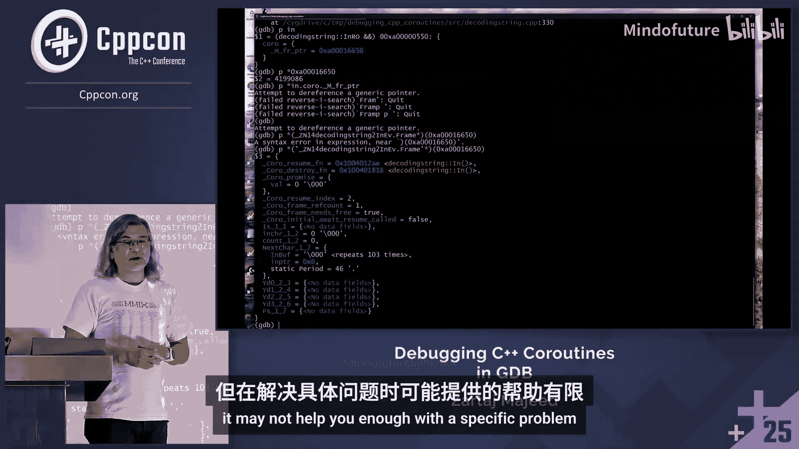

# 051：在GDB中调试C++协程

在本教程中，我们将学习如何在GDB中调试C++协程。我们将探讨当前调试器对协程的支持程度，展示可以完成的任务，并指出仍然存在的挑战。课程将包含一个具体的示例程序，并通过演示展示实际操作。

## 概述

调试C++协程在GDB中面临独特挑战。协程可以暂停和恢复，这引入了传统函数所没有的复杂性，例如检查暂停协程的状态和处理异步调用栈问题。本教程将引导你了解当前可用的调试功能、其局限性以及应对复杂问题的实用技巧。

## 协程调试的挑战

调试本身具有挑战性，C++协程增加了复杂性，而GDB也有其学习曲线。因此，在GDB中调试C++协程的难度是叠加的。

一个自2021年2月23日开放至今的GCC错误报告反映了早期的问题。报告者指出，虽然对C++20协程的实现感到兴奋，但被当前调试器中无法检查协程状态的问题所困扰。他引用了论文P2073，该论文确认了当时调试支持的缺失状态，但无法确定问题在于GCC、GDB还是两者皆有。

情况并非一直如此糟糕。自P2073论文发布以来，情况已大幅改善。当时，你无法检查局部变量、协程参数或承诺对象。现在，这些标准功能已能正常工作：

*   可以设置断点。
*   可以查看局部变量。
*   可以查看协程参数。
*   可以检查协程的承诺类型。

真正的挑战在于协程特有的、非典型函数的行为，主要有两点：

1.  **检查暂停的协程**：协程可以暂停并从栈中移除，如何检查其状态仍有些棘手。
2.  **异步调用栈问题**：每个协程都有自己的调用栈，并且可以随时暂停和恢复。在任意时刻，你可能想知道所有协程的调用栈在哪里。目前这是一个难题，虽然存在一些针对特定库或应用的解决方案，但缺乏通用的好方法。

## 示例问题：Knuth的协程问题

为了演示，我们使用一个经典问题来展示协程的独特价值。这个问题由Donald Knuth在《计算机程序设计艺术》中提出，用于阐明协程作为松散耦合、协作解决问题的函数的特性。

问题描述如下：编写一个程序，将一种代码翻译成另一种。输入代码是由句点终止的8位字符序列，例如 `A2 B5 E.`。输入中可能穿插任意空白字符（ASCII值小于等于0x20的字节），这些空白字符被忽略。

非空白字符按以下规则解释：如果下一个字符是十进制数字`n`（0-9），则表示其后的字符（无论是否为数字）重复`n+1`次。非数字字符直接表示自身。

程序输出由结果序列组成，每三个字符分为一组，直到遇到句点。最后一组可以少于三个字符。例如，输入 `A2 B5 E.` 应翻译为 `A`，然后是三个`B`（因为`2 B`表示三个`B`），接着是六个`E`（因为`5 E`表示六个`E`）。输出分组后为 `ABB BBE EEE E.`。

此外，输出行限制为16个这样的三字符组，组间用空格分隔，每行以换行符（`\n`，ASCII 0xA）结束。

Knuth的原始解决方案使用汇编语言，但我们可以用C++协程实现其思想。

## C++协程解决方案设计

我们将问题分解为三个部分：

1.  **`next_char`函数**：管理原始输入缓冲区的子程序（常规函数）。
2.  **`in`协程**：解析输入并为后续处理提供一个字符项。它是一个生成器，每次产生一个字符。
3.  **`out`协程**：格式化字符项并打印输出。它等待`in`协程依次提供字符。

`in`和`out`作为协程协同工作。`in`是生成器，`out`是消费者。

### `in`协程

`in`是一个协程函数，其返回类型是一个特殊的类，称为返回对象（`in_ro`）。函数体内包含一个循环，调用`next_char`获取字符，并根据规则决定是直接产出字符，还是将其视为计数并产出后续字符相应次数。

### `out`协程

`out`协程负责接收`in`产出的字符，并将其格式化为三字符组输出，同时跟踪每行的组数。它通过`co_await`等待`in`协程返回对象的值。

### 启动顺序

协程设计需要决定谁先运行。这里，我们让`out`立即运行，`in`初始为暂停状态。当`out`需要值时，它通过`co_await`恢复`in`。主程序只需调用`out`，当`out`完成时，整个解决方案就完成了。

## 编译器内部机制与调试信息

协程就像冰山，可见部分只是整体的一小部分。大量机制隐藏在承诺类型、等待器等数据结构中。当编译器处理协程源代码时，会进行复杂的转换，生成中间代码而非直接的C++源码，这使得理解运行时行为变得困难。

GCC提供了一个未公开的选项 `-fdump-lang-cor`，用于转储协程的中间表示（IR）。这有助于开发者（和高级用户）理解编译器对协程所做的转换。转储内容显示了协程帧类型、挂起点索引等信息。协程帧的前三个字段（协程恢复函数指针、协程销毁函数指针、承诺对象指针）可能成为未来跨编译器ABI标准的一部分。

## GDB实战演示

现在，我们进入GDB实战环节，看看如何调试这个协程程序。

首先，我们编译程序并生成协程转储文件以供参考。然后，在GDB中运行程序。

我们设置一个断点在`out`协程的第一次`co_await`语句之前。此时，`in`协程应该处于初始暂停状态，不在调用栈上。

在GDB中，我们可以使用 `info locals` 和 `info args` 查看协程的局部变量和参数，这些功能与普通函数一样有效。

然而，要检查暂停的`in`协程，我们需要找到它的协程帧。`in`协程的返回对象中存储了协程句柄，该句柄包含一个指向协程帧的指针（`_M_fr_ptr`）。我们可以获取这个指针。

为了以可读格式查看协程帧，我们需要将其转换为正确的类型。这个类型可以从 `-fdump-lang-cor` 生成的转储文件中获得（例如 `_Z4in_ro11frame_type`）。在GDB中，我们可以使用 `print *((_Z4in_ro11frame_type*) frame_ptr)` 来查看暂停协程的帧状态，包括恢复函数、销毁函数、承诺对象等字段。

## 处理异步调用栈

对于异步调用栈问题，目前GDB没有像线程那样的内置协程支持。通用协程通过标准库实现，不容易追踪暂停协程与未来恢复点之间的连接。

一些库（如Folly）采用的方法是：在协程的承诺对象中维护特殊变量（通常称为“延续”）。在挂起点，协程可以获知或控制恢复后的目标，并将此信息存储在承诺中。通过这种方式，可以在调试时手动或通过自定义工具链遍历这些连接，重建异步调用链。

## 总结

本节课我们一起学习了在GDB中调试C++协程的当前状态。我们了解到，对于函数的标准调试操作（断点、查看变量）现在已能很好地支持协程。主要挑战在于协程特有的行为：检查暂停协程的状态和可视化异步调用栈。

我们通过一个经典的Knuth文本转换问题，演示了协程的设计与协作。在GDB演示中，我们展示了如何通过协程句柄和帧指针来检查一个不在栈上的暂停协程。最后，我们讨论了异步调用栈问题的现状，并指出通过自定义承诺数据来维护“延续”信息是当前可行的解决方案之一。

虽然GDB尚未提供原生的高级协程调试命令，但通过理解协程内部机制和利用现有工具，我们仍然能够有效地诊断和解决协程程序中的问题。