# 053：及早捕获错误 - 使用静态分析验证C++契约

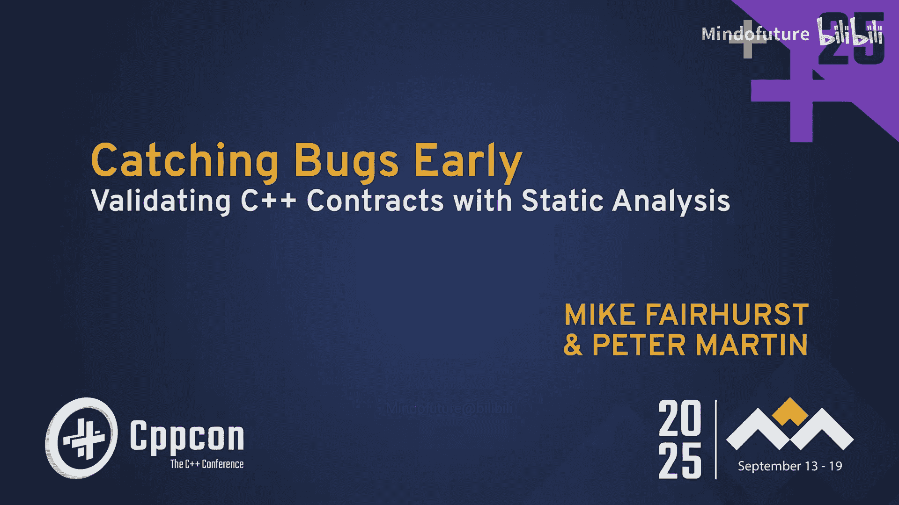

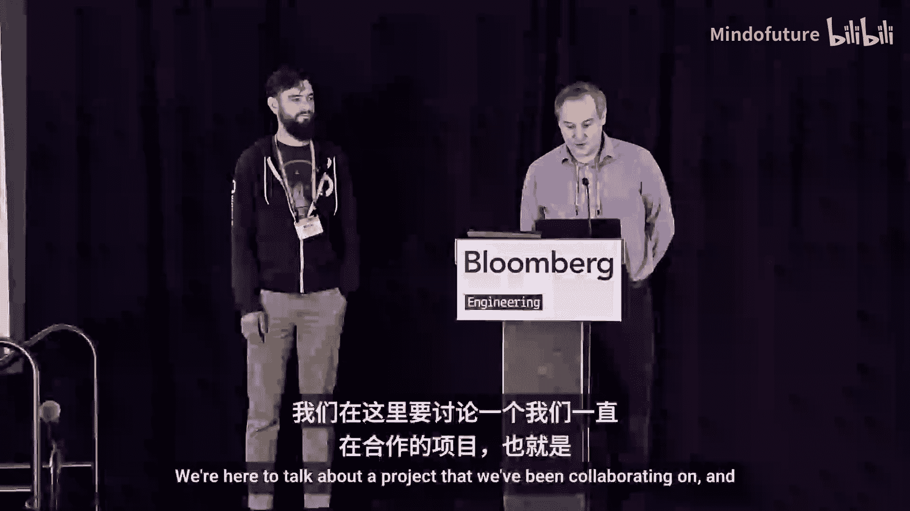

在本教程中，我们将学习如何利用C++26的契约特性，结合静态分析工具CodeQL和定理证明器Z3，在程序运行前发现潜在的契约违反错误。我们将从契约的基本概念讲起，逐步深入到静态分析的实现原理、评估结果以及未来的发展方向。

## 概述：C++26契约简介

上一节我们介绍了本教程的主题。本节中，我们来看看C++26契约是什么。

C++26引入的契约功能提供了一组新的语言关键字，允许开发者为函数指定契约。这为我们提供了一种在API边界编码预期行为的方式，包括函数被调用时和正常返回时的情况。

以下是契约的核心语法：
*   **`pre`**：用于指定函数的前置条件，即函数调用时必须满足的要求。
*   **`post`**：用于指定函数的后置条件，即函数正常返回时可以预期的状态。
*   **`contract_assert`**：用于在函数体内执行契约检查。

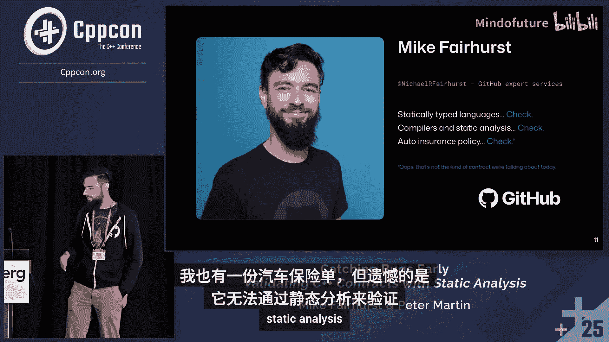

以下是一个简单的代码示例：
```cpp
int divide(int a, int b) pre(b != 0) { return a / b; }
int abs(int x) post(r: r >= 0) { return x < 0 ? -x : x; }
```
在`divide`函数中，契约规定`b`不能为0，以避免除零错误。在`abs`函数中，后置条件使用`r`命名返回值，并规定返回值必须大于等于0。

契约的行为是高度可配置的，可以通过编译器标志在构建时或运行时决定是否进行检查，以及违反契约时的处理方式。

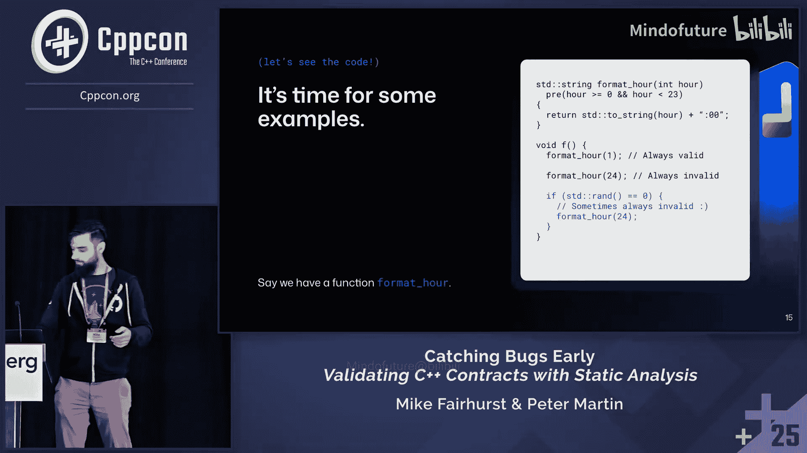

## 动机：为何需要静态分析契约？

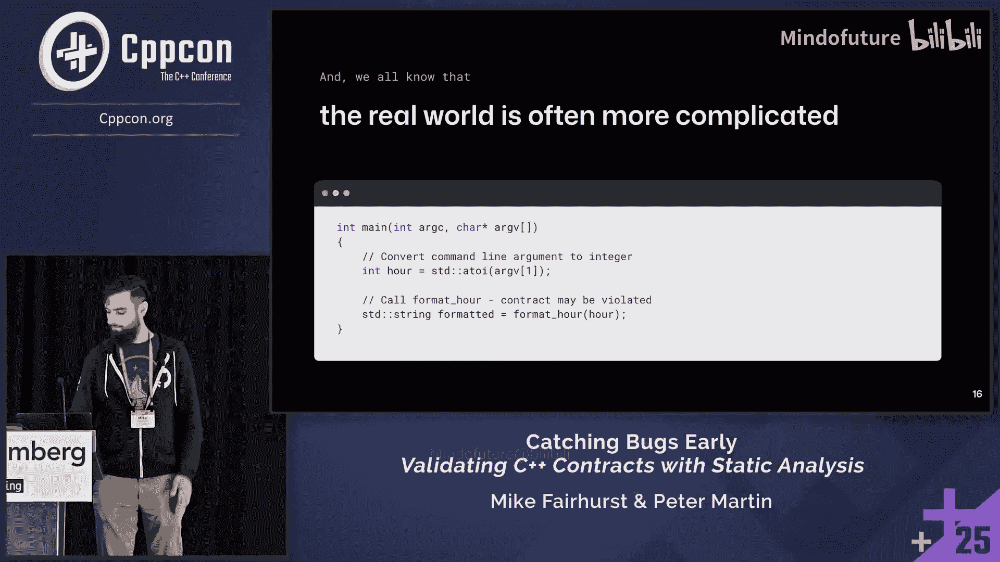

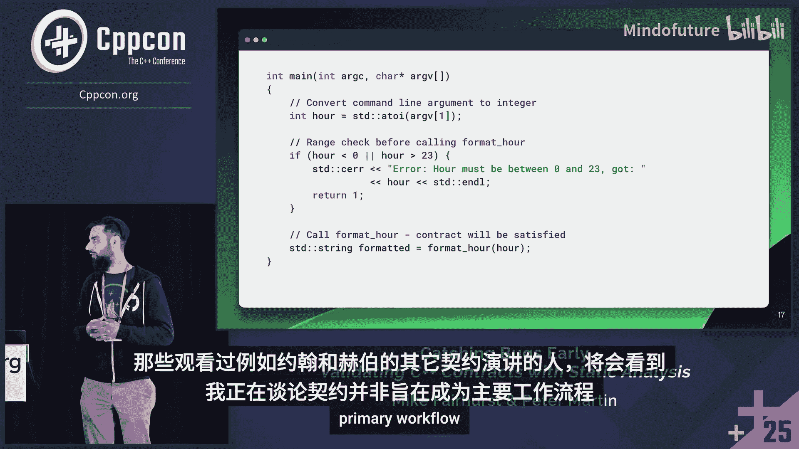

上一节我们了解了契约的基本语法。本节中，我们来看看为什么需要对其进行静态分析。

一个很自然的问题是：能否仅基于代码本身，识别出哪些函数调用违反了契约？如果可行，我们希望在程序运行前就发现这类错误。

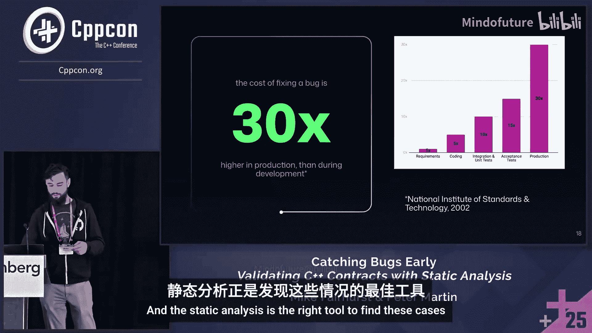

在测试阶段或CI/CD流程中发现这类错误，远比在运行时遭遇契约违反要好。有些契约违反可能隐藏在很少执行的代码路径中，或者运行时契约检查被关闭了。在这些情况下，静态分析仍然可以推理契约条件是否可能被满足。

虽然我们无法完全、全面地断言所有契约断言在运行时是真是假，因为布尔表达式可能依赖于仅在运行时可知的状态，但我们至少可以在部分情况下进行推理。如果能做到这一点，就有望提前捕获一些错误。

## 分析工具与方法：CodeQL与Z3

上一节我们探讨了静态分析契约的动机。本节中，我们来看看实现此目标的核心工具和方法。

### 静态分析的挑战与机遇

考虑一个简单的例子：
```cpp
void format_hour(int hour) pre(hour >= 0 && hour < 24);
```
对于调用`format_hour(1)`，我们可以轻易分析出它满足契约。对于调用`format_hour(24)`，我们也能轻易分析出它违反了契约。

然而，现实世界要复杂得多。考虑以下情况：
```cpp
int main(int argc, char* argv[]) {
    int hour = std::stoi(argv[1]);
    format_hour(hour); // 静态分析无法确定hour的值
}
```
仅从代码上下文，我们无法知道`hour`的值是否在有效范围内。这取决于运行时输入。

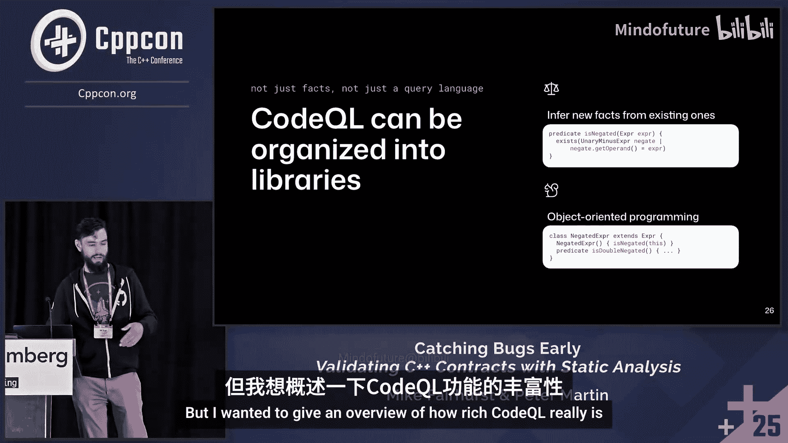

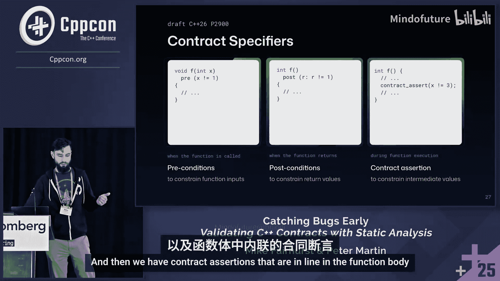

尽管如此，在调用前添加检查总是更好的做法：
```cpp
if (hour >= 0 && hour < 24) {
    format_hour(hour);
}
```
这样，静态分析工具就能看到这个检查，并可能进行不同的分类。

在开发过程中尽早发现错误成本更低。单元测试和模糊测试虽然有效，但只能覆盖手动选择或概率性探索的路径。静态分析擅长探索所有可达代码，是发现这类问题的合适工具。

我们的目标是找到那些通过充分的演绎推理可以推断出极有可能违反契约的特定位置，而不是追求形式化验证的完全正确性保证。

### 工具介绍：CodeQL

在GitHub，我们用于可定制静态分析的工具是CodeQL。CodeQL为C/C++等语言提供默认查询，涵盖SQL注入、缓冲区溢出等已知安全漏洞，也支持编码标准。

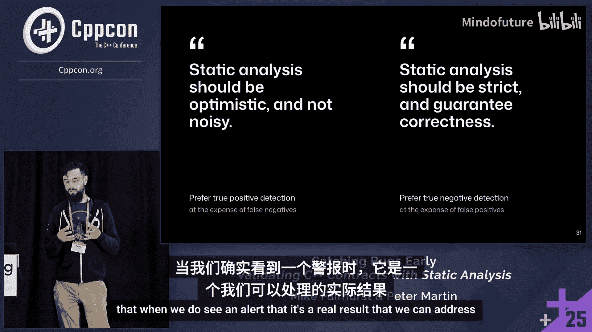

当编写CodeQL查询时，我们可以获得以下信息用于分析：
*   **类型信息**：程序中定义的所有类、结构体、变量类型、类成员等。
*   **完整语法树**：每个操作符及其操作数，以及`if`条件、循环等程序结构。
*   **控制流图**：了解代码如何从特定条件可达，包括循环和函数提前退出点。
*   **调用图**：对于C++尤其重要，已解析所有函数调用点和运算符重载。

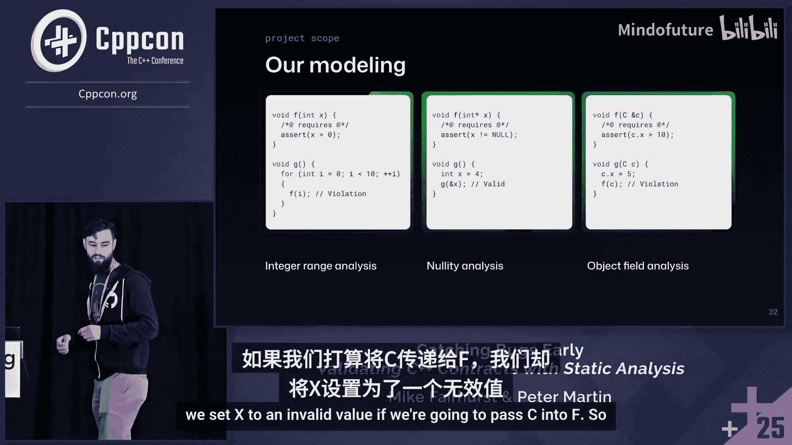

CodeQL的工作流程如下：
1.  提取器观察代码库的构建过程，追踪编译标志和文件。
2.  将所有关于代码的事实（表达式、语句等）聚合到一个数据库中。
3.  开发者使用Q L查询语言编写查询，并链接标准库。
4.  查询被编译成高度优化的形式，在数据库上高效运行并产生结果。

一个简单的CodeQL查询示例如下：
```ql
import cpp
from FunctionCall call, Function f
where call.getTarget() = f
select call, f
```
CodeQL不仅是一种查询语言，它非常丰富，支持定义谓词（逻辑语句）和面向对象编程，用于约束和操作数据集。

### 契约的静态分析难点

契约说明符（`pre`, `post`, `contract_assert`）的设计对静态分析提出了挑战。契约中的一个关键安全特性是，当在契约内部引用变量时，该变量会被隐式`const`化，以防止副作用。

然而，契约内部允许调用任意复杂度的函数，这可能导致内存分配等副作用，甚至未定义行为，使得静态分析变得困难。

尽管存在这些复杂性，我们相信并非所有契约都会使用这些灵活特性。我们的目标是探索那些不使用这些特性的情况，从而发现一些错误。

在开发静态分析时，通常有两种阵营：
*   **严格正确性阵营**：追求保证正确性，可以接受一定误报。
*   **实用主义阵营**：优先考虑低噪音，希望报告尽可能都是真实问题，可以接受漏报一些错误。

我们的方法倾向于后者。

### 引入定理证明器Z3

为了处理更复杂的契约条件（如参数间的依赖关系），我们引入了Z3。Z3是一个由微软开发的开源定理证明器（约束求解器），它使用SMT语言，能够快速求解逻辑约束。

以下是一个简单的SMT示例：
```
(declare-const x Int)
(declare-const y Int)
(assert (= (* x x) (* y 3)))
(check-sat)
(get-model)
```
Z3会输出理论可满足，并可能给出一个解，例如`y = 3`，`x = -3`。

你可能会问，CodeQL本身是逻辑查询语言，为何还需要Z3？原因有二：
1.  CodeQL无法动态“评估”代码中表达的约束。使用Z3，我们可以让CodeQL查询生成SMT语句，然后由Z3充当“求值”步骤。
2.  CodeQL和Z3解决不同问题。CodeQL是查询语言，给定约束，它查找所有解决方案。Z3则优化为找到一个解决方案或反例，速度更快。

### 整体分析流程

我们的整体分析流程如下：
1.  使用CodeQL分析目标程序，构建数据库。
2.  利用CodeQL的范围分析功能，推理函数调用点变量的可能取值范围。
3.  使用CodeQL提取被调用函数的契约（前置条件）。
4.  对于每个调用点，将变量范围信息和契约条件组合成一个SMT公式。
5.  将SMT公式输入Z3，询问契约是否可能被违反（即寻找一个反例）。
6.  Z3返回结果，如果可能违反，则提供一个反例值。

我们主要支持以下几种分析：
*   **整数范围分析**
*   **空指针分析**
*   **对象字段分析**（有限支持）

本教程将重点介绍整数范围分析。

## 评估：在真实代码上的实践

上一节我们介绍了核心的分析工具和方法。本节中，我们来看看如何在实际代码库中评估这种方法。

一个现实挑战是：C++26契约语法尚未广泛使用，编译器支持有限，包括CodeQL使用的编译器前端。因此，我们需要一种方法来测试这种技术。

我们利用Bloomberg的BDE库来解决这个问题。BDE代码库中有一些约定与契约功能相似：
*   **文档约定**：函数注释中常见的“行为未定义，除非...”，这实际上是用人类语言描述的前置条件。
*   **断言约定**：在函数实现开头使用`BSLS_ASSERT`系列宏来验证这些前置条件。这些宏的行为也可以通过构建标志配置。

对于评估，我们专注于从这些`BSLS_ASSERT`语句中推断契约。这带来了一个小的 logistical 挑战：在分析调用库函数的程序时，通常只有头文件，而没有`.cpp`文件。因此，库实现中的`BSLS_ASSERT`对分析不可见。

我们采用了第二种方案：对库进行一次性分析，总结其契约，并创建一个“规范数据库”，在分析调用该库的程序时提供这些契约信息。

### 评估设置与结果

我们选择BDE的日期功能作为评估目标，因为其契约可能主要涉及我们支持的简单算术和逻辑表达式。

我们通过内部元数据和源代码搜索，找到了约6000个调用BDE日期函数的项目。我们选取了其中的前1%（约60个）进行广度分析，旨在覆盖大量不同的函数调用。

在将契约限制为我们支持的语法后，我们能够处理日期库中约三分之一的函数契约，最终分析了约3000个调用点。

以下是总体结果（需注意许多注意事项，例如样本量较小、代码经过筛选等）：
*   **95%的调用**：可被静态验证满足契约。
*   **5%的调用**：无法被验证。**这并不意味着存在错误**。大多数情况是因为CodeQL的范围分析无法推理这些值（例如，值可能依赖于运行时状态），因此返回了最大范围（如`INT_MIN` 到 `INT_MAX`）。未来我们希望更好地自动分类这些情况。
*   **平均性能**：每个调用点的检查平均耗时约24毫秒（在配置一般的任务机器上），表明该方法具有可行性。

我们还通过故意注入错误来测试分析的有效性。例如，修改代码使传递给`setSecond`函数的秒数变为负数，我们的分析成功地将这些调用检测为契约违反。

## 未来方向与总结

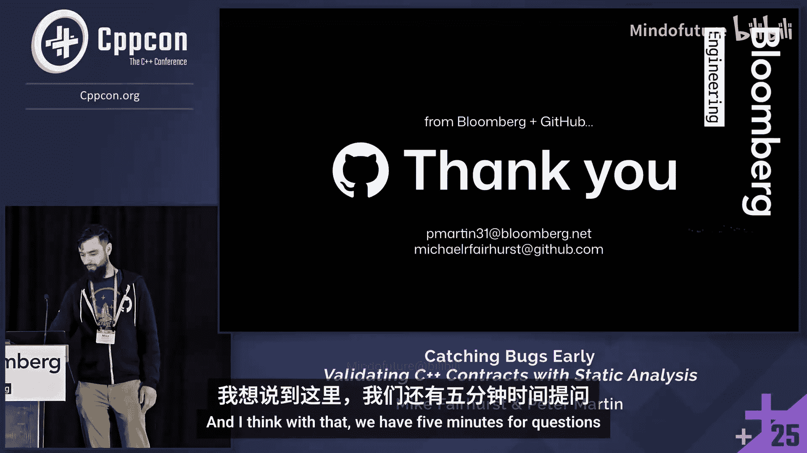

上一节我们展示了初步评估的结果。本节中，我们来看看未来的改进计划和本教程的总结。

### 改进误报与范围分析

我们识别出导致最多误报的两种情况：
1.  **无约束的范围**：当CodeQL的范围分析无法给出任何范围时，会返回`INT_MIN`到`INT_MAX`。例如，缺乏过程间分析时，对函数参数的约束可能无法传递。
2.  **范围分析的置信度**：CodeQL通过将程序转换为静态单赋值形式来进行范围分析。我们为范围分析添加了“来源”追踪，以区分不同置信度的结果：
    *   **低置信度**：例如，仅基于类型得出的最大范围。
    *   **中置信度**：例如，通过条件约束得到的范围（如`x < 10`）。
    *   **受循环影响**：在循环分析中，为了性能会进行“拓宽”操作，这会略微降低结果的置信度。

### 未来工作

我们的代码现已开源（GitHub链接），但请注意这是一个概念验证版本，尚未达到生产就绪水平。我们鼓励社区试用、报告问题或提交拉取请求。

我们目前正在探索一个更有前景的方向：**直接将程序的SSA形式编译成SMT公式**。由于SSA形式本质上是将可变变量转换为不可变常量，这与Z3的常量模型非常契合。这种方法可能让Z3为我们执行更高级的范围分析，例如：
*   理解中间不可取的值范围。
*   识别参数间的关联范围（如`x > y`）。
*   通过内联函数调用来更好地追踪变量状态。

### 总结与建议

本节课中我们一起学习了如何使用静态分析来验证C++契约。

本教程的核心要点是：**请编写契约**。

即使你编写的契约使用了复杂的运行时断言，你也已经能从单元测试、模糊测试和生产环境（如果开启）中获得巨大价值。除此之外，我们希望将你的契约视为对我们工具能力的挑战。工具只会越来越好。我们目前正在探索的想法可以将其推向更远。

静态分析是发现潜在契约违反的强大工具，与运行时检查、测试相结合，可以构建更健壮、更安全的软件系统。


---
**注**：本教程内容基于CppCon 2025演讲“及早捕获错误：使用静态分析验证C++契约”，由Peter Martin和Mike Fairhurst分享。所有代码示例和概念归演讲者及相关项目所有。