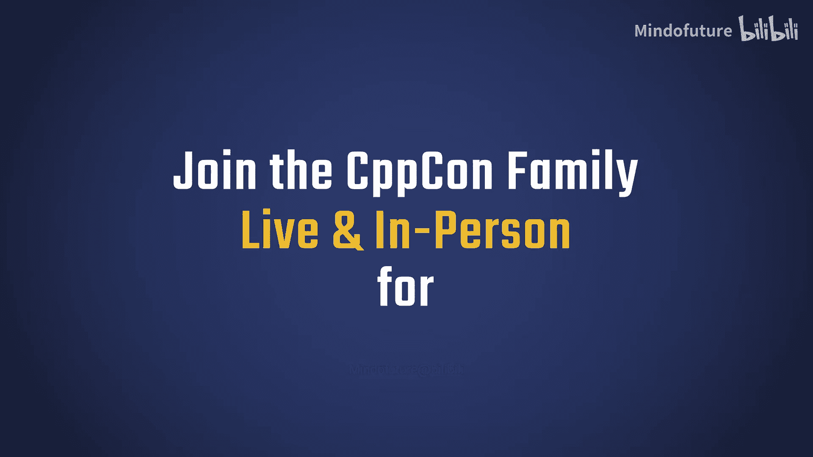
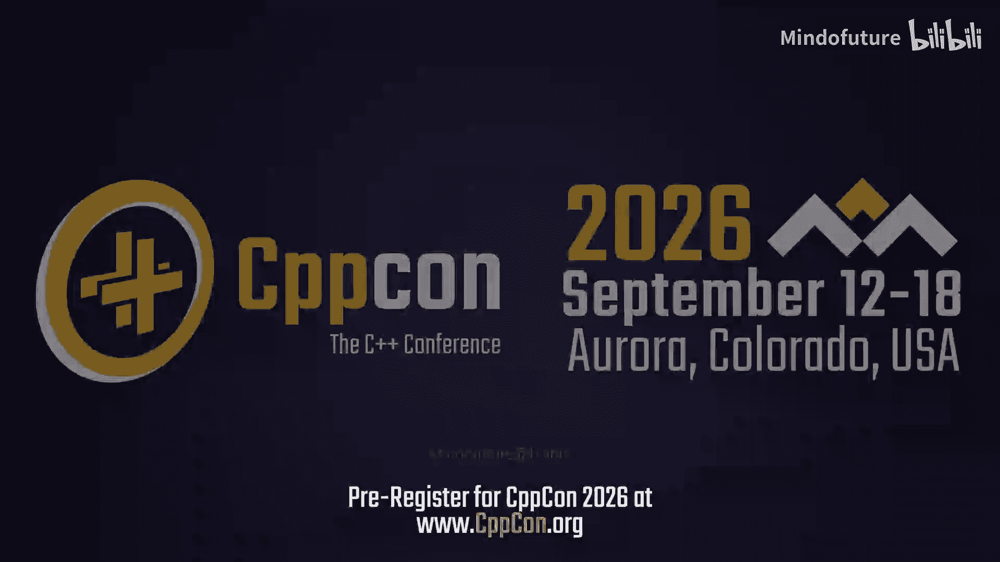
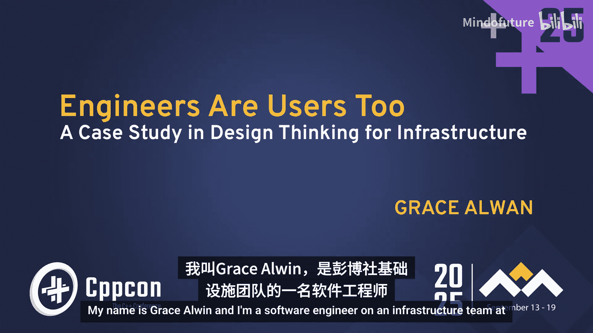
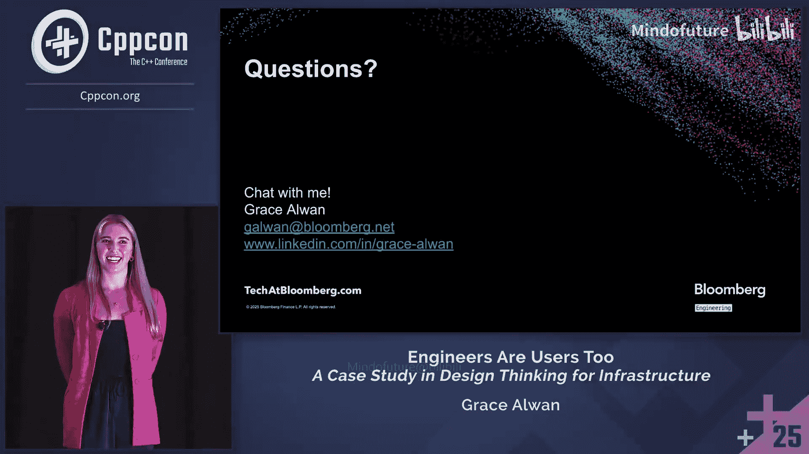
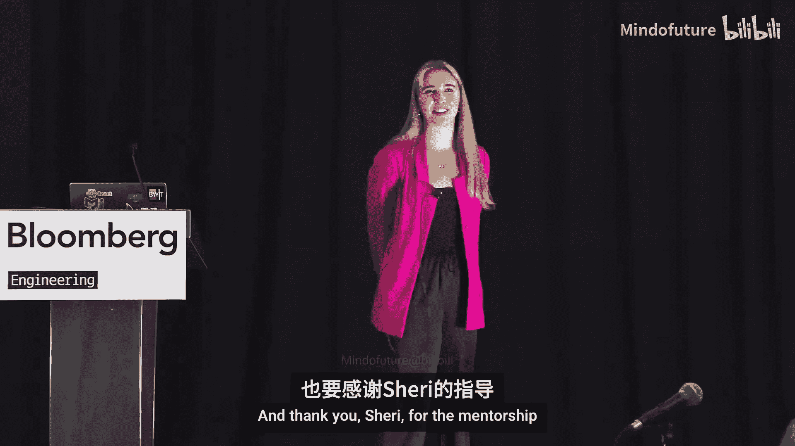

# 054：工程师也是用户 - 基础设施设计思维案例研究

在本节课中，我们将学习如何将用户体验设计思维应用于基础设施工具的开发。我们将通过一个来自彭博社基础设施团队的真实案例，了解如何通过用户访谈、原型设计和数据综合等方法，显著改善开发者体验，并提升工程师的工作效率与满意度。

## 概述

本次分享由彭博社基础设施团队的软件工程师 Grace Alllin 带来。她将探讨一个看似不寻常的组合：基础设施与设计思维。核心论点是：基础设施工具与开发者体验紧密相连，而开发者体验本质上就是一种用户体验，因为工程师也是用户。尽管我们都知道开发者体验很重要，但我们很少将其视为一个可以通过传统UX技术来解决的设计问题。本教程的目标是引导你了解如何使用UX技术来彻底改善开发者体验，如何应用这些技术，以及作为一名工程师，掌握这些技术将如何提升你的职业生涯。

---

## 从计算机科学到人机交互

上一节我们介绍了基础设施与设计思维结合的基本理念。本节中，我们来看看演讲者如何将计算机科学与设计工作融合。

演讲者 Grace 在斯坦福大学学习计算机科学，同时也爱上了将计算机科学与设计工作结合起来的领域，即人机交互。HCI 本质上是研究人们如何与技术交互的心理学，它包含了用户体验作为一个领域。这适用于所有类型的界面，包括用户界面、应用程序接口、物理产品、命令行界面或错误消息。任何人与之交互的事物都是一个界面，这不仅仅是制作漂亮的屏幕。

在她的课程中，她向HCI领域的先驱们学习，并亲身接触他们的研究。她的课程作业非常酷，不同于典型的计算机科学编码作业。她们会完成整个产品生命周期：首先识别问题，出去与人交谈，制作原型，测试这些原型，然后在一个学期内将它们编写成代码。这让她感到非常有趣，并爱上了这个过程。

这也是一个定义非常完善的框架，是每个设计咨询公司、初创公司以及任何进行整个产品生命周期工作的人的行业标准。毕业时，她拥有双重身份：她热爱实现方面的工作，肯定想成为一名工程师，同时也热爱产品的用户体验设计和用户体验研究。在大多数公司，这通常是两个独立的角色，但她认为，就像在学校一样，如果你参与了整个产品生命周期，这些技术可以结合起来并一起实践。

同样，由于用户体验适用于所有类型的技术，她认为如果她从事一份标准的软件工程工作，她可以将设计融入她的日常工作中。

---

## 在基础设施团队中寻找契合点

上一节我们了解了演讲者的学术背景和双重兴趣。本节中，我们来看看她如何在彭博社的基础设施团队中找到应用这些技能的机会。

彭博社为新毕业生做了一件非常有趣的事情：基本上有一个招聘会。团队都设立好展位，新毕业生和团队互相交谈，试图找到匹配。因此，这更像是快速约会。可以想象，她四处走动，与所有团队交谈，滔滔不绝地谈论她多么热爱用户体验和设计，以及她如何希望将设计融入她的工作。

这对大多数工程团队来说可能相当令人惊讶。大多数团队习惯于有独立的用户体验设计师来帮助他们解决用户体验问题，或者他们可能根本没有将这方面作为工作的重点。因此，当她提到用户体验研究过程或设计思维时，那可能只是模糊熟悉的东西。

然而，在她最意想不到的地方——一个处理集群管理的基础设施团队——那些人立即对她所谈论的内容感到兴奋和感兴趣，并说你应该加入我们。所以，这是一次匹配。

她承认，基础设施和用户体验之间的这种匹配并不明显，因为本能和大多数公司倾向于做的是将宝贵的用户体验资源投入到面向客户的产品上，那些赚钱的产品。而真正忽视开发者工具的体验。毕竟，这些开发者工具的用户是工程师，我们很聪明，善于解决问题，我们可能就能搞定。但是，请举手，谁没有在帮助或投入大量时间的情况下就无法搞定某件事？是的，视频里，我看到很多人举手。我们都曾感受过这种开发者体验的痛苦。

随着公司的发展，基础设施的复杂性只会不断增长，那种认知负荷和痛苦只会不断增长。因此，如果你忽视了开发者工具的用户体验，作为一家公司，你将经历时间损失、工程师挫败感、工程速度减慢，甚至可能导致职业倦怠。老实说，这对我们所有人来说都不足为奇，对吧？我们都刚刚举了手。我们以前都感受过这种痛苦。

我们知道拥有良好的开发者体验很重要。但并非总能意识到的是，开发者体验可以作为一个设计问题来构建，并使用那些改变了消费软件面貌的相同用户体验技术来解决。正是这个框架和过程，你可能没有太多实践。

你可能在日常工作中会做一些这样的事情，比如梳理用户旅程、解析日志以查看人们如何使用你的产品，甚至仔细命名端点以确保可用性。这都是其中的一部分。但她希望你今天能带走的是：有一个过程可以让你保持条理，它是可重复的，并且成为行业标准是有原因的，因为它经过测试并能产生良好的结果。

今天我们将通过一个案例研究来学习这个，因为在她职业生涯的第一个项目中，她使用了这个用户体验框架，并带来了一些非常积极的结果，不仅在项目目标方面，也在她的职业生涯方面。因此，她希望你今天能带走这两方面的收获。

---

## 案例研究：集群管理问题

上一节我们探讨了在基础设施中应用设计思维的必要性。本节中，我们来看看演讲者在其基础设施团队中遇到的具体问题。

在她新加入基础设施团队的第一周，她正在了解团队的工作，并试图理解公司工程师如何设置他们的产品和服务。在彭博社，你将代码部署到内部机器上。要设置这些机器，首先你有一个父集群。这在行业中很常见，父集群包含你的产品或服务可能需要的所有东西。然后你在该父集群内有集群，例如开发、测试和生产环境。然后在那些集群内启动主机。

但是要设置这些集群，需要很多工具。首先，你必须去一个界面设置你的父集群，填写一堆配置，然后点击提交。然后你必须为你想要的每个集群都这样做。所以开发、测试、生产，你已经完成了四个步骤。然后你必须去另一个界面，为你想要的每个集群执行另一个添加额外元数据的步骤。

这里有很多配置。几乎超过一半的属性，有些没有文档记录，有些已弃用，有些据说是可以忽略的，尽管没有人能百分之百确定告诉我哪些可以忽略。90%的用户对默认配置很满意，他们不必费力处理所有这些，但我们仍然让他们这样做。

这导致了碎片化的系统，需要去两个不同的界面。这是一个容易出错的过程，只会导致挫败感。

那么，当你面对这样的问题时，你通常会怎么做？你会与你的主题专家交谈，编写一份设计文档，并根据你的最佳猜测来决定做什么。但她的团队领导记得她对用户体验的热情，说：“Grace，我们为什么不在这里尝试使用用户体验框架呢？”

---

## 用户体验设计框架

上一节我们明确了要解决的问题。本节中，我们来看看解决这个问题的核心方法论：用户体验设计框架。

典型的用户体验框架是这样的：**与用户共情**，**定义**你的问题空间、所有背景以及你对用户的了解，**构思**、头脑风暴，**制作原型**，然后**测试**这些原型，然后**迭代**再迭代。这个过程不一定是线性的，尤其是在迭代时，你会跳来跳去。比如说，我刚刚测试了一个原型，我对用户有了更多了解，我会跳回到共情步骤。一旦我对用户有了更多了解，我会在定义步骤中添加更多背景信息。你只需不断迭代，直到对结果满意为止。

这个用户体验框架被如此广泛地使用并成为行业标准，是因为它做了几件事。首先，它使你条理化，并帮助你拥有一个框架来应对巨大的问题。它迫使你将与用户共情作为工作的首要任务。它还促进测试和迭代，而不是仅仅依靠第一直觉。

另一个额外的好处是，它带来了一个记录非常完善的过程，因为你会在整个过程中记录一切。当人们质疑为什么做出某个设计决策时，或者当人们想要重复你的过程时，这会派上用场。

当她向团队展示这个过程以及她将要制作的所有原型和文档时，团队实际上对这种解决问题的新方法感到非常兴奋。这是一个完整的工程团队。听到这个她很开心，因为她承认对整个事情有点担忧，因为这是一个全是工程师的团队，而这并不是工程师日常的典型工作。她希望确保这项工作会受到重视，并且如果她在这里花费时间，这将被视为创造价值和有用的东西。

---

## 定义问题空间与目标

上一节我们介绍了设计思维框架。本节中，我们开始应用这个框架的第一步：定义问题空间。

我们已经通过查看现有的两个界面进行了一些共情。所以我们已经感觉到有些事情可以改进。

现在是时候定义我们的问题空间，并真正清晰地陈述我们的目标、假设和一些开放性问题了。

**目标**：
我们想要简化集群管理，以防止错误、混淆和挫败感。

**假设**：
*   我们可以通过用户界面或应用程序接口将所有内容集中到一个地方，这样人们就不必去那么多不同的界面。
*   如果配置可以从父集群继承到子集群，用户就不必填写那么多东西。
*   如果我们的默认值可以更智能，我们就能帮助那90%的用例不必填写那么多配置细节，甚至不必担心是否选择了正确的东西。

**开放性问题**：
*   当前流程中哪些地方令人困惑？
*   我们向用户提出了哪些他们不理解的问题？
*   我们制作的原型是否能解决之前碎片化系统的痛点？

她记录了所有这些，并在开始任何工作之前向团队做了展示。请注意，通过列出所有内容，我们现在达成了共识。这也向我们的利益相关者证明我们是有条理的、以研究为导向的，并且对整个项目非常深思熟虑。

---

## 进行用户访谈

上一节我们明确了目标和假设。本节中，我们进入框架的关键步骤：进行用户访谈。

首先，我们出去采访人们。这是用户体验框架中非常关键的一步，可以说是最重要的步骤之一。因为非常重要的是，你不能假设你对你的产品或产品的用户体验有任何了解。你必须与用户交谈。你还必须倾听他们说什么、怎么说，并观察他们如何与你的产品互动，而不是仅仅问他们“你喜欢这个吗”、“需要改进什么”。因为访谈是关于真正深入了解产品体验的。

因此，她采访了工程师，也就是她团队产品的用户，她进行了30次访谈，这很多。这意味着有时她的日程安排看起来像这样，她意识到这对工程师来说并不正常。尽管这偶尔会让人筋疲力尽，并且确实占用大量时间，但这非常非常重要，因为正如她之前所说，这是关于观察人们与你的产品互动时做了什么，而不仅仅是问他们是否喜欢。因为如果你问，你会得到非常表面的答案，甚至可能只是“是”或“否”。

那么，如何为这些访谈做准备呢？你必须真正用心构思正确的问题。因为你想问开放式的问题，引出故事，真正深入挖掘使用某物的体验，而不是询问设计决策或是否问题。你是在寻找数据来为你的设计决策提供信息，而不是为你的设计问题寻找答案。

因此，与其问“今天集群创建有什么问题？”、“你喜欢这个新设计吗？”、“这种创建集群的方法不是更好吗？”（这个真的很疯狂，永远不要这样做）、“这个错误信息清楚吗？”、“按这个按钮来做某事，你觉得怎么样？”，她反而会问：
*   你能给我展示一下你今天是如何创建集群的吗？
*   告诉我你上次运行那个命令的情况。
*   你在那里犹豫什么？
*   你认为这个按钮是做什么的？
*   当你看到那个错误时，你感觉如何？

请注意这些问题有多么不同。作为受访者，我立即被置于不同的心态中，我在反思，我要讲故事，而不仅仅是说“是，我喜欢这个”或“不，我不喜欢”。

设计师在进行访谈时使用的另一种技术叫做“出声思考法”，即要求人们叙述他们使用某物的体验。她经常告诉人们把想到的任何东西都“大脑倾倒”出来，就像字面上任何进入他们意识流的东西。让我们举个例子。

如果她在叙述这次会议的日程安排应用程序（是读作 schedule 吗？），她会说：“我要看这里。我看到演讲列表。我看到颜色。我想知道颜色是什么意思，但我看到侧边栏上有轨道和相应的颜色。所以我认为颜色表示轨道。我对这个按钮的作用有点困惑。它看起来像一个选择，所以我要点击它。哦。它被添加到我的日程中了。好吧。我没想到会这样。它看起来像一个选择，我以为我可以选择多个演讲，然后可能会弹出一个菜单，我可以对所有选中的演讲一起执行操作，但我很欣赏它给了我即时反馈，告诉我它已被添加到我的日程中，所以我没有困惑很久，这让我很欣赏。”

你听到了吗？这与仅仅问我是否喜欢这个应用程序完全不同。首先，你看到了我如何建立起将轨道与颜色联系起来的心理模型。然后你也听到并看到了当按钮的行为与我的预期不同时我的惊讶。

她说“听到和看到”，希望你们注意到了，因为通过肢体语言看到的可能比通过语言听到的更重要，因为我们的大脑实际上是通过身体反应，然后才能说出来。所以当她站在这里叙述时，你们可能看到我皱起了眉头，身体向后靠，因为我感到惊讶。作为采访者，她正在疯狂地记下这些。这非常重要。如果有人没有告诉我他们给出的那些肢体语言暗示，我会问他们。所以如果有人叹气或皱眉，我会说：“为什么拉长着脸或大声叹气？”这比他们告诉我的更有信息量。

回到她的项目，当我们要求人们带我们了解他们今天如何创建集群时，我们听到了什么？她听到：
*   新用户没有帮助就无法创建集群。
*   我六个月前创建了一个集群，我以为我可以再做一次，但我不能。
*   有很多人问我，这个是做什么的？那个是做什么的？这是什么意思？
*   她听到了很多关于错误的抱怨。

同样有趣的是，几乎她交谈过的每个团队都开发了自己的关于如何完成整个流程的文档。这立即向她表明，工具没有充分教会他们，因为一个好的工具应该是自解释的。

这些收获并不是她访谈中唯一有趣和有见地的内容。工程师们喜欢被采访，她的参与度直线上升。真的。他们问她如何学会做这个。他们询问了这个过程。当她疯狂打字时，他们带着好奇的微笑看着她，这很可爱。他们甚至要求随时了解项目的状态，以及我是否会对我们产品的其他部分也这样做。

她只想在这里暂停一下，因为人们要求随时了解一个他们甚至没有参与的项目，这有多疯狂？这在工程中并不常见。我们是如何做到这一点的？正是通过访谈和倾听所培养的人际联系，让用户感觉他们对这项工作有既得利益。

这种兴趣和人际联系也导致了她和受访者之间建立了巨大的信任，这将为未来的更好合作铺平道路。她还要指出，访谈是一个巨大的职业可见性胜利，仅仅因为她与这么多人交谈过。她的职业网络以巨大的方式增长，人们变得很乐意在产品或用户体验问题上听取她的反馈。

---

## 制作原型

上一节我们学习了如何通过访谈收集宝贵的用户洞察。本节中，我们来看看如何将这些洞察转化为具体的设计方案：制作原型。

原型设计是用户体验设计的另一个重要部分，它非常重要，因为正如我们所知，文字只能走这么远，原型对于传达新想法至关重要。看看阅读一份10页的设计文档与能够与模拟界面、模拟屏幕或模拟服务器交互之间的区别。一个是抽象的，你必须做一些思维体操来思考这将如何在实际中呈现、感受和实践。另一个则立即清晰，用户可以设身处地地实际使用产品，他们可以给出更有意义的反馈，根据她的经验，当人们看到原型时，实际上会激发他们自己的思维，所以你会得到更多来自利益相关者、队友或受访者的想法。

这里的另一个好处是，如果你制作原型，你将在不编写任何代码的情况下，就某个实现获得具体的反馈。在将开发时间浪费在文档形式上可能已经获得“LGTM”的东西之前。

那么，让她猜猜你们中的一些人在想什么。这一切都很好，我知道原型很重要，但你到底怎么知道要设计什么？我们不是设计师。我们是工程师。这是某些人的工作，而发挥创造力真的很可怕。

她听到了。但她在这里要告诉你，设计本能是100%可以学习的。它们实际上是建立在多年研究基础上的。这个研究点实际上非常有趣，这是她在学校时爱上用户体验领域的原因之一。所以她实际上想和你们分享她最喜欢的一篇论文。这很快。它叫做“表面计算的用户定义手势”，发表于2009年。

在这项研究中，用户坐在一张模拟表面计算设备的桌子前（这是在平板电脑、iPad之前）。桌子上方有一个摄像头，捕捉桌子和他们的手。研究人员问参与者：“你可能会如何导航？你可能会如何缩放？你可能会如何删除文件？”他们捕捉了数小时的视频片段，记录了用户用手做了什么。那些访谈数据、反应、肢体语言的情绪。他们将所有这些汇总成模式，最终得出一些启发式方法和指导原则，这些将为我们今天使用的所有触摸屏手势提供信息。这就是我们如何得到“捏合缩放”的。这不是很酷吗？她觉得这太神奇了。

说到这些启发式方法，用户体验研究中最重要的一项学习实际上是这10条可用性启发式方法。她今天实际上要全部讲一遍，因为它们对于学习我们试图学习的设计本能是如此核心。实际上，其中很多对你来说已经感觉很熟悉了，因为即使你不知道这些名字，你也感受过这些感觉，因为我们都与好的或坏的设计互动过。

以下是这10条可用性启发式方法：

1.  **状态可见性**：了解我在表单中的位置。我能否通过端点查询我的请求状态？
2.  **系统与现实世界的匹配**：我们希望使用领域对齐的语言和通用语言，这样人们在使用你的系统时就不必学习新的术语。
3.  **用户控制与自由**：用户会犯很多错误。他们也可能处于探索心态，只是随意点击、随意调用。因此，我们需要为用户提供清晰的前进、后退和紧急退出机制，以及试运行调用和回滚调用。
4.  **一致性与标准**：用户不应该怀疑在你的界面中，相同的术语、错误信息或操作是否意味着相同的事情。它们应该一致。
5.  **防错**：好的设计首先防止错误发生。所以这涉及到验证、强类型，或者对破坏性操作设置防护栏。
6.  **识别胜于回忆**：这回到了认知负荷。我们希望使信息易于查看或查询，这样用户就不必记住事情。
7.  **灵活性与效率**：每个系统都会有高级用户和新手用户，我们希望迎合两者。因此，对于那些高级用户，我们会给他们快捷方式、可配置性，并且我们会向新手用户隐藏这些功能，直到他们准备好。
8.  **审美与简约设计**：界面不应包含无关、不需要或多余的信息。
9.  **帮助用户识别、诊断并从错误中恢复**：这是关于好的错误信息。错误信息应该具有描述性和可操作性，以便用户可以自助。
10. **帮助与文档**：我们应该到处都有文档，这样人们可以自己了解系统，再次自助导航和解决问题。

好了，这些都很好。我们现在知道了我们的设计本能，但发挥创造力仍然很难。那么如何开始制作原型呢？关键是从低保真度的想法开始，这些想法应该非常非常混乱。而且你希望有很多这样的想法。一旦你以混乱的方式探索了很多想法，你就可以慢慢提升到感觉更真实的东西。那将是你的高保真原型。

你不想一开始就尝试高保真，因为这不仅从一开始就制作完美的东西非常令人生畏，而且可能是不可能的。而且你也会把自己局限在一个单一的想法中，而在一开始你真的应该探索很多想法，这就是低保真原型设计的作用所在。

实际上有一个非常有趣的活动用于生成低保真想法，叫做“疯狂八分钟草图法”。这通常用于用户界面，但你可以在这里发挥创意。具体做法是：你拿一张纸，对折，再对折，再对折，直到你有八个象限。你每分钟在每个象限上画一个完全不同的想法，它们应该非常混乱，超级混乱，甚至比这些更混乱（这是Cha GPT能做到的最混乱的程度了）。这里“疯狂”的部分，为什么叫“疯狂八分钟”，一是因为你疯狂地画草图，试图在一分钟内完成一个想法。但也因为你可以使用这些愚蠢的约束来尝试打开你的思维，它们是故意愚蠢的，因为它真的能激发创造力。例如，约束可以是：“如果我希望我的用户一键完成某事呢？”“如果我有无限资源呢？”“如果我出于某种原因希望这花费超过20分钟呢？”

然后，这个过程的神奇之处在于数量，因为如果你和一个五人团队一起做，突然在不到10分钟内，你有了40个想法，这太棒了。她正是这样做的。她和她的团队一起进行了这个活动。这对他们中的许多人来说是第一次做这样的事情，真的很可爱。然后我们有了40个想法，我们把它们放在一起，看到了共同点，并收敛到一个我们认为可以开始的好地方。

从那里，我们开始构建我们的高保真原型。对于高保真原型，她使用了设计师用来制作原型的相同工具，因为她认为在没有代码的情况下获得几乎真实的观感和感觉非常重要。高保真工具允许你连接点击事件和动画，真正模拟界面的确切风格（当然，这是针对用户界面的）。无需任何代码，且时间显著减少。

现在，回想一下当她最初向团队提出这个用户体验框架时，她对整个事情有点担忧。这次也不例外。她在原型上花了很多时间，她确实时不时地担心成为工程团队中的“设计女孩”。她希望确保自己正在发展正确的技能，并建立她想要强化的正确的个人品牌。

但是，当她的用户在访谈中与她的原型互动时，一切都值得了，因为就像那些访谈一样，工程师们喜欢有原型。他们非常兴奋可以点击浏览。她可以看出他们比典型的设计评审有更多的乐趣。他们喜欢可以点击。他们问她关于软件的事。他们问她如何学会做这个。她也知道，如果她没有这些真正高保真的原型可用，她得到的反馈是不可能的。

因此，用户的反馈以及来自团队和管理的认可，认为这是项目的一个很好的部分，足以让她对整个事情感觉良好，并意识到这可以成为她擅长的领域。而且，她现在很高兴地报告，她的整个团队现在为任何项目都制作模型。我们都在集群管理领域，我们都制作模型。谢谢。是的，我们现在为每个项目都制作模型，因为市面上有各种各样的工具，学习曲线各不相同。所以任何人都可以开始。你甚至可以从铅笔和纸开始，然后把它们放进你的设计文档中。这比仅仅用文字要好。

回到她的项目，当我们展示这些原型时，我们听到了什么？她听到了很多积极的东西，比如：“这很流畅。”或者“我很快就完成了，因为这很熟悉。”“这很简单明了，我根本不需要思考。”这听起来像是低认知负荷。她也看到了很多微笑，这让她很开心。

她也听到了很多需要改进的地方。她实现了一个相当复杂的表单，因为设置基础设施需要所有配置，所以导航必须调整几次才能达到清晰的效果，而且人们一次看到所有选项也有些不知所措，所以她正在努力实现一些不那么令人不知所措、对每个人来说都立即流畅和清晰的东西。

---

## 综合数据与得出结论

上一节我们通过原型设计将想法具体化并收集了反馈。本节中，我们进入框架的下一步：综合所有数据并得出结论。

最后，是时候综合我们的数据了。我们又回到了定义步骤，因为我们已经收集了所有数据，我们可以将其吸收为新的背景信息。

经过那30个小时的访谈，她有一大堆数据，你可以想象。那么，你如何开始理解这些呢？用户体验的答案是叫做“亲和图”的东西。

具体做法是：获取每个原子数据片段（可以是一句引述、一个单一的故事、一种单一的情绪），你把它们放在便利贴上。她数字化地做了这个，并把每个用户用不同的颜色表示。然后你开始根据共同的主题对便利贴进行分组。这些主题可以是共同的挫折点、界面的某个部分，或者只是一种共同的情绪。如果你觉得可以，再做第二轮，你可以做任意多轮，直到你从研究中得出核心主题。

在这里，她用黑色便利贴表示她的主要收获。突然之间，她从数百个数据点变成了仅仅几个主要收获和主题，这很棒。这里的另一个好处是，每个主题都附有导致该决定的所有引述和故事。这对于能够回顾并看到你为什么做这些事情真的很有帮助。

那么，我们学到了什么？我们验证了我们的假设，即当前流程去那么多不同的系统是令人沮丧和困惑的，我们需要自动化更多并提供更多默认值，以便用户可以使用标准配置。我们发现，路径导航和在导航中的信心非常重要。我们还需要确保人们对他们的选择有信心。所以，在整个原型设计过程中，需要调整以帮助用户对整个过程充满信心。

我们还了解了用户想要和不想要的工作流程。我们听到人们想要克隆集群的能力，他们希望自动填充，他们希望为每个团队提供可配置的模板。我们还听到用户从不同时编辑和添加集群，所以我们不需要用一个系统承载太多东西。当然，对文档有强烈、强烈的需求。人们对这个过程真的很困惑，因为基础设施很复杂，而且通常直到你进入职场才会学到。因此，在我们的系统中分散提供文档将帮助人们学习。

这里的收获是：能够通过数据得出这样的结论，而不是仅仅依靠传闻知识、先前经验或传说，这正是用户体验框架带给你的。同样独特的是，看到微笑、沮丧或垂头丧气的肩膀如何被量化为数据，让你得出这样的决定。而且，如果你展示来自人类体验的数据来驱动你的设计决策，对你的利益相关者来说也更有说服力和影响力。

---

## 成果文档与职业影响

上一节我们通过数据综合得出了关键洞察。本节中，我们来看看如何将整个过程整理成成果文档，并探讨其对职业生涯的影响。

最后，我们到了成果文档，这是我们用户体验框架的压轴戏。这是一种全面的方式，向我们队友、利益相关者以及所有希望随时了解情况的受访者传达我们所做的一切。

我们将包括以下内容：
*   我们的问题和背景，并真正清晰地定义我们着手解决的挑战。
*   我们的方法：我们和谁谈过？我们如何进行访谈？问题是什么？我们如何制作原型？
*   我们的发现：所有主要主题，以及导致这些发现的引述和故事。
*   我们所有的设计迭代以及每个设计决策的理由。
*   最后，关于如何实施项目的建议。

她还喜欢附上一个附录，包含所有亲和图的截图、所有原始访谈数据、早期原型、疯狂八分钟草图，因为这描绘了一幅所有已完成工作的美好图景，并显示了你有多么深思熟虑。

她也很高兴地报告，这份文档不仅仅是一份漂亮的总结。对她来说，自项目结束以来，它一直存在（她一年多前做的这个项目），至今仍被引用。因为它为未来的项目提供了灵感，也是如何开展未来项目的灵感。其他团队也请她帮助在他们自己的工作流程中实施这个过程，这真的很好，因为这意味着用户体验实践正在彭博社的基础设施组织中传播，这太棒了。

现在，我们到了我们的收获。为什么这行得通？
*   **设计思维框架**给了她过程和条理性，以应对这个技术性强且模糊的问题空间。
*   **访谈**给了她共情和证据，以此做出设计决策。
*   **原型**激发了创造力，并鼓励所有利益相关者早期达成一致。
*   **综合**给了你主题和方向。
*   **成果文档**给了你可信度，并便于回顾你所做的事情。

所有这一切改变了她的职业生涯。她绝对被认为是拥有出色产品和用户体验本能的工程师。这已经成为一种超能力，不仅改善了她的工程工作，也是她可以指导和支持其他团队的领域，能够在职业生涯早期做到这一点真是太棒了。这也是她可以用来发展个人品牌的领域。

因此，她对你的挑战是：你不需要成为设计师就可以开始使用这些策略。你可以从小处着手，采访一位队友关于他们的工作流程。你可以用铅笔和纸画一个原型草图，并把它们放进你的设计文档中。你可以将你不常展现的个性元素带入你的日常工作，比如你的访谈技巧、你的共情能力、你的倾听能力或你的健谈。你只需要不断重复、重复、再重复。那就是迭代。又是设计思维。因为随着你不断重复这个过程，你会变得越来越好，达到一定水平，届时你将看到职业回报。

任何人都可以做到这一点。任何技术栈级别的人都可以做到，因为无论界面是什么，我们发布的每个界面都会对某人产生一种体验。因此，我们应该像编写代码一样精心设计这种体验。

---

## 总结

在本节课中，我们一起学习了如何将用户体验设计思维应用于基础设施工具的开发和改进。我们通过一个具体的案例，详细了解了设计思维框架的各个步骤：从与用户共情和定义问题，到通过访谈收集洞察、制作高低保真原型进行测试，再到综合数据得出结论并形成成果文档。这个过程不仅能够显著提升开发者体验，减少错误和挫败感，还能增强工程师之间的协作与信任，并为实践者带来职业上的可见度和个人品牌的提升。记住，工程师也是用户，精心设计他们所使用的工具，就是投资于整个组织的效率与创新。