# 055：2025年Visual Studio为C++开发者带来的新功能

## 概述

在本节课中，我们将学习Visual Studio 2025为C++开发者带来的主要新功能和改进。课程内容涵盖从代码编辑、库管理、项目构建到调试诊断和源代码控制的完整开发流程。

---

## 主要公告

我们首先介绍一些重要的公告。

Visual Studio 2026预览版现已发布。我们强烈建议您尝试使用。它可以与VS 2022并排安装。

您的反馈对我们至关重要。无论是通过调查问卷、在展台交流，还是提交开发者社区工单，我们都非常重视。

在过去12个月中，C++团队处理了近400个问题，并完成了近30个功能请求。在整个Visual Studio范围内，我们修复了近4500个问题，完成了近300个功能请求。这涵盖了从其他语言到编辑器、调试器等核心Visual Studio功能的所有方面。

再次强调，填写我们的调查问卷是您向我们提供反馈的机会。

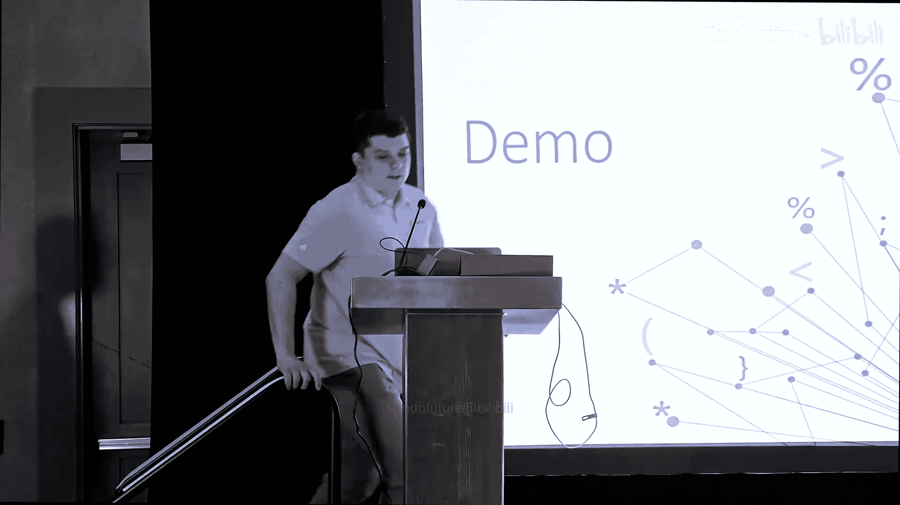

Visual Studio 2026拥有全新的外观和感觉。我们提供了全新的UI和多种不同的主题。您将在今天的演示中看到部分内容。

设置页面已完全重新设计。您可以通过一个全新的界面访问和搜索所有设置。

您的所有扩展都将正常工作。如果您从VS 2022升级到2026，您的扩展将像在2026中一样工作。

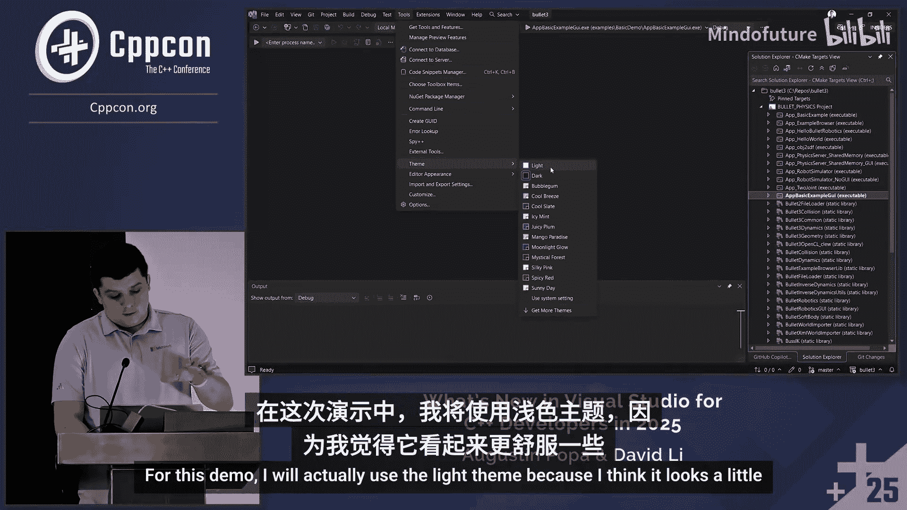

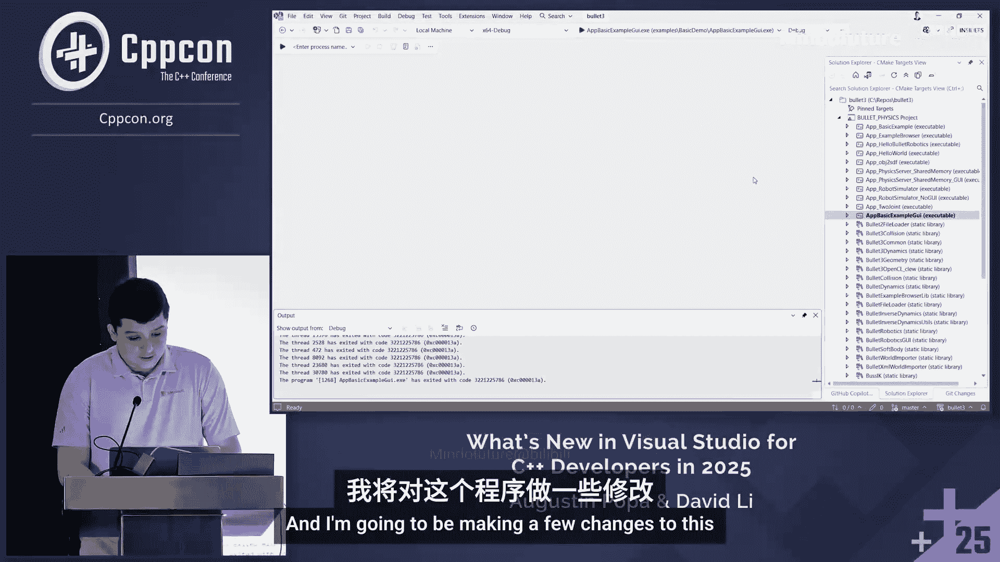

最后，这是我们与Copilot最深度的集成。Copilot将在您编码过程的每一步为您提供帮助。我们稍后将通过演示展示最新的集成功能。

---

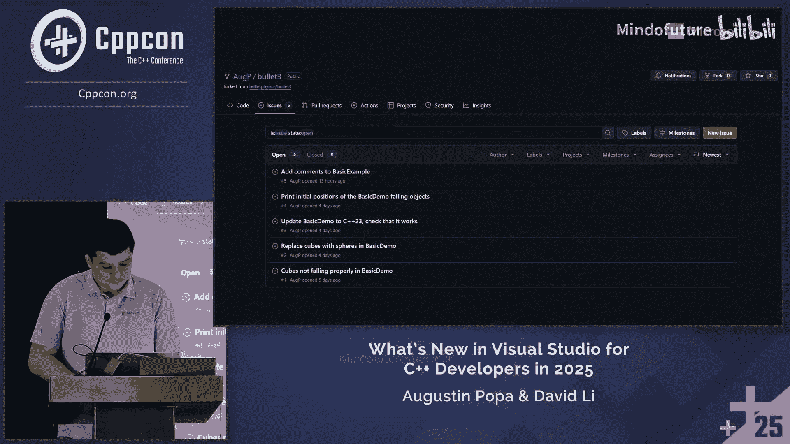

## 编辑与导航改进

上一节我们介绍了主要公告，本节中我们来看看最新的编辑和导航改进。

我们将从展示Visual Studio 2026的演示开始。

这是Visual Studio 2026在预览通道中的外观。我目前打开的是深色主题，但您可以在工具中选择主题。我们有11种不同的主题选择。为了演示效果，我将使用浅色主题。

我已经打开了一个名为“Bullet”的CMake项目，这是一个物理SDK。这是一个示例应用程序，模拟一堆立方体下落。我将对此程序进行一些修改。

以下是演示中计划进行的更改：
1.  让下落的物体靠得更近。
2.  将物体从立方体改为球体。
3.  用注释正确记录代码。
4.  使用程序运行时弹出的控制台窗口，打印物体的初始位置。我将尝试使用一些C++23功能。

首先，我需要找到对应的代码文件。这是Visual Studio中的统一搜索体验。它的UI看起来有些不同，我稍后会谈到这一点。

它的工作方式与以前相同，您可以搜索文件、类型或其他代码符号。我将其过滤到`basic_example.cpp`文件。

我想找出如何修改文件以使下落的物体靠得更近。为此，我将切换到GitHub Copilot聊天窗口。我目前使用的是“询问”模式。您可以选择多种不同的LLM模型。对于此任务，我想使用GPT-4.1。

我将询问Copilot如何修复下落立方体之间的间距。在它分析的同时，我来谈谈统一搜索体验的新UI。

您可能习惯了搜索体验在屏幕中央弹出。现在有一个按钮可以让您将其停靠在任何位置。目前我将其停靠在左侧。您可以将其拖放到任何喜欢的位置，因为它基本上变成了Visual Studio中的一个工具窗口。

我们仍然拥有所有不同的过滤器。您也可以输入`f:`或`t:`来查找特定内容，或者通过输入冒号和行号跳转到特定行。还有功能搜索，如果您想查找Visual Studio功能。

现在，我刚刚在文件中向下导航了一点，Copilot也完成了分析。它确定有一个三重for循环，其中有一些乘数决定了下落立方体之间的间距。我将更新这些值，使其变小，这应该能让立方体靠得更近。

我进行了更改，然后尝试再次运行。立方体靠得更近了，它们形成了一个大立方体。看起来成功了。

接下来，我将切换到Copilot的“代理”模式，让它将下落物体从方块改为球体。我还会将模型更新为Claude 3.7。

“询问”模式基本上是问答形式，就像您可能使用过的任何AI聊天界面一样。但“代理”模式实际上可以为您在整个代码库中实施更改。它拥有大量上下文，可以逐步找出需要做什么来满足您给出的提示。

在这种情况下，它将尝试找出如何更改这些物体，使其显示为下落的球体而不是立方体。它正在后台运行。您可以看到它正在分析这个文件，并且已经在进行更改。它列出了正在被修改的文件，因此您可以密切关注哪些文件被更改了。您还有“保留”和“撤销”选项。

它正在继续更改。您可以看到它在这里高亮显示，将形状更改为球体形状。它基本上是在找出这里需要更新的具体行。它确定存在一种名为“球体形状”的对象类型，可以在此代码库中使用。它只是从简单的提示中分析代码库并找出了方法。

它不会使用立方体，而是使用球体。我暂停一下，自己尝试运行看看效果。它进行了更改，现在立方体变成了球体。我将保留这些更改，因为它看起来做了我想要它做的事情。

让我们尝试另一个“代理”模式提示：根据项目约定为此文件添加注释。现在，它将在整个文件中添加文档注释。

您可能会想，如果它生成一堆我不喜欢的注释，然后我必须撤销，那岂不是浪费了很多时间？对此有一个解决方案。

如果我回到搜索体验，这个代码库中有一个名为`Copilot_instructions.md`的文件，位于`.github`文件夹中。我基本上在这个文件中定义了我希望项目遵循的约定，Copilot将使用此文件作为上下文，以确保其响应符合我的特定需求和代码库。

我有关于要使用的C++标准、API和风格、性能和安全性的一般说明。还有一个关于文档注释的部分。您基本上可以写下您对它的指示。

我还想指出，您可能会注意到这些行是缩进的。这是另一个新功能。现在在工具选项中有一个“自动换行时缩进”的功能。这就是它们在这里看起来缩进的原因。您可以看到指示自动换行的小箭头。填写这个文件非常容易。

我可以写下诸如“不要使用TODO注释，而是创建问题”之类的指示。当您开始在文件中输入内容时，它可以使用自动完成体验。我基本上添加了之前的几行，我写了几个词，Copilot就推断出“哦，这可能是您想要写的句子的其余部分”。因此，开始使用这样的文件非常容易。

回到这里，看起来它在整个代码库中添加了许多不同的注释。它构建注释的方式是Doxygen风格的注释。我们在每个函数的顶部都添加了注释。这是基于我在Copilot指令文件中提供的上下文。它正以那种特定的方式进行注释。

我们继续尝试再次运行，以确保它只修改了注释，不应该破坏构建。看起来它仍然正常工作，现在我文件中有注释了。

接下来，我想使用那个控制台窗口并在其中显示一些内容。为了开始，我粘贴了一些代码片段。基本上，我想添加一个函数，能够在物体开始下落前打印它们的状态。我添加了这个`print_world_state`函数，还有一些`#include`指令。我将把它们移到顶部。

我仍然需要在这里填写一些内容。我还需要调用这个函数。它叫做`print_world_state`。如果我回到我们之前的三重for循环，我可以调用`print_world_state`。它会自动补全为“显示初始世界状态”。

然后，我还需要确保将C++标准设置为C++23，因为我将在这里使用一些新功能。我们转到CMakeLists.txt文件，确保添加`set(CMAKE_CXX_STANDARD 23)`。当我保存时，这将重新生成CMake缓存。

然后，我只需要再做一个更改，那就是回到`print_world_state`函数本身。我需要在这里填写一些内容。我想使用`std::println`和格式化范围（C++23功能）来打印输出。

我首先添加一个`vector`，您可以看到它自动补全了整行。然后您可以看到它已经在说“哦，也许您想用`std::cout`和`std::format`”。但这对我来说还不够现代。我要用`std::println`。再次自动补全。

然后，这将创建这个。它将自动补全这个。这将为每个对象生成坐标，并在其周围添加方括号。但也许我不想要方括号，我只想要控制台输出看起来更简洁。我在这里添加了`:n`。然后，我们将尝试运行并看看效果。

程序仍然正常工作。现在我在控制台窗口中打印物体的位置。我现在正在使用控制台窗口做点事情，很好。

我对这些更改很满意。让我们看看如何将它们提交到源代码控制中。我切换到Git更改窗口。它显示我更新了两个文件：CMakeLists.txt文件和CPP文件。我将暂存这些更改。

然后，我要点击这个按钮，即“使用Copilot审查更改”。它基本上让Copilot在提交时进行代码审查。它是AI，不会100%准确。但重点是，您可以在做其他事情时在后台运行它。例如，它还会开始自动生成提交消息。它也在后台进行。

基本上，我可以在这里进行多任务处理，可以去查看不同的东西。看起来它在这里生成了提交消息。您可能会注意到提交消息。这是一个AI生成的提交消息，它查看我做出的具体更改，基本上就是我刚刚演示的每一个更改。

您可以看到它遵循特定的模板。顶部有一个标题，有几个要点，语法有一定的方式。这是有原因的，因为我在工具选项中配置了让它看起来像那样。我使用了那个模板。

如果我转到工具选项，这是Visual Studio 2026中新的工具选项UI。它现在集成在中间。您可以将其拖放到任何喜欢的位置。我认为它在中间看起来最好。它看起来更像VS Code，非常干净，也有很好的搜索体验。

我可以搜索“提交消息”。您可以看到这里有一个“提交消息自定义指令”。这是我放置自动生成提交消息模板的地方。就像另一个自定义指令文件（那是代码库范围的，Copilot聊天使用的）一样，这个是用于自动生成提交消息的。我可以确保每次提交时，提交消息都遵循相同的模板，并且总结了我的更改。我不必担心要记住应该使用什么语法，也不必花时间手动输入所有内容。

这很酷。看起来Copilot的代码审查也完成了。它生成了一些评论。我们快速看一下。它说“哦，您确定要使用`println`吗？因为可能不是所有编译器都支持这个”。是的，这可能是一个好建议。它还指出“嘿，看，您添加的这个`print_world_state`函数，您没有按照Copilot指令文件的要求在顶部记录它”。所以它意识到您漏掉了这个，或者也许您应该考虑用不同的方式来做。

这些评论对于在提交前发现问题非常有用。最坏的情况是，您可能会收到一条评论，但您认为“您知道吗，我不需要在这里做任何事情”。但它只是可以在后台运行的东西，所以我们真的不会浪费太多时间让它运行。它只是另一层检查，以确保您没有做任何太疯狂的事情。

我现在不打算对这些采取行动，因为我们还有更多内容要讲，但我们可以接受这些更改。我们可以使用该提交消息提交更改。然后我只需点击推送，这将推送更改。我可能没有正确配置远程仓库，但基本上那就会将更改推送到我的远程仓库。就这样，我所有的更改都完成了，一切都已提交。

这就是演示的全部内容。

---

## 项目管理与构建

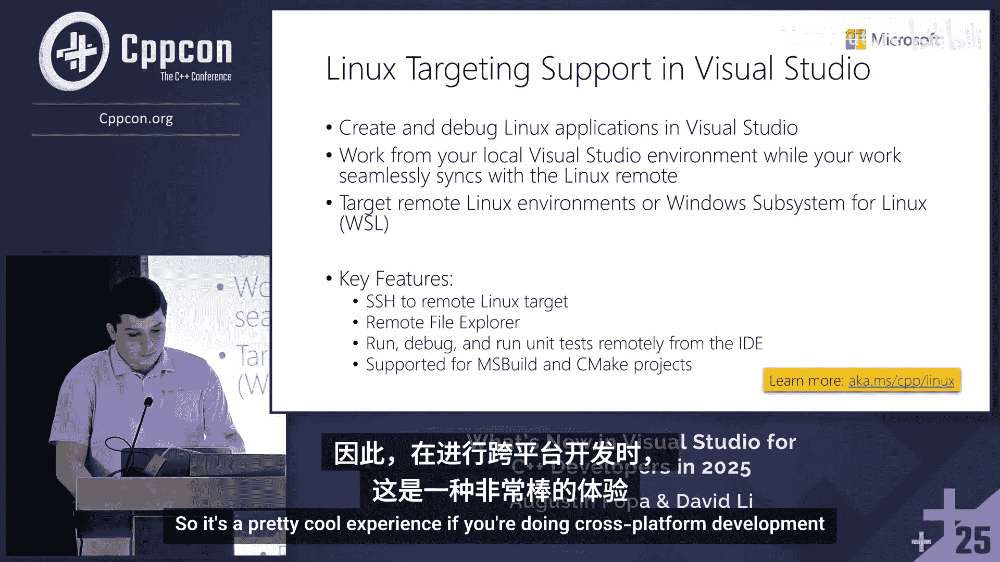

上一节我们看到了编辑和导航的改进，本节中我们来看看管理库和构建项目的改进。

首先，我想提醒大家，Visual Studio支持Clang。您可以从Visual Studio安装程序安装Windows的Clang工具。如果您是Clang用户，并且希望使用相同的编译器来定位多个平台，那么它在我们的项目系统中是受支持的。

但我想谈谈MSVC构建工具，这是我们为Windows开发提供的自己的编译器和构建工具。如果您想要优化的构建性能并构建安全的应用程序和库，我们一直在努力改进我们的STL、编译器和运行时性能，以确保您在Windows上构建C++代码时获得最佳体验。

在Visual Studio 2026中，我们有MSVC构建工具版本14.50。如果您使用MSBuild，您需要将平台工具集设置为v145来使用它。

我知道你们中的许多人可能对我们在C++一致性方面的进展有疑问。我们一直在添加更多C++23功能，我们真的在努力缩小差距，迎头赶上，并实现C++23的完全支持。这是我们当前的首要重点。我们添加了各种功能的列表，您可以看到格式化范围，这是我在演示中展示的。但我们正在继续努力，以完成剩余的C++23功能积压，这样我们就可以说我们完全支持C++23了。但现在，如果您想尝试它们，可以使用`/std:c++23`预览开关。在某个时候，这个预览开关将会消失，一旦我们完全完成，它就会直接是C++23。还有一个`/std:c++latest`开关，用于C++23之外的功能。

如果您想了解编译器和STL的最新改进，我们上周发布了一篇关于编译器更新和新的14.50版本的博客文章。如果您想查看STL的任何更新，Microsoft STL是开源的，我们对所有进展都非常透明。有一个很好的变更日志，显示了每个版本中添加的所有功能，还有一个总体视图，例如对于C++23，哪些已经完成，哪些还需要做。我建议您查看一下，如果您想了解更多。

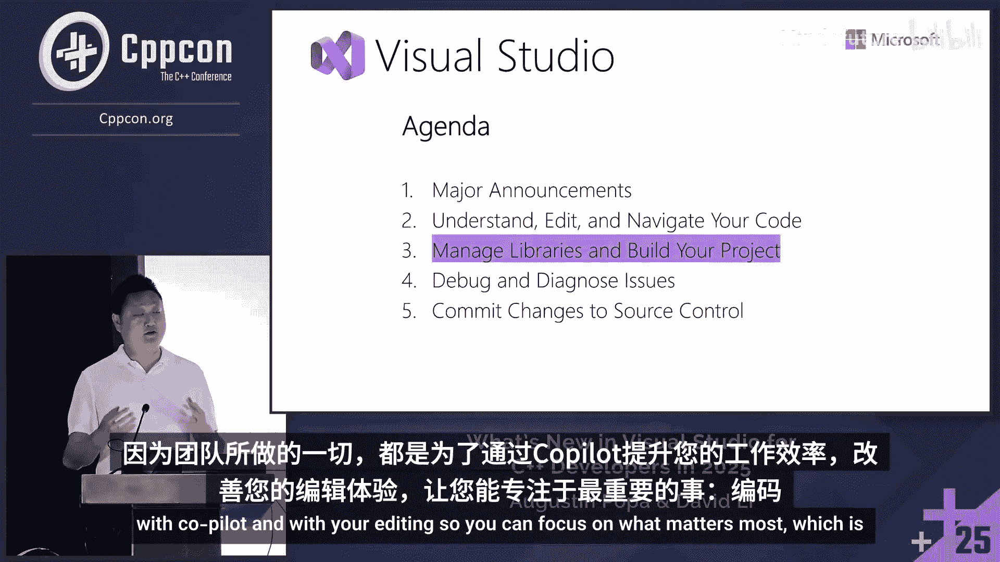

我们在C++26支持方面也取得了一些进展，包括标准库强化。当然，我们还有更多工作要做，所以我们正专注于实现C++23一致性，但我们将继续尽快推出更新。

在展台上，我收到了一些问题，比如“升级到最新编译器有哪些卖点？”其中一个首要原因是性能。我是一名游戏开发产品经理，与许多游戏开发者合作。对于游戏开发者和那些从事大型项目的人来说，运行时性能是一个重要关注点。

在过去的一年里，团队一直在非常努力地改进MSVC的运行时性能。我们与Epic Games合作，了解我们的编译器可以通过哪些方式变得更快。例如，我们正在使用Xbox Series配置对虚幻引擎城市样本进行MSVC基准测试。正如您在这里看到的，从17.14版本开始，我们已经有了很大的改进。在接下来的几周和几个月里，随着我们接近18.0的稳定版本，您将继续看到我们编译器的更多改进。

同样，我们在游戏线程的运行时性能方面也做了很多改进。所有这些都是通过更好的AVX向量化实现的。我们改进了结构体和分支的代码生成。

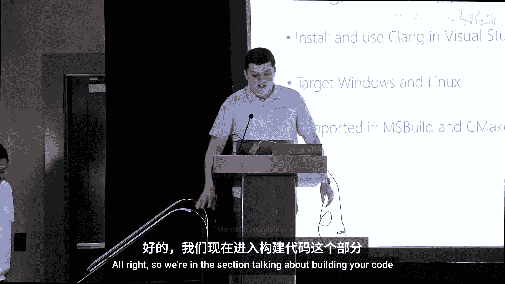

我知道构建性能和运行时性能是大家最关心的问题之一。所以，如果您还没有使用最新的编译器，请尝试说服您的团队升级到最新版本。如果所有这些性能改进还不够，我们还有C++构建洞察。

构建洞察是一个非常强大的工具，它利用MSVC跟踪捕获技术生成ETL文件。使用构建洞察，它将运行您的构建，获取ETL文件，您将能够看到许多不同的视图。例如，“头文件”视图，显示您的头文件是否可以包含在预编译头文件中，或者是否存在许多昂贵的头文件，这可能是使用预编译头文件的一个很好的理由。或者，您可以查看有关函数生成瓶颈或长模板实例化时间的信息。

因此，您手头有更多信息来改进构建性能。我们根据反馈添加了许多新的生活质量功能。您现在可以在选定的文件上运行构建洞察。有更好的过滤功能。

我们已经看到了与合作伙伴取得的巨大成功。有一个很好的案例研究，如果您想了解如何应用从构建洞察中获得的见解来更改代码，您可以访问链接，看看动视如何利用构建洞察将《现代战争》战区2的构建时间减少了50%。有很多好的经验，强烈建议查看这个案例研究。

---

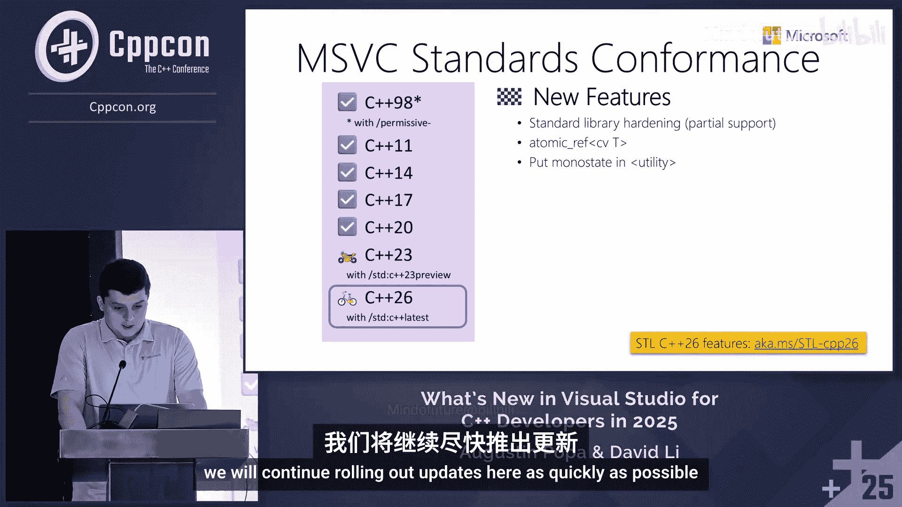

## 代码安全与调试诊断

上一节我们讨论了构建，本节中我们来看看代码安全性和调试诊断。

我想谈谈我们提供的几种工具，以帮助您提高代码安全性和安全性。我们从Microsoft C++代码分析体验开始。

这是Visual Studio的一部分，它在后台运行，就像您收到IntelliSense警告和错误一样。它基本上在后台运行静态分析，对于发现缓冲区溢出、未初始化内存、空指针解引用以及内存和资源泄漏等额外问题非常有用。它还附带了许多C++核心检查，以确保您的代码符合C++核心指南。因为您不仅仅要确保代码能够成功编译，还要确保代码使用最现代的功能，并且是安全的，代码结构使用了现代功能。

在过去的一年里，这个体验有一些改进。包括并发和锁定的新诊断。我们还增强了分配的溢出检测，以及一些改进的警告抑制。如果您想了解更多，可以访问链接。

我谈到了静态分析，但也有动态或运行时分析。如果您熟悉LLVM中的AddressSanitizer工具，我们也有适用于MSVC构建工具的版本。这是一个在程序运行时成为程序一部分的工具，如果您添加`/fsanitize=address`编译器标志，它将帮助您识别难以发现的错误，且零误报。

它识别了传统静态分析工具未捕获的另一类问题，因此我们建议同时运行代码分析体验和AddressSanitizer来验证您的代码更改，甚至只是在整个代码库中运行它，看看是否有任何历史问题过去从未被发现，以帮助您提高正确性、内存安全性、保护代码安全，并总体上对您的程序进行压力测试。

我还想在这里宣布，我们正在开发ARM64支持。它将在未来发布的Visual Studio 2026预览版中推出。这是目前可用的Visual Studio 2026的第一个预览版，但不久之后还会有更多更新，因此您将开始看到ARM64支持上线，这将允许您为ARM64项目使用`/fsanitize=address`进行构建。

最后，我想提一下Microsoft指南支持库，它提供了类型和函数来编写更安全、更易维护的代码，今年也更新到了4.2版本，增加了新功能和修复。开始使用它的一个好方法是通过vcpkg安装它。

说到vcpkg，这是我们的C++包管理器。您可以单独安装它，也可以作为Visual Studio本身的一部分安装。它是管理C++依赖项的一个很好的工具。vcpkg目前在其精选注册表中拥有超过2600个独特的库，这些库针对15种不同的常见构建配置进行了构建、测试和验证，以确保它们彼此兼容，并且没有ABI问题或版本冲突。如果您愿意，您也可以将自己的库引入vcpkg。

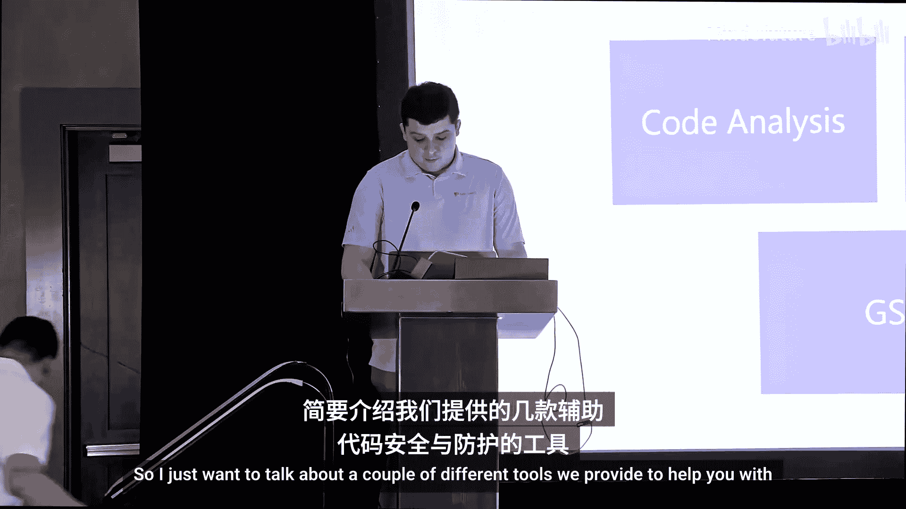

我们有许多高级功能来帮助您定制体验，无论您是学生还是专业开发人员。您可以控制您想要的库版本，控制这些库的构建方式，因为vcpkg采用从源代码构建的方法，您可以按照您希望的方式从源代码构建库，以便它们与消费项目和其他库一起工作。您只需要在第一次或更改构建配置时这样做，因为我们有二进制缓存来缓存这些二进制文件，以便将来可以重用它们。vcpkg会检测“我可以直接获取二进制文件吗？还是需要重新构建？”这可以为您节省大量时间。

vcpkg还可以在离线或隔离环境中与资产缓存功能一起工作，如果您有这种需求，我也建议您查看一下。

在过去的一年里，vcpkg有一些性能改进，这要归功于一些很棒的社区贡献，因为vcpkg是一个开源项目。我们提高了包安装速度和二进制缓存恢复性能。GitHub Dependabot最近也添加了对vcpkg的支持，因此如果您是GitHub用户，您可以基本上自动更新您的库。Dependabot所做的是向您的仓库提交一个PR，它会说“好的，这是更新的库列表”，它使用vcpkg的版本基线功能，因此您基本上可以更新vcpkg清单文件中的基线，这将一次性将所有依赖项更新到新版本，并且因为这些新版本都在同一个基线上，它们应该可以彼此兼容，而无需您去弄清楚需要设置哪个单独的vcpkg库版本来确保它们之间的兼容性。我绝对建议您尝试这个体验并给我们反馈。

---

## 调试与诊断演示

上一节我们讨论了代码编辑和构建的改进，但说到调试呢？作为一名游戏开发产品经理，我与许多AAA游戏开发者交流过，了解到游戏开发者面临的许多问题实际上也适用于日常的C++应用程序。如果您有一个非常大的项目，这一点尤其正确。

在开始演示之前，我想问一下房间里的各位，如果您有调试和发布配置，请举手。如果您最近尝试过调试发布版本，请举手。

那么，调试发布版本时常见的一些问题是什么？您的构建经过了高度优化，以追求速度。游戏开发者告诉我，在调试配置中，您会获得更多的调试支持，但帧率可能非常糟糕。如果您尝试在发布版本中做同样的事情，您可能无法看到所有局部变量，变量可能被优化掉了。非常常见的红色X。可能不是一个好现象，但不幸的是，它就在那里。此外，当您尝试单步执行代码时，您的指针到处跳转，您不知道它要去哪里，这不可靠。

那么，如果我告诉您，您可以两者兼得呢？如果您可以在发布构建中获得完整的调试能力呢？这就是我将在演示中向您展示的内容，以及通过调试和诊断周期的一些其他Copilot集成。

如您所见，我们正在运行这个Later Cy游戏，60 FPS。这是发布版本，不是调试构建。让我回到Visual Studio，重新激活我的断点。

我们现在处于一种叫做“新的C++动态调试模式”的状态。我首先想向您展示的是，如果您转到调用堆栈，您可以看到这个帧有一个新的“已去优化”标签。这意味着您当前查看的帧是去优化的。

它的工作原理是，我们构建您的二进制文件两次：一次是优化的（发布版），一次是未优化的。一旦您在那里设置断点，您就会进入去优化的版本。

那么我们能做什么呢？我们可以步入。现在我们在一个强制内联的函数中。如果您尝试调试发布构建，这是不可能的。我们还能做什么？我们可以步入下一个函数，即`calculate_transform_bounds`。我们有一些变量声明。如果我们查看自动窗口，我们可以看到所有变量。我们还能做什么？我们可以告诉它运行到光标处，因为现在指令指针实际上知道要去哪里。或者，您可以右键单击该行并设置下一条语句。

再次强调，这些并不是新的调试功能。这些是调试配置中长期以来可用的调试功能。但现在，您可以在调试发布构建时使用它们。

让我跳出这里，再展示一件事。我们只关心您关心的已去优化帧。如果我转到这个帧，例如，您会看到“场景”变量已优化的典型消息。那么如何解决这个问题呢？您可以选择您的帧，使用Ctrl或Shift选择多个，右键单击，然后选择“在下次进入时去优化”。一旦我点击它并让它再次中断，您将看到我们选择的所有帧，特别是之前的Chaos引擎接口帧，都已被去优化。在这里，场景变量对您可用。

我们将所有断点存储在一个去优化断点组中。您可以做的就是选择它们全部并删除它们。如果我禁用这个断点并按继续，您看，我的游戏回到了全帧率。这就是您如何通过动态调试获得完整调试能力的方法。

现在，我将再次设置断点。我想再向您展示一件事。之前，我们在一些渲染代码中，这可能是您看到网格故障或其他问题的常见地方。我们添加了并行堆栈的额外集成。因此，如果我们从渲染代码退一步，通过并行堆栈视图查看我们的代码整体，这是一个显示所有线程正在做什么的视图。虚幻引擎经过高度优化，有许多线程在运行。

您可能注意到的第一件事是我们添加了新的“线程摘要”。您不必猜测您的线程在做什么。Copilot会告诉您。还有一个“生成见解”按钮，如果您想了解更多关于当前应用程序状态的信息。

由于时间关系，我们将进入演示的下一部分。通过激活这个断点，并希望我多玩一会儿游戏，断点会激活。现在，我们在一些渲染代码中。我们看到了所有不同的线程。在这里，我想向您展示我们添加到调试器中的另一个功能。你们中有多少人熟悉条件和依赖断点？好的。

您可以做的一件事是，如果我在这里设置一个断点，然后转到条件，Copilot将帮助您找出一些条件。这是提高生产力的好方法。也许您已经有一些想法，但可能不是这样。在这个例子中，我没有具体的想法。“当前热量小于最大范围”，我认为这些都没有帮助。但如果我知道当“当前热量”是某个特定整数值时会发生某个动作呢？比如是4。这是您可以看到Copilot如何帮助您在整个循环中提高生产力的好方法。

在我们继续之前，还有一件事要提。到目前为止，我谈到的所有内容都不是游戏开发特有的。尽管我使用了虚幻引擎作为例子，但动态调试、并行堆栈和所有Copilot功能都非常适用于所有C++开发。

但对于虚幻引擎，我们最近与Epic Games合作，将蓝图调试添加到我们的调试器中。就像动态调试一样，您可以在调用堆栈窗口中看到一个新标签。它的作用是，当您停止时，您可以双击蓝图帧。

我们有一个提示，提醒您需要我们的Visual Studio集成工具。我将在演示后多谈一点，但一旦您点击蓝图帧，您现在可以转到您的蓝图。您可以看到所有蓝图变量，例如您的节点引脚，查看所有蓝图变量的值。例如，如果有一个您不熟悉的变量，比如“流堆栈”，它可能意味着什么？点击该变量旁边的小GitHub图标。

然后，GitHub Copilot将获取您当前应用程序状态的上下文，获取该变量信息，并为您提供非常详细的摘要，说明您的变量是什么，更重要的是，当您的程序停止时，您的变量值可能意味着什么。

调试器代理正在查看各种文件。它认为有些文件可用，但并非全部。您可以看到这里，我们有任务，有一个计划，为Copilot读取一定数量的C++文件以理解，然后它会为您提供“流堆栈”的值及其含义。

让我们回到演示文稿。

---

## 虚幻引擎特定改进与源代码控制

上一节我们深入探讨了调试，本节中我们来看看针对虚幻引擎的特定改进以及源代码控制的最新更新。

继我们的虚幻引擎特定改进之后，UProject是我们为虚幻引擎项目提供的新项目系统。与传统的解决方案打开方式相比，这非常有帮助。

使用UProject，虚幻引擎开发者将获得更快、更准确的IntelliSense，因为与解决方案相比，Visual Studio现在拥有更多额外的上下文。

正如我之前提到的，Visual Studio集成工具现在可以直接在Visual Studio中安装。我们实际上已将其从Fab市场移除，因为我们不再需要市场。蓝图引用也不再需要它，许多客户告诉我们这对他们很有价值。因此，我们已将该功能从插件移至Visual Studio原生支持。

但如果您想要额外的蓝图调试信息，则需要Visual Studio集成工具。正如我向您展示的，您可以在调用堆栈窗口中看到您的蓝图，以及在局部变量窗口中看到所有蓝图信息。

我还向您展示了Copilot在调试和诊断工作流程中的各种改进，特别是断点建议和变量分析。当然，并行堆栈是一个非常强大的工具，得益于Copilot而变得更好。

当然，今年我们团队最重要的事情是动态调试。您不再需要看到变量被优化掉，也不必使用`#pragma optimize`工作流程。我们一直与游戏开发者密切合作，现在在Visual Studio 17.14及更高版本中可用。我们有一篇非常详细的博客，向您展示如何激活C++动态调试。

正如我之前提到的，我们正在与许多内部合作伙伴合作，以确保该功能满足需求。从Coalition到Halo Studio的游戏开发者，再到Rare的开发者（Keith今天实际上就在观众席中）。因此，Keith将是了解动态调试如何在实践中工作的绝佳资源，因为他从一月份就开始使用它了。

一些额外的细节：动态调试仅支持x64。它适用于Xbox快速构建、Incredibuild和虚幻引擎5.6。它仍然适用于虚幻引擎5.5及更早版本，只需要挑选一些更改。它不支持LTCG、PGO、/uPICF和增量链接。我们在周四有一个深度探讨，我们的动态调试工程负责人将深入探讨团队如何提出动态调试的技术细节。

在最后一部分，我将交还给Augustin。

---

## 源代码控制改进与总结

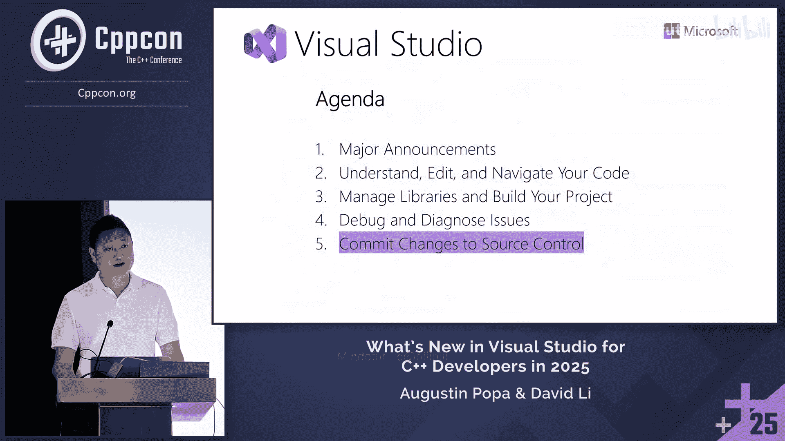

上一节我们讨论了调试，本节中我们来看看源代码控制的最新更新。

我向您展示了Visual Studio中可用的源代码控制功能，其中一些功能已经存在很长时间，但我们多年来一直在不断添加新功能。因此，如果您想拥有图形用户界面来管理源代码控制需求，Visual Studio提供了许多功能。

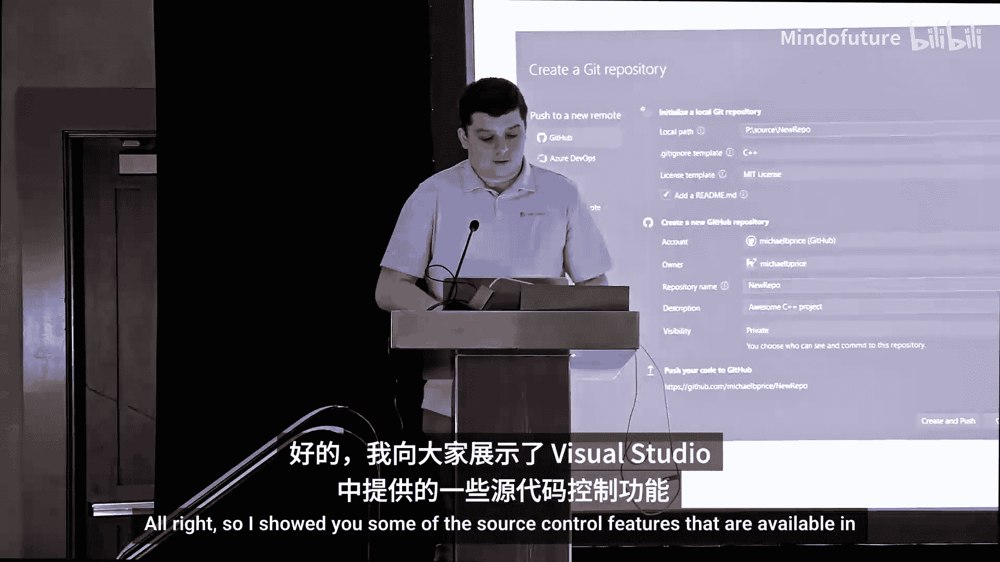

过去一年中的一些较新变化包括：重命名文件管理的改进、PR草稿和模板的支持。我们还支持内部GitHub仓库以及多仓库支持。然后，我还向您展示了编写和自定义Git提交消息的功能，并能够为它们设置模板，以便它始终遵循模板，并且通过查看文件中的差异，为您提供特定提交中更改内容的定制列表。

添加PR评论的功能也有一些改进，您可以自己添加PR评论，但我们还有一个代码审查功能，您可以让Copilot在提交时审查您的代码，并生成一些额外的评论，以防您遗漏了什么。同样，这可以在您做其他事情时在后台运行。

还有一个用于查看传出和传入提交的过滤器，在Git更改窗口中有一个新按钮。然后，在Visual Studio 2026的这个新版本中，有一个我没来得及展示的功能：如果您转到Copilot聊天，您可以输入类似`#git_changes`的内容，这基本上会为其提供一些上下文，专门查看您在Git中文件的更改情况。这对于总结尚未提交的更改或解释特定提交非常有用，它可以帮助弄清楚从A到B实际发生了什么变化。因此，您基本上可以在Copilot聊天中引用Git更改窗口中的特定提交和更改。

我们继续开发了使用Copilot进行代码审查的体验。这是在去年添加的，但我们在18.0版本中也进行了一些改进，因此它应该比以前更准确、更有用。最后，我们在PR差异视图中提供了内联评论。

现在我想提醒大家，Microsoft C++产品团队的使命是赋能每一位C++开发者及其团队取得更大成就。我们通过多年来一直发布的各种开发工具来实现这一目标。我们是Microsoft最古老的团队之一，多年来我们一直在继续开发我们的工具，以帮助您在C++开发中尽可能高效。我们很乐意听取您对我们工具的反馈，因为我们继续迭代并为您改进它们。

最后，提醒一下，我们在CPPCon还有其他Microsoft演讲。其中一些已经过去，但您可以在YouTube上观看。今天早上有一个VS Code演讲，本周晚些时候还有其他一些演讲。我还想提醒大家，请填写我们的调查问卷。角落有一个QR码，您可以访问链接。您的反馈对我们非常有价值，帮助我们决定未来更新Visual Studio、VS Code、MSVC、vcpkg或我们为您正在开发的任何其他内容时应该优先考虑什么。

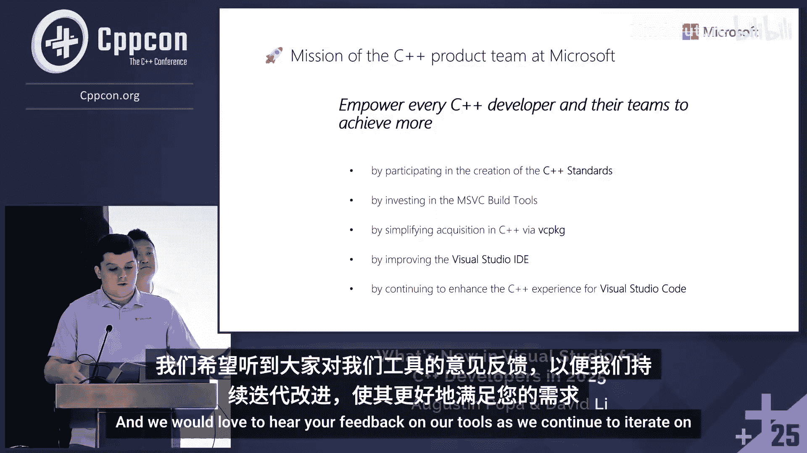

如果您填写了调查问卷，我们正在分发Visual Studio和Visual Studio Code的袜子。只要库存充足，如果您填写调查问卷并光临我们的展台，您就可以获得袜子，并且您还将参加今天、明天和周四的每日抽奖，赢取乐高奖品。

## 总结

在本节课中，我们一起学习了Visual Studio 2025为C++开发者带来的众多新功能和改进。我们从主要公告开始，了解了Visual Studio 2026预览版的发布。接着，我们深入探讨了编辑和导航的增强，特别是与GitHub Copilot的深度集成，包括“代理”模式、自定义指令和代码审查功能。

在项目管理与构建部分，我们回顾了MSVC构建工具的性能提升、C++23/26标准支持进展，以及vcpkg包管理器的改进。代码安全方面，我们介绍了静态分析、AddressSanitizer和指南支持库等工具。

调试与诊断是本次更新的重点，我们详细了解了全新的“C++动态调试模式”，它允许开发者在高度优化的发布构建中获得完整的调试能力。此外，还有针对虚幻引擎的蓝图调试等专有改进。

最后，我们探讨了源代码控制方面的更新，包括与Copilot集成的提交消息生成和代码审查。整个课程展示了Visual Studio团队如何致力于提升C++开发者的生产力，并通过持续收集反馈来指导产品发展方向。