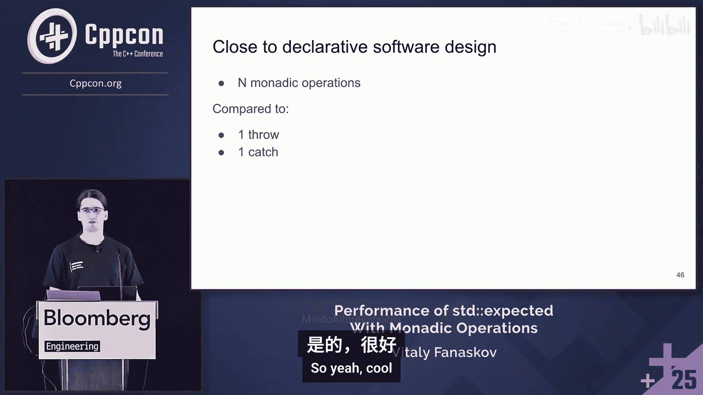

# 056：`std::expected`与单子操作真能提升你的C++代码性能吗？


在本节课中，我们将探讨C++中的错误处理机制，特别是`std::expected`与单子操作，并将其与传统的异常处理进行性能对比。我们将深入其实现细节，分析潜在的性能影响，并通过基准测试来观察实际表现。最后，我们将提供一些实用的优化建议。

---

## 错误处理概述

在开始比较之前，我们首先需要理解为什么需要错误处理。无论是使用`std::expected`、异常还是其他方法，其核心目的都是处理程序中可能出现的意外情况。

上一节我们介绍了错误处理的必要性，本节中我们来看看两种主要的现代C++错误处理方法：异常和`std::expected`。

### 异常处理

异常用于处理程序执行期间发生的未计划事件。当异常发生时，会创建一个特定类型的异常对象，并将其交给运行时系统。运行时系统会寻找匹配的`catch`块来处理它。如果找不到，程序通常会终止。

以下是异常安全性的四个级别：
*   **无异常保证**：不提供任何保证，是最糟糕的情况。
*   **基本异常保证**：程序状态保持有效，但数据可能丢失（例如，编辑文档时发生异常，程序未崩溃但更改丢失）。
*   **强异常保证**：操作要么完全成功，要么完全失败，状态回滚到操作之前，类似于事务。
*   **不抛异常保证**：操作保证不会抛出任何异常。

一个简单的异常示例：
```cpp
std::vector<int> vec{1, 2, 3};
try {
    int value = vec.at(3); // 访问越界，抛出 std::out_of_range
} catch (const std::out_of_range& e) {
    // 处理异常
}
```

### `std::expected` 简介

`std::expected<T, E>`是一个可以包含一个期望值（类型`T`）或一个错误（类型`E`的包装器。它类似于`std::optional`，但错误时携带了具体的错误信息，而不仅仅是“无值”。

一个基本的`std::expected`示例：
```cpp
std::expected<int, std::string> safe_sqrt(double x) {
    if (x < 0) {
        return std::unexpected("Invalid argument: negative value");
    }
    return std::sqrt(x);
}

auto result = safe_sqrt(-1.0);
if (result) {
    std::cout << "Value: " << *result << '\n';
} else {
    std::cout << "Error: " << result.error() << '\n';
}
```

为了更流畅地处理`std::expected`，我们可以使用单子操作（Monadic Operations）：
*   `and_then`: 如果存在值，则应用一个返回`std::expected`的函数。
*   `transform`: 如果存在值，则应用一个转换函数（可改变类型）。
*   `or_else`: 如果存在错误，则应用一个处理函数。
*   `transform_error`: 对错误进行转换。

```cpp
auto result = fetch_data()
    .and_then(parse_json)
    .transform(validate)
    .or_else([](auto error){ /* 错误恢复 */ });
```

---

## 实现细节与性能影响

了解了基本概念后，我们来看看`std::expected`和单子操作的内部实现，这有助于理解其性能特征。

### `std::expected` 的内部结构

`std::expected`内部通常包含一个联合体（union），用于存储值（`T`）或错误（`std::unexpected<E>`），以及一个布尔标志（`has_value`）来指示当前存储的是值还是错误。

这意味着：
1.  每次操作至少需要一次`if`检查来判断当前状态。
2.  在单子操作链中，每一步都可能涉及值的复制或移动（取决于类型`T`和`E`的移动语义）。
3.  返回类型可能改变，这可能阻碍编译器的返回值优化（RVO）。

### 单子操作的实现

以`and_then`和`transform`为例（简化版）：
它们首先检查`has_value`标志。如果为真，则调用传入的函数并包装结果；如果为假（即存在错误），则直接将错误传递下去。这个检查在每个单子操作步骤中都会发生。

潜在的性能问题包括：
*   **分支预测**：每个步骤的`if`检查可能影响流水线。
*   **拷贝/移动开销**：如果值或错误类型不支持高效移动，则会产生拷贝开销。
*   **阻碍优化**：复杂的返回类型链可能阻止编译器进行优化。

---

## 基准测试对比

理论分析之后，我们通过一些基准测试来观察异常和`std::expected`在实际中的性能表现。请注意，这些是合成测试，实际结果会因具体用例、数据类型和硬件而异。

测试方法：
*   **操作**：执行一系列轻量级操作（例如，递增计数器）。
*   **场景**：
    1.  **无错误**：所有操作成功。
    2.  **错误在开头**：第一个操作就失败。
    3.  **错误在中间**：在操作链中间失败。
    4.  **错误在末尾**：在操作链末尾失败。
*   **对比**：使用`try-catch`的异常代码 vs 使用单子操作的`std::expected`代码。

以下是测试的核心观察结果（基于特定测试环境，数值为示意）：
*   **无错误路径**：对于很长的操作链（例如10k次），`std::expected`的单子操作可能比单纯的`try`块（内部无异常抛出）**稍慢**，因为需要执行大量`if`检查。但`try`块本身也有极小的固有开销。
*   **错误发生在开头**：`std::expected`（立即返回`unexpected`）**显著快于**抛出并捕获一个异常。因为后者涉及堆分配、运行时栈展开等重操作。
*   **错误发生在中间或末尾**：随着操作链变长，两者性能差异逐渐缩小。对于较短的链（例如少于500次操作），性能可能相近。

**重要提示**：这些是微观基准测试的结果。在实际应用中，错误发生的频率、操作本身的成本、数据大小等因素会极大地影响最终选择。**你应该在自己的生产环境配置下，针对真实用例进行性能剖析。**

---

## 实用优化建议

根据前面的分析，我们总结出一些可以提升使用`std::expected`时代码效率的建议。

### 1. 避免不必要的拷贝

在单子操作链中，如果函数接受或返回大型对象，拷贝开销会累积。

**建议**：
*   确保你的值类型（`T`）和错误类型（`E`）支持高效的移动语义。
*   在调用单子操作（如`transform`）时，如果参数是临时对象或你可以安全地转移所有权，使用`std::move`。
    ```cpp
    std::expected<Noisy, std::string> result = get_result();
    auto final_result = std::move(result)
                          .transform([](Noisy n){ /* 处理 n */ }); // 使用移动
    ```
*   考虑使用智能指针（如`std::unique_ptr`）作为`std::expected`的值类型，这样“拷贝”实际上只是移动指针。

### 2. 使用 `std::reference_wrapper`

`std::expected`本身不支持引用类型。如果你需要传递引用以避免拷贝，可以使用`std::reference_wrapper`。

```cpp
MyLargeObject obj;
std::expected<std::reference_wrapper<MyLargeObject>, Error> result = obj;
// 使用时通过 .get() 获取引用
result.transform([](auto ref_obj) { ref_obj.get().do_something(); });
```
**注意**：你必须确保被引用对象的生命周期长于整个计算管道。

### 3. 利用原位构造

如果你需要在`std::expected`内部直接构造对象，而不是先构造再移动进去，可以使用`std::in_place`标签（对于值）或`std::unexpected`的构造函数（对于错误）。这可以避免一次额外的移动或拷贝。

```cpp
// 原位构造值
std::expected<Noisy, std::string> exp_val{std::in_place}; // 直接调用 Noisy()
// 原位构造错误
std::expected<int, Noisy> exp_err{std::unexpect, /* 构造Noisy的参数 */};
```

### 4. 保持数据类型简单


使用平凡可复制（Trivially Copyable）、标准布局（Standard Layout）的简单数据类型作为`std::expected`的模板参数。编译器更容易优化对这些类型的操作，移动和拷贝的成本也极低。

---

## 总结

本节课中我们一起学习了`std::expected`和单子操作，并与C++异常处理进行了性能对比。



**核心要点**：
1.  `std::expected`提供了异常之外的另一种类型安全的错误处理方式，尤其适合函数式编程风格。
2.  从性能角度看：
    *   **成功路径（无错误）**：对于超长调用链，`std::expected`的单子操作可能因频繁的`if`检查而略慢于无异常抛出的`try`块，但差异通常很小。
    *   **失败路径（有错误）**：`std::expected`在错误处理上通常**远快于**异常，因为它不涉及运行时栈展开等重型机制。错误发生得越早，优势越明显。
3.  性能受多种因素影响：数据类型（拷贝/移动成本）、操作链长度、错误发生频率、编译器优化能力等。
4.  可以通过一些技巧优化`std::expected`的使用：使用移动语义、`std::reference_wrapper`、原位构造以及选择简单的数据类型。


**最终建议**：没有绝对的赢家。选择`std::expected`还是异常，应基于项目的整体架构、团队习惯、与现有代码/库的兼容性以及对**可预测性能**的需求。如果错误是控制流的一部分且频繁发生，`std::expected`可能是更好的选择。如果错误是真正“异常”的、罕见的，异常处理可能更清晰。**务必在你自己的目标环境中进行基准测试和性能分析。**